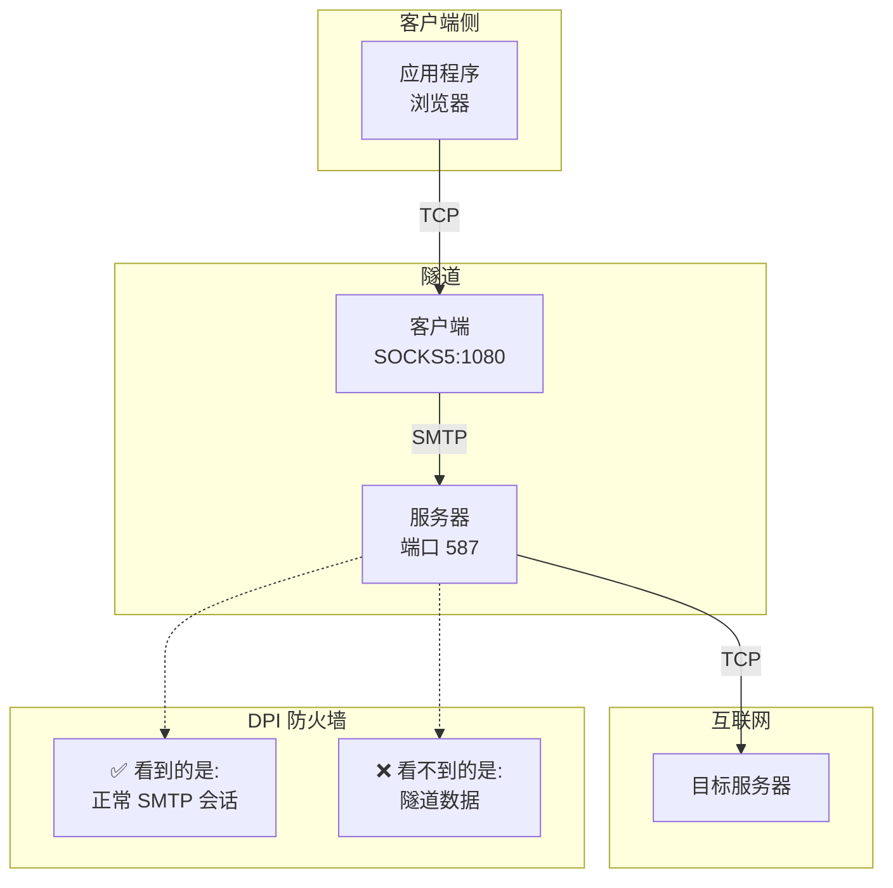

# 📧 SMTP 隧道代理

> **一种高速隐蔽隧道,将 TCP 流量伪装成 SMTP 邮件通信以绕过深度包检测(DPI)防火墙。**



---

## 🎯 功能特性

| 功能 | 描述 |
|---------|-------------|
| 🔒 **TLS 加密** | 所有流量在 STARTTLS 后使用 TLS 1.2+ 加密 |
| 🎭 **DPI 规避** | 初始握手模拟真实 SMTP 服务器(Postfix) |
| ⚡ **高速传输** | 握手后使用二进制流式协议 - 最小开销 |
| 👥 **多用户** | 每用户独立密钥、IP 白名单和日志设置 |
| 🔑 **身份验证** | 每用户预共享密钥,使用 HMAC-SHA256 |
| 🌐 **SOCKS5 代理** | 标准代理接口 - 适用于任何应用程序 |
| 📡 **多路复用** | 单个隧道上多个连接 |
| 🛡️ **IP 白名单** | 按用户通过 IP 地址/CIDR 进行访问控制 |
| 📦 **易于安装** | 一行命令安装服务器,包含 systemd 服务 |
| 🎁 **客户端包** | 为每个用户自动生成 ZIP 文件 |
| 🔄 **自动重连** | 客户端在连接丢失时自动重新连接 |

> 📚 有关深入的技术细节、协议规范和安全分析,请参阅 [TECHNICAL.md](TECHNICAL.md)。

---

## ⚡ 快速开始

### 📋 前置条件

- **服务器**: 安装了 Python 3.8+ 的 Linux VPS,开放端口 587
- **客户端**: 安装了 Python 3.8+ 的 Windows/macOS/Linux
- **域名**: 需要用于 TLS 证书验证(免费选项: [DuckDNS](https://www.duckdns.org), [No-IP](https://www.noip.com), [FreeDNS](https://freedns.afraid.org))

---

## 🚀 服务器设置 (VPS)

### 步骤 1️⃣: 获取域名

获取一个指向您的 VPS 的免费域名:
- 🦆 **[DuckDNS](https://www.duckdns.org)** - 推荐,简单且免费
- 🌐 **[No-IP](https://www.noip.com)** - 提供免费层级
- 🆓 **[FreeDNS](https://freedns.afraid.org)** - 许多域名选项

示例: `myserver.duckdns.org` → `203.0.113.50` (您的 VPS IP)

### 步骤 2️⃣: 运行安装程序

```bash
curl -sSL https://raw.githubusercontent.com/purpose168/smtp-tunnel-proxy/main/install.sh | sudo bash
```

安装程序将:
1. 📥 下载并安装所有内容
2. ❓ 询问您的域名
3. 🔐 自动生成 TLS 证书
4. 👤 提供创建第一个用户的选项
5. 🔥 配置防火墙
6. 🚀 启动服务

**就这样!** 您的服务器已准备就绪。

### ➕ 稍后添加更多用户

```bash
smtp-tunnel-adduser bob      # 添加用户 + 生成客户端 ZIP
smtp-tunnel-listusers        # 列出所有用户
smtp-tunnel-deluser bob      # 删除用户
```

### 🔄 更新服务器

```bash
smtp-tunnel-update           # 更新代码,保留配置/证书/用户
```

---

## 💻 客户端设置

### 选项 A: 简单方式 (推荐)

1. 从服务器管理员获取您的 `username.zip` 文件
2. 解压 ZIP 文件
3. 运行启动器:

| 平台 | 运行方式 |
|----------|------------|
| 🪟 **Windows** | 双击 `start.bat` |
| 🐧 **Linux** | 运行 `./start.sh` |
| 🍎 **macOS** | 运行 `./start.sh` |

启动器将自动安装依赖项并启动客户端。

✅ 您应该看到:
```
SMTP 隧道代理客户端
用户: alice

[INFO] 正在启动 SMTP 隧道...
[INFO] SOCKS5 代理将在 127.0.0.1:1080 上可用

正在连接到 myserver.duckdns.org:587
已连接 - 二进制模式激活
SOCKS5 代理在 127.0.0.1:1080
```

### 选项 B: 手动方式

```bash
cd alice
pip install -r requirements.txt
python client.py
```

### 选项 C: 自定义配置

```bash
# 下载文件
scp root@myserver.duckdns.org:/etc/smtp-tunnel/ca.crt .

# 创建 config.yaml:
cat > config.yaml << EOF
client:
  server_host: "myserver.duckdns.org"
  server_port: 587
  socks_port: 1080
  username: "alice"
  secret: "your-secret-from-admin"
  ca_cert: "ca.crt"
EOF

# 运行客户端
python client.py -c config.yaml
```

---

## 📖 使用方法

### 🌐 配置您的应用程序

将 SOCKS5 代理设置为: `127.0.0.1:1080`

#### 🦊 Firefox
1. 设置 → 网络设置 → 设置
2. 手动代理配置
3. SOCKS 主机: `127.0.0.1`, 端口: `1080`
4. 选择 SOCKS v5
5. ✅ 勾选"使用 SOCKS v5 时代理 DNS"

#### 🌐 Chrome
1. 安装 "Proxy SwitchyOmega" 扩展程序
2. 创建配置文件,设置 SOCKS5: `127.0.0.1:1080`

#### 🪟 Windows (系统范围)
设置 → 网络和 Internet → 代理 → 手动设置 → `socks=127.0.0.1:1080`

#### 🍎 macOS (系统范围)
系统偏好设置 → 网络 → 高级 → 代理 → SOCKS 代理 → `127.0.0.1:1080`

#### 🐧 Linux (系统范围)
```bash
export ALL_PROXY=socks5://127.0.0.1:1080
```

#### 💻 命令行

```bash
# curl
curl -x socks5h://127.0.0.1:1080 https://ifconfig.me

# git
git config --global http.proxy socks5://127.0.0.1:1080

# 环境变量
export ALL_PROXY=socks5://127.0.0.1:1080
```

### ✅ 测试连接

```bash
# 应该显示您的 VPS IP
curl -x socks5://127.0.0.1:1080 https://ifconfig.me
```

---

## ⚙️ 配置参考

### 🖥️ 服务器选项 (`config.yaml`)

| 选项 | 描述 | 默认值 |
|--------|-------------|---------|
| `host` | 监听接口 | `0.0.0.0` |
| `port` | 监听端口 | `587` |
| `hostname` | SMTP 主机名(必须与证书匹配) | `mail.example.com` |
| `cert_file` | TLS 证书路径 | `server.crt` |
| `key_file` | TLS 私钥路径 | `server.key` |
| `users_file` | 用户配置路径 | `users.yaml` |
| `log_users` | 全局日志设置 | `true` |

### 👥 用户选项 (`users.yaml`)

每个用户可以有独立的设置:

```yaml
users:
  alice:
    secret: "auto-generated-secret"
    # whitelist:              # 可选: 限制特定 IP
    #   - "192.168.1.100"
    #   - "10.0.0.0/8"        # 支持 CIDR 表示法
    # logging: true           # 可选: 禁用此用户的日志记录

  bob:
    secret: "another-secret"
    whitelist:
      - "203.0.113.50"        # Bob 只能从此 IP 连接
    logging: false            # 不记录 Bob 的活动
```

| 选项 | 描述 | 默认值 |
|--------|-------------|---------|
| `secret` | 用户的身份验证密钥 | 必需 |
| `whitelist` | 此用户的允许 IP(支持 CIDR) | 所有 IP |
| `logging` | 为此用户启用活动日志记录 | `true` |

### 💻 客户端选项

| 选项 | 描述 | 默认值 |
|--------|-------------|---------|
| `server_host` | 服务器域名 | 必需 |
| `server_port` | 服务器端口 | `587` |
| `socks_port` | 本地 SOCKS5 端口 | `1080` |
| `socks_host` | 本地 SOCKS5 接口 | `127.0.0.1` |
| `username` | 您的用户名 | 必需 |
| `secret` | 您的身份验证密钥 | 必需 |
| `ca_cert` | 用于验证的 CA 证书 | 推荐 |

---

## 📋 服务管理

```bash
# 检查状态
sudo systemctl status smtp-tunnel

# 配置更改后重启
sudo systemctl restart smtp-tunnel

# 查看日志
sudo journalctl -u smtp-tunnel -n 100

# 卸载
sudo /opt/smtp-tunnel/uninstall.sh
```

---

## 🔧 命令行选项

### 🖥️ 服务器
```bash
python server.py [-c CONFIG] [-d]

  -c, --config    配置文件(默认: config.yaml)
  -d, --debug     启用调试日志
```

### 💻 客户端
```bash
python client.py [-c CONFIG] [--server HOST] [--server-port PORT]
                 [-p SOCKS_PORT] [-u USERNAME] [-s SECRET] [--ca-cert FILE] [-d]

  -c, --config      配置文件(默认: config.yaml)
  --server          覆盖服务器域名
  --server-port     覆盖服务器端口
  -p, --socks-port  覆盖本地 SOCKS 端口
  -u, --username    您的用户名
  -s, --secret      覆盖密钥
  --ca-cert         CA 证书路径
  -d, --debug       启用调试日志
```

### 👥 用户管理
```bash
smtp-tunnel-adduser <username> [-u USERS_FILE] [-c CONFIG] [--no-zip]
    添加新用户并生成客户端包

smtp-tunnel-deluser <username> [-u USERS_FILE] [-f]
    删除用户(使用 -f 跳过确认)

smtp-tunnel-listusers [-u USERS_FILE] [-v]
    列出所有用户(使用 -v 查看详细信息)

smtp-tunnel-update
    更新服务器到最新版本(保留配置/证书/用户)
```

---

## 📁 文件结构

```
smtp_proxy/
├── 📄 server.py               # 服务器(在 VPS 上运行)
├── 📄 client.py               # 客户端(在本地运行)
├── 📄 common.py               # 共享工具
├── 📄 generate_certs.py       # 证书生成器
├── 📄 config.yaml             # 服务器/客户端配置
├── 📄 users.yaml              # 用户数据库
├── 📄 requirements.txt        # Python 依赖项
├── 📄 install.sh              # 一行命令服务器安装程序
├── 📄 smtp-tunnel.service     # Systemd 单元文件
├── 🔧 smtp-tunnel-adduser     # 添加用户脚本
├── 🔧 smtp-tunnel-deluser     # 删除用户脚本
├── 🔧 smtp-tunnel-listusers   # 列出用户脚本
├── 🔧 smtp-tunnel-update      # 更新服务器脚本
├── 📄 README.md               # 本文件
└── 📄 TECHNICAL.md            # 技术文档
```

### 📦 安装路径 (运行 install.sh 后)

```
/opt/smtp-tunnel/             # 应用程序文件
/etc/smtp-tunnel/             # 配置文件
  ├── config.yaml             # 服务器/客户端配置
  ├── users.yaml              # 用户数据库
  ├── server.crt              # 服务器证书
  ├── server.key              # 服务器私钥
  └── ca.crt                  # 根 CA 证书  
/usr/local/bin/               # 管理命令
  ├── smtp-tunnel-adduser     # 添加用户脚本
  ├── smtp-tunnel-deluser     # 删除用户脚本
  ├── smtp-tunnel-listusers   # 列出用户脚本
  └── smtp-tunnel-update      # 更新服务器脚本  
```

---

## 🔧 故障排除

### ❌ "Connection refused" (连接被拒绝)
- 检查服务器是否运行: `systemctl status smtp-tunnel` 或 `ps aux | grep server.py`
- 检查端口是否开放: `netstat -tlnp | grep 587`
- 检查防火墙: `ufw status`

### ❌ "Auth failed" (身份验证失败)
- 验证 `username` 和 `secret` 在 users.yaml 中匹配
- 检查服务器时间是否准确(在 5 分钟内)
- 运行 `smtp-tunnel-listusers -v` 以验证用户存在

### ❌ "IP not whitelisted" (IP 不在白名单中)
- 检查 users.yaml 中的用户白名单
- 您的当前 IP 必须匹配白名单条目
- 支持 CIDR 表示法(例如, `10.0.0.0/8`)

### ❌ "Certificate verify failed" (证书验证失败)
- 确保您使用的是域名,而不是 IP 地址
- 验证 `server_host` 与证书主机名匹配
- 确保您拥有来自服务器的正确 `ca.crt`

### 🐛 调试模式

```bash
# 启用详细日志记录
python server.py -d
python client.py -d

# 查看 systemd 日志
journalctl -u smtp-tunnel -f
```

---

## 🔐 安全说明

- ✅ **始终使用域名** 以进行正确的 TLS 验证
- ✅ **始终使用 `ca_cert`** 以防止中间人攻击
- ✅ **使用 `smtp-tunnel-adduser`** 自动生成强密钥
- ✅ **使用每用户 IP 白名单** 如果您知道客户端 IP
- ✅ **保护 `users.yaml`** - 包含所有用户密钥(chmod 600)
- ✅ **禁用日志记录** 对于敏感用户,使用 `logging: false`

> 📚 有关详细的安全分析和威胁模型,请参阅 [TECHNICAL.md](TECHNICAL.md)。

---

## 📄 许可证

本项目仅供教育和授权使用。请负责任地使用,并遵守适用法律。

---

## ⚠️ 免责声明

本工具旨在用于合法的隐私和审查规避目的。用户有责任确保其使用符合适用法律和法规。

---

*为互联网自由而制作 ❤️*
## Star History

[](https://www.star-history.com/#purpose168/smtp-tunnel-proxy&type=date&legend=top-left)