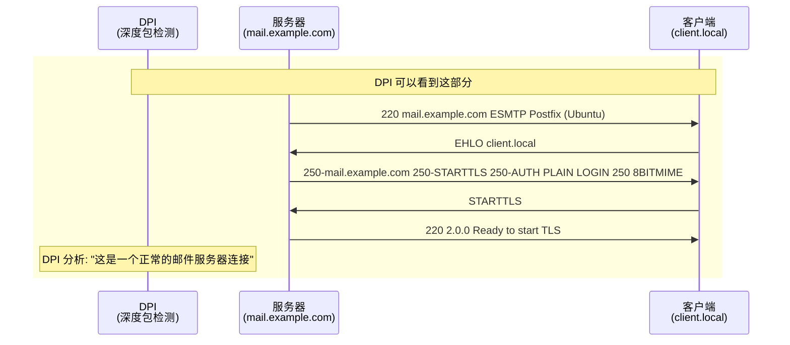
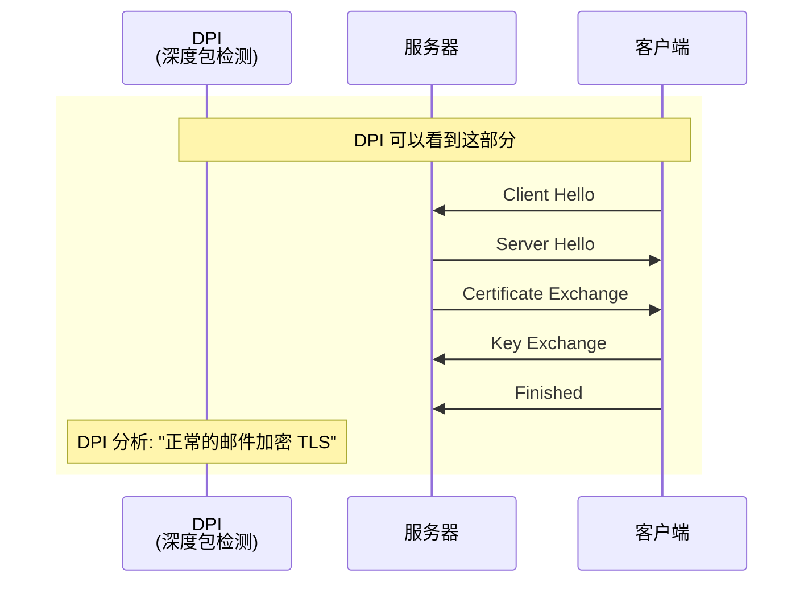
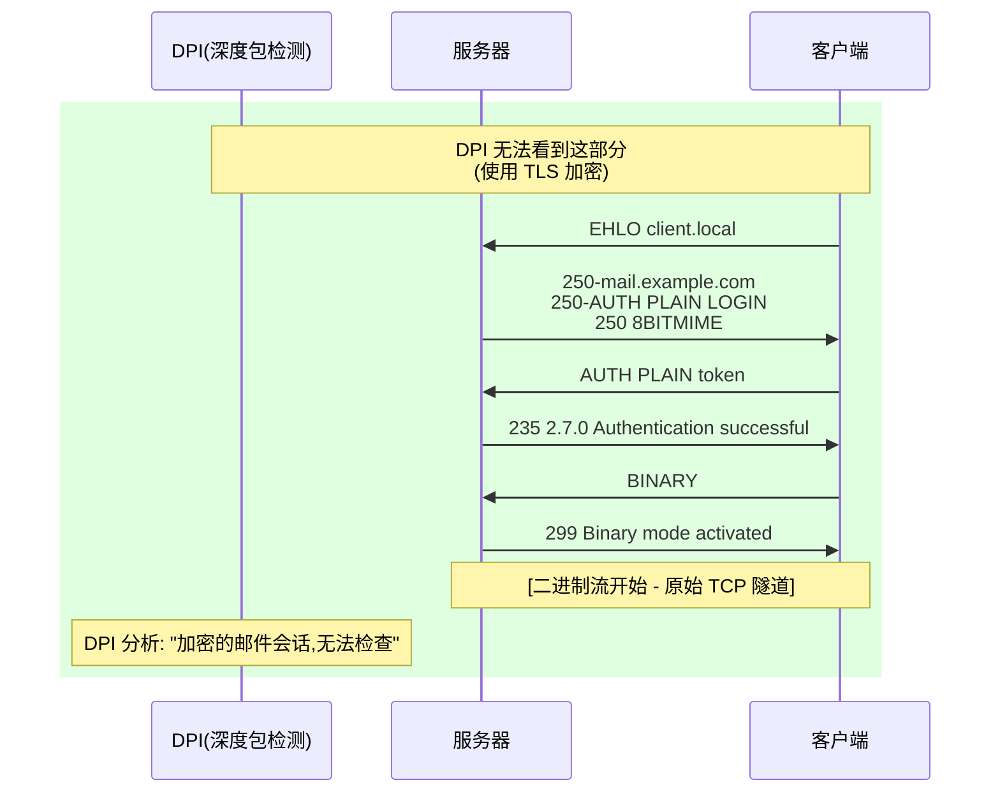
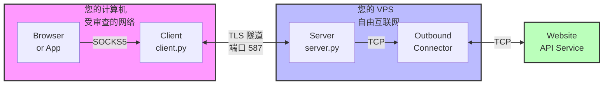
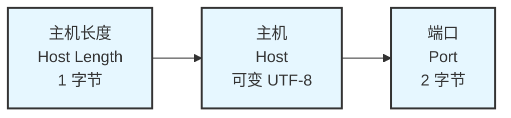
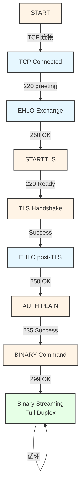
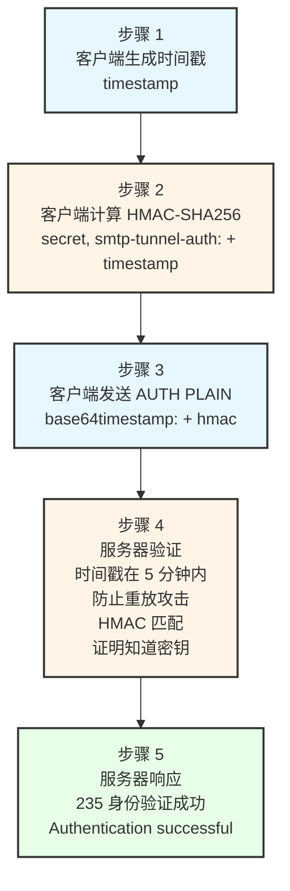
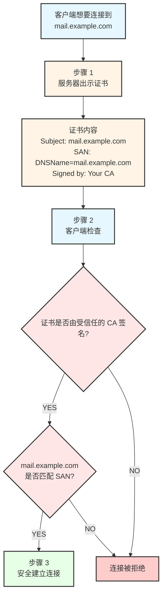
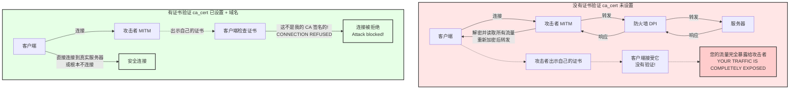
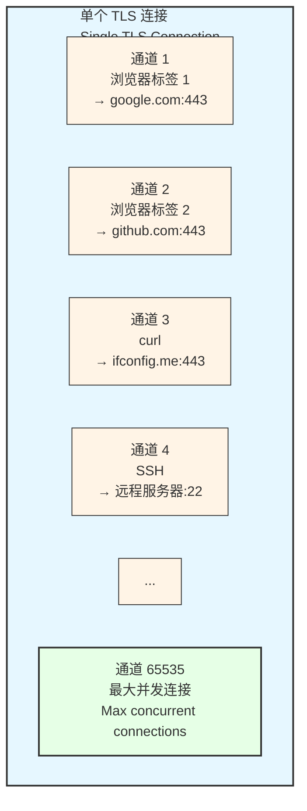

# 📧 SMTP 隧道 - 技术文档

本文档提供了关于 SMTP 隧道代理的深入技术细节,包括协议设计、DPI 规避技术、安全分析和实现细节。

> 📖 有关基本设置和使用方法,请参阅 [README.md](README.md)。

---

## 📑 目录

- [📨 为什么选择 SMTP?](#-为什么选择-smtp)
- [🎭 如何绕过 DPI](#-如何绕过-dpi)
- [⚡ 为什么快速](#-为什么快速)
- [🏗️ 架构](#️-架构)
- [📐 协议设计](#-协议设计)
- [🔧 组件详细说明](#-组件详细说明)
- [🔐 安全分析](#-安全分析)
- [🌐 域名与 IP 地址](#-域名与-ip-地址-安全影响)
- [⚙️ 高级配置](#️-高级配置)

---

## 📨 为什么选择 SMTP?

SMTP (Simple Mail Transfer Protocol,简单邮件传输协议) 是用于发送电子邮件的协议。它是隧道传输的绝佳选择,因为:

### 1️⃣ 普遍存在的流量
- 电子邮件是基础设施 - 阻止它会破坏合法服务
- 端口 587 (submission,提交) 上的 SMTP 流量是预期和正常的
- 每秒有数百万封电子邮件在网络中传输

### 2️⃣ 预期会被加密
- STARTTLS 是 SMTP 的标准 - 加密邮件是正常的
- DPI 系统预期会看到 TLS 加密的 SMTP 流量
- 加密内容不会引起怀疑

### 3️⃣ 灵活的协议
- SMTP 允许大数据传输(附件)
- 二进制数据是正常的(MIME 编码的附件)
- 长期连接是可以接受的

### 4️⃣ 难以阻止
- 阻止端口 587 会中断所有人的电子邮件
- 在 TLS 之后无法轻易区分隧道和真实邮件
- 需要阻止所有加密的电子邮件

---

## 🎭 如何绕过 DPI

深度包检测(DPI,Deep Packet Inspection)系统分析网络流量以识别和阻止某些协议或内容。以下是 SMTP 隧道如何规避检测:

### 🔍 阶段 1: 欺骗(明文)



**DPI 看到的是:**
- 来自 "Postfix" 邮件服务器的标准 SMTP 问候
- 正常的功能协商
- STARTTLS 升级(安全邮件所预期)

**使其令人信服的原因:**
- 问候语匹配真实的 Postfix 服务器
- 功能列表是现实的
- 符合 RFC 5321 规范
- 端口 587 是标准的 SMTP 提交端口

### 🔒 阶段 2: TLS 握手



**DPI 看到的是:**
- 标准 TLS 握手
- 邮件域的服务器证书
- 正常的密码协商

### 🚀 阶段 3: 加密隧道(不可见)



**DPI 看到的是:**
- 加密的 TLS 流量
- 数据包大小和时间与邮件一致
- 无法检查内容

**实际发生的是:**
- 使用预共享密钥进行身份验证
- 切换到二进制流模式
- 全速 TCP 隧道传输

### ❌ 为什么 DPI 无法检测它

| DPI 技术 | 为什么失败 |
|---------------|--------------|
| **端口分析** | 使用标准 SMTP 端口 587 |
| **协议检测** | 初始握手是有效的 SMTP |
| **TLS 指纹识别** | 标准 Python SSL 库 |
| **数据包大小分析** | 可变大小,类似于邮件 |
| **时序分析** | 没有明显的模式 |
| **深度检查** | 内容使用 TLS 加密 |

---

## ⚡ 为什么快速

以前的版本对每个数据包使用 SMTP 命令,需要:
- 每个数据块 4 次往返(MAIL FROM → RCPT TO → DATA → 响应)
- Base64 编码(33% 开销)
- MIME 包装(更多开销)

### 🚀 新方法: 协议升级

```mermaid
graph TD
    subgraph Handshake["握手阶段<br/>(仅一次)"]
        A[EHLO → STARTTLS → TLS → EHLO → AUTH → BINARY]
        B[时间: ~200-500ms (取决于网络延迟)]
    end

    subgraph Streaming["流式传输阶段<br/>(会话的其余部分)"]
        C[帧格式]
        D[┌─────────┬────────────┬────────────┬─────────────┐]
        E[│  类型   │ 通道 ID     │   长度     │   负载       │]
        F[│ 1 字节  │  2 字节     │  2 字节    │  N 字节      │]
        G[└─────────┴────────────┴────────────┴─────────────┘]
        H[特点]
        I[• 全双工 - 同时发送和接收]
        J[• 无需等待响应]
        K[• 每帧 5 字节开销<br/>(对比 SMTP 的数百字节)]
        L[• 原始二进制 - 无 base64 编码]
        M[• 仅受网络带宽限制的速度]
    end

    Handshake --> Streaming

    style Handshake fill:#ffebcc,stroke:#333,stroke-width:2px
    style Streaming fill:#e6f7ff,stroke:#333,stroke-width:2px
```

### 📊 性能比较

| 指标 | 旧 SMTP 方法 | 新二进制方法 |
|--------|-----------------|-------------------|
| **每个数据包的开销** | ~500+ 字节 | 5 字节 |
| **每次发送的往返次数** | 4 | 0 (流式传输) |
| **编码开销** | 33% (base64) | 0% |
| **双工模式** | 半双工 | 全双工 |
| **有效速度** | ~10-50 KB/s | 受带宽限制 |

---

## 🏗️ 架构

### 🖥️ 系统组件



### 📡 数据流

```
1. 浏览器想要访问 https://example.com

2. 浏览器 → SOCKS5 (client.py:1080)
   "CONNECT example.com:443"

3. 客户端 → 服务器(端口 587,看起来像 SMTP)
   [FRAME: CONNECT, channel=1, "example.com:443"]

4. 服务器 → example.com:443
   [打开真实的 TCP 连接]

5. 服务器 → 客户端
   [FRAME: CONNECT_OK, channel=1]

6. 浏览器 ↔ 客户端 ↔ 服务器 ↔ example.com
   [双向数据流式传输]
```

---

## 📐 协议设计

### 📦 帧格式(二进制模式)

握手后的所有通信都使用这种简单的二进制帧格式:

```mermaid
graph LR
    subgraph Frame["二进制帧格式"]
        A[类型<br/>Type<br/>1 字节] --> B[通道 ID<br/>Channel ID<br/>2 字节]
        B --> C[长度<br/>Length<br/>2 字节]
        C --> D[长度<br/>Length<br/>2 字节]
        D --> E[负载<br/>Payload<br/>可变]
        E --> F[负载<br/>Payload<br/>(继续)]
    end

    G[类型说明<br/>0x01 = DATA - 隧道数据<br/>0x02 = CONNECT - 打开新通道<br/>0x03 = CONNECT_OK - 连接成功<br/>0x04 = CONNECT_FAIL - 连接失败<br/>0x05 = CLOSE - 关闭通道]

    H[通道 ID: 标识连接<br/>支持 65535 个同时连接]

    I[长度: 负载大小<br/>最大 65535 字节]

    J[负载: 实际数据]

    Frame -.-> G
    Frame -.-> H
    Frame -.-> I
    Frame -.-> J

    style Frame fill:#e6f7ff,stroke:#333,stroke-width:2px
    style G fill:#fff4e6,stroke:#333,stroke-width:1px
    style H fill:#fff4e6,stroke:#333,stroke-width:1px
    style I fill:#fff4e6,stroke:#333,stroke-width:1px
    style J fill:#fff4e6,stroke:#333,stroke-width:1px
```

### 🔗 CONNECT 负载格式



### 🔄 会话状态机



---

## 🔧 组件详细说明

### 🖥️ server.py - 服务器组件

**目的:** 在未受审查的网络中的 VPS 上运行。接受隧道连接并将流量转发到真实的互联网。

**它的功能:**
- 在端口 587 上监听(SMTP 提交)
- 将自己呈现为 Postfix 邮件服务器
- 处理 SMTP 握手(EHLO, STARTTLS, AUTH)
- 身份验证后切换到二进制流式传输模式
- 管理多个隧道通道
- 将数据转发到目标服务器
- 通过隧道发送响应

**关键类:**
| 类 | 描述 |
|-------|-------------|
| `TunnelServer` | 主服务器,接受连接 |
| `TunnelSession` | 处理一个客户端连接 |
| `Channel` | 表示一个隧道 TCP 连接 |

### 💻 client.py - 客户端组件

**目的:** 在本地计算机上运行。提供 SOCKS5 代理接口并通过服务器隧道传输流量。

**它的功能:**
- 在 localhost:1080 上运行 SOCKS5 代理服务器
- 连接到端口 587 上的隧道服务器
- 执行 SMTP 握手以看起来合法
- 切换到二进制流式传输模式
- 在单个隧道上多路复用多个连接
- 处理来自应用程序的 SOCKS5 CONNECT 请求

**关键类:**
| 类 | 描述 |
|-------|-------------|
| `TunnelClient` | 管理与服务器的连接 |
| `SOCKS5Server` | 本地 SOCKS5 代理 |
| `Channel` | 一个代理连接 |

### 📚 common.py - 共享工具

**目的:** 客户端和服务器之间共享的代码。

**它包含:**
| 组件 | 描述 |
|-----------|-------------|
| `TunnelCrypto` | 处理身份验证令牌 |
| `TrafficShaper` | 填充和时序(可选的隐蔽) |
| `SMTPMessageGenerator` | 生成真实的邮件内容(遗留) |
| `FrameBuffer` | 从流中解析二进制帧 |
| `load_config()` | YAML 配置加载器 |
| `ServerConfig` | 服务器配置数据类 |
| `ClientConfig` | 客户端配置数据类 |

### 🔐 generate_certs.py - 证书生成器

**目的:** 为隧道创建 TLS 证书。

**它生成:**
| 文件 | 描述 |
|------|-------------|
| `ca.key` | 证书颁发机构私钥 |
| `ca.crt` | 证书颁发机构证书 |
| `server.key` | 服务器私钥 |
| `server.crt` | 服务器证书(由 CA 签名) |

**功能:**
- 证书中可自定义主机名
- 可配置密钥大小(默认 2048 位 RSA)
- 可配置有效期
- 包含 TLS 服务器身份验证的适当扩展

---

## 🔐 安全分析

### 🔑 身份验证流程



### 🔒 加密层

| 层 | 保护 |
|-------|------------|
| **TLS 1.2+** | STARTTLS 后的所有流量 |
| **预共享密钥** | 身份验证 |
| **HMAC-SHA256** | 令牌完整性 |

### ⚠️ 威胁模型

| 威胁 | 缓解措施 |
|--------|------------|
| 被动窃听 | TLS 加密 |
| 主动 MITM | 证书验证(需要域名) |
| 重放攻击 | 时间戳验证(5 分钟窗口) |
| 未授权访问 | 预共享密钥身份验证 |
| 协议检测 | 握手期间的 SMTP 模拟 |

### ✅ 安全建议

1. **使用强密钥:** 使用 `python -c "import secrets; print(secrets.token_urlsafe(32))"` 生成

2. **保持密钥安全:** 永远不要提交到版本控制,安全共享

3. **使用证书验证:** 将 `ca.crt` 复制到客户端并在配置中设置 `ca_cert`

4. **限制服务器访问:** 如果可能,使用白名单限制源 IP

5. **监控日志:** 观察失败的身份验证尝试

6. **定期更新:** 保持 Python 和依赖项最新

---

## 🌐 域名 vs IP 地址: 安全影响

### 🔍 理解 TLS 证书验证

TLS 证书是证明服务器身份的数字文档。当客户端连接到服务器时,它可以验证:

1. **证书由受信任的机构签名**(在我们的案例中是您自己的 CA)
2. **证书与您连接的目标匹配**(主机名/IP 验证)



### ❌ IP 地址问题

TLS 证书在**主题备用名称(SAN)**扩展的特定字段中存储标识符:

| 标识符类型 | SAN 字段类型 | 示例 |
|-----------------|----------------|---------|
| 域名 | `DNSName` | `mail.example.com` |
| IP 地址 | `IPAddress` | `192.168.1.100` |

**这些是不同的字段类型。** 使用 `--hostname 192.168.1.100` 生成的证书会创建:

```
SAN: DNSName = "192.168.1.100"    ← 这是实际发生的情况
SAN: IPAddress = 192.168.1.100   ← 这是需要的情况
```

当 TLS 库验证到 IP 地址的连接时,它会查找匹配的 `IPAddress` 字段,**而不是** `DNSName` 字段。即使值相同,类型也不匹配,因此验证失败。

### 🚨 中间人攻击解释

当禁用证书验证时,攻击者可以拦截您的连接:



### 📊 安全选项对比

| 配置 | 防止 MITM? | 可用? | 推荐? |
|---------------|-----------------|--------|--------------|
| 域名 + `ca_cert` 已设置 | **是** | 是 | **最佳** |
| 域名 + 无 `ca_cert` | 否 | 是 | 不理想 |
| IP 地址 + `ca_cert` 已设置 | — | 否 | 不可用 |
| IP 地址 + 无 `ca_cert` | 否 | 是 | 易受攻击 |

### 🎯 风险评估

| 威胁 | 有验证 | 无验证 |
|--------|-------------------|----------------------|
| 被动窃听 | 受保护 (TLS) | 受保护 (TLS) |
| ISP 主动 MITM | 受保护 | **易受攻击** |
| 政府 主动 MITM | 受保护 | **易受攻击** |
| 服务器冒充 | 受保护 | **易受攻击** |
| DPI 规避 | 可用 | 可用 |

**结论:** TLS 加密在两种情况下都能防止被动窃听。但只有使用证书验证才能防止**主动**攻击,即有人拦截并冒充您的服务器。

---

## ⚙️ 高级配置

### 📝 完整配置参考

```yaml
# ============================================================================
# 服务器配置 (用于 VPS 上的 server.py)
# ============================================================================
server:
  # 监听接口
  # "0.0.0.0" = 所有接口 (推荐)
  # "127.0.0.1" = 仅本地主机
  host: "0.0.0.0"

  # 监听端口
  # 587 = SMTP 提交 (推荐,邮件的标准端口)
  # 465 = SMTPS (替代方案)
  # 25 = SMTP (经常被阻止)
  port: 587

  # SMTP 问候和 TLS 证书的主机名
  # 应该与您的服务器 DNS 名称匹配以确保真实性
  hostname: "mail.example.com"

  # 身份验证的预共享密钥
  # 客户端和服务器上必须相同
  # 生成方法: python -c "import secrets; print(secrets.token_urlsafe(32))"
  secret: "CHANGE-ME-TO-RANDOM-SECRET"

  # TLS 证书文件
  cert_file: "server.crt"
  key_file: "server.key"

  # IP 白名单 (可选)
  # 空列表 = 允许所有连接
  # 支持单个 IP 和 CIDR 表示法
  whitelist: []
  # whitelist:
  #   - "192.168.1.100"
  #   - "10.0.0.0/8"

# ============================================================================
# 客户端配置 (用于本地机器上的 client.py)
# ============================================================================
client:
  # 服务器域名 (证书验证需要 FQDN)
  # 使用免费 DNS: DuckDNS, No-IP, FreeDNS, Dynu 或 CloudFlare
  server_host: "yourdomain.duckdns.org"

  # 服务器端口 (必须与服务器配置匹配)
  server_port: 587

  # 本地 SOCKS5 代理端口
  socks_port: 1080

  # 本地 SOCKS5 绑定地址
  # "127.0.0.1" = 仅本地主机 (推荐)
  # "0.0.0.0" = 允许外部连接 (谨慎使用!)
  socks_host: "127.0.0.1"

  # 预共享密钥 (必须与服务器匹配!)
  secret: "CHANGE-ME-TO-RANDOM-SECRET"

  # 服务器验证的 CA 证书 (推荐)
  # 防止中间人攻击所必需
  # 将 ca.crt 从服务器复制到客户端
  ca_cert: "ca.crt"

# ============================================================================
# 隐身配置 (可选,用于传统 SMTP 模式)
# ============================================================================
stealth:
  # 消息之间的随机延迟范围 (毫秒)
  min_delay_ms: 50
  max_delay_ms: 500

  # 消息填充大小
  pad_to_sizes:
    - 4096
    - 8192
    - 16384

  # 虚假消息的概率
  dummy_message_probability: 0.1
```

### 📜 SMTP 协议合规性

隧道在握手期间实现这些 SMTP RFC:
- **RFC 5321** - 简单邮件传输协议
- **RFC 3207** - 通过 TLS 的安全 SMTP 服务扩展
- **RFC 4954** - SMTP 身份验证服务扩展

### 📡 多路复用

多个 TCP 连接在单个隧道上多路复用:



### 💾 内存使用

- **服务器:** ~50MB 基础 + 每个活动连接 ~1MB
- **客户端:** ~30MB 基础 + 每个活动通道 ~0.5MB

### ⚙️ 并发模型

客户端和服务器都使用 Python 的 `asyncio` 来高效处理多个同时连接,而无需线程。

---

## 📋 版本信息

- **当前版本:** 1.2.0
- **协议版本:** 二进制流式传输 v1
- **最低 Python:** 3.8
