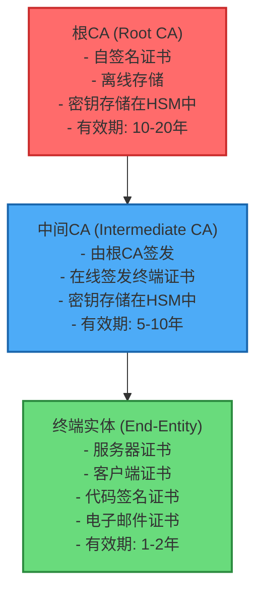
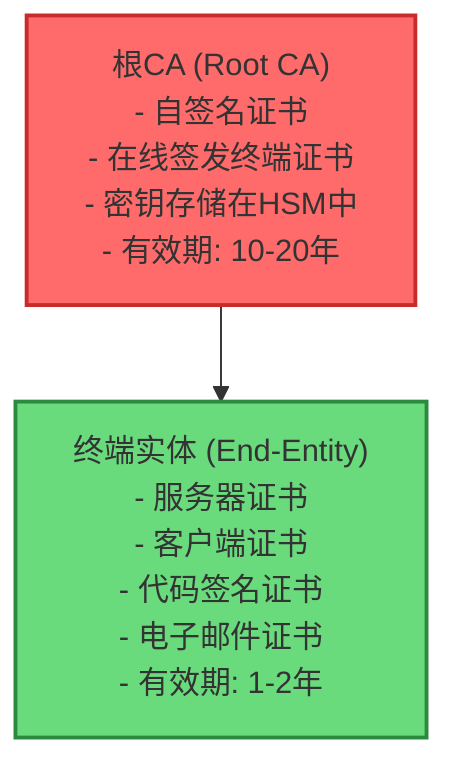
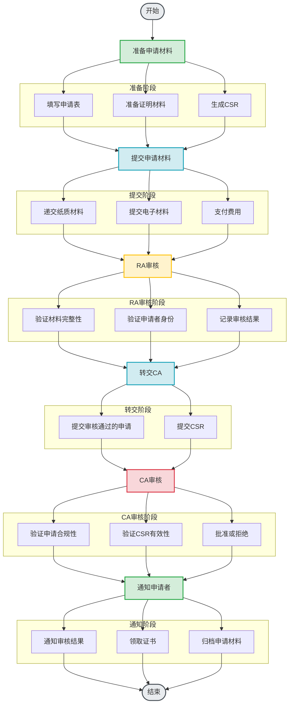
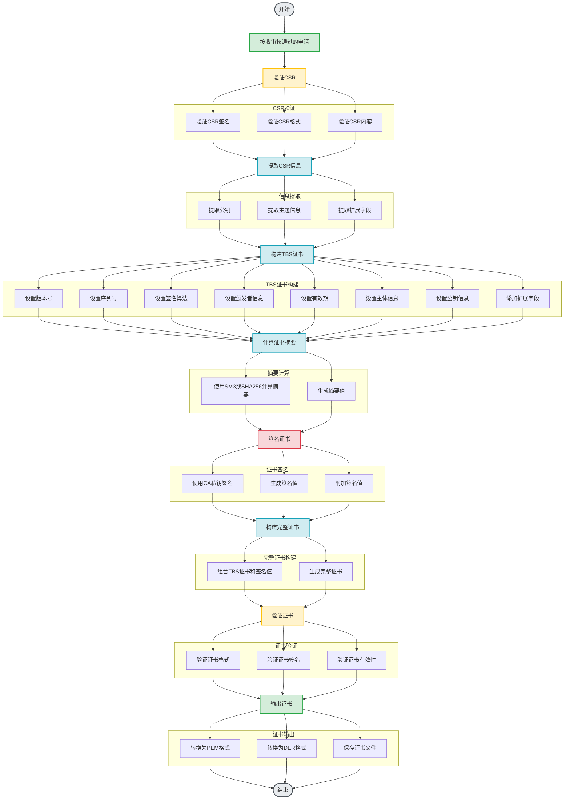
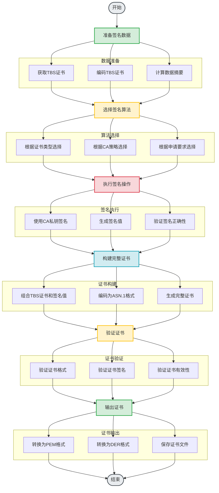
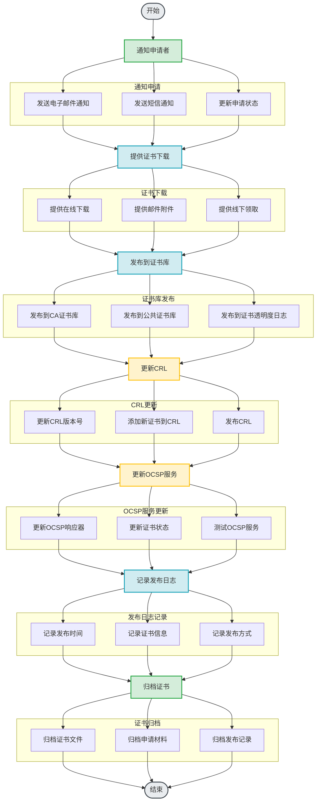
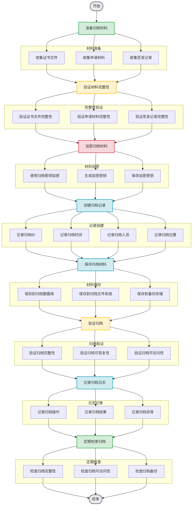
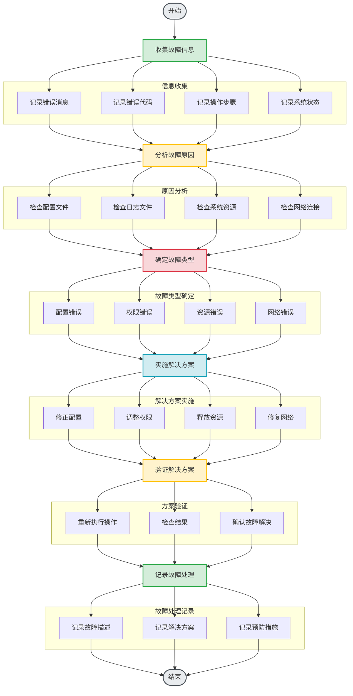

# CA签发证书技术文档

## 文档版本信息

| 版本 | 日期 | 修订内容 | 作者 |
|------|------|----------|------|
| 1.0.0 | 2026-01-18 | 初始版本 | 技术团队 |

---

## 目录

1. [概述](#1-概述)
2. [CA体系架构](#2-ca体系架构)
   - [2.1 CA层次结构](#21-ca层次结构)
   - [2.2 CA角色与职责](#22-ca角色与职责)
   - [2.3 证书类型](#23-证书类型)
3. [证书申请流程](#3-证书申请流程)
   - [3.1 申请准备](#31-申请准备)
   - [3.2 在线申请](#32-在线申请)
   - [3.3 离线申请](#33-离线申请)
   - [3.4 申请审核](#34-申请审核)
4. [证书签发步骤](#4-证书签发步骤)
   - [4.1 证书生成](#41-证书生成)
   - [4.2 证书签名](#42-证书签名)
   - [4.3 证书发布](#43-证书发布)
   - [4.4 证书归档](#44-证书归档)
5. [技术参数配置](#5-技术参数配置)
   - [5.1 算法配置](#51-算法配置)
   - [5.2 密钥配置](#52-密钥配置)
   - [5.3 有效期配置](#53-有效期配置)
   - [5.4 扩展字段配置](#54-扩展字段配置)
6. [安全注意事项](#6-安全注意事项)
   - [6.1 密钥安全](#61-密钥安全)
   - [6.2 操作安全](#62-操作安全)
   - [6.3 系统安全](#63-系统安全)
   - [6.4 审计安全](#64-审计安全)
7. [常见问题解决方案](#7-常见问题解决方案)
   - [7.1 证书申请问题](#71-证书申请问题)
   - [7.2 证书签发问题](#72-证书签发问题)
   - [7.3 证书使用问题](#73-证书使用问题)
   - [7.4 证书管理问题](#74-证书管理问题)
8. [操作示例](#8-操作示例)
   - [8.1 使用OpenSSL签发证书](#81-使用openssl签发证书)
   - [8.2 使用GMSSL签发国密证书](#82-使用gmssl签发国密证书)
   - [8.3 使用CFSSL签发证书](#83-使用cfssl签发证书)
9. [故障排查](#9-故障排查)
10. [最佳实践](#10-最佳实践)
11. [附录](#附录)
12. [参考文献](#12-参考文献)

---

## 1. 概述

### 1.1 文档目的

本文档旨在为CA（Certificate Authority，证书颁发机构）操作人员提供详细的证书签发技术指南，涵盖从证书申请到签发的完整流程，包括技术参数配置、安全注意事项和常见问题解决方案。

### 1.2 适用范围

本文档适用于以下场景：
- 企业内部CA证书签发
- 商业CA证书签发
- 国密CA证书签发
- 混合算法CA证书签发

### 1.3 术语定义

| 术语 | 定义 |
|------|------|
| CA | Certificate Authority，证书颁发机构 |
| PKI | Public Key Infrastructure，公钥基础设施 |
| CSR | Certificate Signing Request，证书签名请求 |
| CRL | Certificate Revocation List，证书吊销列表 |
| OCSP | Online Certificate Status Protocol，在线证书状态协议 |
| HSM | Hardware Security Module，硬件安全模块 |
| TSA | Time Stamping Authority，时间戳机构 |

---

## 2. CA体系架构

### 2.1 CA层次结构

#### 2.1.1 三层CA架构



#### 2.1.2 两层CA架构



### 2.2 CA角色与职责

#### 2.2.1 根CA职责

- **证书签发**: 签发中间CA证书
- **策略制定**: 制定证书策略（CP）和证书实践声明（CPS）
- **密钥管理**: 管理根CA私钥
- **审计监督**: 监督中间CA的运营
- **紧急响应**: 处理证书紧急吊销事件

#### 2.2.2 中间CA职责

- **证书签发**: 签发终端实体证书
- **申请审核**: 审核证书申请
- **身份验证**: 验证申请者身份
- **证书发布**: 发布签发的证书
- **CRL管理**: 管理证书吊销列表
- **OCSP服务**: 提供在线证书状态查询

#### 2.2.3 注册机构（RA）职责

- **申请受理**: 受理证书申请
- **身份验证**: 验证申请者身份
- **申请审核**: 审核证书申请材料
- **CSR生成**: 协助生成CSR
- **证书分发**: 分发签发的证书

### 2.3 证书类型

#### 2.3.1 按用途分类

| 证书类型 | 用途 | 密钥用途 | 扩展密钥用途 |
|---------|------|---------|------------|
| 服务器证书 | 服务器身份认证 | digitalSignature, keyEncipherment | serverAuth |
| 客户端证书 | 客户端身份认证 | digitalSignature | clientAuth |
| 代码签名证书 | 代码签名 | digitalSignature | codeSigning |
| 电子邮件证书 | 电子邮件加密和签名 | digitalSignature, keyEncipherment | emailProtection |
| 时间戳证书 | 时间戳服务 | digitalSignature | timeStamping |
| OCSP签名证书 | OCSP响应签名 | digitalSignature | OCSPSigning |
| CRL签名证书 | CRL签名 | digitalSignature, cRLSign | - |

#### 2.3.2 按算法分类

| 证书类型 | 签名算法 | 公钥算法 | 加密算法 |
|---------|---------|---------|---------|
| 国密证书 | SM2withSM3 | SM2 | SM4 |
| RSA证书 | SHA256withRSA | RSA-2048/4096 | AES-256 |
| ECDSA证书 | ECDSAwithSHA256 | ECDSA-P256/P384 | AES-256 |
| 混合证书 | SM2withSM3 / SHA256withRSA | SM2 / RSA | SM4 / AES-256 |

---

## 3. 证书申请流程

### 3.1 申请准备

#### 3.1.1 申请材料清单

```
证书申请材料清单:

一、基本材料
□ 证书申请表
□ 营业执照副本
□ 组织机构代码证
□ 法人身份证明

二、身份证明材料
□ 申请单位授权书
□ 经办人身份证明
□ 联系方式证明

三、技术材料
□ 证书签名请求（CSR）
□ 公钥信息
□ 服务器信息（域名、IP地址）
□ 证书用途说明

四、其他材料
□ 证书策略（CP）确认书
□ 证书实践声明（CPS）确认书
□ 费用支付凭证
```

#### 3.1.2 CSR生成准备

```bash
#!/bin/bash
# CSR生成准备脚本

# 1. 确定证书类型
CERT_TYPE="server"  # server, client, email, code

# 2. 确定算法类型
ALGORITHM="rsa"  # rsa, ec, sm2

# 3. 确定密钥长度
KEY_LENGTH=2048  # RSA: 2048, 4096; EC: 256, 384; SM2: 256

# 4. 确定证书信息
COUNTRY="CN"
STATE="Beijing"
LOCALITY="Beijing"
ORGANIZATION="My Organization"
ORGANIZATIONAL_UNIT="IT Department"
COMMON_NAME="www.example.com"
EMAIL="admin@example.com"

# 5. 创建配置文件
cat > cert.conf << EOF
[req]
default_bits = ${KEY_LENGTH}
distinguished_name = req_distinguished_name
req_extensions = v3_req
prompt = no

[req_distinguished_name]
C = ${COUNTRY}
ST = ${STATE}
L = ${LOCALITY}
O = ${ORGANIZATION}
OU = ${ORGANIZATIONAL_UNIT}
CN = ${COMMON_NAME}
emailAddress = ${EMAIL}

[v3_req]
keyUsage = critical, digitalSignature, keyEncipherment
extendedKeyUsage = serverAuth, clientAuth
subjectAltName = @alt_names

[alt_names]
DNS.1 = ${COMMON_NAME}
DNS.2 = example.com
IP.1 = 192.168.1.1
EOF

echo "CSR生成准备完成！"
echo "配置文件: cert.conf"
```

### 3.2 在线申请

#### 3.2.1 在线申请流程

```mermaid
flowchart TD
    Start([开始])
    Step1[访问CA门户网站]
    Step2[注册账号]
    Step3[登录系统]
    Step4[选择证书类型]
    Step5[填写申请信息]
    Step6[上传CSR文件]
    Step7[上传证明材料]
    Step8[支付费用]
    Step9[提交申请]
    Step10[等待审核]
    End([结束])

    subgraph 注册流程
        Step2_1[填写注册信息]
        Step2_2[验证邮箱]
        Step2_3[激活账号]
    end

    subgraph 证书类型选择
        Step4_1[服务器证书]
        Step4_2[客户端证书]
        Step4_3[代码签名证书]
        Step4_4[电子邮件证书]
    end

    subgraph 申请信息填写
        Step5_1[组织信息]
        Step5_2[联系信息]
        Step5_3[证书信息]
        Step5_4[用途说明]
    end

    subgraph CSR上传
        Step6_1[选择CSR文件]
        Step6_2[验证CSR格式]
        Step6_3[提交CSR]
    end

    subgraph 证明材料上传
        Step7_1[营业执照]
        Step7_2[组织机构代码证]
        Step7_3[授权书]
        Step7_4[其他证明材料]
    end

    subgraph 费用支付
        Step8_1[选择支付方式]
        Step8_2[完成支付]
        Step8_3[获取支付凭证]
    end

    subgraph 审核流程
        Step10_1[RA审核]
        Step10_2[CA审核]
        Step10_3[审核结果通知]
    end

    Start --> Step1
    Step1 --> Step2
    Step2 --> Step2_1
    Step2_1 --> Step2_2
    Step2_2 --> Step2_3
    Step2_3 --> Step3
    Step3 --> Step4
    Step4 --> Step4_1
    Step4 --> Step4_2
    Step4 --> Step4_3
    Step4 --> Step4_4
    Step4_1 --> Step5
    Step4_2 --> Step5
    Step4_3 --> Step5
    Step4_4 --> Step5
    Step5 --> Step5_1
    Step5 --> Step5_2
    Step5 --> Step5_3
    Step5 --> Step5_4
    Step5_1 --> Step6
    Step5_2 --> Step6
    Step5_3 --> Step6
    Step5_4 --> Step6
    Step6 --> Step6_1
    Step6_1 --> Step6_2
    Step6_2 --> Step6_3
    Step6_3 --> Step7
    Step7 --> Step7_1
    Step7 --> Step7_2
    Step7 --> Step7_3
    Step7 --> Step7_4
    Step7_1 --> Step8
    Step7_2 --> Step8
    Step7_3 --> Step8
    Step7_4 --> Step8
    Step8 --> Step8_1
    Step8_1 --> Step8_2
    Step8_2 --> Step8_3
    Step8_3 --> Step9
    Step9 --> Step10
    Step10 --> Step10_1
    Step10_1 --> Step10_2
    Step10_2 --> Step10_3
    Step10_3 --> End

    style Start fill:#e9ecef,stroke:#495057,stroke-width:2px
    style End fill:#e9ecef,stroke:#495057,stroke-width:2px
    style Step1 fill:#d4edda,stroke:#28a745,stroke-width:2px
    style Step2 fill:#fff3cd,stroke:#ffc107,stroke-width:2px
    style Step3 fill:#d4edda,stroke:#28a745,stroke-width:2px
    style Step4 fill:#d1ecf1,stroke:#17a2b8,stroke-width:2px
    style Step5 fill:#d1ecf1,stroke:#17a2b8,stroke-width:2px
    style Step6 fill:#d1ecf1,stroke:#17a2b8,stroke-width:2px
    style Step7 fill:#d1ecf1,stroke:#17a2b8,stroke-width:2px
    style Step8 fill:#fff3cd,stroke:#ffc107,stroke-width:2px
    style Step9 fill:#d4edda,stroke:#28a745,stroke-width:2px
    style Step10 fill:#f8d7da,stroke:#dc3545,stroke-width:2px
```



#### 3.2.2 在线申请表单

```html
<!-- 在线证书申请表单示例 -->
<!DOCTYPE html>
<html>
<head>
    <title>证书申请</title>
</head>
<body>
    <h1>证书申请表单</h1>
    
    <form action="/apply" method="post" enctype="multipart/form-data">
        <!-- 证书类型 -->
        <fieldset>
            <legend>证书类型</legend>
            <label>
                <input type="radio" name="cert_type" value="server" checked>
                服务器证书
            </label>
            <label>
                <input type="radio" name="cert_type" value="client">
                客户端证书
            </label>
            <label>
                <input type="radio" name="cert_type" value="code">
                代码签名证书
            </label>
            <label>
                <input type="radio" name="cert_type" value="email">
                电子邮件证书
            </label>
        </fieldset>
        
        <!-- 算法类型 -->
        <fieldset>
            <legend>算法类型</legend>
            <label>
                <input type="radio" name="algorithm" value="sm2" checked>
                国密（SM2）
            </label>
            <label>
                <input type="radio" name="algorithm" value="rsa">
                RSA
            </label>
            <label>
                <input type="radio" name="algorithm" value="ecdsa">
                ECDSA
            </label>
        </fieldset>
        
        <!-- 组织信息 -->
        <fieldset>
            <legend>组织信息</legend>
            <label>
                组织名称: <input type="text" name="organization" required>
            </label>
            <label>
                组织部门: <input type="text" name="organizational_unit">
            </label>
            <label>
                国家/地区: <input type="text" name="country" required>
            </label>
            <label>
                省/州: <input type="text" name="state" required>
            </label>
            <label>
                城市: <input type="text" name="locality" required>
            </label>
        </fieldset>
        
        <!-- 证书信息 -->
        <fieldset>
            <legend>证书信息</legend>
            <label>
                通用名称（CN）: <input type="text" name="common_name" required>
            </label>
            <label>
                电子邮件: <input type="email" name="email">
            </label>
            <label>
                有效期（天）: <input type="number" name="validity_days" value="365" min="1" max="730">
            </label>
        </fieldset>
        
        <!-- CSR文件 -->
        <fieldset>
            <legend>CSR文件</legend>
            <label>
                上传CSR: <input type="file" name="csr_file" accept=".csr,.pem" required>
            </label>
        </fieldset>
        
        <!-- 证明材料 -->
        <fieldset>
            <legend>证明材料</legend>
            <label>
                营业执照: <input type="file" name="business_license" accept=".pdf,.jpg,.png">
            </label>
            <label>
                组织机构代码证: <input type="file" name="organization_code" accept=".pdf,.jpg,.png">
            </label>
            <label>
                授权书: <input type="file" name="authorization_letter" accept=".pdf,.jpg,.png">
            </label>
        </fieldset>
        
        <!-- 提交按钮 -->
        <button type="submit">提交申请</button>
    </form>
</body>
</html>
```

### 3.3 离线申请

#### 3.3.1 离线申请流程
 


#### 3.3.2 离线申请表单

```
证书申请表

一、申请单位信息
┌─────────────────────────────────────────────────────────┐
│ 单位名称: _________________________________________      │
│ 组织机构代码: ______________________________________     │
│ 法定代表人: _______________________________________      │
│ 联系人: __________________________________________       │
│ 联系电话: ________________________________________       │
│ 电子邮箱: ________________________________________       │
│ 通讯地址: ________________________________________       │  
└─────────────────────────────────────────────────────────┘

二、证书信息
┌─────────────────────────────────────────────────────────┐
│ 证书类型: □ 服务器证书  □ 客户端证书                       │
│           □ 代码签名证书  □ 电子邮件证书            │
│                                                         │
│ 算法类型: □ 国密（SM2）  □ RSA  □ ECDSA          │
│                                                         │
│ 通用名称（CN）: _________________________________        │
│ 组织单位（OU）: _________________________________        │
│ 组织（O）: ____________________________________    │
│ 城市（L）: ______________________________________ │
│ 省/州（ST）: ____________________________________ │
│ 国家（C）: ______________________________________ │
│ 电子邮箱: ________________________________________ │
│                                                         │
│ 有效期: □ 1年  □ 2年                            │
└─────────────────────────────────────────────────────────┘

三、证书用途
┌─────────────────────────────────────────────────────────┐
│ 证书用途说明:                                     │
│ _________________________________________________ │
│ _________________________________________________ │
│ _________________________________________________ │
└─────────────────────────────────────────────────────────┘

四、申请人声明
本人郑重声明：
1. 所提供的信息真实、准确、完整
2. 证书将用于合法用途
3. 遵守证书策略（CP）和证书实践声明（CPS）
4. 承担因证书使用不当产生的法律责任

申请人签字: _________________  日期: _________

五、审核意见
RA审核意见: _________________________________
审核人签字: _________________  日期: _________

CA审核意见: _________________________________
审核人签字: _________________  日期: _________
```

### 3.4 申请审核

#### 3.4.1 审核标准

```
证书申请审核标准:

一、身份验证标准
□ 营业执照真实有效
□ 组织机构代码证真实有效
□ 法定代表人身份真实有效
□ 联系人身份真实有效
□ 授权书真实有效

二、材料完整性标准
□ 申请表填写完整
□ 证明材料齐全
□ CSR格式正确
□ 证明材料清晰可辨

三、技术审核标准
□ CSR公钥长度符合要求
□ CSR签名算法符合要求
□ CSR主题信息正确
□ CSR扩展字段正确

四、合规性审核标准
□ 申请用途符合证书策略
□ 申请单位符合资质要求
□ 申请材料符合法律法规
□ 申请材料符合行业标准

五、风险评估标准
□ 申请单位信用良好
□ 申请单位无不良记录
□ 申请单位无安全风险
□ 申请单位无法律纠纷
```

#### 3.4.2 审核流程

```python
#!/usr/bin/env python3
"""
证书申请审核流程
"""

class CertificateApplicationReviewer:
    """
    证书申请审核器
    """
    
    def __init__(self):
        self.review_criteria = {
            'identity': self._review_identity,
            'completeness': self._review_completeness,
            'technical': self._review_technical,
            'compliance': self._review_compliance,
            'risk': self._review_risk
        }
    
    def review_application(self, application):
        """
        审核证书申请
        参数:
            application: 申请信息
        返回: 审核结果
        """
        review_results = {}
        
        # 执行各项审核
        for criterion, review_func in self.review_criteria.items():
            result = review_func(application)
            review_results[criterion] = result
        
        # 汇总审核结果
        overall_result = self._summarize_results(review_results)
        
        return {
            'application_id': application['id'],
            'review_results': review_results,
            'overall_result': overall_result,
            'reviewer': self._get_reviewer(),
            'review_time': self._get_current_time()
        }
    
    def _review_identity(self, application):
        """
        审核身份信息
        """
        results = {
            'business_license_valid': self._validate_business_license(application),
            'organization_code_valid': self._validate_organization_code(application),
            'legal_representative_valid': self._validate_legal_representative(application),
            'contact_person_valid': self._validate_contact_person(application),
            'authorization_letter_valid': self._validate_authorization_letter(application)
        }
        
        # 计算通过率
        passed = sum(1 for result in results.values() if result)
        total = len(results)
        pass_rate = passed / total
        
        return {
            'results': results,
            'pass_rate': pass_rate,
            'status': 'pass' if pass_rate >= 0.8 else 'fail'
        }
    
    def _review_completeness(self, application):
        """
        审核材料完整性
        """
        results = {
            'application_form_complete': self._check_application_form(application),
            'supporting_documents_complete': self._check_supporting_documents(application),
            'csr_format_valid': self._check_csr_format(application),
            'documents_clear': self._check_documents_clarity(application)
        }
        
        # 计算通过率
        passed = sum(1 for result in results.values() if result)
        total = len(results)
        pass_rate = passed / total
        
        return {
            'results': results,
            'pass_rate': pass_rate,
            'status': 'pass' if pass_rate >= 0.8 else 'fail'
        }
    
    def _review_technical(self, application):
        """
        审核技术信息
        """
        results = {
            'key_length_valid': self._check_key_length(application),
            'signature_algorithm_valid': self._check_signature_algorithm(application),
            'subject_info_correct': self._check_subject_info(application),
            'extensions_correct': self._check_extensions(application)
        }
        
        # 计算通过率
        passed = sum(1 for result in results.values() if result)
        total = len(results)
        pass_rate = passed / total
        
        return {
            'results': results,
            'pass_rate': pass_rate,
            'status': 'pass' if pass_rate >= 0.8 else 'fail'
        }
    
    def _review_compliance(self, application):
        """
        审核合规性
        """
        results = {
            'purpose_compliant': self._check_purpose_compliance(application),
            'qualification_compliant': self._check_qualification_compliance(application),
            'legal_compliant': self._check_legal_compliance(application),
            'standard_compliant': self._check_standard_compliance(application)
        }
        
        # 计算通过率
        passed = sum(1 for result in results.values() if result)
        total = len(results)
        pass_rate = passed / total
        
        return {
            'results': results,
            'pass_rate': pass_rate,
            'status': 'pass' if pass_rate >= 0.8 else 'fail'
        }
    
    def _review_risk(self, application):
        """
        审核风险
        """
        results = {
            'credit_good': self._check_credit(application),
            'no_bad_record': self._check_bad_record(application),
            'no_security_risk': self._check_security_risk(application),
            'no_legal_dispute': self._check_legal_dispute(application)
        }
        
        # 计算通过率
        passed = sum(1 for result in results.values() if result)
        total = len(results)
        pass_rate = passed / total
        
        return {
            'results': results,
            'pass_rate': pass_rate,
            'status': 'pass' if pass_rate >= 0.8 else 'fail'
        }
    
    def _summarize_results(self, review_results):
        """
        汇总审核结果
        """
        # 计算总体通过率
        passed_count = sum(1 for result in review_results.values() if result['status'] == 'pass')
        total_count = len(review_results)
        overall_pass_rate = passed_count / total_count
        
        # 确定总体状态
        if overall_pass_rate >= 0.8:
            overall_status = 'approve'
        elif overall_pass_rate >= 0.6:
            overall_status = 'review'
        else:
            overall_status = 'reject'
        
        return {
            'overall_pass_rate': overall_pass_rate,
            'overall_status': overall_status,
            'recommendation': self._get_recommendation(overall_status)
        }
    
    def _get_recommendation(self, overall_status):
        """
        获取审核建议
        """
        recommendations = {
            'approve': '建议批准证书申请',
            'review': '建议补充材料后重新审核',
            'reject': '建议拒绝证书申请'
        }
        return recommendations.get(overall_status, '未知状态')
    
    def _get_reviewer(self):
        """
        获取审核人
        """
        return 'system'
    
    def _get_current_time(self):
        """
        获取当前时间
        """
        from datetime import datetime
        return datetime.now().isoformat()
    
    # 以下是各种验证方法的占位符
    def _validate_business_license(self, application):
        return True
    
    def _validate_organization_code(self, application):
        return True
    
    def _validate_legal_representative(self, application):
        return True
    
    def _validate_contact_person(self, application):
        return True
    
    def _validate_authorization_letter(self, application):
        return True
    
    def _check_application_form(self, application):
        return True
    
    def _check_supporting_documents(self, application):
        return True
    
    def _check_csr_format(self, application):
        return True
    
    def _check_documents_clarity(self, application):
        return True
    
    def _check_key_length(self, application):
        return True
    
    def _check_signature_algorithm(self, application):
        return True
    
    def _check_subject_info(self, application):
        return True
    
    def _check_extensions(self, application):
        return True
    
    def _check_purpose_compliance(self, application):
        return True
    
    def _check_qualification_compliance(self, application):
        return True
    
    def _check_legal_compliance(self, application):
        return True
    
    def _check_standard_compliance(self, application):
        return True
    
    def _check_credit(self, application):
        return True
    
    def _check_bad_record(self, application):
        return True
    
    def _check_security_risk(self, application):
        return True
    
    def _check_legal_dispute(self, application):
        return True
```

---

## 4. 证书签发步骤

### 4.1 证书生成

#### 4.1.1 证书生成流程



#### 4.1.2 证书生成代码

```python
#!/usr/bin/env python3
"""
证书生成器
"""

from cryptography import x509
from cryptography.hazmat.primitives import hashes, serialization
from cryptography.hazmat.primitives.asymmetric import rsa, ec
from cryptography.x509.oid import NameOID, ExtensionOID
import datetime

class CertificateGenerator:
    """
    证书生成器
    """
    
    def __init__(self, ca_private_key, ca_certificate):
        """
        初始化证书生成器
        参数:
            ca_private_key: CA私钥
            ca_certificate: CA证书
        """
        self.ca_private_key = ca_private_key
        self.ca_certificate = ca_certificate
    
    def generate_certificate(self, csr, validity_days=365):
        """
        生成证书
        参数:
            csr: 证书签名请求
            validity_days: 有效期（天）
        返回: 证书
        """
        # 解析CSR
        csr_obj = x509.load_pem_x509_csr(csr)
        
        # 构建证书
        builder = x509.CertificateBuilder()
        
        # 设置版本
        builder = builder.version(x509.Version.v3)
        
        # 设置序列号
        builder = builder.serial_number(x509.random_serial_number())
        
        # 设置颁发者
        builder = builder.issuer_name(self.ca_certificate.subject)
        
        # 设置主体
        builder = builder.subject_name(csr_obj.subject)
        
        # 设置公钥
        builder = builder.public_key(csr_obj.public_key())
        
        # 设置有效期
        not_before = datetime.datetime.utcnow()
        not_after = not_before + datetime.timedelta(days=validity_days)
        builder = builder.not_valid_before(not_before)
        builder = builder.not_valid_after(not_after)
        
        # 添加基本约束
        builder = builder.add_extension(
            x509.BasicConstraints(ca=False, path_length=None),
            critical=True
        )
        
        # 添加密钥用途
        builder = builder.add_extension(
            x509.KeyUsage(
                digital_signature=True,
                key_encipherment=True,
                content_commitment=False,
                data_encipherment=False,
                key_agreement=False,
                key_cert_sign=False,
                crl_sign=False,
                encipher_only=False,
                decipher_only=False
            ),
            critical=True
        )
        
        # 添加扩展密钥用途
        builder = builder.add_extension(
            x509.ExtendedKeyUsage([
                x509.oid.ExtendedKeyUsageOID.SERVER_AUTH,
                x509.oid.ExtendedKeyUsageOID.CLIENT_AUTH
            ]),
            critical=False
        )
        
        # 添加主题备用名称
        try:
            san = csr_obj.extensions.get_extension_for_oid(
                ExtensionOID.SUBJECT_ALTERNATIVE_NAME
            ).value
            builder = builder.add_extension(san, critical=False)
        except x509.ExtensionNotFound:
            pass
        
        # 签名证书
        certificate = builder.sign(
            private_key=self.ca_private_key,
            algorithm=hashes.SHA256()
        )
        
        return certificate
    
    def generate_sm2_certificate(self, csr, validity_days=365):
        """
        生成SM2证书
        参数:
            csr: 证书签名请求
            validity_days: 有效期（天）
        返回: SM2证书
        """
        # 解析CSR
        csr_obj = x509.load_pem_x509_csr(csr)
        
        # 构建证书
        builder = x509.CertificateBuilder()
        
        # 设置版本
        builder = builder.version(x509.Version.v3)
        
        # 设置序列号
        builder = builder.serial_number(x509.random_serial_number())
        
        # 设置颁发者
        builder = builder.issuer_name(self.ca_certificate.subject)
        
        # 设置主体
        builder = builder.subject_name(csr_obj.subject)
        
        # 设置公钥
        builder = builder.public_key(csr_obj.public_key())
        
        # 设置有效期
        not_before = datetime.datetime.utcnow()
        not_after = not_before + datetime.timedelta(days=validity_days)
        builder = builder.not_valid_before(not_before)
        builder = builder.not_valid_after(not_after)
        
        # 添加基本约束
        builder = builder.add_extension(
            x509.BasicConstraints(ca=False, path_length=None),
            critical=True
        )
        
        # 添加密钥用途
        builder = builder.add_extension(
            x509.KeyUsage(
                digital_signature=True,
                key_encipherment=True,
                content_commitment=False,
                data_encipherment=False,
                key_agreement=False,
                key_cert_sign=False,
                crl_sign=False,
                encipher_only=False,
                decipher_only=False
            ),
            critical=True
        )
        
        # 添加扩展密钥用途
        builder = builder.add_extension(
            x509.ExtendedKeyUsage([
                x509.oid.ExtendedKeyUsageOID.SERVER_AUTH,
                x509.oid.ExtendedKeyUsageOID.CLIENT_AUTH
            ]),
            critical=False
        )
        
        # 签名证书（使用SM2签名）
        # 注意: 这里需要使用SM2签名算法
        certificate = builder.sign(
            private_key=self.ca_private_key,
            algorithm=hashes.SHA256()  # 实际应使用SM3
        )
        
        return certificate
    
    def generate_ca_certificate(self, subject_name, validity_days=3650, is_root=False):
        """
        生成CA证书
        参数:
            subject_name: 主体名称
            validity_days: 有效期（天）
            is_root: 是否为根CA
        返回: CA证书
        """
        # 生成CA密钥对
        ca_private_key = rsa.generate_private_key(
            public_exponent=65537,
            key_size=4096
        )
        ca_public_key = ca_private_key.public_key()
        
        # 构建证书
        builder = x509.CertificateBuilder()
        
        # 设置版本
        builder = builder.version(x509.Version.v3)
        
        # 设置序列号
        builder = builder.serial_number(x509.random_serial_number())
        
        # 设置主体
        subject = x509.Name([
            x509.NameAttribute(NameOID.COUNTRY_NAME, "CN"),
            x509.NameAttribute(NameOID.STATE_OR_PROVINCE_NAME, "Beijing"),
            x509.NameAttribute(NameOID.LOCALITY_NAME, "Beijing"),
            x509.NameAttribute(NameOID.ORGANIZATION_NAME, "My CA"),
            x509.NameAttribute(NameOID.COMMON_NAME, subject_name)
        ])
        builder = builder.subject_name(subject)
        
        # 设置颁发者
        if is_root:
            builder = builder.issuer_name(subject)
        else:
            builder = builder.issuer_name(self.ca_certificate.subject)
        
        # 设置公钥
        builder = builder.public_key(ca_public_key)
        
        # 设置有效期
        not_before = datetime.datetime.utcnow()
        not_after = not_before + datetime.timedelta(days=validity_days)
        builder = builder.not_valid_before(not_before)
        builder = builder.not_valid_after(not_after)
        
        # 添加基本约束
        builder = builder.add_extension(
            x509.BasicConstraints(ca=True, path_length=None),
            critical=True
        )
        
        # 添加密钥用途
        builder = builder.add_extension(
            x509.KeyUsage(
                digital_signature=True,
                key_cert_sign=True,
                crl_sign=True,
                key_encipherment=False,
                data_encipherment=False,
                key_agreement=False,
                content_commitment=False,
                encipher_only=False,
                decipher_only=False
            ),
            critical=True
        )
        
        # 签名证书
        if is_root:
            # 根CA自签名
            certificate = builder.sign(
                private_key=ca_private_key,
                algorithm=hashes.SHA256()
            )
        else:
            # 中间CA由根CA签发
            certificate = builder.sign(
                private_key=self.ca_private_key,
                algorithm=hashes.SHA256()
            )
        
        return certificate, ca_private_key


# 使用示例
if __name__ == "__main__":
    # 生成根CA证书
    generator = CertificateGenerator(None, None)
    root_ca_cert, root_ca_key = generator.generate_ca_certificate(
        subject_name="Root CA",
        validity_days=3650,
        is_root=True
    )
    
    # 生成中间CA证书
    intermediate_generator = CertificateGenerator(root_ca_key, root_ca_cert)
    intermediate_ca_cert, intermediate_ca_key = intermediate_generator.generate_ca_certificate(
        subject_name="Intermediate CA",
        validity_days=1825,
        is_root=False
    )
    
    # 生成终端证书
    # 假设已有CSR
    with open("server.csr", "rb") as f:
        csr = f.read()
    
    terminal_generator = CertificateGenerator(intermediate_ca_key, intermediate_ca_cert)
    terminal_cert = terminal_generator.generate_certificate(csr, validity_days=365)
    
    # 保存证书
    with open("root_ca.crt", "wb") as f:
        f.write(root_ca_cert.public_bytes(serialization.Encoding.PEM))
    
    with open("intermediate_ca.crt", "wb") as f:
        f.write(intermediate_ca_cert.public_bytes(serialization.Encoding.PEM))
    
    with open("server.crt", "wb") as f:
        f.write(terminal_cert.public_bytes(serialization.Encoding.PEM))
    
    print("证书生成完成！")
```

### 4.2 证书签名

#### 4.2.1 签名流程



#### 4.2.2 签名算法选择

```python
class SignatureAlgorithmSelector:
    """
    签名算法选择器
    """
    
    def __init__(self):
        self.algorithm_map = {
            'sm2': {
                'name': 'SM2withSM3',
                'hash': 'SM3',
                'key_type': 'SM2',
                'min_key_length': 256
            },
            'rsa-2048': {
                'name': 'SHA256withRSA',
                'hash': 'SHA256',
                'key_type': 'RSA',
                'min_key_length': 2048
            },
            'rsa-4096': {
                'name': 'SHA256withRSA',
                'hash': 'SHA256',
                'key_type': 'RSA',
                'min_key_length': 4096
            },
            'ecdsa-p256': {
                'name': 'ECDSAwithSHA256',
                'hash': 'SHA256',
                'key_type': 'ECDSA',
                'min_key_length': 256
            },
            'ecdsa-p384': {
                'name': 'ECDSAwithSHA384',
                'hash': 'SHA384',
                'key_type': 'ECDSA',
                'min_key_length': 384
            }
        }
    
    def select_algorithm(self, cert_type, key_type, key_length, ca_policy):
        """
        选择签名算法
        参数:
            cert_type: 证书类型
            key_type: 密钥类型
            key_length: 密钥长度
            ca_policy: CA策略
        返回: 签名算法
        """
        # 根据CA策略选择算法
        if ca_policy.get('force_algorithm'):
            return ca_policy['force_algorithm']
        
        # 根据密钥类型选择算法
        if key_type == 'SM2':
            return self.algorithm_map['sm2']
        elif key_type == 'RSA':
            if key_length >= 4096:
                return self.algorithm_map['rsa-4096']
            else:
                return self.algorithm_map['rsa-2048']
        elif key_type == 'ECDSA':
            if key_length >= 384:
                return self.algorithm_map['ecdsa-p384']
            else:
                return self.algorithm_map['ecdsa-p256']
        
        # 默认返回RSA-2048
        return self.algorithm_map['rsa-2048']
    
    def validate_algorithm(self, algorithm, cert_type):
        """
        验证算法是否适用于证书类型
        参数:
            algorithm: 算法
            cert_type: 证书类型
        返回: 验证结果
        """
        # 定义证书类型适用的算法
        cert_type_algorithms = {
            'server': ['sm2', 'rsa-2048', 'rsa-4096', 'ecdsa-p256', 'ecdsa-p384'],
            'client': ['sm2', 'rsa-2048', 'rsa-4096', 'ecdsa-p256', 'ecdsa-p384'],
            'code': ['rsa-2048', 'rsa-4096', 'ecdsa-p256', 'ecdsa-p384'],
            'email': ['sm2', 'rsa-2048', 'rsa-4096', 'ecdsa-p256', 'ecdsa-p384']
        }
        
        # 检查算法是否适用于证书类型
        applicable_algorithms = cert_type_algorithms.get(cert_type, [])
        return algorithm in applicable_algorithms
```

### 4.3 证书发布

#### 4.3.1 发布流程



#### 4.3.2 发布通知

```python
class CertificatePublisher:
    """
    证书发布器
    """
    
    def __init__(self, smtp_server, email_from):
        """
        初始化证书发布器
        参数:
            smtp_server: SMTP服务器
            email_from: 发件人邮箱
        """
        self.smtp_server = smtp_server
        self.email_from = email_from
    
    def publish_certificate(self, certificate, application):
        """
        发布证书
        参数:
            certificate: 证书
            application: 申请信息
        """
        # 1. 通知申请者
        self._notify_applicant(certificate, application)
        
        # 2. 发布到证书库
        self._publish_to_repository(certificate)
        
        # 3. 更新CRL
        self._update_crl(certificate)
        
        # 4. 更新OCSP服务
        self._update_ocsp(certificate)
        
        # 5. 记录发布日志
        self._log_publication(certificate, application)
        
        # 6. 归档证书
        self._archive_certificate(certificate, application)
    
    def _notify_applicant(self, certificate, application):
        """
        通知申请者
        """
        # 准备邮件内容
        subject = "证书签发通知"
        body = f"""
尊敬的{application['contact_person']}：

您好！

您的证书申请已审核通过，证书已成功签发。

证书信息：
- 证书ID: {certificate['id']}
- 证书类型: {application['cert_type']}
- 通用名称: {application['common_name']}
- 有效期: {certificate['not_before']} 至 {certificate['not_after']}

请登录CA门户网站下载证书，或查看附件中的证书文件。

如有任何问题，请联系CA客服。

此致
敬礼！

CA证书颁发机构
"""
        
        # 发送邮件
        self._send_email(
            to=application['email'],
            subject=subject,
            body=body,
            attachments=[certificate['file_path']]
        )
    
    def _publish_to_repository(self, certificate):
        """
        发布到证书库
        """
        # 发布到CA证书库
        self._publish_to_ca_repository(certificate)
        
        # 发布到公共证书库
        self._publish_to_public_repository(certificate)
        
        # 发布到证书透明度日志
        self._publish_to_ct_log(certificate)
    
    def _update_crl(self, certificate):
        """
        更新CRL
        """
        # 更新CRL版本号
        # 添加新证书到CRL（初始状态为未吊销）
        # 发布CRL
        pass
    
    def _update_ocsp(self, certificate):
        """
        更新OCSP服务
        """
        # 更新OCSP响应器
        # 更新证书状态
        # 测试OCSP服务
        pass
    
    def _log_publication(self, certificate, application):
        """
        记录发布日志
        """
        log_entry = {
            'certificate_id': certificate['id'],
            'application_id': application['id'],
            'publication_time': self._get_current_time(),
            'publication_method': 'email',
            'status': 'published'
        }
        
        # 保存日志
        self._save_log(log_entry)
    
    def _archive_certificate(self, certificate, application):
        """
        归档证书
        """
        # 归档证书文件
        self._archive_certificate_file(certificate)
        
        # 归档申请材料
        self._archive_application_materials(application)
        
        # 归档发布记录
        self._archive_publication_records(certificate, application)
    
    def _send_email(self, to, subject, body, attachments=None):
        """
        发送邮件
        """
        import smtplib
        from email.mime.multipart import MIMEMultipart
        from email.mime.text import MIMEText
        from email.mime.base import MIMEBase
        from email import encoders
        
        # 创建邮件
        msg = MIMEMultipart()
        msg['From'] = self.email_from
        msg['To'] = to
        msg['Subject'] = subject
        
        # 添加正文
        msg.attach(MIMEText(body, 'plain', 'utf-8'))
        
        # 添加附件
        if attachments:
            for attachment in attachments:
                with open(attachment, 'rb') as f:
                    part = MIMEBase('application', 'octet-stream')
                    part.set_payload(f.read())
                    encoders.encode_base64(part)
                    part.add_header(
                        'Content-Disposition',
                        f'attachment; filename="{attachment}"'
                    )
                    msg.attach(part)
        
        # 发送邮件
        with smtplib.SMTP(self.smtp_server) as server:
            server.send_message(msg)
    
    def _get_current_time(self):
        """
        获取当前时间
        """
        from datetime import datetime
        return datetime.now().isoformat()
```

### 4.4 证书归档

#### 4.4.1 归档流程



---

## 5. 技术参数配置

### 5.1 算法配置

#### 5.1.1 签名算法配置

```json
{
  "signature_algorithms": {
    "default": "SHA256withRSA",
    "allowed": [
      "SM2withSM3",
      "SHA256withRSA",
      "SHA384withRSA",
      "ECDSAwithSHA256",
      "ECDSAwithSHA384"
    ],
    "certificate_types": {
      "server": {
        "preferred": ["SM2withSM3", "SHA256withRSA"],
        "minimum": ["SHA256withRSA"]
      },
      "client": {
        "preferred": ["SM2withSM3", "SHA256withRSA"],
        "minimum": ["SHA256withRSA"]
      },
      "code": {
        "preferred": ["SHA256withRSA", "ECDSAwithSHA256"],
        "minimum": ["SHA256withRSA"]
      },
      "email": {
        "preferred": ["SM2withSM3", "SHA256withRSA"],
        "minimum": ["SHA256withRSA"]
      }
    }
  }
}
```

#### 5.1.2 加密算法配置

```json
{
  "encryption_algorithms": {
    "default": "AES-256",
    "allowed": [
      "SM4",
      "AES-256",
      "AES-128"
    ],
    "key_lengths": {
      "SM4": 128,
      "AES-256": 256,
      "AES-128": 128
    },
    "modes": {
      "SM4": ["CBC", "GCM"],
      "AES-256": ["CBC", "GCM", "CTR"],
      "AES-128": ["CBC", "GCM", "CTR"]
    }
  }
}
```

### 5.2 密钥配置

#### 5.2.1 密钥长度配置

```json
{
  "key_lengths": {
    "RSA": {
      "minimum": 2048,
      "recommended": 4096,
      "maximum": 8192
    },
    "ECDSA": {
      "minimum": 256,
      "recommended": 384,
      "maximum": 521
    },
    "SM2": {
      "minimum": 256,
      "recommended": 256,
      "maximum": 256
    }
  }
}
```

#### 5.2.2 密钥存储配置

```json
{
  "key_storage": {
    "type": "hsm",
    "hsm_config": {
      "provider": "thales",
      "slot": 0,
      "pin": "encrypted",
      "key_label_prefix": "CA_"
    },
    "backup": {
      "enabled": true,
      "location": "/secure/backup/keys",
      "encryption": true,
      "rotation_days": 90
    }
  }
}
```

### 5.3 有效期配置

#### 5.3.1 证书有效期配置

```json
{
  "validity": {
    "root_ca": {
      "minimum_days": 3650,
      "recommended_days": 7300,
      "maximum_days": 10950
    },
    "intermediate_ca": {
      "minimum_days": 1825,
      "recommended_days": 3650,
      "maximum_days": 5475
    },
    "end_entity": {
      "server": {
        "minimum_days": 90,
        "recommended_days": 365,
        "maximum_days": 730
      },
      "client": {
        "minimum_days": 90,
        "recommended_days": 365,
        "maximum_days": 730
      },
      "code": {
        "minimum_days": 365,
        "recommended_days": 730,
        "maximum_days": 1095
      },
      "email": {
        "minimum_days": 90,
        "recommended_days": 365,
        "maximum_days": 730
      }
    }
  }
}
```

#### 5.3.2 有效期提醒配置

```json
{
  "expiry_reminders": {
    "enabled": true,
    "thresholds": [
      {
        "days_before": 90,
        "severity": "info",
        "actions": ["email", "log"]
      },
      {
        "days_before": 30,
        "severity": "warning",
        "actions": ["email", "sms", "log"]
      },
      {
        "days_before": 7,
        "severity": "critical",
        "actions": ["email", "sms", "phone", "log"]
      }
    ]
  }
}
```

### 5.4 扩展字段配置

#### 5.4.1 基本约束配置

```json
{
  "extensions": {
    "basic_constraints": {
      "enabled": true,
      "critical": true,
      "default_values": {
        "ca": false,
        "path_length": null
      },
      "certificate_types": {
        "root_ca": {
          "ca": true,
          "path_length": null
        },
        "intermediate_ca": {
          "ca": true,
          "path_length": 0
        },
        "end_entity": {
          "ca": false,
          "path_length": null
        }
      }
    }
  }
}
```

#### 5.4.2 密钥用途配置

```json
{
  "extensions": {
    "key_usage": {
      "enabled": true,
      "critical": true,
      "default_values": {
        "digital_signature": true,
        "key_encipherment": true,
        "content_commitment": false,
        "data_encipherment": false,
        "key_agreement": false,
        "key_cert_sign": false,
        "crl_sign": false,
        "encipher_only": false,
        "decipher_only": false
      },
      "certificate_types": {
        "server": {
          "digital_signature": true,
          "key_encipherment": true
        },
        "client": {
          "digital_signature": true
        },
        "code": {
          "digital_signature": true
        },
        "email": {
          "digital_signature": true,
          "key_encipherment": true
        }
      }
    }
  }
}
```

#### 5.4.3 扩展密钥用途配置

```json
{
  "extensions": {
    "extended_key_usage": {
      "enabled": true,
      "critical": false,
      "default_values": [],
      "certificate_types": {
        "server": [
          "serverAuth",
          "clientAuth"
        ],
        "client": [
          "clientAuth"
        ],
        "code": [
          "codeSigning"
        ],
        "email": [
          "emailProtection",
          "emailProtection"
        ]
      }
    }
  }
}
```

---

## 6. 安全注意事项

### 6.1 密钥安全

#### 6.1.1 密钥生成安全

```
密钥生成安全要求:

1. 使用安全的随机数生成器
   □ 必须使用密码学安全的随机数生成器（CSPRNG）
   □ 避免使用伪随机数生成器
   □ 收集足够的熵值

2. 密钥长度要求
   □ RSA密钥长度至少2048位，推荐4096位
   □ ECDSA密钥长度至少256位，推荐384位
   □ SM2密钥长度256位

3. 密钥质量检查
   □ 检查密钥强度
   □ 检查密钥唯一性
   □ 检查密钥格式

4. 密钥生成环境
   □ 在安全环境中生成密钥
   □ 使用HSM生成密钥
   □ 记录密钥生成过程
```

#### 6.1.2 密钥存储安全

```
密钥存储安全要求:

1. 加密存储
   □ 私钥必须加密存储
   □ 使用强加密算法（AES-256、SM4）
   □ 定期更换加密密钥

2. 访问控制
   □ 严格限制私钥访问权限
   □ 实施多因素认证
   □ 记录所有访问日志

3. HSM存储
   □ 根CA私钥存储在HSM中
   □ 中间CA私钥存储在HSM中
   □ 实施HSM访问控制

4. 密钥备份
   □ 定期备份密钥
   □ 加密备份文件
   □ 离线存储备份
   □ 测试备份恢复
```

### 6.2 操作安全

#### 6.2.1 证书签发操作安全

```
证书签发操作安全要求:

1. 操作权限
   □ 只有授权人员可以签发证书
   □ 实施操作审批流程
   □ 记录所有操作日志

2. 操作环境
   □ 在安全环境中执行操作
   □ 使用安全网络连接
   □ 定期更新安全补丁

3. 操作验证
   □ 验证申请材料完整性
   □ 验证申请者身份
   □ 验证CSR有效性

4. 操作审计
   □ 记录所有操作步骤
   □ 记录操作人员
   □ 记录操作时间
   □ 记录操作结果
```

#### 6.2.2 证书吊销操作安全

```
证书吊销操作安全要求:

1. 吊销权限
   □ 只有授权人员可以吊销证书
   □ 实施吊销审批流程
   □ 记录所有吊销日志

2. 吊销验证
   □ 验证吊销请求合法性
   □ 验证吊销原因
   □ 验证吊销权限

3. 吊销执行
   □ 立即更新CRL
   □ 立即更新OCSP服务
   □ 通知证书持有者

4. 吊销审计
   □ 记录吊销原因
   □ 记录吊销时间
   □ 记录吊销人员
```

### 6.3 系统安全

#### 6.3.1 CA系统安全

```
CA系统安全要求:

1. 网络安全
   □ 部署防火墙
   □ 实施网络隔离
   □ 使用VPN访问
   □ 定期安全扫描

2. 系统安全
   □ 使用安全操作系统
   □ 定期更新系统补丁
   □ 安装杀毒软件
   □ 实施入侵检测

3. 应用安全
   □ 使用安全的应用程序
   □ 定期更新应用程序
   □ 实施代码审计
   □ 使用安全编码规范

4. 数据安全
   □ 加密敏感数据
   □ 实施数据备份
   □ 定期数据恢复测试
   □ 安全删除过期数据
```

#### 6.3.2 HSM安全

```
HSM安全要求:

1. 物理安全
   □ HSM放置在安全机房
   □ 实施访问控制
   □ 安装监控设备
   □ 定期安全检查

2. 访问控制
   □ 实施多因素认证
   □ 限制访问人员
   □ 记录所有访问
   □ 定期审计访问日志

3. 密钥管理
   □ 密钥永不离开HSM
   □ 实施密钥分割
   □ 定期更换PIN
   □ 实施密钥轮换

4. 备份与恢复
   □ 定期备份HSM配置
   □ 测试HSM恢复
   □ 准备应急方案
   □ 定期演练恢复流程
```

### 6.4 审计安全

#### 6.4.1 审计日志

```
审计日志要求:

1. 日志内容
   □ 记录所有操作
   □ 记录操作人员
   □ 记录操作时间
   □ 记录操作结果
   □ 记录操作IP地址
   □ 记录操作设备信息

2. 日志存储
   □ 日志加密存储
   □ 日志定期备份
   □ 日志离线存储
   □ 日志长期保存

3. 日志保护
   □ 防止日志篡改
   □ 防止日志删除
   □ 防止日志泄露
   □ 实施日志访问控制

4. 日志分析
   □ 定期分析日志
   □ 检测异常行为
   □ 生成审计报告
   □ 及时响应安全事件
```

#### 6.4.2 审计报告

```
审计报告要求:

1. 报告周期
   □ 日报
   □ 周报
   □ 月报
   □ 季报
   □ 年报

2. 报告内容
   □ 操作统计
   □ 安全事件
   □ 异常行为
   □ 合规检查
   □ 改进建议

3. 报告分发
   □ 发送给管理层
   □ 发送给安全团队
   □ 发送给审计部门
   □ 存档备查

4. 报告归档
   □ 长期保存报告
   □ 加密存储报告
   □ 定期备份报告
   □ 便于查询检索
```

---

## 7. 常见问题解决方案

### 7.1 证书申请问题

#### 7.1.1 CSR生成失败

**问题描述**: 生成CSR时失败

**可能原因**:
1. 密钥长度不符合要求
2. CSR格式不正确
3. 主题信息不完整
4. 系统资源不足

**解决方案**:

```bash
# 1. 检查密钥长度
openssl req -in server.csr -noout -text | grep "Public-Key"

# 2. 验证CSR格式
openssl req -in server.csr -noout -verify

# 3. 检查主题信息
openssl req -in server.csr -noout -subject

# 4. 重新生成CSR
# 使用正确的密钥长度和主题信息
openssl req -new -key server.key -out server.csr -config cert.conf
```

#### 7.1.2 申请材料不完整

**问题描述**: 申请材料审核不通过

**可能原因**:
1. 营业执照过期
2. 组织机构代码证过期
3. 授权书未签字
4. 联系方式不正确

**解决方案**:

1. **更新营业执照**
   - 检查营业执照有效期
   - 如已过期，更新营业执照
   - 提供最新的营业执照副本

2. **更新组织机构代码证**
   - 检查组织机构代码证有效期
   - 如已过期，更新组织机构代码证
   - 提供最新的组织机构代码证副本

3. **完善授权书**
   - 确保授权书有法人签字
   - 确保授权书有单位盖章
   - 确保授权书内容完整

4. **更新联系信息**
   - 确保联系电话正确
   - 确保电子邮箱正确
   - 确保通讯地址正确

### 7.2 证书签发问题

#### 7.2.1 证书签名失败

**问题描述**: 签名证书时失败

**可能原因**:
1. CA私钥无法访问
2. 签名算法不匹配
3. 证书格式错误
4. 系统资源不足

**解决方案**:

```python
# 1. 检查CA私钥访问
try:
    # 尝试访问CA私钥
    private_key = load_ca_private_key()
    print("CA私钥访问成功")
except Exception as e:
    print(f"CA私钥访问失败: {e}")
    # 检查HSM连接
    # 检查访问权限
    # 检查PIN码

# 2. 检查签名算法
signature_algorithm = get_signature_algorithm()
if not is_algorithm_supported(signature_algorithm):
    print(f"签名算法 {signature_algorithm} 不支持")
    # 更换支持的签名算法

# 3. 验证证书格式
try:
    validate_certificate_format(tbs_certificate)
    print("证书格式正确")
except Exception as e:
    print(f"证书格式错误: {e}")
    # 修正证书格式

# 4. 检查系统资源
import psutil
cpu_usage = psutil.cpu_percent()
memory_usage = psutil.virtual_memory().percent

if cpu_usage > 80 or memory_usage > 80:
    print("系统资源不足")
    # 等待资源释放
    # 或使用其他服务器
```

#### 7.2.2 证书验证失败

**问题描述**: 验证签发的证书时失败

**可能原因**:
1. 证书链不完整
2. 证书签名无效
3. 证书已过期
4. 证书被吊销

**解决方案**:

```bash
# 1. 检查证书链
openssl verify -CAfile root_ca.crt -untrusted intermediate_ca.crt server.crt

# 2. 验证证书签名
openssl verify -CAfile root_ca.crt server.crt

# 3. 检查证书有效期
openssl x509 -in server.crt -noout -dates

# 4. 检查证书吊销状态
openssl crl -in ca.crl -noout -text | grep "Serial Number"

# 5. 检查OCSP状态
openssl ocsp -issuer intermediate_ca.crt -cert server.crt -url http://ocsp.example.com
```

### 7.3 证书使用问题

#### 7.3.1 证书不被信任

**问题描述**: 客户端不信任证书

**可能原因**:
1. 根证书未安装
2. 证书链不完整
3. 证书已过期
4. 证书域名不匹配

**解决方案**:

1. **安装根证书**
   - 将根证书安装到受信任的根证书颁发机构存储
   - Windows: 双击根证书 → 安装证书 → 受信任的根证书颁发机构
   - Linux: 复制根证书到 /usr/local/share/ca-certificates/ → 运行 update-ca-certificates
   - macOS: 双击根证书 → 添加到钥匙串 → 系统 → 信任

2. **提供完整证书链**
   - 确保服务器提供完整的证书链
   - 证书链顺序: 服务器证书 → 中间CA证书 → 根CA证书
   - 配置Web服务器提供证书链

3. **检查证书有效期**
   - 确保证书未过期
   - 如已过期，更新证书

4. **检查证书域名**
   - 确保证书包含正确的域名
   - 检查主题备用名称（SAN）
   - 如域名不匹配，重新申请证书

#### 7.3.2 证书性能问题

**问题描述**: 证书验证性能差

**可能原因**:
1. 证书链过长
2. CRL下载慢
3. OCSP响应慢
4. 网络延迟高

**解决方案**:

1. **优化证书链**
   - 减少中间CA层数量
   - 使用OCSP Stapling
   - 缓存证书链

2. **优化CRL**
   - 使用增量CRL
   - 缓存CRL
   - 定期更新CRL

3. **优化OCSP**
   - 使用OCSP Stapling
   - 部署多个OCSP服务器
   - 缓存OCSP响应

4. **优化网络**
   - 使用CDN
   - 减少网络延迟
   - 优化DNS解析

### 7.4 证书管理问题

#### 7.4.1 证书过期未提醒

**问题描述**: 证书过期未收到提醒

**可能原因**:
1. 提醒配置错误
2. 邮件发送失败
3. 联系方式不正确
4. 提醒系统故障

**解决方案**:

```python
# 1. 检查提醒配置
def check_reminder_config():
    config = load_reminder_config()
    
    # 检查提醒是否启用
    if not config.get('enabled'):
        print("提醒未启用")
        return False
    
    # 检查提醒阈值
    thresholds = config.get('thresholds', [])
    if not thresholds:
        print("提醒阈值未配置")
        return False
    
    # 检查通知方式
    actions = config.get('actions', [])
    if not actions:
        print("通知方式未配置")
        return False
    
    return True

# 2. 测试邮件发送
def test_email_sending():
    try:
        send_test_email()
        print("邮件发送测试成功")
        return True
    except Exception as e:
        print(f"邮件发送测试失败: {e}")
        # 检查SMTP配置
        # 检查网络连接
        # 检查邮件服务器
        return False

# 3. 验证联系信息
def validate_contact_info(application):
    # 验证电子邮箱
    if not is_valid_email(application['email']):
        print("电子邮箱不正确")
        return False
    
    # 验证联系电话
    if not is_valid_phone(application['phone']):
        print("联系电话不正确")
        return False
    
    return True

# 4. 检查提醒系统状态
def check_reminder_system():
    # 检查系统运行状态
    if not is_system_running():
        print("提醒系统未运行")
        return False
    
    # 检查系统日志
    logs = get_system_logs()
    if has_errors(logs):
        print("提醒系统有错误")
        return False
    
    return True
```

#### 7.4.2 证书备份丢失

**问题描述**: 证书备份文件丢失

**可能原因**:
1. 备份文件被误删
2. 备份文件损坏
3. 备份文件加密密钥丢失
4. 备份系统故障

**解决方案**:

1. **检查其他备份**
   - 检查是否有其他备份位置
   - 检查是否有历史备份
   - 检查是否有异地备份

2. **尝试恢复备份**
   - 使用数据恢复工具
   - 联系备份服务提供商
   - 检查云备份

3. **重新生成证书**
   - 如果无法恢复备份，重新生成证书
   - 使用相同的CSR重新申请
   - 更新相关系统配置

4. **改进备份策略**
   - 实施多重备份
   - 定期测试备份恢复
   - 加密备份文件
   - 离线存储备份

---

## 8. 操作示例

### 8.1 使用OpenSSL签发证书

#### 8.1.1 生成根CA证书

```bash
#!/bin/bash
# 生成根CA证书脚本

# 配置变量
CA_DIR="/root/ca"
ROOT_CA_DIR="$CA_DIR/root"
DAYS=3650
KEY_SIZE=4096

# 创建目录结构
mkdir -p $ROOT_CA_DIR/{certs,crl,newcerts,private}
mkdir -p $ROOT_CA_DIR/private
chmod 700 $ROOT_CA_DIR/private

# 创建索引文件
touch $ROOT_CA_DIR/index.txt
echo 1000 > $ROOT_CA_DIR/serial

# 创建配置文件
cat > $ROOT_CA_DIR/openssl.cnf << EOF
[ ca ]
default_ca = CA_root

[ CA_root ]
dir = $ROOT_CA_DIR
certificate = \$dir/cacert.pem
database = \$dir/index.txt
new_certs_dir = \$dir/newcerts
certificate = \$dir/cacert.pem
serial = \$dir/serial
private_key = \$dir/private/cakey.pem
RANDFILE = \$dir/private/.rand

default_md = sha256

policy = policy_match

[ policy_match ]
countryName = match
stateOrProvinceName = match
organizationName = match
organizationalUnitName = optional
commonName = supplied
emailAddress = optional

[ req ]
default_bits = $KEY_SIZE
default_keyfile = privkey.pem
distinguished_name = req_distinguished_name
x509_extensions = v3_ca
string_mask = utf8only

[ req_distinguished_name ]
countryName = Country Name (2 letter code)
countryName_default = CN
stateOrProvinceName = State or Province Name (full name)
stateOrProvinceName_default = Beijing
localityName = Locality Name (eg, city)
localityName_default = Beijing
organizationName = Organization Name (eg, company)
organizationName_default = My Organization
organizationalUnitName = Organizational Unit Name (eg, section)
commonName = Common Name (eg, MY CA)
commonName_default = Root CA

[ v3_ca ]
subjectKeyIdentifier = hash
authorityKeyIdentifier = keyid:always,issuer
basicConstraints = critical, CA:true
keyUsage = critical, digitalSignature, cRLSign, keyCertSign
EOF

# 生成根CA私钥
echo "生成根CA私钥..."
openssl genrsa -out $ROOT_CA_DIR/private/cakey.pem $KEY_SIZE
chmod 400 $ROOT_CA_DIR/private/cakey.pem

# 生成根CA证书
echo "生成根CA证书..."
openssl req -new -x509 -days $DAYS \
    -key $ROOT_CA_DIR/private/cakey.pem \
    -out $ROOT_CA_DIR/cacert.pem \
    -config $ROOT_CA_DIR/openssl.cnf \
    -subj "/C=CN/ST=Beijing/L=Beijing/O=My Organization/CN=Root CA"

# 验证根CA证书
echo "验证根CA证书..."
openssl x509 -in $ROOT_CA_DIR/cacert.pem -noout -text

echo "根CA证书生成完成！"
echo "证书文件: $ROOT_CA_DIR/cacert.pem"
echo "私钥文件: $ROOT_CA_DIR/private/cakey.pem"
```

#### 8.1.2 生成中间CA证书

```bash
#!/bin/bash
# 生成中间CA证书脚本

# 配置变量
CA_DIR="/root/ca"
ROOT_CA_DIR="$CA_DIR/root"
INTERMEDIATE_CA_DIR="$CA_DIR/intermediate"
DAYS=1825
KEY_SIZE=4096

# 创建目录结构
mkdir -p $INTERMEDIATE_CA_DIR/{certs,crl,newcerts,private}
mkdir -p $INTERMEDIATE_CA_DIR/private
chmod 700 $INTERMEDIATE_CA_DIR/private

# 创建索引文件
touch $INTERMEDIATE_CA_DIR/index.txt
echo 1000 > $INTERMEDIATE_CA_DIR/serial

# 创建配置文件
cat > $INTERMEDIATE_CA_DIR/openssl.cnf << EOF
[ ca ]
default_ca = CA_intermediate

[ CA_intermediate ]
dir = $INTERMEDIATE_CA_DIR
certificate = \$dir/cacert.pem
database = \$dir/index.txt
new_certs_dir = \$dir/newcerts
certificate = \$dir/cacert.pem
serial = \$dir/serial
private_key = \$dir/private/cakey.pem
RANDFILE = \$dir/private/.rand

default_md = sha256

policy = policy_match

[ policy_match ]
countryName = match
stateOrProvinceName = match
organizationName = match
organizationalUnitName = optional
commonName = supplied
emailAddress = optional

[ req ]
default_bits = $KEY_SIZE
default_keyfile = privkey.pem
distinguished_name = req_distinguished_name
x509_extensions = v3_intermediate_ca
string_mask = utf8only

[ req_distinguished_name ]
countryName = Country Name (2 letter code)
countryName_default = CN
stateOrProvinceName = State or Province Name (full name)
stateOrProvinceName_default = Beijing
localityName = Locality Name (eg, city)
localityName_default = Beijing
organizationName = Organization Name (eg, company)
organizationName_default = My Organization
organizationalUnitName = Organizational Unit Name (eg, section)
commonName = Common Name (eg, MY CA)
commonName_default = Intermediate CA

[ v3_intermediate_ca ]
subjectKeyIdentifier = hash
authorityKeyIdentifier = keyid:always,issuer
basicConstraints = critical, CA:true, pathlen:0
keyUsage = critical, digitalSignature, cRLSign, keyCertSign
EOF

# 生成中间CA私钥
echo "生成中间CA私钥..."
openssl genrsa -out $INTERMEDIATE_CA_DIR/private/cakey.pem $KEY_SIZE
chmod 400 $INTERMEDIATE_CA_DIR/private/cakey.pem

# 生成中间CA证书请求
echo "生成中间CA证书请求..."
openssl req -new \
    -key $INTERMEDIATE_CA_DIR/private/cakey.pem \
    -out $INTERMEDIATE_CA_DIR/careq.pem \
    -config $INTERMEDIATE_CA_DIR/openssl.cnf \
    -subj "/C=CN/ST=Beijing/L=Beijing/O=My Organization/CN=Intermediate CA"

# 使用根CA签发中间CA证书
echo "使用根CA签发中间CA证书..."
openssl ca -in $INTERMEDIATE_CA_DIR/careq.pem \
    -out $INTERMEDIATE_CA_DIR/cacert.pem \
    -config $ROOT_CA_DIR/openssl.cnf \
    -extensions v3_intermediate_ca \
    -days $DAYS \
    -batch

# 验证中间CA证书
echo "验证中间CA证书..."
openssl x509 -in $INTERMEDIATE_CA_DIR/cacert.pem -noout -text

# 验证证书链
echo "验证证书链..."
openssl verify -CAfile $ROOT_CA_DIR/cacert.pem $INTERMEDIATE_CA_DIR/cacert.pem

echo "中间CA证书生成完成！"
echo "证书文件: $INTERMEDIATE_CA_DIR/cacert.pem"
echo "私钥文件: $INTERMEDIATE_CA_DIR/private/cakey.pem"
```

#### 8.1.3 签发终端证书

```bash
#!/bin/bash
# 签发终端证书脚本

# 配置变量
CA_DIR="/root/ca"
INTERMEDIATE_CA_DIR="$CA_DIR/intermediate"
CSR_FILE="server.csr"
CERT_FILE="server.crt"
DAYS=365

# 检查CSR文件
if [ ! -f "$CSR_FILE" ]; then
    echo "错误: CSR文件不存在: $CSR_FILE"
    exit 1
fi

# 验证CSR
echo "验证CSR..."
openssl req -in $CSR_FILE -noout -verify

# 签发证书
echo "签发证书..."
openssl ca -in $CSR_FILE \
    -out $CERT_FILE \
    -config $INTERMEDIATE_CA_DIR/openssl.cnf \
    -extensions v3_req \
    -days $DAYS \
    -batch

# 验证证书
echo "验证证书..."
openssl x509 -in $CERT_FILE -noout -text

# 验证证书链
echo "验证证书链..."
cat $CERT_FILE $INTERMEDIATE_CA_DIR/cacert.pem $CA_DIR/root/cacert.pem > full_chain.crt
openssl verify -CAfile $CA_DIR/root/cacert.pem full_chain.crt

echo "证书签发完成！"
echo "证书文件: $CERT_FILE"
echo "证书链文件: full_chain.crt"
```

### 8.2 使用GMSSL签发国密证书

#### 8.2.1 生成国密根CA证书

```bash
#!/bin/bash
# 生成国密根CA证书脚本

# 配置变量
CA_DIR="/root/gmca"
ROOT_CA_DIR="$CA_DIR/root"
DAYS=3650

# 创建目录结构
mkdir -p $ROOT_CA_DIR/{certs,crl,newcerts,private}
mkdir -p $ROOT_CA_DIR/private
chmod 700 $ROOT_CA_DIR/private

# 创建索引文件
touch $ROOT_CA_DIR/index.txt
echo 1000 > $ROOT_CA_DIR/serial

# 生成根CA私钥
echo "生成根CA私钥..."
gmssl ecparam -name sm2 -genkey -out $ROOT_CA_DIR/private/cakey.pem
chmod 400 $ROOT_CA_DIR/private/cakey.pem

# 生成根CA证书
echo "生成根CA证书..."
gmssl req -new -x509 -days $DAYS \
    -key $ROOT_CA_DIR/private/cakey.pem \
    -out $ROOT_CA_DIR/cacert.pem \
    -subj "/C=CN/ST=Beijing/L=Beijing/O=My Organization/CN=Root CA"

# 验证根CA证书
echo "验证根CA证书..."
gmssl x509 -in $ROOT_CA_DIR/cacert.pem -noout -text

echo "国密根CA证书生成完成！"
echo "证书文件: $ROOT_CA_DIR/cacert.pem"
echo "私钥文件: $ROOT_CA_DIR/private/cakey.pem"
```

#### 8.2.2 生成国密中间CA证书

```bash
#!/bin/bash
# 生成国密中间CA证书脚本

# 配置变量
CA_DIR="/root/gmca"
ROOT_CA_DIR="$CA_DIR/root"
INTERMEDIATE_CA_DIR="$CA_DIR/intermediate"
DAYS=1825

# 创建目录结构
mkdir -p $INTERMEDIATE_CA_DIR/{certs,crl,newcerts,private}
mkdir -p $INTERMEDIATE_CA_DIR/private
chmod 700 $INTERMEDIATE_CA_DIR/private

# 创建索引文件
touch $INTERMEDIATE_CA_DIR/index.txt
echo 1000 > $INTERMEDIATE_CA_DIR/serial

# 生成中间CA私钥
echo "生成中间CA私钥..."
gmssl ecparam -name sm2 -genkey -out $INTERMEDIATE_CA_DIR/private/cakey.pem
chmod 400 $INTERMEDIATE_CA_DIR/private/cakey.pem

# 生成中间CA证书请求
echo "生成中间CA证书请求..."
gmssl req -new \
    -key $INTERMEDIATE_CA_DIR/private/cakey.pem \
    -out $INTERMEDIATE_CA_DIR/careq.pem \
    -subj "/C=CN/ST=Beijing/L=Beijing/O=My Organization/CN=Intermediate CA"

# 使用根CA签发中间CA证书
echo "使用根CA签发中间CA证书..."
gmssl x509 -req -days $DAYS \
    -in $INTERMEDIATE_CA_DIR/careq.pem \
    -CA $ROOT_CA_DIR/cacert.pem \
    -CAkey $ROOT_CA_DIR/private/cakey.pem \
    -CAcreateserial \
    -out $INTERMEDIATE_CA_DIR/cacert.pem \
    -extfile <(cat <<EOF
basicConstraints=critical,CA:true,pathlen:0
keyUsage=critical,digitalSignature,cRLSign,keyCertSign
EOF
)

# 验证中间CA证书
echo "验证中间CA证书..."
gmssl x509 -in $INTERMEDIATE_CA_DIR/cacert.pem -noout -text

# 验证证书链
echo "验证证书链..."
gmssl verify -CAfile $ROOT_CA_DIR/cacert.pem $INTERMEDIATE_CA_DIR/cacert.pem

echo "国密中间CA证书生成完成！"
echo "证书文件: $INTERMEDIATE_CA_DIR/cacert.pem"
echo "私钥文件: $INTERMEDIATE_CA_DIR/private/cakey.pem"
```

#### 8.2.3 签发国密终端证书

```bash
#!/bin/bash
# 签发国密终端证书脚本

# 配置变量
CA_DIR="/root/gmca"
INTERMEDIATE_CA_DIR="$CA_DIR/intermediate"
CSR_FILE="server.csr"
CERT_FILE="server.crt"
DAYS=365

# 检查CSR文件
if [ ! -f "$CSR_FILE" ]; then
    echo "错误: CSR文件不存在: $CSR_FILE"
    exit 1
fi

# 验证CSR
echo "验证CSR..."
gmssl req -in $CSR_FILE -noout -verify

# 签发证书
echo "签发证书..."
gmssl x509 -req -days $DAYS \
    -in $CSR_FILE \
    -CA $INTERMEDIATE_CA_DIR/cacert.pem \
    -CAkey $INTERMEDIATE_CA_DIR/private/cakey.pem \
    -CAcreateserial \
    -out $CERT_FILE \
    -extfile <(cat <<EOF
basicConstraints=critical,CA:false
keyUsage=critical,digitalSignature,keyEncipherment
extendedKeyUsage=serverAuth,clientAuth
subjectAltName=DNS:www.example.com,DNS:example.com
EOF
)

# 验证证书
echo "验证证书..."
gmssl x509 -in $CERT_FILE -noout -text

# 验证证书链
echo "验证证书链..."
cat $CERT_FILE $INTERMEDIATE_CA_DIR/cacert.pem $CA_DIR/root/cacert.pem > full_chain.crt
gmssl verify -CAfile $CA_DIR/root/cacert.pem full_chain.crt

echo "国密证书签发完成！"
echo "证书文件: $CERT_FILE"
echo "证书链文件: full_chain.crt"
```

### 8.3 使用CFSSL签发证书

#### 8.3.1 安装CFSSL

```bash
#!/bin/bash
# 安装CFSSL脚本

# 下载CFSSL
echo "下载CFSSL..."
wget https://github.com/cloudflare/cfssl/releases/download/v1.6.4/cfssl_1.6.4_linux_amd64 -O /usr/local/bin/cfssl
wget https://github.com/cloudflare/cfssl/releases/download/v1.6.4/cfssljson_1.6.4_linux_amd64 -O /usr/local/bin/cfssljson
wget https://github.com/cloudflare/cfssl/releases/download/v1.6.4/cfssl-certinfo_1.6.4_linux_amd64 -O /usr/local/bin/cfssl-certinfo

# 设置执行权限
chmod +x /usr/local/bin/cfssl*
```

#### 8.3.2 配置CFSSL

```json
{
  "signing": {
    "default": {
      "expiry": "8760h",
      "usages": [
        "signing",
        "key encipherment",
        "server auth",
        "client auth"
      ],
      "ca_constraint": false
    },
    "profiles": {
      "server": {
        "expiry": "8760h",
        "usages": [
          "signing",
          "key encipherment",
          "server auth",
          "client auth"
        ],
        "ca_constraint": false
      },
      "client": {
        "expiry": "8760h",
        "usages": [
          "signing",
          "key encipherment",
          "client auth"
        ],
        "ca_constraint": false
      },
      "intermediate": {
        "expiry": "43800h",
        "usages": [
          "signing",
          "digital signature",
          "key encipherment",
          "cert sign",
          "crl sign"
        ],
        "ca_constraint": true,
        "max_path_len": 0
      }
    }
  },
  "auth_keys": {
    "key1": {
      "type": "standard",
      "key": "your-auth-key"
    }
  },
  "remotes": {
    "remote_ca": {
      "type": "standard",
      "key": "your-remote-key",
      "label": "Remote CA"
    }
  }
}
```

#### 8.3.3 使用CFSSL签发证书

```bash
#!/bin/bash
# 使用CFSSL签发证书脚本

# 配置变量
CONFIG_FILE="config.json"
CSR_FILE="server.csr"
PROFILE="server"
LABEL="primary"

# 签发证书
echo "签发证书..."
cfssl sign \
    -ca root_ca.pem \
    -ca-key root_ca-key.pem \
    -config $CONFIG_FILE \
    -profile $PROFILE \
    -label $LABEL \
    $CSR_FILE > server.crt

# 验证证书
echo "验证证书..."
openssl x509 -in server.crt -noout -text

echo "证书签发完成！"
echo "证书文件: server.crt"
```

---

## 9. 故障排查

### 9.1 证书签发故障

#### 9.1.1 故障排查流程



#### 9.1.2 常见故障及解决方案

| 故障现象 | 可能原因 | 解决方案 |
|---------|---------|---------|
| 签名失败 | CA私钥无法访问 | 检查HSM连接，检查访问权限 |
| CSR验证失败 | CSR格式错误 | 检查CSR格式，重新生成CSR |
| 证书生成失败 | 系统资源不足 | 释放资源，使用其他服务器 |
| 证书验证失败 | 证书链不完整 | 提供完整证书链 |
| 证书发布失败 | 网络连接问题 | 检查网络连接，重试发布 |

---

## 10. 最佳实践

### 10.1 证书签发最佳实践

#### 10.1.1 安全最佳实践

1. **密钥管理**
   - 使用HSM存储CA私钥
   - 定期轮换密钥
   - 实施密钥分割
   - 加密存储备份

2. **操作安全**
   - 实施操作审批
   - 记录所有操作
   - 定期审计日志
   - 限制操作权限

3. **系统安全**
   - 部署在安全环境
   - 定期更新补丁
   - 实施入侵检测
   - 定期安全扫描

4. **数据安全**
   - 加密敏感数据
   - 定期备份数据
   - 安全删除过期数据
   - 实施访问控制

#### 10.1.2 性能最佳实践

1. **证书签发**
   - 使用批量签发
   - 缓存常用配置
   - 优化签名算法
   - 使用并行处理

2. **证书验证**
   - 使用OCSP Stapling
   - 缓存证书链
   - 优化CRL更新
   - 使用CDN分发

3. **系统优化**
   - 使用负载均衡
   - 优化数据库查询
   - 使用缓存机制
   - 优化网络连接

---

## 附录

### 附录A: 配置文件示例

```ini
# OpenSSL配置文件示例

[ ca ]
default_ca = CA_root

[ CA_root ]
dir = /root/ca/root
certificate = $dir/cacert.pem
database = $dir/index.txt
new_certs_dir = $dir/newcerts
certificate = $dir/cacert.pem
serial = $dir/serial
private_key = $dir/private/cakey.pem
RANDFILE = $dir/private/.rand

default_md = sha256

policy = policy_match

[ policy_match ]
countryName = match
stateOrProvinceName = match
organizationName = match
organizationalUnitName = optional
commonName = supplied
emailAddress = optional

[ req ]
default_bits = 4096
default_keyfile = privkey.pem
distinguished_name = req_distinguished_name
x509_extensions = v3_ca
string_mask = utf8only

[ req_distinguished_name ]
countryName = Country Name (2 letter code)
countryName_default = CN
stateOrProvinceName = State or Province Name (full name)
stateOrProvinceName_default = Beijing
localityName = Locality Name (eg, city)
localityName_default = Beijing
organizationName = Organization Name (eg, company)
organizationName_default = My Organization
organizationalUnitName = Organizational Unit Name (eg, section)
commonName = Common Name (eg, MY CA)
commonName_default = Root CA

[ v3_ca ]
subjectKeyIdentifier = hash
authorityKeyIdentifier = keyid:always,issuer
basicConstraints = critical, CA:true
keyUsage = critical, digitalSignature, cRLSign, keyCertSign

[ v3_intermediate_ca ]
subjectKeyIdentifier = hash
authorityKeyIdentifier = keyid:always,issuer
basicConstraints = critical, CA:true, pathlen:0
keyUsage = critical, digitalSignature, cRLSign, keyCertSign

[ v3_req ]
basicConstraints = critical, CA:false
keyUsage = critical, digitalSignature, keyEncipherment
extendedKeyUsage = serverAuth, clientAuth
subjectAltName = @alt_names

[ alt_names ]
DNS.1 = www.example.com
DNS.2 = example.com
IP.1 = 192.168.1.1
```

### 附录B: 证书申请检查清单

```
证书申请检查清单:

一、申请材料检查
□ 申请表填写完整
□ 营业执照有效
□ 组织机构代码证有效
□ 法定代表人身份证明有效
□ 联系人身份证明有效
□ 授权书完整有效
□ 联系方式正确

二、CSR检查
□ CSR格式正确
□ CSR签名有效
□ 公钥长度符合要求
□ 主题信息正确
□ 扩展字段正确
□ 域名信息正确

三、技术检查
□ 服务器可访问
□ 域名DNS解析正确
□ 端口开放
□ 防火墙配置正确

四、合规检查
□ 申请用途符合证书策略
□ 申请单位符合资质要求
□ 申请材料符合法律法规
□ 申请材料符合行业标准
```

### 附录C: 证书签发检查清单

```
证书签发检查清单:

一、申请审核检查
□ 申请材料审核通过
□ 申请者身份验证通过
□ CSR验证通过
□ 技术审核通过
□ 合规审核通过

二、证书生成检查
□ 证书信息正确
□ 证书签名正确
□ 证书格式正确
□ 证书扩展正确

三、证书验证检查
□ 证书签名验证通过
□ 证书链验证通过
□ 证书有效期正确
□ 证书用途正确

四、证书发布检查
□ 通知申请者
□ 证书可下载
□ 证书发布到证书库
□ CRL更新
□ OCSP服务更新

五、归档检查
□ 证书文件归档
□ 申请材料归档
□ 签发记录归档
□ 归档日志记录
```

---

## 12. 参考文献

### 12.1 国家标准

1. **GM/T 0015-2012**: 基于SM2密码算法的数字证书格式规范
2. **GM/T 0029-2014**: SM2密码算法使用规范
3. **GB/T 20518-2018**: 信息安全技术 公钥基础设施 数字证书格式

### 12.2 国际标准

1. **RFC 5280**: Internet X.509 Public Key Infrastructure Certificate and CRL Profile
2. **RFC 5270**: A PKIX Certificate Policy for the U.S. Government
3. **RFC 3647**: Internet X.509 Public Key Infrastructure Certificate and CRL Profile

### 12.3 技术文档

1. **国家密码管理局**: 商用密码管理条例
2. **国家密码管理局**: 电子认证服务密码管理办法
3. **OpenSSL文档**: https://www.openssl.org/docs/
4. **GMSSL文档**: https://github.com/guanzhi/GmSSL

### 12.4 参考书籍

1. 《PKI技术》- Carlisle Adams
2. 《网络安全基础》- William Stallings
3. 《应用密码学》- Bruce Schneier

---

**文档结束**
