# SSL/TLS 客户端证书体系技术文档

## 目录

1. [客户端证书基本概念](#1-客户端证书基本概念)
2. [工作原理](#2-工作原理)
3. [与服务器证书的区别](#3-与服务器证书的区别)
4. [证书申请、生成、签名和分发流程](#4-证书申请生成签名和分发流程)
5. [X.509证书格式及字段含义](#5-x509证书格式及字段含义)
6. [客户端证书应用场景](#6-客户端证书应用场景)
7. [证书生命周期管理](#7-证书生命周期管理)
8. [不同环境下的配置和使用](#8-不同环境下的配置和使用)
9. [常见问题与解决方案](#9-常见问题与解决方案)
10. [附录：配置示例](#10-附录配置示例)

---

## 1. 客户端证书基本概念

### 1.1 什么是客户端证书

客户端证书是数字证书的一种，用于在双向TLS（mTLS）认证中验证客户端身份。与服务器证书类似，客户端证书也遵循X.509标准，由受信任的证书颁发机构（CA）签发。

**核心特点**：
- 用于客户端身份验证
- 包含客户端的公钥和身份信息
- 由CA或内部CA签发
- 在双向TLS握手时使用

### 1.2 客户端证书的组成

客户端证书包含以下核心信息：

- **公钥**：用于加密数据或验证签名
- **身份信息**：客户端名称、组织、电子邮件等
- **颁发机构**：签发证书的CA信息
- **有效期**：证书的起止时间
- **签名**：CA对证书内容的数字签名
- **扩展字段**：密钥用途、扩展密钥用途等

### 1.3 客户端证书的类型

#### 1.3.1 按用途分类

| 类型 | 说明 | 典型应用 |
|------|------|----------|
| **身份认证证书** | 用于验证客户端身份 | VPN、mTLS API |
| **代码签名证书** | 用于签名代码 | 软件分发 |
| **电子邮件证书** | 用于签名和加密邮件 | S/MIME |
| **文档签名证书** | 用于签名文档 | PDF签名 |

#### 1.3.2 按签发机构分类

- **公开CA签发**：由受信任的公共CA签发，浏览器和操作系统默认信任
- **私有CA签发**：由组织内部CA签发，需要手动信任根证书
- **自签名证书**：由客户端自己签发，仅用于测试环境

### 1.4 客户端证书的信任模型

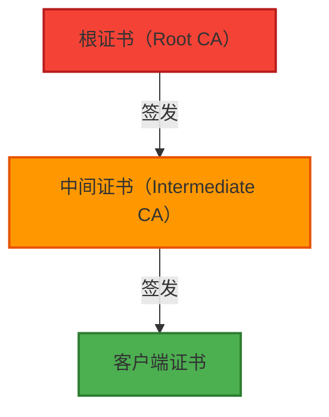

**信任链说明**：
- 客户端证书由中间CA签发
- 中间CA由根CA签发
- 服务器需要信任根CA或中间CA
- 客户端需要提供完整的证书链

---

## 2. 工作原理

### 2.1 双向TLS（mTLS）认证流程

双向TLS认证要求服务器和客户端都提供证书进行身份验证。

#### 2.1.1 完整握手流程

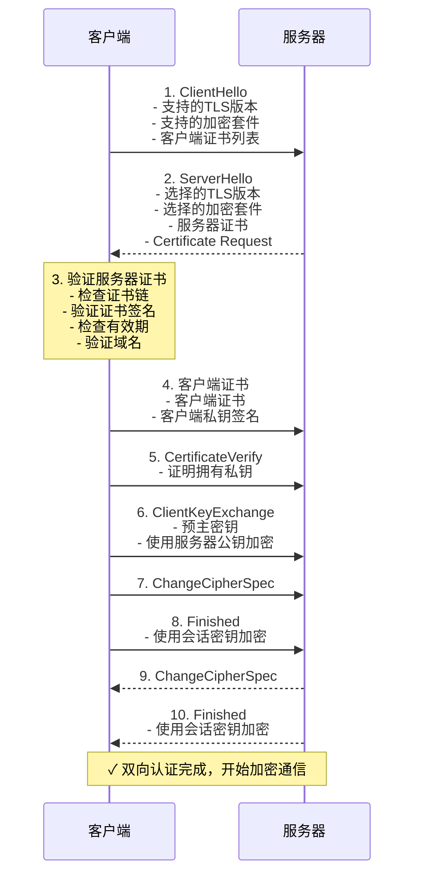

#### 2.1.2 关键步骤说明

1. **客户端发送证书列表**：
   - 在ClientHello中发送客户端支持的CA列表
   - 服务器根据此列表选择客户端证书

2. **服务器请求客户端证书**：
   - 服务器发送Certificate Request消息
   - 指定可接受的CA列表

3. **客户端提供证书**：
   - 客户端选择匹配的证书
   - 发送证书链（客户端证书 + 中间证书）

4. **客户端证明私钥所有权**：
   - 使用私钥签名握手消息
   - 服务器验证签名

5. **服务器验证客户端证书**：
   - 验证证书链
   - 验证证书签名
   - 检查证书有效期
   - 检查吊销状态

### 2.2 证书选择机制

客户端可能有多个证书，需要根据服务器的请求选择合适的证书。

#### 2.2.1 证书选择标准

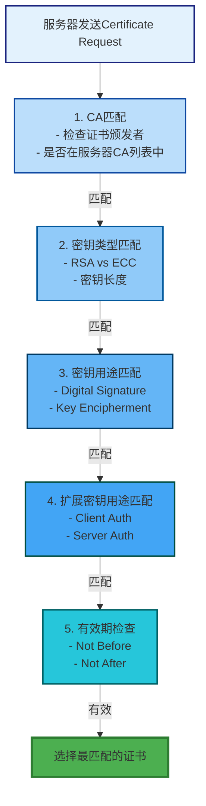

---

## 3. 与服务器证书的区别

### 3.1 主要区别对比

| 特性 | 服务器证书 | 客户端证书 |
|--------|------------|------------|
| **用途** | 验证服务器身份 | 验证客户端身份 |
| **CN字段** | 域名（如www.example.com） | 用户名、邮箱或组织名 |
| **SAN字段** | 域名列表 | 邮箱、用户ID等 |
| **密钥用途** | Digital Signature, Key Encipherment | Digital Signature |
| **扩展密钥用途** | Server Auth | Client Auth |
| **签发流程** | 需要域名验证 | 需要身份验证 |
| **典型应用** | HTTPS网站 | mTLS API、VPN |
| **浏览器信任** | 自动信任 | 需要手动导入 |

### 3.2 使用场景对比

#### 3.2.1 服务器证书场景

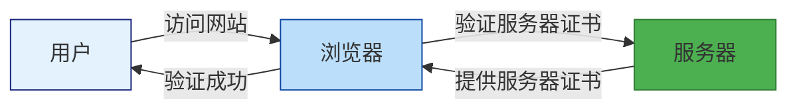

**流程说明**：
1. 用户在浏览器中输入网址
2. 浏览器连接服务器
3. 服务器提供证书
4. 浏览器验证证书
5. 验证成功后显示网站

#### 3.2.2 客户端证书场景

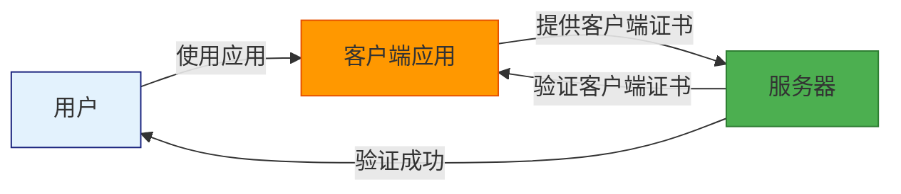

**流程说明**：
1. 用户启动客户端应用
2. 客户端应用提供证书
3. 服务器验证客户端证书
4. 验证成功后授权访问

### 3.3 证书字段差异

#### 3.3.1 服务器证书示例

```
Subject: CN = www.example.com
Subject Alternative Names:
    - DNS: www.example.com
    - DNS: example.com
Key Usage: Digital Signature, Key Encipherment
Extended Key Usage: Server Auth
```

#### 3.3.2 客户端证书示例

```
Subject: CN = John Doe, O = Example Inc.
Subject Alternative Names:
    - Email: john.doe@example.com
    - Other Name: user-id:12345
Key Usage: Digital Signature
Extended Key Usage: Client Auth
```

---

## 4. 证书申请、生成、签名和分发流程

### 4.1 客户端证书申请流程

#### 4.1.1 完整流程图

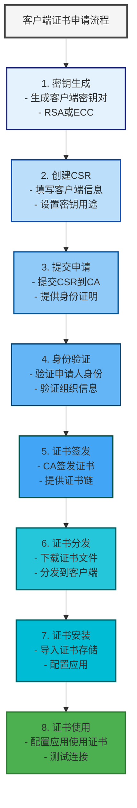

### 4.2 生成客户端密钥和CSR

#### 4.2.1 生成RSA密钥对

```bash
# 生成2048位RSA私钥
openssl genrsa -out client.key 2048

# 生成带密码保护的私钥
openssl genrsa -aes256 -out client-protected.key 2048
```

#### 4.2.2 生成ECC密钥对

```bash
# 生成P-256曲线ECC私钥
openssl ecparam -genkey -name prime256v1 -out client.key

# 生成P-384曲线ECC私钥
openssl ecparam -genkey -name secp384r1 -out client.key
```

#### 4.2.3 创建CSR

**交互式创建CSR**：
```bash
openssl req -new -key client.key -out client.csr
```

**使用配置文件创建CSR**：

创建配置文件 `client.cnf`：
```ini
[req]
default_bits = 2048
distinguished_name = req_distinguished_name
req_extensions = v3_req
prompt = no

[req_distinguished_name]
C = CN
ST = Beijing
L = Beijing
O = Example Inc.
OU = IT Department
CN = John Doe
emailAddress = john.doe@example.com

[v3_req]
basicConstraints = CA:FALSE
keyUsage = digitalSignature, keyEncipherment
extendedKeyUsage = clientAuth
subjectAltName = @alt_names

[alt_names]
email.1 = john.doe@example.com
otherName.1 = 1.3.6.1.4.1.311.20.2.1;UTF8:john.doe
```

生成CSR：
```bash
openssl req -new -key client.key -out client.csr -config client.cnf
```

### 4.3 私有CA签发证书

#### 4.3.1 创建私有CA

```bash
# 创建CA目录结构
mkdir -p private certs newcerts
touch index.txt
echo 1000 > serial

# 生成CA私钥
openssl genrsa -aes256 -out private/ca.key.pem 4096

# 生成CA证书
openssl req -new -x509 -days 3650 -key private/ca.key.pem -out ca.cert.pem \
    -subj "/C=CN/ST=Beijing/L=Beijing/O=Example Inc./OU=IT Department/CN=Example CA"

# 创建CA配置文件
cat > ca.cnf <<EOF
[ ca ]
default_ca = ca_default

[ ca_default ]
dir = .
certificate = $dir/ca.cert.pem
private_key = $dir/private/ca.key.pem
new_certs_dir = $dir/newcerts
database = $dir/index.txt
serial = $dir/serial
default_md = sha256
default_days = 365
default_crl_days = 30

[ policy ]
countryName = optional
stateOrProvinceName = optional
organizationName = optional
organizationalUnitName = optional
commonName = supplied
emailAddress = optional

[ req ]
default_bits = 2048
default_keyfile = private/ca.key.pem
distinguished_name = req_distinguished_name
x509_extensions = v3_ca

[ req_distinguished_name ]
countryName = Country Name (2 letter code)
stateOrProvinceName = State or Province Name
localityName = Locality Name
organizationName = Organization Name
organizationalUnitName = Organizational Unit Name
commonName = Common Name
emailAddress = Email Address

[ v3_ca ]
subjectKeyIdentifier = hash
authorityKeyIdentifier = keyid:always,issuer
basicConstraints = critical,CA:TRUE,pathlen:0
keyUsage = critical, digitalSignature, cRLSign, keyCertSign
EOF
```

#### 4.3.2 签发客户端证书

```bash
# 使用CA签发客户端证书
openssl ca -config ca.cnf -in client.csr -out client.crt -days 365 \
    -cert ca.cert.pem -keyfile private/ca.key.pem \
    -extensions v3_req -extfile client.cnf

# 查看签发的证书
openssl x509 -in client.crt -text -noout
```

### 4.4 证书分发

#### 4.4.1 分发格式

客户端证书通常以以下格式分发：

| 格式 | 扩展名 | 说明 |
|--------|----------|------|
| **PEM** | .pem, .crt, .cer | 文本格式，Base64编码 |
| **PKCS#12** | .p12, .pfx | 二进制格式，包含证书和私钥，使用密码保护 |
| **DER** | .der | 二进制格式，通常用于Java |

#### 4.4.2 生成PKCS#12文件

```bash
# 生成PKCS#12文件（包含证书和私钥）
openssl pkcs12 -export -out client.p12 \
    -inkey client.key \
    -in client.crt \
    -certfile ca.cert.pem \
    -name "John Doe" \
    -caname "Example CA"

# 使用密码保护
openssl pkcs12 -export -out client-protected.p12 \
    -inkey client.key \
    -in client.crt \
    -certfile ca.cert.pem \
    -name "John Doe" \
    -caname "Example CA" \
    -passout pass:SecurePassword123
```

#### 4.4.3 分发方法

1. **直接下载**：
   - 通过Web门户下载
   - 通过邮件发送

2. **USB/存储介质**：
   - 适用于高安全环境
   - 物理分发

3. **自动化部署**：
   - 使用配置管理工具
   - MDM（移动设备管理）

---

## 5. X.509证书格式及字段含义

### 5.1 X.509证书结构

X.509证书使用ASN.1（Abstract Syntax Notation One）编码，包含以下主要部分：

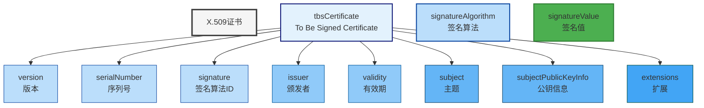

### 5.2 主要字段详解

#### 5.2.1 Version（版本）

| 版本 | 值 | 说明 |
|--------|-----|------|
| **v1** | 0 | 最初版本，不支持扩展 |
| **v2** | 1 | 支持唯一标识符 |
| **v3** | 2 | 支持扩展字段，当前标准 |

#### 5.2.2 Serial Number（序列号）

- 由CA分配的唯一编号
- 用于标识特定的证书
- 在CRL中用于标识吊销的证书

#### 5.2.3 Signature Algorithm（签名算法）

指定CA使用的签名算法：

| 算法 | OID | 说明 |
|--------|-----|------|
| **SHA256withRSA** | 1.2.840.113549.1.1.1.11 | RSA + SHA-256 |
| **SHA384withRSA** | 1.2.840.113549.1.1.1.12 | RSA + SHA-384 |
| **SHA256withECDSA** | 1.2.840.10045.4.3.2 | ECDSA + SHA-256 |

#### 5.2.4 Issuer（颁发者）

标识签发证书的CA：

```
Issuer: C = CN, ST = Beijing, L = Beijing, O = Example Inc., OU = IT Department, CN = Example CA
```

#### 5.2.5 Validity（有效期）

定义证书的有效时间范围：

```
Not Before: Jan  1 00:00:00 2024 GMT
Not After : Dec 31 23:59:59 2024 GMT
```

#### 5.2.6 Subject（主题）

标识证书持有者：

**服务器证书**：
```
Subject: CN = www.example.com
```

**客户端证书**：
```
Subject: C = CN, ST = Beijing, L = Beijing, O = Example Inc., OU = IT Department, CN = John Doe, emailAddress = john.doe@example.com
```

#### 5.2.7 Subject Public Key Info（公钥信息）

包含公钥和算法信息：

```
Public Key Algorithm: rsaEncryption
RSA Public Key: (2048 bit)
    Modulus:
        00:aa:bb:cc:dd:ee:ff:...
    Exponent: 65537 (0x10001)
```

#### 5.2.8 Extensions（扩展）

##### 5.2.8.1 Key Usage（密钥用途）

定义密钥的合法用途：

| 用途 | 位 | 说明 |
|------|-----|------|
| **Digital Signature** | 0 | 数字签名 |
| **Non Repudiation** | 1 | 不可否认 |
| **Key Encipherment** | 2 | 密钥加密 |
| **Data Encipherment** | 3 | 数据加密 |
| **Key Agreement** | 4 | 密钥协商 |
| **Key Cert Sign** | 5 | 证书签名 |
| **CRL Sign** | 6 | CRL签名 |
| **Encipher Only** | 7 | 仅加密 |

**客户端证书典型设置**：
```
Key Usage: Digital Signature
```

##### 5.2.8.2 Extended Key Usage（扩展密钥用途）

更详细的密钥用途定义：

| 用途 | OID | 说明 |
|------|-----|------|
| **Server Auth** | 1.3.6.1.5.5.7.3.1 | 服务器认证 |
| **Client Auth** | 1.3.6.1.5.5.7.3.2 | 客户端认证 |
| **Code Signing** | 1.3.6.1.5.5.7.3.3 | 代码签名 |
| **Email Protection** | 1.3.6.1.5.5.7.3.4 | 邮件保护 |

**客户端证书典型设置**：
```
Extended Key Usage: Client Auth
```

##### 5.2.8.3 Subject Alternative Name（主题备用名称）

提供额外的主题标识：

**服务器证书**：
```
Subject Alternative Names:
    DNS: www.example.com
    DNS: example.com
    DNS: mail.example.com
```

**客户端证书**：
```
Subject Alternative Names:
    Email: john.doe@example.com
    Other Name: 1.3.6.1.4.1.311.20.2.1;UTF8:john.doe
    Other Name: 1.3.6.1.4.1.311.20.2.1;UTF8:user-id:12345
```

##### 5.2.8.4 Basic Constraints（基本约束）

定义证书的基本约束：

```
Basic Constraints:
    CA: FALSE
    Path Length: N/A
```

##### 5.2.8.5 Authority Key Identifier（颁发者密钥标识符）

标识CA的公钥：

```
Authority Key Identifier:
    KeyID: AA:BB:CC:DD:EE:FF:00:11:22:33:44:55:66:77:88:99:AA:BB
```

##### 5.2.8.6 Subject Key Identifier（主题密钥标识符）

标识证书的公钥：

```
Subject Key Identifier:
    KeyID: 11:22:33:44:55:66:77:88:99:AA:BB:CC:DD:EE:FF:00:11:22:33
```

### 5.3 查看证书字段

#### 5.3.1 使用OpenSSL查看证书

```bash
# 查看证书文本信息
openssl x509 -in client.crt -text -noout

# 查看证书摘要信息
openssl x509 -in client.crt -noout -subject -issuer -dates

# 查看证书指纹
openssl x509 -in client.crt -noout -fingerprint -sha256

# 查看证书公钥
openssl x509 -in client.crt -noout -pubkey
```

#### 5.3.2 解析PKCS#12文件

```bash
# 列出PKCS#12文件内容
openssl pkcs12 -in client.p12 -info

# 提取证书
openssl pkcs12 -in client.p12 -clcerts -nokeys

# 提取私钥
openssl pkcs12 -in client.p12 -nocerts -nodes

# 提取CA证书
openssl pkcs12 -in client.p12 -cacerts -nokeys
```

---

## 6. 客户端证书应用场景

### 6.1 双向TLS（mTLS）认证

#### 6.1.1 应用场景

mTLS用于需要验证客户端身份的场景：

| 场景 | 说明 | 典型应用 |
|--------|------|----------|
| **金融API** | 高安全要求，需要验证每个客户端 | 银行API、支付网关 |
| **内部系统** | 限制访问，需要身份验证 | 企业内部系统、管理后台 |
| **IoT设备** | 设备认证，防止未授权访问 | 智能设备、传感器 |
| **VPN访问** | 远程访问，需要身份验证 | 企业VPN、远程办公 |

#### 6.1.2 mTLS架构

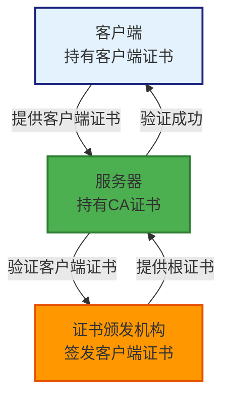

### 6.2 VPN认证

#### 6.2.1 OpenVPN客户端证书

**配置示例**：
```bash
# client.conf
client
dev tun
proto udp
remote vpn.example.com 1194

# 客户端证书配置
cert client.crt
key client.key

# CA证书配置
ca ca.crt

# 验证服务器
remote-cert-tls server
```

**启动OpenVPN**：
```bash
# 启动OpenVPN客户端
sudo openvpn --config client.conf

# 检查连接状态
sudo systemctl status openvpn@client
```

#### 6.2.2 WireGuard客户端证书

WireGuard使用公钥认证，但可以结合证书使用：

```bash
# 生成WireGuard密钥对
wg genkey | tee privatekey | wg pubkey > publickey

# 配置文件
[Interface]
PrivateKey = <privatekey内容>
Address = 10.0.0.2/24

[Peer]
PublicKey = <server公钥>
Endpoint = vpn.example.com:51820
AllowedIPs = 0.0.0.0/0
```

### 6.3 API认证

#### 6.3.1 REST API mTLS

**客户端配置**：
```python
import requests
import ssl

# 加载客户端证书和私钥
cert_file = '/path/to/client.crt'
key_file = '/path/to/client.key'

# 创建SSL上下文
context = ssl.create_default_context(ssl.Purpose.CLIENT_AUTH)
context.load_cert_chain(cert_file, key_file)

# 发送请求
response = requests.get(
    'https://api.example.com/endpoint',
    cert=(cert_file, key_file),
    verify='/path/to/ca.crt'
)

print(response.status_code)
```

**服务器配置**：
```python
from flask import Flask, request
import ssl

app = Flask(__name__)

@app.route('/endpoint')
def endpoint():
    # 获取客户端证书
    client_cert = request.environ.get('SSL_CLIENT_CERT')
    
    if not client_cert:
        return 'Client certificate required', 403
    
    # 验证客户端证书
    # ... 验证逻辑
    
    return 'Authenticated', 200

if __name__ == '__main__':
    # 配置SSL上下文
    context = ssl.SSLContext(ssl.PROTOCOL_TLS_SERVER)
    context.load_cert_chain('server.crt', 'server.key')
    context.verify_mode = ssl.CERT_REQUIRED
    context.load_verify_locations('ca.crt')
    
    app.run(ssl_context=context, port=443)
```

#### 6.3.2 GraphQL API mTLS

```python
import requests
import ssl

# GraphQL查询
query = '''
{
    user(id: "123") {
        name
        email
    }
}
'''

# 发送GraphQL请求
response = requests.post(
    'https://api.example.com/graphql',
    json={'query': query},
    cert=('/path/to/client.crt', '/path/to/client.key'),
    verify='/path/to/ca.crt'
)

print(response.json())
```

### 6.4 邮件加密（S/MIME）

#### 6.4.1 配置邮件客户端

**Thunderbird配置**：
1. 打开账户设置
2. 选择"端到端加密"
3. 选择S/MIME证书
4. 配置签名和加密选项

**Outlook配置**：
1. 文件 > 选项 > 信任中心
2. 导入S/MIME证书
3. 设置默认签名证书
4. 配置加密选项

#### 6.4.2 签名和加密邮件

```python
from email.mime.multipart import MIMEMultipart
from email.mime.text import MIMEText
from cryptography.hazmat.primitives import serialization, hashes
from cryptography.hazmat.primitives.asymmetric import padding
from cryptography.hazmat.backends import default_backend
import smtplib

# 加载证书和私钥
with open('client.crt', 'rb') as cert_file:
    cert = serialization.load_pem_x509_certificate(cert_file.read(), default_backend())

with open('client.key', 'rb') as key_file:
    private_key = serialization.load_pem_private_key(key_file.read(), password=None, backend=default_backend())

# 创建邮件
msg = MIMEMultipart()
msg['From'] = 'sender@example.com'
msg['To'] = 'recipient@example.com'
msg['Subject'] = 'Signed Email'

# 添加正文
body = MIMEText('This is a signed email.', 'plain')
msg.attach(body)

# 签名邮件
# ... 签名逻辑

# 发送邮件
smtp = smtplib.SMTP('smtp.example.com', 587)
smtp.send_message(msg)
smtp.quit()
```

### 6.5 代码签名

#### 6.5.1 签名可执行文件

```bash
# 使用OpenSSL签名
openssl dgst -sha256 -sign client.key -out signature.bin executable

# 验证签名
openssl dgst -sha256 -verify client.crt -signature signature.bin executable
```

#### 6.5.2 签名JAR文件

```bash
# 使用jarsigner签名
jarsigner -keystore keystore.jks \
    -signedjar signed-app.jar \
    -storepass password \
    -keypass password \
    app.jar \
    myalias

# 验证签名
jarsigner -verify -certs mycert.cer signed-app.jar
```

---

## 7. 证书生命周期管理

### 7.1 证书生命周期阶段

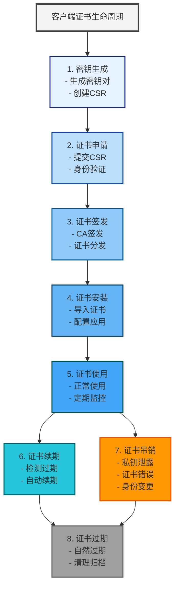

### 7.2 证书更新

#### 7.2.1 证书过期检测

**检查证书有效期**：
```bash
# 检查证书过期时间
openssl x509 -in client.crt -noout -dates

# 检查证书是否在30天内过期
openssl x509 -in client.crt -noout -checkend 2592000  # 30天 = 2592000秒
```

**Python脚本检测**：
```python
import ssl
import socket
from datetime import datetime, timedelta

def check_cert_expiry(hostname, port=443):
    context = ssl.create_default_context()
    with socket.create_connection((hostname, port)) as sock:
        with context.wrap_socket(sock, server_hostname=hostname) as ssock:
            cert = ssock.getpeercert(binary_form=True)
            x509 = ssl._ssl._test_decode_cert(cert)
            
            # 获取过期时间
            not_after = datetime.strptime(x509['notAfter'], '%b %d %b %Y %H:%M:%S %Z')
            days_left = (not_after - datetime.utcnow()).days
            
            print(f"证书过期时间: {not_after}")
            print(f"剩余天数: {days_left}")
            
            if days_left < 30:
                print("警告: 证书将在30天内过期!")
            elif days_left < 7:
                print("严重警告: 证书将在7天内过期!")

# 使用示例
check_cert_expiry('api.example.com')
```

#### 7.2.2 证书续期流程

1. **生成新密钥对**（推荐）：
```bash
# 生成新的私钥
openssl genrsa -out client-new.key 2048

# 生成新的CSR
openssl req -new -key client-new.key -out client-new.csr
```

2. **提交续期申请**：
```bash
# 提交到CA
# ... 提交逻辑
```

3. **安装新证书**：
```bash
# 备份旧证书
cp client.crt client.crt.backup
cp client.key client.key.backup

# 安装新证书
cp client-new.crt client.crt
cp client-new.key client.key

# 重启应用
sudo systemctl restart application
```

### 7.3 证书吊销

#### 7.3.1 吊销原因

| 原因 | 说明 | 处理方式 |
|--------|------|----------|
| **私钥泄露** | 私钥被未授权方获取 | 立即吊销 |
| **证书错误** | 证书信息错误 | 吊销并重新申请 |
| **身份变更** | 用户身份信息变更 | 吊销并重新申请 |
| **设备丢失** | 设备丢失或被盗 | 吊销证书 |
| **离职/转岗** | 员工离职或转岗 | 吊销证书 |

#### 7.3.2 吊销流程

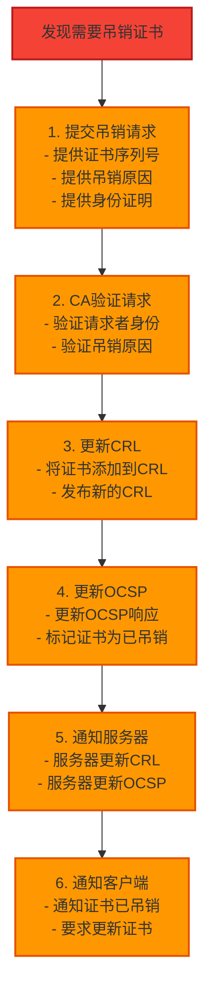

#### 7.3.3 使用OpenSSL吊销证书

```bash
# 创建吊销请求
cat > revoke.cnf <<EOF
[ ca ]
default_ca = ca_default

[ ca_default ]
dir = .
certificate = $dir/ca.cert.pem
private_key = $dir/private/ca.key.pem
new_certs_dir = $dir/newcerts
database = $dir/index.txt
serial = $dir/serial
default_md = sha256
default_days = 365
default_crl_days = 30

[ policy ]
countryName = optional
stateOrProvinceName = optional
organizationName = optional
organizationalUnitName = optional
commonName = supplied
emailAddress = optional
EOF

# 吊销证书
openssl ca -config revoke.cnf -revoke client.crt -keyfile private/ca.key.pem -cert ca.cert.pem

# 生成CRL
openssl ca -config revoke.cnf -gencrl -out crl.pem -keyfile private/ca.key.pem -cert ca.cert.pem

# 查看CRL
openssl crl -in crl.pem -text -noout
```

### 7.4 证书吊销列表（CRL）

#### 7.4.1 CRL格式

CRL是证书吊销列表，包含所有被吊销的证书信息：

```
Certificate Revocation List (CRL):
    Version: 2 (0x1)
    Signature Algorithm: sha256WithRSAEncryption
    Issuer: C = CN, O = Example Inc., CN = Example CA
    Last Update: Jan  1 00:00:00 2024 GMT
    Next Update: Jan  8 00:00:00 2024 GMT
    Revoked Certificates:
        Serial Number: 0x1234
            Revocation Date: Jan  1 12:00:00 2024 GMT
            CRL Entry Extensions:
                Reason: keyCompromise
                Invalidity Date: Jan  1 12:00:00 2024 GMT
        Serial Number: 0x5678
            Revocation Date: Jan  2 10:00:00 2024 GMT
            CRL Entry Extensions:
                Reason: cessationOfOperation
                Invalidity Date: Jan  2 10:00:00 2024 GMT
    Signature Algorithm: sha256WithRSAEncryption
    Signature: AA:BB:CC:DD:...
```

#### 7.4.2 吊销原因代码

| 原因 | 代码 | 说明 |
|--------|------|------|
| **Unspecified** | 0 | 未指定 |
| **Key Compromise** | 1 | 密钥泄露 |
| **CA Compromise** | 2 | CA泄露 |
| **Affiliation Changed** | 3 | 关系变更 |
| **Superseded** | 4 | 被替代 |
| **Cessation of Operation** | 5 | 停止运营 |
| **Certificate Hold** | 6 | 证书暂停 |
| **Remove from CRL** | 8 | 从CRL移除 |

#### 7.4.3 配置服务器使用CRL

**Nginx配置**：
```nginx
server {
    listen 443 ssl;
    server_name api.example.com;

    ssl_certificate /etc/ssl/server.crt;
    ssl_certificate_key /etc/ssl/server.key;
    ssl_client_certificate /etc/ssl/ca.crt;  # CA证书
    
    # 配置CRL
    ssl_crl /etc/ssl/crl.pem;
    
    # 要求客户端证书
    ssl_verify_client on;
    ssl_verify_depth 2;
}
```

**Apache配置**：
```apache
<VirtualHost *:443>
    ServerName api.example.com

    SSLEngine on
    SSLCertificateFile /etc/ssl/server.crt
    SSLCertificateKeyFile /etc/ssl/server.key
    SSLCACertificateFile /etc/ssl/ca.crt
    
    # 配置CRL
    SSLCARevocationFile /etc/ssl/crl.pem
    SSLCARevocationCheck on
    
    # 要求客户端证书
    SSLVerifyClient require
    SSLVerifyDepth 2
</VirtualHost>
```

#### 7.4.4 CRL分发

```bash
# 发布CRL到Web服务器
cp crl.pem /var/www/html/crl.pem

# 配置Web服务器提供CRL
# ... Nginx/Apache配置

# 测试CRL访问
curl http://example.com/crl.pem
```

### 7.5 OCSP（在线证书状态协议）

#### 7.5.1 OCSP工作原理

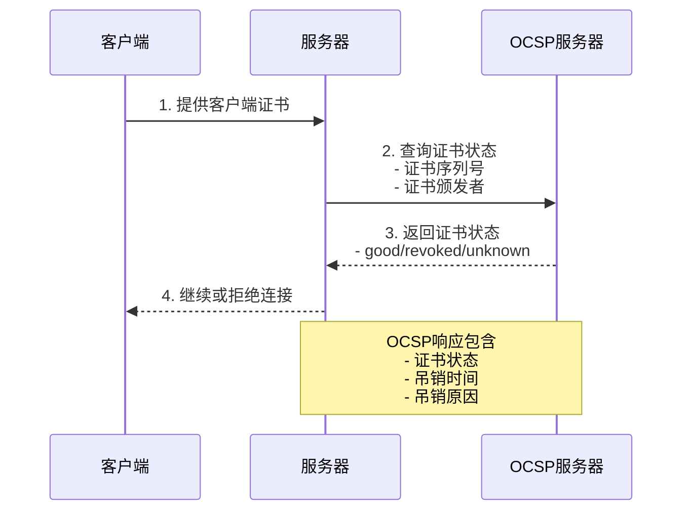

#### 7.5.2 配置OCSP服务器

**使用OpenSSL配置OCSP**：
```bash
# 创建OCSP配置
cat > ocsp.cnf <<EOF
[ ocsp ]
default_ca = ca_default

[ ca_default ]
dir = .
certificate = $dir/ca.cert.pem
private_key = $dir/private/ca.key.pem
new_certs_dir = $dir/newcerts
database = $dir/index.txt
serial = $dir/serial
default_md = sha256
default_days = 365
default_crl_days = 30

[ policy ]
countryName = optional
stateOrProvinceName = optional
organizationName = optional
organizationalUnitName = optional
commonName = supplied
emailAddress = optional
EOF

# 启动OCSP服务器
openssl ocsp -index index.txt -port 8080 \
    -rsigner ca.cert.pem -rkey private/ca.key.pem \
    -CA ca.cert.pem -text
```

#### 7.5.3 查询OCSP状态

```bash
# 查询证书状态
openssl ocsp -issuer ca.crt -cert client.crt \
    -url http://ocsp.example.com:8080

# 输出示例
Response verify OK
client.crt: good
    This Update: Jan  1 00:00:00 2024 GMT
    Next Update: Jan  8 00:00:00 2024 GMT
```

---

## 8. 不同环境下的配置和使用

### 8.1 Windows环境

#### 8.1.1 导入证书到Windows证书存储

**使用证书管理器**：
1. 双击证书文件（.crt, .p12）
2. 选择"本地计算机"或"当前用户"
3. 选择存储位置：
   - 个人（Personal）：客户端证书
   - 受信任的根证书颁发机构（Trusted Root CA）：根证书
   - 中间证书颁发机构（Intermediate CA）：中间证书
4. 完成导入

**使用命令行**：
```powershell
# 导入PFX证书
certutil -f PFX -importpfx client.p12

# 导入到个人存储
certutil -addstore "MY" client.crt

# 导入到根证书存储
certutil -addstore "ROOT" ca.crt

# 查看证书
certutil -store MY -list
```

#### 8.1.2 配置浏览器使用客户端证书

**Chrome浏览器**：
1. 设置 > 隐私和安全 > 安全 > 管理证书
2. 导入客户端证书
3. 选择证书文件
4. 输入密码（如果需要）
5. 完成导入

**Firefox浏览器**：
1. 选项 > 隐私与安全 > 证书
2. 点击"查看证书"
3. 点击"导入"
4. 选择证书文件
5. 选择用途（客户端认证）
6. 完成导入

#### 8.1.3 配置应用程序使用客户端证书

**配置文件示例**：
```ini
# application.ini
[ssl]
client_cert = C:\Users\username\AppData\Roaming\certs\client.crt
client_key = C:\Users\username\AppData\Roaming\certs\client.key
ca_cert = C:\Users\username\AppData\Roaming\certs\ca.crt
```

### 8.2 Linux环境

#### 8.2.1 导入证书到Linux证书存储

**Ubuntu/Debian**：
```bash
# 复制证书到系统目录
sudo cp client.crt /usr/local/share/ca-certificates/
sudo cp ca.crt /usr/local/share/ca-certificates/

# 更新证书存储
sudo update-ca-certificates

# 验证导入
ls -la /etc/ssl/certs/
```

**CentOS/RHEL**：
```bash
# 复制证书到系统目录
sudo cp client.crt /etc/pki/tls/certs/
sudo cp ca.crt /etc/pki/tls/certs/

# 更新证书存储
sudo update-ca-trust

# 验证导入
ls -la /etc/pki/tls/certs/
```

#### 8.2.2 配置OpenSSL使用客户端证书

**环境变量配置**：
```bash
# 设置环境变量
export SSL_CERT_FILE=/path/to/client.crt
export SSL_KEY_FILE=/path/to/client.key
export SSL_CA_FILE=/path/to/ca.crt

# 使用curl测试
curl --cert $SSL_CERT_FILE --key $SSL_KEY_FILE --cacert $SSL_CA_FILE https://api.example.com
```

**OpenSSL配置文件**：
```bash
# 创建OpenSSL配置
cat > ~/.openssl.cnf <<EOF
[ client ]
cert = /path/to/client.crt
key = /path/to/client.key
ca = /path/to/ca.crt
EOF

# 使用配置文件
openssl s_client -connect api.example.com:443 -config ~/.openssl.cnf
```

#### 8.2.3 配置Nginx/Apache使用客户端证书

**Nginx配置**：
```nginx
# 上游服务器配置
upstream backend {
    server api.example.com:443;
}

server {
    listen 80;
    server_name proxy.example.com;

    location / {
        proxy_pass https://backend;
        
        # 客户端证书配置
        proxy_ssl_certificate /etc/ssl/client.crt;
        proxy_ssl_certificate_key /etc/ssl/client.key;
        proxy_ssl_trusted_certificate /etc/ssl/ca.crt;
    }
}
```

**Apache配置**：
```apache
<VirtualHost *:80>
    ServerName proxy.example.com

    SSLProxyEngine on
    SSLProxyCertificateFile /etc/ssl/client.crt
    SSLProxyCertificateKeyFile /etc/ssl/client.key
    SSLProxyCACertificateFile /etc/ssl/ca.crt

    ProxyPass / https://api.example.com/
    ProxyPassReverse / https://api.example.com/
</VirtualHost>
```

### 8.3 macOS环境

#### 8.3.1 导入证书到钥匙串

**使用钥匙串访问**：
1. 打开"钥匙串访问"（Keychain Access）
2. 文件 > 导入项目
3. 选择证书文件
4. 选择钥匙串：
   - 系统（System）：系统级证书
   - 登录（Login）：用户级证书
5. 输入密码（如果需要）
6. 完成导入

**使用命令行**：
```bash
# 导入证书到登录钥匙串
security import client.crt -k ~/Library/Keychains/login.keychain

# 导入PFX证书
security import client.p12 -k ~/Library/Keychains/login.keychain -P password

# 设置信任
security add-trusted-cert -k ~/Library/Keychains/System.keychain -r client.crt

# 查看证书
security find-certificate -c "John Doe" -p ~/Library/Keychains/login.keychain
```

#### 8.3.2 配置浏览器使用客户端证书

**Safari浏览器**：
1. Safari > 偏好设置
2. 隐私 > 网站设置 > 管理证书
3. 导入客户端证书
4. 选择证书文件
5. 完成导入

**Chrome浏览器**：
1. Chrome > 设置 > 隐私和安全 > 安全 > 管理证书
2. 导入客户端证书
3. 选择证书文件
4. 完成导入

### 8.4 移动设备环境

#### 8.4.1 iOS设备

**使用配置描述文件**：
```xml
<!-- client-cert.mobileconfig -->
<?xml version="1.0" encoding="UTF-8"?>
<!DOCTYPE plist PUBLIC "-//Apple//DTD PLIST 1.0//EN" "http://www.apple.com/DTDs/PropertyList-1.0.dtd">
<plist version="1.0">
<dict>
    <key>PayloadContent</key>
    <array>
        <dict>
            <key>PayloadDescription</key>
            <string>Client Certificate Configuration</string>
            <key>PayloadDisplayName</key>
            <string>Client Certificate</string>
            <key>PayloadIdentifier</key>
            <string>com.example.clientcert</string>
            <key>PayloadType</key>
            <string>com.apple.security.pkcs12</string>
            <key>PayloadUUID</key>
            <string>12345678-1234-1234-1234-123456789012</string>
            <key>PayloadVersion</key>
            <integer>1</integer>
            <key>PKCS12</key>
            <data>BASE64编码的P12文件</data>
            <key>Password</key>
            <string>密码</string>
        </dict>
    </array>
</dict>
</plist>
```

**安装配置描述文件**：
1. 通过邮件发送.mobileconfig文件
2. 点击附件安装
3. 输入设备密码
4. 完成安装

#### 8.4.2 Android设备

**使用证书安装器**：
1. 将证书文件传输到设备
2. 打开证书文件
3. 选择证书用途：
   - VPN和应用
   - Wi-Fi
   - 凭据存储
4. 输入证书名称
5. 完成安装

**使用ADB安装**：
```bash
# 推送证书到设备
adb push client.crt /sdcard/
adb shell settings put global ca_cert /sdcard/client.crt

# 重启设备
adb reboot
```

### 8.5 编程语言环境

#### 8.5.1 Python环境

**使用requests库**：
```python
import requests
import ssl

# 加载证书
cert = ('/path/to/client.crt', '/path/to/client.key')
ca_cert = '/path/to/ca.crt'

# 发送请求
response = requests.get(
    'https://api.example.com/endpoint',
    cert=cert,
    verify=ca_cert
)

print(response.status_code)
print(response.text)
```

**使用aiohttp库**：
```python
import aiohttp
import ssl

# 创建SSL上下文
ssl_context = ssl.create_default_context(ssl.Purpose.CLIENT_AUTH)
ssl_context.load_cert_chain(
    '/path/to/client.crt',
    '/path/to/client.key'
)

async def fetch():
    async with aiohttp.ClientSession() as session:
        async with session.get(
            'https://api.example.com/endpoint',
            ssl=ssl_context
        ) as response:
            return await response.text()

# 使用
import asyncio
result = asyncio.run(fetch())
print(result)
```

#### 8.5.2 Java环境

**使用HttpClient**：
```java
import javax.net.ssl.*;
import java.io.*;
import java.security.cert.*;
import java.security.KeyStore;

public class ClientCertExample {
    public static void main(String[] args) throws Exception {
        // 加载密钥库
        KeyStore keyStore = KeyStore.getInstance("PKCS12");
        try (FileInputStream fis = new FileInputStream("client.p12")) {
            keyStore.load(fis, "password".toCharArray());
        }
        
        // 创建SSL上下文
        SSLContext sslContext = SSLContext.getInstance("TLS");
        KeyManagerFactory kmf = KeyManagerFactory.getInstance("PKIX");
        kmf.init(keyStore, "password".toCharArray());
        sslContext.init(kmf.getKeyManagers(), null, null);
        
        // 创建HttpClient
        HttpClient client = HttpClient.newBuilder()
            .sslContext(sslContext)
            .build();
        
        // 发送请求
        HttpRequest request = HttpRequest.newBuilder()
            .uri(URI.create("https://api.example.com/endpoint"))
            .build();
        
        HttpResponse<String> response = client.send(request, HttpResponse.BodyHandlers.ofString());
        System.out.println(response.statusCode());
        System.out.println(response.body());
    }
}
```

**使用Spring Boot**：
```java
import org.springframework.boot.web.client.RestTemplate;
import org.springframework.http.*;
import org.springframework.http.client.*;
import javax.net.ssl.*;

@Configuration
public class SSLConfig {
    @Bean
    public RestTemplate restTemplate() throws Exception {
        // 加载密钥库
        KeyStore keyStore = KeyStore.getInstance("PKCS12");
        try (FileInputStream fis = new FileInputStream("client.p12")) {
            keyStore.load(fis, "password".toCharArray());
        }
        
        // 创建SSL上下文
        SSLContext sslContext = SSLContextBuilder.create()
            .loadKeyMaterial(keyStore, "password".toCharArray())
            .build();
        
        // 创建RestTemplate
        return new RestTemplate(new HttpComponentsClientHttpRequestFactory(
            HttpClients.custom()
                .setSSLContext(sslContext)
                .build()
        ));
    }
}
```

#### 8.5.3 Node.js环境

**使用axios库**：
```javascript
const https = require('https');
const fs = require('fs');

// 加载证书和密钥
const options = {
    cert: fs.readFileSync('/path/to/client.crt'),
    key: fs.readFileSync('/path/to/client.key'),
    ca: fs.readFileSync('/path/to/ca.crt'),
    rejectUnauthorized: false
};

// 发送请求
const req = https.request('https://api.example.com/endpoint', options, (res) => {
    let data = '';
    res.on('data', (chunk) => {
        data += chunk;
    });
    res.on('end', () => {
        console.log(data);
    });
});

req.on('error', (e) => {
    console.error(e);
});

req.end();
```

**使用axios库**：
```javascript
const axios = require('axios');
const fs = require('fs');
const https = require('https');

// 创建HTTPS Agent
const agent = new https.Agent({
    cert: fs.readFileSync('/path/to/client.crt'),
    key: fs.readFileSync('/path/to/client.key'),
    ca: fs.readFileSync('/path/to/ca.crt')
});

// 发送请求
axios.get('https://api.example.com/endpoint', {
    httpsAgent: agent
})
.then(response => {
    console.log(response.data);
})
.catch(error => {
    console.error(error);
});
```

#### 8.5.4 Go环境

**使用net/http包**：
```go
package main

import (
    "crypto/tls"
    "crypto/x509"
    "io/ioutil"
    "net/http"
    "log"
)

func main() {
    // 加载证书和密钥
    cert, err := tls.LoadX509KeyPair("client.crt", "client.key")
    if err != nil {
        log.Fatal(err)
    }
    
    // 加载CA证书
    caCert, err := ioutil.ReadFile("ca.crt")
    if err != nil {
        log.Fatal(err)
    }
    
    caCertPool := x509.NewCertPool()
    caCertPool.AppendCertsFromPEM(caCert)
    
    // 创建TLS配置
    tlsConfig := &tls.Config{
        Certificates: []tls.Certificate{cert},
        RootCAs:    caCertPool,
    }
    
    // 创建HTTP客户端
    transport := &http.Transport{
        TLSClientConfig: tlsConfig,
    }
    
    client := &http.Client{
        Transport: transport,
    }
    
    // 发送请求
    resp, err := client.Get("https://api.example.com/endpoint")
    if err != nil {
        log.Fatal(err)
    }
    defer resp.Body.Close()
    
    body, err := ioutil.ReadAll(resp.Body)
    if err != nil {
        log.Fatal(err)
    }
    
    log.Printf("Status: %d\n", resp.StatusCode)
    log.Printf("Body: %s\n", string(body))
}
```

---

## 9. 常见问题与解决方案

### 9.1 证书相关错误

#### 9.1.1 证书过期错误

**错误信息**：
```
SSL certificate has expired
```

**解决方案**：
1. 检查证书有效期：
```bash
openssl x509 -in client.crt -noout -dates
```

2. 续期证书：
   - 生成新的CSR
   - 提交到CA
   - 安装新证书

3. 更新应用配置：
   - 替换旧证书
   - 重启应用

#### 9.1.2 证书尚未生效错误

**错误信息**：
```
SSL certificate is not yet valid
```

**解决方案**：
1. 检查系统时间：
```bash
# Linux
date

# Windows
powershell Get-Date
```

2. 同步系统时间：
```bash
# Linux
sudo ntpdate pool.ntp.org

# Windows
w32tm /resync
```

#### 9.1.3 证书链不完整错误

**错误信息**：
```
SSL certificate problem: unable to get local issuer certificate
```

**解决方案**：
1. 检查证书链：
```bash
openssl verify -CAfile ca.crt -untrusted intermediate.crt client.crt
```

2. 提供完整的证书链：
   - 包含中间证书
   - 配置正确的CA证书

3. 验证证书链完整性：
```bash
# 验证证书链
openssl s_client -connect api.example.com:443 -showcerts
```

### 9.2 配置相关错误

#### 9.2.1 私钥不匹配错误

**错误信息**：
```
SSL: error:0B080074:x509 certificate routines:X509_check_private_key:key values mismatch
```

**解决方案**：
1. 验证私钥和证书匹配：
```bash
# 检查私钥
openssl rsa -in client.key -noout -modulus | openssl md5

# 检查证书
openssl x509 -in client.crt -noout -modulus | openssl md5

# 两个MD5值应该相同
```

2. 使用正确的私钥：
   - 确保使用匹配的私钥文件
   - 检查文件路径

#### 9.2.2 证书格式错误

**错误信息**：
```
SSL: error:0906D06C:PEM routines:PEM_read_bio:no start line
```

**解决方案**：
1. 检查证书格式：
```bash
# 查看证书格式
file client.crt

# 转换格式
openssl x509 -in client.der -inform DER -out client.crt -outform PEM
```

2. 使用正确的格式：
   - PEM格式：文本格式，以-----BEGIN CERTIFICATE-----开头
   - DER格式：二进制格式
   - PKCS#12格式：包含证书和私钥

#### 9.2.3 证书权限错误

**错误信息**：
```
SSL: error:0200100D:system library:fopen:Permission denied
```

**解决方案**：
1. 检查文件权限：
```bash
ls -la client.crt
ls -la client.key
```

2. 设置正确的权限：
```bash
# 证书文件
chmod 644 client.crt

# 私钥文件
chmod 600 client.key

# 目录权限
chmod 755 /path/to/certs/
```

### 9.3 连接相关错误

#### 9.3.1 服务器不信任客户端证书错误

**错误信息**：
```
SSL: error:14094412:SSL routines:ssl3_read_bytes:sslv3 alert bad certificate
```

**解决方案**：
1. 检查服务器是否信任CA：
   - 确认服务器配置了正确的CA证书
   - 检查CA证书是否过期

2. 更新服务器CA证书：
```bash
# 更新Nginx配置
ssl_client_certificate /etc/ssl/ca.crt;

# 重新加载配置
sudo nginx -s reload
```

#### 9.3.2 服务器请求客户端证书但未提供错误

**错误信息**：
```
SSL: error:14094410:SSL routines:ssl3_read_bytes:sslv3 alert handshake failure
```

**解决方案**：
1. 检查服务器配置：
   - 确认服务器要求客户端证书
   - 检查客户端证书配置

2. 配置客户端提供证书：
```python
import requests

# 确保提供证书
response = requests.get(
    'https://api.example.com/endpoint',
    cert=('/path/to/client.crt', '/path/to/client.key')
)
```

### 9.4 性能问题

#### 9.4.1 TLS握手慢

**可能原因**：
- 证书链过长
- OCSP查询慢
- 服务器性能问题

**解决方案**：
1. 优化证书链：
   - 减少中间证书数量
   - 使用更短的证书链

2. 启用OCSP Stapling：
   - 服务器缓存OCSP响应
   - 减少客户端查询

3. 使用更快的加密算法：
   - 优先使用ECC证书
   - 使用TLS 1.3

#### 9.4.2 证书验证失败率高

**可能原因**：
- CRL更新不及时
- OCSP服务不可用
- 证书配置错误

**解决方案**：
1. 定期更新CRL：
```bash
# 配置CRL自动更新
# ... 定期下载CRL的脚本
```

2. 配置OCSP备用服务器：
```bash
# 配置多个OCSP服务器
# ... 配置逻辑
```

3. 监控证书状态：
```python
import ssl
import socket
from datetime import datetime

def monitor_cert(hostname, port=443):
    context = ssl.create_default_context()
    with socket.create_connection((hostname, port)) as sock:
        with context.wrap_socket(sock, server_hostname=hostname) as ssock:
            cert = ssock.getpeercert(binary_form=True)
            x509 = ssl._ssl._test_decode_cert(cert)
            
            # 检查证书状态
            print(f"证书: {x509['subject']}")
            print(f"过期时间: {x509['notAfter']}")
            
            # 检查是否在CRL中
            # ... CRL检查逻辑

# 定期监控
while True:
    monitor_cert('api.example.com')
    time.sleep(3600)  # 每小时检查一次
```

---

## 10. 附录：配置示例

### 10.1 完整的Nginx mTLS配置

```nginx
# /etc/nginx/nginx.conf

user nginx;
worker_processes auto;
error_log /var/log/nginx/error.log warn;
pid /var/run/nginx.pid;

events {
    worker_connections 1024;
}

http {
    include /etc/nginx/mime.types;
    default_type application/octet-stream;

    log_format main '$remote_addr - $remote_user [$time_local] "$request" '
                    '$status $body_bytes_sent "$http_referer" '
                    '"$http_user_agent" "$http_x_forwarded_for"';

    access_log /var/log/nginx/access.log main;

    sendfile on;
    tcp_nopush on;
    tcp_nodelay on;
    keepalive_timeout 65;
    types_hash_max_size 2048;
    client_max_body_size 20m;

    # SSL配置
    ssl_session_cache shared:SSL:10m;
    ssl_session_timeout 10m;
    ssl_protocols TLSv1.2 TLSv1.3;
    ssl_ciphers 'ECDHE-ECDSA-AES128-GCM-SHA256:ECDHE-RSA-AES128-GCM-SHA256';
    ssl_prefer_server_ciphers off;

    # mTLS配置
    upstream backend {
        server api.example.com:443;
    }

    server {
        listen 443 ssl http2;
        server_name proxy.example.com;

        # 服务器证书
        ssl_certificate /etc/ssl/server.crt;
        ssl_certificate_key /etc/ssl/server.key;

        # 客户端证书验证
        ssl_client_certificate /etc/ssl/ca.crt;
        ssl_verify_client on;
        ssl_verify_depth 2;
        ssl_client_verify on;

        # CRL配置
        ssl_crl /etc/ssl/crl.pem;

        # OCSP配置
        ssl_stapling on;
        ssl_stapling_verify on;
        ssl_trusted_certificate /etc/ssl/ca-chain.crt;
        resolver 8.8.8.8 8.8.4.4 valid=300s;
        resolver_timeout 5s;

        # 安全头
        add_header Strict-Transport-Security "max-age=31536000; includeSubDomains" always;
        add_header X-Frame-Options "SAMEORIGIN" always;
        add_header X-Content-Type-Options "nosniff" always;

        location / {
            proxy_pass https://backend;
            proxy_set_header Host $host;
            proxy_set_header X-Real-IP $remote_addr;
            proxy_set_header X-Forwarded-For $proxy_add_x_forwarded_for;
            proxy_set_header X-Forwarded-Proto $scheme;

            proxy_ssl_certificate /etc/ssl/client.crt;
            proxy_ssl_certificate_key /etc/ssl/client.key;
        }

        # 健康检查
        location /health {
            access_log off;
            return 200 "healthy\n";
            add_header Content-Type text/plain;
        }
    }
}
```

### 10.2 完整的Apache mTLS配置

```apache
# /etc/apache2/sites-available/mtls.conf

<VirtualHost *:443>
    ServerName proxy.example.com

    # 启用SSL
    SSLEngine on

    # 服务器证书
    SSLCertificateFile /etc/ssl/server.crt
    SSLCertificateKeyFile /etc/ssl/server.key

    # 客户端证书验证
    SSLCACertificateFile /etc/ssl/ca.crt
    SSLVerifyClient require
    SSLVerifyDepth 2

    # CRL配置
    SSLCARevocationFile /etc/ssl/crl.pem
    SSLCARevocationCheck on

    # SSL协议和加密套件
    SSLProtocol all -SSLv2 -SSLv3 -TLSv1 -TLSv1.1
    SSLCipherSuite ECDHE-ECDSA-AES128-GCM-SHA256:ECDHE-RSA-AES128-GCM-SHA256
    SSLHonorCipherOrder off

    # SSL会话缓存
    SSLSessionCache shmcb:/var/run/apache2/ssl_scache(512000)
    SSLSessionCacheTimeout 300
    SSLSessionTickets off

    # OCSP Stapling
    SSLUseStapling on
    SSLStaplingCache shmcb:/var/run/apache2/ocsp(128000)
    SSLStaplingResponderTimeout 5
    SSLStaplingReturnResponderErrors off

    # 日志配置
    ErrorLog ${APACHE_LOG_DIR}/error.log
    CustomLog ${APACHE_LOG_DIR}/access.log combined

    # 安全头
    Header always set Strict-Transport-Security "max-age=31536000; includeSubDomains"
    Header always set X-Frame-Options "SAMEORIGIN"
    Header always set X-Content-Type-Options "nosniff"

    # 代理配置
    SSLProxyEngine on
    SSLProxyCertificateFile /etc/ssl/client.crt
    SSLProxyCertificateKeyFile /etc/ssl/client.key
    SSLProxyCACertificateFile /etc/ssl/ca.crt

    ProxyPass / https://api.example.com/
    ProxyPassReverse / https://api.example.com/
    ProxyPreserveHost On

    # 健康检查
    <Location /health>
        AuthType None
        Require all granted
        Order allow,deny
        Allow from all
    </Location>
</VirtualHost>
```

### 10.3 Python mTLS客户端示例

```python
import requests
import ssl
import logging
from typing import Optional, Tuple

class MTLSClient:
    """mTLS客户端类"""
    
    def __init__(
        self,
        cert_file: str,
        key_file: str,
        ca_file: Optional[str] = None,
        verify: bool = True
    ):
        """
        初始化mTLS客户端
        
        Args:
            cert_file: 客户端证书文件路径
            key_file: 客户端私钥文件路径
            ca_file: CA证书文件路径（可选）
            verify: 是否验证服务器证书
        """
        self.cert_file = cert_file
        self.key_file = key_file
        self.ca_file = ca_file
        self.verify = verify
        
        # 配置日志
        logging.basicConfig(
            level=logging.INFO,
            format='%(asctime)s - %(name)s - %(levelname)s - %(message)s'
        )
        self.logger = logging.getLogger(__name__)
    
    def get(self, url: str, **kwargs) -> requests.Response:
        """
        发送GET请求
        
        Args:
            url: 请求URL
            **kwargs: 其他请求参数
            
        Returns:
            Response对象
        """
        try:
            cert = (self.cert_file, self.key_file)
            verify = self.ca_file if self.ca_file else self.verify
            
            self.logger.info(f"发送GET请求: {url}")
            response = requests.get(url, cert=cert, verify=verify, **kwargs)
            
            self.logger.info(f"响应状态: {response.status_code}")
            return response
            
        except requests.exceptions.SSLError as e:
            self.logger.error(f"SSL错误: {e}")
            raise
        except requests.exceptions.RequestException as e:
            self.logger.error(f"请求错误: {e}")
            raise
    
    def post(self, url: str, **kwargs) -> requests.Response:
        """
        发送POST请求
        
        Args:
            url: 请求URL
            **kwargs: 其他请求参数
            
        Returns:
            Response对象
        """
        try:
            cert = (self.cert_file, self.key_file)
            verify = self.ca_file if self.ca_file else self.verify
            
            self.logger.info(f"发送POST请求: {url}")
            response = requests.post(url, cert=cert, verify=verify, **kwargs)
            
            self.logger.info(f"响应状态: {response.status_code}")
            return response
            
        except requests.exceptions.SSLError as e:
            self.logger.error(f"SSL错误: {e}")
            raise
        except requests.exceptions.RequestException as e:
            self.logger.error(f"请求错误: {e}")
            raise

# 使用示例
if __name__ == '__main__':
    # 创建mTLS客户端
    client = MTLSClient(
        cert_file='/path/to/client.crt',
        key_file='/path/to/client.key',
        ca_file='/path/to/ca.crt'
    )
    
    # 发送请求
    response = client.get('https://api.example.com/endpoint')
    print(f"状态码: {response.status_code}")
    print(f"响应内容: {response.text}")
    
    # 发送POST请求
    data = {'key': 'value'}
    response = client.post('https://api.example.com/endpoint', json=data)
    print(f"状态码: {response.status_code}")
    print(f"响应内容: {response.json()}")
```

### 10.4 证书管理脚本

```bash
#!/bin/bash
# client-cert-manager.sh - 客户端证书管理脚本

set -euo pipefail

# 配置
CERT_DIR="/etc/ssl/client"
CA_CERT="$CERT_DIR/ca.crt"
CLIENT_CERT="$CERT_DIR/client.crt"
CLIENT_KEY="$CERT_DIR/client.key"
BACKUP_DIR="$CERT_DIR/backups"
WARNING_DAYS=30

# 颜色定义
RED='\033[0;31m'
GREEN='\033[0;32m'
YELLOW='\033[1;33m'
NC='\033[0m' # No Color

# 日志函数
log_info() {
    echo -e "${GREEN}[INFO]${NC} $1"
}

log_warn() {
    echo -e "${YELLOW}[WARN]${NC} $1"
}

log_error() {
    echo -e "${RED}[ERROR]${NC} $1"
}

# 检查证书有效期
check_cert_expiry() {
    local cert_file=$1
    
    if [ ! -f "$cert_file" ]; then
        log_error "证书文件不存在: $cert_file"
        return 1
    fi
    
    # 获取过期时间
    local expiry_date=$(openssl x509 -in "$cert_file" -noout -enddate | cut -d= -f2)
    local expiry_timestamp=$(date -d "$expiry_date" +%s)
    local current_timestamp=$(date +%s)
    local days_left=$(( (expiry_timestamp - current_timestamp) / 86400 ))
    
    log_info "证书过期时间: $expiry_date"
    log_info "剩余天数: $days_left"
    
    if [ $days_left -lt $WARNING_DAYS ]; then
        log_warn "警告: 证书将在 $WARNING_DAYS 天内过期!"
        return 1
    fi
    
    return 0
}

# 备份证书
backup_cert() {
    local timestamp=$(date +%Y%m%d_%H%M%S)
    local backup_dir="$BACKUP_DIR/$timestamp"
    
    mkdir -p "$backup_dir"
    
    log_info "备份证书到: $backup_dir"
    cp "$CLIENT_CERT" "$backup_dir/"
    cp "$CLIENT_KEY" "$backup_dir/"
    
    log_info "备份完成"
}

# 更新证书
update_cert() {
    local new_cert=$1
    local new_key=$2
    
    if [ ! -f "$new_cert" ] || [ ! -f "$new_key" ]; then
        log_error "新证书或密钥文件不存在"
        return 1
    fi
    
    # 备份旧证书
    backup_cert
    
    # 安装新证书
    log_info "安装新证书..."
    cp "$new_cert" "$CLIENT_CERT"
    cp "$new_key" "$CLIENT_KEY"
    
    # 设置权限
    chmod 644 "$CLIENT_CERT"
    chmod 600 "$CLIENT_KEY"
    
    log_info "证书更新完成"
    
    # 重启服务
    log_info "重启服务..."
    systemctl restart application
}

# 验证证书
verify_cert() {
    if [ ! -f "$CLIENT_CERT" ] || [ ! -f "$CLIENT_KEY" ]; then
        log_error "客户端证书或密钥不存在"
        return 1
    fi
    
    log_info "验证客户端证书..."
    
    # 验证私钥和证书匹配
    local key_modulus=$(openssl rsa -in "$CLIENT_KEY" -noout -modulus | openssl md5)
    local cert_modulus=$(openssl x509 -in "$CLIENT_CERT" -noout -modulus | openssl md5)
    
    if [ "$key_modulus" != "$cert_modulus" ]; then
        log_error "私钥和证书不匹配"
        return 1
    fi
    
    log_info "私钥和证书匹配"
    
    # 验证证书链
    if [ -f "$CA_CERT" ]; then
        openssl verify -CAfile "$CA_CERT" "$CLIENT_CERT"
        if [ $? -eq 0 ]; then
            log_info "证书链验证成功"
        else
            log_error "证书链验证失败"
            return 1
        fi
    fi
    
    return 0
}

# 显示证书信息
show_cert_info() {
    if [ ! -f "$CLIENT_CERT" ]; then
        log_error "客户端证书不存在"
        return 1
    fi
    
    log_info "客户端证书信息:"
    echo "----------------------------------------"
    openssl x509 -in "$CLIENT_CERT" -noout -text | grep -A 2 "Subject:"
    echo "----------------------------------------"
    openssl x509 -in "$CLIENT_CERT" -noout -dates
    echo "----------------------------------------"
    openssl x509 -in "$CLIENT_CERT" -noout -fingerprint -sha256
    echo "----------------------------------------"
}

# 主函数
main() {
    case "${1:-help}" in
        check)
            check_cert_expiry "$CLIENT_CERT"
            ;;
        backup)
            backup_cert
            ;;
        update)
            if [ $# -ne 3 ]; then
                log_error "用法: $0 update <新证书> <新密钥>"
                exit 1
            fi
            update_cert "$2" "$3"
            ;;
        verify)
            verify_cert
            ;;
        info)
            show_cert_info
            ;;
        help|*)
            echo "用法: $0 {check|backup|update|verify|info|help}"
            echo ""
            echo "命令:"
            echo "  check    - 检查证书有效期"
            echo "  backup   - 备份当前证书"
            echo "  update   - 更新证书"
            echo "  verify   - 验证证书"
            echo "  info     - 显示证书信息"
            echo "  help     - 显示帮助信息"
            ;;
    esac
}

# 执行主函数
main "$@"
```

### 10.5 证书监控脚本

```python
#!/usr/bin/env python3
# cert-monitor.py - 证书监控脚本

import ssl
import socket
import smtplib
from datetime import datetime, timedelta
from email.mime.text import MIMEText
from email.mime.multipart import MIMEMultipart
import logging
import subprocess
import json
import os

# 配置
CONFIG_FILE = '/etc/cert-monitor/config.json'
LOG_FILE = '/var/log/cert-monitor/cert-monitor.log'

# 配置日志
logging.basicConfig(
    level=logging.INFO,
    format='%(asctime)s - %(name)s - %(levelname)s - %(message)s',
    handlers=[
        logging.FileHandler(LOG_FILE),
        logging.StreamHandler()
    ]
)

logger = logging.getLogger(__name__)

def load_config():
    """加载配置文件"""
    try:
        with open(CONFIG_FILE, 'r') as f:
            return json.load(f)
    except FileNotFoundError:
        logger.error(f"配置文件不存在: {CONFIG_FILE}")
        return None
    except json.JSONDecodeError as e:
        logger.error(f"配置文件格式错误: {e}")
        return None

def check_cert_expiry(hostname, port=443):
    """检查证书过期时间"""
    try:
        context = ssl.create_default_context()
        with socket.create_connection((hostname, port), timeout=10) as sock:
            with context.wrap_socket(sock, server_hostname=hostname) as ssock:
                cert = ssock.getpeercert(binary_form=True)
                x509 = ssl._ssl._test_decode_cert(cert)
                
                # 获取过期时间
                not_after = datetime.strptime(
                    x509['notAfter'],
                    '%b %d %b %Y %H:%M:%S %Z'
                )
                days_left = (not_after - datetime.utcnow()).days
                
                return {
                    'hostname': hostname,
                    'not_after': not_after,
                    'days_left': days_left,
                    'status': 'valid' if days_left > 0 else 'expired'
                }
    except Exception as e:
        logger.error(f"检查证书失败 {hostname}: {e}")
        return {
            'hostname': hostname,
            'error': str(e),
            'status': 'error'
        }

def send_alert(email_to, subject, body):
    """发送告警邮件"""
    config = load_config()
    if not config:
        return
    
    smtp_config = config.get('smtp', {})
    
    try:
        msg = MIMEMultipart()
        msg['From'] = smtp_config.get('from')
        msg['To'] = email_to
        msg['Subject'] = subject
        
        body_part = MIMEText(body, 'plain')
        msg.attach(body_part)
        
        with smtplib.SMTP(
            smtp_config.get('host'),
            smtp_config.get('port', 587)
        ) as server:
            server.starttls()
            server.login(
                smtp_config.get('user'),
                smtp_config.get('password')
            )
            server.send_message(msg)
            server.quit()
        
        logger.info(f"告警邮件已发送: {email_to}")
    except Exception as e:
        logger.error(f"发送告警邮件失败: {e}")

def main():
    """主函数"""
    config = load_config()
    if not config:
        return
    
    # 获取要监控的主机列表
    hosts = config.get('hosts', [])
    
    logger.info(f"开始监控 {len(hosts)} 个主机")
    
    # 检查每个主机的证书
    for host_config in hosts:
        hostname = host_config['hostname']
        port = host_config.get('port', 443)
        warning_days = host_config.get('warning_days', 30)
        
        result = check_cert_expiry(hostname, port)
        
        logger.info(f"{hostname}: {result['days_left']} 天剩余")
        
        # 检查是否需要告警
        if result['status'] == 'expired':
            subject = f"证书已过期: {hostname}"
            body = f"主机 {hostname} 的证书已过期。\n\n过期时间: {result.get('not_after')}"
            send_alert(host_config.get('alert_email'), subject, body)
            
        elif result['days_left'] < warning_days:
            subject = f"证书即将过期: {hostname}"
            body = f"主机 {hostname} 的证书将在 {result['days_left']} 天后过期。\n\n过期时间: {result.get('not_after')}"
            send_alert(host_config.get('alert_email'), subject, body)

if __name__ == '__main__':
    main()
```

---

## 参考资源

### 官方文档

- [RFC 5280 - Internet X.509 Public Key Infrastructure Certificate and CRL Profile](https://tools.ietf.org/html/rfc5280)
- [RFC 8446 - The Transport Layer Security (TLS) Protocol Version 1.3](https://tools.ietf.org/html/rfc8446)
- [RFC 5246 - The Transport Layer Security (TLS) Protocol Version 1.2](https://tools.ietf.org/html/rfc5246)
- [RFC 6960 - X.509 Certificates and CRL Profile](https://tools.ietf.org/html/rfc6960)

### 工具和资源

- [OpenSSL](https://www.openssl.org/)
- [Mozilla SSL Configuration Generator](https://ssl-config.mozilla.org/)
- [SSL Labs SSL Test](https://www.ssllabs.com/ssltest/)
- [Keycloak Documentation](https://www.keycloak.org/documentation/)

### 安全标准

- [NIST Special Publication 800-57 Part 1 Rev. 5](https://nvlpubs.nist.gov/nistpubs/SpecialPublications/NIST.SP.800-57r1.pdf)
- [PCI DSS Requirements](https://www.pcisecuritystandards.org/documents/PCI_DSS_v3-2-1.pdf)
- [OWASP TLS Cheat Sheet](https://cheatsheetseries.owasp.org/cheatsheets/Transport_Layer_Protection_Cheat_Sheet)

---

**文档版本**: 1.0.0  
**最后更新**: 2026-01-17  
**维护者**: SMTP Tunnel Proxy Team
