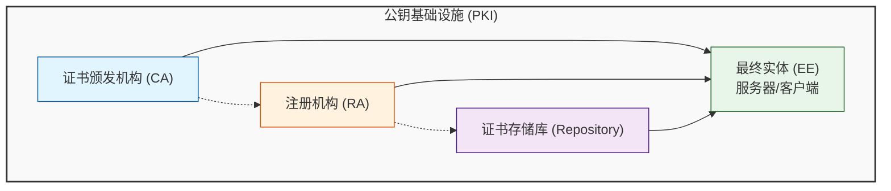
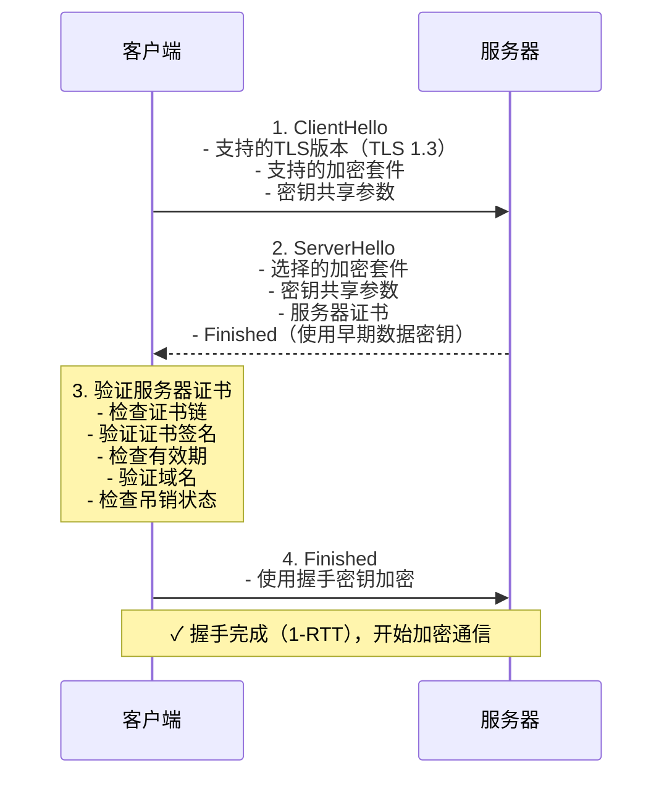

# SSL/TLS 服务器证书体系技术文档

## 目录

1. [证书基本概念](#1-证书基本概念)
2. [证书类型划分](#2-证书类型划分)
3. [工作原理](#3-工作原理)
4. [申请流程](#4-申请流程)
5. [安装配置方法](#5-安装配置方法)
6. [更新与吊销机制](#6-更新与吊销机制)
7. [安全最佳实践](#7-安全最佳实践)
8. [常见问题与故障排除](#8-常见问题与故障排除)
9. [附录：配置示例](#9-附录配置示例)

---

## 1. 证书基本概念

### 1.1 什么是SSL/TLS证书

SSL/TLS证书是数字证书的一种，用于在服务器和客户端之间建立加密通信通道。它遵循X.509标准，由受信任的证书颁发机构（CA）签发，包含以下核心信息：

- **公钥**：用于加密数据或验证签名
- **身份信息**：域名、组织名称、地理位置等
- **颁发机构**：签发证书的CA信息
- **有效期**：证书的起止时间
- **签名**：CA对证书内容的数字签名

### 1.2 核心组件

#### 1.2.1 公钥基础设施（PKI）

PKI是支持公钥密码学的完整体系，包括：



#### 1.2.2 证书颁发机构（CA）

CA是受信任的第三方机构，负责：
- 验证申请者身份
- 签发数字证书
- 维护证书吊销列表（CRL）
- 发布证书策略（CP）和认证实践声明（CPS）

#### 1.2.3 证书链

证书链是信任传递的路径，从终端证书到根证书：

```
终端证书（服务器证书）
    ↑
    │ 签发
中间证书（中间CA）
    ↑
    │ 签发
根证书（根CA，自签名）
```

### 1.3 密码学基础

#### 1.3.1 非对称加密

使用一对密钥：公钥和私钥

- **公钥**：公开，用于加密或验证签名
- **私钥**：保密，用于解密或创建签名

常用算法：
- RSA：2048位、3072位、4096位
- ECC（椭圆曲线）：P-256、P-384、P-521

#### 1.3.2 对称加密

使用相同密钥进行加密和解密

常用算法：
- AES-128-GCM
- AES-256-GCM
- ChaCha20-Poly1305

#### 1.3.3 哈希函数

用于数据完整性验证

常用算法：
- SHA-256
- SHA-384
- SHA-512

---

## 2. 证书类型划分

### 2.1 按验证级别分类

#### 2.1.1 域名验证（DV）证书

**特点**：
- 验证域名的所有权
- 验证过程简单快速
- 通常几分钟到几小时内签发
- 成本最低或免费

**适用场景**：
- 个人网站
- 测试环境
- 内部系统

**验证方式**：
- DNS TXT记录验证
- HTTP文件验证
- 邮箱验证

**示例**：Let's Encrypt免费证书

#### 2.1.2 组织验证（OV）证书

**特点**：
- 验证域名所有权
- 验证组织真实性
- 需要提供营业执照等证明文件
- 签发时间：1-3天
- 成本中等

**适用场景**：
- 企业官网
- 电子商务网站
- 需要建立用户信任的网站

**验证方式**：
- 查询商业注册数据库
- 电话验证
- 组织文件审核

#### 2.1.3 扩展验证（EV）证书

**特点**：
- 最严格的验证标准
- 验证域名所有权
- 验证组织法律存在性和运营状态
- 验证组织申请证书的权限
- 签发时间：3-7天
- 成本最高

**适用场景**：
- 金融机构
- 大型电商平台
- 政府机构网站
- 需要最高信任度的网站

**浏览器显示**：
- 地址栏显示组织名称
- 绿色锁图标（部分浏览器）

### 2.2 按域名数量分类

#### 2.2.1 单域名证书

**特点**：
- 保护一个完全限定域名（FQDN）
- 例如：www.example.com

**配置示例**：
```
Common Name (CN): www.example.com
Subject Alternative Names (SAN): www.example.com
```

#### 2.2.2 通配符证书

**特点**：
- 保护主域名及其所有子域名
- 使用通配符*表示
- 例如：*.example.com

**保护范围**：
- www.example.com ✓
- mail.example.com ✓
- api.example.com ✓
- example.com ✗（需要单独添加）

**配置示例**：
```
Common Name (CN): *.example.com
Subject Alternative Names (SAN):
    - *.example.com
    - example.com
```

**注意事项**：
- 通配符只能用于一级子域名
- 不能用于多级通配符（如*.*.example.com）

#### 2.2.3 多域名证书（SAN证书）

**特点**：
- 保护多个不同的域名
- 可以包含主域名和子域名
- 可以包含完全不同的域名

**配置示例**：
```
Common Name (CN): www.example.com
Subject Alternative Names (SAN):
    - www.example.com
    - example.com
    - mail.example.com
    - api.example.com
    - www.another-domain.com
```

### 2.3 按有效期分类

| 类型 | 有效期 | 说明 |
|------|--------|------|
| 短期证书 | 90天 | Let's Encrypt等免费证书，自动化更新 |
| 标准证书 | 1年 | 商业证书的标准有效期 |
| 长期证书 | 2-3年 | 旧版证书，现在较少使用 |

**趋势**：
- CA/Browser Forum规定证书最长有效期不超过398天（约13个月）
- 推荐使用90天证书并自动化更新

### 2.4 按用途分类

#### 2.4.1 服务器证书

用于服务器身份验证，保护服务器与客户端之间的通信。

#### 2.4.2 客户端证书

用于客户端身份验证，常见于：
- 双向TLS（mTLS）
- 企业内部系统
- API访问控制

#### 2.4.3 代码签名证书

用于签名软件代码，证明软件来源和完整性。

#### 2.4.4 电子邮件证书（S/MIME）

用于签名和加密电子邮件。

### 2.5 证书对比表

| 特性 | DV | OV | EV |
|------|----|----|-----|
| 验证级别 | 低 | 中 | 高 |
| 签发时间 | 分钟-小时 | 1-3天 | 3-7天 |
| 成本 | 免费/低 | 中 | 高 |
| 信任度 | 基础 | 较高 | 最高 |
| 浏览器显示 | 锁图标 | 锁图标 | 组织名称+锁 |
| 适用场景 | 个人/测试 | 企业 | 金融/政府 |

---

## 3. 工作原理

### 3.1 SSL/TLS握手过程

TLS 1.2和TLS 1.3的握手过程略有不同，以下是详细说明。

#### 3.1.1 TLS 1.2 握手过程

```
客户端                                    服务器
  │                                        │
  │  1. ClientHello                        │
  │  - 支持的TLS版本                        │
  │  - 支持的加密套件                       │
  │  - 随机数（Client Random）             │
  │  ─────────────────────────────────────>│
  │                                        │
  │  2. ServerHello                        │
  │  - 选择的TLS版本                        │
  │  - 选择的加密套件                       │
  │  - 随机数（Server Random）             │
  │  - 服务器证书                          │
  │  <─────────────────────────────────────│
  │                                        │
  │  3. Certificate Request（可选）        │
  │  <─────────────────────────────────────│
  │                                        │
  │  4. ServerHelloDone                    │
  │  <─────────────────────────────────────│
  │                                        │
  │  5. 验证服务器证书                      │
  │  - 检查证书链                          │
  │  - 验证证书签名                        │
  │  - 检查有效期                          │
  │  - 验证域名                            │
  │  - 检查吊销状态                        │
  │                                        │
  │  6. 客户端证书（可选）                 │
  │  ─────────────────────────────────────>│
  │                                        │
  │  7. ClientKeyExchange                  │
  │  - 预主密钥（Pre-Master Secret）       │
  │  - 使用服务器公钥加密                  │
  │  ─────────────────────────────────────>│
  │                                        │
  │  8. CertificateVerify（可选）          │
  │  ─────────────────────────────────────>│
  │                                        │
  │  9. ChangeCipherSpec                  │
  │  ─────────────────────────────────────>│
  │                                        │
  │  10. Finished                         │
  │  - 使用会话密钥加密                    │
  │  ─────────────────────────────────────>│
  │                                        │
  │  11. ChangeCipherSpec                  │
  │  <─────────────────────────────────────│
  │                                        │
  │  12. Finished                         │
  │  - 使用会话密钥加密                    │
  │  <─────────────────────────────────────│
  │                                        │
  │  ✓ 握手完成，开始加密通信               │
```

#### 3.1.2 TLS 1.3 握手过程

TLS 1.3简化了握手过程，减少了往返次数（RTT）。



**TLS 1.3的优势**：
- 减少握手延迟（从2-RTT减少到1-RTT）
- 移除不安全的加密套件
- 强制使用前向安全性
- 简化证书验证流程

### 3.2 密钥交换机制

#### 3.2.1 RSA密钥交换（TLS 1.2及以下）

**过程**：
1. 客户端生成预主密钥
2. 使用服务器证书中的公钥加密预主密钥
3. 发送加密的预主密钥给服务器
4. 服务器使用私钥解密获得预主密钥

**缺点**：
- 不具备前向安全性
- 如果私钥泄露，历史通信可被解密

#### 3.2.2 Diffie-Hellman密钥交换

**过程**：
1. 客户端和服务器交换DH参数
2. 双方各自计算共享密钥
3. 即使攻击者截获交换的参数，也无法计算出共享密钥

**变体**：
- **静态DH**：使用证书中的DH参数
- **临时DH（DHE）**：每次握手生成新的DH参数，具备前向安全性
- **椭圆曲线DH（ECDHE）**：使用椭圆曲线算法，性能更好

**推荐**：优先使用ECDHE

### 3.3 会话恢复

#### 3.3.1 会话ID（Session ID）

**过程**：
1. 首次握手时，服务器分配会话ID
2. 客户端在后续连接中发送会话ID
3. 服务器查找缓存的会话状态
4. 恢复会话，跳过完整握手

**优点**：
- 简单易实现
- 广泛支持

**缺点**：
- 服务器需要维护会话缓存

#### 3.3.2 会话票据（Session Ticket）

**过程**：
1. 服务器加密会话状态生成票据
2. 客户端存储票据
3. 客户端在后续连接中发送票据
4. 服务器解密票据恢复会话

**优点**：
- 服务器无需维护会话缓存
- 适合负载均衡环境

**缺点**：
- 票据密钥需要定期轮换

### 3.4 证书验证流程

```
客户端收到服务器证书
         │
         ▼
┌─────────────────┐
│ 1. 检查有效期    │
│    - Not Before │
│    - Not After  │
└────────┬────────┘
         │ 有效
         ▼
┌─────────────────┐
│ 2. 验证域名      │
│    - CN匹配      │
│    - SAN匹配     │
└────────┬────────┘
         │ 匹配
         ▼
┌─────────────────┐
│ 3. 构建证书链    │
│    - 获取中间证书│
│    - 定位根证书  │
└────────┬────────┘
         │ 成功
         ▼
┌─────────────────┐
│ 4. 验证签名      │
│    - 逐级验证    │
│    - 检查签名算法│
└────────┬────────┘
         │ 有效
         ▼
┌─────────────────┐
│ 5. 检查吊销状态  │
│    - CRL检查     │
│    - OCSP检查    │
└────────┬────────┘
         │ 未吊销
         ▼
┌─────────────────┐
│ 6. 检查策略      │
│    - 证书策略    │
│    - 用途限制    │
└────────┬────────┘
         │ 符合
         ▼
    ✓ 证书验证通过
```

---

## 4. 申请流程

### 4.1 证书申请准备

#### 4.1.1 生成私钥和CSR

**生成RSA私钥（2048位）**：
```bash
openssl genrsa -out server.key 2048
```

**生成ECC私钥（P-256曲线）**：
```bash
openssl ecparam -genkey -name prime256v1 -out server.key
```

**生成证书签名请求（CSR）**：
```bash
openssl req -new -key server.key -out server.csr
```

**交互式填写信息**：
```
Country Name (2 letter code) [XX]:CN
State or Province Name (full name) []:Beijing
Locality Name (eg, city) [Default City]:Beijing
Organization Name (eg, company) [Default Company Ltd]:Example Inc.
Organizational Unit Name (eg, section) []:IT Department
Common Name (eg, fully qualified host name) []:www.example.com
Email Address []:admin@example.com

Please enter the following 'extra' attributes
to be sent with your certificate request
A challenge password []:
An optional company name []:
```

#### 4.1.2 配置文件方式生成CSR

创建配置文件 `csr.conf`：
```ini
[req]
default_bits = 2048
prompt = no
default_md = sha256
distinguished_name = dn
req_extensions = req_ext

[dn]
C = CN
ST = Beijing
L = Beijing
O = Example Inc.
OU = IT Department
CN = www.example.com
emailAddress = admin@example.com

[req_ext]
subjectAltName = @alt_names

[alt_names]
DNS.1 = www.example.com
DNS.2 = example.com
DNS.3 = mail.example.com
```

生成CSR：
```bash
openssl req -new -key server.key -out server.csr -config csr.conf
```

#### 4.1.3 验证CSR

查看CSR内容：
```bash
openssl req -in server.csr -text -noout
```

验证CSR的签名：
```bash
openssl req -in server.csr -verify -noout
```

### 4.2 商业证书申请流程

#### 4.2.1 选择证书颁发机构（CA）

**主流CA**：
- DigiCert
- GlobalSign
- Sectigo (formerly Comodo)
- GeoTrust
- Let's Encrypt（免费）

**选择因素**：
- 信任度（浏览器/操作系统信任）
- 价格
- 验证速度
- 技术支持
- 附加功能（如恶意软件扫描）

#### 4.2.2 提交申请

**步骤**：
1. 选择证书类型（DV/OV/EV）
2. 填写组织信息
3. 提交CSR
4. 选择验证方式
5. 完成付款

#### 4.2.3 域名验证（DV）

**DNS TXT记录验证**：
```bash
# 添加TXT记录
_acme-challenge.example.com.  TXT  "验证字符串"
```

**HTTP文件验证**：
```bash
# 创建验证文件
mkdir -p /var/www/html/.well-known/acme-challenge/
echo "验证字符串" > /var/www/html/.well-known/acme-challenge/验证令牌
```

**邮箱验证**：
- 向域名的管理员邮箱（admin@、postmaster@、webmaster@等）发送验证邮件

#### 4.2.4 组织验证（OV/EV）

**需要提供的文件**：
- 营业执照
- 组织机构代码证
- 税务登记证
- 法人身份证明

**验证方式**：
- 电话验证（拨打官方电话）
- 第三方数据库查询
- 现场核实（EV证书）

### 4.3 Let's Encrypt免费证书申请

#### 4.3.1 使用Certbot

**安装Certbot**：
```bash
# Ubuntu/Debian
sudo apt-get update
sudo apt-get install certbot

# CentOS/RHEL
sudo yum install epel-release
sudo yum install certbot
```

**申请单域名证书**：
```bash
certbot certonly --standalone -d www.example.com
```

**申请通配符证书**（需要DNS验证）：
```bash
certbot certonly --manual --preferred-challenges dns -d "*.example.com" -d example.com
```

**使用Nginx插件**：
```bash
certbot --nginx -d www.example.com
```

**使用Apache插件**：
```bash
certbot --apache -d www.example.com
```

#### 4.3.2 自动续期

**测试续期**：
```bash
certbot renew --dry-run
```

**设置自动续期**（cron）：
```bash
# 编辑crontab
sudo crontab -e

# 添加以下行（每天凌晨2点检查续期）
0 2 * * * certbot renew --quiet --post-hook "systemctl reload nginx"
```

**设置自动续期**（systemd timer）：
```bash
# 创建systemd服务
sudo tee /etc/systemd/system/certbot-renew.service > /dev/null <<EOF
[Unit]
Description=Certbot Renewal

[Service]
Type=oneshot
ExecStart=/usr/bin/certbot renew --quiet --post-hook "systemctl reload nginx"
EOF

# 创建systemd timer
sudo tee /etc/systemd/system/certbot-renew.timer > /dev/null <<EOF
[Unit]
Description=Certbot Renewal Timer

[Timer]
OnCalendar=daily
Persistent=true

[Install]
WantedBy=timers.target
EOF

# 启用并启动timer
sudo systemctl enable certbot-renew.timer
sudo systemctl start certbot-renew.timer
```

### 4.4 自签名证书（测试环境）

#### 4.4.1 生成自签名证书

**生成自签名证书（有效期为365天）**：
```bash
openssl req -x509 -newkey rsa:2048 -keyout server.key -out server.crt -days 365 -nodes
```

**使用配置文件生成**：
```bash
openssl req -x509 -newkey rsa:2048 -keyout server.key -out server.crt -days 365 -nodes -config csr.conf -extensions req_ext
```

#### 4.4.2 添加到信任存储

**Linux系统**：
```bash
# Ubuntu/Debian
sudo cp server.crt /usr/local/share/ca-certificates/
sudo update-ca-certificates

# CentOS/RHEL
sudo cp server.crt /etc/pki/ca-trust/source/anchors/
sudo update-ca-trust
```

**Windows系统**：
```powershell
# 导入证书到受信任的根证书颁发机构
certutil -addstore -f "ROOT" server.crt
```

**macOS系统**：
```bash
# 添加到钥匙串
sudo security add-trusted-cert -d -r trustRoot -k /Library/Keychains/System.keychain server.crt
```

### 4.5 证书申请流程图

```
┌─────────────────────────────────────────────────────────┐
│                    证书申请流程                           │
└─────────────────────────────────────────────────────────┘
                            │
                            ▼
                ┌───────────────────────┐
                │  1. 准备阶段           │
                │  - 生成私钥            │
                │  - 创建CSR             │
                │  - 准备验证材料        │
                └───────────┬───────────┘
                            │
                            ▼
                ┌───────────────────────┐
                │  2. 选择CA            │
                │  - 商业CA或Let's Encrypt│
                │  - 选择证书类型        │
                └───────────┬───────────┘
                            │
                            ▼
                ┌───────────────────────┐
                │  3. 提交申请          │
                │  - 提交CSR             │
                │  - 填写组织信息        │
                │  - 选择验证方式        │
                └───────────┬───────────┘
                            │
                            ▼
                ┌───────────────────────┐
                │  4. 身份验证          │
                │  - DV: 域名验证        │
                │  - OV: 组织验证        │
                │  - EV: 扩展验证        │
                └───────────┬───────────┘
                            │
                            ▼
                ┌───────────────────────┐
                │  5. 证书签发          │
                │  - CA签发证书          │
                │  - 提供证书链          │
                └───────────┬───────────┘
                            │
                            ▼
                ┌───────────────────────┐
                │  6. 安装配置          │
                │  - 安装证书            │
                │  - 配置服务器          │
                │  - 测试验证            │
                └───────────┬───────────┘
                            │
                            ▼
                ┌───────────────────────┐
                │  7. 维护管理          │
                │  - 监控有效期          │
                │  - 定期更新            │
                │  - 安全审计            │
                └───────────────────────┘
```

---

## 5. 安装配置方法

### 5.1 证书文件说明

#### 5.1.1 常见文件扩展名

| 扩展名 | 说明 | 格式 |
|--------|------|------|
| .crt | 证书文件 | PEM或DER |
| .cer | 证书文件 | PEM或DER |
| .pem | PEM格式文件 | 文本，Base64编码 |
| .key | 私钥文件 | PEM或DER |
| .p12 / .pfx | PKCS#12格式 | 二进制，包含证书和私钥 |
| .jks | Java密钥库 | 二进制，Java专用 |
| .der | DER格式 | 二进制 |

#### 5.1.2 PEM格式

**PEM（Privacy-Enhanced Mail）**是最常见的格式：

```pem
-----BEGIN CERTIFICATE-----
MIIDXTCCAkWgAwIBAgIJAJC1HiIAZAiIMA0GCSqGSIb3DQEBCwUAMEUxCzAJBgNV
...（Base64编码的证书数据）...
-----END CERTIFICATE-----
```

**特点**：
- 文本格式，可读
- Base64编码
- 可以包含多个证书（证书链）

#### 5.1.3 DER格式

**DER（Distinguished Encoding Rules）**是二进制格式：

**特点**：
- 二进制格式，不可读
- 比PEM更紧凑
- 常用于Java环境

**转换命令**：
```bash
# PEM转DER
openssl x509 -in cert.pem -outform der -out cert.der

# DER转PEM
openssl x509 -in cert.der -inform der -out cert.pem
```

#### 5.1.4 PKCS#12格式

**PKCS#12（.p12/.pfx）**包含证书和私钥：

**特点**：
- 二进制格式
- 可以包含证书链和私钥
- 使用密码保护

**创建PKCS#12文件**：
```bash
openssl pkcs12 -export -out cert.p12 -inkey server.key -in server.crt -certfile ca.crt
```

**提取证书和私钥**：
```bash
# 提取证书
openssl pkcs12 -in cert.p12 -clcerts -nokeys -out server.crt

# 提取私钥
openssl pkcs12 -in cert.p12 -nocerts -out server.key
```

### 5.2 Nginx配置

#### 5.2.1 基本配置

```nginx
server {
    listen 443 ssl http2;
    server_name www.example.com;

    # 证书配置
    ssl_certificate /etc/ssl/certs/server.crt;
    ssl_certificate_key /etc/ssl/private/server.key;

    # 可选：中间证书链
    # ssl_trusted_certificate /etc/ssl/certs/ca-bundle.crt;

    # SSL协议和加密套件
    ssl_protocols TLSv1.2 TLSv1.3;
    ssl_ciphers 'ECDHE-ECDSA-AES128-GCM-SHA256:ECDHE-RSA-AES128-GCM-SHA256:ECDHE-ECDSA-AES256-GCM-SHA384:ECDHE-RSA-AES256-GCM-SHA384';
    ssl_prefer_server_ciphers off;

    # SSL会话缓存
    ssl_session_cache shared:SSL:10m;
    ssl_session_timeout 10m;

    # OCSP Stapling
    ssl_stapling on;
    ssl_stapling_verify on;
    ssl_trusted_certificate /etc/ssl/certs/ca-bundle.crt;
    resolver 8.8.8.8 8.8.4.4 valid=300s;
    resolver_timeout 5s;

    # HSTS（可选）
    add_header Strict-Transport-Security "max-age=31536000; includeSubDomains" always;

    # 其他配置
    root /var/www/html;
    index index.html;
}
```

#### 5.2.2 通配符证书配置

```nginx
server {
    listen 443 ssl http2;
    server_name *.example.com;

    ssl_certificate /etc/ssl/certs/wildcard.crt;
    ssl_certificate_key /etc/ssl/private/wildcard.key;

    # 其他配置...
}
```

#### 5.2.3 多域名证书配置

```nginx
server {
    listen 443 ssl http2;
    server_name www.example.com example.com mail.example.com;

    ssl_certificate /etc/ssl/certs/san.crt;
    ssl_certificate_key /etc/ssl/private/san.key;

    # 其他配置...
}
```

#### 5.2.4 重定向HTTP到HTTPS

```nginx
server {
    listen 80;
    server_name www.example.com;

    # 重定向所有HTTP请求到HTTPS
    return 301 https://$server_name$request_uri;
}

server {
    listen 443 ssl http2;
    server_name www.example.com;

    # SSL配置...
}
```

#### 5.2.5 测试配置

**检查配置语法**：
```bash
sudo nginx -t
```

**重新加载配置**：
```bash
sudo nginx -s reload
```

### 5.3 Apache配置

#### 5.3.1 基本配置

```apache
<VirtualHost *:443>
    ServerName www.example.com

    # 启用SSL
    SSLEngine on

    # 证书配置
    SSLCertificateFile /etc/ssl/certs/server.crt
    SSLCertificateKeyFile /etc/ssl/private/server.key
    SSLCertificateChainFile /etc/ssl/certs/ca-bundle.crt

    # SSL协议和加密套件
    SSLProtocol all -SSLv2 -SSLv3 -TLSv1 -TLSv1.1
    SSLCipherSuite HIGH:!aNULL:!MD5:!3DES
    SSLHonorCipherOrder on

    # SSL会话缓存
    SSLSessionCache shmcb:/var/run/apache2/ssl_scache(512000)
    SSLSessionCacheTimeout 300

    # OCSP Stapling
    SSLUseStapling on
    SSLStaplingCache shmcb:/var/run/apache2/ocsp(128000)

    # HSTS（可选）
    Header always set Strict-Transport-Security "max-age=31536000; includeSubDomains"

    # 其他配置
    DocumentRoot /var/www/html
    ErrorLog ${APACHE_LOG_DIR}/error.log
    CustomLog ${APACHE_LOG_DIR}/access.log combined
</VirtualHost>
```

#### 5.3.2 启用SSL模块

```bash
# 启用SSL模块
sudo a2enmod ssl
sudo a2enmod headers

# 启用站点
sudo a2ensite default-ssl

# 重启Apache
sudo systemctl restart apache2
```

#### 5.3.3 测试配置

**检查配置语法**：
```bash
sudo apache2ctl configtest
```

**重新加载配置**：
```bash
sudo systemctl reload apache2
```

### 5.4 Python应用配置

#### 5.4.1 使用SSL上下文

```python
import ssl
import asyncio

async def handle_client(reader, writer):
    # 处理客户端连接
    data = await reader.read(1024)
    writer.write(data)
    await writer.drain()
    writer.close()
    await writer.wait_closed()

async def main():
    # 创建SSL上下文
    ssl_context = ssl.create_default_context(ssl.Purpose.CLIENT_AUTH)
    ssl_context.load_cert_chain(
        certfile='/etc/ssl/certs/server.crt',
        keyfile='/etc/ssl/private/server.key'
    )

    # 可选：设置协议和加密套件
    ssl_context.minimum_version = ssl.TLSVersion.TLSv1_2
    ssl_context.set_ciphers('ECDHE-ECDSA-AES128-GCM-SHA256:ECDHE-RSA-AES128-GCM-SHA256')

    # 启动SSL服务器
    server = await asyncio.start_server(
        handle_client,
        '0.0.0.0',
        443,
        ssl=ssl_context
    )

    async with server:
        await server.serve_forever()

if __name__ == '__main__':
    asyncio.run(main())
```

#### 5.4.2 使用aiohttp

```python
from aiohttp import web
import ssl

async def hello(request):
    return web.Response(text="Hello, secure world!")

async def create_app():
    app = web.Application()
    app.router.add_get('/', hello)
    return app

if __name__ == '__main__':
    # 创建SSL上下文
    ssl_context = ssl.create_default_context(ssl.Purpose.CLIENT_AUTH)
    ssl_context.load_cert_chain(
        certfile='/etc/ssl/certs/server.crt',
        keyfile='/etc/ssl/private/server.key'
    )

    app = create_app()
    web.run_app(app, host='0.0.0.0', port=443, ssl_context=ssl_context)
```

#### 5.4.3 使用Flask

```python
from flask import Flask
import ssl

app = Flask(__name__)

@app.route('/')
def hello():
    return 'Hello, secure world!'

if __name__ == '__main__':
    # SSL上下文
    ssl_context = ssl.SSLContext(ssl.PROTOCOL_TLS_SERVER)
    ssl_context.load_cert_chain(
        certfile='/etc/ssl/certs/server.crt',
        keyfile='/etc/ssl/private/server.key'
    )

    app.run(host='0.0.0.0', port=443, ssl_context=ssl_context)
```

### 5.5 SMTP服务器配置

#### 5.5.1 Postfix配置

```bash
# /etc/postfix/main.cf

# 启用TLS
smtpd_tls_security_level = may
smtpd_tls_cert_file = /etc/ssl/certs/server.crt
smtpd_tls_key_file = /etc/ssl/private/server.key
smtpd_tls_CAfile = /etc/ssl/certs/ca-bundle.crt

# 强制客户端使用TLS
smtpd_tls_security_level = encrypt

# TLS协议和加密套件
smtpd_tls_protocols = !SSLv2, !SSLv3, !TLSv1, !TLSv1.1
smtpd_tls_ciphers = high
smtpd_tls_mandatory_protocols = !SSLv2, !SSLv3, !TLSv1, !TLSv1.1
smtpd_tls_mandatory_ciphers = high

# TLS会话缓存
smtpd_tls_session_cache_database = btree:${data_directory}/smtpd_scache
```

#### 5.5.2 Exim配置

```bash
# /etc/exim4/exim4.conf.template

# 启用TLS
tls_on_connect_ports = 465
tls_advertise_hosts = *

# 证书配置
tls_certificate = /etc/ssl/certs/server.crt
tls_privatekey = /etc/ssl/private/server.key
tls_cafile = /etc/ssl/certs/ca-bundle.crt

# TLS协议和加密套件
tls_require_ciphers = HIGH:MEDIUM:!LOW:!3DES:!DES:!RC4:!MD5:!aNULL
tls_protocol = < 3.1

# 验证客户端证书（可选）
tls_verify_hosts = *
tls_verify_certificates = /etc/ssl/certs/ca-bundle.crt
```

### 5.6 证书验证测试

#### 5.6.1 使用OpenSSL测试

**测试SSL连接**：
```bash
openssl s_client -connect www.example.com:443 -servername www.example.com
```

**显示证书信息**：
```bash
openssl s_client -connect www.example.com:443 -showcerts
```

**测试特定协议版本**：
```bash
# TLS 1.2
openssl s_client -connect www.example.com:443 -tls1_2

# TLS 1.3
openssl s_client -connect www.example.com:443 -tls1_3
```

#### 5.6.2 使用curl测试

```bash
# 测试HTTPS连接
curl -v https://www.example.com

# 显示证书信息
curl -vI https://www.example.com 2>&1 | grep -i ssl

# 使用特定证书
curl --cert client.crt --key client.key https://api.example.com
```

#### 5.6.3 在线测试工具

- **SSL Labs SSL Test**: https://www.ssllabs.com/ssltest/
- **Qualys SSL Labs**: 提供详细的SSL配置评估
- **CryptoReport**: https://cryptoreport.websecurity.symantec.com/

---

## 6. 更新与吊销机制

### 6.1 证书更新

#### 6.1.1 证书过期检测

**检查证书有效期**：
```bash
# 检查单个证书
openssl x509 -in server.crt -noout -dates

# 检查证书剩余天数
openssl x509 -in server.crt -noout -checkend 86400  # 检查是否在24小时内过期

# 检查远程服务器证书
echo | openssl s_client -connect www.example.com:443 2>/dev/null | openssl x509 -noout -dates
```

**自动化检测脚本**：
```bash
#!/bin/bash

# 检查证书是否在30天内过期
check_cert_expiry() {
    local cert_file=$1
    local warning_days=30

    if openssl x509 -in "$cert_file" -noout -checkend $((warning_days * 86400)); then
        echo "证书 $cert_file 有效期超过 $warning_days 天"
        return 0
    else
        echo "警告: 证书 $cert_file 将在 $warning_days 天内过期!"
        return 1
    fi
}

# 检查多个证书
for cert in /etc/ssl/certs/*.crt; do
    check_cert_expiry "$cert"
done
```

#### 6.1.2 证书续期流程

**使用Certbot续期**：
```bash
# 手动续期
certbot renew

# 续期前测试
certbot renew --dry-run

# 续期后重新加载服务
certbot renew --post-hook "systemctl reload nginx"
```

**商业证书续期**：
1. 在过期前30天开始续期流程
2. 生成新的CSR（或复用私钥）
3. 向CA提交续期申请
4. 完成验证（通常比首次申请简单）
5. 下载新证书
6. 安装新证书
7. 重启服务

#### 6.1.3 自动化续期策略

**使用cron自动续期**：
```bash
# 编辑crontab
crontab -e

# 每天凌晨2点检查并续期
0 2 * * * /usr/bin/certbot renew --quiet --post-hook "systemctl reload nginx"
```

**使用systemd自动续期**：
```bash
# 创建服务文件
cat > /etc/systemd/system/certbot-renew.service <<EOF
[Unit]
Description=Certbot Renewal
After=network-online.target

[Service]
Type=oneshot
ExecStart=/usr/bin/certbot renew --quiet --post-hook "systemctl reload nginx"
EOF

# 创建timer文件
cat > /etc/systemd/system/certbot-renew.timer <<EOF
[Unit]
Description=Certbot Renewal Timer

[Timer]
OnCalendar=daily
Persistent=true
RandomizedDelaySec=1h

[Install]
WantedBy=timers.target
EOF

# 启用并启动
systemctl enable certbot-renew.timer
systemctl start certbot-renew.timer
```

#### 6.1.4 密钥轮换

**最佳实践**：
- 每次续期时生成新的私钥
- 不要长期使用同一私钥
- 使用强密钥（RSA 2048位以上或ECC P-256以上）

**生成新密钥和CSR**：
```bash
# 生成新私钥
openssl genrsa -out server-new.key 2048

# 生成新CSR
openssl req -new -key server-new.key -out server-new.csr -config csr.conf

# 提交CSR到CA获取新证书
# 安装新证书后重启服务
```

### 6.2 证书吊销

#### 6.2.1 吊销原因

证书可能因以下原因被吊销：
- **私钥泄露**：私钥被未授权方获取
- **证书错误**：证书信息错误或颁发错误
- **CA违规**：CA违反颁发政策
- **停止使用**：服务停止或域名不再使用
- **安全事件**：发生安全事件需要立即吊销

#### 6.2.2 证书吊销列表（CRL）

**CRL简介**：
- 由CA定期发布的吊销证书列表
- 包含所有被吊销证书的序列号
- 客户端下载CRL并检查证书是否在列表中

**下载CRL**：
```bash
# 从证书中获取CRL分发点
openssl x509 -in server.crt -noout -text | grep -A 1 "CRL Distribution Points"

# 下载CRL
wget http://crl.example.com/ca.crl

# 查看CRL内容
openssl crl -in ca.crl -text -noout
```

**CRL的优缺点**：
- **优点**：简单、广泛支持
- **缺点**：
  - 延迟高（CRL更新周期通常为几天）
  - 文件大小随吊销证书数量增长
  - 客户端需要下载完整CRL

#### 6.2.3 在线证书状态协议（OCSP）

**OCSP简介**：
- 实时查询证书吊销状态
- 客户端向OCSP服务器发送查询请求
- OCSP服务器返回证书状态

**查询OCSP状态**：
```bash
# 从证书中获取OCSP URL
openssl x509 -in server.crt -noout -ocsp_uri

# 查询证书状态
openssl ocsp -issuer ca.crt -cert server.crt -url http://ocsp.example.com
```

**OCSP响应**：
- **good**: 证书有效
- **revoked**: 证书已吊销
- **unknown**: 状态未知

**OCSP的优缺点**：
- **优点**：
  - 实时查询
  - 响应小
  - 减少带宽消耗
- **缺点**：
  - 需要OCSP服务器在线
  - 可能泄露用户访问信息
  - 需要签名验证

#### 6.2.4 OCSP Stapling

**OCSP Stapling简介**：
- 服务器定期查询OCSP状态并缓存
- 服务器在TLS握手时将OCSP响应发送给客户端
- 客户端无需直接查询OCSP服务器

**配置OCSP Stapling**：

**Nginx**：
```nginx
ssl_stapling on;
ssl_stapling_verify on;
ssl_trusted_certificate /etc/ssl/certs/ca-bundle.crt;
resolver 8.8.8.8 8.8.4.4 valid=300s;
resolver_timeout 5s;
```

**Apache**：
```apache
SSLUseStapling on
SSLStaplingCache shmcb:/var/run/apache2/ocsp(128000)
```

**测试OCSP Stapling**：
```bash
# 使用openssl测试
openssl s_client -connect www.example.com:443 -status

# 使用在线工具
# https://www.ssllabs.com/ssltest/
```

#### 6.2.5 吊销流程

**向CA申请吊销证书**：

1. **准备材料**：
   - 证书文件
   - 私钥（用于验证申请）
   - 吊销原因
   - 联系信息

2. **提交吊销请求**：
   - 登录CA管理后台
   - 提交吊销申请
   - 提供必要信息

3. **CA处理**：
   - 验证申请身份
   - 更新CRL和OCSP数据库
   - 发布吊销信息

4. **验证吊销**：
   - 下载CRL确认
   - 查询OCSP确认

**使用OpenSSL生成吊销请求**：
```bash
# 创建吊销请求配置
cat > revoke.cnf <<EOF
[ca]
default_ca = CA_default

[CA_default]
dir = ./demoCA
certificate = $dir/ca.crt
private_key = $dir/private/ca.key
new_certs_dir = $dir/newcerts
database = $dir/index.txt
serial = $dir/serial
default_md = sha256

[policy]
countryName = optional
stateOrProvinceName = optional
organizationName = optional
organizationalUnitName = optional
commonName = supplied
emailAddress = optional
EOF

# 吊销证书
openssl ca -revoke server.crt -config revoke.cnf

# 生成CRL
openssl ca -gencrl -out ca.crl -config revoke.cnf
```

### 6.3 证书生命周期管理

#### 6.3.1 生命周期阶段

```
┌─────────────────────────────────────────────────────────┐
│                  证书生命周期                             │
└─────────────────────────────────────────────────────────┘
                            │
                            ▼
                ┌───────────────────────┐
                │  1. 密钥生成          │
                │  - 生成密钥对         │
                │  - 创建CSR            │
                └───────────┬───────────┘
                            │
                            ▼
                ┌───────────────────────┐
                │  2. 证书申请          │
                │  - 提交CSR            │
                │  - 身份验证           │
                └───────────┬───────────┘
                            │
                            ▼
                ┌───────────────────────┐
                │  3. 证书签发          │
                │  - CA签发             │
                │  - 证书发布           │
                └───────────┬───────────┘
                            │
                            ▼
                ┌───────────────────────┐
                │  4. 证书部署          │
                │  - 安装证书           │
                │  - 配置服务           │
                └───────────┬───────────┘
                            │
                            ▼
                ┌───────────────────────┐
                │  5. 证书使用          │
                │  - 正常运行           │
                │  - 定期监控           │
                └───────────┬───────────┘
                            │
                            ▼
                ┌───────────────────────┐
                │  6. 证书续期          │
                │  - 检测过期           │
                │  - 自动续期           │
                └───────────┬───────────┘
                            │
                            ▼
                ┌───────────────────────┐
                │  7. 证书吊销（可选）  │
                │  - 私钥泄露           │
                │  - 证书错误           │
                └───────────┬───────────┘
                            │
                            ▼
                ┌───────────────────────┐
                │  8. 证书过期          │
                │  - 自然过期           │
                │  - 清理归档           │
                └───────────────────────┘
```

#### 6.3.2 证书管理最佳实践

**监控和告警**：
- 设置过期前30天、7天、1天的告警
- 定期检查证书状态
- 监控证书链完整性

**自动化**：
- 使用自动化工具（如Certbot）
- 配置自动续期
- 自动化部署流程

**文档记录**：
- 记录所有证书信息
- 记录续期和吊销历史
- 维护证书清单

**备份**：
- 备份所有证书和私钥
- 安全存储备份
- 定期测试恢复流程

---

## 7. 安全最佳实践

### 7.1 私钥保护

#### 7.1.1 私钥存储安全

**基本原则**：
- 私钥永远不应泄露
- 私钥文件权限应严格限制
- 私钥不应存储在代码仓库中
- 私钥应使用强密码保护

**设置正确的文件权限**：
```bash
# 设置私钥文件权限
chmod 600 /etc/ssl/private/server.key

# 设置私钥目录权限
chmod 700 /etc/ssl/private/

# 设置证书文件权限
chmod 644 /etc/ssl/certs/server.crt

# 验证权限
ls -la /etc/ssl/private/
ls -la /etc/ssl/certs/
```

**使用密码保护的私钥**：
```bash
# 生成带密码保护的私钥
openssl genrsa -aes256 -out server-protected.key 2048

# 从私钥移除密码（不推荐）
openssl rsa -in server-protected.key -out server.key

# 添加密码到私钥
openssl rsa -aes256 -in server.key -out server-protected.key
```

#### 7.1.2 硬件安全模块（HSM）

**HSM简介**：
- 专用硬件设备，用于安全存储密钥
- 密钥永不离开HSM
- 提供加密操作服务
- 符合FIPS 140-2标准

**HSM的优势**：
- 最高级别的密钥保护
- 防止密钥泄露
- 提供审计日志
- 符合合规要求

**常见HSM厂商**：
- Thales (nCipher)
- AWS CloudHSM
- Azure Dedicated HSM
- Google Cloud HSM

#### 7.1.3 密钥轮换策略

**推荐做法**：
- 定期轮换私钥（建议每年）
- 续期证书时生成新私钥
- 使用强密钥算法和长度
- 记录密钥轮换历史

**密钥轮换流程**：
1. 生成新的密钥对
2. 创建新的CSR
3. 向CA申请新证书
4. 安装新证书
5. 测试新证书
6. 重启服务
7. 安全销毁旧密钥

### 7.2 加密套件选择

#### 7.2.1 推荐的加密套件

**TLS 1.2推荐套件**：
```
ECDHE-ECDSA-AES128-GCM-SHA256
ECDHE-RSA-AES128-GCM-SHA256
ECDHE-ECDSA-AES256-GCM-SHA384
ECDHE-RSA-AES256-GCM-SHA384
ECDHE-ECDSA-CHACHA20-POLY1305
ECDHE-RSA-CHACHA20-POLY1305
```

**TLS 1.3推荐套件**：
```
TLS_AES_128_GCM_SHA256
TLS_AES_256_GCM_SHA384
TLS_CHACHA20_POLY1305_SHA256
```

#### 7.2.2 禁用的加密套件

**不安全的套件**：
- 使用RC4的套件
- 使用DES/3DES的套件
- 使用MD5的套件
- 使用SHA1的套件
- 匿名DH套件
- 导出级别套件

**配置示例**：
```nginx
# Nginx
ssl_ciphers 'ECDHE-ECDSA-AES128-GCM-SHA256:ECDHE-RSA-AES128-GCM-SHA256:ECDHE-ECDSA-AES256-GCM-SHA384:ECDHE-RSA-AES256-GCM-SHA384:ECDHE-ECDSA-CHACHA20-POLY1305:ECDHE-RSA-CHACHA20-POLY1305:!aNULL:!eNULL:!LOW:!3DES:!MD5:!EXP:!PSK:!SRP:!DSS';
```

#### 7.2.3 前向安全性

**前向安全性（Perfect Forward Secrecy, PFS）**：
- 即使私钥泄露，历史通信仍无法解密
- 使用临时密钥交换（DHE或ECDHE）
- 现代TLS的强制要求

**启用PFS**：
```nginx
# Nginx
ssl_protocols TLSv1.2 TLSv1.3;
ssl_ciphers 'ECDHE-ECDSA-AES128-GCM-SHA256:ECDHE-RSA-AES128-GCM-SHA256:ECDHE-ECDSA-AES256-GCM-SHA384:ECDHE-RSA-AES256-GCM-SHA384';
ssl_prefer_server_ciphers off;
```

### 7.3 协议版本选择

#### 7.3.1 推荐的协议版本

**TLS 1.3**（推荐）：
- 最安全的TLS版本
- 移除了不安全的特性
- 性能更好（1-RTT握手）
- 强制前向安全性

**TLS 1.2**（兼容性）：
- 广泛支持
- 配置正确时安全
- 需要禁用不安全的加密套件

#### 7.3.2 禁用的协议版本

**不安全的协议**：
- **SSLv2**: 已废弃，严重安全漏洞
- **SSLv3**: POODLE漏洞，已废弃
- **TLS 1.0**: BEAST漏洞，不推荐
- **TLS 1.1**: RC4漏洞，不推荐

**配置示例**：
```nginx
# Nginx
ssl_protocols TLSv1.2 TLSv1.3;
```

```apache
# Apache
SSLProtocol all -SSLv2 -SSLv3 -TLSv1 -TLSv1.1
```

### 7.4 HSTS配置

#### 7.4.1 HSTS简介

**HTTP Strict Transport Security (HSTS)**：
- 强制浏览器使用HTTPS
- 防止SSL剥离攻击
- 通过HTTP头实现

#### 7.4.2 HSTS配置

**基本配置**：
```nginx
# Nginx
add_header Strict-Transport-Security "max-age=31536000; includeSubDomains" always;
```

```apache
# Apache
Header always set Strict-Transport-Security "max-age=31536000; includeSubDomains"
```

**参数说明**：
- `max-age`: HSTS策略的有效期（秒）
- `includeSubDomains`: 策略应用于所有子域名
- `preload`: 提交到HSTS预加载列表

**HSTS预加载**：
```nginx
add_header Strict-Transport-Security "max-age=31536000; includeSubDomains; preload" always;
```

**提交到预加载列表**：
- 访问 https://hstspreload.org/
- 提交域名
- 等待审核

### 7.5 证书固定

#### 7.5.1 证书固定简介

**Certificate Pinning**：
- 客户端硬编码服务器的证书或公钥
- 防止中间人攻击
- 常用于移动应用

#### 7.5.2 实现方式

**HTTP Public Key Pinning (HPKP)**（已废弃）：
```nginx
add_header Public-Key-Pins 'pin-sha256="base64+primary=="; pin-sha256="base64+backup=="; max-age=5184000; includeSubDomains';
```

**应用层证书固定**：
- 在应用代码中实现
- 比HPKP更灵活
- 更容易更新

**示例（Python）**：
```python
import ssl
import socket

# 固定的证书指纹
EXPECTED_FINGERPRINT = "AA:BB:CC:DD:EE:FF:00:11:22:33:44:55:66:77:88:99:AA:BB:CC:DD"

def verify_certificate(cert, expected_fingerprint):
    # 计算证书指纹
    fingerprint = ssl.DER_cert_to_DER_cert(cert)
    import hashlib
    sha256 = hashlib.sha256(fingerprint).hexdigest()
    formatted_fingerprint = ':'.join([sha256[i:i+2].upper() for i in range(0, len(sha256), 2)])

    # 比较指纹
    if formatted_fingerprint != expected_fingerprint:
        raise ssl.SSLError("Certificate fingerprint mismatch")

    return True

# 创建SSL上下文
context = ssl.create_default_context()
context.verify_callback = verify_certificate

# 连接服务器
sock = context.wrap_socket(socket.socket(socket.AF_INET), server_hostname="www.example.com")
sock.connect(("www.example.com", 443))
```

### 7.6 安全审计和监控

#### 7.6.1 定期安全审计

**审计内容**：
- 证书有效期检查
- 证书链完整性检查
- 加密套件配置检查
- 协议版本检查
- HSTS配置检查
- OCSP Stapling检查

**审计工具**：
- **SSL Labs SSL Test**: https://www.ssllabs.com/ssltest/
- **testssl.sh**: https://testssl.sh/
- **Mozilla SSL Configuration Generator**: https://ssl-config.mozilla.org/

#### 7.6.2 监控和告警

**监控指标**：
- 证书过期时间
- TLS握手失败率
- 加密套件使用情况
- 协议版本分布
- OCSP响应时间

**告警设置**：
- 证书过期前30天、7天、1天
- TLS握手失败率超过阈值
- 检测到不安全的连接尝试

### 7.7 安全检查清单

#### 7.7.1 部署前检查

- [ ] 使用强密钥（RSA 2048位以上或ECC P-256以上）
- [ ] 私钥文件权限设置为600
- [ ] 私钥使用密码保护（可选）
- [ ] 证书链完整
- [ ] 配置正确的中间证书
- [ ] 禁用不安全的协议（SSLv2、SSLv3、TLS 1.0、TLS 1.1）
- [ ] 启用前向安全性
- [ ] 配置安全的加密套件
- [ ] 启用HSTS
- [ ] 配置OCSP Stapling

#### 7.7.2 定期检查

- [ ] 检查证书有效期
- [ ] 检查证书吊销状态
- [ ] 检查SSL配置
- [ ] 运行SSL安全测试
- [ ] 检查日志异常
- [ ] 更新私钥（建议每年）

#### 7.7.3 事件响应

- [ ] 制定证书泄露响应计划
- [ ] 准备吊销流程
- [ ] 准备应急证书
- [ ] 准备备用服务器
- [ ] 建立通知机制

---

## 8. 常见问题与故障排除

### 8.1 证书相关错误

#### 8.1.1 证书过期错误

**错误信息**：
```
SSL certificate has expired
```

**解决方案**：
1. 检查证书有效期
2. 续期证书
3. 安装新证书
4. 重启服务

#### 8.1.2 域名不匹配错误

**错误信息**：
```
SSL certificate problem: unable to get local issuer certificate
SSL: certificate subject name does not match target host name
```

**解决方案**：
1. 检查证书的CN和SAN
2. 确保证书包含正确的域名
3. 使用正确的域名访问服务器
4. 如需要，申请包含正确域名的证书

#### 8.1.3 证书链不完整错误

**错误信息**：
```
SSL certificate problem: unable to get local issuer certificate
```

**解决方案**：
1. 获取完整的证书链
2. 配置中间证书
3. 验证证书链顺序

**Nginx配置**：
```nginx
ssl_certificate /etc/ssl/certs/server.crt;  # 包含完整证书链
```

**Apache配置**：
```apache
SSLCertificateFile /etc/ssl/certs/server.crt
SSLCertificateChainFile /etc/ssl/certs/ca-bundle.crt
```

#### 8.1.4 自签名证书错误

**错误信息**：
```
SSL certificate problem: self signed certificate
```

**解决方案**：
1. 将自签名证书添加到信任存储
2. 使用受信任的CA签发的证书
3. 对于测试环境，可以禁用证书验证（不推荐生产环境）

### 8.2 配置相关错误

#### 8.2.1 私钥不匹配错误

**错误信息**：
```
SSL: error:0B080074:x509 certificate routines:X509_check_private_key:key values mismatch
```

**解决方案**：
1. 验证私钥和证书匹配
```bash
# 检查私钥
openssl rsa -in server.key -noout -modulus | openssl md5

# 检查证书
openssl x509 -in server.crt -noout -modulus | openssl md5

# 两个MD5值应该相同
```

2. 使用匹配的私钥和证书
3. 重新生成CSR和证书

#### 8.2.2 权限错误

**错误信息**：
```
SSL: error:0200100D:system library:fopen:Permission denied
```

**解决方案**：
1. 检查文件权限
```bash
ls -la /etc/ssl/private/server.key
ls -la /etc/ssl/certs/server.crt
```

2. 设置正确的权限
```bash
chmod 600 /etc/ssl/private/server.key
chmod 644 /etc/ssl/certs/server.crt
```

3. 检查文件所有者
```bash
chown root:root /etc/ssl/private/server.key
chown root:root /etc/ssl/certs/server.crt
```

#### 8.2.3 端口冲突错误

**错误信息**：
```
nginx: [emerg] bind() to 0.0.0.0:443 failed (98: Address already in use)
```

**解决方案**：
1. 检查端口占用
```bash
sudo netstat -tlnp | grep :443
sudo lsof -i :443
```

2. 停止占用端口的服务
```bash
sudo systemctl stop apache2  # 如果Apache占用443端口
```

3. 修改配置使用不同端口

### 8.3 性能问题

#### 8.3.1 TLS握手慢

**可能原因**：
- 证书链过长
- OCSP查询慢
- 加密套件选择不当
- 服务器性能不足

**解决方案**：
1. 优化证书链
2. 启用OCSP Stapling
3. 使用TLS 1.3
4. 优化服务器性能

#### 8.3.2 CPU使用率高

**可能原因**：
- 使用RSA密钥交换（无前向安全性）
- 加密套件选择不当
- 服务器配置不当

**解决方案**：
1. 使用ECDHE密钥交换
2. 优化加密套件
3. 使用硬件加速（如AES-NI）
4. 增加服务器资源

### 8.4 兼容性问题

#### 8.4.1 旧浏览器不支持

**可能原因**：
- 使用了TLS 1.3
- 使用了新的加密套件
- 禁用了旧协议

**解决方案**：
1. 评估是否需要支持旧浏览器
2. 如需要，启用TLS 1.2
3. 配置兼容的加密套件

#### 8.4.2 移动设备不支持

**可能原因**：
- 证书链配置错误
- 加密套件不兼容

**解决方案**：
1. 验证证书链
2. 使用广泛支持的加密套件
3. 测试不同设备和浏览器

### 8.5 故障排除工具

#### 8.5.1 OpenSSL命令

**测试SSL连接**：
```bash
openssl s_client -connect www.example.com:443
```

**显示证书信息**：
```bash
openssl x509 -in server.crt -text -noout
```

**测试特定协议**：
```bash
openssl s_client -connect www.example.com:443 -tls1_2
openssl s_client -connect www.example.com:443 -tls1_3
```

#### 8.5.2 在线工具

- **SSL Labs SSL Test**: https://www.ssllabs.com/ssltest/
- **CryptoReport**: https://cryptoreport.websecurity.symantec.com/
- **SSL Decoder**: https://www.sslshopper.com/ssl-decoder.html

#### 8.5.3 浏览器工具

- **Chrome DevTools**: Security标签
- **Firefox Developer Tools**: 网络面板
- **Safari Web Inspector**: 安全信息

---

## 9. 附录：配置示例

### 9.1 完整的Nginx配置

```nginx
# HTTP重定向到HTTPS
server {
    listen 80;
    listen [::]:80;
    server_name www.example.com example.com;

    # Let's Encrypt验证
    location /.well-known/acme-challenge/ {
        root /var/www/html;
    }

    # 重定向所有其他请求到HTTPS
    location / {
        return 301 https://$server_name$request_uri;
    }
}

# HTTPS服务器配置
server {
    listen 443 ssl http2;
    listen [::]:443 ssl http2;
    server_name www.example.com example.com;

    # 证书配置
    ssl_certificate /etc/letsencrypt/live/www.example.com/fullchain.pem;
    ssl_certificate_key /etc/letsencrypt/live/www.example.com/privkey.pem;
    ssl_trusted_certificate /etc/letsencrypt/live/www.example.com/chain.pem;

    # SSL协议
    ssl_protocols TLSv1.2 TLSv1.3;

    # 加密套件
    ssl_ciphers 'ECDHE-ECDSA-AES128-GCM-SHA256:ECDHE-RSA-AES128-GCM-SHA256:ECDHE-ECDSA-AES256-GCM-SHA384:ECDHE-RSA-AES256-GCM-SHA384:ECDHE-ECDSA-CHACHA20-POLY1305:ECDHE-RSA-CHACHA20-POLY1305';
    ssl_prefer_server_ciphers off;

    # DH参数（用于DHE密钥交换）
    ssl_dhparam /etc/nginx/dhparam.pem;

    # SSL会话缓存
    ssl_session_cache shared:SSL:10m;
    ssl_session_timeout 1d;
    ssl_session_tickets off;

    # OCSP Stapling
    ssl_stapling on;
    ssl_stapling_verify on;
    resolver 8.8.8.8 8.8.4.4 valid=300s;
    resolver_timeout 5s;

    # HSTS
    add_header Strict-Transport-Security "max-age=63072000; includeSubDomains; preload" always;

    # 其他安全头
    add_header X-Frame-Options "SAMEORIGIN" always;
    add_header X-Content-Type-Options "nosniff" always;
    add_header X-XSS-Protection "1; mode=block" always;

    # 日志配置
    access_log /var/log/nginx/access.log;
    error_log /var/log/nginx/error.log;

    # 网站根目录
    root /var/www/html;
    index index.html index.htm;

    # 其他配置...
}
```

### 9.2 完整的Apache配置

```apache
# HTTP重定向到HTTPS
<VirtualHost *:80>
    ServerName www.example.com
    ServerAlias example.com

    # Let's Encrypt验证
    DocumentRoot /var/www/html

    <Directory /var/www/html>
        Options Indexes FollowSymLinks
        AllowOverride All
        Require all granted
    </Directory>

    # 重定向到HTTPS
    RewriteEngine on
    RewriteCond %{REQUEST_URI} !^/\.well-known/acme-challenge/
    RewriteRule ^ https://%{SERVER_NAME}%{REQUEST_URI} [L,R=301]
</VirtualHost>

# HTTPS服务器配置
<VirtualHost *:443>
    ServerName www.example.com
    ServerAlias example.com

    # 启用SSL
    SSLEngine on

    # 证书配置
    SSLCertificateFile /etc/letsencrypt/live/www.example.com/cert.pem
    SSLCertificateKeyFile /etc/letsencrypt/live/www.example.com/privkey.pem
    SSLCertificateChainFile /etc/letsencrypt/live/www.example.com/chain.pem

    # SSL协议
    SSLProtocol all -SSLv2 -SSLv3 -TLSv1 -TLSv1.1

    # 加密套件
    SSLCipherSuite ECDHE-ECDSA-AES128-GCM-SHA256:ECDHE-RSA-AES128-GCM-SHA256:ECDHE-ECDSA-AES256-GCM-SHA384:ECDHE-RSA-AES256-GCM-SHA384:ECDHE-ECDSA-CHACHA20-POLY1305:ECDHE-RSA-CHACHA20-POLY1305
    SSLHonorCipherOrder off

    # DH参数
    SSLOpenSSLConfCmd DHParameters "/etc/apache2/dhparam.pem"

    # SSL会话缓存
    SSLSessionCache shmcb:/var/run/apache2/ssl_scache(512000)
    SSLSessionCacheTimeout 300
    SSLSessionTickets off

    # OCSP Stapling
    SSLUseStapling on
    SSLStaplingCache shmcb:/var/run/apache2/ocsp(128000)
    SSLStaplingResponderTimeout 5
    SSLStaplingReturnResponderErrors off

    # HSTS
    Header always set Strict-Transport-Security "max-age=63072000; includeSubDomains; preload"

    # 其他安全头
    Header always set X-Frame-Options "SAMEORIGIN"
    Header always set X-Content-Type-Options "nosniff"
    Header always set X-XSS-Protection "1; mode=block"

    # 网站根目录
    DocumentRoot /var/www/html

    <Directory /var/www/html>
        Options Indexes FollowSymLinks
        AllowOverride All
        Require all granted
    </Directory>

    # 日志配置
    ErrorLog ${APACHE_LOG_DIR}/error.log
    CustomLog ${APACHE_LOG_DIR}/access.log combined
</VirtualHost>
```

### 9.3 Python SMTP服务器配置

```python
import asyncio
import ssl
import logging
from email.message import EmailMessage
from aiosmtpd.controller import Controller

class SMTPHandler:
    async def handle_DATA(self, server, session, envelope):
        # 处理接收到的邮件
        message = envelope.content.decode('utf8', errors='replace')
        logging.info(f"Received message from {envelope.mail_from}")
        logging.info(f"Message content:\n{message}")
        return '250 Message accepted for delivery'

async def create_smtp_server():
    # 创建SSL上下文
    ssl_context = ssl.create_default_context(ssl.Purpose.CLIENT_AUTH)
    ssl_context.load_cert_chain(
        certfile='/etc/ssl/certs/server.crt',
        keyfile='/etc/ssl/private/server.key'
    )

    # 配置SSL协议和加密套件
    ssl_context.minimum_version = ssl.TLSVersion.TLSv1_2
    ssl_context.set_ciphers('ECDHE-ECDSA-AES128-GCM-SHA256:ECDHE-RSA-AES128-GCM-SHA256')

    # 创建SMTP处理器
    handler = SMTPHandler()

    # 创建SMTP服务器
    controller = Controller(
        handler,
        hostname='0.0.0.0',
        port=587,
        tls_context=ssl_context,
        require_starttls=True
    )

    # 启动服务器
    controller.start()
    logging.info("SMTP server started on port 587 with TLS")

    try:
        # 保持服务器运行
        while True:
            await asyncio.sleep(3600)
    except KeyboardInterrupt:
        controller.stop()
        logging.info("SMTP server stopped")

if __name__ == '__main__':
    logging.basicConfig(
        level=logging.INFO,
        format='%(asctime)s - %(name)s - %(levelname)s - %(message)s'
    )
    asyncio.run(create_smtp_server())
```

### 9.4 证书监控脚本

```bash
#!/bin/bash

# 证书监控脚本
# 检查证书有效期并发送告警

# 配置
CERT_FILE="/etc/ssl/certs/server.crt"
WARNING_DAYS=30
CRITICAL_DAYS=7
EMAIL="admin@example.com"

# 检查证书有效期
check_cert_expiry() {
    local cert_file=$1
    local warning_days=$2
    local critical_days=$3

    # 获取证书过期日期
    local expiry_date=$(openssl x509 -in "$cert_file" -noout -enddate | cut -d= -f2)
    local expiry_timestamp=$(date -d "$expiry_date" +%s)
    local current_timestamp=$(date +%s)
    local days_left=$(( (expiry_timestamp - current_timestamp) / 86400 ))

    echo "证书 $cert_file 将在 $days_left 天后过期 ($expiry_date)"

    # 检查是否需要告警
    if [ $days_left -lt $critical_days ]; then
        send_alert "CRITICAL: 证书将在 $days_left 天内过期!" "$cert_file"
        return 2
    elif [ $days_left -lt $warning_days ]; then
        send_alert "WARNING: 证书将在 $days_left 天内过期" "$cert_file"
        return 1
    else
        return 0
    fi
}

# 发送告警邮件
send_alert() {
    local subject=$1
    local cert_file=$2

    # 获取证书详细信息
    local cert_info=$(openssl x509 -in "$cert_file" -noout -subject -issuer -dates)

    # 发送邮件
    echo "证书告警

$subject

证书信息:
$cert_info

请及时续期证书。" | mail -s "$subject" "$EMAIL"
}

# 主函数
main() {
    echo "开始检查证书有效期..."

    # 检查证书
    if [ -f "$CERT_FILE" ]; then
        check_cert_expiry "$CERT_FILE" "$WARNING_DAYS" "$CRITICAL_DAYS"
        exit_code=$?
    else
        echo "错误: 证书文件 $CERT_FILE 不存在"
        exit 1
    fi

    echo "证书检查完成"
    exit $exit_code
}

# 执行主函数
main
```

### 9.5 证书自动续期脚本

```bash
#!/bin/bash

# 证书自动续期脚本
# 使用Certbot自动续期证书

# 配置
DOMAIN="www.example.com"
EMAIL="admin@example.com"
WEBROOT="/var/www/html"
RELOAD_COMMAND="systemctl reload nginx"

# 检查Certbot是否安装
check_certbot() {
    if ! command -v certbot &> /dev/null; then
        echo "Certbot未安装，正在安装..."
        sudo apt-get update
        sudo apt-get install -y certbot python3-certbot-nginx
    fi
}

# 申请证书
obtain_certificate() {
    echo "申请证书 for $DOMAIN..."

    certbot certonly --webroot \
        -w "$WEBROOT" \
        -d "$DOMAIN" \
        --email "$EMAIL" \
        --agree-tos \
        --non-interactive

    if [ $? -eq 0 ]; then
        echo "证书申请成功"
        return 0
    else
        echo "证书申请失败"
        return 1
    fi
}

# 续期证书
renew_certificate() {
    echo "续期证书..."

    certbot renew \
        --quiet \
        --post-hook "$RELOAD_COMMAND"

    if [ $? -eq 0 ]; then
        echo "证书续期成功"
        return 0
    else
        echo "证书续期失败"
        return 1
    fi
}

# 测试续期
test_renewal() {
    echo "测试证书续期..."

    certbot renew --dry-run

    if [ $? -eq 0 ]; then
        echo "续期测试成功"
        return 0
    else
        echo "续期测试失败"
        return 1
    fi
}

# 主函数
main() {
    case "$1" in
        obtain)
            check_certbot
            obtain_certificate
            ;;
        renew)
            check_certbot
            renew_certificate
            ;;
        test)
            check_certbot
            test_renewal
            ;;
        *)
            echo "用法: $0 {obtain|renew|test}"
            exit 1
            ;;
    esac
}

# 执行主函数
main "$@"
```

---

## 10. 参考资源

### 10.1 官方文档

- [RFC 5280 - Internet X.509 Public Key Infrastructure Certificate and CRL Profile](https://tools.ietf.org/html/rfc5280)
- [RFC 8446 - The Transport Layer Security (TLS) Protocol Version 1.3](https://tools.ietf.org/html/rfc8446)
- [RFC 5246 - The Transport Layer Security (TLS) Protocol Version 1.2](https://tools.ietf.org/html/rfc5246)
- [CA/Browser Forum Baseline Requirements](https://cabforum.org/baseline-requirements-documents/)

### 10.2 工具和资源

- [OpenSSL](https://www.openssl.org/)
- [Let's Encrypt](https://letsencrypt.org/)
- [Certbot](https://certbot.eff.org/)
- [SSL Labs SSL Test](https://www.ssllabs.com/ssltest/)
- [Mozilla SSL Configuration Generator](https://ssl-config.mozilla.org/)
- [testssl.sh](https://testssl.sh/)

### 10.3 安全标准

- [NIST Special Publication 800-57 Part 1 Rev. 5](https://nvlpubs.nist.gov/nistpubs/SpecialPublications/NIST.SP.800-57pt1r5.pdf)
- [PCI DSS Requirements](https://www.pcisecuritystandards.org/documents/PCI_DSS_v3-2-1.pdf)
- [OWASP TLS Cipher String Cheat Sheet](https://cheatsheetseries.owasp.org/cheatsheets/Transport_Layer_Protection_Cheat_Sheet.html)

---

**文档版本**: 1.0.0  
**最后更新**: 2026-01-17  
**维护者**: SMTP Tunnel Proxy Team
