# 代码签名证书与TLS证书体系技术文档

## 目录

1. [证书体系概述](#1-证书体系概述)
2. [代码签名证书体系](#2-代码签名证书体系)
3. [TLS证书体系](#3-tls证书体系)
4. [两种证书体系的异同分析](#4-两种证书体系的异同分析)
5. [行业标准与合规要求](#5-行业标准与合规要求)
6. [实际应用案例分析](#6-实际应用案例分析)
7. [最佳实践与安全建议](#7-最佳实践与安全建议)
8. [常见问题与解决方案](#8-常见问题与解决方案)
9. [附录：配置示例与工具](#9-附录配置示例与工具)

---

## 1. 证书体系概述

### 1.1 数字证书基础

数字证书是公钥基础设施（PKI）的核心组件，用于在数字环境中建立信任关系。它遵循X.509标准，由受信任的证书颁发机构（CA）签发，包含公钥、身份信息和数字签名。

#### 1.1.1 PKI架构

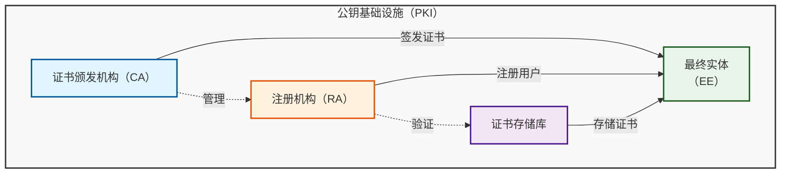

### 1.2 证书分类体系

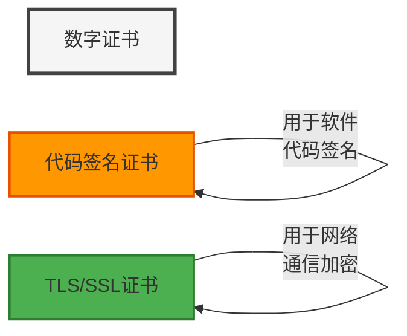

### 1.3 证书信任模型

#### 1.3.1 信任链

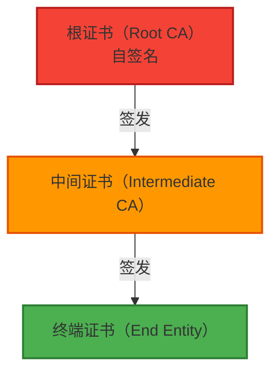

#### 1.3.2 信任锚点

| 信任锚点类型 | 说明 | 典型位置 |
|--------------|------|----------|
| **操作系统信任锚点** | 预装的根证书 | Windows证书存储、Linux /etc/ssl/certs |
| **浏览器信任锚点** | 浏览器内置的根证书 | Firefox、Chrome、Safari |
| **应用信任锚点** | 应用程序内置的根证书 | Java cacerts、.NET |
| **自定义信任锚点** | 用户或组织添加的根证书 | 企业内部CA |

---

## 2. 代码签名证书体系

### 2.1 代码签名证书基本概念

#### 2.1.1 定义与作用

代码签名证书是用于验证软件代码来源和完整性的数字证书。它允许软件开发者对可执行文件、库、脚本、驱动程序等代码进行数字签名，确保：

- **来源验证**：确认代码的发布者身份
- **完整性验证**：确保代码未被篡改
- **可信度提升**：提升用户对软件的信任度

#### 2.1.2 代码签名证书的组成

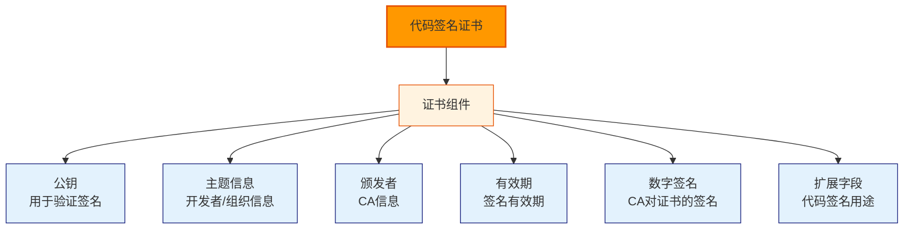

### 2.2 代码签名证书分类

#### 2.2.1 按平台分类

| 平台 | 证书类型 | 扩展名 | 典型CA |
|------|----------|----------|--------|
| **Windows** | Authenticode | .pfx, .spc | DigiCert, GlobalSign |
| **macOS** | Developer ID | .p12 | Apple |
| **iOS** | Developer ID | .p12 | Apple |
| **Android** | APK签名 | .keystore, .jks | Google, Verisign |
| **Java** | JAR签名 | .jks | DigiCert, GlobalSign |
| **Adobe AIR** | AIR签名 | .p12 | Adobe |

#### 2.2.2 按用途分类

| 用途 | 证书类型 | 典型应用 |
|------|----------|----------|
| **可执行文件签名** | Authenticode, Code Signing | .exe, .dll, .sys |
| **驱动程序签名** | Code Signing, Cross-Certificate | .sys, .cat |
| **脚本签名** | Script Signing | .ps1, .vbs, .sh |
| **移动应用签名** | Developer ID, APK Signing | .apk, .ipa |
| **文档签名** | Document Signing | .pdf, .docx |
| **宏签名** | VBA Signing | Office宏 |

### 2.3 代码签名工作原理

#### 2.3.1 签名流程

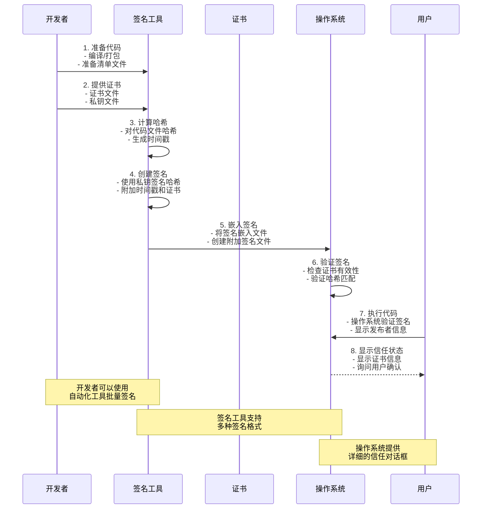

#### 2.3.2 哈希算法

| 算法 | 用途 | 特点 | 安全性 |
|------|------|------|--------|
| **SHA-1** | 旧版Windows | 160位输出 | 已弃用，不安全 |
| **SHA-256** | 现代标准 | 256位输出 | 推荐使用 |
| **SHA-384** | 高安全要求 | 384位输出 | 更高安全性 |
| **SHA-512** | 最高安全要求 | 512位输出 | 最高安全性 |

#### 2.3.3 时间戳服务

时间戳服务为签名添加可信时间证明，防止重放攻击。

**工作流程**：


**知名时间戳服务**：
- DigiCert Timestamp Service
- GlobalSign Timestamp Service
- Comodo Timestamp Service
- Verisign Timestamp Service

### 2.4 代码签名证书申请流程

#### 2.4.1 申请流程图

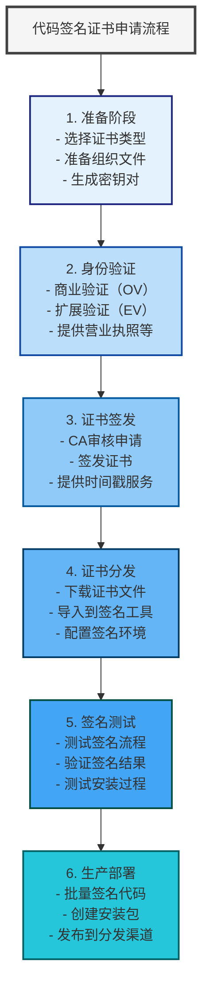

#### 2.4.2 Windows代码签名证书申请

**准备材料**：
1. **组织文件**：
   - 营业执照
   - 组织机构代码证
   - 法人身份证明

2. **技术文件**：
   - EV证书申请表
   - 申请人声明

**申请步骤**：
```powershell
# 1. 生成密钥对
makecert -sv MyKey.pvk MyCert.cer

# 2. 创建PFX文件
pvk2pfx -pvk MyKey.pvk -spc MyCert.cer -pfx MyCert.pfx

# 3. 提交到CA
# 将CSR提交到DigiCert等CA
```

#### 2.4.3 Apple开发者证书申请

**申请流程**：
1. 注册Apple Developer Program
2. 生成CSR（使用Keychain Access）
3. 提交CSR到Apple Developer Portal
4. 下载证书（.cer或.p12）
5. 导入到Keychain Access

**生成CSR**：
```bash
# 使用Keychain Access生成CSR
# 1. 打开Keychain Access
# 2. Keychain Access > Certificate Assistant > Request a Certificate From a Certificate Authority
# 3. 填写信息并保存CSR
# 4. 将CSR提交到Apple Developer Portal
```

#### 2.4.4 Android签名证书申请

**申请流程**：
1. 注册Google Play Console
2. 创建应用签名密钥
3. 生成APK签名密钥（.jks或.keystore）
4. 配置应用签名

**生成密钥库**：
```bash
# 生成密钥库
keytool -genkeypair -alias myalias -keyalg RSA -keysize 2048 -validity 10000 -keystore mykeystore.jks

# 导出证书
keytool -exportcert -alias myalias -keystore mykeystore.jks -rfc -file mycert.cer

# 导出私钥
keytool -importkeystore -srckeystore mykeystore.jks -destkeystore mykeystore.p12 -deststoretype PKCS12
```

### 2.5 代码签名安全最佳实践

#### 2.5.1 私钥保护

| 保护措施 | 说明 | 实施方法 |
|----------|------|----------|
| **硬件安全模块（HSM）** | 最高级别保护 | 使用专用硬件存储私钥 |
| **加密存储** | 使用密码保护密钥库 | 使用强密码（16+字符） |
| **访问控制** | 限制私钥访问权限 | 文件权限600，仅授权人员访问 |
| **密钥轮换** | 定期更换私钥 | 每年轮换一次 |
| **备份策略** | 安全备份密钥库 | 使用加密备份，离线存储 |

#### 2.5.2 签名流程安全

**安全检查清单**：
- [ ] 使用最新的哈希算法（SHA-256或更高）
- [ ] 启用时间戳服务
- [ ] 使用有效的代码签名证书
- [ ] 验证签名工具的完整性
- [ ] 在隔离环境中进行签名
- [ ] 记录所有签名操作
- [ ] 定期审计签名流程

#### 2.5.3 证书生命周期管理

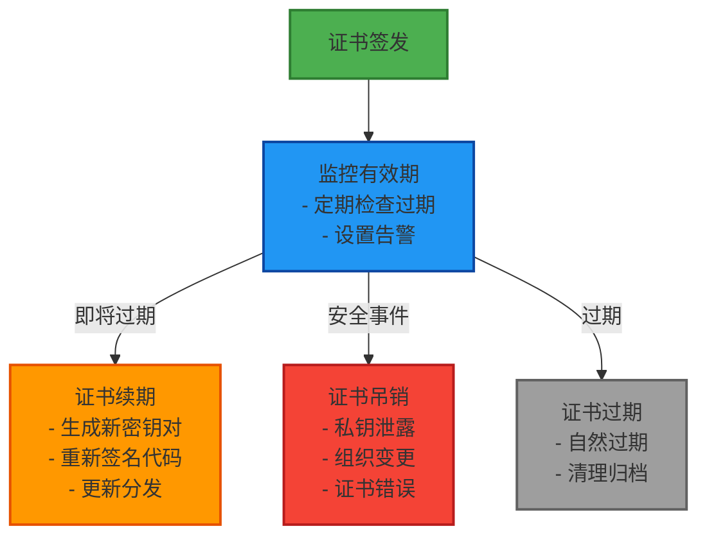

### 2.6 常见代码签名工具

#### 2.6.1 Windows签名工具

| 工具 | 用途 | 特点 |
|------|------|------|
| **SignTool.exe** | Authenticode签名 | Windows SDK内置工具 |
| **signtool.exe** | CAB文件签名 | 旧版工具 |
| **Microsoft Sign Service** | 云端签名服务 | 批量签名 |
| **DigiCert Signing Tool** | 第三方签名工具 | 支持多种格式 |

**使用SignTool签名**：
```powershell
# 基本签名
signtool sign /f MyApplication.exe /t http://timestamp.digicert.com

# 使用证书签名
signtool sign /f MyApplication.exe /a MyCert.spc /p MyKey.pvk

# 双重签名
signtool sign /f MyApplication.exe /a MyCert.spc /p MyKey.pvk /v MyApplication.exe
```

#### 2.6.2 Java签名工具

**使用jarsigner签名**：
```bash
# 签名JAR文件
jarsigner -keystore mykeystore.jks -storepass password -keypass password -signedjar signed-app.jar -digestalg SHA256 app.jar myalias

# 验证签名
jarsigner -verify -verbose -certs mycert.cer signed-app.jar

# 查看签名信息
jarsigner -verify -verbose -certs mycert.cer signed-app.jar
```

**使用keytool管理密钥库**：
```bash
# 列出密钥库内容
keytool -list -v -keystore mykeystore.jks

# 导出证书
keytool -exportcert -alias myalias -keystore mykeystore.jks -rfc -file mycert.cer

# 导入证书
keytool -importcert -alias myalias -file mycert.cer -keystore mykeystore.jks
```

#### 2.6.3 macOS/iOS签名工具

**使用codesign签名**：
```bash
# 签名macOS应用
codesign --force --sign "Developer ID Application: com.example.app" --timestamp MyApp.app

# 验证签名
codesign --verify --verbose MyApp.app

# 显示签名信息
codesign -d -vvv MyApp.app

# 签名iOS应用
codesign --force --sign "iPhone Developer: John Doe (XXXXXXXXXX)" --entitlements MyApp.entitlements MyApp.ipa
```

#### 2.6.4 Android签名工具

**使用apksigner签名**：
```bash
# 签名APK文件
apksigner sign --ks mykeystore.jks --ks-key-alias myalias --ks-pass pass:password --out signed-app.apk unsigned-app.apk

# 验证签名
apksigner verify signed-app.apk

# 对齐APK
zipalign -v 4 signed-app.apk aligned-app.apk
```

**使用zipalign和apksigner**：
```bash
# 完整的签名流程
# 1. 对齐APK
zipalign -v 4 unsigned-app.apk aligned-unsigned.apk

# 2. 签名APK
apksigner sign --ks mykeystore.jks --ks-key-alias myalias --ks-pass pass:password --out signed-app.apk aligned-unsigned.apk

# 3. 验证签名
apksigner verify signed-app.apk
```

---

## 3. TLS证书体系

### 3.1 TLS证书基本概念

#### 3.1.1 定义与作用

TLS（Transport Layer Security）证书是用于在TLS/SSL协议中建立安全通信通道的数字证书。它主要用于：

- **服务器身份验证**：验证服务器身份
- **客户端身份验证**：验证客户端身份（mTLS）
- **密钥交换**：协商加密密钥
- **数据加密**：加密通信数据

#### 3.1.2 TLS证书的组成

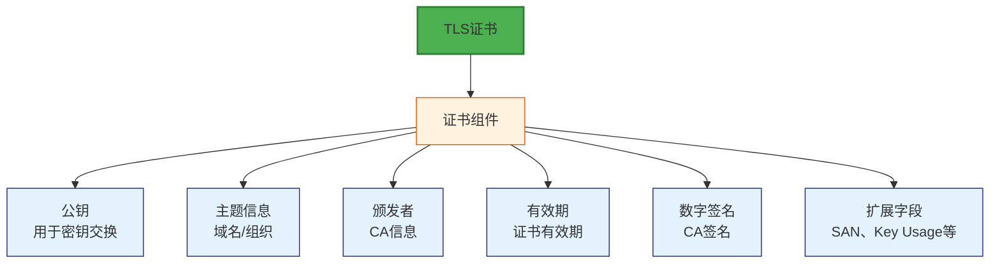

### 3.2 TLS协议版本与加密原理

#### 3.2.1 TLS协议演进

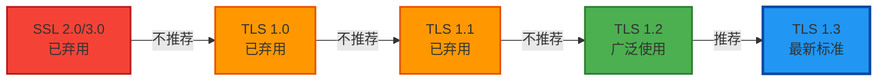

#### 3.2.2 协议版本对比

| 特性 | SSL 3.0 | TLS 1.0 | TLS 1.1 | TLS 1.2 | TLS 1.3 |
|------|---------|---------|---------|---------|---------|
| **状态** | 已弃用 | 已弃用 | 已弃用 | 广泛使用 | 最新标准 |
| **安全性** | 低 | 低 | 中 | 高 | 最高 |
| **握手RTT** | 2 | 2 | 2 | 2 | 1 |
| **前向安全性** | 否 | 否 | 可选 | 推荐 | 强制 |
| **加密套件** | 有限 | 改进 | 改进 | 丰富 | 现代化 |
| **HMAC算法** | MD5/SHA-1 | SHA-1 | SHA-256 | SHA-256 | SHA-256 |

#### 3.2.3 加密原理

**对称加密**：
- 使用相同的密钥加密和解密
- 优点：速度快，适合大数据加密
- 缺点：密钥分发困难
- 常用算法：AES-128-GCM、AES-256-GCM、ChaCha20-Poly1305

**非对称加密**：
- 使用公钥加密，私钥解密
- 优点：密钥分发安全
- 缺点：速度慢，适合小数据加密
- 常用算法：RSA、ECC

**混合加密**：
TLS使用混合加密方案：
1. 使用非对称加密交换对称密钥
2. 使用对称密钥加密实际数据

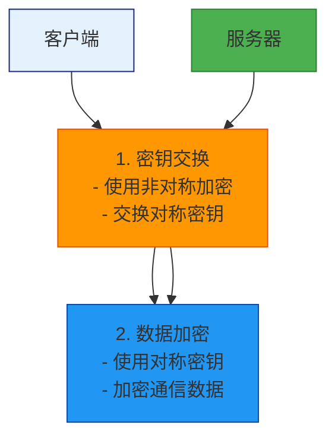

### 3.3 TLS证书分类

#### 3.3.1 按验证级别分类

| 类型 | 全称 | 验证要求 | 信任度 | 典型应用 |
|------|--------|----------|--------|----------|
| **DV** | Domain Validated | 域名所有权 | 基础 | 个人网站、测试环境 |
| **OV** | Organization Validated | 组织真实性 | 较高 | 企业网站、内部系统 |
| **EV** | Extended Validated | 扩展验证 | 最高 | 金融机构、大型企业 |

#### 3.3.2 按域名数量分类

| 类型 | 说明 | 优点 | 缺点 |
|------|------|------|------|
| **单域名证书** | 保护一个域名 | 简单、便宜 | 每个域名需要单独证书 |
| **通配符证书** | 保护主域名及所有子域名 | 灵活、成本低 | 不能用于多级子域名 |
| **多域名证书（SAN）** | 保护多个不同域名 | 一个证书保护多个域名 | 成本较高 |

### 3.4 TLS握手过程

#### 3.4.1 TLS 1.2握手流程

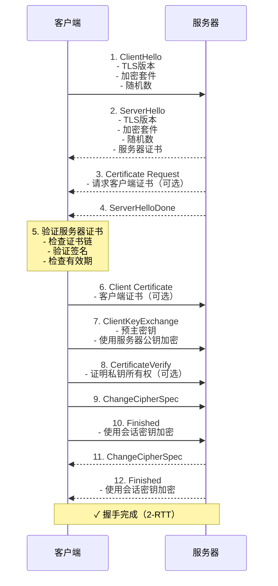

#### 3.4.2 TLS 1.3握手流程

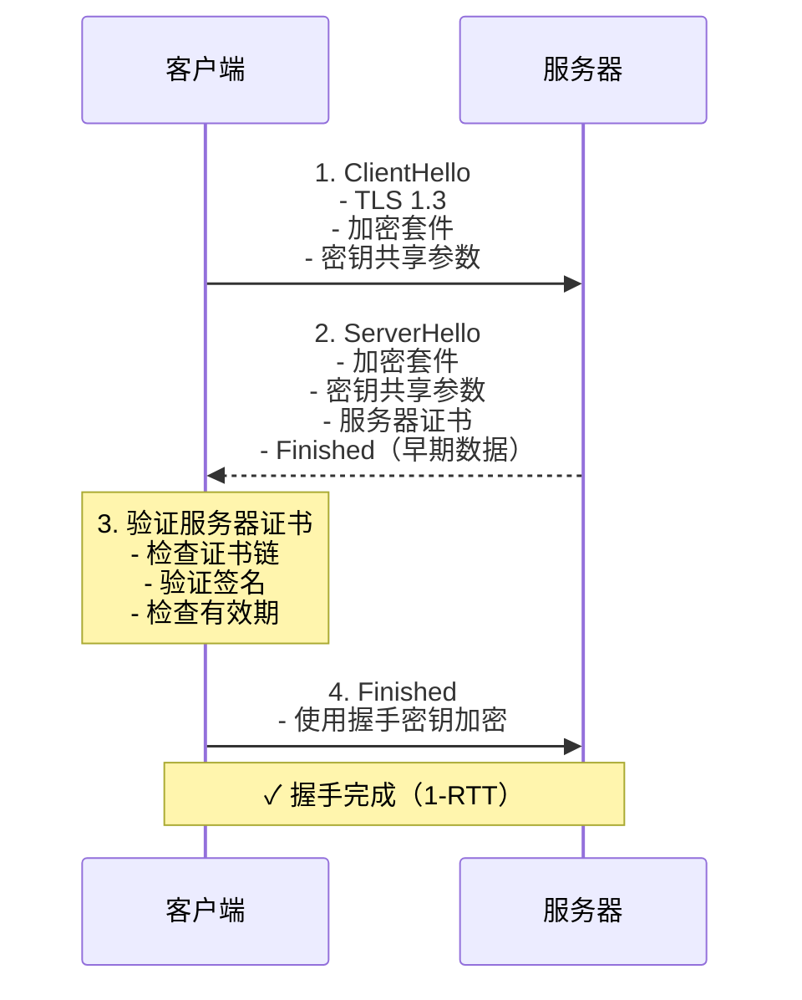

#### 3.4.3 握手性能对比

| 指标 | TLS 1.2 | TLS 1.3 | 改进 |
|------|---------|---------|------|
| **握手RTT** | 2 | 1 | 50% |
| **消息数量** | 10-12 | 4-6 | 50% |
| **CPU使用** | 较高 | 较低 | 30% |
| **延迟** | 较高 | 较低 | 40% |

### 3.5 TLS证书部署配置

#### 3.5.1 Nginx配置

```nginx
server {
    listen 443 ssl http2;
    server_name www.example.com;

    # 证书配置
    ssl_certificate /etc/ssl/certs/server.crt;
    ssl_certificate_key /etc/ssl/private/server.key;
    ssl_trusted_certificate /etc/ssl/certs/ca-chain.crt;

    # 协议配置
    ssl_protocols TLSv1.2 TLSv1.3;
    ssl_ciphers 'ECDHE-ECDSA-AES128-GCM-SHA256:ECDHE-RSA-AES128-GCM-SHA256';
    ssl_prefer_server_ciphers off;

    # 会话配置
    ssl_session_cache shared:SSL:10m;
    ssl_session_timeout 1d;
    ssl_session_tickets off;

    # OCSP Stapling
    ssl_stapling on;
    ssl_stapling_verify on;
    ssl_trusted_certificate /etc/ssl/certs/ca-chain.crt;
    resolver 8.8.8.8 8.8.4.4 valid=300s;
    resolver_timeout 5s;

    # 安全头
    add_header Strict-Transport-Security "max-age=31536000; includeSubDomains; preload" always;
    add_header X-Frame-Options "SAMEORIGIN" always;
    add_header X-Content-Type-Options "nosniff" always;
    add_header X-XSS-Protection "1; mode=block" always;

    # mTLS配置（可选）
    # ssl_client_certificate /etc/ssl/certs/client.crt;
    # ssl_client_certificate_key /etc/ssl/private/client.key;
    # ssl_verify_client on;
    # ssl_verify_depth 2;
    # ssl_client_verify on;

    location / {
        root /var/www/html;
        index index.html;
    }
}
```

#### 3.5.2 Apache配置

```apache
<VirtualHost *:443>
    ServerName www.example.com

    # 启用SSL
    SSLEngine on

    # 证书配置
    SSLCertificateFile /etc/ssl/certs/server.crt
    SSLCertificateKeyFile /etc/ssl/private/server.key
    SSLCertificateChainFile /etc/ssl/certs/ca-chain.crt

    # 协议配置
    SSLProtocol all -SSLv2 -SSLv3 -TLSv1 -TLSv1.1
    SSLCipherSuite ECDHE-ECDSA-AES128-GCM-SHA256:ECDHE-RSA-AES128-GCM-SHA256
    SSLHonorCipherOrder off

    # 会话配置
    SSLSessionCache shmcb:/var/run/apache2/ssl_scache(512000)
    SSLSessionCacheTimeout 300
    SSLSessionTickets off

    # OCSP Stapling
    SSLUseStapling on
    SSLStaplingCache shmcb:/var/run/apache2/ocsp(128000)
    SSLStaplingResponderTimeout 5
    SSLStaplingReturnResponderErrors off

    # 安全头
    Header always set Strict-Transport-Security "max-age=31536000; includeSubDomains; preload"
    Header always set X-Frame-Options "SAMEORIGIN"
    Header always set X-Content-Type-Options "nosniff"
    Header always set X-XSS-Protection "1; mode=block"

    # mTLS配置（可选）
    # SSLCACertificateFile /etc/ssl/certs/ca.crt
    # SSLVerifyClient require
    # SSLVerifyDepth 2
    # SSLCARevocationFile /etc/ssl/certs/crl.pem
    # SSLCARevocationCheck on

    DocumentRoot /var/www/html
    ErrorLog ${APACHE_LOG_DIR}/error.log
    CustomLog ${APACHE_LOG_DIR}/access.log combined
</VirtualHost>
```

#### 3.5.3 Python应用配置

```python
import ssl
import asyncio
from aiohttp import web

async def handle_request(request):
    """处理请求"""
    return web.Response(text="Hello, secure world!")

async def create_server():
    """创建TLS服务器"""
    # 创建SSL上下文
    ssl_context = ssl.create_default_context(ssl.Purpose.CLIENT_AUTH)
    ssl_context.load_cert_chain(
        certfile='/etc/ssl/certs/server.crt',
        keyfile='/etc/ssl/private/server.key'
    )
    
    # 配置协议和加密套件
    ssl_context.minimum_version = ssl.TLSVersion.TLSv1_2
    ssl_context.set_ciphers('ECDHE-ECDSA-AES128-GCM-SHA256:ECDHE-RSA-AES128-GCM-SHA256')
    
    # 创建应用
    app = web.Application()
    app.router.add_get('/', handle_request)
    
    # 启动服务器
    runner = web.AppRunner(app)
    site = web.TCPSite(runner, ssl_context=ssl_context)
    
    await asyncio.get_event_loop().create_server(site)
    print("TLS服务器已启动在端口443")

if __name__ == '__main__':
    asyncio.run(create_server())
```

#### 3.5.4 Java应用配置

```java
import org.springframework.boot.web.client.RestTemplate;
import org.springframework.http.*;
import javax.net.ssl.*;
import java.security.cert.*;
import java.security.KeyStore;

@Configuration
public class TLSConfig {
    @Bean
    public RestTemplate restTemplate() throws Exception {
        // 加载密钥库
        KeyStore keyStore = KeyStore.getInstance("PKCS12");
        try (FileInputStream fis = new FileInputStream("server.p12")) {
            keyStore.load(fis, "password".toCharArray());
        }
        
        // 创建SSL上下文
        SSLContext sslContext = SSLContextBuilder.create()
            .loadKeyMaterial(keyStore, "password".toCharArray())
            .loadTrustMaterial(new File("ca.crt"))
            .build();
        
        // 创建RestTemplate
        return new RestTemplate(new HttpComponentsClientHttpRequestFactory(
            HttpClients.custom()
                .setSSLContext(sslContext)
                .build()
        ));
    }
}
```

### 3.6 TLS证书验证机制

#### 3.6.1 证书验证流程

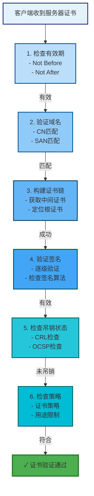

#### 3.6.2 CRL与OCSP对比

| 特性 | CRL | OCSP |
|------|-----|------|
| **更新频率** | 定期（天/周） | 实时 |
| **文件大小** | 随吊销证书增长 | 固定大小 |
| **查询延迟** | 低（本地查询） | 中（网络查询） |
| **隐私性** | 低（公开列表） | 高（可追踪查询） |
| **缓存** | 客户端缓存 | 服务器缓存（Stapling） |
| **推荐场景** | 内网、离线环境 | 公网、在线环境 |

#### 3.6.3 OCSP Stapling配置

**Nginx配置**：
```nginx
ssl_stapling on;
ssl_stapling_verify on;
ssl_trusted_certificate /etc/ssl/certs/ca-chain.crt;
resolver 8.8.8.8 8.8.4.4 valid=300s;
resolver_timeout 5s;
```

**Apache配置**：
```apache
SSLUseStapling on;
SSLStaplingCache shmcb:/var/run/apache2/ocsp(128000);
SSLStaplingResponderTimeout 5;
SSLStaplingReturnResponderErrors off;
```

---

## 4. 两种证书体系的异同分析

### 4.1 核心差异对比

| 维度 | 代码签名证书 | TLS证书 |
|------|--------------|----------|
| **主要用途** | 验证软件代码来源和完整性 | 验证网络通信双方身份 |
| **应用场景** | 软件/应用分发 | 网络通信、API访问 |
| **验证时机** | 安装/执行时验证 | 每次连接时验证 |
| **有效期** | 通常较长（1-3年） | 通常较短（90天-1年） |
| **密钥用途** | Digital Signature | Key Encipherment, Digital Signature |
| **扩展密钥用途** | Code Signing | Server Auth, Client Auth |
| **主题字段** | 组织/开发者信息 | 域名/服务器信息 |
| **信任锚点** | 操作系统/应用信任库 | 浏览器/操作系统信任库 |
| **吊销机制** | 主要使用CRL | 主要使用OCSP |
| **时间戳** | 必需 | 可选 |

### 4.2 技术架构对比

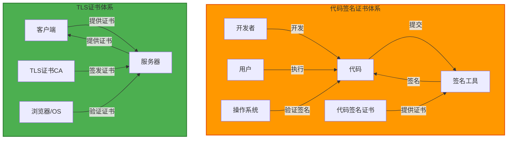

### 4.3 工作流程对比

#### 4.3.1 代码签名流程

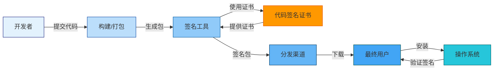

#### 4.3.2 TLS通信流程

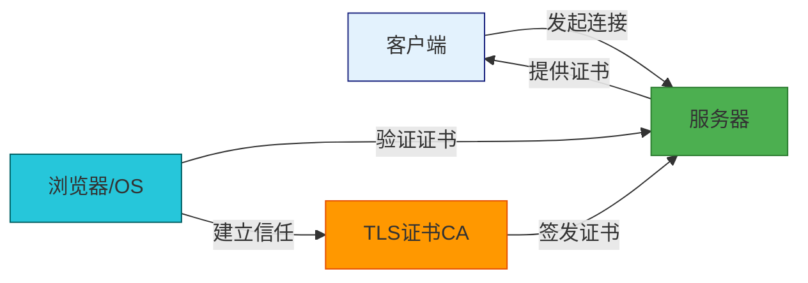

### 4.4 安全威胁对比

| 威胁类型 | 代码签名证书 | TLS证书 |
|----------|--------------|----------|
| **中间人攻击** | 低（签名嵌入文件） | 高（需要验证证书链） |
| **重放攻击** | 中（时间戳保护） | 低（每次连接新鲜） |
| **篡改攻击** | 低（哈希验证） | 低（加密保护） |
| **证书伪造** | 中（需要CA私钥） | 高（需要CA私钥） |
| **密钥泄露** | 高（影响所有签名） | 中（影响当前连接） |
| **拒绝服务** | 低（不影响已签名文件） | 高（可攻击握手） |

### 4.5 合规要求对比

| 标准 | 代码签名证书 | TLS证书 |
|------|--------------|----------|
| **PCI DSS** | 代码签名要求 | TLS配置要求 |
| **GDPR** | 数据保护要求 | 数据传输加密要求 |
| **HIPAA** | 医疗数据保护要求 | 医疗数据传输要求 |
| **SOX** | 内控要求 | 内控要求 |
| **FIPS 140-2** | 加密算法要求 | 加密算法要求 |

---

## 5. 行业标准与合规要求

### 5.1 国际标准

#### 5.1.1 X.509标准

X.509是ITU-T和ISO联合制定的公钥证书格式标准。

**版本演进**：
- **X.509 v1**：1988年，基础版本
- **X.509 v2**：1993年，支持唯一标识符
- **X.509 v3**：1996年，支持扩展字段，当前标准

#### 5.1.2 RFC标准

| RFC | 标题 | 说明 |
|-----|------|------|
| **RFC 5280** | Internet X.509 PKI Certificate and CRL Profile | X.509证书和CRL规范 |
| **RFC 5246** | The Transport Layer Security (TLS) Protocol Version 1.2 | TLS 1.2协议规范 |
| **RFC 8446** | The Transport Layer Security (TLS) Protocol Version 1.3 | TLS 1.3协议规范 |
| **RFC 6960** | X.509 Certificates and CRL Profile | X.509证书和CRL规范 |
| **RFC 5280** | Internet X.509 PKI Certificate and CRL Profile | PKI体系规范 |

#### 5.1.3 密码学标准

| 标准 | 说明 | 应用 |
|------|------|------|
| **FIPS 140-2** | 美国联邦信息处理标准 | 政府系统、高安全要求 |
| **NIST SP 800-57** | 密钥管理建议 | 密钥生命周期管理 |
| **ANSI X9.31** | 美国国家标准 | 金融系统 |
| **ISO/IEC 19790** | 国际标准 | 全球应用 |

### 5.2 区域性法规

#### 5.2.1 欧盟法规

**GDPR（通用数据保护条例）**：
- 数据保护要求
- 数据传输加密要求
- 数据完整性要求
- 数据可审计性要求
- 违规处罚：最高2000万欧元或全球营业额的4%

**eIDAS（电子身份识别和信任服务）**：
- 跨境电子身份识别
- 信任服务框架
- 互操作性要求

#### 5.2.2 北美法规

**SOX（萨班斯-奥克斯利法案）**：
- 内控要求
- 财务报告要求
- IT控制要求

**HIPAA（健康保险流通与责任法案）**：
- 医疗数据保护要求
- 安全保障要求
- 违规处罚：最高150万美元

#### 5.2.3 亚太法规

**中国网络安全法**：
- 数据本地化要求
- 数据安全要求
- 网络运营者责任

**新加坡PDPA（个人数据保护法）**：
- 数据保护要求
- 数据传输要求
- 违规处罚：最高100万新元

### 5.3 行业特定标准

#### 5.3.1 金融行业

**PCI DSS（支付卡行业数据安全标准）**：
- 要求4：加密传输持卡人数据
- 要求6：维护安全策略
- 要求10：跟踪访问网络资源
- 要求12：维护安全漏洞程序

**要求4详细说明**：
- 使用强加密（TLS 1.2或更高）
- 禁用弱加密套件
- 定期更新证书
- 实施入侵检测系统

#### 5.3.2 医疗行业

**HIPAA安全规则**：
- 传输安全：使用加密传输
- 访问控制：限制数据访问
- 审计控制：记录数据访问
- 完整性控制：防止数据篡改

#### 5.3.3 政府行业

**FIPS 140-2验证**：
- 使用FIPS验证的加密模块
- 使用FIPS验证的密钥长度
- 定期进行FIPS审计

**Common Criteria（通用准则）**：
- EAL 1-7评估保证级别
- 安全功能要求
- 安全目标要求

### 5.4 合规实施指南

#### 5.4.1 证书管理合规

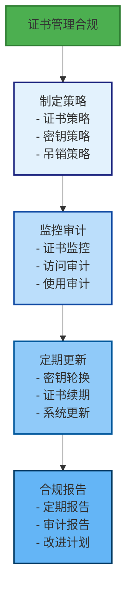

#### 5.4.2 合规检查清单

**证书管理**：
- [ ] 建立证书策略文档
- [ ] 实施证书生命周期管理
- [ ] 配置证书监控和告警
- [ ] 建立证书吊销流程
- [ ] 定期进行证书审计
- [ ] 维护证书清单

**技术实施**：
- [ ] 使用FIPS验证的加密算法
- [ ] 配置TLS 1.2或更高
- [ ] 禁用不安全的加密套件
- [ ] 启用HSTS
- [ ] 配置OCSP Stapling
- [ ] 实施证书固定（如适用）

**文档和培训**：
- [ ] 维护合规文档
- [ ] 提供员工培训
- [ ] 建立事件响应流程
- [ ] 定期进行合规审查

---

## 6. 实际应用案例分析

### 6.1 代码签名应用案例

#### 6.1.1 Windows企业软件分发

**场景描述**：
某企业需要向内部员工分发自定义的Windows应用程序，需要确保软件来源可信，防止恶意软件伪装。

**解决方案**：
1. **申请EV代码签名证书**：
   - 提供企业营业执照
   - 提供组织文件
   - 完成扩展验证

2. **配置签名环境**：
   - 设置自动化签名服务器
   - 配置时间戳服务
   - 建立签名审计日志

3. **实施签名流程**：
```powershell
# 自动化签名脚本
$certPath = "C:\Certificates\MyCert.pfx"
$timestampUrl = "http://timestamp.digicert.com"
$appPath = "C:\Builds\MyApp.exe"

# 签名应用程序
signtool sign /f $appPath /pfx $certPath /t $timestampUrl /fd "C:\Logs\sign.log"

# 验证签名
signtool verify /pa $appPath
```

4. **分发策略**：
   - 使用企业内网分发
   - 提供数字签名验证工具
   - 培训员工识别有效签名

**效果**：
- ✅ 软件来源可验证
- ✅ 提升用户信任度
- ✅ 减少恶意软件风险
- ✅ 符合企业安全策略

#### 6.1.2 移动应用商店发布

**场景描述**：
开发者需要将iOS和Android应用发布到应用商店，需要使用代码签名证书。

**iOS应用签名**：
```bash
# 1. 申请Apple Developer证书
# 2. 生成CSR（使用Keychain Access）
# 3. 下载证书（.p12）
# 4. 签名应用
codesign --force --sign "iPhone Developer: John Doe (XXXXXXXXXX)" --entitlements MyApp.entitlements MyApp.ipa

# 5. 验证签名
codesign -d -vvv MyApp.ipa

# 6. 上传到App Store Connect
```

**Android应用签名**：
```bash
# 1. 生成密钥库
keytool -genkeypair -alias myalias -keyalg RSA -keysize 2048 -validity 10000 -keystore mykeystore.jks

# 2. 签名APK
jarsigner -keystore mykeystore.jks -storepass password -keypass password -signedjar signed-app.apk -digestalg SHA256 app.jar myalias

# 3. 对齐APK
zipalign -v 4 signed-app.apk aligned-app.apk

# 4. 上传到Google Play Console
```

**效果**：
- ✅ 应用商店接受签名应用
- ✅ 用户可验证应用来源
- ✅ 防止应用被篡改
- ✅ 符合应用商店政策

### 6.2 TLS证书应用案例

#### 6.2.1 企业mTLS API网关

**场景描述**：
某企业需要为内部API实施双向TLS认证，确保只有持有有效客户端证书的设备和应用才能访问。

**架构设计**：
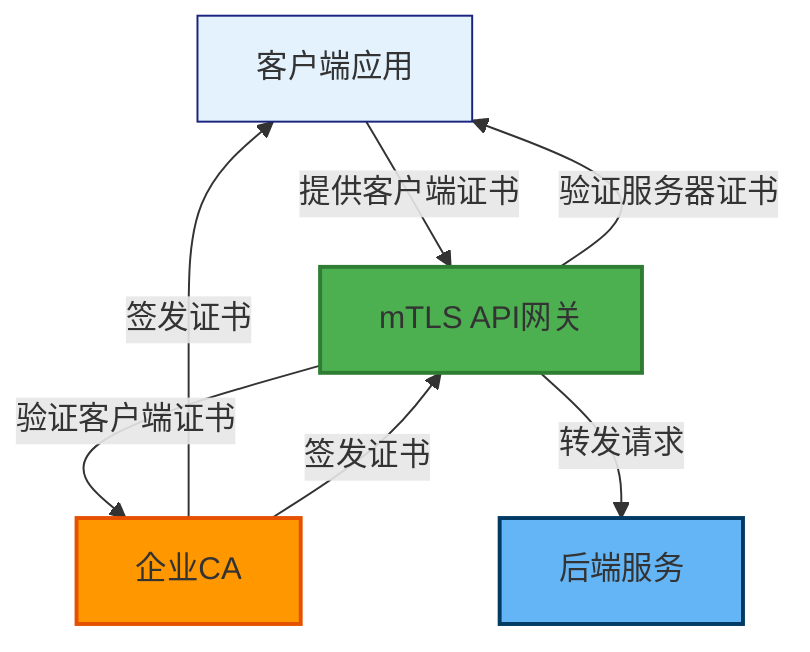

**Nginx配置**：
```nginx
upstream backend {
    server api-backend:8080;
}

server {
    listen 443 ssl http2;
    server_name api.example.com;

    # 服务器证书
    ssl_certificate /etc/ssl/certs/server.crt;
    ssl_certificate_key /etc/ssl/private/server.key;
    ssl_trusted_certificate /etc/ssl/certs/ca-chain.crt;

    # mTLS配置
    ssl_client_certificate /etc/ssl/certs/ca.crt;
    ssl_verify_client on;
    ssl_verify_depth 2;
    ssl_client_verify on;

    # CRL配置
    ssl_crl /etc/ssl/certs/crl.pem;

    # 安全头
    add_header Strict-Transport-Security "max-age=31536000; includeSubDomains" always;

    location / {
        proxy_pass http://backend;
        proxy_set_header X-Client-SSL-Verify $ssl_client_verify;
        proxy_set_header X-Client-Cert $ssl_client_cert;
    }
}
```

**客户端配置**：
```python
import requests
import ssl

# 加载客户端证书
cert = ('/path/to/client.crt', '/path/to/client.key')
ca_cert = '/path/to/ca.crt'

# 发送mTLS请求
response = requests.get(
    'https://api.example.com/endpoint',
    cert=cert,
    verify=ca_cert
)

print(f"状态码: {response.status_code}")
print(f"响应: {response.text}")
```

**效果**：
- ✅ 强制客户端身份验证
- ✅ 防止未授权访问
- ✅ 提供审计追踪
- ✅ 符合安全合规要求

#### 6.2.2 金融行业TLS部署

**场景描述**：
某银行需要为网上银行系统部署高安全TLS配置，符合PCI DSS要求。

**安全配置**：
```nginx
server {
    listen 443 ssl http2;
    server_name banking.example.com;

    # 证书配置
    ssl_certificate /etc/ssl/certs/server.crt;
    ssl_certificate_key /etc/ssl/private/server.key;
    ssl_trusted_certificate /etc/ssl/certs/ca-chain.crt;

    # PCI DSS要求的TLS配置
    ssl_protocols TLSv1.2 TLSv1.3;
    ssl_ciphers 'ECDHE-ECDSA-AES256-GCM-SHA384:ECDHE-RSA-AES256-GCM-SHA384';
    ssl_prefer_server_ciphers off;

    # HSTS配置（PCI DSS要求）
    add_header Strict-Transport-Security "max-age=31536000; includeSubDomains; preload" always;

    # OCSP Stapling
    ssl_stapling on;
    ssl_stapling_verify on;
    ssl_trusted_certificate /etc/ssl/certs/ca-chain.crt;
    resolver 8.8.8.8 8.8.4.4 valid=300s;
    resolver_timeout 5s;

    # 安全头
    add_header X-Frame-Options "DENY" always;
    add_header X-Content-Type-Options "nosniff" always;
    add_header X-XSS-Protection "1; mode=block" always;
    add_header Content-Security-Policy "default-src 'self'; script-src 'self'" always;

    # 速率限制
    limit_req_zone $binary_remote_addr zone=api:10m rate=10r/s;
    limit_req zone=api burst=20 nodelay;

    location / {
        root /var/www/banking;
        index index.html;
    }
}
```

**合规检查**：
- [ ] 使用TLS 1.2或更高
- [ ] 禁用弱加密套件
- [ ] 启用HSTS
- [ ] 配置OCSP Stapling
- [ ] 定期更新证书
- [ ] 实施入侵检测
- [ ] 定期进行安全扫描

**效果**：
- ✅ 符合PCI DSS要求
- ✅ 提供最高级别的加密保护
- ✅ 防止中间人攻击
- ✅ 提供安全审计追踪

---

## 7. 最佳实践与安全建议

### 7.1 证书管理最佳实践

#### 7.1.1 证书生命周期管理

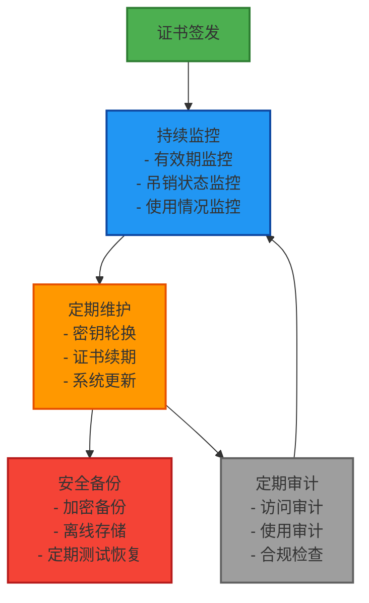

#### 7.1.2 密钥管理策略

| 策略 | 说明 | 实施方法 |
|------|------|----------|
| **密钥生成** | 使用强随机数生成器 | 使用硬件随机数生成器 |
| **密钥存储** | 使用安全存储介质 | HSM、加密USB、智能卡 |
| **密钥访问** | 实施最小权限原则 | 基于角色的访问控制 |
| **密钥轮换** | 定期更换密钥 | 每年轮换一次 |
| **密钥销毁** | 安全销毁旧密钥 | 物理销毁、多次覆写 |
| **密钥备份** | 安全备份密钥 | 加密备份、离线存储 |

#### 7.1.3 证书选择建议

**代码签名证书选择**：
- 优先选择EV证书
- 选择支持时间戳服务的CA
- 确保证书覆盖所有目标平台
- 考虑证书的浏览器信任度

**TLS证书选择**：
- 根据安全需求选择验证级别
- 优先选择TLS 1.3支持的证书
- 选择支持OCSP Stapling的CA
- 考虑证书的性能影响

### 7.2 安全配置建议

#### 7.2.1 TLS安全配置清单

**协议配置**：
```nginx
# 推荐配置
ssl_protocols TLSv1.2 TLSv1.3;

# 禁用不安全的协议
# ssl_protocols SSLv2 SSLv3 TLSv1 TLSv1.1;
```

**加密套件配置**：
```nginx
# 推荐配置
ssl_ciphers 'ECDHE-ECDSA-AES256-GCM-SHA384:ECDHE-RSA-AES256-GCM-SHA384';
ssl_prefer_server_ciphers off;

# 禁用不安全的加密套件
# ssl_ciphers '!aNULL:!eNULL:!EXPORT:!DES:!RC4:!3DES:!MD5:!PSK';
```

**HSTS配置**：
```nginx
# 推荐配置
add_header Strict-Transport-Security "max-age=31536000; includeSubDomains; preload" always;
```

#### 7.2.2 代码签名安全配置

**哈希算法选择**：
- 优先使用SHA-256
- 高安全要求使用SHA-384或SHA-512
- 禁用SHA-1和MD5

**时间戳配置**：
- 使用可信的时间戳服务
- 配置多个时间戳服务作为备份
- 确保时间戳服务器可用性

**签名验证**：
- 在签名后验证签名
- 在分发前测试签名
- 提供签名验证工具给用户

### 7.3 监控与告警

#### 7.3.1 证书监控指标

| 指标 | 说明 | 告警阈值 |
|------|------|----------|
| **证书有效期** | 距离过期天数 | 30天、7天、1天 |
| **证书吊销状态** | 证书是否被吊销 | 立即告警 |
| **签名验证失败率** | 签名验证失败次数 | >1%阈值 |
| **TLS握手失败率** | TLS握手失败次数 | >5%阈值 |
| **OCSP响应时间** | OCSP查询响应时间 | >5秒阈值 |

#### 7.3.2 监控脚本示例

**证书监控脚本**：
```bash
#!/bin/bash
# cert-monitor.sh

CERT_FILE="/etc/ssl/certs/server.crt"
WARNING_DAYS=30
ALERT_EMAIL="admin@example.com"

# 检查证书有效期
expiry_date=$(openssl x509 -in "$CERT_FILE" -noout -enddate | cut -d= -f2)
expiry_timestamp=$(date -d "$expiry_date" +%s)
current_timestamp=$(date +%s)
days_left=$(( (expiry_timestamp - current_timestamp) / 86400 ))

echo "证书过期时间: $expiry_date"
echo "剩余天数: $days_left"

# 发送告警
if [ $days_left -lt $WARNING_DAYS ]; then
    echo "警告: 证书将在 $days_left 天内过期!"
    # 发送邮件告警
    echo "证书即将过期" | mail -s "证书告警" -a "From: cert-monitor@example.com" "$ALERT_EMAIL"
fi
```

**代码签名监控脚本**：
```python
#!/usr/bin/env python3
# code-signing-monitor.py

import subprocess
import logging
from datetime import datetime, timedelta

logging.basicConfig(level=logging.INFO)
logger = logging.getLogger(__name__)

def check_signed_files(directory):
    """检查签名文件的有效性"""
    for root, dirs, files in os.walk(directory):
        for file in files:
            if file.endswith('.exe') or file.endswith('.dll'):
                try:
                    # 使用signtool验证签名
                    result = subprocess.run(
                        ['signtool', 'verify', '/pa', file],
                        capture_output=True,
                        text=True
                    )
                    
                    if result.returncode != 0:
                        logger.error(f"签名验证失败: {file}")
                        logger.error(result.stderr)
                    else:
                        logger.info(f"签名验证成功: {file}")
                        
                except Exception as e:
                    logger.error(f"验证文件时出错 {file}: {e}")

if __name__ == '__main__':
    check_signed_files('/path/to/signed/files')
```

### 7.4 灾难恢复

#### 7.4.1 备份策略

**备份内容**：
- 证书文件
- 私钥文件（加密）
- 配置文件
- 签名工具配置
- 时间戳服务配置

**备份频率**：
- 每日增量备份
- 每周全量备份
- 重大变更前备份

**备份存储**：
- 本地加密备份
- 异地备份（不同地理位置）
- 云端加密备份
- 离线备份（物理隔离）

#### 7.4.2 恢复流程

```mermaid
graph TD
    Incident["安全事件发生"]
    
    Assess["评估影响<br/>- 确定影响范围<br/>- 评估数据泄露"]
    Contain["控制影响<br/>- 隔离受影响系统<br/>- 停止相关服务"]
    Recover["恢复系统<br/>- 从备份恢复<br/>- 重新签发证书<br/>- 更新配置"]
    Verify["验证恢复<br/>- 测试系统功能<br/>- 验证签名<br/>- 验证TLS连接"]
    Learn["总结经验<br/>- 记录事件<br/>- 更新流程<br/>- 培训员工"]
    
    Incident --> Assess
    Assess --> Contain
    Contain --> Recover
    Recover --> Verify
    Verify --> Learn
    
    style Incident fill:#f44336,stroke:#b71c1c,stroke-width:2px
    style Assess fill:#ff9800,stroke:#e65100,stroke-width:2px
    style Contain fill:#ff9800,stroke:#e65100,stroke-width:2px
    style Recover fill:#4caf50,stroke:#2e7d32,stroke-width:2px
    style Verify fill:#2196f3,stroke:#0d47a1,stroke-width:2px
    style Learn fill:#9e9e9e,stroke:#616161,stroke-width:2px
```

---

## 8. 常见问题与解决方案

### 8.1 代码签名证书问题

#### 8.1.1 签名验证失败

**问题现象**：
```
Windows已保护你的电脑
此文件的数字签名无效
```

**可能原因**：
1. 证书已过期
2. 证书被吊销
3. 证书链不完整
4. 系统时间不正确
5. 签名被篡改

**解决方案**：
```powershell
# 1. 检查证书有效期
certutil -store MY -v MyCert

# 2. 检查证书链
certutil -verify -v MyCert

# 3. 检查系统时间
Get-Date

# 4. 重新签名
signtool sign /f MyApp.exe /a MyCert.spc /p MyKey.pvk
```

#### 8.1.2 时间戳服务不可用

**问题现象**：
```
错误: 无法连接到时间戳服务器
```

**可能原因**：
1. 时间戳服务器宕机
2. 网络连接问题
3. 防火墙阻止
4. DNS解析失败

**解决方案**：
```powershell
# 1. 配置多个时间戳服务
# 在签名工具中配置备用时间戳服务器

# 2. 使用本地时间戳服务
# 部署内部时间戳服务器

# 3. 检查网络连接
# 使用ping或telnet测试连接

# 4. 检查防火墙规则
# 确保允许出站HTTPS连接

# 5. 使用代理服务器
# 通过代理服务器访问时间戳服务
```

#### 8.1.3 跨平台签名问题

**问题现象**：
```
macOS上无法验证Windows签名
```

**可能原因**：
1. 平台特定的签名格式不兼容
2. 证书信任锚点不同
3. 验证工具版本不匹配

**解决方案**：
```bash
# 1. 为每个平台使用正确的签名工具
# Windows: signtool.exe
# macOS: codesign
# Linux: osslsign

# 2. 使用通用的签名格式
# 如使用JAR签名用于Java跨平台

# 3. 在目标平台上验证签名
# 在目标平台上测试签名验证

# 4. 提供平台特定的验证工具
# 为用户提供验证工具
```

### 8.2 TLS证书问题

#### 8.2.1 证书链不完整

**问题现象**：
```
SSL: error:0B080074:x509 certificate routines:X509_check_private_key:key values mismatch
```

**可能原因**：
1. 中间证书缺失
2. 证书顺序错误
3. 根证书未配置

**解决方案**：
```bash
# 1. 检查证书链
openssl s_client -connect api.example.com:443 -showcerts

# 2. 合并证书链
cat server.crt intermediate.crt > server-chain.crt

# 3. 配置正确的证书链
# 在Nginx/Apache中配置完整的证书链

# 4. 验证证书链
openssl verify -CAfile ca.crt server-chain.crt
```

#### 8.2.2 证书过期

**问题现象**：
```
SSL: error:0B080074:x509 certificate routines:X509_check_private_key:certificate has expired
```

**可能原因**：
1. 证书自然过期
2. 系统时间不正确
3. 时区配置错误

**解决方案**：
```bash
# 1. 检查证书有效期
openssl x509 -in server.crt -noout -dates

# 2. 检查系统时间
date

# 3. 同步系统时间
# Linux: ntpdate pool.ntp.org
# Windows: w32tm /resync

# 4. 续期证书
# 生成新的CSR并提交到CA

# 5. 安装新证书
# 替换旧证书并重启服务

# 6. 配置自动续期
# 使用certbot等工具配置自动续期
```

#### 8.2.3 域名不匹配

**问题现象**：
```
SSL: error:0B080074:x509 certificate routines:X509_check_private_key:certificate subject name does not match target host name
```

**可能原因**：
1. CN字段与访问域名不匹配
2. SAN字段未包含访问域名
3. 使用IP地址而非域名

**解决方案**：
```bash
# 1. 检查证书的CN和SAN
openssl x509 -in server.crt -noout -subject -nameopt compat -nameopt sep_multiline
openssl x509 -in server.crt -noout -ext subjectAltName

# 2. 申请包含所有域名的证书
# 使用SAN证书或通配符证书

# 3. 配置正确的域名
# 确保配置的域名与证书匹配

# 4. 使用SNI（Server Name Indication）
# 配置服务器支持多个域名
```

#### 8.2.4 弱加密套件

**问题现象**：
```
SSL: error:0B080074:x509 certificate routines:X509_check_private_key:no shared cipher
```

**可能原因**：
1. 使用过时的加密算法
2. 支持不安全的加密套件
3. 配置了弱密钥长度

**解决方案**：
```nginx
# 1. 禁用不安全的加密套件
ssl_ciphers '!aNULL:!eNULL:!EXPORT:!DES:!RC4:!3DES:!MD5:!PSK';

# 2. 配置推荐的加密套件
ssl_ciphers 'ECDHE-ECDSA-AES256-GCM-SHA384:ECDHE-RSA-AES256-GCM-SHA384';
ssl_prefer_server_ciphers off;

# 3. 强制使用TLS 1.2或更高
ssl_protocols TLSv1.2 TLSv1.3;

# 4. 使用强密钥
# RSA密钥至少2048位
# ECC密钥使用P-256或更高

# 5. 定期更新配置
# 跟进加密算法和协议更新
```

### 8.3 性能问题

#### 8.3.1 TLS握手慢

**问题现象**：
- TLS握手时间过长（>1秒）
- 应用启动延迟高
- 用户体验差

**可能原因**：
1. 证书链过长
2. OCSP查询慢
3. 服务器性能问题
4. 网络延迟高

**解决方案**：
```nginx
# 1. 优化证书链
# 减少中间证书数量
# 使用更短的证书链

# 2. 启用OCSP Stapling
ssl_stapling on;
ssl_stapling_verify on;
ssl_trusted_certificate /etc/ssl/certs/ca-chain.crt;

# 3. 配置DNS解析器
resolver 8.8.8.8 8.8.4.4 valid=300s;
resolver_timeout 5s;

# 4. 启用会话缓存
ssl_session_cache shared:SSL:10m;
ssl_session_timeout 10m;

# 5. 使用TLS 1.3
# 减少握手往返次数
ssl_protocols TLSv1.3;

# 6. 优化服务器性能
# 增加服务器资源
# 优化TCP配置
```

#### 8.3.2 证书验证失败率高

**问题现象**：
- 大量证书验证失败
- 客户端连接被拒绝
- 用户体验差

**可能原因**：
1. CRL更新不及时
2. OCSP服务不可用
3. 证书配置错误
4. 客户端缓存问题

**解决方案**：
```bash
# 1. 定期更新CRL
# 配置自动化脚本定期下载CRL

# 2. 配置多个OCSP服务器
# 提供备用OCSP服务器

# 3. 监控OCSP服务可用性
# 使用监控工具检查OCSP服务状态

# 4. 优化OCSP查询
# 使用OCSP Stapling减少客户端查询

# 5. 清理客户端缓存
# 配置客户端定期清理证书缓存

# 6. 提供详细的错误信息
# 帮助用户理解证书验证失败原因
```

---

## 9. 附录：配置示例与工具

### 9.1 完整的Nginx mTLS配置

```nginx
# /etc/nginx/nginx.conf

user nginx;
worker_processes auto;
error_log /var/log/nginx/error.log warn;
pid /var/run/nginx.pid;

events {
    worker_connections 1024;
}

http {
    include /etc/nginx/mime.types;
    default_type application/octet-stream;

    log_format main '$remote_addr - $remote_user [$time_local] "$request" '
                    '$status $body_bytes_sent "$http_referer" '
                    '"$http_user_agent" "$http_x_forwarded_for"';

    access_log /var/log/nginx/access.log main;

    sendfile on;
    tcp_nopush on;
    tcp_nodelay on;
    keepalive_timeout 65;
    types_hash_max_size 2048;
    client_max_body_size 20m;

    # SSL配置
    ssl_session_cache shared:SSL:10m;
    ssl_session_timeout 10m;
    ssl_protocols TLSv1.2 TLSv1.3;
    ssl_ciphers 'ECDHE-ECDSA-AES128-GCM-SHA256:ECDHE-RSA-AES128-GCM-SHA256';
    ssl_prefer_server_ciphers off;

    # mTLS配置
    upstream backend {
        server api.example.com:8080;
    }

    server {
        listen 443 ssl http2;
        server_name api.example.com;

        # 服务器证书
        ssl_certificate /etc/ssl/certs/server.crt;
        ssl_certificate_key /etc/ssl/private/server.key;
        ssl_trusted_certificate /etc/ssl/certs/ca-chain.crt;

        # 客户端证书验证
        ssl_client_certificate /etc/ssl/certs/ca.crt;
        ssl_verify_client on;
        ssl_verify_depth 2;
        ssl_client_verify on;

        # CRL配置
        ssl_crl /etc/ssl/certs/crl.pem;

        # OCSP Stapling
        ssl_stapling on;
        ssl_stapling_verify on;
        ssl_trusted_certificate /etc/ssl/certs/ca-chain.crt;
        resolver 8.8.8.8 8.8.4.4 valid=300s;
        resolver_timeout 5s;

        # 安全头
        add_header Strict-Transport-Security "max-age=31536000; includeSubDomains" always;
        add_header X-Frame-Options "SAMEORIGIN" always;
        add_header X-Content-Type-Options "nosniff" always;
        add_header X-XSS-Protection "1; mode=block" always;

        location / {
            proxy_pass https://backend;
            proxy_set_header Host $host;
            proxy_set_header X-Real-IP $remote_addr;
            proxy_set_header X-Forwarded-For $proxy_add_x_forwarded_for;
            proxy_set_header X-Forwarded-Proto $scheme;

            # 传递客户端证书信息
            proxy_set_header X-Client-SSL-Verify $ssl_client_verify;
            proxy_set_header X-Client-Cert $ssl_client_cert;
        }

        # 健康检查
        location /health {
            access_log off;
            return 200 "healthy\n";
            add_header Content-Type text/plain;
        }
    }
}
```

### 9.2 完整的Apache mTLS配置

```apache
# /etc/apache2/sites-available/mtls.conf

<VirtualHost *:443>
    ServerName api.example.com

    # 启用SSL
    SSLEngine on

    # 服务器证书
    SSLCertificateFile /etc/ssl/certs/server.crt
    SSLCertificateKeyFile /etc/ssl/private/server.key
    SSLCertificateChainFile /etc/ssl/certs/ca-chain.crt

    # 客户端证书验证
    SSLCACertificateFile /etc/ssl/certs/ca.crt
    SSLVerifyClient require
    SSLVerifyDepth 2

    # CRL配置
    SSLCARevocationFile /etc/ssl/certs/crl.pem
    SSLCARevocationCheck on

    # SSL协议和加密套件
    SSLProtocol all -SSLv2 -SSLv3 -TLSv1 -TLSv1.1
    SSLCipherSuite ECDHE-ECDSA-AES128-GCM-SHA256:ECDHE-RSA-AES128-GCM-SHA256
    SSLHonorCipherOrder off

    # SSL会话缓存
    SSLSessionCache shmcb:/var/run/apache2/ssl_scache(512000)
    SSLSessionCacheTimeout 300
    SSLSessionTickets off

    # OCSP Stapling
    SSLUseStapling on
    SSLStaplingCache shmcb:/var/run/apache2/ocsp(128000)
    SSLStaplingResponderTimeout 5
    SSLStaplingReturnResponderErrors off

    # 日志配置
    ErrorLog ${APACHE_LOG_DIR}/error.log
    CustomLog ${APACHE_LOG_DIR}/access.log combined

    # 安全头
    Header always set Strict-Transport-Security "max-age=31536000; includeSubDomains"
    Header always set X-Frame-Options "SAMEORIGIN"
    Header always set X-Content-Type-Options "nosniff"

    # 代理配置
    SSLProxyEngine on
    SSLProxyCertificateFile /etc/ssl/certs/client.crt
    SSLProxyCertificateKeyFile /etc/ssl/private/client.key
    SSLProxyCACertificateFile /etc/ssl/certs/ca.crt

    ProxyPass / https://api.example.com/
    ProxyPassReverse / https://api.example.com/
    ProxyPreserveHost On

    # 健康检查
    <Location /health>
        AuthType None
        Require all granted
        Order allow,deny
        Allow from all
    </Location>
</VirtualHost>
```

### 9.3 证书管理工具

#### 9.3.1 OpenSSL命令参考

**证书查看**：
```bash
# 查看证书信息
openssl x509 -in cert.crt -text -noout

# 查看证书有效期
openssl x509 -in cert.crt -noout -dates

# 查看证书主题
openssl x509 -in cert.crt -noout -subject

# 查看证书指纹
openssl x509 -in cert.crt -noout -fingerprint -sha256

# 查看证书公钥
openssl x509 -in cert.crt -noout -pubkey
```

**证书验证**：
```bash
# 验证证书链
openssl verify -CAfile ca.crt -untrusted intermediate.crt cert.crt

# 验证证书有效期
openssl x509 -in cert.crt -noout -checkend 2592000

# 验证证书用途
openssl x509 -in cert.crt -noout -purpose sslserver
```

**密钥操作**：
```bash
# 生成RSA密钥对
openssl genrsa -out private.key 2048

# 生成ECC密钥对
openssl ecparam -genkey -name prime256v1 -out private.key

# 生成CSR
openssl req -new -key private.key -out cert.csr

# 验证CSR
openssl req -in cert.csr -noout -text

# 签发证书
openssl x509 -req -in cert.csr -CA ca.crt -CAkey ca.key -CAcreateserial -out cert.crt -days 365

# 吊销证书
openssl ca -revoke cert.crt -keyfile ca.key.pem -cert ca.crt.pem

# 生成CRL
openssl ca -gencrl -out crl.pem -keyfile ca.key.pem -cert ca.crt.pem
```

#### 9.3.2 代码签名工具参考

**Windows SignTool**：
```powershell
# 基本签名
signtool sign /f MyApp.exe /t http://timestamp.digicert.com

# 使用证书签名
signtool sign /f MyApp.exe /a MyCert.spc /p MyKey.pvk

# 双重签名
signtool sign /f MyApp.exe /a MyCert.spc /p MyKey.pvk /v MyApp.exe

# 验证签名
signtool verify /pa MyApp.exe

# 查看签名信息
signtool verify /v /pa MyApp.exe
```

**Java jarsigner**：
```bash
# 签名JAR文件
jarsigner -keystore mykeystore.jks -storepass password -keypass password -signedjar signed-app.jar -digestalg SHA256 app.jar myalias

# 验证签名
jarsigner -verify -verbose -certs mycert.cer signed-app.jar

# 查看签名信息
jarsigner -verify -verbose -certs mycert.cer signed-app.jar
```

**macOS codesign**：
```bash
# 签名macOS应用
codesign --force --sign "Developer ID Application: com.example.app" --timestamp MyApp.app

# 验证签名
codesign --verify --verbose MyApp.app

# 显示签名信息
codesign -d -vvv MyApp.app

# 签名iOS应用
codesign --force --sign "iPhone Developer: John Doe (XXXXXXXXXX)" --entitlements MyApp.entitlements MyApp.ipa
```

**Android apksigner**：
```bash
# 签名APK文件
apksigner sign --ks mykeystore.jks --ks-key-alias myalias --ks-pass pass:password --out signed-app.apk unsigned-app.apk

# 验证签名
apksigner verify signed-app.apk

# 对齐APK
zipalign -v 4 signed-app.apk aligned-app.apk
```

### 9.4 在线工具与资源

#### 9.4.1 SSL/TLS工具

| 工具 | URL | 用途 |
|------|-----|------|
| **SSL Labs SSL Test** | https://www.ssllabs.com/ssltest/ | SSL配置评估 |
| **Mozilla SSL Config Generator** | https://ssl-config.mozilla.org/ | SSL配置生成 |
| **SSL Decoder** | https://www.sslshopper.com/ssl-decoder.html | 证书解码 |
| **CryptoReport** | https://cryptoreport.websecurity.symantec.com/ | 证书报告 |
| **Keycloak Documentation** | https://www.keycloak.org/documentation/ | 身份认证文档 |

#### 9.4.2 代码签名工具

| 工具 | URL | 用途 |
|------|-----|------|
| **Microsoft Sign Tool** | Windows SDK内置 | Windows代码签名 |
| **DigiCert Signing Tool** | https://www.digicert.com/signing/ | 第三方签名工具 |
| **GlobalSign Signing Tool** | https://www.globalsign.com/en/ssl/ssl-certificates/code-signing-certificates/ | 第三方签名工具 |
| **jarsigner** | Java SDK内置 | JAR文件签名 |
| **codesign** | macOS内置 | macOS/iOS应用签名 |

#### 9.4.3 监控工具

| 工具 | URL | 用途 |
|------|-----|------|
| **Prometheus** | https://prometheus.io/ | 指标监控 |
| **Grafana** | https://grafana.com/ | 可视化监控 |
| **Nagios** | https://www.nagios.org/ | 基础设施监控 |
| **Zabbix** | https://www.zabbix.com/ | 企业监控 |

---

## 参考资源

### 官方文档

- [RFC 5280 - Internet X.509 PKI Certificate and CRL Profile](https://tools.ietf.org/html/rfc5280)
- [RFC 5246 - The Transport Layer Security (TLS) Protocol Version 1.2](https://tools.ietf.org/html/rfc5246)
- [RFC 8446 - The Transport Layer Security (TLS) Protocol Version 1.3](https://tools.ietf.org/html/rfc8446)
- [RFC 6960 - X.509 Certificates and CRL Profile](https://tools.ietf.org/html/rfc6960)

### 安全标准

- [NIST Special Publication 800-57 Part 1 Rev. 5](https://nvlpubs.nist.gov/nistpubs/SpecialPublications/NIST.SP.800-57r1.pdf)
- [PCI DSS Requirements](https://www.pcisecuritystandards.org/documents/PCI_DSS_v3-2-1.pdf)
- [OWASP TLS Cheat Sheet](https://cheatsheetseries.owasp.org/cheatsheets/Transport_Layer_Protection_Cheat_Sheet)

### 工具和资源

- [OpenSSL](https://www.openssl.org/)
- [Mozilla SSL Configuration Generator](https://ssl-config.mozilla.org/)
- [SSL Labs SSL Test](https://www.ssllabs.com/ssltest/)
- [Keycloak Documentation](https://www.keycloak.org/documentation/)

---

**文档版本**: 1.0.0  
**最后更新**: 2026-01-17  
**维护者**: SMTP Tunnel Proxy Team
