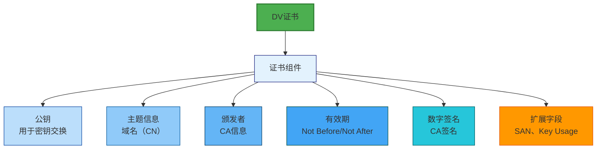
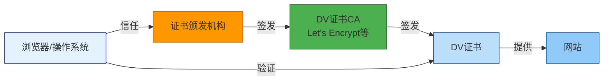
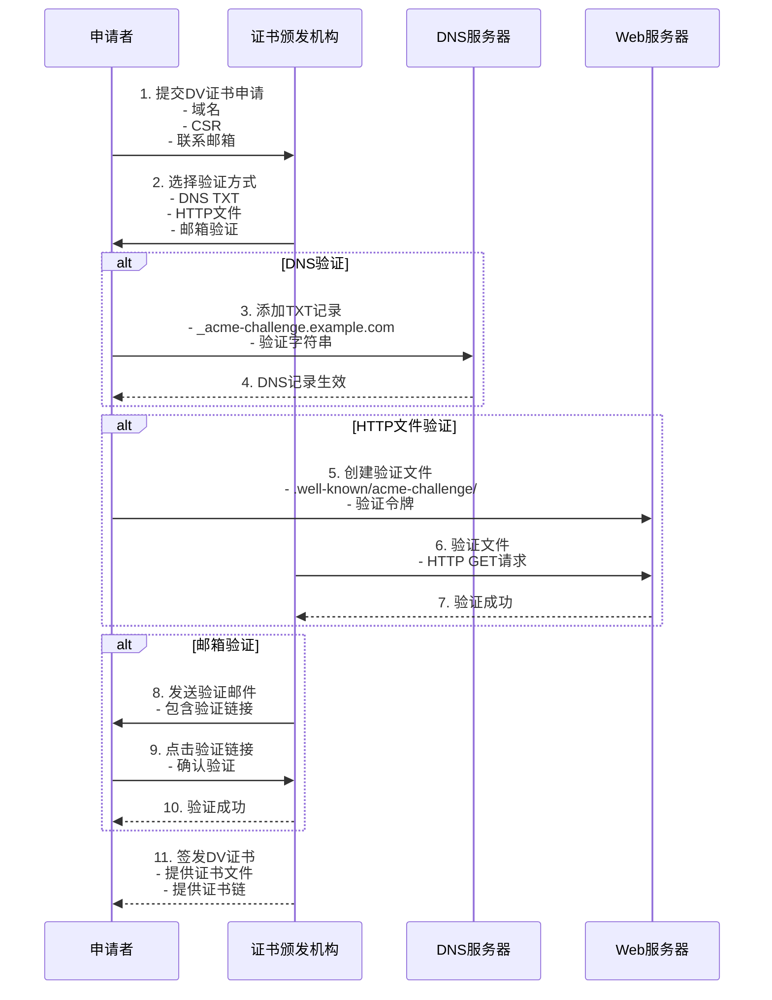
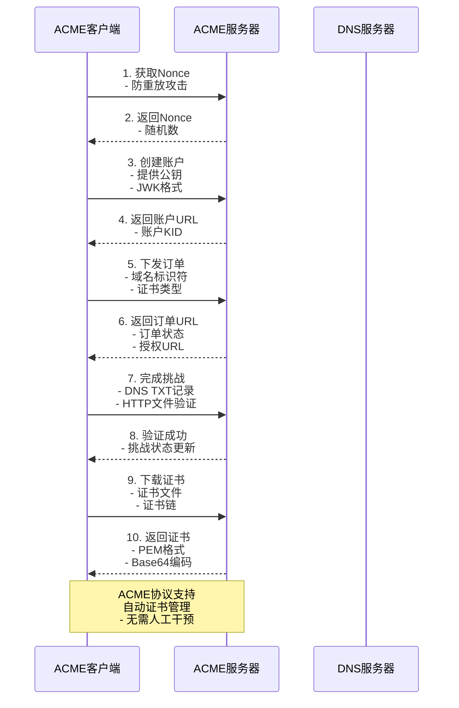
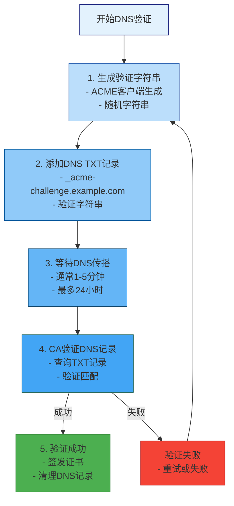
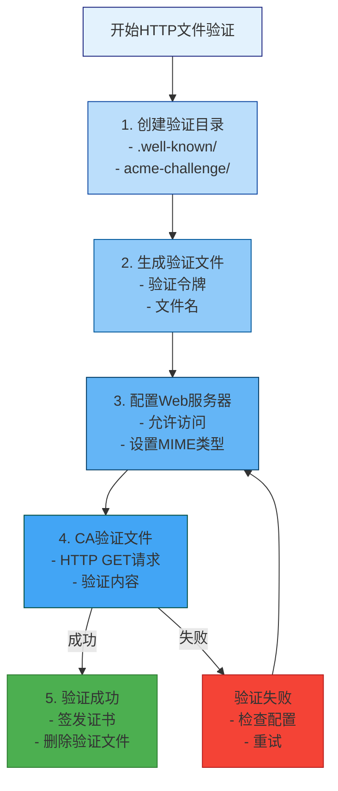
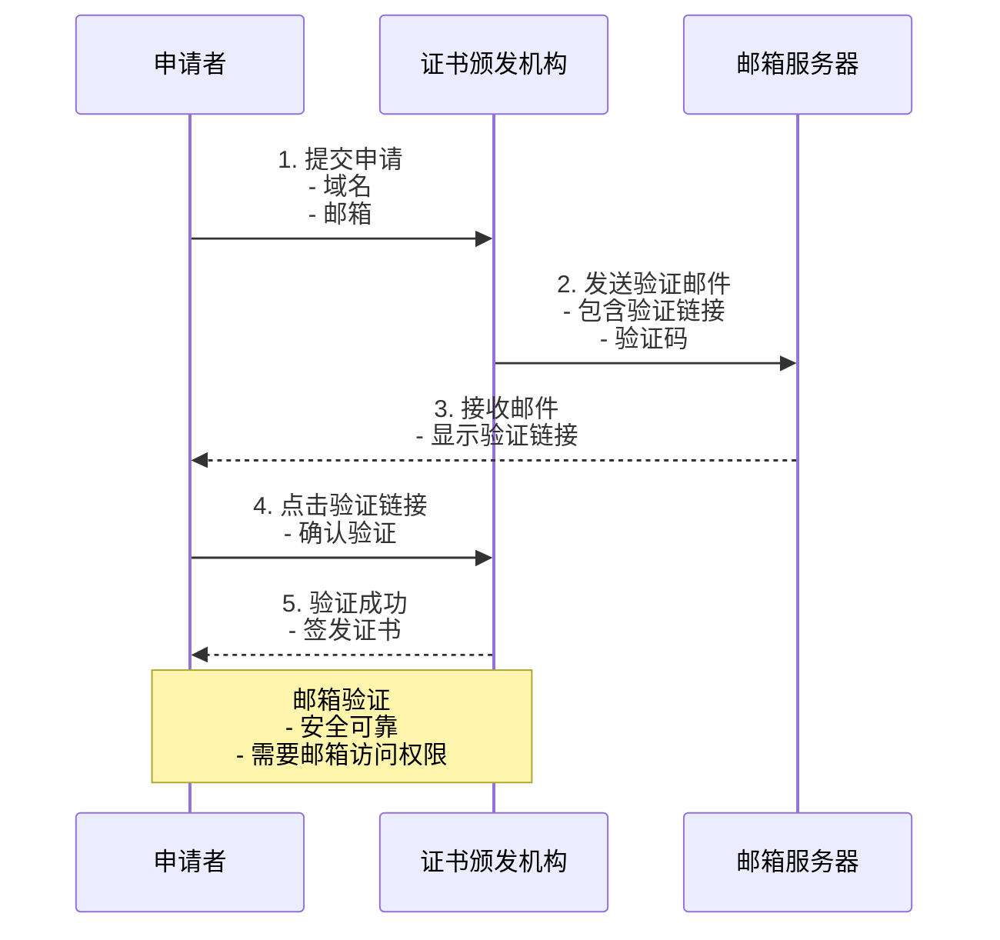
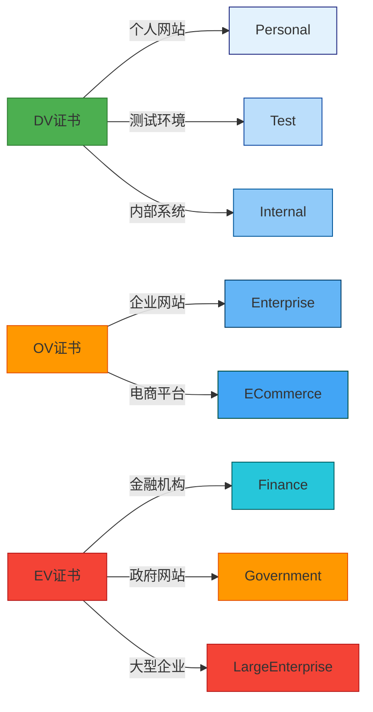
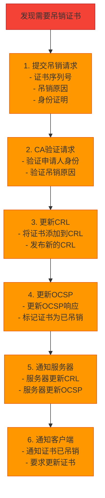

# 域名验证型（DV）证书技术文档

## 目录

1. [DV证书概述](#1-dv证书概述)
2. [DV证书工作原理](#2-dv证书工作原理)
3. [DV证书验证流程](#3-dv证书验证流程)
4. [DV证书与其他证书类型对比](#4-dv证书与其他证书类型对比)
5. [DV证书申请流程](#5-dv证书申请流程)
6. [主流CA的DV证书产品](#6-主流ca的dv证书产品)
7. [DV证书部署配置](#7-dv证书部署配置)
8. [DV证书生命周期管理](#8-dv证书生命周期管理)
9. [DV证书安全注意事项](#9-dv证书安全注意事项)
10. [常见问题与解决方案](#10-常见问题与解决方案)
11. [附录：配置示例与工具](#11-附录配置示例与工具)

---

## 1. DV证书概述

### 1.1 什么是DV证书

域名验证型（Domain Validated，简称DV）证书是SSL/TLS证书的一种类型，仅验证申请者对域名的所有权或控制权，而不验证组织的真实性。

**核心特点**：
- **验证级别**：基础级别
- **验证范围**：仅验证域名所有权
- **验证速度**：快速（几分钟到几小时）
- **成本**：低或免费
- **信任度**：基础信任
- **适用场景**：个人网站、测试环境、内部系统

### 1.2 DV证书的组成

DV证书包含以下核心信息：



### 1.3 DV证书的信任模型

DV证书依赖于CA的信任锚点，浏览器和操作系统默认信任主流CA颁发的DV证书。



---

## 2. DV证书工作原理

### 2.1 域名所有权验证

DV证书的核心是验证申请者对域名的所有权或控制权。CA不验证组织的真实性，只确认申请者能够控制该域名。

#### 2.1.1 验证方式对比

| 验证方式 | 说明 | 优点 | 缺点 | 适用场景 |
|----------|------|------|------|----------|
| **DNS TXT记录验证** | 在DNS中添加TXT记录 | 快速、简单 | 需要DNS管理权限 | 大多数场景 |
| **HTTP文件验证** | 在网站根目录放置验证文件 | 快速、简单 | 需要Web服务器 | 大多数场景 |
| **DNS CNAME验证** | 创建CNAME记录指向CA域名 | 快速 | 需要DNS管理权限 | 特定CA |
| **邮箱验证** | 向域名管理员邮箱发送验证邮件 | 安全 | 需要邮箱访问权限 | 特定场景 |

### 2.2 DV证书验证流程



### 2.3 ACME协议详解

自动证书管理环境（ACME）协议是DV证书自动化的核心技术。

#### 2.3.1 ACME协议流程



#### 2.3.2 ACME挑战类型

| 挑战类型 | 说明 | 验证方式 | 典型应用 |
|----------|------|----------|----------|
| **HTTP-01** | 在网站根目录放置验证文件 | HTTP GET | Let's Encrypt |
| **DNS-01** | 在DNS中添加TXT记录 | DNS TXT | Let's Encrypt |
| **DNS-02** | 创建CNAME记录指向CA域名 | DNS CNAME | DigiCert |
| **TLS-ALPN-01** | 使用TLS-ALPN协商验证 | TLS握手 | ZeroSSL |
| **HTTP-02** | 通过HTTP POST提供验证令牌 | HTTP POST | Buypass |

---

## 3. DV证书验证流程

### 3.1 DNS TXT记录验证详解

#### 3.1.1 验证流程



#### 3.1.2 添加DNS TXT记录

**使用命令行工具**：
```bash
# 使用nsupdate添加TXT记录
nsupdate -k _acme-challenge.example.com -v "验证字符串"

# 使用dig查询TXT记录
dig TXT _acme-challenge.example.com

# 使用nslookup查询TXT记录
nslookup -type=TXT _acme-challenge.example.com
```

**使用DNS管理界面**：
1. 登录DNS管理控制台
2. 选择域名
3. 添加TXT记录：
   - 主机记录：_acme-challenge
   - 记录类型：TXT
   - 记录值：验证字符串
4. 保存配置
5. 等待DNS传播

### 3.2 HTTP文件验证详解

#### 3.2.1 验证流程



#### 3.2.2 Web服务器配置

**Nginx配置**：
```nginx
server {
    listen 80;
    server_name www.example.com;

    # ACME验证配置
    location /.well-known/acme-challenge/ {
        root /var/www/html;
        try_files $uri =404;
        add_header Content-Type text/plain;
    }

    location / {
        root /var/www/html;
        index index.html;
    }
}
```

**Apache配置**：
```apache
<VirtualHost *:80>
    ServerName www.example.com

    # ACME验证配置
    <Directory "/var/www/html/.well-known/acme-challenge/">
        Require all granted
        Order allow,deny
        Allow from all
    </Directory>

    DocumentRoot /var/www/html
</VirtualHost>
```

### 3.3 邮箱验证详解

#### 3.3.1 验证流程



#### 3.3.2 邮箱验证注意事项

**安全考虑**：
- 确保邮箱地址与域名关联
- 使用域名管理员邮箱（admin@、postmaster@、webmaster@）
- 避免使用免费邮箱服务
- 定期检查邮箱安全设置

**技术要求**：
- 邮箱服务器必须支持邮件接收
- 邮箱服务器必须支持HTML邮件
- 邮箱服务器必须有足够的接收容量
- 邮箱服务器必须有反垃圾邮件配置

---

## 4. DV证书与其他证书类型对比

### 4.1 验证级别对比

| 特性 | DV | OV | EV |
|------|----|----|----|
| **验证级别** | 域名验证 | 组织验证 | 扩展验证 |
| **验证内容** | 域名所有权 | 组织真实性 + 域名所有权 | 组织真实性 + 域名所有权 + 运营审查 |
| **验证时间** | 分钟-小时 | 1-3天 | 3-7天 |
| **验证方式** | 自动化 | 人工审核 | 严格人工审核 |
| **成本** | 免费/低 | 中等 | 高 |
| **信任度** | 基础 | 较高 | 最高 |
| **浏览器显示** | 锁图标 | 锁图标 + 组织名称 | 锁图标 + 组织名称 + 绿色 |
| **适用场景** | 个人网站、测试环境 | 企业网站 | 金融机构、大型企业 |

### 4.2 适用场景对比



### 4.3 DV证书的局限性

#### 4.3.1 技术局限性

| 局限性 | 说明 | 影响 |
|--------|------|------|
| **信任度有限** | 仅验证域名所有权 | 不适合高安全要求场景 |
| **无组织信息** | 不显示组织名称 | 用户无法验证组织真实性 |
| **容易被滥用** | 验证简单，容易被恶意网站使用 | 影响整体网络生态 |
| **不适合金融** | 金融行业通常需要EV证书 | 无法满足合规要求 |

#### 4.3.2 业务局限性

| 局限性 | 说明 | 影响 |
|--------|------|------|
| **用户信任度低** | 用户无法确认网站所属组织 | 转化率可能较低 |
| **品牌价值有限** | 无法展示组织品牌信息 | 品牌建设受限 |
| **不适合企业** | 企业级应用需要更高信任度 | 无法满足业务需求 |

---

## 5. DV证书申请流程

### 5.1 Let's Encrypt DV证书申请

#### 5.1.1 使用Certbot申请

**安装Certbot**：
```bash
# Ubuntu/Debian
sudo apt-get update
sudo apt-get install certbot python3-certbot-nginx

# CentOS/RHEL
sudo yum install epel-release
sudo yum install certbot python3-certbot-nginx
```

**申请单域名证书**：
```bash
# 使用HTTP-01验证方式
sudo certbot certonly --webroot -w /var/www/html -d www.example.com

# 使用DNS-01验证方式
sudo certbot certonly --dns-cloudflare --dns-cloudflare-credentials ~/.secrets/certbot-cloudflare.ini -d www.example.com

# 使用独立验证方式
sudo certbot certonly --manual -d www.example.com
```

**申请通配符证书**：
```bash
# 申请通配符证书
sudo certbot certonly --webroot -w /var/www/html -d "*.example.com" -d example.com
```

#### 5.1.2 Certbot自动续期

**配置自动续期**：
```bash
# 测试续期
sudo certbot renew --dry-run

# 手动续期
sudo certbot renew --force

# 续期后重载服务
sudo certbot renew --post-hook "systemctl reload nginx"
```

**配置Cron自动续期**：
```bash
# 编辑crontab
sudo crontab -e

# 添加以下行（每天凌晨2点检查续期）
0 2 * * * certbot renew --quiet --post-hook "systemctl reload nginx"
```

### 5.2 商业CA DV证书申请

#### 5.2.1 DigiCert DV证书申请

**申请流程**：
1. 注册DigiCert账户
2. 选择证书类型（DV）
3. 生成CSR或使用ACME
4. 提交申请
5. 完成域名验证
6. 下载证书

**使用ACME协议申请**：
```bash
# 使用acme.sh工具
# https://github.com/acmesh/acme.sh

# 申请证书
acme.sh --issue example.com --dns dns_cf --key-file account.key --cert-file account.crt

# 验证证书
openssl x509 -in account.crt -noout -text
```

#### 5.2.2 ZeroSSL DV证书申请

**申请流程**：
1. 注册ZeroSSL账户
2. 添加域名
3. 选择验证方式（DNS、HTTP、CNAME）
4. 完成验证
5. 下载证书

**使用ZeroSSL CLI**：
```bash
# 安装ZeroSSL CLI
curl https://get.zerossl.com - zerossl

# 注册账户
zerossl register

# 添加域名
zerossl add www.example.com

# 申请证书
zerossl cert create www.example.com --dns 1 --validation-methods dns-01

# 下载证书
zerossl download www.example.com
```

### 5.3 DV证书申请最佳实践

#### 5.3.1 申请前准备

**域名准备**：
- [ ] 确保域名DNS解析正常
- [ ] 确保域名WHOIS信息准确
- [ ] 准备域名管理员邮箱
- [ ] 确认域名未过期

**服务器准备**：
- [ ] 确保Web服务器正常运行
- [ ] 配置正确的防火墙规则
- [ ] 确保端口80和443可访问
- [ ] 准备网站根目录

**技术准备**：
- [ ] 安装必要的依赖（certbot、acme.sh等）
- [ ] 配置正确的DNS解析
- [ ] 准备备份现有证书

#### 5.3.2 申请过程监控

**监控要点**：
- 实时监控申请状态
- 记录所有验证步骤
- 及时响应CA的验证请求
- 保存所有通信记录

**日志记录**：
```bash
# Certbot日志位置
/var/log/letsencrypt/letsencrypt.log

# 查看日志
sudo tail -f /var/log/letsencrypt/letsencrypt.log

# 查看证书信息
sudo certbot certificates
```

---

## 6. 主流CA的DV证书产品

### 6.1 Let's Encrypt

#### 6.1.1 产品特性

| 特性 | 说明 |
|------|------|
| **证书类型** | DV |
| **有效期** | 90天 |
| **价格** | 免费 |
| **验证方式** | ACME协议（HTTP-01、DNS-01、TLS-ALPN-01） |
| **支持域名** | 单域名、通配符 |
| **支持SAN** | 是 |
| **证书链** | 提供完整证书链 |
| **自动续期** | 支持（推荐30天） |
| **速率限制** | 每个域名每周5个证书（50个证书/周） |
| **浏览器信任** | 所有主流浏览器 |
| **OCSP Stapling** | 支持 |

#### 6.1.2 使用示例

**申请证书**：
```bash
# 使用Nginx插件
sudo certbot --nginx -d www.example.com

# 使用Apache插件
sudo certbot --apache -d www.example.com

# 使用独立验证
sudo certbot certonly --standalone -d www.example.com
```

**查看证书**：
```bash
# 列出所有证书
sudo certbot certificates

# 查看特定证书
sudo certbot certificates -d www.example.com

# 删除证书
sudo certbot delete --cert-name www.example.com
```

### 6.2 ZeroSSL

#### 6.2.1 产品特性

| 特性 | 说明 |
|------|------|
| **证书类型** | DV |
| **有效期** | 90天 |
| **价格** | 免费（90天）<br/>付费（1年：$49.90） |
| **验证方式** | ACME协议（DNS、HTTP、CNAME、Email） |
| **支持域名** | 单域名、通配符、多域名 |
| **支持SAN** | 是 |
| **证书链** | 提供完整证书链 |
| **自动续期** | 支持 |
| **速率限制** | 免费账户：50个证书/30天<br/>付费账户：无限制 |
| **浏览器信任** | 所有主流浏览器 |
| **ECDSA支持** | 支持（P-256、P-384） |

#### 6.2.2 使用示例

**申请证书**：
```bash
# 注册账户
zerossl register

# 添加域名
zerossl add www.example.com

# 申请证书（DNS验证）
zerossl cert create www.example.com --dns 1 --validation-methods dns-01

# 申请证书（HTTP验证）
zerossl cert create www.example.com --dns 1 --validation-methods http-01

# 申请证书（CNAME验证）
zerossl cert create www.example.com --dns 1 --validation-methods dns-02
```

**管理证书**：
```bash
# 列出所有证书
zerossl list

# 查看证书详情
zerossl details www.example.com

# 撤销证书
zerossl revoke www.example.com

# 下载证书
zerossl download www.example.com
```

### 6.3 其他主流CA

#### 6.3.1 CA对比表

| CA | DV证书价格 | 有效期 | 验证方式 | 特点 |
|----|------------|--------|----------|------|
| **Let's Encrypt** | 免费 | 90天 | ACME | 免费、自动化、广泛信任 |
| **ZeroSSL** | 免费（90天）<br/>付费（1年） | 90天 | ACME | 免费账户限制、ECDSA支持 |
| **DigiCert** | $199/年 | 1-2年 | ACME | 企业级支持、技术支持 |
| **Sectigo** | $49/年 | 1-2年 | ACME | 快速签发、多种验证方式 |
| **GlobalSign** | $199/年 | 1-2年 | ACME | 全球信任、快速签发 |
| **Namecheap** | $9.88/年 | 1年 | ACME | 便宜、快速签发 |
| **Cloudflare** | 免费 | 15年 | ACME | 快速、自动续期 |

---

## 7. DV证书部署配置

### 7.1 Nginx配置

#### 7.1.1 基本配置

```nginx
server {
    listen 443 ssl http2;
    server_name www.example.com;

    # 证书配置
    ssl_certificate /etc/letsencrypt/live/www.example.com/fullchain.pem;
    ssl_certificate_key /etc/letsencrypt/live/www.example.com/privkey.pem;

    # SSL协议和加密套件
    ssl_protocols TLSv1.2 TLSv1.3;
    ssl_ciphers 'ECDHE-ECDSA-AES128-GCM-SHA256:ECDHE-RSA-AES128-GCM-SHA256';
    ssl_prefer_server_ciphers off;

    # SSL会话配置
    ssl_session_cache shared:SSL:10m;
    ssl_session_timeout 10m;
    ssl_session_tickets off;

    # OCSP Stapling
    ssl_stapling on;
    ssl_stapling_verify on;
    ssl_trusted_certificate /etc/letsencrypt/live/www.example.com/chain.pem;
    resolver 8.8.8.8 8.8.4.4 valid=300s;
    resolver_timeout 5s;

    # 安全头
    add_header Strict-Transport-Security "max-age=31536000; includeSubDomains" always;
    add_header X-Frame-Options "SAMEORIGIN" always;
    add_header X-Content-Type-Options "nosniff" always;
    add_header X-XSS-Protection "1; mode=block" always;

    # 日志配置
    access_log /var/log/nginx/access.log;
    error_log /var/log/nginx/error.log;

    # 网站根目录
    root /var/www/html;
    index index.html;

    # HTTP重定向到HTTPS
    error_page 497 https://$host$request_uri;
}

# HTTP服务器配置（用于ACME验证）
server {
    listen 80;
    server_name www.example.com;

    # ACME验证配置
    location /.well-known/acme-challenge/ {
        root /var/www/html;
        try_files $uri =404;
        add_header Content-Type text/plain;
    }

    location / {
        return 301 https://$host$request_uri;
    }
}
```

#### 7.1.2 多域名配置

```nginx
server {
    listen 443 ssl http2;
    server_name www.example.com example.com;

    # 证书配置（使用SAN证书）
    ssl_certificate /etc/letsencrypt/live/example.com/fullchain.pem;
    ssl_certificate_key /etc/letsencrypt/live/example.com/privkey.pem;

    # 其他配置...
}
```

### 7.2 Apache配置

#### 7.2.1 基本配置

```apache
<VirtualHost *:443>
    ServerName www.example.com

    # 启用SSL
    SSLEngine on

    # 证书配置
    SSLCertificateFile /etc/letsencrypt/live/www.example.com/cert.pem
    SSLCertificateKeyFile /etc/letsencrypt/live/www.example.com/privkey.pem
    SSLCertificateChainFile /etc/letsencrypt/live/www.example.com/chain.pem

    # SSL协议和加密套件
    SSLProtocol all -SSLv2 -SSLv3 -TLSv1 -TLSv1.1
    SSLCipherSuite ECDHE-ECDSA-AES128-GCM-SHA256:ECDHE-RSA-AES128-GCM-SHA256
    SSLHonorCipherOrder off

    # SSL会话配置
    SSLSessionCache shmcb:/var/run/apache2/ssl_scache(512000)
    SSLSessionCacheTimeout 300
    SSLSessionTickets off

    # OCSP Stapling
    SSLUseStapling on
    SSLStaplingCache shmcb:/var/run/apache2/ocsp(128000)
    SSLStaplingResponderTimeout 5
    SSLStaplingReturnResponderErrors off

    # 安全头
    Header always set Strict-Transport-Security "max-age=31536000; includeSubDomains"
    Header always set X-Frame-Options "SAMEORIGIN"
    Header always set X-Content-Type-Options "nosniff"
    Header always set X-XSS-Protection "1; mode=block"

    # 日志配置
    ErrorLog ${APACHE_LOG_DIR}/error.log
    CustomLog ${APACHE_LOG_DIR}/access.log combined

    # 网站根目录
    DocumentRoot /var/www/html
    DirectoryIndex index.html

    # HTTP重定向到HTTPS
    RewriteEngine on
    RewriteCond %{HTTPS} off
    RewriteRule ^(.*)$ https://%{HTTP_HOST}%{REQUEST_URI} [L,R=301]
</VirtualHost>
```

#### 7.2.2 HTTP服务器配置（用于ACME验证）

```apache
<VirtualHost *:80>
    ServerName www.example.com

    # ACME验证配置
    DocumentRoot /var/www/html

    <Directory "/var/www/html/.well-known/acme-challenge/">
        Require all granted
        Order allow,deny
        Allow from all
    </Directory>

    # 其他配置...
</VirtualHost>
```

### 7.3 Python应用配置

#### 7.3.1 使用SSL上下文

```python
import ssl
import asyncio
from aiohttp import web

async def handle_request(request):
    """处理请求"""
    return web.Response(text="Hello, secure world!")

async def create_server():
    """创建TLS服务器"""
    # 加载证书
    ssl_context = ssl.create_default_context(ssl.Purpose.CLIENT_AUTH)
    ssl_context.load_cert_chain(
        certfile='/etc/letsencrypt/live/www.example.com/fullchain.pem',
        keyfile='/etc/letsencrypt/live/www.example.com/privkey.pem'
    )
    
    # 创建应用
    app = web.Application()
    app.router.add_get('/', handle_request)
    
    # 启动服务器
    runner = web.AppRunner(app)
    site = web.TCPSite(runner, ssl_context=ssl_context)
    
    await asyncio.get_event_loop().create_server(site)
    print("TLS服务器已启动在端口443")

if __name__ == '__main__':
    asyncio.run(create_server())
```

#### 7.3.2 使用requests库

```python
import requests
import ssl

# 加载证书
cert = (
    '/etc/letsencrypt/live/www.example.com/fullchain.pem',
    '/etc/letsencrypt/live/www.example.com/privkey.pem'
)

# 发送HTTPS请求
response = requests.get(
    'https://api.example.com/endpoint',
    cert=cert,
    verify=True
)

print(f"状态码: {response.status_code}")
print(f"响应: {response.text}")
```

---

## 8. DV证书生命周期管理

### 8.1 证书监控

#### 8.1.1 证书有效期监控

**监控脚本**：
```bash
#!/bin/bash
# dv-cert-monitor.sh

CERT_FILE="/etc/letsencrypt/live/www.example.com/fullchain.pem"
WARNING_DAYS=30
ALERT_EMAIL="admin@example.com"

# 检查证书有效期
check_expiry() {
    local expiry_date=$(openssl x509 -in "$CERT_FILE" -noout -enddate | cut -d= -f2)
    local expiry_timestamp=$(date -d "$expiry_date" +%s)
    local current_timestamp=$(date +%s)
    local days_left=$(( (expiry_timestamp - current_timestamp) / 86400 ))
    
    echo "证书过期时间: $expiry_date"
    echo "剩余天数: $days_left"
    
    if [ $days_left -lt $WARNING_DAYS ]; then
        echo "警告: 证书将在 $days_left 天内过期!"
        # 发送告警邮件
        echo "证书即将过期" | mail -s "证书告警" -a "From: cert-monitor@example.com" "$ALERT_EMAIL"
        return 1
    fi
    
    return 0
}

# 主函数
check_expiry
```

**Python监控脚本**：
```python
#!/usr/bin/env python3
# dv-cert-monitor.py

import ssl
import socket
from datetime import datetime, timedelta
import smtplib
from email.mime.text import MIMEText
from email.mime.multipart import MIMEMultipart

def check_cert_expiry(hostname, port=443, warning_days=30):
    """检查证书过期时间"""
    try:
        context = ssl.create_default_context()
        with socket.create_connection((hostname, port), timeout=10) as sock:
            with context.wrap_socket(sock, server_hostname=hostname) as ssock:
                cert = ssock.getpeercert(binary_form=True)
                x509 = ssl._ssl._test_decode_cert(cert)
                
                # 获取过期时间
                not_after = datetime.strptime(
                    x509['notAfter'],
                    '%b %d %b %Y %H:%M:%S %Z'
                )
                days_left = (not_after - datetime.utcnow()).days
                
                return {
                    'hostname': hostname,
                    'not_after': not_after,
                    'days_left': days_left,
                    'status': 'valid' if days_left > 0 else 'expired'
                }
    except Exception as e:
        return {
            'hostname': hostname,
            'error': str(e),
            'status': 'error'
        }

def send_alert(email_to, subject, body):
    """发送告警邮件"""
    msg = MIMEMultipart()
    msg['From'] = 'cert-monitor@example.com'
    msg['To'] = email_to
    msg['Subject'] = subject
    
    body_part = MIMEText(body, 'plain')
    msg.attach(body_part)
    
    with smtplib.SMTP('smtp.example.com', 587) as server:
        server.starttls()
        server.login('user', 'password')
        server.send_message(msg)
        server.quit()

def main():
    """主函数"""
    hostname = 'www.example.com'
    result = check_cert_expiry(hostname)
    
    print(f"主机名: {result.get('hostname')}")
    print(f"状态: {result.get('status')}")
    
    if 'not_after' in result:
        print(f"过期时间: {result['not_after']}")
    
    if 'days_left' in result:
        print(f"剩余天数: {result['days_left']}")
        
        if result['days_left'] < 30:
            subject = f"证书即将过期: {hostname}"
            body = f"主机 {hostname} 的DV证书将在 {result['days_left']} 天后过期。\n\n过期时间: {result.get('not_after')}"
            send_alert('admin@example.com', subject, body)

if __name__ == '__main__':
    main()
```

### 8.2 证书自动续期

#### 8.2.1 Certbot自动续期

**配置Cron自动续期**：
```bash
# 编辑crontab
sudo crontab -e

# 添加以下行（每天凌晨2点检查续期）
0 2 * * * certbot renew --quiet --post-hook "systemctl reload nginx"

# 每周日凌晨3点续期
0 3 * * 0 certbot renew --quiet --post-hook "systemctl reload nginx"
```

**配置systemd定时器**：
```bash
# 创建systemd服务
sudo tee /etc/systemd/system/certbot-renew.service <<EOF
[Unit]
Description=Certbot Renewal
After=network-online.target

[Service]
Type=oneshot
ExecStart=/usr/bin/certbot renew --quiet --post-hook "systemctl reload nginx"

[Install]
WantedBy=multi-user.target
EOF

# 创建systemd定时器
sudo tee /etc/systemd/system/certbot-renew.timer <<EOF
[Unit]
Description=Certbot Renewal Timer

[Timer]
OnCalendar=daily
Persistent=true

[Install]
WantedBy=timers.target
EOF

# 启用并启动定时器
sudo systemctl enable certbot-renew.timer
sudo systemctl start certbot-renew.timer
```

### 8.3 证书吊销

#### 8.3.1 证书吊销流程



#### 8.3.2 使用Certbot吊销证书

```bash
# 列出所有证书
sudo certbot certificates

# 吊销特定证书
sudo certbot revoke --cert-path /etc/letsencrypt/live/www.example.com/cert.pem --reason keycompromise

# 吊销原因选项
# --reason keycompromise: 密钥泄露
# --reason cessationOfOperation: 停止运营
# --reason superseded: 被替代
# --reason affiliationChanged: 关系变更

# 删除证书
sudo certbot delete --cert-name www.example.com
```

---

## 9. DV证书安全注意事项

### 9.1 安全最佳实践

#### 9.1.1 证书选择建议

| 安全建议 | 说明 |
|----------|------|
| **优先使用TLS 1.3** | 提供更好的安全性和性能 |
| **选择强加密套件** | 使用ECDHE和AES-GCM |
| **启用HSTS** | 强制HTTPS连接 |
| **启用OCSP Stapling** | 减少OCSP查询延迟 |
| **配置证书链** | 提供完整的中间证书链 |
| **定期更新证书** | 使用自动化工具续期 |
| **监控证书状态** | 及时发现过期或吊销 |

#### 9.1.2 部署安全建议

| 安全建议 | 说明 |
|----------|------|
| **保护私钥** | 设置文件权限600 |
| **使用强密码** | 私钥密码至少16字符 |
| **备份证书** | 定期备份证书和私钥 |
| **限制访问** | 仅授权人员可访问证书文件 |
| **使用安全传输** | 使用SFTP或SCP传输证书 |
| **验证证书** | 安装前验证证书指纹 |

### 9.2 常见安全风险

#### 9.2.1 DNS劫持风险

**风险描述**：
攻击者可能劫持DNS解析，将用户重定向到恶意网站。

**防护措施**：
```bash
# 使用DNSSEC保护域名
# 需要在域名注册商处配置

# 定期检查DNS解析
dig www.example.com

# 使用DNSSEC验证工具
# https://dnsviz.net/
```

#### 9.2.2 中间人攻击风险

**风险描述**：
攻击者可能拦截或修改验证通信。

**防护措施**：
- 使用Let's Encrypt等支持DNS-01验证的CA
- 确保验证通信使用HTTPS
- 验证CA的DNS记录

#### 9.2.3 证书滥用风险

**风险描述**：
恶意网站可能滥用DV证书进行钓鱼攻击。

**防护措施**：
- 定期监控证书使用情况
- 在证书中包含正确的域名信息
- 使用证书透明度日志（CT）
- 及时吊销泄露的证书

### 9.3 合规要求

#### 9.3.1 PCI DSS要求

| 要求 | 说明 | DV证书适用性 |
|------|------|----------------|
| **加密传输** | 使用TLS 1.2或更高 | ✅ 适用 |
| **强加密套件** | 禁用弱加密算法 | ✅ 适用 |
| **证书管理** | 定期更新证书 | ✅ 适用 |
| **安全监控** | 监控证书状态 | ✅ 适用 |
| **漏洞扫描** | 定期进行安全扫描 | ✅ 适用 |

#### 9.3.2 GDPR要求

| 要求 | 说明 | DV证书适用性 |
|------|------|----------------|
| **数据保护** | 使用TLS加密传输 | ✅ 适用 |
| **数据完整性** | 防止数据篡改 | ✅ 适用 |
| **访问控制** | 实施访问控制 | ✅ 适用 |
| **数据可审计性** | 记录访问日志 | ✅ 适用 |

---

## 10. 常见问题与解决方案

### 10.1 证书申请问题

#### 10.1.1 DNS验证失败

**问题现象**：
```
Failed authorization procedure: dns-01: urn:acme:error:invalid_dns
```

**可能原因**：
1. DNS记录未正确配置
2. DNS记录未传播
3. DNS记录格式错误
4. DNS服务器故障

**解决方案**：
```bash
# 1. 检查DNS记录
dig TXT _acme-challenge.www.example.com

# 2. 使用DNS查询工具
nslookup -type=TXT _acme-challenge.www.example.com

# 3. 检查DNS传播
for i in {1..10}; do
    dig TXT _acme-challenge.www.example.com +short
    sleep 10
done

# 4. 使用在线DNS查询工具
# https://www.whatsmydns.net/
# https://dnschecker.org/
```

#### 10.1.2 HTTP验证失败

**问题现象**：
```
Failed authorization procedure: http-01: urn:acme:error:connection refused
```

**可能原因**：
1. Web服务器未运行
2. 防火墙阻止80端口
3. 验证文件路径错误
4. 文件权限问题

**解决方案**：
```bash
# 1. 检查Web服务器状态
sudo systemctl status nginx

# 2. 检查防火墙规则
sudo iptables -L -n | grep :80
sudo ufw status

# 3. 检查验证文件
ls -la /var/www/html/.well-known/acme-challenge/

# 4. 检查文件权限
chmod 755 /var/www/html/.well-known/acme-challenge/

# 5. 测试访问
curl http://www.example.com/.well-known/acme-challenge/test
```

#### 10.1.3 速率限制

**问题现象**：
```
Error creating new cert :: too many certificates already issued for: www.example.com
```

**可能原因**：
1. 超过Let's Encrypt速率限制
2. 短时间内多次申请
3. 重复申请失败证书

**解决方案**：
```bash
# 1. 查看证书信息
sudo certbot certificates

# 2. 等待速率限制重置
# Let's Encrypt: 每7天重置一次

# 3. 使用不同的CA申请
# ZeroSSL、DigiCert等

# 4. 合并多个域名到一个证书
# 使用SAN证书或通配符证书
```

### 10.2 证书部署问题

#### 10.2.1 证书链不完整

**问题现象**：
```
SSL: error:0B080074:x509 certificate routines:X509_check_private_key:unable to get local issuer certificate
```

**可能原因**：
1. 中间证书缺失
2. 证书链顺序错误
3. CA证书未配置

**解决方案**：
```bash
# 1. 检查证书链
openssl s_client -connect www.example.com:443 -showcerts

# 2. 查看Let's Encrypt证书路径
ls -la /etc/letsencrypt/live/www.example.com/

# 3. 配置完整的证书链
# Nginx: ssl_trusted_certificate
# Apache: SSLCertificateChainFile

# 4. 验证证书链
openssl verify -CAfile /etc/letsencrypt/live/www.example.com/chain.pem /etc/letsencrypt/live/www.example.com/cert.pem
```

#### 10.2.2 证书权限错误

**问题现象**：
```
nginx: [emerg] cannot load certificate "/etc/letsencrypt/live/www.example.com/privkey.pem": BIO_new_file:/data/...:bad permissions
```

**可能原因**：
1. 私钥文件权限不正确
2. 文件所有者错误
3. SELinux/AppArmor阻止

**解决方案**：
```bash
# 1. 检查文件权限
ls -la /etc/letsencrypt/live/www.example.com/privkey.pem

# 2. 设置正确的权限
sudo chmod 600 /etc/letsencrypt/live/www.example.com/privkey.pem
sudo chmod 644 /etc/letsencrypt/live/www.example.com/fullchain.pem

# 3. 检查文件所有者
sudo chown root:root /etc/letsencrypt/live/www.example.com/

# 4. 检查SELinux上下文
ls -Z /etc/letsencrypt/live/www.example.com/privkey.pem

# 5. 临时禁用SELinux（不推荐）
sudo setenforce 0
```

#### 10.2.3 证书过期

**问题现象**：
```
SSL: error:0B080074:x509 certificate routines:X509_check_private_key:certificate has expired
```

**可能原因**：
1. 证书自然过期
2. 自动续期失败
3. 系统时间不正确

**解决方案**：
```bash
# 1. 检查证书有效期
openssl x509 -in /etc/letsencrypt/live/www.example.com/cert.pem -noout -dates

# 2. 手动续期证书
sudo certbot renew --force

# 3. 检查系统时间
date

# 4. 同步系统时间
sudo ntpdate pool.ntp.org

# 5. 检查自动续期配置
sudo systemctl status certbot-renew.timer
```

### 10.3 性能问题

#### 10.3.1 TLS握手慢

**问题现象**：
- TLS握手时间超过1秒
- 应用启动延迟高
- 用户体验差

**可能原因**：
1. 证书链过长
2. OCSP查询慢
3. 服务器性能问题
4. 网络延迟高

**解决方案**：
```nginx
# 1. 优化证书链
# 使用更短的证书链

# 2. 启用OCSP Stapling
ssl_stapling on;
ssl_stapling_verify on;
ssl_trusted_certificate /etc/letsencrypt/live/www.example.com/chain.pem;
resolver 8.8.8.8 8.8.4.4 valid=300s;
resolver_timeout 5s;

# 3. 优化SSL会话
ssl_session_cache shared:SSL:10m;
ssl_session_timeout 10m;

# 4. 使用TLS 1.3
ssl_protocols TLSv1.2 TLSv1.3;

# 5. 优化加密套件
ssl_ciphers 'ECDHE-ECDSA-AES128-GCM-SHA256:ECDHE-RSA-AES128-GCM-SHA256';
ssl_prefer_server_ciphers off;
```

#### 10.3.2 证书验证失败率高

**问题现象**：
- 大量证书验证失败
- 客户端连接被拒绝
- 用户体验差

**可能原因**：
1. CRL更新不及时
2. OCSP服务不可用
3. 证书配置错误
4. 客户端缓存问题

**解决方案**：
```nginx
# 1. 配置OCSP Stapling
ssl_stapling on;
ssl_stapling_verify on;
ssl_trusted_certificate /etc/letsencrypt/live/www.example.com/chain.pem;

# 2. 配置多个OCSP服务器
# 使用resolver指令配置多个DNS服务器

# 3. 优化SSL会话
ssl_session_cache shared:SSL:10m;
ssl_session_timeout 10m;

# 4. 监控OCSP服务状态
# 使用监控工具检查OCSP服务可用性
```

---

## 11. 附录：配置示例与工具

### 11.1 完整的Nginx DV证书配置

```nginx
user nginx;
worker_processes auto;
error_log /var/log/nginx/error.log warn;
pid /var/run/nginx.pid;

events {
    worker_connections 1024;
}

http {
    include /etc/nginx/mime.types;
    default_type application/octet-stream;

    log_format main '$remote_addr - $remote_user [$time_local] "$request" '
                    '$status $body_bytes_sent "$http_referer" '
                    '"$http_user_agent" "$http_x_forwarded_for"';

    access_log /var/log/nginx/access.log main;

    sendfile on;
    tcp_nopush on;
    tcp_nodelay on;
    keepalive_timeout 65;
    types_hash_max_size 2048;
    client_max_body_size 20m;

    # SSL配置
    ssl_session_cache shared:SSL:10m;
    ssl_session_timeout 10m;
    ssl_protocols TLSv1.2 TLSv1.3;
    ssl_ciphers 'ECDHE-ECDSA-AES128-GCM-SHA256:ECDHE-RSA-AES128-GCM-SHA256';
    ssl_prefer_server_ciphers off;

    # DV证书配置
    ssl_certificate /etc/letsencrypt/live/www.example.com/fullchain.pem;
    ssl_certificate_key /etc/letsencrypt/live/www.example.com/privkey.pem;

    # OCSP Stapling
    ssl_stapling on;
    ssl_stapling_verify on;
    ssl_trusted_certificate /etc/letsencrypt/live/www.example.com/chain.pem;
    resolver 8.8.8.8 8.8.4.4 valid=300s;
    resolver_timeout 5s;

    # 安全头
    add_header Strict-Transport-Security "max-age=31536000; includeSubDomains; preload" always;
    add_header X-Frame-Options "SAMEORIGIN" always;
    add_header X-Content-Type-Options "nosniff" always;
    add_header X-XSS-Protection "1; mode=block" always;

    # HTTP服务器（用于ACME验证）
    server {
        listen 80;
        server_name www.example.com;

        # ACME验证配置
        location /.well-known/acme-challenge/ {
            root /var/www/html;
            try_files $uri =404;
            add_header Content-Type text/plain;
        }

        location / {
            return 301 https://$host$request_uri;
        }
    }

    # HTTPS服务器
    server {
        listen 443 ssl http2;
        server_name www.example.com;

        root /var/www/html;
        index index.html;

        # 健康检查
        location /health {
            access_log off;
            return 200 "healthy\n";
            add_header Content-Type text/plain;
        }
    }
}
```

### 11.2 Certbot配置示例

#### 11.2.1 基本配置

```ini
# /etc/letsencrypt/cli.ini

# 服务器配置
server = https://acme-v02.api.letsencrypt.org/directory

# 电子邮件配置
email = admin@example.com

# 同意服务条款
agree-tos = True

# 证书配置
cert-name = www.example.com
key-type = ecdsa
key-size = 256

# Web根目录
webroot-path = /var/www/html

# 验证方式
preferred-challenges = http-01

# 自动续期
deploy-hook = systemctl reload nginx
```

#### 11.2.2 通配符证书配置

```bash
# 申请通配符证书
sudo certbot certonly --webroot -w /var/www/html \
    -d "*.example.com" \
    -d example.com \
    --key-type ecdsa \
    --key-size 256

# 查看通配符证书
sudo certbot certificates
```

### 11.3 证书管理脚本

#### 11.3.1 DV证书管理脚本

```bash
#!/bin/bash
# dv-cert-manager.sh

set -euo pipefail

# 配置
CERT_DIR="/etc/letsencrypt/live"
BACKUP_DIR="/var/backups/letsencrypt"
WARNING_DAYS=30
ALERT_EMAIL="admin@example.com"

# 颜色定义
RED='\033[0;31m'
GREEN='\033[0;32m'
YELLOW='\033[1;33m'
NC='\033[0m'

# 日志函数
log_info() {
    echo -e "${GREEN}[INFO]${NC} $1"
}

log_warn() {
    echo -e "${YELLOW}[WARN]${NC} $1"
}

log_error() {
    echo -e "${RED}[ERROR]${NC} $1"
}

# 检查证书有效期
check_cert_expiry() {
    local cert_path="$1"
    
    if [ ! -f "$cert_path" ]; then
        log_error "证书文件不存在: $cert_path"
        return 1
    fi
    
    # 获取过期时间
    local expiry_date=$(openssl x509 -in "$cert_path/fullchain.pem" -noout -enddate | cut -d= -f2)
    local expiry_timestamp=$(date -d "$expiry_date" +%s)
    local current_timestamp=$(date +%s)
    local days_left=$(( (expiry_timestamp - current_timestamp) / 86400 ))
    
    log_info "证书过期时间: $expiry_date"
    log_info "剩余天数: $days_left"
    
    if [ $days_left -lt $WARNING_DAYS ]; then
        log_warn "警告: 证书将在 $days_left 天内过期!"
        
        # 发送告警邮件
        local subject="DV证书即将过期: $(basename $cert_path)"
        local body="证书 $(basename $cert_path) 将在 $days_left 天后过期。\n\n过期时间: $expiry_date"
        
        echo "$body" | mail -s "DV证书告警" -a "From: cert-manager@example.com" "$ALERT_EMAIL"
        return 1
    fi
    
    return 0
}

# 备份证书
backup_cert() {
    local cert_path="$1"
    local timestamp=$(date +%Y%m%d_%H%M%S)
    local backup_dir="$BACKUP_DIR/$(basename $cert_path)_$timestamp"
    
    mkdir -p "$backup_dir"
    
    log_info "备份证书到: $backup_dir"
    cp -r "$cert_path" "$backup_dir/"
    
    log_info "备份完成"
}

# 续期证书
renew_cert() {
    local cert_name="$1"
    
    log_info "续期证书: $cert_name"
    
    # 使用Certbot续期
    certbot renew --cert-name "$cert_name" --force
    
    # 重载服务
    log_info "重载Nginx服务"
    systemctl reload nginx
    
    log_info "证书续期完成"
}

# 列出所有证书
list_certs() {
    log_info "Let's Encrypt证书列表:"
    certbot certificates
}

# 主函数
main() {
    case "${1:-help}" in
        check)
            check_cert_expiry "/etc/letsencrypt/live/www.example.com"
            ;;
        backup)
            backup_cert "/etc/letsencrypt/live/www.example.com"
            ;;
        renew)
            renew_cert "www.example.com"
            ;;
        list)
            list_certs
            ;;
        help|*)
            echo "用法: $0 {check|backup|renew|list|help}"
            echo ""
            echo "命令:"
            echo "  check    - 检查证书有效期"
            echo "  backup   - 备份当前证书"
            echo "  renew   - 续期证书"
            echo "  list     - 列出所有证书"
            echo "  help     - 显示帮助信息"
            ;;
    esac
}

# 执行主函数
main "$@"
```

### 11.4 在线工具与资源

#### 11.4.1 SSL/TLS工具

| 工具 | URL | 用途 |
|------|-----|------|
| **SSL Labs SSL Test** | https://www.ssllabs.com/ssltest/ | SSL配置评估 |
| **Mozilla SSL Config Generator** | https://ssl-config.mozilla.org/ | SSL配置生成 |
| **SSL Decoder** | https://www.sslshopper.com/ssl-decoder.html | 证书解码 |
| **CryptoReport** | https://cryptoreport.websecurity.symantec.com/ | 证书报告 |
| **Keycloak Documentation** | https://www.keycloak.org/documentation/ | 身份认证 |

#### 11.4.2 DNS工具

| 工具 | URL | 用途 |
|------|-----|------|
| **dig** | https://www.isc.org/tools/dig/ | DNS查询 |
| **nslookup** | 内置工具 | DNS查询 |
| **DNSViz** | https://dnsviz.net/ | DNS可视化 |
| **WhatsMyDNS** | https://www.whatsmydns.net/ | DNS查询 |

#### 11.4.3 ACME客户端工具

| 工具 | URL | 用途 |
|------|-----|------|
| **Certbot** | https://certbot.eff.org/ | Let's Encrypt官方客户端 |
| **acme.sh** | https://github.com/acmesh/acme.sh | 通用ACME客户端 |
| **lego** | https://github.com/go-acme/lego | Let's Encrypt客户端 |
| **dehydrated** | https://github.com/dehydrated-dehydrated | Let's Encrypt客户端 |

---

## 参考资源

### 官方文档

- [RFC 8555 - Automatic Certificate Management Environment (ACME)](https://tools.ietf.org/html/rfc8555)
- [RFC 8838 - Domain Validation Certificates (DV)](https://tools.ietf.org/html/rfc8838)
- [CA/Browser Forum Baseline Requirements](https://cabforum.org/baseline-requirements-documents/)
- [Let's Encrypt Documentation](https://letsencrypt.org/docs/)

### 工具文档

- [Certbot Documentation](https://certbot.eff.org/docs/)
- [acme.sh Documentation](https://github.com/acmesh/acme.sh)
- [ZeroSSL Documentation](https://zerossl.com/documentation)

### 安全标准

- [NIST Special Publication 800-57 Part 1 Rev. 5](https://nvlpubs.nist.gov/nistpubs/SpecialPublications/NIST.SP.800-57r1.pdf)
- [PCI DSS Requirements](https://www.pcisecuritystandards.org/documents/PCI_DSS_v3-2-1.pdf)
- [OWASP TLS Cheat Sheet](https://cheatsheetseries.owasp.org/cheatsheets/Transport_Layer_Protection_Cheat_Sheet)

---

**文档版本**: 1.0.0  
**最后更新**: 2026-01-17  
**维护者**: SMTP Tunnel Proxy Team
