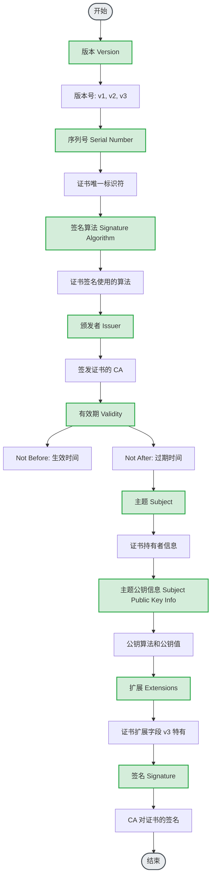
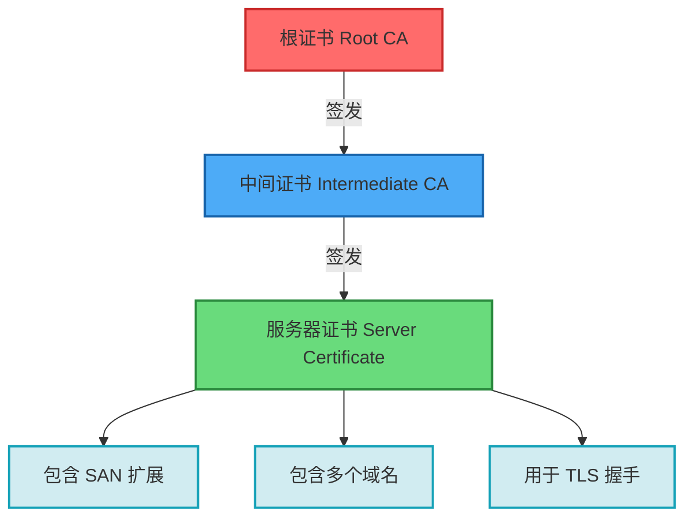
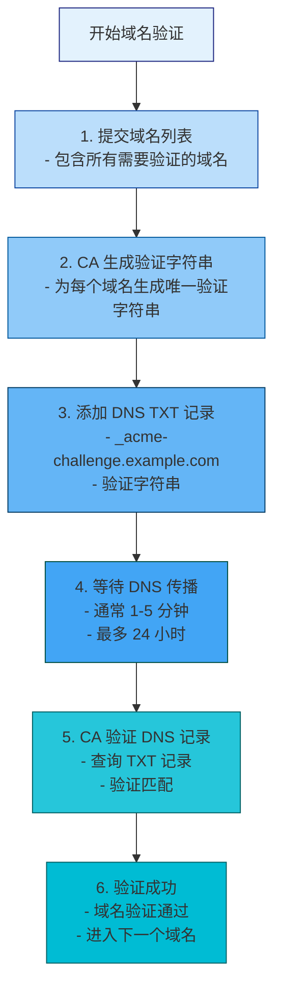
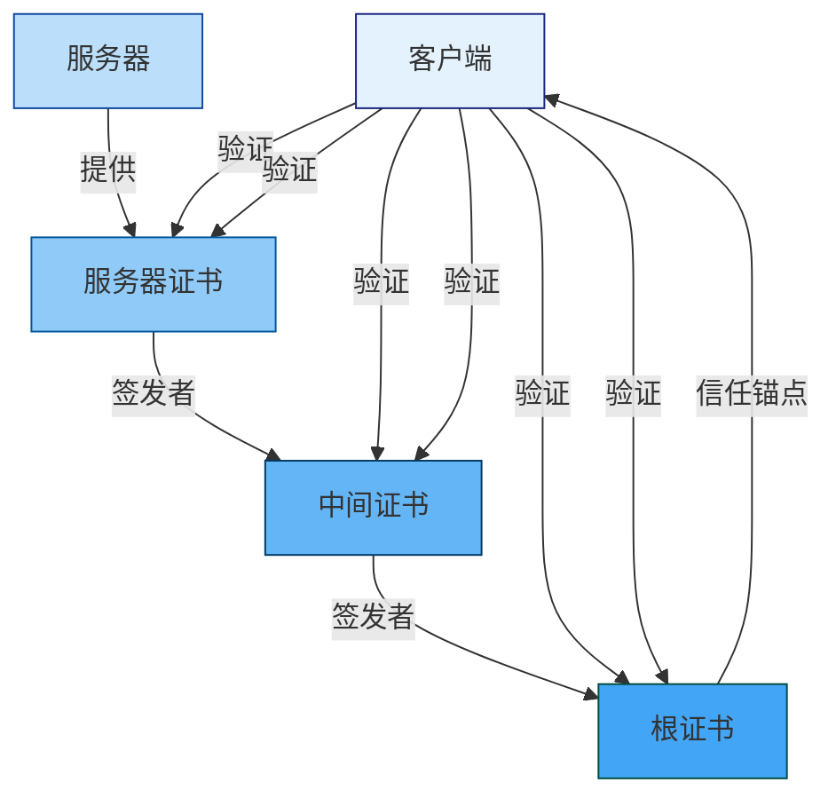
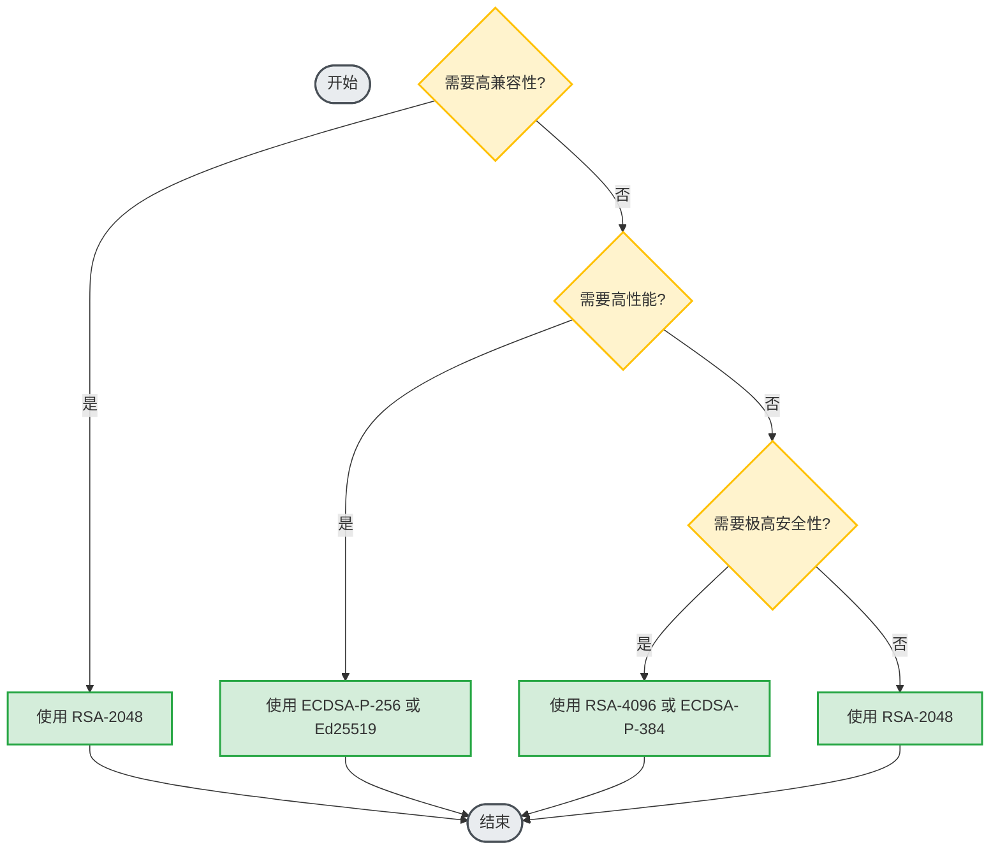
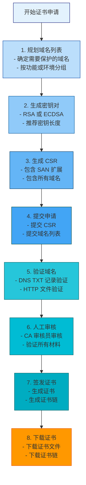
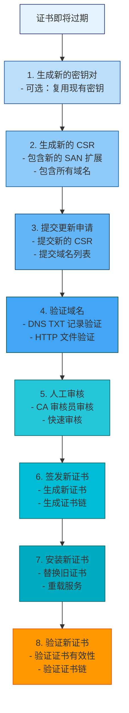
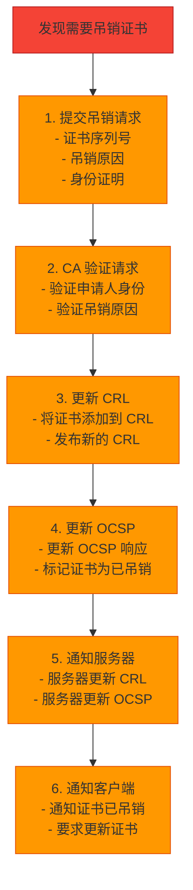

# 多域名证书（SAN 证书）技术文档

## 目录

1. [引言](#1-引言)
2. [证书基础知识](#2-证书基础知识)
3. [SAN 证书概述](#3-san证书概述)
4. [证书基本信息](#4-证书基本信息)
5. [SAN 扩展字段详解](#5-san扩展字段详解)
6. [支持的域名列表及验证状态](#6-支持的域名列表及验证状态)
7. [证书链结构](#7-证书链结构)
8. [加密算法信息](#8-加密算法信息)
9. [密钥长度与类型](#9-密钥长度与类型)
10. [证书用途与约束条件](#10-证书用途与约束条件)
11. [证书申请与签发流程](#11-证书申请与签发流程)
12. [证书安装与配置指南](#12-证书安装与配置指南)
13. [证书更新与吊销机制](#13-证书更新与吊销机制)
14. [安全最佳实践](#14-安全最佳实践)
15. [技术参数说明](#15-技术参数说明)
16. [常见问题与解决方案](#16-常见问题与解决方案)
17. [附录：工具与资源](#17-附录工具与资源)

---

## 1. 引言

### 1.1 文档目的

本文档旨在为技术人员提供多域名证书（Subject Alternative Name，SAN 证书）的完整技术指南。SAN 证书允许在单个证书中包含多个域名，为 SMTP 隧道代理系统提供灵活的域名管理能力。通过本文档，技术人员能够理解 SAN 证书的技术原理、申请流程、配置方法和维护策略。

### 1.2 适用范围

本文档适用于以下场景：
- SMTP 隧道代理服务器的多域名 TLS 证书配置
- 需要保护多个域名的单证书部署
- SAN 证书的申请、安装、配置和维护
- 证书相关的故障排除和安全审计

### 1.3 目标读者

- 系统管理员
- 网络工程师
- 安全工程师
- DevOps 工程师
- 证书管理员

### 1.4 前置知识

阅读本文档需要具备以下基础知识：
- SSL/TLS 协议基础
- X.509 证书标准
- DNS 基础知识
- Linux 命令行操作
- SMTP 协议基础

### 1.5 相关标准

本文档遵循以下行业标准和规范：

| 标准编号 | 标准名称 | 发布机构 | 说明 |
|----------|----------|----------|------|
| **RFC 5280** | Internet X.509 Public Key Infrastructure Certificate and CRL Profile | IETF | X.509 证书和 CRL 配置文件 |
| **RFC 6960** | X.509 Internet Public Key Infrastructure Online Certificate Status Protocol (OCSP) | IETF | 在线证书状态协议 |
| **RFC 8398** | Internationalized Email Addresses in X.509 Certificates | IETF | X.509 证书中的国际化电子邮件地址 |
| **CA/Browser Forum BR** | Baseline Requirements for the Issuance and Management of Publicly-Trusted TLS Certificates | CA/Browser Forum | TLS 证书基线要求 |
| **RFC 5280 Section 4.2.1.6** | Subject Alternative Name | IETF | 主题备用名称扩展 |

---

## 2. 证书基础知识

### 2.1 X.509 证书结构

X.509 证书是一种数字证书，用于在公钥基础设施（PKI）中绑定公钥与身份信息。X.509 v3 证书的基本结构如下：



### 2.2 证书类型对比

| 证书类型 | 域名数量 | SAN 支持 | 适用场景 | 成本 | 管理复杂度 |
|----------|----------|----------|----------|------|------------|
| **单域名证书** | 1 个 | 可选 | 单一域名 | 低 | 低 |
| **多域名证书（SAN）** | 多个 | 必需 | 多个域名 | 中 | 中 |
| **通配符证书** | 无限（同一域名） | 可选 | 子域名 | 中 | 低 |
| **多域名通配符证书** | 多个 + 通配符 | 必需 | 复杂域名结构 | 高 | 高 |

### 2.3 证书链结构

证书链是信任链的完整路径，从服务器证书到根证书：



**证书链验证流程**：
1. 客户端接收服务器证书
2. 验证服务器证书是否由中间证书签发
3. 验证中间证书是否由根证书签发
4. 验证根证书是否在客户端信任存储中
5. 验证证书有效期、吊销状态等

### 2.4 密钥类型对比

| 密钥类型 | 密钥长度 | 安全性 | 性能 | 兼容性 | 推荐场景 |
|----------|----------|--------|------|--------|----------|
| **RSA-2048** | 2048 位 | 中 | 中 | 极高 | 兼容性要求高的场景 |
| **RSA-4096** | 4096 位 | 高 | 低 | 高 | 高安全性要求 |
| **ECDSA-P-256** | 256 位 | 高 | 高 | 中 | 现代浏览器和客户端 |
| **ECDSA-P-384** | 384 位 | 极高 | 高 | 中 | 高安全性要求 |
| **Ed25519** | 256 位 | 极高 | 极高 | 低 | 现代应用（兼容性有限） |

---

## 3. SAN 证书概述

### 3.1 什么是 SAN 证书

SAN（Subject Alternative Name，主题备用名称）证书是一种包含多个域名或 IP 地址的 SSL/TLS 证书。SAN 扩展允许在单个证书中指定多个主题名称，从而保护多个域名。

**SAN 证书的核心特性**：
- **多域名支持**：单个证书可保护多个域名
- **灵活配置**：支持域名、IP 地址、电子邮件地址等
- **简化管理**：减少证书数量，降低管理复杂度
- **成本效益**：相比多个单域名证书更经济

### 3.2 SAN 扩展字段

SAN 扩展是 X.509 v3 证书的一个关键扩展字段，定义在 RFC 5280 Section 4.2.1.6 中。

**SAN 扩展支持的类型**：

| 类型 | 说明 | 示例 |
|------|------|------|
| **DNS 名称** | 域名 | `mail.example.com` |
| **IP 地址** | IPv4 或 IPv6 地址 | `192.168.1.1`, `2001:db8::1` |
| **电子邮件地址** | 电子邮件地址 | `admin@example.com` |
| **统一资源标识符** | URI | `https://example.com` |
| **目录名称** | X.500 目录名称 | `CN=example.com` |
| **其他名称** | 其他格式的名称 | - |

### 3.3 SAN 证书的优势

| 优势 | 说明 | 应用场景 |
|------|------|----------|
| **多域名保护** | 单个证书保护多个域名 | 多服务部署 |
| **简化管理** | 减少证书数量 | 降低运维成本 |
| **灵活配置** | 支持多种名称类型 | 复杂网络环境 |
| **成本效益** | 相比多个单域名证书更经济 | 预算有限场景 |
| **快速部署** | 一次部署覆盖多个域名 | 快速上线 |

### 3.4 SAN 证书的局限性

| 局限性 | 说明 | 解决方案 |
|--------|------|----------|
| **域名数量限制** | CA 通常限制 SAN 中的域名数量 | 使用多个证书或通配符证书 |
| **更新复杂** | 更新一个域名需要重新签发整个证书 | 规划好域名变更 |
| **兼容性问题** | 旧版浏览器可能不支持 SAN | 使用兼容性好的证书 |
| **成本较高** | 相比单域名证书成本更高 | 权衡成本和管理复杂度 |

### 3.5 SAN 证书在 SMTP 隧道代理中的应用

在 SMTP 隧道代理系统中，SAN 证书可用于：

| 应用场景 | 说明 | 示例域名 |
|----------|------|----------|
| **多服务部署** | 保护多个邮件服务 | `mail.example.com`, `smtp.example.com` |
| **多环境部署** | 保护不同环境的域名 | `mail.example.com`, `mail-staging.example.com` |
| **多区域部署** | 保护不同区域的域名 | `mail.example.com`, `mail.asia.example.com` |
| **负载均衡** | 保护负载均衡器的多个域名 | `mail1.example.com`, `mail2.example.com` |

---

## 4. 证书基本信息

### 4.1 证书版本

X.509 证书有三个版本，每个版本引入了新的特性：

| 版本 | 发布时间 | 主要特性 | SAN 支持 |
|------|----------|----------|----------|
| **v1** | 1988 | 基本证书结构 | ❌ 不支持 |
| **v2** | 1993 | 增加唯一标识符 | ❌ 不支持 |
| **v3** | 1996 | 增加扩展字段 | ✅ 支持 |

**SAN 证书必须使用 v3 版本**。

### 4.2 证书序列号

证书序列号是证书的唯一标识符，由 CA 分配。

**序列号格式**：
- **长度**：通常为 16-20 字节
- **编码**：十六进制编码
- **唯一性**：在 CA 颁发的所有证书中必须唯一

**示例**：
```
序列号: 04:AB:CD:EF:12:34:56:78:90:AB:CD:EF:12:34:56:78:90:AB
```

**查看序列号**：
```bash
openssl x509 -in cert/server.crt -noout -serial
```

### 4.3 证书颁发者

证书颁发者是签发证书的 CA（证书颁发机构）。

**颁发者信息结构**：
```
颁发者 (Issuer):
    C (Country): 国家代码
    ST (State/Province): 州/省
    L (Locality): 城市
    O (Organization): 组织名称
    OU (Organizational Unit): 组织单位
    CN (Common Name): 通用名称
```

**示例**：
```
颁发者:
    C = CN
    ST = Beijing
    L = Beijing
    O = SMTP Tunnel
    OU = Security
    CN = SMTP Tunnel CA
```

**查看颁发者**：
```bash
openssl x509 -in cert/server.crt -noout -issuer
```

### 4.4 证书有效期

证书有效期定义了证书的有效时间范围。

**有效期字段**：
- **Not Before**：证书生效时间
- **Not After**：证书过期时间

**有效期计算**：
```
有效期 = Not After - Not Before
```

**推荐有效期**：
| 证书类型 | 推荐有效期 | 说明 |
|----------|------------|------|
| **服务器证书** | 1-3 年 | 平衡安全性和管理成本 |
| **CA 证书** | 5-10 年 | 减少更新频率 |
| **中间证书** | 5-10 年 | 减少更新频率 |

**查看有效期**：
```bash
openssl x509 -in cert/server.crt -noout -dates
```

**输出示例**：
```
notBefore=Jan  1 00:00:00 2024 GMT
notAfter=Jan  1 00:00:00 2027 GMT
```

### 4.5 证书主题

证书主题是证书持有者的身份信息。

**主题信息结构**：
```
主题 (Subject):
    C (Country): 国家代码
    ST (State/Province): 州/省
    L (Locality): 城市
    O (Organization): 组织名称
    OU (Organizational Unit): 组织单位
    CN (Common Name): 通用名称（通常为主域名）
```

**示例**：
```
主题:
    C = CN
    ST = Beijing
    L = Beijing
    O = Example Mail Services
    OU = IT Department
    CN = mail.example.com
```

**注意**：在 SAN 证书中，CN 可以是任意域名，但必须包含在 SAN 扩展中。

**查看主题**：
```bash
openssl x509 -in cert/server.crt -noout -subject
```

### 4.6 证书公钥信息

证书公钥信息包含公钥算法和公钥值。

**公钥信息结构**：
```
主题公钥信息 (Subject Public Key Info):
    公钥算法: RSA/ECDSA/Ed25519
    公钥值: 公钥的具体值
    参数: 算法参数（如密钥长度）
```

**示例（RSA）**：
```
主题公钥信息:
    公钥算法: rsaEncryption
    RSA 公钥: (2048 bit)
        Modulus:
            00:ab:cd:ef:12:34:56:78:90:ab:cd:ef:12:34:56:78:90:ab:
            cd:ef:12:34:56:78:90:ab:cd:ef:12:34:56:78:90:ab:cd:
            ef:12:34:56:78:90:ab:cd:ef:12:34:56:78:90:ab:cd:ef:
            12:34:56:78:90:ab:cd:ef:12:34:56:78:90:ab:cd:ef:12:
            34:56:78:90:ab:cd:ef:12:34:56:78:90:ab:cd:ef:12:34:
            56:78:90:ab:cd:ef:12:34:56:78:90:ab:cd:ef:12:34:56:
            78:90:ab:cd:ef:12:34:56:78:90:ab:cd:ef:12:34:56:78:
            90:ab:cd:ef:12:34:56:78:90:ab:cd:ef:12:34:56:78:90:
            ab:cd:ef:12:34:56:78:90:ab:cd:ef:12:34:56:78:90:ab
        Exponent: 65537 (0x10001)
```

**查看公钥信息**：
```bash
openssl x509 -in cert/server.crt -noout -text | grep -A 10 "Subject Public Key Info"
```

---

## 5. SAN 扩展字段详解

### 5.1 SAN 扩展概述

SAN（Subject Alternative Name）扩展是 X.509 v3 证书的一个关键扩展字段，定义在 RFC 5280 Section 4.2.1.6 中。SAN 扩展允许在单个证书中指定多个主题名称。

**SAN 扩展的 OID**：
```
OID: 2.5.29.17
名称: subjectAltName
```

### 5.2 SAN 扩展结构

SAN 扩展是一个序列（SEQUENCE），包含一个或多个 GeneralName 元素。

**GeneralName 类型**：

| 类型 | 标签 | 说明 | 示例 |
|------|------|------|------|
| **otherName** | [0] | 其他名称 | - |
| **rfc822Name** | [1] | 电子邮件地址 | `admin@example.com` |
| **dNSName** | [2] | DNS 名称 | `mail.example.com` |
| **x400Address** | [3] | X.400 地址 | - |
| **directoryName** | [4] | 目录名称 | `CN=example.com` |
| **ediPartyName** | [5] | EDI 参与者名称 | - |
| **uniformResourceIdentifier** | [6] | URI | `https://example.com` |
| **iPAddress** | [7] | IP 地址 | `192.168.1.1` |
| **registeredID** | [8] | 注册 ID | - |

### 5.3 DNS 名称

DNS 名称是最常用的 SAN 类型，用于指定域名。

**DNS 名称格式**：
- **格式**：标准 DNS 域名
- **编码**：IA5String（ASCII 字符串）
- **大小写**：不区分大小写
- **通配符**：支持通配符（仅限左侧）

**示例**：
```
DNS:mail.example.com
DNS:smtp.example.com
DNS:*.example.com
DNS:mail.*.example.com (❌ 不支持)
```

**通配符规则**：
- ✅ 支持：`*.example.com`（匹配所有子域名）
- ✅ 支持：`mail.*.example.com`（❌ 不支持，通配符只能在最左侧）
- ❌ 不支持：`example.*.com`
- ❌ 不支持：`*.*.com`

### 5.4 IP 地址

IP 地址 SAN 类型用于指定 IPv4 或 IPv6 地址。

**IP 地址格式**：
- **IPv4**：4 字节，点分十进制表示
- **IPv6**：16 字节，冒号分隔十六进制表示

**示例**：
```
IP Address:192.168.1.1
IP Address:2001:db8::1
```

**查看 IP 地址 SAN**：
```bash
openssl x509 -in cert/server.crt -noout -text | grep -A 20 "Subject Alternative Name"
```

### 5.5 电子邮件地址

电子邮件地址 SAN 类型用于指定电子邮件地址。

**电子邮件地址格式**：
- **格式**：标准电子邮件地址格式
- **编码**：IA5String（ASCII 字符串）
- **大小写**：不区分大小写

**示例**：
```
Email:admin@example.com
Email:postmaster@example.com
```

### 5.6 URI

URI SAN 类型用于指定统一资源标识符。

**URI 格式**：
- **格式**：标准 URI 格式
- **编码**：IA5String（ASCII 字符串）
- **协议**：支持 HTTP, HTTPS, FTP 等

**示例**：
```
URI:https://example.com
URI:https://mail.example.com
```

### 5.7 SAN 扩展的 Critical 标志

SAN 扩展可以设置为 critical（关键）或 non-critical（非关键）。

**Critical 标志的含义**：
- **Critical = True**：客户端必须理解并处理此扩展，否则拒绝证书
- **Critical = False**：客户端可以忽略此扩展

**推荐设置**：
- **SAN 扩展**：通常设置为 non-critical
- **原因**：向后兼容性考虑

**注意**：根据 RFC 5280，如果 SAN 扩展存在，CN 必须被忽略，客户端应使用 SAN 进行主机名验证。

### 5.8 SAN 扩展示例

**完整的 SAN 扩展示例**：
```
X509v3 Subject Alternative Name:
    DNS:mail.example.com
    DNS:smtp.example.com
    DNS:pop3.example.com
    DNS:imap.example.com
    DNS:*.example.com
    IP Address:192.168.1.1
    IP Address:2001:db8::1
    Email:admin@example.com
    Email:postmaster@example.com
    URI:https://mail.example.com
```

**查看 SAN 扩展**：
```bash
openssl x509 -in cert/server.crt -noout -text | grep -A 20 "Subject Alternative Name"
```

---

## 6. 支持的域名列表及验证状态

### 6.1 域名列表管理

SAN 证书可以包含多个域名，需要有效管理域名列表。

**域名列表管理原则**：
1. **规划域名**：提前规划需要保护的域名
2. **分组管理**：按功能或环境分组域名
3. **定期审查**：定期审查域名列表，移除不需要的域名
4. **版本控制**：对域名列表进行版本控制

### 6.2 域名验证状态

每个域名在 SAN 证书中都有对应的验证状态。

**验证状态类型**：

| 状态 | 说明 | 处理方式 |
|------|------|----------|
| **valid** | 域名验证通过 | 正常使用 |
| **invalid** | 域名验证失败 | 检查 DNS 配置 |
| **pending** | 域名验证中 | 等待验证完成 |
| **expired** | 域名已过期 | 更新域名信息 |

### 6.3 域名验证方法

CA 使用多种方法验证域名所有权：

| 验证方法 | 说明 | 优点 | 缺点 | 适用场景 |
|----------|------|------|------|----------|
| **DNS TXT 记录验证** | 在 DNS 中添加 TXT 记录 | 快速、简单 | 需要 DNS 管理权限 | 大多数场景 |
| **HTTP 文件验证** | 在网站根目录放置验证文件 | 快速、简单 | 需要 Web 服务器 | 大多数场景 |
| **电子邮件验证** | 向域名管理员邮箱发送验证邮件 | 安全 | 需要邮箱访问权限 | 特定场景 |
| **WHOIS 验证** | 验证 WHOIS 信息 | 简单 | WHOIS 隐私保护 | 特定场景 |

### 6.4 域名验证流程

**DNS TXT 记录验证流程**：



### 6.5 域名验证失败处理

**常见验证失败原因**：

| 原因 | 说明 | 解决方案 |
|------|------|----------|
| **DNS 记录未配置** | 未添加 DNS TXT 记录 | 添加正确的 DNS TXT 记录 |
| **DNS 记录错误** | DNS TXT 记录内容错误 | 检查并修正 DNS TXT 记录 |
| **DNS 传播延迟** | DNS 记录未完全传播 | 等待 DNS 传播完成 |
| **域名不存在** | 域名未注册或已过期 | 检查域名状态 |
| **DNS 服务器故障** | DNS 服务器无法访问 | 检查 DNS 服务器状态 |

**验证失败处理步骤**：

```bash
# 1. 检查 DNS 记录
dig TXT _acme-challenge.example.com

# 2. 检查 DNS 传播
for i in {1..10}; do
    dig TXT _acme-challenge.example.com +short
    sleep 10
done

# 3. 使用在线 DNS 查询工具
# https://www.whatsmydns.net/
# https://dnschecker.org/

# 4. 检查域名状态
whois example.com
```

### 6.6 域名列表管理工具

**使用 OpenSSL 查看域名列表**：

```bash
# 查看 SAN 扩展中的所有域名
openssl x509 -in cert/server.crt -noout -text | grep -A 20 "Subject Alternative Name"

# 提取 DNS 名称
openssl x509 -in cert/server.crt -noout -text | grep "DNS:" | sed 's/.*DNS://g' | sed 's/, /\n/g'
```

**使用 Python 查看域名列表**：

```python
#!/usr/bin/env python3
"""
查看 SAN 证书中的域名列表
"""

from cryptography import x509
from cryptography.hazmat.backends import default_backend

def get_san_domains(cert_file):
    """获取 SAN 证书中的域名列表"""
    with open(cert_file, 'rb') as f:
        cert = x509.load_pem_x509_certificate(f.read(), default_backend())
    
    # 获取 SAN 扩展
    san_extension = cert.extensions.get_extension_for_oid(
        x509.oid.ExtensionOID.SUBJECT_ALTERNATIVE_NAME
    )
    
    # 提取 DNS 名称
    dns_names = san_extension.value.get_values_for_type(x509.DNSName)
    
    return dns_names

if __name__ == '__main__':
    cert_file = 'cert/server.crt'
    dns_names = get_san_domains(cert_file)
    
    print(f"证书文件: {cert_file}")
    print(f"域名数量: {len(dns_names)}")
    print("\n域名列表:")
    for i, name in enumerate(dns_names, 1):
        print(f"  {i}. {name}")
```

---

## 7. 证书链结构

### 7.1 证书链概述

证书链是信任链的完整路径，从服务器证书到根证书。证书链验证确保了证书的可信度。

**证书链结构**：


### 7.2 证书链验证流程

**证书链验证步骤**：

| 步骤 | 验证内容 | 说明 |
|------|----------|------|
| **1. 验证服务器证书** | 检查服务器证书的有效性 | 有效期、签名等 |
| **2. 验证中间证书** | 检查中间证书是否签发服务器证书 | 验证签名 |
| **3. 验证根证书** | 检查根证书是否签发中间证书 | 验证签名 |
| **4. 验证信任锚点** | 检查根证书是否在信任存储中 | 客户端信任存储 |
| **5. 验证证书链完整性** | 检查证书链是否完整 | 无缺失证书 |

### 7.3 证书链验证流程图



### 7.4 证书链文件

**证书链文件类型**：

| 文件类型 | 说明 | 用途 |
|----------|------|------|
| **server.crt** | 服务器证书 | 用于 TLS 握手 |
| **intermediate.crt** | 中间证书 | 用于验证服务器证书 |
| **root.crt** | 根证书 | 用于验证中间证书 |
| **fullchain.crt** | 完整证书链 | 服务器证书 + 中间证书 |
| **ca-bundle.crt** | CA 证书包 | 中间证书 + 根证书 |

**证书链文件格式**：

```bash
# fullchain.crt 格式
-----BEGIN CERTIFICATE-----
[服务器证书内容]
-----END CERTIFICATE-----
-----BEGIN CERTIFICATE-----
[中间证书内容]
-----END CERTIFICATE-----
```

### 7.5 证书链验证

**使用 OpenSSL 验证证书链**：

```bash
# 验证证书链
openssl verify -CAfile ca.crt server.crt

# 验证完整证书链
openssl verify -CAfile root.crt -untrusted intermediate.crt server.crt

# 显示证书链
openssl s_client -connect mail.example.com:587 -showcerts
```

**验证结果说明**：

| 结果 | 说明 | 处理方式 |
|------|------|----------|
| `server.crt: OK` | 证书链验证成功 | 正常使用 |
| `server.crt: unable to get local issuer certificate` | 缺少 CA 证书 | 配置 CA 证书 |
| `server.crt: certificate chain error` | 证书链错误 | 检查证书链顺序 |

### 7.6 证书链配置

**Nginx 配置**：

```nginx
server {
    listen 443 ssl http2;
    server_name mail.example.com smtp.example.com;

    # 服务器证书
    ssl_certificate /etc/ssl/certs/fullchain.crt;
    
    # 服务器私钥
    ssl_certificate_key /etc/ssl/private/server.key;
    
    # CA 证书（用于客户端验证）
    ssl_trusted_certificate /etc/ssl/certs/ca-bundle.crt;
}
```

**Apache 配置**：

```apache
<VirtualHost *:443>
    ServerName mail.example.com
    
    # 启用 SSL
    SSLEngine on
    
    # 服务器证书
    SSLCertificateFile /etc/ssl/certs/server.crt
    
    # 服务器私钥
    SSLCertificateKeyFile /etc/ssl/private/server.key
    
    # 证书链
    SSLCertificateChainFile /etc/ssl/certs/intermediate.crt
</VirtualHost>
```

---

## 8. 加密算法信息

### 8.1 签名算法

签名算法用于 CA 对证书进行签名，确保证书的完整性和真实性。

**常用签名算法**：

| 算法 | 输出长度 | 安全性 | 性能 | 推荐度 | 说明 |
|------|----------|--------|------|--------|------|
| **SHA-256 with RSA** | 256 位 | 高 | 中 | ⭐⭐⭐⭐⭐ | 推荐使用 |
| **SHA-384 with RSA** | 384 位 | 极高 | 中 | ⭐⭐⭐⭐⭐ | 高安全性要求 |
| **SHA-512 with RSA** | 512 位 | 极高 | 中 | ⭐⭐⭐⭐⭐ | 高安全性要求 |
| **SHA-256 with ECDSA** | 256 位 | 高 | 高 | ⭐⭐⭐⭐⭐ | 现代应用 |
| **SHA-384 with ECDSA** | 384 位 | 极高 | 高 | ⭐⭐⭐⭐⭐ | 高安全性要求 |
| **SHA-1 with RSA** | 160 位 | 低 | 高 | ❌ 不推荐 | 已弃用 |

**推荐签名算法**：
- **RSA 密钥**：SHA-256 with RSA 或 SHA-384 with RSA
- **ECDSA 密钥**：SHA-256 with ECDSA 或 SHA-384 with ECDSA

**查看签名算法**：

```bash
openssl x509 -in cert/server.crt -noout -text | grep "Signature Algorithm"
```

### 8.2 哈希算法

哈希算法用于生成证书的哈希值，用于证书验证。

**常用哈希算法**：

| 算法 | 输出长度 | 安全性 | 性能 | 推荐度 | 说明 |
|------|----------|--------|------|--------|------|
| **SHA-256** | 256 位 | 高 | 高 | ⭐⭐⭐⭐⭐ | 推荐使用 |
| **SHA-384** | 384 位 | 极高 | 高 | ⭐⭐⭐⭐⭐ | 高安全性要求 |
| **SHA-512** | 512 位 | 极高 | 高 | ⭐⭐⭐⭐⭐ | 高安全性要求 |
| **SHA-1** | 160 位 | 低 | 高 | ❌ 不推荐 | 已弃用 |

**推荐哈希算法**：
- **SHA-256**：通用场景
- **SHA-384**：高安全性要求
- **SHA-512**：极高安全性要求

### 8.3 对称加密算法

对称加密算法用于 TLS 会话中的数据加密。

**常用对称加密算法**：

| 算法 | 密钥长度 | 安全性 | 性能 | 推荐度 | 说明 |
|------|----------|--------|------|--------|------|
| **AES-128-GCM** | 128 位 | 高 | 极高 | ⭐⭐⭐⭐⭐ | 推荐使用 |
| **AES-256-GCM** | 256 位 | 极高 | 极高 | ⭐⭐⭐⭐⭐ | 高安全性要求 |
| **ChaCha20-Poly1305** | 256 位 | 极高 | 极高 | ⭐⭐⭐⭐⭐ | 移动设备优化 |
| **AES-128-CBC** | 128 位 | 中 | 高 | ⭐⭐⭐ | 兼容性要求 |
| **AES-256-CBC** | 256 位 | 高 | 高 | ⭐⭐⭐⭐ | 兼容性要求 |

**推荐对称加密算法**：
- **AES-256-GCM**：高性能和高安全性
- **ChaCha20-Poly1305**：移动设备优化

### 8.4 密钥交换算法

密钥交换算法用于 TLS 握手中的密钥协商。

**常用密钥交换算法**：

| 算法 | 安全性 | 性能 | 前向保密 | 推荐度 | 说明 |
|------|--------|------|----------|--------|------|
| **ECDHE-RSA** | 高 | 高 | ✅ | ⭐⭐⭐⭐⭐ | 推荐使用 |
| **ECDHE-ECDSA** | 高 | 高 | ✅ | ⭐⭐⭐⭐⭐ | 推荐使用 |
| **DHE-RSA** | 高 | 中 | ✅ | ⭐⭐⭐⭐ | 兼容性要求 |
| **RSA** | 中 | 高 | ❌ | ❌ 不推荐 | 无前向保密 |

**推荐密钥交换算法**：
- **ECDHE-RSA**：高性能和前向保密
- **ECDHE-ECDSA**：高性能和前向保密

### 8.5 加密套件

加密套件是加密算法的组合，定义了 TLS 会话中使用的加密参数。

**推荐加密套件**：

```nginx
# Nginx 配置
ssl_ciphers 'ECDHE-ECDSA-AES128-GCM-SHA256:ECDHE-RSA-AES128-GCM-SHA256:ECDHE-ECDSA-AES256-GCM-SHA384:ECDHE-RSA-AES256-GCM-SHA384:ECDHE-ECDSA-CHACHA20-POLY1305:ECDHE-RSA-CHACHA20-POLY1305';
ssl_prefer_server_ciphers off;
```

```apache
# Apache 配置
SSLCipherSuite ECDHE-ECDSA-AES128-GCM-SHA256:ECDHE-RSA-AES128-GCM-SHA256:ECDHE-ECDSA-AES256-GCM-SHA384:ECDHE-RSA-AES256-GCM-SHA384:ECDHE-ECDSA-CHACHA20-POLY1305:ECDHE-RSA-CHACHA20-POLY1305
SSLHonorCipherOrder off
```

---

## 9. 密钥长度与类型

### 9.1 RSA 密钥

RSA 是最常用的非对称加密算法，广泛用于 TLS 证书。

**RSA 密钥长度对比**：

| 密钥长度 | 安全性 | 性能 | 兼容性 | 推荐场景 |
|----------|--------|------|--------|----------|
| **RSA-2048** | 中 | 中 | 极高 | 通用场景 |
| **RSA-4096** | 高 | 低 | 高 | 高安全性要求 |
| **RSA-8192** | 极高 | 极低 | 中 | 极高安全性要求 |

**推荐 RSA 密钥长度**：
- **RSA-2048**：通用场景，平衡安全性和性能
- **RSA-4096**：高安全性要求

**生成 RSA 密钥**：

```bash
# 生成 2048 位 RSA 密钥
openssl genrsa -out server.key 2048

# 生成 4096 位 RSA 密钥
openssl genrsa -out server.key 4096

# 查看密钥信息
openssl rsa -in server.key -noout -text
```

### 9.2 ECDSA 密钥

ECDSA（椭圆曲线数字签名算法）是一种基于椭圆曲线的数字签名算法，相比 RSA 具有更高的性能。

**ECDSA 密钥类型对比**：

| 曲线 | 密钥长度 | 安全性 | 性能 | 兼容性 | 推荐场景 |
|------|----------|--------|------|--------|----------|
| **P-256** | 256 位 | 高 | 高 | 中 | 通用场景 |
| **P-384** | 384 位 | 极高 | 高 | 中 | 高安全性要求 |
| **P-521** | 521 位 | 极高 | 中 | 低 | 极高安全性要求 |

**推荐 ECDSA 密钥类型**：
- **P-256**：通用场景，平衡安全性和性能
- **P-384**：高安全性要求

**生成 ECDSA 密钥**：

```bash
# 生成 P-256 椭圆曲线密钥
openssl ecparam -genkey -name prime256v1 -out server.key

# 生成 P-384 椭圆曲线密钥
openssl ecparam -genkey -name secp384r1 -out server.key

# 查看密钥信息
openssl ec -in server.key -noout -text
```

### 9.3 Ed25519 密钥

Ed25519 是一种现代的椭圆曲线签名算法，具有极高的性能和安全性。

**Ed25519 特性**：

| 特性 | 说明 |
|------|------|
| **密钥长度** | 256 位 |
| **签名长度** | 64 字节 |
| **安全性** | 极高 |
| **性能** | 极高 |
| **兼容性** | 有限（需要现代浏览器和客户端） |

**生成 Ed25519 密钥**：

```bash
# 生成 Ed25519 密钥
openssl genpkey -algorithm Ed25519 -out server.key

# 查看密钥信息
openssl pkey -in server.key -noout -text
```

### 9.4 密钥选择建议

**密钥选择决策树**：



**推荐密钥配置**：

| 场景 | 推荐密钥 | 说明 |
|------|----------|------|
| **通用场景** | RSA-2048 | 平衡安全性和性能 |
| **高安全性要求** | RSA-4096 或 ECDSA-P-384 | 更高的安全性 |
| **高性能要求** | ECDSA-P-256 或 Ed25519 | 更高的性能 |
| **高兼容性要求** | RSA-2048 | 兼容性最好 |

---

## 10. 证书用途与约束条件

### 10.1 Key Usage 扩展

Key Usage 扩展定义了证书中公钥的用途。

**Key Usage 扩展的 OID**：
```
OID: 2.5.29.15
名称: keyUsage
```

**Key Usage 位定义**：

| 位 | 名称 | 说明 | 服务器证书 | 客户端证书 |
|----|------|------|------------|------------|
| 0 | digitalSignature | 数字签名 | ✅ | ✅ |
| 1 | nonRepudiation | 不可否认性 | ❌ | ❌ |
| 2 | keyEncipherment | 密钥加密 | ✅ | ✅ |
| 3 | dataEncipherment | 数据加密 | ❌ | ❌ |
| 4 | keyAgreement | 密钥协商 | ❌ | ❌ |
| 5 | keyCertSign | 签发证书 | ❌ | ❌ |
| 6 | cRLSign | 签发 CRL | ❌ | ❌ |
| 7 | encipherOnly | 仅加密 | ❌ | ❌ |
| 8 | decipherOnly | 仅解密 | ❌ | ❌ |

**服务器证书 Key Usage 配置**：

```bash
Key Usage:
    Digital Signature: True
    Key Encipherment: True
    Data Encipherment: False
    Key Agreement: False
    Key Cert Sign: False
    CRL Sign: False
    Encipher Only: False
    Decipher Only: False
```

### 10.2 Extended Key Usage 扩展

Extended Key Usage（EKU）扩展定义了证书的特定用途。

**Extended Key Usage 扩展的 OID**：
```
OID: 2.5.29.37
名称: extendedKeyUsage
```

**常用 Extended Key Usage OID**：

| OID | 名称 | 说明 | 服务器证书 | 客户端证书 |
|-----|------|------|------------|------------|
| **1.3.6.1.5.5.7.3.1** | serverAuth | 服务器认证 | ✅ | ❌ |
| **1.3.6.1.5.5.7.3.2** | clientAuth | 客户端认证 | ❌ | ✅ |
| **1.3.6.1.5.5.7.3.4** | emailProtection | 电子邮件保护 | ✅ | ✅ |
| **1.3.6.1.5.5.7.3.8** | timeStamping | 时间戳 | ❌ | ❌ |
| **1.3.6.1.5.5.7.3.9** | OCSPSigning | OCSP 签名 | ❌ | ❌ |

**服务器证书 Extended Key Usage 配置**：

```bash
Extended Key Usage:
    TLS Web Server Authentication: True
    TLS Web Client Authentication: False
    E-mail Protection: True
```

### 10.3 Basic Constraints 扩展

Basic Constraints 扩展定义了证书的基本约束，如是否为 CA 证书。

**Basic Constraints 扩展的 OID**：
```
OID: 2.5.29.19
名称: basicConstraints
```

**Basic Constraints 字段**：

| 字段 | 说明 | 服务器证书 | CA 证书 |
|------|------|------------|---------|
| **CA** | 是否为 CA 证书 | False | True |
| **pathLenConstraint** | 路径长度约束 | N/A | 0 或正整数 |

**服务器证书 Basic Constraints 配置**：

```bash
Basic Constraints:
    CA: False
```

**CA 证书 Basic Constraints 配置**：

```bash
Basic Constraints:
    CA: True
    Path Length Constraint: 0
```

### 10.4 证书约束条件

**证书约束条件总结**：

| 扩展 | 服务器证书 | CA 证书 |
|------|------------|---------|
| **Basic Constraints** | CA: False | CA: True |
| **Key Usage** | digitalSignature, keyEncipherment | digitalSignature, keyCertSign, cRLSign |
| **Extended Key Usage** | serverAuth, emailProtection | - |
| **Subject Alternative Name** | 必需 | 可选 |

### 10.5 证书用途验证

**使用 OpenSSL 验证证书用途**：

```bash
# 查看 Key Usage
openssl x509 -in cert/server.crt -noout -text | grep -A 10 "Key Usage"

# 查看 Extended Key Usage
openssl x509 -in cert/server.crt -noout -text | grep -A 10 "Extended Key Usage"

# 查看 Basic Constraints
openssl x509 -in cert/server.crt -noout -text | grep -A 5 "Basic Constraints"
```

---

## 11. 证书申请与签发流程

### 11.1 证书申请流程

**SAN 证书申请流程**：



### 11.2 生成 SAN 证书

#### 11.2.1 使用项目脚本生成

SMTP 隧道代理项目提供了 `generate_certs.py` 脚本，支持生成 SAN 证书。

**基本使用**：

```bash
# 使用默认参数生成 SAN 证书
python3 generate_certs.py --hostname mail.example.com

# 指定多个域名
# 需要修改脚本以支持多个域名
```

**修改脚本支持多个域名**：

编辑 `generate_certs.py`，修改 `generate_server_certificate` 函数中的 SAN 配置：

```python
# 主题备用名称（Subject Alternative Name, SAN）
# SAN 对 TLS 验证非常重要，允许证书用于多个主机名
san = x509.SubjectAlternativeName([
    x509.DNSName(hostname),     # 指定的主机名
    x509.DNSName(f"smtp.{hostname.split('.', 1)[-1] if '.' in hostname else hostname}"),  # smtp.域名
    x509.DNSName("localhost"),  # 本地主机（用于测试）
    # 添加更多域名
    x509.DNSName("mail.example.com"),
    x509.DNSName("smtp.example.com"),
    x509.DNSName("pop3.example.com"),
    x509.DNSName("imap.example.com"),
])
```

#### 11.2.2 使用 OpenSSL 生成 SAN 证书

**步骤 1：生成私钥**

```bash
# 生成 RSA 私钥
openssl genrsa -out server.key 2048

# 或生成 ECDSA 私钥
openssl ecparam -genkey -name prime256v1 -out server.key
```

**步骤 2：创建配置文件**

```bash
cat > server.conf <<EOF
[req]
distinguished_name = req_distinguished_name
req_extensions = v3_req
prompt = no

[req_distinguished_name]
C = CN
ST = Beijing
L = Beijing
O = Example Mail Services
OU = IT Department
CN = mail.example.com

[v3_req]
keyUsage = keyEncipherment, dataEncipherment
extendedKeyUsage = serverAuth, clientAuth, emailProtection
subjectAltName = @alt_names

[alt_names]
DNS.1 = mail.example.com
DNS.2 = smtp.example.com
DNS.3 = pop3.example.com
DNS.4 = imap.example.com
DNS.5 = *.example.com
DNS.6 = localhost
IP.1 = 192.168.1.1
IP.2 = 2001:db8::1
EOF
```

**步骤 3：生成 CSR**

```bash
openssl req -new -key server.key -out server.csr -config server.conf
```

**步骤 4：使用 CA 签发证书**

```bash
# 生成 CA 证书（如果不存在）
openssl genrsa -out ca.key 4096
openssl req -new -x509 -days 3650 -key ca.key -out ca.crt \
    -subj "/C=CN/ST=Beijing/L=Beijing/O=SMTP Tunnel/OU=Security/CN=SMTP Tunnel CA"

# 使用 CA 签发服务器证书
openssl x509 -req -days 1095 -in server.csr \
    -CA ca.crt -CAkey ca.key -CAcreateserial \
    -out server.crt -extensions v3_req -extfile server.conf
```

**步骤 5：验证证书**

```bash
# 验证证书链
openssl verify -CAfile ca.crt server.crt

# 查看 SAN 扩展
openssl x509 -in server.crt -noout -text | grep -A 20 "Subject Alternative Name"
```

### 11.3 证书申请材料

**申请 SAN 证书所需材料**：

| 材料类型 | 说明 | 必需/可选 |
|----------|------|-----------|
| **域名列表** | 需要保护的所有域名 | 必需 |
| **组织信息** | 组织名称、地址等 | 必需（OV/EV 证书） |
| **CSR 文件** | 证书签名请求 | 必需 |
| **营业执照** | 组织注册证明 | 必需（OV/EV 证书） |
| **联系人信息** | 技术联系人、验证联系人 | 必需 |
| **授权书** | 申请授权证明 | 必需（OV/EV 证书） |

### 11.4 域名验证

**域名验证方法**：

| 验证方法 | 说明 | 优点 | 缺点 | 推荐场景 |
|----------|------|------|------|----------|
| **DNS TXT 记录验证** | 在 DNS 中添加 TXT 记录 | 快速、简单 | 需要 DNS 管理权限 | 大多数场景 |
| **HTTP 文件验证** | 在网站根目录放置验证文件 | 快速、简单 | 需要 Web 服务器 | 大多数场景 |
| **电子邮件验证** | 向域名管理员邮箱发送验证邮件 | 安全 | 需要邮箱访问权限 | 特定场景 |

**DNS TXT 记录验证示例**：

```bash
# 1. CA 提供验证字符串
# 验证字符串示例: 2023-01-01T12:00:00Z.example.com.abc123def456

# 2. 添加 DNS TXT 记录
# 主机记录: _acme-challenge
# 记录类型: TXT
# 记录值: 2023-01-01T12:00:00Z.example.com.abc123def456

# 3. 使用命令行添加 DNS 记录（以 Cloudflare 为例）
pip install cloudflare-cli

# 配置 API 密钥
export CF_API_EMAIL="your-email@example.com"
export CF_API_KEY="your-api-key"

# 添加 TXT 记录
cf-cli dns add example.com TXT "_acme-challenge" "2023-01-01T12:00:00Z.example.com.abc123def456"

# 4. 验证 DNS 记录
dig TXT _acme-challenge.example.com

# 5. 等待 DNS 传播（通常 1-5 分钟）
for i in {1..10}; do
    dig TXT _acme-challenge.example.com +short
    sleep 10
done
```

### 11.5 证书签发

**证书签发流程**：

| 步骤 | 说明 | 时间 |
|------|------|------|
| **1. 提交申请** | 提交 CSR 和域名列表 | 立即 |
| **2. 验证域名** | 验证所有域名所有权 | 1-24 小时 |
| **3. 人工审核** | CA 审核员审核（OV/EV 证书） | 1-3 个工作日 |
| **4. 签发证书** | 生成证书和证书链 | 立即 |
| **5. 下载证书** | 下载证书文件 | 立即 |

**总计时间**：
- **DV 证书**：1-24 小时
- **OV 证书**：1-3 个工作日
- **EV 证书**：3-7 个工作日

---

## 12. 证书安装与配置指南

### 12.1 证书文件准备

**证书文件清单**：

| 文件 | 说明 | 格式 | 用途 |
|------|------|------|------|
| `server.crt` | 服务器证书 | PEM | TLS 握手 |
| `server.key` | 服务器私钥 | PEM | TLS 握手 |
| `intermediate.crt` | 中间证书 | PEM | 证书链验证 |
| `root.crt` | 根证书 | PEM | 证书链验证 |
| `fullchain.crt` | 完整证书链 | PEM | 服务器证书 + 中间证书 |
| `ca-bundle.crt` | CA 证书包 | PEM | 中间证书 + 根证书 |

**证书文件权限**：

```bash
# 设置证书文件权限
chmod 644 server.crt       # 证书文件：所有者读写，其他人只读
chmod 600 server.key       # 私钥文件：仅所有者读写
chmod 644 intermediate.crt # 中间证书：所有者读写，其他人只读
chmod 644 root.crt        # 根证书：所有者读写，其他人只读
chmod 644 fullchain.crt   # 完整证书链：所有者读写，其他人只读
chmod 644 ca-bundle.crt   # CA 证书包：所有者读写，其他人只读

# 验证文件权限
ls -la
```

### 12.2 服务器端配置

#### 12.2.1 SMTP 隧道代理配置

**配置文件设置**（`config.yaml`）：

```yaml
server:
  # 监听地址
  host: "0.0.0.0"
  
  # SMTP 提交端口
  port: 587
  
  # 服务器主机名（必须与证书 CN 或 SAN 匹配）
  hostname: "mail.example.com"
  
  # TLS 证书和密钥文件
  cert_file: "cert/fullchain.crt"
  key_file: "cert/server.key"
  
  # 用户配置文件
  users_file: "users.yaml"
```

**配置说明**：
- `hostname`：必须与证书的 CN 或 SAN 完全匹配
- `cert_file`：使用 `fullchain.crt` 包含完整证书链
- `key_file`：服务器私钥文件路径

#### 12.2.2 Nginx 配置

**基本配置**：

```nginx
server {
    listen 443 ssl http2;
    server_name mail.example.com smtp.example.com pop3.example.com imap.example.com;

    # 证书配置
    ssl_certificate /etc/ssl/certs/fullchain.crt;
    ssl_certificate_key /etc/ssl/private/server.key;
    ssl_trusted_certificate /etc/ssl/certs/ca-bundle.crt;

    # SSL 协议和加密套件
    ssl_protocols TLSv1.2 TLSv1.3;
    ssl_ciphers 'ECDHE-ECDSA-AES128-GCM-SHA256:ECDHE-RSA-AES128-GCM-SHA256:ECDHE-ECDSA-AES256-GCM-SHA384:ECDHE-RSA-AES256-GCM-SHA384:ECDHE-ECDSA-CHACHA20-POLY1305:ECDHE-RSA-CHACHA20-POLY1305';
    ssl_prefer_server_ciphers off;

    # SSL 会话配置
    ssl_session_cache shared:SSL:10m;
    ssl_session_timeout 10m;
    ssl_session_tickets off;

    # OCSP Stapling
    ssl_stapling on;
    ssl_stapling_verify on;
    resolver 8.8.8.8 8.8.4.4 valid=300s;
    resolver_timeout 5s;

    # 安全头
    add_header Strict-Transport-Security "max-age=31536000; includeSubDomains" always;
    add_header X-Frame-Options "SAMEORIGIN" always;
    add_header X-Content-Type-Options "nosniff" always;
    add_header X-XSS-Protection "1; mode=block" always;

    # 日志配置
    access_log /var/log/nginx/access.log;
    error_log /var/log/nginx/error.log;

    # 网站根目录
    root /var/www/html;
    index index.html;
}

# HTTP 服务器配置（重定向到 HTTPS）
server {
    listen 80;
    server_name mail.example.com smtp.example.com pop3.example.com imap.example.com;

    location / {
        return 301 https://$host$request_uri;
    }
}
```

#### 12.2.3 Apache 配置

**基本配置**：

```apache
<VirtualHost *:443>
    ServerName mail.example.com
    ServerAlias smtp.example.com pop3.example.com imap.example.com

    # 启用 SSL
    SSLEngine on

    # 证书配置
    SSLCertificateFile /etc/ssl/certs/server.crt
    SSLCertificateKeyFile /etc/ssl/private/server.key
    SSLCertificateChainFile /etc/ssl/certs/intermediate.crt

    # SSL 协议和加密套件
    SSLProtocol all -SSLv2 -SSLv3 -TLSv1 -TLSv1.1
    SSLCipherSuite ECDHE-ECDSA-AES128-GCM-SHA256:ECDHE-RSA-AES128-GCM-SHA256:ECDHE-ECDSA-AES256-GCM-SHA384:ECDHE-RSA-AES256-GCM-SHA384:ECDHE-ECDSA-CHACHA20-POLY1305:ECDHE-RSA-CHACHA20-POLY1305
    SSLHonorCipherOrder off

    # SSL 会话配置
    SSLSessionCache shmcb:/var/run/apache2/ssl_scache(512000)
    SSLSessionCacheTimeout 300
    SSLSessionTickets off

    # OCSP Stapling
    SSLUseStapling on
    SSLStaplingCache shmcb:/var/run/apache2/ocsp(128000)
    SSLStaplingResponderTimeout 5
    SSLStaplingReturnResponderErrors off

    # 安全头
    Header always set Strict-Transport-Security "max-age=31536000; includeSubDomains"
    Header always set X-Frame-Options "SAMEORIGIN"
    Header always set X-Content-Type-Options "nosniff"
    Header always set X-XSS-Protection "1; mode=block"

    # 日志配置
    ErrorLog ${APACHE_LOG_DIR}/error.log
    CustomLog ${APACHE_LOG_DIR}/access.log combined

    # 网站根目录
    DocumentRoot /var/www/html
    DirectoryIndex index.html
</VirtualHost>

# HTTP 服务器配置（重定向到 HTTPS）
<VirtualHost *:80>
    ServerName mail.example.com
    ServerAlias smtp.example.com pop3.example.com imap.example.com

    RewriteEngine on
    RewriteCond %{HTTPS} off
    RewriteRule ^(.*)$ https://%{HTTP_HOST}%{REQUEST_URI} [L,R=301]
</VirtualHost>
```

### 12.3 客户端配置

#### 12.3.1 配置文件设置

**客户端配置**（`client_config.yaml`）：

```yaml
client:
  # 隧道服务器域名（必须与证书 CN 或 SAN 匹配）
  server_host: "mail.example.com"
  
  # 隧道服务器端口
  server_port: 587
  
  # 本地 SOCKS5 代理端口
  socks_port: 1080
  
  # 本地 SOCKS5 绑定地址
  socks_host: "127.0.0.1"
  
  # 用户凭证
  username: "your_username"
  secret: "your_secret"
  
  # 用于服务器验证的 CA 证书
  ca_cert: "cert/ca.crt"
```

**配置说明**：
- `server_host`：必须与证书的 CN 或 SAN 完全匹配
- `ca_cert`：CA 证书文件路径（用于验证服务器证书）

#### 12.3.2 证书验证模式

**客户端支持两种证书验证模式**：

| 模式 | 说明 | 安全性 | 配置 |
|------|------|--------|------|
| **严格验证** | 验证服务器证书 | 高 | 提供 `ca_cert` |
| **跳过验证** | 不验证服务器证书 | 低 | 不提供 `ca_cert` 或设置 `verify: false` |

**推荐**：生产环境始终使用严格验证模式。

### 12.4 验证配置

**验证证书配置**：

```bash
# 1. 验证证书文件
openssl x509 -in cert/server.crt -noout -text

# 2. 验证证书链
openssl verify -CAfile cert/ca.crt cert/server.crt

# 3. 测试 TLS 连接
openssl s_client -connect mail.example.com:587 -showcerts

# 4. 验证 SAN 扩展
openssl x509 -in cert/server.crt -noout -text | grep -A 20 "Subject Alternative Name"

# 5. 验证服务器配置
python3 server.py --config config.yaml
```

---

## 13. 证书更新与吊销机制

### 13.1 证书更新流程

**证书更新流程**：



### 13.2 证书更新脚本

**Bash 更新脚本**：

```bash
#!/bin/bash
# san-cert-renew.sh - SAN 证书自动更新脚本

set -euo pipefail

# 配置
CERT_DIR="cert"
BACKUP_DIR="cert/backup"
DOMAINS="mail.example.com,smtp.example.com,pop3.example.com,imap.example.com"
WARNING_DAYS=30
KEY_SIZE=2048
CERT_DAYS=1095

# 颜色定义
RED='\033[0;31m'
GREEN='\033[0;32m'
YELLOW='\033[1;33m'
NC='\033[0m'

# 日志函数
log_info() {
    echo -e "${GREEN}[INFO]${NC} $1"
}

log_warn() {
    echo -e "${YELLOW}[WARN]${NC} $1"
}

log_error() {
    echo -e "${RED}[ERROR]${NC} $1"
}

# 检查证书有效期
check_cert_expiry() {
    local cert_file="$1"
    
    if [ ! -f "$cert_file" ]; then
        log_error "证书文件不存在: $cert_file"
        return 1
    fi
    
    # 获取过期时间
    local expiry_date=$(openssl x509 -in "$cert_file" -noout -enddate | cut -d= -f2)
    local expiry_timestamp=$(date -d "$expiry_date" +%s)
    local current_timestamp=$(date +%s)
    local days_left=$(( (expiry_timestamp - current_timestamp) / 86400 ))
    
    log_info "证书过期时间: $expiry_date"
    log_info "剩余天数: $days_left"
    
    if [ $days_left -lt $WARNING_DAYS ]; then
        log_warn "证书需要更新"
        return 1
    fi
    
    log_info "证书有效期充足，无需更新"
    return 0
}

# 备份证书
backup_cert() {
    local timestamp=$(date +%Y%m%d_%H%M%S)
    local backup_dir="$BACKUP_DIR/$timestamp"
    
    mkdir -p "$backup_dir"
    
    log_info "备份证书到: $backup_dir"
    cp "$CERT_DIR/server.crt" "$backup_dir/"
    cp "$CERT_DIR/server.key" "$backup_dir/"
    cp "$CERT_DIR/fullchain.crt" "$backup_dir/"
    
    log_info "备份完成"
}

# 更新证书
renew_cert() {
    log_info "开始更新 SAN 证书"
    
    # 备份现有证书
    backup_cert
    
    # 创建配置文件
    log_info "创建配置文件"
    cat > server.conf <<EOF
[req]
distinguished_name = req_distinguished_name
req_extensions = v3_req
prompt = no

[req_distinguished_name]
C = CN
ST = Beijing
L = Beijing
O = Example Mail Services
OU = IT Department
CN = mail.example.com

[v3_req]
keyUsage = keyEncipherment, dataEncipherment
extendedKeyUsage = serverAuth, clientAuth, emailProtection
subjectAltName = @alt_names

[alt_names]
EOF

    # 添加域名
    IFS=',' read -ra ADDR <<< "$DOMAINS"
    for i in "${!ADDR[@]}"; do
        echo "DNS.$((i+1)) = ${ADDR[$i]}" >> server.conf
    done
    
    # 添加通配符和 localhost
    echo "DNS.$((${#ADDR[@]}+1)) = *.example.com" >> server.conf
    echo "DNS.$((${#ADDR[@]}+2)) = localhost" >> server.conf
    
    # 生成新的 CSR
    log_info "生成新的 CSR"
    openssl req -new -key "$CERT_DIR/server.key" -out "$CERT_DIR/server.csr" -config server.conf
    
    # 使用 CA 签发新证书
    log_info "签发新证书"
    openssl x509 -req -days "$CERT_DAYS" -in "$CERT_DIR/server.csr" \
        -CA "$CERT_DIR/ca.crt" -CAkey "$CERT_DIR/ca.key" -CAcreateserial \
        -out "$CERT_DIR/server.crt" -extensions v3_req -extfile server.conf
    
    # 创建完整证书链
    log_info "创建完整证书链"
    cat "$CERT_DIR/server.crt" "$CERT_DIR/ca.crt" > "$CERT_DIR/fullchain.crt"
    
    # 验证新证书
    log_info "验证新证书"
    openssl verify -CAfile "$CERT_DIR/ca.crt" "$CERT_DIR/server.crt"
    
    if [ $? -eq 0 ]; then
        log_info "证书验证成功"
    else
        log_error "证书验证失败"
        exit 1
    fi
    
    # 显示新证书信息
    log_info "新证书信息:"
    openssl x509 -in "$CERT_DIR/server.crt" -noout -dates
    openssl x509 -in "$CERT_DIR/server.crt" -noout -subject
    openssl x509 -in "$CERT_DIR/server.crt" -noout -text | grep -A 20 "Subject Alternative Name"
    
    # 重启服务
    log_info "重启 SMTP 隧道服务"
    sudo systemctl restart smtp-tunnel-server
    
    if [ $? -eq 0 ]; then
        log_info "服务重启成功"
    else
        log_error "服务重启失败"
        exit 1
    fi
    
    log_info "证书更新完成"
}

# 主函数
main() {
    log_info "开始证书检查"
    
    if ! check_cert_expiry "$CERT_DIR/server.crt"; then
        renew_cert
    fi
    
    log_info "证书检查完成"
}

# 执行主函数
main
```

### 13.3 证书吊销流程

**证书吊销流程**：



### 13.4 证书吊销原因

**吊销原因**：

| 吊销原因 | 说明 | 代码 |
|----------|------|------|
| **keyCompromise** | 密钥泄露 | 1 |
| **cACompromise** | CA 密钥泄露 | 2 |
| **affiliationChanged** | 关系变更 | 3 |
| **superseded** | 被替代 | 4 |
| **cessationOfOperation** | 停止运营 | 5 |
| **certificateHold** | 证书暂停 | 6 |
| **removeFromCRL** | 从 CRL 中移除 | 8 |

### 13.5 证书吊销验证

**使用 CRL 验证证书**：

```bash
# 下载 CRL
wget http://example.com/crl.crl

# 验证 CRL
openssl crl -in crl.crl -noout -text

# 检查证书是否在 CRL 中
openssl crl -in crl.crl -noout -text | grep "Serial Number"
```

**使用 OCSP 验证证书**：

```bash
# 使用 OCSP 验证证书
openssl ocsp -issuer ca.crt -cert server.crt -url http://ocsp.example.com

# 输出示例：
# Response verify OK
# server.crt: good
```

---

## 14. 安全最佳实践

### 14.1 密钥管理

#### 14.1.1 密钥生成

| 实践 | 说明 | 推荐值 |
|------|------|--------|
| **密钥长度** | 使用足够长的密钥 | RSA-2048 或 RSA-4096 |
| **密钥类型** | 选择合适的密钥类型 | RSA 或 ECDSA |
| **随机数生成** | 使用安全的随机数生成器 | 操作系统提供的 CSPRNG |
| **密钥格式** | 使用标准格式 | PEM 或 PKCS#12 |

#### 14.1.2 密钥存储

| 实践 | 说明 | 推荐做法 |
|------|------|----------|
| **文件权限** | 限制私钥文件访问 | 600 (仅所有者读写) |
| **文件所有权** | 设置正确的所有者 | root:root |
| **加密存储** | 使用密码加密私钥 | 可选但推荐 |
| **备份策略** | 安全备份私钥 | 加密存储到离线位置 |

```bash
# 设置正确的文件权限
chmod 600 cert/server.key
chmod 644 cert/server.crt
chmod 644 cert/fullchain.crt

# 设置文件所有权
chown root:root cert/server.key
chown root:root cert/server.crt
chown root:root cert/fullchain.crt

# 验证文件权限
ls -la cert/
```

#### 14.1.3 密钥轮换

| 实践 | 说明 | 推荐频率 |
|------|------|----------|
| **定期轮换** | 定期更换密钥 | 每 1-2 年 |
| **事件触发** | 在安全事件后立即轮换 | 立即 |
| **渐进式轮换** | 逐步替换密钥 | 推荐方式 |
| **密钥销毁** | 安全销毁旧密钥 | 使用安全删除工具 |

### 14.2 证书配置

#### 14.2.1 证书参数

| 参数 | 说明 | 推荐值 |
|------|------|--------|
| **密钥长度** | RSA 密钥长度 | 2048 或 4096 位 |
| **签名算法** | 证书签名算法 | SHA-256 或 SHA-384 |
| **有效期** | 证书有效期 | 1-3 年（服务器），5-10 年（CA） |
| **扩展字段** | 证书扩展 | SAN, Key Usage, EKU |

#### 14.2.2 SAN 扩展配置

| 实践 | 说明 | 推荐做法 |
|------|------|----------|
| **域名规划** | 提前规划域名列表 | 按功能或环境分组 |
| **通配符使用** | 谨慎使用通配符 | 仅在必要时使用 |
| **域名数量** | 限制域名数量 | 避免过多域名 |
| **定期审查** | 定期审查域名列表 | 移除不需要的域名 |

#### 14.2.3 TLS 配置

| 配置 | 说明 | 推荐值 |
|------|------|--------|
| **TLS 版本** | 支持的 TLS 版本 | TLS 1.2, TLS 1.3 |
| **加密套件** | 支持的加密算法 | ECDHE, AES-GCM |
| **会话恢复** | TLS 会话恢复 | 启用 |
| **OCSP Stapling** | OCSP 装订 | 启用（如果使用受信任 CA） |

### 14.3 访问控制

#### 14.3.1 文件系统权限

```bash
# 证书目录权限
chmod 755 cert/

# 私钥文件权限
chmod 600 cert/server.key

# 证书文件权限
chmod 644 cert/server.crt
chmod 644 cert/fullchain.crt
chmod 644 cert/ca.crt

# 验证权限
ls -la cert/
```

#### 14.3.2 SELinux 配置

```bash
# 检查 SELinux 状态
sestatus

# 设置 SELinux 上下文
chcon -u system_u -r object_r -t cert_t cert/server.key
chcon -u system_u -r object_r -t cert_t cert/server.crt
chcon -u system_u -r object_r -t cert_t cert/fullchain.crt

# 验证 SELinux 上下文
ls -Z cert/
```

#### 14.3.3 AppArmor 配置

```bash
# 创建 AppArmor 配置文件
sudo cat > /etc/apparmor.d/usr.local.bin.smtp-tunnel-server <<EOF
#include <tunables/global>

/usr/local/bin/smtp-tunnel-server {
  #include <abstractions/base>
  
  # 证书文件访问
  /etc/ssl/certs/** r,
  /etc/ssl/private/** r,
  /path/to/cert/** r,
  
  # 网络访问
  network inet stream,
  
  # 其他权限
  deny /proc/sys/kernel/** w,
}
EOF

# 加载 AppArmor 配置
sudo apparmor_parser -r /etc/apparmor.d/usr.local.bin.smtp-tunnel-server
```

### 14.4 审计与监控

#### 14.4.1 日志记录

```bash
# 配置日志记录
# 在 config.yaml 中设置日志级别
logging:
  level: "INFO"
  log_dir: "/var/log/smtp-tunnel"
  log_file: "smtp-tunnel.log"
  enable_file: true
  enable_console: true
  enable_journal: true
```

#### 14.4.2 审计日志

```bash
# 启用审计日志
sudo auditctl -w /path/to/cert/ -p wa -k cert_access

# 查看审计日志
sudo ausearch -k cert_access
```

#### 14.4.3 监控告警

```bash
# 配置监控告警
# 使用 cert-monitor.sh 定期检查证书
# 配置邮件告警或短信告警
```

---

## 15. 技术参数说明

### 15.1 证书参数

| 参数 | 说明 | 推荐值 | 说明 |
|------|------|--------|------|
| **版本** | 证书版本 | 3 | X.509 v3 |
| **序列号** | 证书序列号 | 自动生成 | CA 分配 |
| **签名算法** | 证书签名算法 | SHA-256 with RSA | 或 SHA-384 with RSA |
| **有效期** | 证书有效期 | 1-3 年 | 服务器证书 |
| **密钥长度** | 密钥长度 | 2048 或 4096 位 | RSA |
| **SAN 数量** | SAN 中的域名数量 | 根据需求 | CA 限制 |

### 15.2 TLS 参数

| 参数 | 说明 | 推荐值 | 说明 |
|------|------|--------|------|
| **TLS 版本** | 支持的 TLS 版本 | TLS 1.2, TLS 1.3 | 禁用旧版本 |
| **加密套件** | 支持的加密算法 | ECDHE, AES-GCM | 优先级排序 |
| **会话缓存** | TLS 会话缓存 | 10m | 提高性能 |
| **会话超时** | TLS 会话超时 | 300 秒 | 平衡性能和安全性 |
| **OCSP Stapling** | OCSP 装订 | 启用 | 提高性能 |

### 15.3 性能参数

| 参数 | 说明 | 推荐值 | 说明 |
|------|------|--------|------|
| **工作进程** | Nginx 工作进程数 | auto | 根据 CPU 核心数 |
| **连接数** | 最大连接数 | 1024 | 根据需求调整 |
| **超时时间** | 连接超时时间 | 65 秒 | 根据需求调整 |
| **缓冲区大小** | 缓冲区大小 | 4k-8k | 根据需求调整 |

### 15.4 安全参数

| 参数 | 说明 | 推荐值 | 说明 |
|------|------|--------|------|
| **HSTS** | HTTP 严格传输安全 | max-age=31536000 | 强制 HTTPS |
| **X-Frame-Options** | 防止点击劫持 | SAMEORIGIN | 限制嵌入 |
| **X-Content-Type-Options** | 防止 MIME 嗅探 | nosniff | 防止内容类型嗅探 |
| **X-XSS-Protection** | XSS 保护 | 1; mode=block | 启用 XSS 过滤器 |

---

## 16. 常见问题与解决方案

### 16.1 证书生成问题

#### 16.1.1 SAN 扩展未生效

**问题现象**：
```
Error: SAN extension not found in certificate
```

**可能原因**：
1. 配置文件中未正确配置 SAN 扩展
2. 签发证书时未使用 SAN 扩展
3. SAN 扩展格式错误

**解决方案**：
```bash
# 1. 检查配置文件
cat server.conf | grep -A 10 "subjectAltName"

# 2. 检查 SAN 扩展格式
# 确保格式正确：
# subjectAltName = @alt_names
# [alt_names]
# DNS.1 = mail.example.com
# DNS.2 = smtp.example.com

# 3. 重新生成证书
openssl x509 -req -days 1095 -in server.csr \
    -CA ca.crt -CAkey ca.key -CAcreateserial \
    -out server.crt -extensions v3_req -extfile server.conf

# 4. 验证 SAN 扩展
openssl x509 -in server.crt -noout -text | grep -A 20 "Subject Alternative Name"
```

#### 16.1.2 域名数量超限

**问题现象**：
```
Error: Too many SAN entries
```

**可能原因**：
1. SAN 中的域名数量超过 CA 限制
2. 配置文件中域名过多

**解决方案**：
```bash
# 1. 检查域名数量
openssl x509 -in server.crt -noout -text | grep "DNS:" | wc -l

# 2. 减少域名数量
# 移除不需要的域名

# 3. 使用通配符证书
# 将多个子域名替换为通配符
# DNS.1 = *.example.com

# 4. 使用多个证书
# 将域名分组到多个证书中
```

### 16.2 证书配置问题

#### 16.2.1 主机名不匹配

**问题现象**：
```
Error: Certificate hostname does not match server hostname
```

**可能原因**：
1. 服务器主机名未包含在 SAN 扩展中
2. 证书 CN 与服务器主机名不匹配

**解决方案**：
```bash
# 1. 检查 SAN 扩展
openssl x509 -in server.crt -noout -text | grep -A 20 "Subject Alternative Name"

# 2. 检查服务器主机名配置
cat config.yaml | grep hostname

# 3. 确保服务器主机名在 SAN 扩展中
# 重新生成证书，包含正确的域名

# 4. 或修改服务器主机名配置
# 使其与 SAN 扩展中的域名匹配
```

#### 16.2.2 证书链不完整

**问题现象**：
```
Error: Unable to get local issuer certificate
```

**可能原因**：
1. 中间证书缺失
2. 证书链顺序错误
3. CA 证书未配置

**解决方案**：
```bash
# 1. 检查证书链
openssl s_client -connect mail.example.com:587 -showcerts

# 2. 创建完整证书链
cat server.crt intermediate.crt > fullchain.crt

# 3. 配置完整证书链
# Nginx: ssl_certificate /etc/ssl/certs/fullchain.crt
# Apache: SSLCertificateChainFile /etc/ssl/certs/intermediate.crt

# 4. 验证证书链
openssl verify -CAfile ca.crt fullchain.crt
```

### 16.3 证书验证问题

#### 16.3.1 证书验证失败

**问题现象**：
```
Error: Certificate verification failed
```

**可能原因**：
1. CA 证书未配置
2. 证书链不完整
3. 证书已过期

**解决方案**：
```bash
# 1. 检查 CA 证书
ls -la cert/ca.crt

# 2. 验证证书链
openssl verify -CAfile cert/ca.crt cert/server.crt

# 3. 检查证书有效期
openssl x509 -in cert/server.crt -noout -dates

# 4. 如果证书已过期，重新生成证书
python3 generate_certs.py --hostname mail.example.com
```

### 16.4 性能问题

#### 16.4.1 TLS 握手慢

**问题现象**：
- TLS 握手时间超过 1 秒
- 客户端连接延迟高

**可能原因**：
1. 证书链过长
2. OCSP 查询慢
3. 服务器性能问题
4. 网络延迟高

**解决方案**：
```nginx
# 1. 优化证书链
# 使用更短的证书链

# 2. 启用 OCSP Stapling
ssl_stapling on;
ssl_stapling_verify on;
ssl_trusted_certificate /etc/ssl/certs/ca-bundle.crt;
resolver 8.8.8.8 8.8.4.4 valid=300s;
resolver_timeout 5s;

# 3. 优化 SSL 会话
ssl_session_cache shared:SSL:10m;
ssl_session_timeout 10m;

# 4. 使用 TLS 1.3
ssl_protocols TLSv1.2 TLSv1.3;

# 5. 优化加密套件
ssl_ciphers 'ECDHE-ECDSA-AES128-GCM-SHA256:ECDHE-RSA-AES128-GCM-SHA256';
ssl_prefer_server_ciphers off;
```

---

## 17. 附录：工具与资源

### 17.1 常用工具

#### 17.1.1 OpenSSL

| 命令 | 说明 | 示例 |
|------|------|------|
| `openssl genrsa` | 生成 RSA 私钥 | `openssl genrsa -out key.pem 2048` |
| `openssl ecparam` | 生成 ECDSA 私钥 | `openssl ecparam -genkey -name prime256v1 -out key.pem` |
| `openssl req` | 生成 CSR | `openssl req -new -key key.pem -out csr.pem` |
| `openssl x509` | 处理 X.509 证书 | `openssl x509 -in cert.pem -noout -text` |
| `openssl verify` | 验证证书 | `openssl verify -CAfile ca.pem cert.pem` |
| `openssl s_client` | 测试 SSL/TLS 连接 | `openssl s_client -connect host:port` |
| `openssl crl` | 处理 CRL | `openssl crl -in crl.pem -noout -text` |
| `openssl ocsp` | OCSP 查询 | `openssl ocsp -issuer ca.pem -cert cert.pem -url http://ocsp.example.com` |

#### 17.1.2 Python cryptography

```python
# 安装 cryptography 库
pip install cryptography

# 基本使用示例
from cryptography import x509
from cryptography.hazmat.backends import default_backend

# 加载证书
with open('cert/server.crt', 'rb') as f:
    cert = x509.load_pem_x509_certificate(f.read(), default_backend())

# 获取证书信息
print(f"Subject: {cert.subject}")
print(f"Issuer: {cert.issuer}")
print(f"Not Before: {cert.not_valid_before}")
print(f"Not After: {cert.not_valid_after}")

# 获取 SAN 扩展
san_extension = cert.extensions.get_extension_for_oid(
    x509.oid.ExtensionOID.SUBJECT_ALTERNATIVE_NAME
)
dns_names = san_extension.value.get_values_for_type(x509.DNSName)
print(f"DNS Names: {dns_names}")
```

### 17.2 在线工具

| 工具 | URL | 用途 |
|------|-----|------|
| **SSL Labs SSL Test** | https://www.ssllabs.com/ssltest/ | SSL 配置评估 |
| **Mozilla SSL Config Generator** | https://ssl-config.mozilla.org/ | SSL 配置生成 |
| **SSL Decoder** | https://www.sslshopper.com/ssl-decoder.html | 证书解码 |
| **Certificate Checker** | https://www.digicert.com/help/ | 证书检查 |
| **CryptoReport** | https://cryptoreport.websecurity.symantec.com/ | 证书报告 |
| **Certificate Transparency** | https://crt.sh/ | CT 日志查询 |

### 17.3 参考文档

#### 17.3.1 官方文档

- [RFC 5280 - Internet X.509 PKI Certificate and CRL Profile](https://tools.ietf.org/html/rfc5280)
- [RFC 6960 - X.509 Internet PKI Online Certificate Status Protocol (OCSP)](https://tools.ietf.org/html/rfc6960)
- [RFC 8398 - Internationalized Email Addresses in X.509 Certificates](https://tools.ietf.org/html/rfc8398)
- [OpenSSL Documentation](https://www.openssl.org/docs/)
- [Python cryptography Documentation](https://cryptography.io/en/latest/)

#### 17.3.2 安全标准

- [NIST Special Publication 800-57 Part 1 Rev. 5](https://nvlpubs.nist.gov/nistpubs/SpecialPublications/NIST.SP.800-57r1.pdf)
- [CA/Browser Forum Baseline Requirements](https://cabforum.org/baseline-requirements-documents/)
- [OWASP TLS Cheat Sheet](https://cheatsheetseries.owasp.org/cheatsheets/Transport_Layer_Protection_Cheat_Sheet)

### 17.4 术语表

| 术语 | 英文全称 | 中文解释 |
|------|----------|----------|
| **SAN** | Subject Alternative Name | 主题备用名称 |
| **SSL** | Secure Sockets Layer | 安全套接字层 |
| **TLS** | Transport Layer Security | 传输层安全协议 |
| **CA** | Certificate Authority | 证书颁发机构 |
| **CSR** | Certificate Signing Request | 证书签名请求 |
| **OCSP** | Online Certificate Status Protocol | 在线证书状态协议 |
| **CRL** | Certificate Revocation List | 证书吊销列表 |
| **PKI** | Public Key Infrastructure | 公钥基础设施 |
| **RSA** | Rivest-Shamir-Adleman | RSA 加密算法 |
| **ECDSA** | Elliptic Curve Digital Signature Algorithm | 椭圆曲线数字签名算法 |
| **Ed25519** | Edwards-curve Digital Signature Algorithm | Edwards 曲线数字签名算法 |
| **AES** | Advanced Encryption Standard | 高级加密标准 |
| **GCM** | Galois/Counter Mode | GCM 模式 |
| **SHA** | Secure Hash Algorithm | 安全哈希算法 |
| **PEM** | Privacy-Enhanced Mail | PEM 编码格式 |
| **DER** | Distinguished Encoding Rules | DER 编码格式 |
| **FQDN** | Fully Qualified Domain Name | 完全限定域名 |
| **ECDHE** | Elliptic Curve Diffie-Hellman Ephemeral | 椭圆曲线临时 Diffie-Hellman |
| **EKU** | Extended Key Usage | 扩展密钥用法 |
| **HSTS** | HTTP Strict Transport Security | HTTP 严格传输安全 |

---

**文档版本**: 1.0.0  
**最后更新**: 2026-01-18  
**维护者**: SMTP Tunnel Proxy Team
