# 扩展验证型（EV）证书技术文档

## 目录

1. [EV证书概述](#1-ev证书概述)
2. [EV证书技术规范](#2-ev证书技术规范)
3. [EV证书验证标准](#3-ev证书验证标准)
4. [EV证书申请流程](#4-ev证书申请流程)
5. [EV证书安全特性](#5-ev证书安全特性)
6. [EV证书配置要求](#6-ev证书配置要求)
7. [EV证书兼容性信息](#7-ev证书兼容性信息)
8. [EV证书更新与吊销流程](#8-ev证书更新与吊销流程)
9. [EV证书应用场景](#9-ev证书应用场景)
10. [EV证书与其他证书类型对比](#10-ev证书与其他证书类型对比)
11. [常见问题与解决方案](#11-常见问题与解决方案)
12. [附录：配置示例与工具](#12-附录配置示例与工具)

---

## 1. EV证书概述

### 1.1 什么是EV证书

扩展验证型（Extended Validation，简称EV）证书是SSL/TLS证书的最高级别验证类型，不仅验证申请者对域名的所有权和组织真实性，还进行严格的运营审查和法律实体验证。

**核心特点**：
- **验证级别**：最高级别验证
- **验证范围**：域名所有权 + 组织真实性 + 运营审查
- **验证时间**：3-7个工作日
- **成本**：高（$199-$999/年）
- **信任度**：最高
- **适用场景**：金融机构、政府网站、大型企业、支付平台

### 1.2 EV证书的组成

EV证书包含以下核心信息：

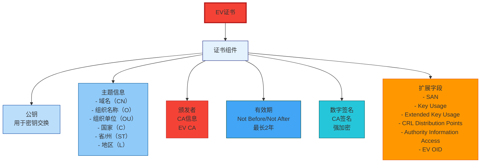

### 1.3 EV证书的信任模型

EV证书依赖于CA的严格验证流程和EV Guidelines，浏览器和操作系统信任主流CA颁发的EV证书，并在浏览器中显示特殊的绿色标识。

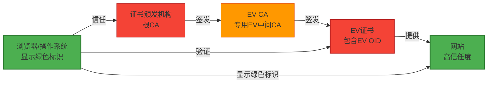

### 1.4 EV证书的浏览器显示

EV证书在浏览器中显示特殊的绿色标识，提供最高的用户信任度。

| 浏览器 | EV证书显示 | 说明 |
|--------|-----------|------|
| **Chrome** | 锁图标 + 组织名称 | 在地址栏显示锁图标和组织名称 |
| **Firefox** | 锁图标 + 组织名称 | 在地址栏显示锁图标和组织名称 |
| **Edge** | 锁图标 + 组织名称 | 在地址栏显示锁图标和组织名称 |
| **Safari** | 锁图标 + 组织名称 | 在地址栏显示锁图标和组织名称 |
| **Opera** | 锁图标 + 组织名称 | 在地址栏显示锁图标和组织名称 |

---

## 2. EV证书技术规范

### 2.1 CA/Browser Forum EV Guidelines

CA/Browser Forum（CA/浏览器论坛）制定了EV证书的专用标准《EV Guidelines》，所有EV证书必须符合该标准。

#### 2.1.1 EV Guidelines版本

| 版本 | 发布日期 | 状态 | 说明 |
|------|----------|------|------|
| **EV Guidelines 1.0** | 2007-06-12 | 已弃用 | 首个EV证书标准 |
| **EV Guidelines 1.1** | 2008-04-21 | 已弃用 | 增加验证要求 |
| **EV Guidelines 1.2** | 2009-07-01 | 已弃用 | 增加运营审查 |
| **EV Guidelines 1.3** | 2011-04-15 | 已弃用 | 增加法律实体验证 |
| **EV Guidelines 1.4** | 2013-06-12 | 已弃用 | 增加证书透明度要求 |
| **EV Guidelines 1.5** | 2015-07-01 | 已弃用 | 增加加密算法要求 |
| **EV Guidelines 1.6** | 2017-03-01 | 已弃用 | 增加TLS 1.2要求 |
| **EV Guidelines 1.7** | 2019-07-01 | 当前版本 | 增加TLS 1.3要求 |
| **EV Guidelines 1.7.1** | 2020-07-01 | 当前版本 | 小幅更新 |
| **EV Guidelines 1.7.2** | 2021-07-01 | 当前版本 | 小幅更新 |
| **EV Guidelines 1.7.3** | 2022-07-01 | 当前版本 | 小幅更新 |
| **EV Guidelines 1.7.4** | 2023-07-01 | 当前版本 | 小幅更新 |
| **EV Guidelines 1.7.5** | 2024-07-01 | 当前版本 | 最新版本 |

#### 2.1.2 EV证书OID

EV证书必须包含特定的对象标识符（OID），用于标识EV证书。

| OID | 说明 | 用途 |
|-----|------|------|
| **1.3.6.1.4.1.311.60.2.1.3** | EV证书OID | 标识EV证书 |
| **2.23.140.1.1** | EV证书OID | 标识EV证书 |
| **2.23.140.1.2.1** | EV证书OID | 标识EV证书 |
| **2.23.140.1.2.2** | EV证书OID | 标识EV证书 |
| **2.23.140.1.2.3** | EV证书OID | 标识EV证书 |

### 2.2 EV证书验证要求

#### 2.2.1 法律实体验证

| 验证项 | 要求 | 验证方式 |
|--------|------|----------|
| **组织存在性** | 必须验证 | 政府数据库、商业注册查询 |
| **组织身份** | 必须验证 | 组织名称、注册号、注册地址 |
| **组织类型** | 必须验证 | 公司、非营利组织、政府机构等 |
| **组织状态** | 必须验证 | 活跃、非活跃、已注销 |
| **组织地址** | 必须验证 | 注册地址、经营地址 |
| **组织电话** | 必须验证 | 电话验证 |
| **组织邮箱** | 必须验证 | 邮箱验证 |

#### 2.2.2 运营审查

| 审查项 | 要求 | 审查方式 |
|--------|------|----------|
| **运营历史** | 至少3年 | 查询运营记录 |
| **财务状况** | 财务健康 | 查询财务报告 |
| **信用记录** | 良好信用 | 查询信用报告 |
| **法律纠纷** | 无重大纠纷 | 查询法律记录 |
| **合规性** | 符合法规 | 查询合规记录 |

#### 2.2.3 申请人验证

| 验证项 | 要求 | 验证方式 |
|--------|------|----------|
| **申请人身份** | 必须验证 | 身份证、护照 |
| **申请人职务** | 必须验证 | 职务证明 |
| **申请人权限** | 必须验证 | 授权书、董事会决议 |
| **申请人联系方式** | 必须验证 | 电话验证、邮箱验证 |

### 2.3 EV证书加密要求

#### 2.3.1 密钥长度要求

| 算法 | 最小密钥长度 | 推荐密钥长度 | 说明 |
|------|-------------|-------------|------|
| **RSA** | 2048位 | 4096位 | 必须使用2048位或以上 |
| **ECDSA** | P-256 | P-384 | 必须使用P-256或以上 |
| **Ed25519** | 256位 | 256位 | 推荐使用 |

#### 2.3.2 签名算法要求

| 算法 | 最小哈希长度 | 推荐哈希长度 | 说明 |
|------|-------------|-------------|------|
| **RSA** | SHA-256 | SHA-384 | 必须使用SHA-256或以上 |
| **ECDSA** | SHA-256 | SHA-384 | 必须使用SHA-256或以上 |
| **Ed25519** | SHA-512 | SHA-512 | 推荐使用 |

#### 2.3.3 证书有效期要求

| 证书类型 | 最大有效期 | 推荐有效期 | 说明 |
|----------|-----------|-------------|------|
| **EV证书** | 825天（约27个月） | 1年 | 必须符合CA/Browser Forum要求 |
| **EV通配符证书** | 825天（约27个月） | 1年 | 必须符合CA/Browser Forum要求 |

### 2.4 EV证书扩展字段

#### 2.4.1 必需扩展字段

| 扩展字段 | 说明 | 是否必需 |
|----------|------|----------|
| **Subject Alternative Name (SAN)** | 主题备用名称 | 必需 |
| **Key Usage** | 密钥用法 | 必需 |
| **Extended Key Usage** | 扩展密钥用法 | 必需 |
| **CRL Distribution Points** | CRL分发点 | 必需 |
| **Authority Information Access** | 颁发者信息访问 | 必需 |
| **Basic Constraints** | 基本约束 | 必需 |
| **Subject Key Identifier** | 主题密钥标识符 | 必需 |
| **Authority Key Identifier** | 颁发者密钥标识符 | 必需 |
| **EV OID** | EV证书标识符 | 必需 |
| **Certificate Policies** | 证书策略 | 必需 |

#### 2.4.2 证书策略

| OID | 说明 | 用途 |
|-----|------|------|
| **2.23.140.1.1** | EV证书策略 | 标识EV证书 |
| **2.23.140.1.2.1** | EV证书策略 | 标识EV证书 |
| **2.23.140.1.2.2** | EV证书策略 | 标识EV证书 |
| **2.23.140.1.2.3** | EV证书策略 | 标识EV证书 |

---

## 3. EV证书验证标准

### 3.1 法律实体验证流程

#### 3.1.1 验证流程

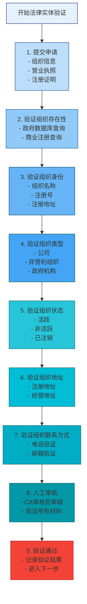

#### 3.1.2 验证方法

| 验证方法 | 说明 | 适用地区 |
|----------|------|----------|
| **政府数据库查询** | 查询政府注册数据库 | 全球 |
| **商业注册查询** | 查询商业注册数据库 | 全球 |
| **第三方数据库** | 使用第三方数据库服务 | 全球 |
| **人工验证** | CA审核员人工验证 | 全球 |
| **实地考察** | CA审核员实地考察 | 特定情况 |

### 3.2 运营审查流程

#### 3.2.1 审查流程

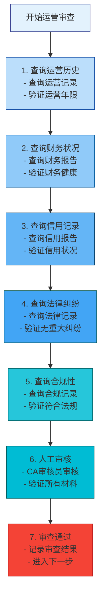

#### 3.2.2 审查标准

| 审查项 | 标准 | 说明 |
|--------|------|------|
| **运营历史** | 至少3年 | 必须有3年以上运营记录 |
| **财务状况** | 财务健康 | 必须有良好的财务状况 |
| **信用记录** | 良好信用 | 必须有良好的信用记录 |
| **法律纠纷** | 无重大纠纷 | 不能有重大法律纠纷 |
| **合规性** | 符合法规 | 必须符合相关法规 |

### 3.3 申请人验证流程

#### 3.3.1 验证流程

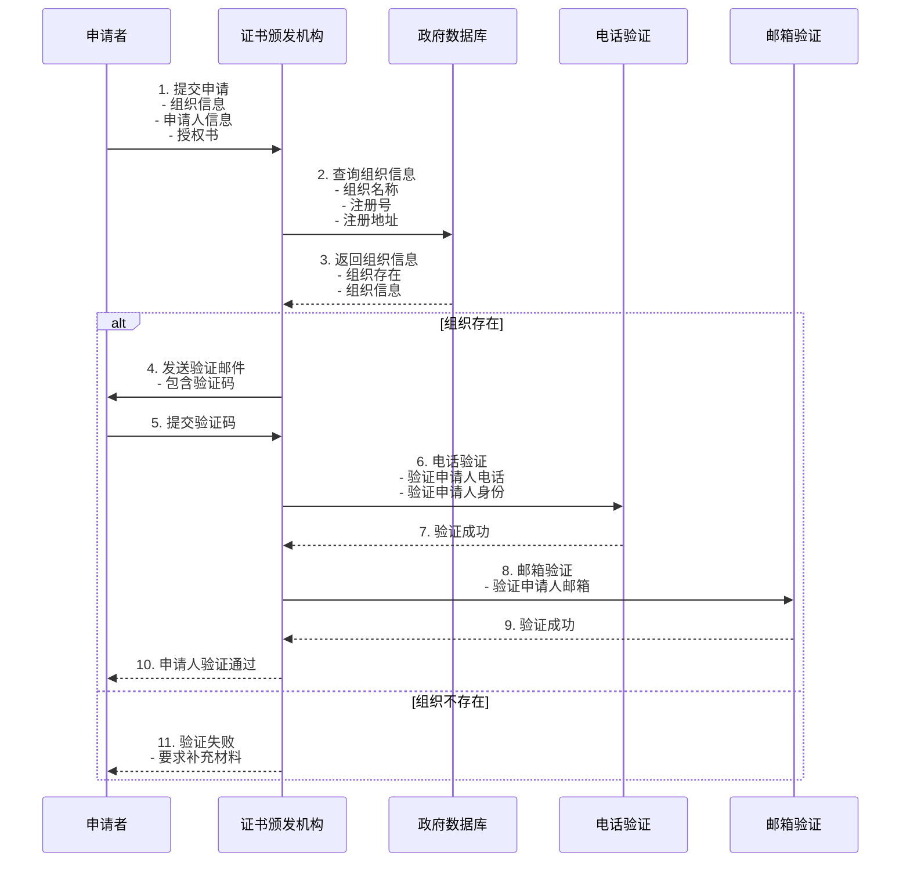

#### 3.3.2 验证方法

| 验证方法 | 说明 | 适用场景 |
|----------|------|----------|
| **身份证验证** | 验证申请人身份证 | 所有场景 |
| **护照验证** | 验证申请人护照 | 国际场景 |
| **职务证明验证** | 验证申请人职务 | 所有场景 |
| **授权书验证** | 验证申请人授权 | 所有场景 |
| **董事会决议验证** | 验证董事会决议 | 企业场景 |
| **电话验证** | 电话确认申请人身份 | 所有场景 |
| **邮箱验证** | 邮箱确认申请人身份 | 所有场景 |

### 3.4 域名所有权验证

#### 3.4.1 验证方式

| 验证方式 | 说明 | 优点 | 缺点 |
|----------|------|------|------|
| **DNS TXT记录验证** | 在DNS中添加TXT记录 | 快速、简单 | 需要DNS管理权限 |
| **HTTP文件验证** | 在网站根目录放置验证文件 | 快速、简单 | 需要Web服务器 |
| **邮箱验证** | 向域名管理员邮箱发送验证邮件 | 安全 | 需要邮箱访问权限 |
| **WHOIS验证** | 验证WHOIS信息 | 简单 | WHOIS隐私保护 |

#### 3.4.2 验证流程

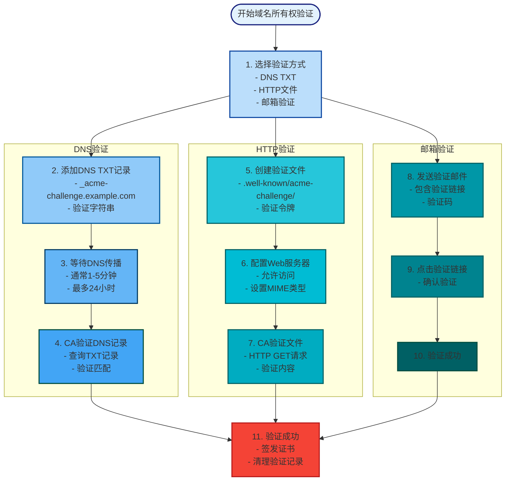

---

## 4. EV证书申请流程

### 4.1 申请前准备

#### 4.1.1 准备材料清单

| 材料类型 | 说明 | 格式要求 |
|----------|------|----------|
| **营业执照** | 组织注册证明 | PDF/JPG，清晰可读，彩色扫描 |
| **组织代码证** | 组织唯一标识 | PDF/JPG，清晰可读，彩色扫描 |
| **税务登记证** | 税务登记证明 | PDF/JPG，清晰可读，彩色扫描 |
| **组织章程** | 组织章程文件 | PDF，加盖公章 |
| **申请人身份证** | 申请人身份证明 | PDF/JPG，清晰可读，彩色扫描 |
| **申请人护照** | 申请人护照（国际） | PDF/JPG，清晰可读，彩色扫描 |
| **授权书** | 申请授权证明 | PDF，加盖公章 |
| **董事会决议** | 董事会决议（企业） | PDF，加盖公章 |
| **域名注册信息** | 域名WHOIS信息 | 截图或PDF |
| **联系方式证明** | 电话、邮箱、地址证明 | 营业执照或账单 |
| **财务报告** | 财务报告（运营审查） | PDF，加盖公章 |
| **信用报告** | 信用报告（运营审查） | PDF |

#### 4.1.2 技术准备

**服务器准备**：
- [ ] 确保Web服务器正常运行
- [ ] 配置正确的防火墙规则
- [ ] 确保端口80和443可访问
- [ ] 准备网站根目录
- [ ] 配置TLS 1.2和TLS 1.3支持

**域名准备**：
- [ ] 确保域名DNS解析正常
- [ ] 确保域名WHOIS信息准确
- [ ] 准备域名管理员邮箱
- [ ] 确认域名未过期
- [ ] 确认域名注册信息与组织信息一致

**证书准备**：
- [ ] 生成CSR（证书签名请求）
- [ ] 准备私钥文件
- [ ] 选择加密算法（RSA 4096或ECDSA P-384）
- [ ] 选择签名算法（SHA-384或SHA-512）

### 4.2 生成CSR

#### 4.2.1 使用OpenSSL生成CSR

**生成RSA密钥和CSR**：
```bash
# 生成4096位RSA私钥（EV证书推荐）
openssl genrsa -out www.example.com.key 4096

# 生成CSR
openssl req -new -key www.example.com.key -out www.example.com.csr

# 生成CSR（包含SAN）
openssl req -new -key www.example.com.key -out www.example.com.csr -config openssl.cnf
```

**生成ECDSA密钥和CSR**：
```bash
# 生成P-384椭圆曲线私钥（EV证书推荐）
openssl ecparam -genkey -name secp384r1 -out www.example.com.key

# 生成CSR
openssl req -new -key www.example.com.key -out www.example.com.csr

# 生成CSR（包含SAN）
openssl req -new -key www.example.com.key -out www.example.com.csr -config openssl.cnf
```

**OpenSSL配置文件（openssl.cnf）**：
```ini
[req]
default_bits = 4096
default_md = sha384
distinguished_name = req_distinguished_name
req_extensions = v3_req

[req_distinguished_name]
countryName = Country Name (2 letter code)
stateOrProvinceName = State or Province Name (full name)
localityName = Locality Name (eg, city)
organizationName = Organization Name (eg, company)
organizationalUnitName = Organizational Unit Name (eg, section)
commonName = Common Name (eg, server FQDN or YOUR name)
emailAddress = Email Address

[v3_req]
subjectAltName = @alt_names

[alt_names]
DNS.1 = www.example.com
DNS.2 = example.com
DNS.3 = mail.example.com
```

#### 4.2.2 CSR信息填写

**CSR信息示例**：
```bash
Country Name (2 letter code) [AU]:CN
State or Province Name (full name) [Some-State]:Beijing
Locality Name (eg, city) []:Beijing
Organization Name (eg, company) [Internet Widgits Pty Ltd]:Example Company Ltd
Organizational Unit Name (eg, section) []:IT Department
Common Name (e.g. server FQDN or YOUR name) []:www.example.com
Email Address []:admin@example.com

Please enter the following 'extra' attributes
to be sent with your certificate request
A challenge password []:
An optional company name []:
```

**注意事项**：
- **Common Name (CN)**：必须与域名完全匹配
- **Organization Name (O)**：必须与营业执照上的组织名称完全一致
- **Country Name (C)**：使用ISO 3166-1 alpha-2国家代码（中国为CN）
- **State/Province Name (ST)**：使用省份或州的全称
- **Locality Name (L)**：使用城市名称
- **Organizational Unit Name (OU)**：可选，通常为部门名称
- **Challenge Password**：留空
- **Optional Company Name**：留空

#### 4.2.3 验证CSR

**查看CSR信息**：
```bash
# 查看CSR详细信息
openssl req -in www.example.com.csr -noout -text

# 查看CSR主题信息
openssl req -in www.example.com.csr -noout -subject

# 验证CSR签名
openssl req -in www.example.com.csr -noout -verify -verbose

# 查看CSR的SAN
openssl req -in www.example.com.csr -noout -text | grep -A 1 "Subject Alternative Name"
```

### 4.3 提交申请

#### 4.3.1 在线申请流程

```mermaid
graph TD
    Start[开始EV证书申请]
    
    Step1["1. 选择CA<br/>- 比较不同CA<br/>- 选择适合的CA"]
    Step2["2. 注册账户<br/>- 填写组织信息<br/>- 验证邮箱"]
    Step3["3. 选择证书类型<br/>- 选择EV证书<br/>- 选择证书有效期"]
    Step4["4. 提交CSR<br/>- 上传CSR文件<br/>- 填写域名信息"]
    Step5["5. 上传材料<br/>- 营业执照<br/>- 组织代码证<br/>- 税务登记证<br/>- 组织章程<br/>- 身份证<br/>- 授权书<br/>- 董事会决议<br/>- 财务报告<br/>- 信用报告"]
    Step6["6. 填写联系人信息<br/>- 技术联系人<br/>- 验证联系人<br/>- 账单联系人"]
    Step7["7. 填写组织信息<br/>- 组织名称<br/>- 注册号<br/>- 注册地址<br/>- 经营地址<br/>- 联系电话<br/>- 联系邮箱"]
    Step8["8. 支付费用<br/>- 选择支付方式<br/>- 完成支付"]
    Step9["9. 等待验证<br/>- 法律实体验证<br/>- 运营审查<br/>- 申请人验证<br/>- 域名验证"]
    Step10["10. 人工审核<br/>- CA审核员审核<br/>- 可能需要补充材料"]
    Step11["11. 签发证书<br/>- 下载证书<br/>- 下载证书链"]
    
    Start --> Step1
    Step1 --> Step2
    Step2 --> Step3
    Step3 --> Step4
    Step4 --> Step5
    Step5 --> Step6
    Step6 --> Step7
    Step7 --> Step8
    Step8 --> Step9
    Step9 --> Step10
    Step10 --> Step11
    
    style Start fill:#e3f2fd,stroke:#1a237e
    style Step1 fill:#bbdefb,stroke:#0d47a1
    style Step2 fill:#90caf9,stroke:#01579b
    style Step3 fill:#64b5f6,stroke:#013a63
    style Step4 fill:#42a5f5,stroke:#004d40
    style Step5 fill:#26c6da,stroke:#006064
    style Step6 fill:#00bcd4,stroke:#006064
    style Step7 fill:#00acc1,stroke:#006064
    style Step8 fill:#0097a7,stroke:#006064
    style Step9 fill:#00838f,stroke:#006064
    style Step10 fill:#006064,stroke:#004d40
    style Step11 fill:#f44336,stroke:#b71c1c
```

#### 4.3.2 申请表填写

**组织信息**：
| 字段 | 说明 | 示例 | 要求 |
|------|------|------|------|
| **组织名称** | 必须与营业执照完全一致 | Example Company Ltd | 必需 |
| **组织类型** | 公司、非营利组织等 | Corporation | 必需 |
| **注册号** | 组织注册号 | 12345678901234567890 | 必需 |
| **注册地址** | 组织注册地址 | No. 123, Main Street, Beijing, China | 必需 |
| **经营地址** | 组织经营地址 | No. 123, Main Street, Beijing, China | 必需 |
| **联系电话** | 组织联系电话 | +86-10-12345678 | 必需 |
| **联系邮箱** | 组织联系邮箱 | admin@example.com | 必需 |
| **成立日期** | 组织成立日期 | 2010-01-01 | 必需 |
| **运营年限** | 组织运营年限 | 13年 | 必需 |

**域名信息**：
| 字段 | 说明 | 示例 | 要求 |
|------|------|------|------|
| **主域名** | 主要域名 | www.example.com | 必需 |
| **SAN域名** | 主题备用名称 | example.com, mail.example.com | 可选 |
| **通配符域名** | 通配符证书 | *.example.com | 可选 |

**联系人信息**：
| 字段 | 说明 | 示例 | 要求 |
|------|------|------|------|
| **技术联系人** | 技术负责人 | John Doe | 必需 |
| **技术联系人邮箱** | 技术负责人邮箱 | john.doe@example.com | 必需 |
| **技术联系人电话** | 技术负责人电话 | +86-138-0000-0000 | 必需 |
| **验证联系人** | 验证负责人 | Jane Smith | 必需 |
| **验证联系人邮箱** | 验证负责人邮箱 | jane.smith@example.com | 必需 |
| **验证联系人电话** | 验证负责人电话 | +86-139-0000-0000 | 必需 |
| **账单联系人** | 账单负责人 | Bob Johnson | 必需 |
| **账单联系人邮箱** | 账单负责人邮箱 | bob.johnson@example.com | 必需 |

### 4.4 验证过程

#### 4.4.1 法律实体验证

**验证流程**：
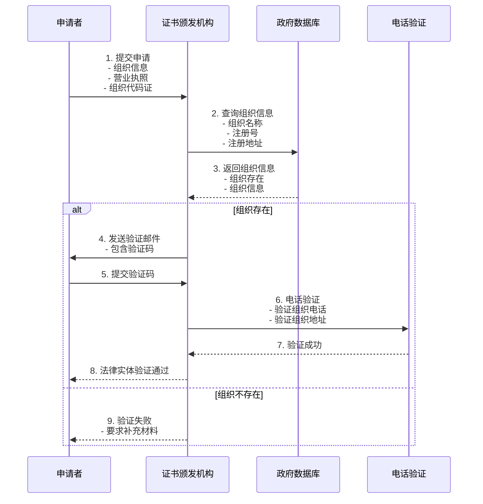

#### 4.4.2 运营审查

**审查流程**：
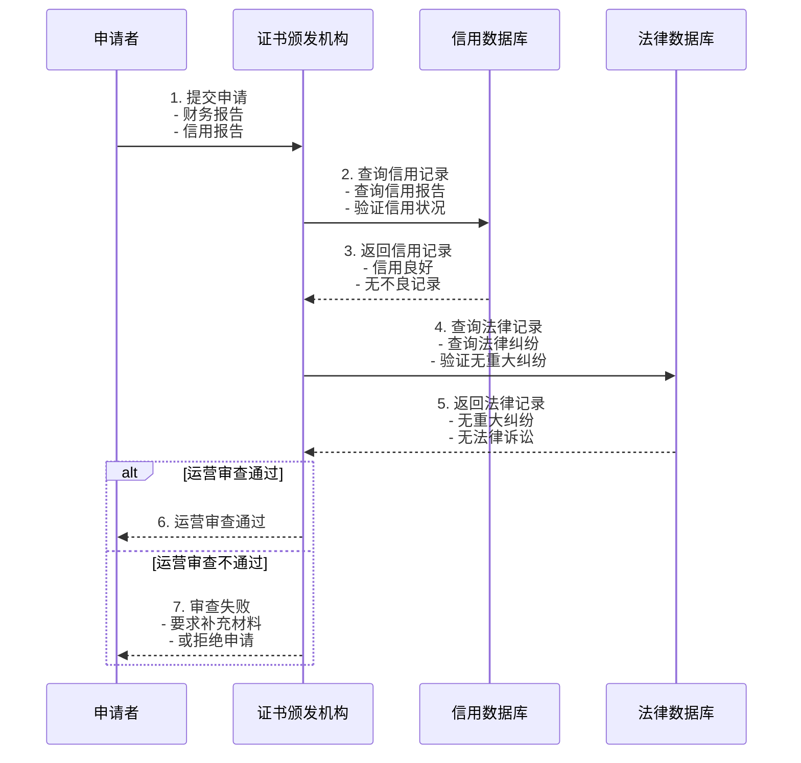

#### 4.4.3 申请人验证

**验证流程**：
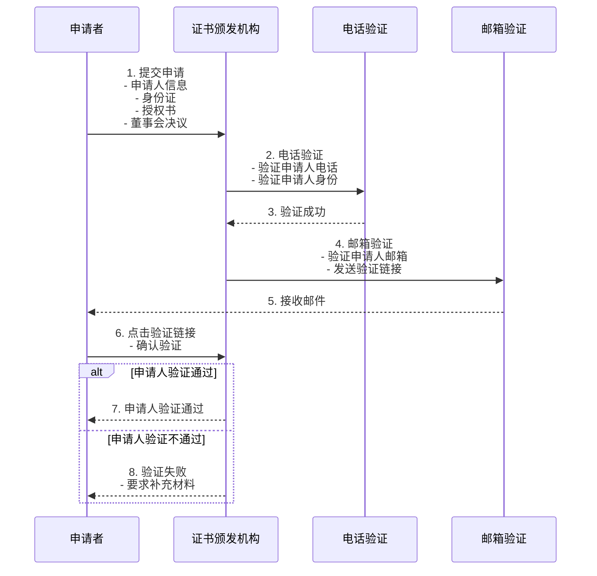

#### 4.4.4 域名所有权验证

**验证方式选择**：

| 验证方式 | 说明 | 优点 | 缺点 | 推荐场景 |
|----------|------|------|------|----------|
| **DNS TXT记录验证** | 在DNS中添加TXT记录 | 快速、简单 | 需要DNS管理权限 | 大多数场景 |
| **HTTP文件验证** | 在网站根目录放置验证文件 | 快速、简单 | 需要Web服务器 | 大多数场景 |
| **邮箱验证** | 向域名管理员邮箱发送验证邮件 | 安全 | 需要邮箱访问权限 | 特定场景 |

**DNS TXT记录验证**：
```bash
# 1. CA提供验证字符串
# 验证字符串示例: 2023-01-01T12:00:00Z.example.com.abc123def456

# 2. 添加DNS TXT记录
# 主机记录: _acme-challenge
# 记录类型: TXT
# 记录值: 2023-01-01T12:00:00Z.example.com.abc123def456

# 3. 使用命令行添加DNS记录（以Cloudflare为例）
# 安装cloudflare-cli
pip install cloudflare-cli

# 配置API密钥
export CF_API_EMAIL="your-email@example.com"
export CF_API_KEY="your-api-key"

# 添加TXT记录
cf-cli dns add example.com TXT "_acme-challenge" "2023-01-01T12:00:00Z.example.com.abc123def456"

# 4. 验证DNS记录
dig TXT _acme-challenge.example.com

# 5. 等待DNS传播（通常1-5分钟）
for i in {1..10}; do
    dig TXT _acme-challenge.example.com +short
    sleep 10
done
```

**HTTP文件验证**：
```bash
# 1. CA提供验证文件
# 文件路径: .well-known/acme-challenge/token
# 文件内容: 验证字符串

# 2. 创建验证目录
mkdir -p /var/www/html/.well-known/acme-challenge

# 3. 创建验证文件
echo "验证字符串" > /var/www/html/.well-known/acme-challenge/token

# 4. 设置文件权限
chmod 644 /var/www/html/.well-known/acme-challenge/token

# 5. 配置Web服务器（Nginx）
# 在Nginx配置中添加：
location /.well-known/acme-challenge/ {
    root /var/www/html;
    try_files $uri =404;
    add_header Content-Type text/plain;
}

# 6. 重载Nginx
nginx -s reload

# 7. 测试访问
curl http://www.example.com/.well-known/acme-challenge/token
```

### 4.5 证书签发

#### 4.5.1 签发流程

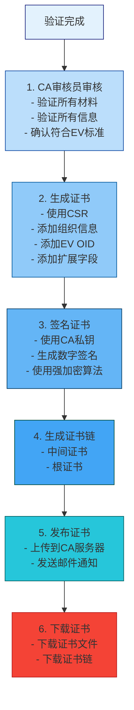

#### 4.5.2 证书文件

| 文件 | 说明 | 格式 |
|------|------|------|
| **www.example.com.crt** | 服务器证书 | PEM |
| **www.example.com.key** | 私钥文件 | PEM |
| **ca-bundle.crt** | 证书链（中间证书） | PEM |
| **fullchain.crt** | 完整证书链（服务器证书+中间证书） | PEM |

---

## 5. EV证书安全特性

### 5.1 严格的验证流程

#### 5.1.1 验证优势

| 安全特性 | 说明 | 优势 |
|----------|------|------|
| **法律实体验证** | 验证组织真实存在 | 防止虚假网站 |
| **组织身份验证** | 验证组织身份信息 | 提高用户信任度 |
| **组织权限验证** | 验证申请人权限 | 防止未授权申请 |
| **联系方式验证** | 验证联系方式 | 确保可联系 |
| **运营审查** | 审查运营历史和财务状况 | 确保组织健康 |
| **信用审查** | 审查信用记录 | 确保信用良好 |
| **法律审查** | 审查法律纠纷 | 确保无重大纠纷 |

#### 5.1.2 验证流程

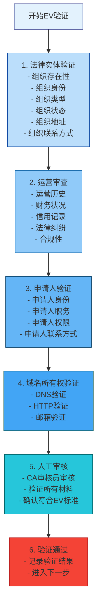

### 5.2 强加密算法

#### 5.2.1 加密算法要求

| 算法 | 最小要求 | 推荐要求 | 说明 |
|------|----------|----------|------|
| **RSA密钥长度** | 2048位 | 4096位 | 必须使用2048位或以上 |
| **ECDSA密钥长度** | P-256 | P-384 | 必须使用P-256或以上 |
| **签名算法** | SHA-256 | SHA-384 | 必须使用SHA-256或以上 |
| **TLS版本** | TLS 1.2 | TLS 1.3 | 必须支持TLS 1.2或以上 |

#### 5.2.2 加密套件

| 加密套件 | 密钥交换 | 加密算法 | 哈希算法 | 推荐度 |
|----------|----------|----------|----------|--------|
| **TLS_ECDHE_ECDSA_WITH_AES_128_GCM_SHA256** | ECDHE | AES-128-GCM | SHA256 | ⭐⭐⭐⭐⭐ |
| **TLS_ECDHE_ECDSA_WITH_AES_256_GCM_SHA384** | ECDHE | AES-256-GCM | SHA384 | ⭐⭐⭐⭐⭐ |
| **TLS_ECDHE_RSA_WITH_AES_128_GCM_SHA256** | ECDHE | AES-128-GCM | SHA256 | ⭐⭐⭐⭐⭐ |
| **TLS_ECDHE_RSA_WITH_AES_256_GCM_SHA384** | ECDHE | AES-256-GCM | SHA384 | ⭐⭐⭐⭐⭐ |
| **TLS_AES_128_GCM_SHA256** | (TLS 1.3) | AES-128-GCM | SHA256 | ⭐⭐⭐⭐⭐ |
| **TLS_AES_256_GCM_SHA384** | (TLS 1.3) | AES-256-GCM | SHA384 | ⭐⭐⭐⭐⭐ |
| **TLS_CHACHA20_POLY1305_SHA256** | (TLS 1.3) | ChaCha20-Poly1305 | SHA256 | ⭐⭐⭐⭐⭐ |

### 5.3 证书透明度

#### 5.3.1 CT日志

| CT日志 | 运营商 | URL |
|--------|--------|-----|
| **Google 'Argon2024'** | Google | https://ct.googleapis.com/logs/argon2024/ |
| **Google 'Argon2025'** | Google | https://ct.googleapis.com/logs/argon2025/ |
| **DigiCert Yeti2024** | DigiCert | https://ct.googleapis.com/logs/yeti2024/ |
| **Cloudflare 'Nimbus2024'** | Cloudflare | https://ct.cloudflare.com/logs/nimbus2024/ |

#### 5.3.2 CT监控

**监控脚本**：
```bash
#!/bin/bash
# ct-monitor.sh

DOMAIN="www.example.com"
CT_LOGS=(
    "https://ct.googleapis.com/logs/argon2024/"
    "https://ct.googleapis.com/logs/argon2025/"
)

# 检查证书是否在CT日志中
check_ct_log() {
    local ct_log="$1"
    local cert_file="/etc/ssl/certs/$DOMAIN.crt"
    
    echo "检查CT日志: $ct_log"
    
    # 获取证书的SCT（Signed Certificate Timestamp）
    local sct=$(openssl x509 -in "$cert_file" -noout -text | grep -A 1 "Signed Certificate Timestamp")
    
    if [ -z "$sct" ]; then
        echo "警告: 证书没有SCT"
        return 1
    fi
    
    echo "证书包含SCT"
    return 0
}

# 主函数
main() {
    for ct_log in "${CT_LOGS[@]}"; do
        check_ct_log "$ct_log"
    done
}

# 执行主函数
main
```

### 5.4 OCSP Stapling

#### 5.4.1 OCSP Stapling优势

| 优势 | 说明 |
|------|------|
| **提高性能** | 减少OCSP查询延迟 |
| **保护隐私** | 不暴露客户端IP |
| **提高可靠性** | 减少OCSP服务器负载 |

#### 5.4.2 配置OCSP Stapling

**Nginx配置**：
```nginx
# OCSP Stapling配置
ssl_stapling on;
ssl_stapling_verify on;
ssl_trusted_certificate /etc/ssl/certs/ca-bundle.crt;
resolver 8.8.8.8 8.8.4.4 valid=300s;
resolver_timeout 5s;
```

**Apache配置**：
```apache
# OCSP Stapling配置
SSLUseStapling on
SSLStaplingCache shmcb:/var/run/apache2/ocsp(128000)
SSLStaplingResponderTimeout 5
SSLStaplingReturnResponderErrors off
```

---

## 6. EV证书配置要求

### 6.1 服务器配置要求

#### 6.1.1 TLS协议要求

| 协议 | 要求 | 说明 |
|------|------|------|
| **TLS 1.0** | ❌ 禁用 | 已弃用，不安全 |
| **TLS 1.1** | ❌ 禁用 | 已弃用，不安全 |
| **TLS 1.2** | ✅ 启用 | 必须支持 |
| **TLS 1.3** | ✅ 推荐 | 推荐使用 |

#### 6.1.2 加密套件要求

| 加密套件 | 要求 | 说明 |
|----------|------|------|
| **弱加密套件** | ❌ 禁用 | 如RC4、DES、3DES等 |
| **中等加密套件** | ⚠️ 不推荐 | 如AES-128-CBC |
| **强加密套件** | ✅ 推荐 | 如AES-256-GCM、ChaCha20-Poly1305 |

#### 6.1.3 HSTS要求

| HSTS配置 | 要求 | 说明 |
|----------|------|------|
| **Strict-Transport-Security** | ✅ 必需 | 强制HTTPS连接 |
| **max-age** | ≥ 31536000 | 至少1年 |
| **includeSubDomains** | ✅ 推荐 | 包含所有子域名 |
| **preload** | ✅ 推荐 | 预加载到HSTS列表 |

### 6.2 Nginx配置

#### 6.2.1 基本配置

```nginx
server {
    listen 443 ssl http2;
    server_name www.example.com;

    # EV证书配置
    ssl_certificate /etc/ssl/certs/www.example.com.crt;
    ssl_certificate_key /etc/ssl/private/www.example.com.key;
    ssl_trusted_certificate /etc/ssl/certs/ca-bundle.crt;

    # SSL协议和加密套件
    ssl_protocols TLSv1.2 TLSv1.3;
    ssl_ciphers 'ECDHE-ECDSA-AES128-GCM-SHA256:ECDHE-RSA-AES128-GCM-SHA256:ECDHE-ECDSA-AES256-GCM-SHA384:ECDHE-RSA-AES256-GCM-SHA384';
    ssl_prefer_server_ciphers off;

    # SSL会话配置
    ssl_session_cache shared:SSL:10m;
    ssl_session_timeout 10m;
    ssl_session_tickets off;

    # OCSP Stapling
    ssl_stapling on;
    ssl_stapling_verify on;
    resolver 8.8.8.8 8.8.4.4 valid=300s;
    resolver_timeout 5s;

    # 安全头
    add_header Strict-Transport-Security "max-age=31536000; includeSubDomains; preload" always;
    add_header X-Frame-Options "SAMEORIGIN" always;
    add_header X-Content-Type-Options "nosniff" always;
    add_header X-XSS-Protection "1; mode=block" always;
    add_header Content-Security-Policy "default-src 'self'" always;

    # 日志配置
    access_log /var/log/nginx/access.log;
    error_log /var/log/nginx/error.log;

    # 网站根目录
    root /var/www/html;
    index index.html;
}

# HTTP服务器配置（重定向到HTTPS）
server {
    listen 80;
    server_name www.example.com;

    location / {
        return 301 https://$host$request_uri;
    }
}
```

#### 6.2.2 多域名配置

```nginx
server {
    listen 443 ssl http2;
    server_name www.example.com example.com mail.example.com;

    # EV证书配置（使用SAN证书）
    ssl_certificate /etc/ssl/certs/example.com.crt;
    ssl_certificate_key /etc/ssl/private/example.com.key;
    ssl_trusted_certificate /etc/ssl/certs/ca-bundle.crt;

    # 其他配置...
}
```

### 6.3 Apache配置

#### 6.3.1 基本配置

```apache
<VirtualHost *:443>
    ServerName www.example.com

    # 启用SSL
    SSLEngine on

    # EV证书配置
    SSLCertificateFile /etc/ssl/certs/www.example.com.crt
    SSLCertificateKeyFile /etc/ssl/private/www.example.com.key
    SSLCertificateChainFile /etc/ssl/certs/ca-bundle.crt

    # SSL协议和加密套件
    SSLProtocol all -SSLv2 -SSLv3 -TLSv1 -TLSv1.1
    SSLCipherSuite ECDHE-ECDSA-AES128-GCM-SHA256:ECDHE-RSA-AES128-GCM-SHA256:ECDHE-ECDSA-AES256-GCM-SHA384:ECDHE-RSA-AES256-GCM-SHA384
    SSLHonorCipherOrder off

    # SSL会话配置
    SSLSessionCache shmcb:/var/run/apache2/ssl_scache(512000)
    SSLSessionCacheTimeout 300
    SSLSessionTickets off

    # OCSP Stapling
    SSLUseStapling on
    SSLStaplingCache shmcb:/var/run/apache2/ocsp(128000)
    SSLStaplingResponderTimeout 5
    SSLStaplingReturnResponderErrors off

    # 安全头
    Header always set Strict-Transport-Security "max-age=31536000; includeSubDomains; preload"
    Header always set X-Frame-Options "SAMEORIGIN"
    Header always set X-Content-Type-Options "nosniff"
    Header always set X-XSS-Protection "1; mode=block"
    Header always set Content-Security-Policy "default-src 'self'"

    # 日志配置
    ErrorLog ${APACHE_LOG_DIR}/error.log
    CustomLog ${APACHE_LOG_DIR}/access.log combined

    # 网站根目录
    DocumentRoot /var/www/html
    DirectoryIndex index.html
</VirtualHost>

# HTTP服务器配置（重定向到HTTPS）
<VirtualHost *:80>
    ServerName www.example.com

    RewriteEngine on
    RewriteCond %{HTTPS} off
    RewriteRule ^(.*)$ https://%{HTTP_HOST}%{REQUEST_URI} [L,R=301]
</VirtualHost>
```

### 6.4 Python应用配置

#### 6.4.1 使用SSL上下文

```python
import ssl
import asyncio
from aiohttp import web

async def handle_request(request):
    """处理请求"""
    return web.Response(text="Hello, secure world!")

async def create_server():
    """创建TLS服务器"""
    # 加载EV证书
    ssl_context = ssl.create_default_context(ssl.Purpose.CLIENT_AUTH)
    ssl_context.load_cert_chain(
        certfile='/etc/ssl/certs/www.example.com.crt',
        keyfile='/etc/ssl/private/www.example.com.key'
    )
    
    # 配置强加密套件
    ssl_context.set_ciphers('ECDHE-ECDSA-AES128-GCM-SHA256:ECDHE-RSA-AES128-GCM-SHA256')
    ssl_context.set_ecdh_curve('prime256v1')
    
    # 创建应用
    app = web.Application()
    app.router.add_get('/', handle_request)
    
    # 启动服务器
    runner = web.AppRunner(app)
    await runner.setup()
    site = web.TCPSite(runner, '0.0.0.0', 443, ssl_context=ssl_context)
    await site.start()
    
    print("TLS服务器已启动在端口443")

if __name__ == '__main__':
    asyncio.run(create_server())
```

---

## 7. EV证书兼容性信息

### 7.1 浏览器兼容性

#### 7.1.1 主流浏览器支持

| 浏览器 | 版本 | EV证书支持 | 绿色标识 |
|--------|------|-----------|----------|
| **Chrome** | 1.0+ | ✅ 支持 | ✅ 显示 |
| **Firefox** | 2.0+ | ✅ 支持 | ✅ 显示 |
| **Edge** | 12+ | ✅ 支持 | ✅ 显示 |
| **Safari** | 3.2+ | ✅ 支持 | ✅ 显示 |
| **Opera** | 9.5+ | ✅ 支持 | ✅ 显示 |

#### 7.1.2 移动浏览器支持

| 浏览器 | 版本 | EV证书支持 | 绿色标识 |
|--------|------|-----------|----------|
| **Chrome Mobile** | 18+ | ✅ 支持 | ✅ 显示 |
| **Firefox Mobile** | 4+ | ✅ 支持 | ✅ 显示 |
| **Safari iOS** | 3.2+ | ✅ 支持 | ✅ 显示 |
| **Opera Mini** | 5+ | ✅ 支持 | ⚠️ 部分显示 |
| **UC Browser** | 7+ | ✅ 支持 | ⚠️ 部分显示 |

### 7.2 操作系统兼容性

#### 7.2.1 桌面操作系统

| 操作系统 | 版本 | EV证书支持 | 说明 |
|----------|------|-----------|------|
| **Windows** | XP+ | ✅ 支持 | 需要安装根证书 |
| **macOS** | 10.5+ | ✅ 支持 | 内置支持 |
| **Linux** | 所有发行版 | ✅ 支持 | 需要安装根证书 |
| **Chrome OS** | 所有版本 | ✅ 支持 | 内置支持 |

#### 7.2.2 移动操作系统

| 操作系统 | 版本 | EV证书支持 | 说明 |
|----------|------|-----------|------|
| **iOS** | 3.2+ | ✅ 支持 | 内置支持 |
| **Android** | 2.2+ | ✅ 支持 | 需要安装根证书 |
| **Windows Phone** | 7+ | ✅ 支持 | 内置支持 |

### 7.3 服务器兼容性

#### 7.3.1 Web服务器

| Web服务器 | 版本 | EV证书支持 | 说明 |
|-----------|------|-----------|------|
| **Nginx** | 0.7.14+ | ✅ 支持 | 完全支持 |
| **Apache** | 2.0+ | ✅ 支持 | 完全支持 |
| **IIS** | 6.0+ | ✅ 支持 | 完全支持 |
| **Caddy** | 0.9+ | ✅ 支持 | 完全支持 |
| **Lighttpd** | 1.4+ | ✅ 支持 | 完全支持 |

#### 7.3.2 应用服务器

| 应用服务器 | 版本 | EV证书支持 | 说明 |
|-----------|------|-----------|------|
| **Tomcat** | 5.5+ | ✅ 支持 | 完全支持 |
| **Jetty** | 6.0+ | ✅ 支持 | 完全支持 |
| **Node.js** | 0.10+ | ✅ 支持 | 完全支持 |
| **Python** | 2.7+/3.4+ | ✅ 支持 | 完全支持 |
| **Java** | 1.5+ | ✅ 支持 | 完全支持 |

---

## 8. EV证书更新与吊销流程

### 8.1 证书更新

#### 8.1.1 更新流程

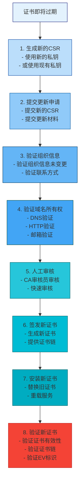

#### 8.1.2 更新脚本

```bash
#!/bin/bash
# ev-cert-renew.sh

set -euo pipefail

# 配置
CERT_DIR="/etc/ssl/certs"
KEY_DIR="/etc/ssl/private"
BACKUP_DIR="/var/backups/ssl"
DOMAIN="www.example.com"
WARNING_DAYS=30

# 颜色定义
RED='\033[0;31m'
GREEN='\033[0;32m'
YELLOW='\033[1;33m'
NC='\033[0m'

# 日志函数
log_info() {
    echo -e "${GREEN}[INFO]${NC} $1"
}

log_warn() {
    echo -e "${YELLOW}[WARN]${NC} $1"
}

log_error() {
    echo -e "${RED}[ERROR]${NC} $1"
}

# 检查证书有效期
check_cert_expiry() {
    local cert_file="$CERT_DIR/$DOMAIN.crt"
    
    if [ ! -f "$cert_file" ]; then
        log_error "证书文件不存在: $cert_file"
        return 1
    fi
    
    # 获取过期时间
    local expiry_date=$(openssl x509 -in "$cert_file" -noout -enddate | cut -d= -f2)
    local expiry_timestamp=$(date -d "$expiry_date" +%s)
    local current_timestamp=$(date +%s)
    local days_left=$(( (expiry_timestamp - current_timestamp) / 86400 ))
    
    log_info "证书过期时间: $expiry_date"
    log_info "剩余天数: $days_left"
    
    if [ $days_left -lt $WARNING_DAYS ]; then
        log_warn "警告: 证书将在 $days_left 天内过期!"
        return 1
    fi
    
    return 0
}

# 备份证书
backup_cert() {
    local timestamp=$(date +%Y%m%d_%H%M%S)
    local backup_dir="$BACKUP_DIR/$DOMAIN_$timestamp"
    
    mkdir -p "$backup_dir"
    
    log_info "备份证书到: $backup_dir"
    cp "$CERT_DIR/$DOMAIN.crt" "$backup_dir/"
    cp "$KEY_DIR/$DOMAIN.key" "$backup_dir/"
    
    log_info "备份完成"
}

# 更新证书
renew_cert() {
    log_info "开始更新证书: $DOMAIN"
    
    # 备份现有证书
    backup_cert
    
    # 生成新的CSR
    log_info "生成新的CSR"
    openssl req -new -key "$KEY_DIR/$DOMAIN.key" -out "$CERT_DIR/$DOMAIN.csr"
    
    # 提交更新申请（需要根据CA的具体流程调整）
    log_info "提交更新申请"
    # 这里需要根据CA的API或流程提交更新申请
    
    # 重载服务
    log_info "重载Nginx服务"
    systemctl reload nginx
    
    log_info "证书更新完成"
}

# 主函数
main() {
    if ! check_cert_expiry; then
        renew_cert
    else
        log_info "证书有效期充足，无需更新"
    fi
}

# 执行主函数
main
```

### 8.2 证书吊销

#### 8.2.1 吊销流程

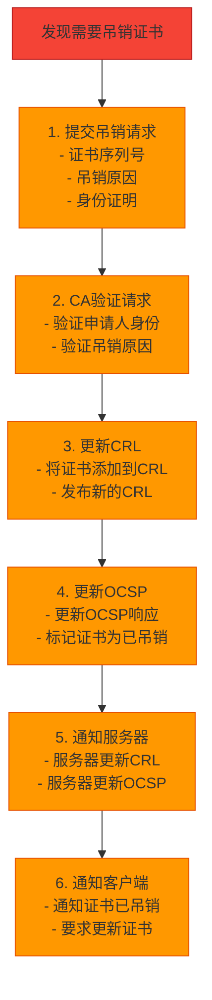

#### 8.2.2 吊销原因

| 吊销原因 | 说明 | 代码 |
|----------|------|------|
| **keyCompromise** | 密钥泄露 | 1 |
| **cACompromise** | CA密钥泄露 | 2 |
| **affiliationChanged** | 关系变更 | 3 |
| **superseded** | 被替代 | 4 |
| **cessationOfOperation** | 停止运营 | 5 |
| **certificateHold** | 证书暂停 | 6 |
| **removeFromCRL** | 从CRL中移除 | 8 |

---

## 9. EV证书应用场景

### 9.1 金融机构

#### 9.1.1 适用性分析

| 场景 | EV证书适用性 | 说明 |
|------|-------------|------|
| **银行网站** | ✅ 必需 | 满足金融监管要求 |
| **证券交易** | ✅ 必需 | 满足金融监管要求 |
| **保险服务** | ✅ 必需 | 满足金融监管要求 |
| **支付平台** | ✅ 必需 | 满足PCI DSS要求 |
| **投资理财** | ✅ 必需 | 满足金融监管要求 |

#### 9.1.2 配置示例

```nginx
server {
    listen 443 ssl http2;
    server_name www.bank.com bank.com;

    # EV证书配置
    ssl_certificate /etc/ssl/certs/bank.com.crt;
    ssl_certificate_key /etc/ssl/private/bank.com.key;
    ssl_trusted_certificate /etc/ssl/certs/ca-bundle.crt;

    # 安全头
    add_header Strict-Transport-Security "max-age=31536000; includeSubDomains; preload" always;
    add_header Content-Security-Policy "default-src 'self'; script-src 'self' 'unsafe-inline'; style-src 'self' 'unsafe-inline'" always;
    add_header X-Content-Type-Options "nosniff" always;
    add_header X-Frame-Options "DENY" always;

    # 其他配置...
}
```

### 9.2 政府网站

#### 9.2.1 适用性分析

| 场景 | EV证书适用性 | 说明 |
|------|-------------|------|
| **政府官网** | ✅ 必需 | 提高政府公信力 |
| **政务服务** | ✅ 必需 | 保护公民信息 |
| **公共安全** | ✅ 必需 | 保护公共安全信息 |
| **税务服务** | ✅ 必需 | 保护税务信息 |
| **社会保障** | ✅ 必需 | 保护社保信息 |

#### 9.2.2 配置示例

```nginx
server {
    listen 443 ssl http2;
    server_name www.gov.cn gov.cn;

    # EV证书配置
    ssl_certificate /etc/ssl/certs/gov.cn.crt;
    ssl_certificate_key /etc/ssl/private/gov.cn.key;
    ssl_trusted_certificate /etc/ssl/certs/ca-bundle.crt;

    # 安全头
    add_header Strict-Transport-Security "max-age=31536000; includeSubDomains; preload" always;
    add_header Content-Security-Policy "default-src 'self'" always;
    add_header X-Content-Type-Options "nosniff" always;
    add_header X-Frame-Options "DENY" always;

    # 其他配置...
}
```

### 9.3 大型企业

#### 9.3.1 适用性分析

| 场景 | EV证书适用性 | 说明 |
|------|-------------|------|
| **企业官网** | ✅ 推荐 | 提高企业公信力 |
| **员工门户** | ✅ 推荐 | 保护员工信息 |
| **客户门户** | ✅ 推荐 | 保护客户信息 |
| **供应链管理** | ✅ 推荐 | 保护供应链信息 |
| **企业邮箱** | ✅ 推荐 | 保护邮件通信 |

#### 9.3.2 配置示例

```nginx
server {
    listen 443 ssl http2;
    server_name www.company.com company.com;

    # EV证书配置
    ssl_certificate /etc/ssl/certs/company.com.crt;
    ssl_certificate_key /etc/ssl/private/company.com.key;
    ssl_trusted_certificate /etc/ssl/certs/ca-bundle.crt;

    # 安全头
    add_header Strict-Transport-Security "max-age=31536000; includeSubDomains; preload" always;
    add_header Content-Security-Policy "default-src 'self'" always;
    add_header X-Content-Type-Options "nosniff" always;
    add_header X-Frame-Options "SAMEORIGIN" always;

    # 其他配置...
}
```

---

## 10. EV证书与其他证书类型对比

### 10.1 验证级别对比

| 特性 | DV | OV | EV |
|------|----|----|----|
| **验证级别** | 域名验证 | 组织验证 | 扩展验证 |
| **验证内容** | 域名所有权 | 组织真实性 + 域名所有权 | 组织真实性 + 域名所有权 + 运营审查 |
| **验证时间** | 分钟-小时 | 1-3天 | 3-7天 |
| **验证方式** | 自动化 | 人工审核 | 严格人工审核 |
| **成本** | 免费/低 | 中等 | 高 |
| **信任度** | 基础 | 较高 | 最高 |
| **浏览器显示** | 锁图标 | 锁图标 + 组织名称 | 锁图标 + 组织名称 + 绿色 |
| **适用场景** | 个人网站、测试环境 | 企业网站、电商平台 | 金融机构、政府网站、大型企业 |

### 10.2 证书内容对比

| 字段 | DV | OV | EV |
|------|----|----|----|
| **CN（通用名称）** | 域名 | 域名 | 域名 |
| **O（组织名称）** | 无 | 有 | 有 |
| **OU（组织单位）** | 无 | 可选 | 有 |
| **C（国家）** | 无 | 有 | 有 |
| **ST（省/州）** | 无 | 有 | 有 |
| **L（地区）** | 无 | 有 | 有 |
| **SAN（主题备用名称）** | 有 | 有 | 有 |
| **EV OID** | 无 | 无 | 有 |

### 10.3 适用场景对比

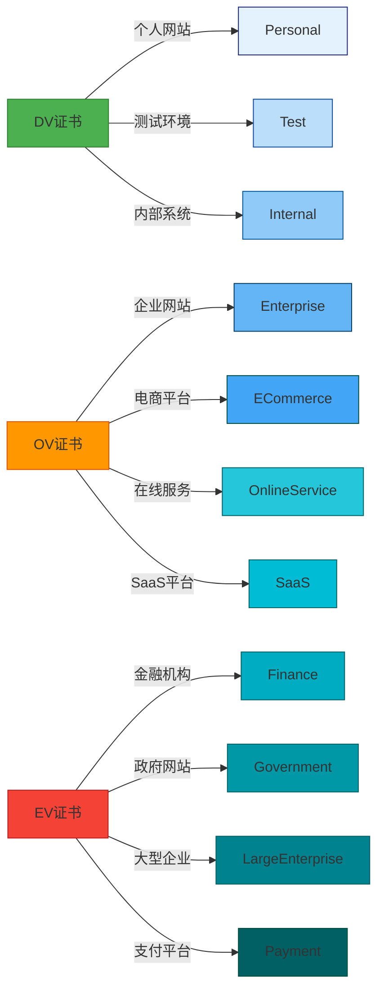

### 10.4 成本对比

| CA | DV | OV | EV |
|----|----|----|----|
| **Let's Encrypt** | 免费 | 不提供 | 不提供 |
| **ZeroSSL** | 免费（90天）<br/>付费（1年） | $99/年 | $199/年 |
| **DigiCert** | $199/年 | $299/年 | $599/年 |
| **Sectigo** | $49/年 | $99/年 | $199/年 |
| **GlobalSign** | $199/年 | $299/年 | $599/年 |
| **Comodo** | $49/年 | $99/年 | $199/年 |

---

## 11. 常见问题与解决方案

### 11.1 证书申请问题

#### 11.1.1 法律实体验证失败

**问题现象**：
```
Legal entity validation failed: Organization not found in government database
```

**可能原因**：
1. 组织名称与营业执照不一致
2. 组织注册号错误
3. 组织地址错误
4. 组织不存在
5. 组织已注销

**解决方案**：
```bash
# 1. 检查营业执照信息
# 确保组织名称、注册号、地址与营业执照完全一致

# 2. 使用政府数据库查询
# 中国：国家企业信用信息公示系统
# http://www.gsxt.gov.cn/

# 3. 使用商业注册查询
# 天眼查：https://www.tianyancha.com/
# 企查查：https://www.qcc.com/

# 4. 联系CA客服
# 提供准确的营业执照信息
# 请求人工审核
```

#### 11.1.2 运营审查失败

**问题现象**：
```
Operational review failed: Organization does not meet operational requirements
```

**可能原因**：
1. 运营年限不足
2. 财务状况不佳
3. 信用记录不良
4. 有重大法律纠纷
5. 不符合合规要求

**解决方案**：
```bash
# 1. 检查运营年限
# 确保组织有3年以上运营记录

# 2. 检查财务状况
# 提供最新的财务报告
# 确保财务状况良好

# 3. 检查信用记录
# 提供最新的信用报告
# 确保信用记录良好

# 4. 检查法律纠纷
# 确保无重大法律纠纷
# 提供法律声明

# 5. 检查合规性
# 确保符合相关法规
# 提供合规证明
```

#### 11.1.3 域名验证失败

**问题现象**：
```
Domain validation failed: DNS record not found
```

**可能原因**：
1. DNS记录未正确配置
2. DNS记录未传播
3. DNS记录格式错误
4. DNS服务器故障

**解决方案**：
```bash
# 1. 检查DNS记录
dig TXT _acme-challenge.www.example.com

# 2. 使用DNS查询工具
nslookup -type=TXT _acme-challenge.www.example.com

# 3. 检查DNS传播
for i in {1..10}; do
    dig TXT _acme-challenge.www.example.com +short
    sleep 10
done

# 4. 使用在线DNS查询工具
# https://www.whatsmydns.net/
# https://dnschecker.org/
```

### 11.2 证书部署问题

#### 11.2.1 证书链不完整

**问题现象**：
```
SSL: error:0B080074:x509 certificate routines:X509_check_private_key:unable to get local issuer certificate
```

**可能原因**：
1. 中间证书缺失
2. 证书链顺序错误
3. CA证书未配置

**解决方案**：
```bash
# 1. 检查证书链
openssl s_client -connect www.example.com:443 -showcerts

# 2. 查看证书文件
ls -la /etc/ssl/certs/

# 3. 配置完整的证书链
# Nginx: ssl_trusted_certificate
# Apache: SSLCertificateChainFile

# 4. 验证证书链
openssl verify -CAfile /etc/ssl/certs/ca-bundle.crt /etc/ssl/certs/www.example.com.crt
```

#### 11.2.2 EV标识不显示

**问题现象**：
```
EV certificate indicator not showing in browser
```

**可能原因**：
1. 证书不是EV证书
2. 证书链不完整
3. 浏览器不支持EV
4. 证书配置错误

**解决方案**：
```bash
# 1. 检查证书是否为EV证书
openssl x509 -in /etc/ssl/certs/www.example.com.crt -noout -text | grep -i "extended validation"

# 2. 检查证书链
openssl s_client -connect www.example.com:443 -showcerts

# 3. 检查浏览器支持
# 确保浏览器支持EV证书

# 4. 检查证书配置
# 确保证书配置正确
# 确保证书链完整
```

#### 11.2.3 证书过期

**问题现象**：
```
SSL: error:0B080074:x509 certificate routines:X509_check_private_key:certificate has expired
```

**可能原因**：
1. 证书自然过期
2. 自动更新失败
3. 系统时间不正确

**解决方案**：
```bash
# 1. 检查证书有效期
openssl x509 -in /etc/ssl/certs/www.example.com.crt -noout -dates

# 2. 手动更新证书
# 生成新的CSR
openssl req -new -key /etc/ssl/private/www.example.com.key -out /etc/ssl/certs/www.example.com.csr

# 提交更新申请
# 根据CA的流程提交更新申请

# 3. 检查系统时间
date

# 4. 同步系统时间
sudo ntpdate pool.ntp.org

# 5. 重载服务
sudo systemctl reload nginx
```

### 11.3 性能问题

#### 11.3.1 TLS握手慢

**问题现象**：
- TLS握手时间超过1秒
- 应用启动延迟高
- 用户体验差

**可能原因**：
1. 证书链过长
2. OCSP查询慢
3. 服务器性能问题
4. 网络延迟高

**解决方案**：
```nginx
# 1. 优化证书链
# 使用更短的证书链

# 2. 启用OCSP Stapling
ssl_stapling on;
ssl_stapling_verify on;
ssl_trusted_certificate /etc/ssl/certs/ca-bundle.crt;
resolver 8.8.8.8 8.8.4.4 valid=300s;
resolver_timeout 5s;

# 3. 优化SSL会话
ssl_session_cache shared:SSL:10m;
ssl_session_timeout 10m;

# 4. 使用TLS 1.3
ssl_protocols TLSv1.2 TLSv1.3;

# 5. 优化加密套件
ssl_ciphers 'ECDHE-ECDSA-AES128-GCM-SHA256:ECDHE-RSA-AES128-GCM-SHA256';
ssl_prefer_server_ciphers off;
```

#### 11.3.2 证书验证失败率高

**问题现象**：
- 大量证书验证失败
- 客户端连接被拒绝
- 用户体验差

**可能原因**：
1. CRL更新不及时
2. OCSP服务不可用
3. 证书配置错误
4. 客户端缓存问题

**解决方案**：
```nginx
# 1. 配置OCSP Stapling
ssl_stapling on;
ssl_stapling_verify on;
ssl_trusted_certificate /etc/ssl/certs/ca-bundle.crt;

# 2. 配置多个OCSP服务器
# 使用resolver指令配置多个DNS服务器

# 3. 优化SSL会话
ssl_session_cache shared:SSL:10m;
ssl_session_timeout 10m;

# 4. 监控OCSP服务状态
# 使用监控工具检查OCSP服务可用性
```

---

## 12. 附录：配置示例与工具

### 12.1 完整的Nginx EV证书配置

```nginx
user nginx;
worker_processes auto;
error_log /var/log/nginx/error.log warn;
pid /var/run/nginx.pid;

events {
    worker_connections 1024;
}

http {
    include /etc/nginx/mime.types;
    default_type application/octet-stream;

    log_format main '$remote_addr - $remote_user [$time_local] "$request" '
                    '$status $body_bytes_sent "$http_referer" '
                    '"$http_user_agent" "$http_x_forwarded_for"';

    access_log /var/log/nginx/access.log main;

    sendfile on;
    tcp_nopush on;
    tcp_nodelay on;
    keepalive_timeout 65;
    types_hash_max_size 2048;
    client_max_body_size 20m;

    # SSL配置
    ssl_session_cache shared:SSL:10m;
    ssl_session_timeout 10m;
    ssl_protocols TLSv1.2 TLSv1.3;
    ssl_ciphers 'ECDHE-ECDSA-AES128-GCM-SHA256:ECDHE-RSA-AES128-GCM-SHA256:ECDHE-ECDSA-AES256-GCM-SHA384:ECDHE-RSA-AES256-GCM-SHA384';
    ssl_prefer_server_ciphers off;

    # EV证书配置
    ssl_certificate /etc/ssl/certs/www.example.com.crt;
    ssl_certificate_key /etc/ssl/private/www.example.com.key;
    ssl_trusted_certificate /etc/ssl/certs/ca-bundle.crt;

    # OCSP Stapling
    ssl_stapling on;
    ssl_stapling_verify on;
    resolver 8.8.8.8 8.8.4.4 valid=300s;
    resolver_timeout 5s;

    # 安全头
    add_header Strict-Transport-Security "max-age=31536000; includeSubDomains; preload" always;
    add_header X-Frame-Options "SAMEORIGIN" always;
    add_header X-Content-Type-Options "nosniff" always;
    add_header X-XSS-Protection "1; mode=block" always;
    add_header Content-Security-Policy "default-src 'self'" always;

    # HTTP服务器（重定向到HTTPS）
    server {
        listen 80;
        server_name www.example.com;

        location / {
            return 301 https://$host$request_uri;
        }
    }

    # HTTPS服务器
    server {
        listen 443 ssl http2;
        server_name www.example.com;

        root /var/www/html;
        index index.html;

        # 健康检查
        location /health {
            access_log off;
            return 200 "healthy\n";
            add_header Content-Type text/plain;
        }
    }
}
```

### 12.2 证书管理脚本

#### 12.2.1 EV证书管理脚本

```bash
#!/bin/bash
# ev-cert-manager.sh

set -euo pipefail

# 配置
CERT_DIR="/etc/ssl/certs"
KEY_DIR="/etc/ssl/private"
BACKUP_DIR="/var/backups/ssl"
WARNING_DAYS=30
ALERT_EMAIL="admin@example.com"

# 颜色定义
RED='\033[0;31m'
GREEN='\033[0;32m'
YELLOW='\033[1;33m'
NC='\033[0m'

# 日志函数
log_info() {
    echo -e "${GREEN}[INFO]${NC} $1"
}

log_warn() {
    echo -e "${YELLOW}[WARN]${NC} $1"
}

log_error() {
    echo -e "${RED}[ERROR]${NC} $1"
}

# 检查证书有效期
check_cert_expiry() {
    local cert_path="$1"
    
    if [ ! -f "$cert_path" ]; then
        log_error "证书文件不存在: $cert_path"
        return 1
    fi
    
    # 获取过期时间
    local expiry_date=$(openssl x509 -in "$cert_path" -noout -enddate | cut -d= -f2)
    local expiry_timestamp=$(date -d "$expiry_date" +%s)
    local current_timestamp=$(date +%s)
    local days_left=$(( (expiry_timestamp - current_timestamp) / 86400 ))
    
    log_info "证书过期时间: $expiry_date"
    log_info "剩余天数: $days_left"
    
    if [ $days_left -lt $WARNING_DAYS ]; then
        log_warn "警告: 证书将在 $days_left 天内过期!"
        
        # 发送告警邮件
        local subject="EV证书即将过期: $(basename $cert_path)"
        local body="证书 $(basename $cert_path) 将在 $days_left 天后过期。\n\n过期时间: $expiry_date"
        
        echo "$body" | mail -s "EV证书告警" -a "From: cert-manager@example.com" "$ALERT_EMAIL"
        return 1
    fi
    
    return 0
}

# 备份证书
backup_cert() {
    local cert_path="$1"
    local timestamp=$(date +%Y%m%d_%H%M%S)
    local backup_dir="$BACKUP_DIR/$(basename $cert_path)_$timestamp"
    
    mkdir -p "$backup_dir"
    
    log_info "备份证书到: $backup_dir"
    cp "$cert_path" "$backup_dir/"
    
    log_info "备份完成"
}

# 更新证书
renew_cert() {
    local cert_name="$1"
    
    log_info "更新证书: $cert_name"
    
    # 备份现有证书
    backup_cert "$CERT_DIR/$cert_name.crt"
    
    # 生成新的CSR
    log_info "生成新的CSR"
    openssl req -new -key "$KEY_DIR/$cert_name.key" -out "$CERT_DIR/$cert_name.csr"
    
    # 提交更新申请（需要根据CA的具体流程调整）
    log_info "提交更新申请"
    # 这里需要根据CA的API或流程提交更新申请
    
    # 重载服务
    log_info "重载Nginx服务"
    systemctl reload nginx
    
    log_info "证书更新完成"
}

# 列出所有证书
list_certs() {
    log_info "EV证书列表:"
    find "$CERT_DIR" -name "*.crt" -type f | while read cert_file; do
        local cert_name=$(basename "$cert_file" .crt)
        local expiry_date=$(openssl x509 -in "$cert_file" -noout -enddate | cut -d= -f2)
        echo "  $cert_name: $expiry_date"
    done
}

# 主函数
main() {
    case "${1:-help}" in
        check)
            check_cert_expiry "$CERT_DIR/www.example.com.crt"
            ;;
        backup)
            backup_cert "$CERT_DIR/www.example.com.crt"
            ;;
        renew)
            renew_cert "www.example.com"
            ;;
        list)
            list_certs
            ;;
        help|*)
            echo "用法: $0 {check|backup|renew|list|help}"
            echo ""
            echo "命令:"
            echo "  check    - 检查证书有效期"
            echo "  backup   - 备份当前证书"
            echo "  renew   - 更新证书"
            echo "  list     - 列出所有证书"
            echo "  help     - 显示帮助信息"
            ;;
    esac
}

# 执行主函数
main "$@"
```

### 12.3 在线工具与资源

#### 12.3.1 SSL/TLS工具

| 工具 | URL | 用途 |
|------|-----|------|
| **SSL Labs SSL Test** | https://www.ssllabs.com/ssltest/ | SSL配置评估 |
| **Mozilla SSL Config Generator** | https://ssl-config.mozilla.org/ | SSL配置生成 |
| **SSL Decoder** | https://www.sslshopper.com/ssl-decoder.html | 证书解码 |
| **CryptoReport** | https://cryptoreport.websecurity.symantec.com/ | 证书报告 |
| **Certificate Transparency** | https://crt.sh/ | CT日志查询 |

#### 12.3.2 DNS工具

| 工具 | URL | 用途 |
|------|-----|------|
| **dig** | https://www.isc.org/tools/dig/ | DNS查询 |
| **nslookup** | 内置工具 | DNS查询 |
| **DNSViz** | https://dnsviz.net/ | DNS可视化 |
| **WhatsMyDNS** | https://www.whatsmydns.net/ | DNS查询 |

#### 12.3.3 CA工具

| 工具 | URL | 用途 |
|------|-----|------|
| **DigiCert CertCentral** | https://www.digicert.com/secure/ | DigiCert管理平台 |
| **Sectigo Certificate Manager** | https://sectigo.com/ssl-certificates-tls/ | Sectigo管理平台 |
| **GlobalSign Certificate Center** | https://www.globalsign.com/en/ssl/ | GlobalSign管理平台 |

---

## 术语解释

| 术语 | 英文全称 | 中文解释 |
|------|----------|----------|
| **EV** | Extended Validation | 扩展验证型证书 |
| **OV** | Organization Validated | 组织验证型证书 |
| **DV** | Domain Validated | 域名验证型证书 |
| **CA** | Certificate Authority | 证书颁发机构 |
| **CSR** | Certificate Signing Request | 证书签名请求 |
| **SAN** | Subject Alternative Name | 主题备用名称 |
| **OCSP** | Online Certificate Status Protocol | 在线证书状态协议 |
| **CRL** | Certificate Revocation List | 证书吊销列表 |
| **CT** | Certificate Transparency | 证书透明度 |
| **TLS** | Transport Layer Security | 传输层安全协议 |
| **SSL** | Secure Sockets Layer | 安全套接字层 |
| **PKI** | Public Key Infrastructure | 公钥基础设施 |
| **RSA** | Rivest-Shamir-Adleman | RSA加密算法 |
| **ECDSA** | Elliptic Curve Digital Signature Algorithm | 椭圆曲线数字签名算法 |
| **AES** | Advanced Encryption Standard | 高级加密标准 |
| **GCM** | Galois/Counter Mode | GCM模式 |
| **SHA** | Secure Hash Algorithm | 安全哈希算法 |
| **HSTS** | HTTP Strict Transport Security | HTTP严格传输安全 |
| **OID** | Object Identifier | 对象标识符 |

---

## 参考资源

### 官方文档

- [EV Guidelines 1.7.5](https://cabforum.org/working-groups/server/baseline-requirements/documents/)
- [RFC 5280 - Internet X.509 Public Key Infrastructure Certificate and CRL Profile](https://tools.ietf.org/html/rfc5280)
- [RFC 6960 - X.509 Internet Public Key Infrastructure Online Certificate Status Protocol (OCSP)](https://tools.ietf.org/html/rfc6960)
- [CA/Browser Forum Baseline Requirements](https://cabforum.org/baseline-requirements-documents/)
- [Mozilla SSL Configuration Generator](https://ssl-config.mozilla.org/)

### CA文档

- [DigiCert Documentation](https://www.digicert.com/help/)
- [Sectigo Documentation](https://sectigo.com/ssl-certificates-tls/)
- [GlobalSign Documentation](https://www.globalsign.com/en/ssl/ssl-certificate-support/)

### 安全标准

- [NIST Special Publication 800-57 Part 1 Rev. 5](https://nvlpubs.nist.gov/nistpubs/SpecialPublications/NIST.SP.800-57r1.pdf)
- [PCI DSS Requirements](https://www.pcisecuritystandards.org/documents/PCI_DSS_v3-2-1.pdf)
- [OWASP TLS Cheat Sheet](https://cheatsheetseries.owasp.org/cheatsheets/Transport_Layer_Protection_Cheat_Sheet)

---

**文档版本**: 1.0.0  
**最后更新**: 2026-01-18  
**维护者**: SMTP Tunnel Proxy Team
