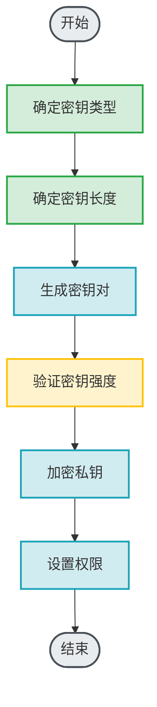
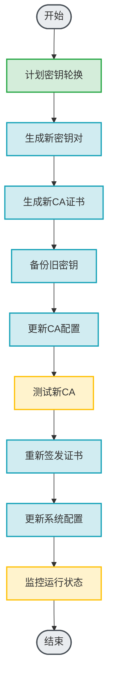
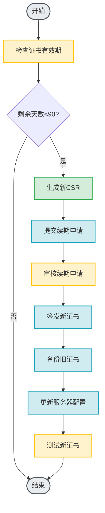

# 私有CA签发证书技术文档

---

## 文档信息

| 项目 | 内容 |
|------|------|
| 文档标题 | 私有CA签发证书技术文档 |
| 文档版本 | 1.0.0 |
| 创建日期 | 2026-01-18 |
| 最后更新 | 2026-01-18 |
| 维护者 | SMTP Tunnel Proxy Team |
| 文档状态 | 正式发布 |

---

## 目录

1. [概述](#1-概述)
   1.1 [文档目的](#11-文档目的)
   1.2 [适用范围](#12-适用范围)
   1.3 [术语定义](#13-术语定义)
2. [私有CA概述](#2-私有ca概述)
   2.1 [什么是私有CA](#21-什么是私有ca)
   2.2 [创建目的](#22-创建目的)
   2.3 [应用场景](#23-应用场景)
   2.4 [与公共CA对比](#24-与公共ca对比)
3. [私有CA创建流程](#3-私有ca创建流程)
   3.1 [准备工作](#31-准备工作)
   3.2 [生成根CA证书](#32-生成根ca证书)
   3.3 [配置CA环境](#33-配置ca环境)
   3.4 [测试CA功能](#34-测试ca功能)
4. [证书签发步骤](#4-证书签发步骤)
   4.1 [证书申请](#41-证书申请)
   4.2 [证书审核](#42-证书审核)
   4.3 [证书生成](#43-证书生成)
   4.4 [证书发布](#44-证书发布)
   4.5 [证书归档](#45-证书归档)
5. [密钥管理规范](#5-密钥管理规范)
   5.1 [密钥生成](#51-密钥生成)
   5.2 [密钥存储](#52-密钥存储)
   5.3 [密钥备份](#53-密钥备份)
   5.4 [密钥轮换](#54-密钥轮换)
   5.5 [密钥销毁](#55-密钥销毁)
6. [安全最佳实践](#6-安全最佳实践)
   6.1 [CA安全](#61-ca安全)
   6.2 [证书安全](#62-证书安全)
   6.3 [网络安全](#63-网络安全)
   6.4 [访问控制](#64-访问控制)
   6.5 [审计日志](#65-审计日志)
7. [证书格式说明](#7-证书格式说明)
   7.1 [X.509证书结构](#71-x509证书结构)
   7.2 [证书扩展字段](#72-证书扩展字段)
   7.3 [证书编码格式](#73-证书编码格式)
   7.4 [证书链管理](#74-证书链管理)
8. [有效期管理策略](#8-有效期管理策略)
   8.1 [有效期设置](#81-有效期设置)
   8.2 [续期策略](#82-续期策略)
   8.3 [过期监控](#83-过期监控)
   8.4 [证书吊销](#84-证书吊销)
9. [常见问题解决方案](#9-常见问题解决方案)
   9.1 [CA创建问题](#91-ca创建问题)
   9.2 [证书签发问题](#92-证书签发问题)
   9.3 [证书验证问题](#93-证书验证问题)
   9.4 [密钥管理问题](#94-密钥管理问题)
10. [配置文件示例](#10-配置文件示例)
    10.1 [OpenSSL配置](#101-openssl配置)
    10.2 [CA配置文件](#102-ca配置文件)
    10.3 [证书模板](#103-证书模板)
11. [脚本示例](#11-脚本示例)
    11.1 [CA初始化脚本](#111-ca初始化脚本)
    11.2 [证书签发脚本](#112-证书签发脚本)
    11.3 [证书吊销脚本](#113-证书吊销脚本)
12. [检查清单](#12-检查清单)
    12.1 [CA创建检查清单](#121-ca创建检查清单)
    12.2 [证书签发检查清单](#122-证书签发检查清单)
    12.3 [安全检查清单](#123-安全检查清单)
13. [参考文献](#13-参考文献)

---

## 1. 概述

### 1.1 文档目的

本文档旨在为技术人员提供关于私有CA(证书颁发机构)的全面技术指南,包括私有CA的创建、证书签发、密钥管理、安全实践等方面的详细说明。通过本文档,读者将能够:

- 理解私有CA的概念和应用场景
- 掌握私有CA的创建和配置方法
- 掌握证书签发的完整流程
- 了解密钥管理的最佳实践
- 掌握安全最佳实践和合规要求
- 掌握常见问题的排查方法

### 1.2 适用范围

本文档适用于以下场景:

- 企业内部证书管理
- 私有云环境证书签发
- 开发测试环境证书管理
- 实验室环境证书管理
- 教学和学习目的

### 1.3 术语定义

| 术语 | 定义 |
|------|------|
| 私有CA | 企业或组织内部使用的证书颁发机构,不对外提供服务 |
| 根CA (Root CA) | 证书信任链的顶级CA,自签名证书 |
| 中间CA (Intermediate CA) | 由根CA签发的CA,用于签发终端证书 |
| 终端实体 (End-Entity) | 使用证书的最终实体,如服务器、客户端等 |
| CSR (Certificate Signing Request) | 证书签名请求,包含公钥和身份信息的文件 |
| CRL (Certificate Revocation List) | 证书吊销列表,包含已吊销的证书 |
| OCSP (Online Certificate Status Protocol) | 在线证书状态协议,用于查询证书状态 |
| PKI (Public Key Infrastructure) | 公钥基础设施,包括CA、证书、CRL等 |

---

## 2. 私有CA概述

### 2.1 什么是私有CA

私有CA是指企业或组织内部建立的证书颁发机构,用于为内部系统、服务、应用程序签发数字证书。私有CA的根证书通常不包含在公共浏览器和操作系统的受信任根证书列表中。

私有CA具有以下特点:

- **内部使用**: 仅在企业或组织内部使用
- **自主管理**: 完全自主控制证书签发和管理
- **成本节约**: 无需向公共CA支付证书费用
- **灵活配置**: 可以根据内部需求灵活配置证书策略
- **快速签发**: 无需等待公共CA的审核流程

### 2.2 创建目的

创建私有CA的主要目的包括:

1. **内部证书管理**: 统一管理企业内部的数字证书
2. **成本节约**: 避免为内部系统购买商业证书
3. **安全控制**: 完全控制证书的签发和撤销
4. **合规要求**: 满足行业或法规的合规要求
5. **快速部署**: 快速为内部系统签发证书

### 2.3 应用场景

#### 2.3.1 推荐使用场景

- **企业内部系统**: 内部Web应用、API服务、数据库
- **私有云环境**: 私有云、混合云、容器环境
- **开发测试环境**: 开发环境、测试环境、UAT环境
- **物联网设备**: IoT设备、智能家居、工业设备
- **内部通信**: 内部邮件系统、即时通讯、文件共享

#### 2.3.2 不推荐使用场景

- **面向公众的服务**: 互联网Web应用、移动应用
- **电子商务**: 在线支付、用户隐私保护
- **医疗健康**: 涉及敏感个人健康信息
- **金融服务**: 涉及资金交易、账户安全
- **公共服务**: 政府机构、公共事业单位

### 2.4 与公共CA对比

| 对比项 | 私有CA | 公共CA |
|--------|---------|--------|
| **信任范围** | 仅内部系统 | 全球信任 |
| **成本** | 免费 | 需要付费 |
| **签发速度** | 即时签发 | 需要审核 |
| **控制权** | 完全控制 | 受CA策略限制 |
| **适用场景** | 内部系统 | 面向公众的服务 |
| **证书类型** | 可自定义 | 标准证书类型 |
| **合规性** | 需要自建信任链 | 自动符合行业标准 |

---

## 3. 私有CA创建流程

### 3.1 准备工作

#### 3.1.1 环境准备

在创建私有CA之前,需要准备以下环境:

```bash
# 检查OpenSSL版本
openssl version

# 创建CA目录结构
mkdir -p /opt/private-ca
cd /opt/private-ca

# 创建子目录
mkdir -p {certs,crl,newcerts,private,requests}
mkdir -p {certs,crl,newcerts,private,requests}/archive

# 设置目录权限
chmod 700 private
chmod 755 {certs,crl,newcerts,requests}
```

#### 3.1.2 工具安装

确保系统已安装必要的工具:

```bash
# Ubuntu/Debian
sudo apt-get update
sudo apt-get install -y openssl

# CentOS/RHEL
sudo yum install -y openssl

# macOS
brew install openssl
```

#### 3.1.3 信息准备

准备CA所需的信息:

| 字段 | 说明 | 示例 |
|------|------|------|
| 国家代码 | 两字母国家代码 | CN |
| 州/省 | 州或省份名称 | Beijing |
| 城市 | 城市名称 | Beijing |
| 组织 | 组织名称 | My Company |
| 组织单位 | 部门或单位名称 | IT Department |
| 通用名称 | CA名称 | My Private CA |
| 电子邮件 | 联系邮箱 | ca@example.com |

### 3.2 生成根CA证书

#### 3.2.1 生成CA私钥

```bash
# 生成4096位RSA私钥
openssl genrsa -aes256 -out private/ca.key.pem 4096

# 查看私钥信息
openssl rsa -in private/ca.key.pem -text -noout

# 设置私钥权限
chmod 600 private/ca.key.pem
```

#### 3.2.2 生成CA证书

```bash
# 生成自签名根CA证书,有效期10年(3650天)
openssl req -new -x509 -days 3650 -key private/ca.key.pem -out certs/ca.cert.pem \
    -sha256 \
    -subj "/C=CN/ST=Beijing/L=Beijing/O=My Company/OU=IT Department/CN=My Private CA/emailAddress=ca@example.com" \
    -extensions v3_ca

# 查看证书信息
openssl x509 -in certs/ca.cert.pem -text -noout

# 设置证书权限
chmod 644 certs/ca.cert.pem
```

#### 3.2.3 配置CA扩展字段

```bash
# 创建CA配置文件
cat > ca.conf << EOF
[ ca ]
default_ca = my_ca

[ my_ca ]
dir = /opt/private-ca
certificate = \$dir/certs/ca.cert.pem
database = \$dir/index.txt
new_certs_dir = \$dir/newcerts
certificate = \$dir/certs/ca.cert.pem
serial = \$dir/serial
crlnumber = \$dir/crlnumber
crl = \$dir/crl/ca.crl.pem
private_key = \$dir/private/ca.key.pem
RANDFILE = \$dir/private/.rand

default_days = 365
default_crl_days = 30
default_md = sha256

policy = my_policy

x509_extensions = v3_ca

[ my_policy ]
countryName = supplied
stateOrProvinceName = supplied
localityName = supplied
organizationName = supplied
organizationalUnitName = optional
commonName = supplied
emailAddress = optional

[ v3_ca ]
basicConstraints = critical,CA:true,pathlen:3
keyUsage = critical, cRLSign, keyCertSign
subjectKeyIdentifier = hash
authorityKeyIdentifier = keyid:always,issuer
authorityInfoAccess = @issuer_info

[ issuer_info ]
caIssuers;URI.0 = http://pki.example.com/ca.crt
caIssuers;URI.1 = ldap://pki.example.com/cn=My%20Private%20CA,certificateRevocationList;binary

[ v3_intermediate_ca ]
basicConstraints = critical,CA:true,pathlen:0
keyUsage = critical, cRLSign, keyCertSign
subjectKeyIdentifier = hash
authorityKeyIdentifier = keyid:always,issuer

[ v3_req ]
basicConstraints = CA:FALSE
keyUsage = critical, digitalSignature, keyEncipherment
extendedKeyUsage = serverAuth, clientAuth
subjectKeyIdentifier = hash
authorityKeyIdentifier = keyid:always,issuer
subjectAltName = @alt_names

[ alt_names ]
DNS.1 = example.com
DNS.2 = *.example.com
IP.1 = 192.168.1.100
EOF
```

### 3.3 配置CA环境

#### 3.3.1 初始化CA数据库

```bash
# 创建序列号文件
echo 1000 > serial

# 创建CRL序列号文件
echo 1000 > crlnumber

# 创建证书索引文件
touch index.txt
echo 0000 > index.txt.attr
```

#### 3.3.2 配置OpenSSL

```bash
# 创建OpenSSL配置文件
cat > openssl.cnf << EOF
[ ca ]
default_ca = my_ca

[ my_ca ]
dir = /opt/private-ca
certificate = \$dir/certs/ca.cert.pem
database = \$dir/index.txt
new_certs_dir = \$dir/newcerts
serial = \$dir/serial
crlnumber = \$dir/crlnumber
crl = \$dir/crl/ca.crl.pem
private_key = \$dir/private/ca.key.pem
RANDFILE = \$dir/private/.rand

default_days = 365
default_crl_days = 30
default_md = sha256

policy = my_policy

x509_extensions = v3_ca

[ my_policy ]
countryName = supplied
stateOrProvinceName = supplied
localityName = supplied
organizationName = supplied
organizationalUnitName = optional
commonName = supplied
emailAddress = optional

[ v3_ca ]
basicConstraints = critical,CA:true,pathlen:3
keyUsage = critical, cRLSign, keyCertSign
subjectKeyIdentifier = hash
authorityKeyIdentifier = keyid:always,issuer

[ v3_req ]
basicConstraints = CA:FALSE
keyUsage = critical, digitalSignature, keyEncipherment
extendedKeyUsage = serverAuth, clientAuth
subjectKeyIdentifier = hash
authorityKeyIdentifier = keyid:always,issuer
subjectAltName = @alt_names

[ alt_names ]
DNS.1 = example.com
DNS.2 = *.example.com
IP.1 = 192.168.1.100
EOF
```

### 3.4 测试CA功能

#### 3.4.1 验证CA证书

```bash
# 验证CA证书
openssl x509 -in certs/ca.cert.pem -noout -text

# 检查CA证书有效期
openssl x509 -in certs/ca.cert.pem -noout -dates

# 验证CA证书是自签名的
openssl verify -CAfile certs/ca.cert.pem certs/ca.cert.pem
```

#### 3.4.2 测试证书签发

```bash
# 生成测试CSR
openssl req -new -keyout test.key.pem -out test.csr.pem \
    -subj "/C=CN/ST=Beijing/L=Beijing/O=My Company/OU=IT Department/CN=test.example.com"

# 使用CA签发测试证书
openssl ca -in test.csr.pem -out test.cert.pem \
    -config openssl.cnf \
    -days 365 \
    -notext

# 验证测试证书
openssl verify -CAfile certs/ca.cert.pem test.cert.pem

# 清理测试文件
rm test.key.pem test.csr.pem test.cert.pem
```

---

## 4. 证书签发步骤

### 4.1 证书申请

#### 4.1.1 生成CSR

```bash
# 生成私钥和CSR
openssl req -new -newkey rsa:2048 -nodes \
    -keyout private/server.key.pem \
    -out requests/server.csr.pem \
    -subj "/C=CN/ST=Beijing/L=Beijing/O=My Company/OU=IT Department/CN=server.example.com/emailAddress=admin@example.com"

# 查看CSR信息
openssl req -in requests/server.csr.pem -text -noout

# 设置私钥权限
chmod 600 private/server.key.pem
```

#### 4.1.2 提交CSR

CSR可以通过以下方式提交:

1. **在线提交**: 通过Web界面提交CSR
2. **邮件提交**: 通过邮件发送CSR文件
3. **API提交**: 通过REST API提交CSR
4. **命令行提交**: 使用命令行工具提交

### 4.2 证书审核

#### 4.2.1 审核CSR

```bash
# 查看CSR详细信息
openssl req -in requests/server.csr.pem -text -noout

# 验证CSR格式
openssl req -in requests/server.csr.pem -verify -noout

# 检查CSR主题
openssl req -in requests/server.csr.pem -noout -subject
```

#### 4.2.2 审核标准

审核时应检查以下内容:

| 审核项 | 说明 |
|--------|------|
| **身份验证** | 验证申请者的身份和组织信息 |
| **权限验证** | 验证申请者是否有权限申请该证书 |
| **用途验证** | 验证证书用途是否合理 |
| **技术验证** | 验证CSR格式和技术参数是否正确 |
| **合规验证** | 验证申请是否符合CA策略 |

### 4.3 证书生成

#### 4.3.1 签发证书

```bash
# 使用CA签发证书
openssl ca -in requests/server.csr.pem -out certs/server.cert.pem \
    -config openssl.cnf \
    -days 365 \
    -notext \
    -batch

# 查看证书信息
openssl x509 -in certs/server.cert.pem -text -noout

# 设置证书权限
chmod 644 certs/server.cert.pem
```

#### 4.3.2 生成证书链

```bash
# 生成证书链
cat certs/server.cert.pem > chain.pem
cat certs/ca.cert.pem >> chain.pem

# 验证证书链
openssl verify -CAfile certs/ca.cert.pem -untrusted certs/ca.cert.pem certs/server.cert.pem
```

### 4.4 证书发布

#### 4.4.1 通知申请者

```bash
# 发送邮件通知
echo "您的证书已签发完成,请下载附件。" | \
    mail -s "证书签发通知" -a certs/server.cert.pem admin@example.com
```

#### 4.4.2 提供证书下载

证书可以通过以下方式提供:

1. **在线下载**: 通过Web界面下载
2. **邮件附件**: 通过邮件发送证书文件
3. **API获取**: 通过REST API获取证书
4. **命令行获取**: 使用命令行工具获取

### 4.5 证书归档

#### 4.5.1 归档证书

```bash
# 归档证书和CSR
cp requests/server.csr.pem archive/
cp certs/server.cert.pem archive/

# 更新索引文件
echo "$(date +%Y%m%d%H%M%S) $(openssl x509 -in certs/server.cert.pem -noout -serial) $(openssl x509 -in certs/server.cert.pem -noout -subject)" >> archive/index.txt
```

#### 4.5.2 备份证书

```bash
# 创建加密备份
tar czf - certs-backup-$(date +%Y%m%d).tar.gz certs/ private/ archive/
gpg --encrypt --recipient ca@example.com certs-backup-$(date +%Y%m%d).tar.gz

# 安全删除未加密的备份
shred -u certs-backup-$(date +%Y%m%d).tar.gz
```

---

## 5. 密钥管理规范

### 5.1 密钥生成

#### 5.1.1 密钥长度要求

| 密钥类型 | 最小长度 | 推荐长度 | 说明 |
|----------|-----------|-----------|------|
| RSA | 2048位 | 4096位 | 根CA使用4096位,终端证书使用2048位 |
| ECDSA | 256位 | 384位 | P-256曲线用于终端证书,P-384曲线用于CA |

#### 5.1.2 密钥生成流程



### 5.2 密钥存储

#### 5.2.1 存储原则

- **加密存储**: 使用强加密算法加密私钥
- **离线存储**: 将私钥存储在离线安全位置
- **访问控制**: 限制私钥的访问权限
- **多重备份**: 保留多个备份副本
- **定期审计**: 定期审计私钥访问日志

#### 5.2.2 存储位置

```bash
# CA私钥存储位置
/opt/private-ca/private/ca.key.pem

# 终端证书私钥存储位置
/opt/private-ca/private/server.key.pem

# 备份存储位置
/opt/private-ca/backup/
```

### 5.3 密钥备份

#### 5.3.1 备份策略

| 备份类型 | 频率 | 保留期限 | 说明 |
|----------|-------|-----------|------|
| 完整备份 | 每周 | 1年 | 备份所有证书和密钥 |
| 增量备份 | 每天 | 1月 | 备份新增的证书和密钥 |
| 离线备份 | 每月 | 永久 | 备份到离线存储 |

#### 5.3.2 备份脚本

```bash
#!/bin/bash

# CA密钥备份脚本
CA_DIR="/opt/private-ca"
BACKUP_DIR="/opt/private-ca/backup"
BACKUP_FILE="ca-backup-$(date +%Y%m%d%H%M%S).tar.gz"

# 创建备份目录
mkdir -p $BACKUP_DIR

# 创建备份
tar czf $BACKUP_DIR/$BACKUP_FILE \
    certs/ private/ archive/ index.txt serial crlnumber

# 加密备份
gpg --encrypt --recipient ca@example.com $BACKUP_DIR/$BACKUP_FILE

# 上传到远程存储
scp $BACKUP_DIR/${BACKUP_FILE}.gpg backup-server:/backups/

# 清理旧备份(保留30天)
find $BACKUP_DIR -name "*.tar.gz.gpg" -mtime +30 -delete

echo "备份完成: $BACKUP_FILE"
```

### 5.4 密钥轮换

#### 5.4.1 轮换策略

- **定期轮换**: 根CA密钥每5-10年轮换一次
- **提前准备**: 在密钥过期前3-6个月开始准备
- **平滑过渡**: 确保证书轮换不影响服务
- **旧密钥保留**: 保留旧密钥一段时间以备回滚
- **清理策略**: 清理过期的旧密钥

#### 5.4.2 轮换流程



### 5.5 密钥销毁

#### 5.5.1 销毁原则

- **安全删除**: 使用安全删除工具彻底删除密钥
- **多次覆盖**: 多次覆盖密钥文件
- **清理备份**: 清理所有备份副本
- **记录销毁**: 记录密钥销毁的详细信息
- **审计确认**: 审计确认密钥已被销毁

#### 5.5.2 销毁方法

```bash
# 使用shred安全删除密钥
shred -u -z -n 3 private/ca.key.pem

# 使用wipe安全删除密钥
wipe -rf private/ca.key.pem

# 使用srm安全删除密钥
srm -s private/ca.key.pem

# 清理所有备份
find backup/ -name "*ca.key.pem*" -exec shred -u -z -n 3 {} \;
```

---

## 6. 安全最佳实践

### 6.1 CA安全

#### 6.1.1 CA服务器安全

- **物理安全**: CA服务器应放置在安全的物理环境中
- **网络安全**: CA服务器应与公共网络隔离
- **访问控制**: 限制对CA服务器的访问
- **系统加固**: 定期更新和加固CA服务器
- **监控告警**: 实时监控CA服务器并设置告警

#### 6.1.2 CA私钥安全

- **HSM存储**: 使用硬件安全模块(HSM)存储CA私钥
- **加密存储**: 使用强加密算法加密CA私钥
- **访问控制**: 限制对CA私钥的访问权限
- **多重认证**: 使用多重认证保护CA私钥
- **审计日志**: 记录所有CA私钥的访问和使用

### 6.2 证书安全

#### 6.2.1 证书签发安全

- **身份验证**: 严格验证证书申请者的身份
- **权限检查**: 检查申请者是否有权限申请该证书
- **用途限制**: 限制证书的用途和有效期
- **审计记录**: 记录所有证书签发操作
- **定期审计**: 定期审计证书签发记录

#### 6.2.2 证书撤销安全

- **及时撤销**: 及时撤销不再使用的证书
- **发布CRL**: 定期发布CRL
- **OCSP服务**: 提供OCSP服务
- **验证撤销**: 验证证书撤销状态
- **审计撤销**: 记录所有证书撤销操作

### 6.3 网络安全

#### 6.3.1 传输安全

- **加密传输**: 使用加密通道传输证书和密钥
- **TLS保护**: 使用TLS保护CA服务
- **证书验证**: 验证CA服务器的证书
- **防火墙规则**: 配置防火墙规则限制访问
- **VPN访问**: 通过VPN访问CA服务

#### 6.3.2 访问控制

- **IP白名单**: 配置IP白名单限制访问
- **用户认证**: 使用强用户认证
- **角色权限**: 基于角色的访问控制
- **最小权限**: 只给必要的用户访问权限
- **定期审计**: 定期审计访问日志

### 6.4 访问控制

#### 6.4.1 权限管理

- **最小权限**: 只给必要的用户访问权限
- **角色分离**: 分离不同角色的权限
- **定期审查**: 定期审查用户权限
- **及时撤销**: 及时撤销不再需要的权限
- **审计日志**: 记录所有权限变更

#### 6.4.2 访问审计

```bash
# 查看CA访问日志
tail -f /var/log/ca/access.log

# 查看CA错误日志
tail -f /var/log/ca/error.log

# 分析访问日志
grep "ERROR" /var/log/ca/access.log | awk '{print $1, $2, $7}'
```

### 6.5 审计日志

#### 6.5.1 日志记录

- **完整记录**: 记录所有CA操作
- **日志保护**: 保护日志文件的安全
- **日志备份**: 定期备份日志文件
- **日志分析**: 定期分析日志文件
- **日志保留**: 根据合规要求保留日志

#### 6.5.2 日志分析

```bash
# 分析证书签发日志
grep "ISSUE" /var/log/ca/operations.log | \
    awk '{print $1, $2, $7, $8}' | \
    sort | uniq -c

# 分析证书撤销日志
grep "REVOKE" /var/log/ca/operations.log | \
    awk '{print $1, $2, $7, $8}' | \
    sort | uniq -c

# 分析访问日志
grep "ACCESS" /var/log/ca/access.log | \
    awk '{print $1, $2, $5}' | \
    sort | uniq -c
```

---

## 7. 证书格式说明

### 7.1 X.509证书结构

#### 7.1.1 证书基本信息

```
证书版本 (Version)
序列号 (Serial Number)
签名算法 (Signature Algorithm)
颁发者 (Issuer)
有效期 (Validity)
  - 开始时间 (Not Before)
  - 结束时间 (Not After)
主体 (Subject)
主体公钥信息 (Subject Public Key Info)
  - 公钥算法
  - 公钥值
```

#### 7.1.2 证书扩展字段

```
基本约束 (Basic Constraints)
密钥用途 (Key Usage)
扩展密钥用途 (Extended Key Usage)
主题备用名称 (Subject Alternative Name)
密钥标识符 (Subject Key Identifier)
颁发者密钥标识符 (Authority Key Identifier)
CRL分发点 (CRL Distribution Points)
颁发信息访问 (Authority Information Access)
```

### 7.2 证书扩展字段

#### 7.2.1 基本约束

```
basicConstraints = critical,CA:true,pathlen:3
```

- **CA:true**: 表示这是一个CA证书
- **pathlen:3**: 表示可以签发最多3层中间CA

#### 7.2.2 密钥用途

```
keyUsage = critical, cRLSign, keyCertSign
```

- **cRLSign**: 可以签发CRL
- **keyCertSign**: 可以签发证书

#### 7.2.3 扩展密钥用途

```
extendedKeyUsage = serverAuth, clientAuth
```

- **serverAuth**: 用于服务器认证
- **clientAuth**: 用于客户端认证

### 7.3 证书编码格式

#### 7.3.1 PEM格式

PEM(Privacy-Enhanced Mail)格式是Base64编码的文本格式:

```
-----BEGIN CERTIFICATE-----
MIIDXTCCAkWgAwIBAgIJAKJpCj5G2BMA0GCSqGSIb3DQEBCwUAMIGpMQswCQYDVQQGEwJV
...
-----END CERTIFICATE-----
```

#### 7.3.2 DER格式

DER(Distinguished Encoding Rules)格式是二进制编码格式:

```bash
# PEM转DER
openssl x509 -in cert.pem -outform PEM -out cert.der -outform DER

# DER转PEM
openssl x509 -in cert.der -inform DER -out cert.pem -outform PEM
```

### 7.4 证书链管理

#### 7.4.1 证书链结构

```
服务器证书
  ↓
中间CA证书
  ↓
根CA证书
```

#### 7.4.2 证书链验证

```bash
# 验证证书链
openssl verify -CAfile ca.cert.pem -untrusted intermediate.cert.pem server.cert.pem

# 输出示例:
# server.cert.pem: OK
```

---

## 8. 有效期管理策略

### 8.1 有效期设置

#### 8.1.1 有效期选择

根据证书类型选择合适的有效期:

| 证书类型 | 推荐有效期 | 最大有效期 | 说明 |
|----------|-----------|-----------|------|
| 根CA证书 | 10年 | 20年 | 根CA证书有效期应较长 |
| 中间CA证书 | 5年 | 10年 | 中间CA证书有效期应适中 |
| 服务器证书 | 1年 | 2年 | 服务器证书有效期应较短 |
| 客户端证书 | 1年 | 2年 | 客户端证书有效期应较短 |

#### 8.1.2 设置有效期

```bash
# 生成10年有效期的根CA证书
openssl req -new -x509 -days 3650 -key private/ca.key.pem -out certs/ca.cert.pem

# 生成5年有效期的中间CA证书
openssl ca -in intermediate.csr.pem -out certs/intermediate.cert.pem -days 1825

# 生成1年有效期的服务器证书
openssl ca -in server.csr.pem -out certs/server.cert.pem -days 365
```

### 8.2 续期策略

#### 8.2.1 续期流程



#### 8.2.2 自动续期脚本

```bash
#!/bin/bash

# 证书自动续期脚本
CERT_DIR="/opt/private-ca"
ALERT_DAYS=90
ALERT_EMAIL="ca@example.com"

# 遍历所有证书
for cert_file in $CERT_DIR/certs/*.pem; do
    # 检查证书有效期
    EXPIRY=$(openssl x509 -in $cert_file -noout -enddate | cut -d= -f2)
    EXPIRY_DATE=$(date -d "$EXPIRY" +%s)
    CURRENT_DATE=$(date +%s)
    REMAINING_DAYS=$(( ($EXPIRY_DATE - $CURRENT_DATE) / 86400 ))

    # 如果即将过期,自动续期
    if [ $REMAINING_DAYS -lt $ALERT_DAYS ]; then
        echo "证书 $cert_file 将在 $REMAINING_DAYS 天后过期,开始续期..."

        # 获取证书序列号
        SERIAL=$(openssl x509 -in $cert_file -noout -serial)

        # 查找对应的CSR
        CSR_FILE="$CERT_DIR/archive/$SERIAL.csr.pem"

        if [ -f "$CSR_FILE" ]; then
            # 使用相同的CSR重新签发证书
            openssl ca -in $CSR_FILE -out $CERT_DIR/certs/$SERIAL.cert.pem \
                -config $CERT_DIR/openssl.cnf \
                -days 365 \
                -notext \
                -batch

            echo "证书 $cert_file 续期完成"
        else
            echo "警告: 未找到对应的CSR文件 $CSR_FILE"
        fi
    fi
done
```

### 8.3 过期监控

#### 8.3.1 监控脚本

```bash
#!/bin/bash

# 证书过期监控脚本
CERT_DIR="/opt/private-ca"
ALERT_DAYS=90
ALERT_EMAIL="ca@example.com"

# 遍历所有证书
for cert_file in $CERT_DIR/certs/*.pem; do
    # 检查证书有效期
    EXPIRY=$(openssl x509 -in $cert_file -noout -enddate | cut -d= -f2)
    EXPIRY_DATE=$(date -d "$EXPIRY" +%s)
    CURRENT_DATE=$(date +%s)
    REMAINING_DAYS=$(( ($EXPIRY_DATE - $CURRENT_DATE) / 86400 ))

    # 如果即将过期,发送邮件提醒
    if [ $REMAINING_DAYS -lt $ALERT_DAYS ]; then
        SUBJECT="证书过期提醒: $cert_file"
        BODY="证书 $cert_file 将在 $REMAINING_DAYS 天后过期。\n\n"
        BODY+="过期时间: $EXPIRY\n\n"
        BODY+="请及时续期。"

        echo "$BODY" | mail -s "$SUBJECT" $ALERT_EMAIL
    fi
done
```

#### 8.3.2 定时任务

```bash
# 添加到crontab,每天检查一次
0 0 * * * /opt/private-ca/scripts/cert-monitor.sh >> /var/log/ca-monitor.log 2>&1
```

### 8.4 证书吊销

#### 8.4.1 吊销原因

| 吊销原因 | 说明 |
|----------|------|
| **密钥泄露** | 私钥泄露或被盗 |
| **证书错误** | 证书信息错误 |
| **不再使用** | 证书不再使用 |
| **系统变更** | 系统架构变更 |
| **合规要求** | 合规要求吊销 |

#### 8.4.2 吊销流程

```bash
# 吊销证书
openssl ca -revoke certs/server.cert.pem \
    -config openssl.cnf \
    -crl_reason "keyCompromise"

# 生成CRL
openssl ca -gencrl -out crl/ca.crl.pem \
    -config openssl.cnf

# 查看CRL信息
openssl crl -in crl/ca.crl.pem -text -noout
```

#### 8.4.3 CRL发布

```bash
# 发布CRL到Web服务器
cp crl/ca.crl.pem /var/www/html/ca.crl.pem

# 更新CRL分发点
echo "CRL发布时间: $(date)" >> /var/log/ca/crl-publish.log
```

---

## 9. 常见问题解决方案

### 9.1 CA创建问题

#### 9.1.1 问题: CA证书生成失败

**症状**: 执行`openssl req -new -x509`命令时失败

**可能原因**:
- 私钥生成失败
- 配置文件格式错误
- 磁盘空间不足

**解决方案**:

```bash
# 检查私钥文件
ls -l private/ca.key.pem

# 检查磁盘空间
df -h

# 验证配置文件
openssl req -new -x509 -days 3650 -key private/ca.key.pem -out certs/ca.cert.pem \
    -config openssl.cnf -dryrun

# 使用更小的密钥长度
openssl genrsa -aes256 -out private/ca.key.pem 2048
```

#### 9.1.2 问题: CA证书验证失败

**症状**: 执行`openssl verify`命令时失败

**可能原因**:
- 证书格式错误
- 证书链不完整
- 签名算法不匹配

**解决方案**:

```bash
# 检查证书格式
openssl x509 -in certs/ca.cert.pem -text -noout

# 验证证书(自签名证书会显示自签名警告)
openssl verify -CAfile certs/ca.cert.pem certs/ca.cert.pem

# 检查证书有效期
openssl x509 -in certs/ca.cert.pem -noout -dates
```

### 9.2 证书签发问题

#### 9.2.1 问题: 证书签发失败

**症状**: 执行`openssl ca`命令时失败

**可能原因**:
- CSR格式错误
- 数据库文件损坏
- 配置文件错误

**解决方案**:

```bash
# 验证CSR文件
openssl req -in requests/server.csr.pem -verify -noout

# 检查数据库文件
cat index.txt
cat serial

# 验证配置文件
openssl ca -in requests/server.csr.pem -out certs/server.cert.pem \
    -config openssl.cnf -dryrun

# 重建数据库
rm index.txt index.txt.attr serial crlnumber
echo 1000 > serial
echo 1000 > crlnumber
touch index.txt
echo 0000 > index.txt.attr
```

#### 9.2.2 问题: 证书链验证失败

**症状**: 证书链验证失败

**可能原因**:
- 证书链不完整
- 中间CA证书缺失
- 根CA证书未导入

**解决方案**:

```bash
# 检查证书链
cat chain.pem

# 验证证书链
openssl verify -CAfile ca.cert.pem -untrusted intermediate.cert.pem server.cert.pem

# 重新生成证书链
cat server.cert.pem > chain.pem
cat intermediate.cert.pem >> chain.pem
cat ca.cert.pem >> chain.pem
```

### 9.3 证书验证问题

#### 9.3.1 问题: 证书不被信任

**症状**: 浏览器或应用程序不信任私有CA签发的证书

**原因**: 私有CA的根证书未导入到受信任的根证书列表

**解决方案**:

1. **导入根证书**: 将私有CA的根证书导入到浏览器或操作系统的受信任根证书列表
2. **分发根证书**: 将私有CA的根证书分发到所有内部系统
3. **配置应用程序**: 配置应用程序信任私有CA的根证书

**导入根证书到浏览器**:

```bash
# Firefox
# 选项 -> 隐私与安全 -> 证书 -> 查看证书 -> 导入

# Chrome
# 设置 -> 隐私和安全 -> 安全 -> 管理证书 -> 受信任的根证书颁发机构 -> 导入

# Safari (macOS)
# 钥匙串访问 -> 系统 -> 证书 -> 导入 -> 信任 -> 始终信任
```

### 9.4 密钥管理问题

#### 9.4.1 问题: 私钥丢失

**症状**: CA私钥丢失,无法签发新证书

**解决方案**:

1. **使用备份**: 从备份中恢复私钥
2. **重新生成**: 如果没有备份,重新生成CA私钥和证书
3. **通知用户**: 通知所有用户更新根证书

**重新生成CA私钥**:

```bash
# 生成新的CA私钥
openssl genrsa -aes256 -out private/ca.key.pem 4096

# 生成新的CA证书
openssl req -new -x509 -days 3650 -key private/ca.key.pem -out certs/ca.cert.pem \
    -sha256 \
    -subj "/C=CN/ST=Beijing/L=Beijing/O=My Company/OU=IT Department/CN=My Private CA/emailAddress=ca@example.com" \
    -extensions v3_ca

# 通知用户更新根证书
echo "新的CA根证书已生成,请更新所有系统。" | \
    mail -s "CA根证书更新通知" -a certs/ca.cert.pem all-users@example.com
```

#### 9.4.2 问题: 私钥权限错误

**症状**: 访问私钥时提示权限错误

**解决方案**:

```bash
# 检查私钥权限
ls -l private/ca.key.pem

# 修改私钥权限
chmod 600 private/ca.key.pem

# 修改私钥所有者
chown ca:ca private/ca.key.pem
```

---

## 10. 配置文件示例

### 10.1 OpenSSL配置

#### 10.1.1 完整配置文件

```bash
# openssl.cnf - OpenSSL完整配置文件

[ ca ]
default_ca = my_ca

[ my_ca ]
dir = /opt/private-ca
certificate = \$dir/certs/ca.cert.pem
database = \$dir/index.txt
new_certs_dir = \$dir/newcerts
serial = \$dir/serial
crlnumber = \$dir/crlnumber
crl = \$dir/crl/ca.crl.pem
private_key = \$dir/private/ca.key.pem
RANDFILE = \$dir/private/.rand

default_days = 365
default_crl_days = 30
default_md = sha256

policy = my_policy

x509_extensions = v3_ca

[ my_policy ]
countryName = supplied
stateOrProvinceName = supplied
localityName = supplied
organizationName = supplied
organizationalUnitName = optional
commonName = supplied
emailAddress = optional

[ v3_ca ]
basicConstraints = critical,CA:true,pathlen:3
keyUsage = critical, cRLSign, keyCertSign
subjectKeyIdentifier = hash
authorityKeyIdentifier = keyid:always,issuer
authorityInfoAccess = @issuer_info

[ issuer_info ]
caIssuers;URI.0 = http://pki.example.com/ca.crt
caIssuers;URI.1 = ldap://pki.example.com/cn=My%20Private%20CA,certificateRevocationList;binary

[ v3_intermediate_ca ]
basicConstraints = critical,CA:true,pathlen:0
keyUsage = critical, cRLSign, keyCertSign
subjectKeyIdentifier = hash
authorityKeyIdentifier = keyid:always,issuer

[ v3_req ]
basicConstraints = CA:FALSE
keyUsage = critical, digitalSignature, keyEncipherment
extendedKeyUsage = serverAuth, clientAuth
subjectKeyIdentifier = hash
authorityKeyIdentifier = keyid:always,issuer
subjectAltName = @alt_names

[ alt_names ]
DNS.1 = example.com
DNS.2 = *.example.com
IP.1 = 192.168.1.100
```

### 10.2 CA配置文件

#### 10.2.1 CA配置文件

```bash
# ca.conf - CA配置文件

[ ca ]
default_ca = my_ca

[ my_ca ]
dir = /opt/private-ca
certificate = \$dir/certs/ca.cert.pem
database = \$dir/index.txt
new_certs_dir = \$dir/newcerts
serial = \$dir/serial
crlnumber = \$dir/crlnumber
crl = \$dir/crl/ca.crl.pem
private_key = \$dir/private/ca.key.pem
RANDFILE = \$dir/private/.rand

default_days = 365
default_crl_days = 30
default_md = sha256

policy = my_policy

x509_extensions = v3_ca

[ my_policy ]
countryName = supplied
stateOrProvinceName = supplied
localityName = supplied
organizationName = supplied
organizationalUnitName = optional
commonName = supplied
emailAddress = optional
```

### 10.3 证书模板

#### 10.3.1 服务器证书模板

```bash
# server-cert.conf - 服务器证书模板

[ req ]
default_bits = 2048
distinguished_name = req_distinguished_name
req_extensions = v3_req
prompt = no

[ req_distinguished_name ]
C = CN
ST = Beijing
L = Beijing
O = My Company
OU = IT Department
CN = server.example.com
emailAddress = admin@example.com

[ v3_req ]
basicConstraints = CA:FALSE
keyUsage = critical, digitalSignature, keyEncipherment
extendedKeyUsage = serverAuth
subjectKeyIdentifier = hash
authorityKeyIdentifier = keyid:always,issuer
subjectAltName = @alt_names

[ alt_names ]
DNS.1 = server.example.com
DNS.2 = *.server.example.com
IP.1 = 192.168.1.100
```

#### 10.3.2 客户端证书模板

```bash
# client-cert.conf - 客户端证书模板

[ req ]
default_bits = 2048
distinguished_name = req_distinguished_name
req_extensions = v3_req
prompt = no

[ req_distinguished_name ]
C = CN
ST = Beijing
L = Beijing
O = My Company
OU = IT Department
CN = client.example.com
emailAddress = user@example.com

[ v3_req ]
basicConstraints = CA:FALSE
keyUsage = critical, digitalSignature
extendedKeyUsage = clientAuth, emailProtection
subjectKeyIdentifier = hash
authorityKeyIdentifier = keyid:always,issuer
subjectAltName = @alt_names

[ alt_names ]
DNS.1 = client.example.com
email.1 = user@example.com
```

---

## 11. 脚本示例

### 11.1 CA初始化脚本

```bash
#!/bin/bash

# CA初始化脚本
# 用法: ./init-ca.sh [CA名称]

CA_NAME=${1:-"My Private CA"}
CA_DIR="/opt/private-ca"

echo "=== 初始化CA: $CA_NAME ==="

# 创建目录结构
mkdir -p $CA_DIR/{certs,crl,newcerts,private,requests,archive,scripts,logs}
mkdir -p $CA_DIR/{certs,crl,newcerts,private,requests,archive}/archive

# 设置目录权限
chmod 700 $CA_DIR/private
chmod 755 $CA_DIR/{certs,crl,newcerts,requests,archive,scripts,logs}

# 生成CA私钥
echo "生成CA私钥..."
openssl genrsa -aes256 -out $CA_DIR/private/ca.key.pem 4096

# 生成CA证书
echo "生成CA证书..."
openssl req -new -x509 -days 3650 -key $CA_DIR/private/ca.key.pem \
    -out $CA_DIR/certs/ca.cert.pem \
    -sha256 \
    -subj "/C=CN/ST=Beijing/L=Beijing/O=My Company/OU=IT Department/CN=$CA_NAME/emailAddress=ca@example.com" \
    -extensions v3_ca

# 初始化CA数据库
echo "初始化CA数据库..."
echo 1000 > $CA_DIR/serial
echo 1000 > $CA_DIR/crlnumber
touch $CA_DIR/index.txt
echo 0000 > $CA_DIR/index.txt.attr

# 设置文件权限
chmod 600 $CA_DIR/private/ca.key.pem
chmod 644 $CA_DIR/certs/ca.cert.pem

# 验证CA证书
echo "验证CA证书..."
openssl x509 -in $CA_DIR/certs/ca.cert.pem -noout -text

echo "=== CA初始化完成 ==="
echo "CA证书: $CA_DIR/certs/ca.cert.pem"
echo "CA私钥: $CA_DIR/private/ca.key.pem"
```

### 11.2 证书签发脚本

```bash
#!/bin/bash

# 证书签发脚本
# 用法: ./issue-cert.sh [域名] [有效期天数]

DOMAIN=${1:-"server.example.com"}
DAYS=${2:-365}
CA_DIR="/opt/private-ca"

echo "=== 签发证书: $DOMAIN ==="

# 生成私钥和CSR
echo "生成私钥和CSR..."
openssl req -new -newkey rsa:2048 -nodes \
    -keyout $CA_DIR/private/$DOMAIN.key.pem \
    -out $CA_DIR/requests/$DOMAIN.csr.pem \
    -subj "/C=CN/ST=Beijing/L=Beijing/O=My Company/OU=IT Department/CN=$DOMAIN/emailAddress=admin@example.com"

# 设置私钥权限
chmod 600 $CA_DIR/private/$DOMAIN.key.pem

# 签发证书
echo "签发证书..."
openssl ca -in $CA_DIR/requests/$DOMAIN.csr.pem \
    -out $CA_DIR/certs/$DOMAIN.cert.pem \
    -config $CA_DIR/openssl.cnf \
    -days $DAYS \
    -notext \
    -batch

# 生成证书链
echo "生成证书链..."
cat $CA_DIR/certs/$DOMAIN.cert.pem > $CA_DIR/certs/$DOMAIN.chain.pem
cat $CA_DIR/certs/ca.cert.pem >> $CA_DIR/certs/$DOMAIN.chain.pem

# 验证证书
echo "验证证书..."
openssl verify -CAfile $CA_DIR/certs/ca.cert.pem $CA_DIR/certs/$DOMAIN.cert.pem

# 归档CSR
echo "归档CSR..."
cp $CA_DIR/requests/$DOMAIN.csr.pem $CA_DIR/archive/

echo "=== 证书签发完成 ==="
echo "证书: $CA_DIR/certs/$DOMAIN.cert.pem"
echo "私钥: $CA_DIR/private/$DOMAIN.key.pem"
echo "证书链: $CA_DIR/certs/$DOMAIN.chain.pem"
```

### 11.3 证书吊销脚本

```bash
#!/bin/bash

# 证书吊销脚本
# 用法: ./revoke-cert.sh [证书文件]

CERT_FILE=${1}
CA_DIR="/opt/private-ca"

if [ -z "$CERT_FILE" ]; then
    echo "错误: 请指定证书文件"
    exit 1
fi

if [ ! -f "$CERT_FILE" ]; then
    echo "错误: 证书文件不存在: $CERT_FILE"
    exit 1
fi

echo "=== 吊销证书: $CERT_FILE ==="

# 吊销证书
echo "吊销证书..."
openssl ca -revoke $CERT_FILE \
    -config $CA_DIR/openssl.cnf \
    -crl_reason "keyCompromise"

# 生成CRL
echo "生成CRL..."
openssl ca -gencrl -out $CA_DIR/crl/ca.crl.pem \
    -config $CA_DIR/openssl.cnf

# 发布CRL
echo "发布CRL..."
cp $CA_DIR/crl/ca.crl.pem /var/www/html/ca.crl.pem

# 查看CRL信息
echo "CRL信息:"
openssl crl -in $CA_DIR/crl/ca.crl.pem -text -noout

echo "=== 证书吊销完成 ==="
```

---

## 12. 检查清单

### 12.1 CA创建检查清单

- [ ] 准备CA所需信息
- [ ] 安装必要的工具(OpenSSL)
- [ ] 创建CA目录结构
- [ ] 生成足够强度的CA私钥
- [ ] 配置CA扩展字段
- [ ] 设置合理的有效期
- [ ] 初始化CA数据库
- [ ] 验证CA证书
- [ ] 设置正确的文件权限
- [ ] 备份CA私钥和证书

### 12.2 证书签发检查清单

- [ ] 验证CSR格式
- [ ] 验证申请者身份
- [ ] 检查申请者权限
- [ ] 验证证书用途
- [ ] 检查技术参数
- [ ] 签发证书
- [ ] 生成证书链
- [ ] 验证证书
- [ ] 归档CSR和证书
- [ ] 通知申请者

### 12.3 安全检查清单

- [ ] CA服务器物理安全
- [ ] CA服务器网络安全
- [ ] CA私钥使用HSM存储
- [ ] CA私钥加密存储
- [ ] 限制CA私钥访问权限
- [ ] 使用多重认证保护CA私钥
- [ ] 记录所有CA私钥访问
- [ ] 使用加密通道传输证书
- [ ] 使用TLS保护CA服务
- [ ] 配置防火墙规则限制访问

---

## 13. 参考文献

### 13.1 国家标准

- GB/T 20518-2006 信息安全技术 公钥基础设施 数字证书格式
- GB/T 25056-2010 信息安全技术 证书认证系统密码及其相关安全技术规范
- GM/T 0029-2014 SM2椭圆曲线公钥密码算法

### 13.2 国际标准

- RFC 5280 - Internet X.509 Public Key Infrastructure Certificate and CRL Profile
- RFC 5246 - TLS 1.2 Protocol
- RFC 8446 - The Transport Layer Security (TLS) Protocol Version 1.3
- RFC 5280 - Internet X.509 Public Key Infrastructure Certificate and CRL Profile

### 13.3 技术文档

- OpenSSL官方文档: https://www.openssl.org/docs/
- Mozilla SSL Configuration Generator: https://ssl-config.mozilla.org/
- OWASP TLS Cheat Sheet: https://cheatsheetseries.owasp.org/cheatsheets/Transport_Layer_Protection_Cheat_Sheet.html
- NIST Special Publication 800-57: Recommendation for Key Management

### 13.4 参考书籍

- "Network Security with OpenSSL" by Pravir Chandra
- "SSL and TLS: Designing and Building Secure Systems" by Eric Rescorla
- "Understanding Public-Key Infrastructure" by Carlisle Adams
- "Applied Cryptography" by Bruce Schneier

---

**文档版本**: 1.0.0
**最后更新**: 2026-01-18
**维护者**: SMTP Tunnel Proxy Team
