# 组织验证型（OV）证书技术文档

## 目录

1. [OV证书概述](#1-ov证书概述)
2. [OV证书标准规范](#2-ov证书标准规范)
3. [OV证书验证流程](#3-ov证书验证流程)
4. [OV证书与其他证书类型对比](#4-ov证书与其他证书类型对比)
5. [OV证书申请流程](#5-ov证书申请流程)
6. [OV证书结构与技术原理](#6-ov证书结构与技术原理)
7. [OV证书部署配置](#7-ov证书部署配置)
8. [OV证书生命周期管理](#8-ov证书生命周期管理)
9. [OV证书安全特性](#9-ov证书安全特性)
10. [OV证书应用场景](#10-ov证书应用场景)
11. [常见问题与解决方案](#11-常见问题与解决方案)
12. [附录：配置示例与工具](#12-附录配置示例与工具)

---

## 1. OV证书概述

### 1.1 什么是OV证书

组织验证型（Organization Validated，简称OV）证书是SSL/TLS证书的一种类型，不仅验证申请者对域名的所有权或控制权，还验证组织的真实性和合法性。

**核心特点**：
- **验证级别**：中级验证
- **验证范围**：域名所有权 + 组织真实性
- **验证时间**：1-3个工作日
- **成本**：中等（$49-$299/年）
- **信任度**：较高
- **适用场景**：企业网站、电商平台、在线服务

### 1.2 OV证书的组成

OV证书包含以下核心信息：

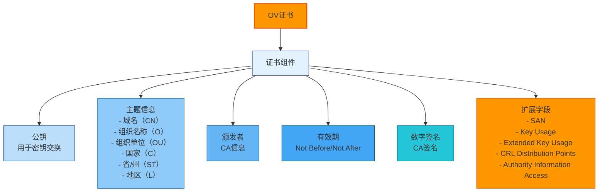

### 1.3 OV证书的信任模型

OV证书依赖于CA的严格验证流程，浏览器和操作系统信任主流CA颁发的OV证书。

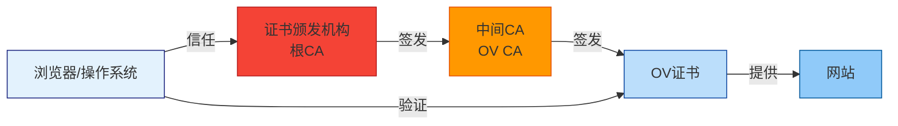

---

## 2. OV证书标准规范

### 2.1 CA/Browser Forum标准

CA/Browser Forum（CA/浏览器论坛）是制定SSL/TLS证书标准的国际组织，OV证书必须符合其Baseline Requirements（基线要求）。

#### 2.1.1 核心标准文档

| 标准文档 | 版本 | 说明 |
|----------|------|------|
| **Baseline Requirements** | 2.0.0 | SSL/TLS证书基线要求 |
| **EV Guidelines** | 1.7.0 | 扩展验证证书指南 |
| **RFC 5280** | - | X.509证书和CRL配置文件 |
| **RFC 6960** | - | 在线证书状态协议（OCSP） |
| **RFC 6961** | - | 多证书状态请求扩展 |

#### 2.1.2 验证要求

| 验证项 | 要求 | 说明 |
|--------|------|------|
| **域名所有权** | 必须验证 | 通过DNS、HTTP或邮箱验证 |
| **组织存在性** | 必须验证 | 通过政府数据库验证 |
| **组织身份** | 必须验证 | 验证组织名称、地址、电话 |
| **组织权限** | 必须验证 | 验证申请人的授权 |
| **联系方式** | 必须验证 | 验证电话、邮箱、地址 |

### 2.2 OV证书验证标准

#### 2.2.1 组织验证流程

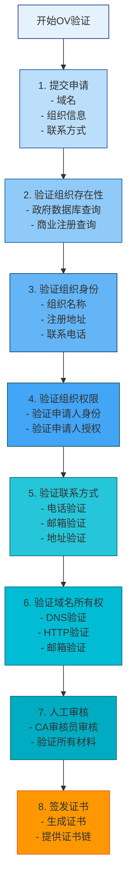

#### 2.2.2 所需材料清单

| 材料类型 | 说明 | 必需/可选 |
|----------|------|-----------|
| **营业执照** | 组织注册证明 | 必需 |
| **组织代码证** | 组织唯一标识 | 必需（中国） |
| **税务登记证** | 税务登记证明 | 可选 |
| **组织章程** | 组织章程文件 | 可选 |
| **申请人身份证** | 申请人身份证明 | 必需 |
| **授权书** | 申请授权证明 | 必需 |
| **域名注册信息** | 域名WHOIS信息 | 必需 |
| **联系方式证明** | 电话、邮箱、地址证明 | 必需 |

### 2.3 国际标准

#### 2.3.1 RFC标准

| RFC编号 | 标题 | 说明 |
|---------|------|------|
| **RFC 5280** | Internet X.509 Public Key Infrastructure Certificate and CRL Profile | X.509证书和CRL配置文件 |
| **RFC 6960** | X.509 Internet Public Key Infrastructure Online Certificate Status Protocol - OCSP | 在线证书状态协议 |
| **RFC 6961** | Multi-Prompt PKI Online Certificate Status Protocol Extension | 多证书状态请求扩展 |
| **RFC 7519** | JSON Web Token (JWT) | JSON Web令牌 |
| **RFC 8446** | The Transport Layer Security (TLS) Protocol Version 1.3 | TLS 1.3协议 |

#### 2.3.2 行业标准

| 标准 | 组织 | 说明 |
|------|------|------|
| **CA/Browser Forum BR** | CA/Browser Forum | SSL/TLS证书基线要求 |
| **EV Guidelines** | CA/Browser Forum | 扩展验证证书指南 |
| **WebTrust** | AICPA/CICA | CA审计标准 |
| **ETSI EN 319 401** | ETSI | 电子签名标准 |
| **ISO/IEC 27001** | ISO | 信息安全管理体系 |

---

## 3. OV证书验证流程

### 3.1 组织存在性验证

#### 3.1.1 验证方法

| 验证方法 | 说明 | 适用地区 |
|----------|------|----------|
| **政府数据库查询** | 查询政府注册数据库 | 全球 |
| **商业注册查询** | 查询商业注册数据库 | 全球 |
| **第三方数据库** | 使用第三方数据库服务 | 全球 |
| **人工验证** | CA审核员人工验证 | 全球 |

#### 3.1.2 验证流程

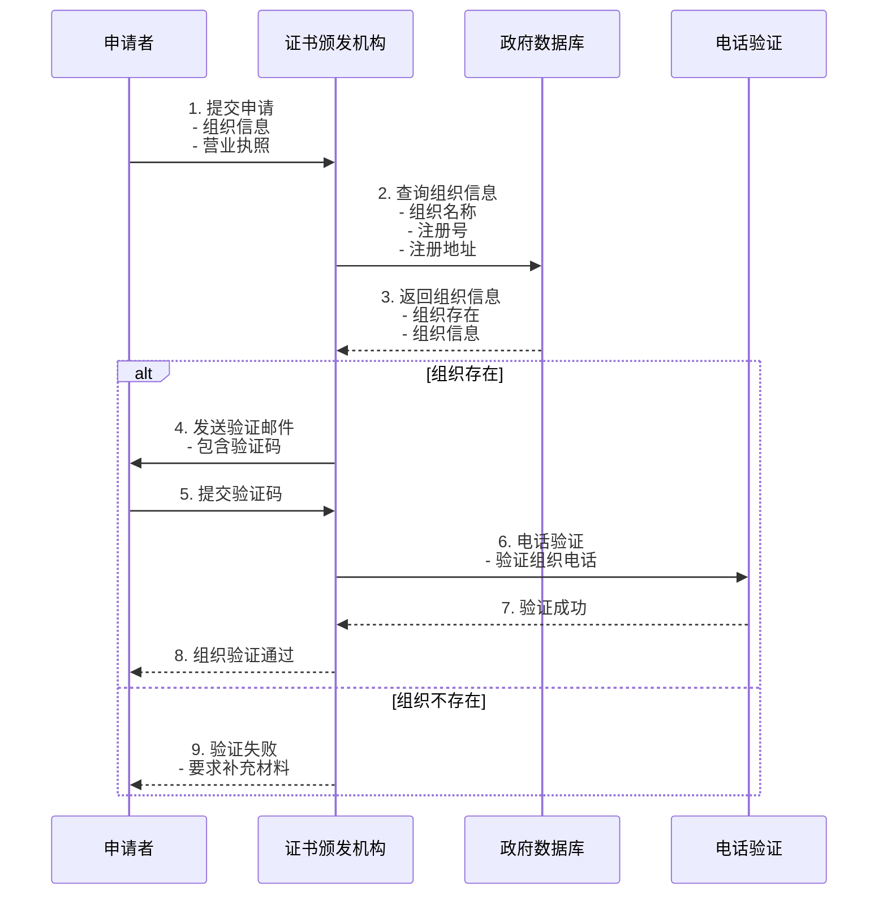

### 3.2 组织身份验证

#### 3.2.1 验证内容

| 验证项 | 说明 | 验证方式 |
|--------|------|----------|
| **组织名称** | 组织法定名称 | 政府数据库、营业执照 |
| **组织地址** | 组织注册地址 | 政府数据库、营业执照 |
| **组织电话** | 组织联系电话 | 电话验证 |
| **组织邮箱** | 组织联系邮箱 | 邮箱验证 |
| **组织类型** | 组织类型（公司、非营利等） | 政府数据库 |

#### 3.2.2 验证流程

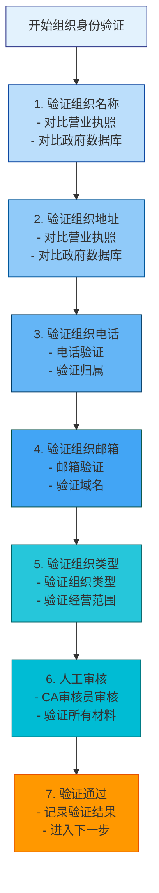

### 3.3 组织权限验证

#### 3.3.1 验证方法

| 验证方法 | 说明 | 适用场景 |
|----------|------|----------|
| **授权书验证** | 验证申请人授权书 | 所有场景 |
| **职务验证** | 验证申请人职务 | 所有场景 |
| **电话验证** | 电话确认申请人身份 | 所有场景 |
| **邮箱验证** | 邮箱确认申请人身份 | 所有场景 |

#### 3.3.2 验证流程

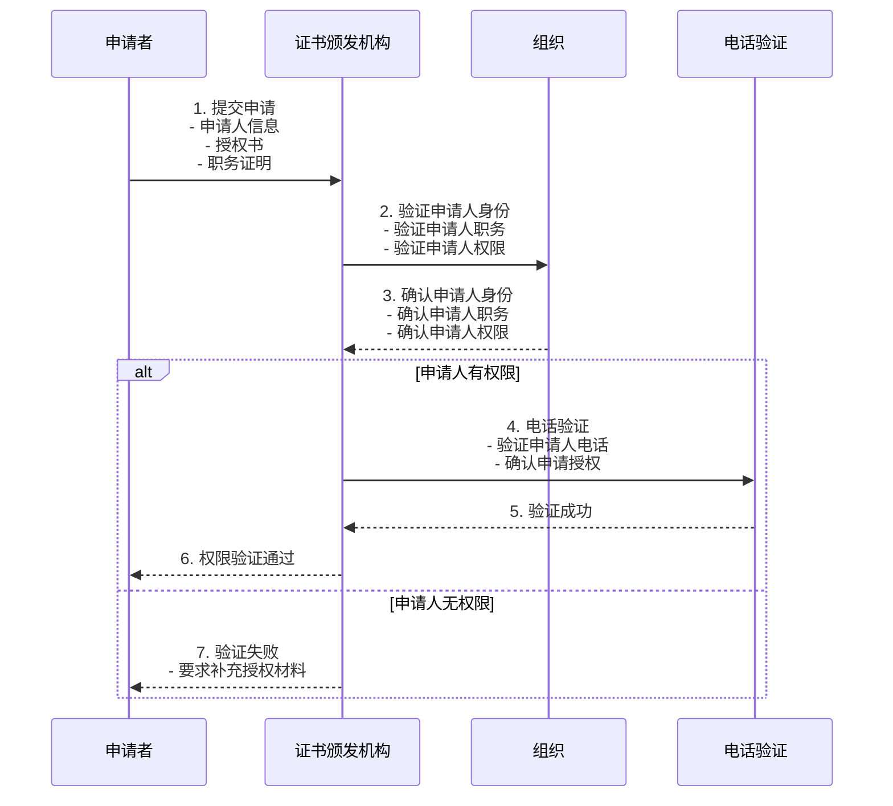

### 3.4 域名所有权验证

#### 3.4.1 验证方式

| 验证方式 | 说明 | 优点 | 缺点 |
|----------|------|------|------|
| **DNS TXT记录验证** | 在DNS中添加TXT记录 | 快速、简单 | 需要DNS管理权限 |
| **HTTP文件验证** | 在网站根目录放置验证文件 | 快速、简单 | 需要Web服务器 |
| **邮箱验证** | 向域名管理员邮箱发送验证邮件 | 安全 | 需要邮箱访问权限 |
| **WHOIS验证** | 验证WHOIS信息 | 简单 | WHOIS隐私保护 |

#### 3.4.2 验证流程

```mermaid
graph TD
    Start[开始域名所有权验证]
    
    Step1["1. 选择验证方式<br/>- DNS TXT<br/>- HTTP文件<br/>- 邮箱验证"]
    
    alt DNS验证
        Step2A["2. 添加DNS TXT记录<br/>- _acme-challenge.example.com<br/>- 验证字符串"]
        Step3A["3. 等待DNS传播<br/>- 通常1-5分钟<br/>- 最多24小时"]
        Step4A["4. CA验证DNS记录<br/>- 查询TXT记录<br/>- 验证匹配"]
    end
    
    alt HTTP验证
        Step2B["5. 创建验证文件<br/>- .well-known/acme-challenge/<br/>- 验证令牌"]
        Step3B["6. 配置Web服务器<br/>- 允许访问<br/>- 设置MIME类型"]
        Step4B["7. CA验证文件<br/>- HTTP GET请求<br/>- 验证内容"]
    end
    
    alt 邮箱验证
        Step2C["8. 发送验证邮件<br/>- 包含验证链接<br/>- 验证码"]
        Step3C["9. 点击验证链接<br/>- 确认验证"]
        Step4C["10. 验证成功"]
    end
    
    Step5["11. 验证成功<br/>- 签发证书<br/>- 清理验证记录"]
    
    Start --> Step1
    Step1 --> Step2A
    Step1 --> Step2B
    Step1 --> Step2C
    Step2A --> Step3A
    Step3A --> Step4A
    Step2B --> Step3B
    Step3B --> Step4B
    Step2C --> Step3C
    Step3C --> Step4C
    Step4A --> Step5
    Step4B --> Step5
    Step4C --> Step5
    
    style Start fill:#e3f2fd,stroke:#1a237e
    style Step1 fill:#bbdefb,stroke:#0d47a1
    style Step2A fill:#90caf9,stroke:#01579b
    style Step3A fill:#64b5f6,stroke:#013a63
    style Step4A fill:#42a5f5,stroke:#004d40
    style Step2B fill:#26c6da,stroke:#006064
    style Step3B fill:#00bcd4,stroke:#006064
    style Step4B fill:#00acc1,stroke:#006064
    style Step2C fill:#0097a7,stroke:#006064
    style Step3C fill:#00838f,stroke:#006064
    style Step4C fill:#006064,stroke:#004d40
    style Step5 fill:#ff9800,stroke:#e65100
```

---

## 4. OV证书与其他证书类型对比

### 4.1 验证级别对比

| 特性 | DV | OV | EV |
|------|----|----|----|
| **验证级别** | 域名验证 | 组织验证 | 扩展验证 |
| **验证内容** | 域名所有权 | 组织真实性 + 域名所有权 | 组织真实性 + 域名所有权 + 运营审查 |
| **验证时间** | 分钟-小时 | 1-3天 | 3-7天 |
| **验证方式** | 自动化 | 人工审核 | 严格人工审核 |
| **成本** | 免费/低 | 中等 | 高 |
| **信任度** | 基础 | 较高 | 最高 |
| **浏览器显示** | 锁图标 | 锁图标 + 组织名称 | 锁图标 + 组织名称 + 绿色 |
| **适用场景** | 个人网站、测试环境 | 企业网站、电商平台 | 金融机构、大型企业 |

### 4.2 证书内容对比

| 字段 | DV | OV | EV |
|------|----|----|----|
| **CN（通用名称）** | 域名 | 域名 | 域名 |
| **O（组织名称）** | 无 | 有 | 有 |
| **OU（组织单位）** | 无 | 可选 | 有 |
| **C（国家）** | 无 | 有 | 有 |
| **ST（省/州）** | 无 | 有 | 有 |
| **L（地区）** | 无 | 有 | 有 |
| **SAN（主题备用名称）** | 有 | 有 | 有 |

### 4.3 适用场景对比

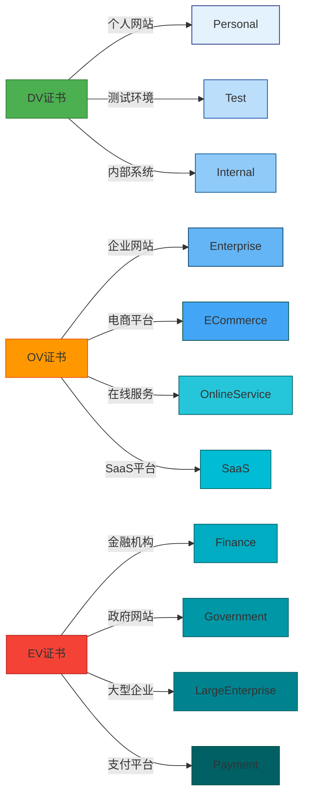

### 4.4 成本对比

| CA | DV | OV | EV |
|----|----|----|----|
| **Let's Encrypt** | 免费 | 不提供 | 不提供 |
| **ZeroSSL** | 免费（90天）<br/>付费（1年） | $99/年 | $199/年 |
| **DigiCert** | $199/年 | $299/年 | $599/年 |
| **Sectigo** | $49/年 | $99/年 | $199/年 |
| **GlobalSign** | $199/年 | $299/年 | $599/年 |
| **Comodo** | $49/年 | $99/年 | $199/年 |

---

## 5. OV证书申请流程

### 5.1 申请前准备

#### 5.1.1 准备材料清单

| 材料类型 | 说明 | 格式要求 |
|----------|------|----------|
| **营业执照** | 组织注册证明 | PDF/JPG，清晰可读 |
| **组织代码证** | 组织唯一标识 | PDF/JPG，清晰可读 |
| **申请人身份证** | 申请人身份证明 | PDF/JPG，清晰可读 |
| **授权书** | 申请授权证明 | PDF，加盖公章 |
| **域名注册信息** | 域名WHOIS信息 | 截图或PDF |
| **联系方式证明** | 电话、邮箱、地址证明 | 营业执照或账单 |

#### 5.1.2 技术准备

**服务器准备**：
- [ ] 确保Web服务器正常运行
- [ ] 配置正确的防火墙规则
- [ ] 确保端口80和443可访问
- [ ] 准备网站根目录

**域名准备**：
- [ ] 确保域名DNS解析正常
- [ ] 确保域名WHOIS信息准确
- [ ] 准备域名管理员邮箱
- [ ] 确认域名未过期

**证书准备**：
- [ ] 生成CSR（证书签名请求）
- [ ] 准备私钥文件
- [ ] 选择加密算法（RSA 2048/4096或ECDSA P-256/P-384）

### 5.2 生成CSR

#### 5.2.1 使用OpenSSL生成CSR

**生成RSA密钥和CSR**：
```bash
# 生成2048位RSA私钥
openssl genrsa -out www.example.com.key 2048

# 生成CSR
openssl req -new -key www.example.com.key -out www.example.com.csr

# 生成4096位RSA私钥（更安全）
openssl genrsa -out www.example.com.key 4096

# 生成CSR（4096位）
openssl req -new -key www.example.com.key -out www.example.com.csr
```

**生成ECDSA密钥和CSR**：
```bash
# 生成P-256椭圆曲线私钥
openssl ecparam -genkey -name prime256v1 -out www.example.com.key

# 生成CSR
openssl req -new -key www.example.com.key -out www.example.com.csr

# 生成P-384椭圆曲线私钥（更安全）
openssl ecparam -genkey -name secp384r1 -out www.example.com.key

# 生成CSR（P-384）
openssl req -new -key www.example.com.key -out www.example.com.csr
```

#### 5.2.2 CSR信息填写

**CSR信息示例**：
```bash
Country Name (2 letter code) [AU]:CN
State or Province Name (full name) [Some-State]:Beijing
Locality Name (eg, city) []:Beijing
Organization Name (eg, company) [Internet Widgits Pty Ltd]:Example Company Ltd
Organizational Unit Name (eg, section) []:IT Department
Common Name (e.g. server FQDN or YOUR name) []:www.example.com
Email Address []:admin@example.com

Please enter the following 'extra' attributes
to be sent with your certificate request
A challenge password []:
An optional company name []:
```

**注意事项**：
- **Common Name (CN)**：必须与域名完全匹配
- **Organization Name (O)**：必须与营业执照上的组织名称完全一致
- **Country Name (C)**：使用ISO 3166-1 alpha-2国家代码（中国为CN）
- **State/Province Name (ST)**：使用省份或州的全称
- **Locality Name (L)**：使用城市名称
- **Organizational Unit Name (OU)**：可选，通常为部门名称

#### 5.2.3 验证CSR

**查看CSR信息**：
```bash
# 查看CSR详细信息
openssl req -in www.example.com.csr -noout -text

# 查看CSR主题信息
openssl req -in www.example.com.csr -noout -subject

# 验证CSR签名
openssl req -in www.example.com.csr -noout -verify -verbose
```

### 5.3 提交申请

#### 5.3.1 在线申请流程

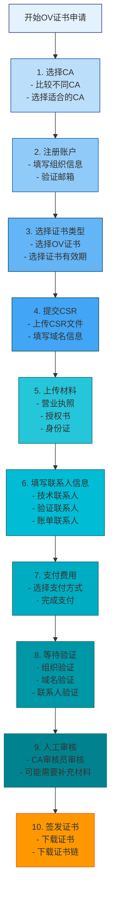

#### 5.3.2 申请表填写

**组织信息**：
| 字段 | 说明 | 示例 |
|------|------|------|
| **组织名称** | 必须与营业执照完全一致 | Example Company Ltd |
| **组织类型** | 公司、非营利组织等 | Corporation |
| **注册号** | 组织注册号 | 12345678901234567890 |
| **注册地址** | 组织注册地址 | No. 123, Main Street, Beijing, China |
| **联系电话** | 组织联系电话 | +86-10-12345678 |
| **联系邮箱** | 组织联系邮箱 | admin@example.com |

**域名信息**：
| 字段 | 说明 | 示例 |
|------|------|------|
| **主域名** | 主要域名 | www.example.com |
| **SAN域名** | 主题备用名称 | example.com, mail.example.com |
| **通配符域名** | 通配符证书 | *.example.com |

**联系人信息**：
| 字段 | 说明 | 示例 |
|------|------|------|
| **技术联系人** | 技术负责人 | John Doe |
| **技术联系人邮箱** | 技术负责人邮箱 | john.doe@example.com |
| **技术联系人电话** | 技术负责人电话 | +86-138-0000-0000 |
| **验证联系人** | 验证负责人 | Jane Smith |
| **验证联系人邮箱** | 验证负责人邮箱 | jane.smith@example.com |
| **验证联系人电话** | 验证负责人电话 | +86-139-0000-0000 |

### 5.4 验证过程

#### 5.4.1 组织验证

**验证流程**：


#### 5.4.2 域名验证

**验证方式选择**：

| 验证方式 | 说明 | 优点 | 缺点 | 推荐场景 |
|----------|------|------|------|----------|
| **DNS TXT记录验证** | 在DNS中添加TXT记录 | 快速、简单 | 需要DNS管理权限 | 大多数场景 |
| **HTTP文件验证** | 在网站根目录放置验证文件 | 快速、简单 | 需要Web服务器 | 大多数场景 |
| **邮箱验证** | 向域名管理员邮箱发送验证邮件 | 安全 | 需要邮箱访问权限 | 特定场景 |

**DNS TXT记录验证**：
```bash
# 1. CA提供验证字符串
# 验证字符串示例: 2023-01-01T12:00:00Z.example.com.abc123def456

# 2. 添加DNS TXT记录
# 主机记录: _acme-challenge
# 记录类型: TXT
# 记录值: 2023-01-01T12:00:00Z.example.com.abc123def456

# 3. 使用命令行添加DNS记录（以Cloudflare为例）
# 安装cloudflare-cli
pip install cloudflare-cli

# 配置API密钥
export CF_API_EMAIL="your-email@example.com"
export CF_API_KEY="your-api-key"

# 添加TXT记录
cf-cli dns add example.com TXT "_acme-challenge" "2023-01-01T12:00:00Z.example.com.abc123def456"

# 4. 验证DNS记录
dig TXT _acme-challenge.example.com

# 5. 等待DNS传播（通常1-5分钟）
for i in {1..10}; do
    dig TXT _acme-challenge.example.com +short
    sleep 10
done
```

**HTTP文件验证**：
```bash
# 1. CA提供验证文件
# 文件路径: .well-known/acme-challenge/token
# 文件内容: 验证字符串

# 2. 创建验证目录
mkdir -p /var/www/html/.well-known/acme-challenge

# 3. 创建验证文件
echo "验证字符串" > /var/www/html/.well-known/acme-challenge/token

# 4. 设置文件权限
chmod 644 /var/www/html/.well-known/acme-challenge/token

# 5. 配置Web服务器（Nginx）
# 在Nginx配置中添加：
location /.well-known/acme-challenge/ {
    root /var/www/html;
    try_files $uri =404;
    add_header Content-Type text/plain;
}

# 6. 重载Nginx
nginx -s reload

# 7. 测试访问
curl http://www.example.com/.well-known/acme-challenge/token
```

#### 5.4.3 联系人验证

**电话验证**：
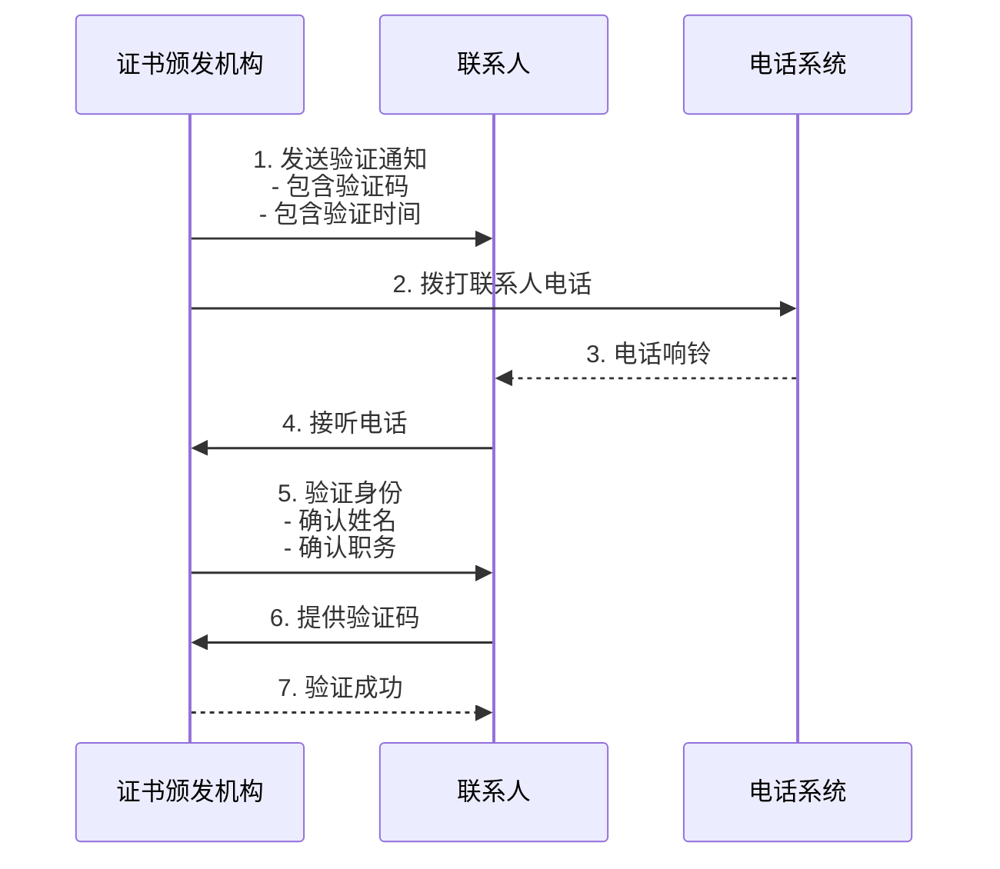

**邮箱验证**：
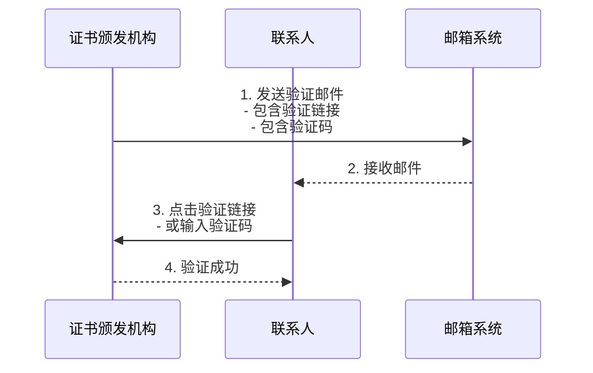

### 5.5 证书签发

#### 5.5.1 签发流程

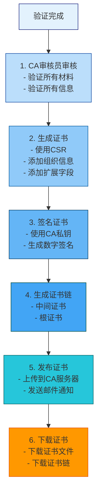

#### 5.5.2 证书文件

| 文件 | 说明 | 格式 |
|------|------|------|
| **www.example.com.crt** | 服务器证书 | PEM |
| **www.example.com.key** | 私钥文件 | PEM |
| **ca-bundle.crt** | 证书链（中间证书） | PEM |
| **fullchain.crt** | 完整证书链（服务器证书+中间证书） | PEM |

---

## 6. OV证书结构与技术原理

### 6.1 X.509证书结构

#### 6.1.1 证书字段

| 字段 | 说明 | OV证书示例 |
|------|------|-----------|
| **Version** | 证书版本 | 3 |
| **Serial Number** | 证书序列号 | 04:AB:CD:EF:12:34:56:78 |
| **Signature Algorithm** | 签名算法 | sha256WithRSAEncryption |
| **Issuer** | 颁发者 | CN=DigiCert TLS RSA SHA256 2020 CA1, O=DigiCert Inc, C=US |
| **Validity** | 有效期 | Not Before: 2023-01-01, Not After: 2024-01-01 |
| **Subject** | 主题 | CN=www.example.com, O=Example Company Ltd, L=Beijing, ST=Beijing, C=CN |
| **Subject Public Key Info** | 主题公钥信息 | RSA Public Key: 2048 bit |
| **Extensions** | 扩展字段 | SAN, Key Usage, Extended Key Usage, CRL DP, AIA |

#### 6.1.2 证书扩展字段

| 扩展字段 | 说明 | OV证书要求 |
|----------|------|-----------|
| **Subject Alternative Name (SAN)** | 主题备用名称 | 必需 |
| **Key Usage** | 密钥用法 | 必需 |
| **Extended Key Usage** | 扩展密钥用法 | 必需 |
| **CRL Distribution Points** | CRL分发点 | 必需 |
| **Authority Information Access** | 颁发者信息访问 | 必需 |
| **Basic Constraints** | 基本约束 | 必需 |
| **Subject Key Identifier** | 主题密钥标识符 | 必需 |
| **Authority Key Identifier** | 颁发者密钥标识符 | 必需 |

### 6.2 加密算法

#### 6.2.1 对称加密算法

| 算法 | 密钥长度 | 安全性 | 性能 | 推荐度 |
|------|----------|--------|------|--------|
| **AES-128-GCM** | 128位 | 高 | 高 | ⭐⭐⭐⭐⭐ |
| **AES-256-GCM** | 256位 | 极高 | 高 | ⭐⭐⭐⭐⭐ |
| **ChaCha20-Poly1305** | 256位 | 极高 | 极高 | ⭐⭐⭐⭐⭐ |
| **AES-128-CBC** | 128位 | 中 | 高 | ⭐⭐⭐ |
| **AES-256-CBC** | 256位 | 高 | 高 | ⭐⭐⭐⭐ |

#### 6.2.2 非对称加密算法

| 算法 | 密钥长度 | 安全性 | 性能 | 推荐度 |
|------|----------|--------|------|--------|
| **RSA-2048** | 2048位 | 中 | 中 | ⭐⭐⭐ |
| **RSA-4096** | 4096位 | 高 | 低 | ⭐⭐⭐⭐ |
| **ECDSA-P-256** | 256位 | 高 | 高 | ⭐⭐⭐⭐⭐ |
| **ECDSA-P-384** | 384位 | 极高 | 高 | ⭐⭐⭐⭐⭐ |
| **Ed25519** | 256位 | 极高 | 极高 | ⭐⭐⭐⭐⭐ |

#### 6.2.3 哈希算法

| 算法 | 输出长度 | 安全性 | 性能 | 推荐度 |
|------|----------|--------|------|--------|
| **SHA-256** | 256位 | 高 | 高 | ⭐⭐⭐⭐⭐ |
| **SHA-384** | 384位 | 极高 | 高 | ⭐⭐⭐⭐⭐ |
| **SHA-512** | 512位 | 极高 | 高 | ⭐⭐⭐⭐⭐ |
| **SHA-1** | 160位 | 低 | 高 | ❌ 不推荐 |

### 6.3 TLS协议

#### 6.3.1 TLS版本

| 版本 | 发布时间 | 安全性 | 性能 | 推荐度 |
|------|----------|--------|------|--------|
| **TLS 1.0** | 1999 | 低 | 低 | ❌ 已弃用 |
| **TLS 1.1** | 2006 | 低 | 低 | ❌ 已弃用 |
| **TLS 1.2** | 2008 | 高 | 高 | ⭐⭐⭐⭐ |
| **TLS 1.3** | 2018 | 极高 | 极高 | ⭐⭐⭐⭐⭐ |

#### 6.3.2 TLS握手流程

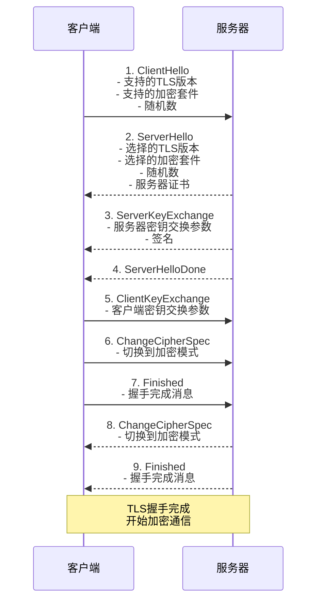

### 6.4 证书验证

#### 6.4.1 证书链验证

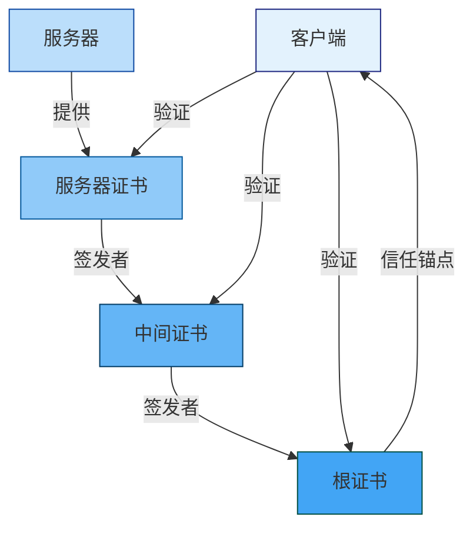

#### 6.4.2 证书验证步骤

| 步骤 | 验证内容 | 说明 |
|------|----------|------|
| **1. 证书有效期** | 检查证书是否在有效期内 | Not Before <= 当前时间 <= Not After |
| **2. 证书签名** | 验证证书签名是否有效 | 使用颁发者公钥验证签名 |
| **3. 证书链** | 验证证书链是否完整 | 从服务器证书到根证书 |
| **4. 证书吊销** | 检查证书是否被吊销 | 使用CRL或OCSP |
| **5. 证书用途** | 验证证书用途是否正确 | 检查Key Usage和Extended Key Usage |
| **6. 主机名验证** | 验证证书主机名是否匹配 | 检查CN和SAN |

---

## 7. OV证书部署配置

### 7.1 Nginx配置

#### 7.1.1 基本配置

```nginx
server {
    listen 443 ssl http2;
    server_name www.example.com;

    # 证书配置
    ssl_certificate /etc/ssl/certs/www.example.com.crt;
    ssl_certificate_key /etc/ssl/private/www.example.com.key;
    ssl_trusted_certificate /etc/ssl/certs/ca-bundle.crt;

    # SSL协议和加密套件
    ssl_protocols TLSv1.2 TLSv1.3;
    ssl_ciphers 'ECDHE-ECDSA-AES128-GCM-SHA256:ECDHE-RSA-AES128-GCM-SHA256:ECDHE-ECDSA-AES256-GCM-SHA384:ECDHE-RSA-AES256-GCM-SHA384';
    ssl_prefer_server_ciphers off;

    # SSL会话配置
    ssl_session_cache shared:SSL:10m;
    ssl_session_timeout 10m;
    ssl_session_tickets off;

    # OCSP Stapling
    ssl_stapling on;
    ssl_stapling_verify on;
    resolver 8.8.8.8 8.8.4.4 valid=300s;
    resolver_timeout 5s;

    # 安全头
    add_header Strict-Transport-Security "max-age=31536000; includeSubDomains" always;
    add_header X-Frame-Options "SAMEORIGIN" always;
    add_header X-Content-Type-Options "nosniff" always;
    add_header X-XSS-Protection "1; mode=block" always;

    # 日志配置
    access_log /var/log/nginx/access.log;
    error_log /var/log/nginx/error.log;

    # 网站根目录
    root /var/www/html;
    index index.html;
}

# HTTP服务器配置（重定向到HTTPS）
server {
    listen 80;
    server_name www.example.com;

    location / {
        return 301 https://$host$request_uri;
    }
}
```

#### 7.1.2 多域名配置

```nginx
server {
    listen 443 ssl http2;
    server_name www.example.com example.com mail.example.com;

    # 证书配置（使用SAN证书）
    ssl_certificate /etc/ssl/certs/example.com.crt;
    ssl_certificate_key /etc/ssl/private/example.com.key;
    ssl_trusted_certificate /etc/ssl/certs/ca-bundle.crt;

    # 其他配置...
}
```

### 7.2 Apache配置

#### 7.2.1 基本配置

```apache
<VirtualHost *:443>
    ServerName www.example.com

    # 启用SSL
    SSLEngine on

    # 证书配置
    SSLCertificateFile /etc/ssl/certs/www.example.com.crt
    SSLCertificateKeyFile /etc/ssl/private/www.example.com.key
    SSLCertificateChainFile /etc/ssl/certs/ca-bundle.crt

    # SSL协议和加密套件
    SSLProtocol all -SSLv2 -SSLv3 -TLSv1 -TLSv1.1
    SSLCipherSuite ECDHE-ECDSA-AES128-GCM-SHA256:ECDHE-RSA-AES128-GCM-SHA256:ECDHE-ECDSA-AES256-GCM-SHA384:ECDHE-RSA-AES256-GCM-SHA384
    SSLHonorCipherOrder off

    # SSL会话配置
    SSLSessionCache shmcb:/var/run/apache2/ssl_scache(512000)
    SSLSessionCacheTimeout 300
    SSLSessionTickets off

    # OCSP Stapling
    SSLUseStapling on
    SSLStaplingCache shmcb:/var/run/apache2/ocsp(128000)
    SSLStaplingResponderTimeout 5
    SSLStaplingReturnResponderErrors off

    # 安全头
    Header always set Strict-Transport-Security "max-age=31536000; includeSubDomains"
    Header always set X-Frame-Options "SAMEORIGIN"
    Header always set X-Content-Type-Options "nosniff"
    Header always set X-XSS-Protection "1; mode=block"

    # 日志配置
    ErrorLog ${APACHE_LOG_DIR}/error.log
    CustomLog ${APACHE_LOG_DIR}/access.log combined

    # 网站根目录
    DocumentRoot /var/www/html
    DirectoryIndex index.html
</VirtualHost>

# HTTP服务器配置（重定向到HTTPS）
<VirtualHost *:80>
    ServerName www.example.com

    RewriteEngine on
    RewriteCond %{HTTPS} off
    RewriteRule ^(.*)$ https://%{HTTP_HOST}%{REQUEST_URI} [L,R=301]
</VirtualHost>
```

### 7.3 Python应用配置

#### 7.3.1 使用SSL上下文

```python
import ssl
import asyncio
from aiohttp import web

async def handle_request(request):
    """处理请求"""
    return web.Response(text="Hello, secure world!")

async def create_server():
    """创建TLS服务器"""
    # 加载证书
    ssl_context = ssl.create_default_context(ssl.Purpose.CLIENT_AUTH)
    ssl_context.load_cert_chain(
        certfile='/etc/ssl/certs/www.example.com.crt',
        keyfile='/etc/ssl/private/www.example.com.key'
    )
    
    # 创建应用
    app = web.Application()
    app.router.add_get('/', handle_request)
    
    # 启动服务器
    runner = web.AppRunner(app)
    await runner.setup()
    site = web.TCPSite(runner, '0.0.0.0', 443, ssl_context=ssl_context)
    await site.start()
    
    print("TLS服务器已启动在端口443")

if __name__ == '__main__':
    asyncio.run(create_server())
```

#### 7.3.2 使用Flask

```python
from flask import Flask
from OpenSSL import SSL

app = Flask(__name__)

@app.route('/')
def hello():
    return 'Hello, secure world!'

if __name__ == '__main__':
    context = SSL.Context(SSL.SSLv23_METHOD)
    context.use_privatekey_file('/etc/ssl/private/www.example.com.key')
    context.use_certificate_file('/etc/ssl/certs/www.example.com.crt')
    
    app.run(host='0.0.0.0', port=443, ssl_context=context)
```

---

## 8. OV证书生命周期管理

### 8.1 证书监控

#### 8.1.1 证书有效期监控

**监控脚本**：
```bash
#!/bin/bash
# ov-cert-monitor.sh

CERT_FILE="/etc/ssl/certs/www.example.com.crt"
WARNING_DAYS=30
ALERT_EMAIL="admin@example.com"

# 检查证书有效期
check_expiry() {
    local expiry_date=$(openssl x509 -in "$CERT_FILE" -noout -enddate | cut -d= -f2)
    local expiry_timestamp=$(date -d "$expiry_date" +%s)
    local current_timestamp=$(date +%s)
    local days_left=$(( (expiry_timestamp - current_timestamp) / 86400 ))
    
    echo "证书过期时间: $expiry_date"
    echo "剩余天数: $days_left"
    
    if [ $days_left -lt $WARNING_DAYS ]; then
        echo "警告: 证书将在 $days_left 天内过期!"
        # 发送告警邮件
        echo "证书即将过期" | mail -s "证书告警" -a "From: cert-monitor@example.com" "$ALERT_EMAIL"
        return 1
    fi
    
    return 0
}

# 主函数
check_expiry
```

**Python监控脚本**：
```python
#!/usr/bin/env python3
# ov-cert-monitor.py

import ssl
import socket
from datetime import datetime, timedelta
import smtplib
from email.mime.text import MIMEText
from email.mime.multipart import MIMEMultipart

def check_cert_expiry(hostname, port=443, warning_days=30):
    """检查证书过期时间"""
    try:
        context = ssl.create_default_context()
        with socket.create_connection((hostname, port), timeout=10) as sock:
            with context.wrap_socket(sock, server_hostname=hostname) as ssock:
                cert = ssock.getpeercert(binary_form=True)
                x509 = ssl._ssl._test_decode_cert(cert)
                
                # 获取过期时间
                not_after = datetime.strptime(
                    x509['notAfter'],
                    '%b %d %b %Y %H:%M:%S %Z'
                )
                days_left = (not_after - datetime.utcnow()).days
                
                return {
                    'hostname': hostname,
                    'not_after': not_after,
                    'days_left': days_left,
                    'status': 'valid' if days_left > 0 else 'expired'
                }
    except Exception as e:
        return {
            'hostname': hostname,
            'error': str(e),
            'status': 'error'
        }

def send_alert(email_to, subject, body):
    """发送告警邮件"""
    msg = MIMEMultipart()
    msg['From'] = 'cert-monitor@example.com'
    msg['To'] = email_to
    msg['Subject'] = subject
    
    body_part = MIMEText(body, 'plain')
    msg.attach(body_part)
    
    with smtplib.SMTP('smtp.example.com', 587) as server:
        server.starttls()
        server.login('user', 'password')
        server.send_message(msg)
        server.quit()

def main():
    """主函数"""
    hostname = 'www.example.com'
    result = check_cert_expiry(hostname)
    
    print(f"主机名: {result.get('hostname')}")
    print(f"状态: {result.get('status')}")
    
    if 'not_after' in result:
        print(f"过期时间: {result['not_after']}")
    
    if 'days_left' in result:
        print(f"剩余天数: {result['days_left']}")
        
        if result['days_left'] < 30:
            subject = f"证书即将过期: {hostname}"
            body = f"主机 {hostname} 的OV证书将在 {result['days_left']} 天后过期。\n\n过期时间: {result.get('not_after')}"
            send_alert('admin@example.com', subject, body)

if __name__ == '__main__':
    main()
```

### 8.2 证书更新

#### 8.2.1 更新流程

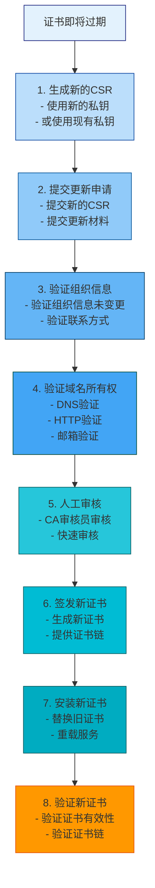

#### 8.2.2 更新脚本

```bash
#!/bin/bash
# ov-cert-renew.sh

set -euo pipefail

# 配置
CERT_DIR="/etc/ssl/certs"
KEY_DIR="/etc/ssl/private"
BACKUP_DIR="/var/backups/ssl"
DOMAIN="www.example.com"
WARNING_DAYS=30

# 颜色定义
RED='\033[0;31m'
GREEN='\033[0;32m'
YELLOW='\033[1;33m'
NC='\033[0m'

# 日志函数
log_info() {
    echo -e "${GREEN}[INFO]${NC} $1"
}

log_warn() {
    echo -e "${YELLOW}[WARN]${NC} $1"
}

log_error() {
    echo -e "${RED}[ERROR]${NC} $1"
}

# 检查证书有效期
check_cert_expiry() {
    local cert_file="$CERT_DIR/$DOMAIN.crt"
    
    if [ ! -f "$cert_file" ]; then
        log_error "证书文件不存在: $cert_file"
        return 1
    fi
    
    # 获取过期时间
    local expiry_date=$(openssl x509 -in "$cert_file" -noout -enddate | cut -d= -f2)
    local expiry_timestamp=$(date -d "$expiry_date" +%s)
    local current_timestamp=$(date +%s)
    local days_left=$(( (expiry_timestamp - current_timestamp) / 86400 ))
    
    log_info "证书过期时间: $expiry_date"
    log_info "剩余天数: $days_left"
    
    if [ $days_left -lt $WARNING_DAYS ]; then
        log_warn "警告: 证书将在 $days_left 天内过期!"
        return 1
    fi
    
    return 0
}

# 备份证书
backup_cert() {
    local timestamp=$(date +%Y%m%d_%H%M%S)
    local backup_dir="$BACKUP_DIR/$DOMAIN_$timestamp"
    
    mkdir -p "$backup_dir"
    
    log_info "备份证书到: $backup_dir"
    cp "$CERT_DIR/$DOMAIN.crt" "$backup_dir/"
    cp "$KEY_DIR/$DOMAIN.key" "$backup_dir/"
    
    log_info "备份完成"
}

# 更新证书
renew_cert() {
    log_info "开始更新证书: $DOMAIN"
    
    # 备份现有证书
    backup_cert
    
    # 生成新的CSR
    log_info "生成新的CSR"
    openssl req -new -key "$KEY_DIR/$DOMAIN.key" -out "$CERT_DIR/$DOMAIN.csr"
    
    # 提交更新申请（需要根据CA的具体流程调整）
    log_info "提交更新申请"
    # 这里需要根据CA的API或流程提交更新申请
    
    log_info "证书更新完成"
}

# 主函数
main() {
    if ! check_cert_expiry; then
        renew_cert
    else
        log_info "证书有效期充足，无需更新"
    fi
}

# 执行主函数
main
```

### 8.3 证书吊销

#### 8.3.1 吊销流程

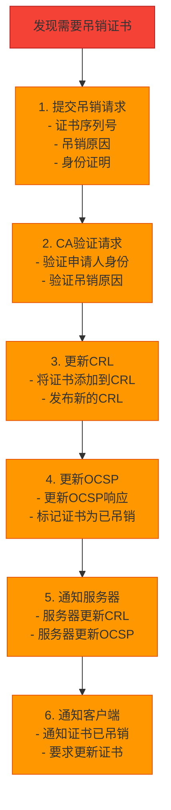

#### 8.3.2 吊销原因

| 吊销原因 | 说明 | 代码 |
|----------|------|------|
| **keyCompromise** | 密钥泄露 | 1 |
| **cACompromise** | CA密钥泄露 | 2 |
| **affiliationChanged** | 关系变更 | 3 |
| **superseded** | 被替代 | 4 |
| **cessationOfOperation** | 停止运营 | 5 |
| **certificateHold** | 证书暂停 | 6 |
| **removeFromCRL** | 从CRL中移除 | 8 |

---

## 9. OV证书安全特性

### 9.1 组织验证

#### 9.1.1 验证优势

| 安全特性 | 说明 | 优势 |
|----------|------|------|
| **组织真实性** | 验证组织真实存在 | 防止虚假网站 |
| **组织身份** | 验证组织身份信息 | 提高用户信任度 |
| **组织权限** | 验证申请人权限 | 防止未授权申请 |
| **联系方式** | 验证联系方式 | 确保可联系 |

#### 9.1.2 验证流程

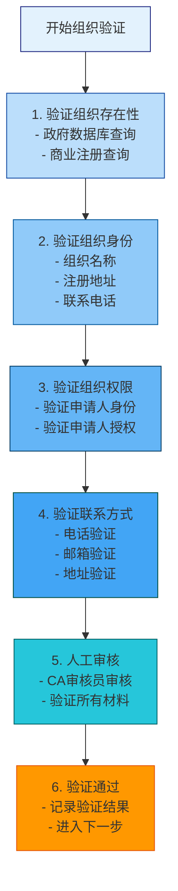

### 9.2 证书透明度

#### 9.2.1 CT日志

| CT日志 | 运营商 | URL |
|--------|--------|-----|
| **Google 'Argon2024'** | Google | https://ct.googleapis.com/logs/argon2024/ |
| **Google 'Argon2025'** | Google | https://ct.googleapis.com/logs/argon2025/ |
| **DigiCert Yeti2024** | DigiCert | https://ct.googleapis.com/logs/yeti2024/ |
| **Cloudflare 'Nimbus2024'** | Cloudflare | https://ct.cloudflare.com/logs/nimbus2024/ |

#### 9.2.2 CT监控

**监控脚本**：
```bash
#!/bin/bash
# ct-monitor.sh

DOMAIN="www.example.com"
CT_LOGS=(
    "https://ct.googleapis.com/logs/argon2024/"
    "https://ct.googleapis.com/logs/argon2025/"
)

# 检查证书是否在CT日志中
check_ct_log() {
    local ct_log="$1"
    local cert_file="/etc/ssl/certs/$DOMAIN.crt"
    
    echo "检查CT日志: $ct_log"
    
    # 获取证书的SCT（Signed Certificate Timestamp）
    local sct=$(openssl x509 -in "$cert_file" -noout -text | grep -A 1 "Signed Certificate Timestamp")
    
    if [ -z "$sct" ]; then
        echo "警告: 证书没有SCT"
        return 1
    fi
    
    echo "证书包含SCT"
    return 0
}

# 主函数
main() {
    for ct_log in "${CT_LOGS[@]}"; do
        check_ct_log "$ct_log"
    done
}

# 执行主函数
main
```

### 9.3 OCSP Stapling

#### 9.3.1 OCSP Stapling优势

| 优势 | 说明 |
|------|------|
| **提高性能** | 减少OCSP查询延迟 |
| **保护隐私** | 不暴露客户端IP |
| **提高可靠性** | 减少OCSP服务器负载 |

#### 9.3.2 配置OCSP Stapling

**Nginx配置**：
```nginx
# OCSP Stapling配置
ssl_stapling on;
ssl_stapling_verify on;
ssl_trusted_certificate /etc/ssl/certs/ca-bundle.crt;
resolver 8.8.8.8 8.8.4.4 valid=300s;
resolver_timeout 5s;
```

**Apache配置**：
```apache
# OCSP Stapling配置
SSLUseStapling on
SSLStaplingCache shmcb:/var/run/apache2/ocsp(128000)
SSLStaplingResponderTimeout 5
SSLStaplingReturnResponderErrors off
```

---

## 10. OV证书应用场景

### 10.1 企业网站

#### 10.1.1 适用性分析

| 场景 | OV证书适用性 | 说明 |
|------|-------------|------|
| **企业官网** | ✅ 适用 | 提高用户信任度 |
| **产品展示** | ✅ 适用 | 展示组织信息 |
| **新闻发布** | ✅ 适用 | 提高可信度 |
| **招聘信息** | ✅ 适用 | 提高可信度 |

#### 10.1.2 配置示例

```nginx
server {
    listen 443 ssl http2;
    server_name www.company.com company.com;

    # OV证书配置
    ssl_certificate /etc/ssl/certs/company.com.crt;
    ssl_certificate_key /etc/ssl/private/company.com.key;
    ssl_trusted_certificate /etc/ssl/certs/ca-bundle.crt;

    # 其他配置...
}
```

### 10.2 电商平台

#### 10.2.1 适用性分析

| 场景 | OV证书适用性 | 说明 |
|------|-------------|------|
| **在线商城** | ✅ 适用 | 提高用户信任度 |
| **支付系统** | ✅ 适用 | 满足PCI DSS要求 |
| **用户注册** | ✅ 适用 | 保护用户信息 |
| **订单管理** | ✅ 适用 | 保护订单信息 |

#### 10.2.2 配置示例

```nginx
server {
    listen 443 ssl http2;
    server_name www.shop.com shop.com;

    # OV证书配置
    ssl_certificate /etc/ssl/certs/shop.com.crt;
    ssl_certificate_key /etc/ssl/private/shop.com.key;
    ssl_trusted_certificate /etc/ssl/certs/ca-bundle.crt;

    # 安全头
    add_header Strict-Transport-Security "max-age=31536000; includeSubDomains" always;
    add_header Content-Security-Policy "default-src 'self'" always;

    # 其他配置...
}
```

### 10.3 在线服务

#### 10.3.1 适用性分析

| 场景 | OV证书适用性 | 说明 |
|------|-------------|------|
| **SaaS平台** | ✅ 适用 | 提高用户信任度 |
| **API服务** | ✅ 适用 | 保护API通信 |
| **云服务** | ✅ 适用 | 保护云服务通信 |
| **数据服务** | ✅ 适用 | 保护数据传输 |

#### 10.3.2 配置示例

```nginx
server {
    listen 443 ssl http2;
    server_name api.service.com;

    # OV证书配置
    ssl_certificate /etc/ssl/certs/service.com.crt;
    ssl_certificate_key /etc/ssl/private/service.com.key;
    ssl_trusted_certificate /etc/ssl/certs/ca-bundle.crt;

    # API配置
    location /api/ {
        proxy_pass http://backend;
        proxy_set_header Host $host;
        proxy_set_header X-Real-IP $remote_addr;
        proxy_set_header X-Forwarded-For $proxy_add_x_forwarded_for;
        proxy_set_header X-Forwarded-Proto $scheme;
    }

    # 其他配置...
}
```

---

## 11. 常见问题与解决方案

### 11.1 证书申请问题

#### 11.1.1 组织验证失败

**问题现象**：
```
Organization validation failed: Organization not found in government database
```

**可能原因**：
1. 组织名称与营业执照不一致
2. 组织注册号错误
3. 组织地址错误
4. 组织不存在

**解决方案**：
```bash
# 1. 检查营业执照信息
# 确保组织名称、注册号、地址与营业执照完全一致

# 2. 使用政府数据库查询
# 中国：国家企业信用信息公示系统
# http://www.gsxt.gov.cn/

# 3. 使用商业注册查询
# 天眼查：https://www.tianyancha.com/
# 企查查：https://www.qcc.com/

# 4. 联系CA客服
# 提供准确的营业执照信息
# 请求人工审核
```

#### 11.1.2 域名验证失败

**问题现象**：
```
Domain validation failed: DNS record not found
```

**可能原因**：
1. DNS记录未正确配置
2. DNS记录未传播
3. DNS记录格式错误
4. DNS服务器故障

**解决方案**：
```bash
# 1. 检查DNS记录
dig TXT _acme-challenge.www.example.com

# 2. 使用DNS查询工具
nslookup -type=TXT _acme-challenge.www.example.com

# 3. 检查DNS传播
for i in {1..10}; do
    dig TXT _acme-challenge.www.example.com +short
    sleep 10
done

# 4. 使用在线DNS查询工具
# https://www.whatsmydns.net/
# https://dnschecker.org/
```

#### 11.1.3 联系人验证失败

**问题现象**：
```
Contact validation failed: Phone verification failed
```

**可能原因**：
1. 电话号码错误
2. 电话无法接通
3. 联系人不在场
4. 联系人拒绝验证

**解决方案**：
```bash
# 1. 检查电话号码
# 确保电话号码格式正确
# 国际格式：+86-10-12345678

# 2. 确保电话可接通
# 测试电话是否可以正常接听

# 3. 确保联系人在场
# 提前通知联系人
# 安排合适的验证时间

# 4. 提供备用联系人
# 提供多个联系人
# 确保至少一个联系人可以验证
```

### 11.2 证书部署问题

#### 11.2.1 证书链不完整

**问题现象**：
```
SSL: error:0B080074:x509 certificate routines:X509_check_private_key:unable to get local issuer certificate
```

**可能原因**：
1. 中间证书缺失
2. 证书链顺序错误
3. CA证书未配置

**解决方案**：
```bash
# 1. 检查证书链
openssl s_client -connect www.example.com:443 -showcerts

# 2. 查看证书文件
ls -la /etc/ssl/certs/

# 3. 配置完整的证书链
# Nginx: ssl_trusted_certificate
# Apache: SSLCertificateChainFile

# 4. 验证证书链
openssl verify -CAfile /etc/ssl/certs/ca-bundle.crt /etc/ssl/certs/www.example.com.crt
```

#### 11.2.2 证书权限错误

**问题现象**：
```
nginx: [emerg] cannot load certificate "/etc/ssl/private/www.example.com.key": BIO_new_file:/etc/ssl/private/www.example.com.key:bad permissions
```

**可能原因**：
1. 私钥文件权限不正确
2. 文件所有者错误
3. SELinux/AppArmor阻止

**解决方案**：
```bash
# 1. 检查文件权限
ls -la /etc/ssl/private/www.example.com.key

# 2. 设置正确的权限
sudo chmod 600 /etc/ssl/private/www.example.com.key
sudo chmod 644 /etc/ssl/certs/www.example.com.crt

# 3. 检查文件所有者
sudo chown root:root /etc/ssl/private/www.example.com.key

# 4. 检查SELinux上下文
ls -Z /etc/ssl/private/www.example.com.key

# 5. 临时禁用SELinux（不推荐）
sudo setenforce 0
```

#### 11.2.3 证书过期

**问题现象**：
```
SSL: error:0B080074:x509 certificate routines:X509_check_private_key:certificate has expired
```

**可能原因**：
1. 证书自然过期
2. 自动更新失败
3. 系统时间不正确

**解决方案**：
```bash
# 1. 检查证书有效期
openssl x509 -in /etc/ssl/certs/www.example.com.crt -noout -dates

# 2. 手动更新证书
# 生成新的CSR
openssl req -new -key /etc/ssl/private/www.example.com.key -out /etc/ssl/certs/www.example.com.csr

# 提交更新申请
# 根据CA的流程提交更新申请

# 3. 检查系统时间
date

# 4. 同步系统时间
sudo ntpdate pool.ntp.org

# 5. 重载服务
sudo systemctl reload nginx
```

### 11.3 性能问题

#### 11.3.1 TLS握手慢

**问题现象**：
- TLS握手时间超过1秒
- 应用启动延迟高
- 用户体验差

**可能原因**：
1. 证书链过长
2. OCSP查询慢
3. 服务器性能问题
4. 网络延迟高

**解决方案**：
```nginx
# 1. 优化证书链
# 使用更短的证书链

# 2. 启用OCSP Stapling
ssl_stapling on;
ssl_stapling_verify on;
ssl_trusted_certificate /etc/ssl/certs/ca-bundle.crt;
resolver 8.8.8.8 8.8.4.4 valid=300s;
resolver_timeout 5s;

# 3. 优化SSL会话
ssl_session_cache shared:SSL:10m;
ssl_session_timeout 10m;

# 4. 使用TLS 1.3
ssl_protocols TLSv1.2 TLSv1.3;

# 5. 优化加密套件
ssl_ciphers 'ECDHE-ECDSA-AES128-GCM-SHA256:ECDHE-RSA-AES128-GCM-SHA256';
ssl_prefer_server_ciphers off;
```

#### 11.3.2 证书验证失败率高

**问题现象**：
- 大量证书验证失败
- 客户端连接被拒绝
- 用户体验差

**可能原因**：
1. CRL更新不及时
2. OCSP服务不可用
3. 证书配置错误
4. 客户端缓存问题

**解决方案**：
```nginx
# 1. 配置OCSP Stapling
ssl_stapling on;
ssl_stapling_verify on;
ssl_trusted_certificate /etc/ssl/certs/ca-bundle.crt;

# 2. 配置多个OCSP服务器
# 使用resolver指令配置多个DNS服务器

# 3. 优化SSL会话
ssl_session_cache shared:SSL:10m;
ssl_session_timeout 10m;

# 4. 监控OCSP服务状态
# 使用监控工具检查OCSP服务可用性
```

---

## 12. 附录：配置示例与工具

### 12.1 完整的Nginx OV证书配置

```nginx
user nginx;
worker_processes auto;
error_log /var/log/nginx/error.log warn;
pid /var/run/nginx.pid;

events {
    worker_connections 1024;
}

http {
    include /etc/nginx/mime.types;
    default_type application/octet-stream;

    log_format main '$remote_addr - $remote_user [$time_local] "$request" '
                    '$status $body_bytes_sent "$http_referer" '
                    '"$http_user_agent" "$http_x_forwarded_for"';

    access_log /var/log/nginx/access.log main;

    sendfile on;
    tcp_nopush on;
    tcp_nodelay on;
    keepalive_timeout 65;
    types_hash_max_size 2048;
    client_max_body_size 20m;

    # SSL配置
    ssl_session_cache shared:SSL:10m;
    ssl_session_timeout 10m;
    ssl_protocols TLSv1.2 TLSv1.3;
    ssl_ciphers 'ECDHE-ECDSA-AES128-GCM-SHA256:ECDHE-RSA-AES128-GCM-SHA256:ECDHE-ECDSA-AES256-GCM-SHA384:ECDHE-RSA-AES256-GCM-SHA384';
    ssl_prefer_server_ciphers off;

    # OV证书配置
    ssl_certificate /etc/ssl/certs/www.example.com.crt;
    ssl_certificate_key /etc/ssl/private/www.example.com.key;
    ssl_trusted_certificate /etc/ssl/certs/ca-bundle.crt;

    # OCSP Stapling
    ssl_stapling on;
    ssl_stapling_verify on;
    resolver 8.8.8.8 8.8.4.4 valid=300s;
    resolver_timeout 5s;

    # 安全头
    add_header Strict-Transport-Security "max-age=31536000; includeSubDomains; preload" always;
    add_header X-Frame-Options "SAMEORIGIN" always;
    add_header X-Content-Type-Options "nosniff" always;
    add_header X-XSS-Protection "1; mode=block" always;

    # HTTP服务器（重定向到HTTPS）
    server {
        listen 80;
        server_name www.example.com;

        location / {
            return 301 https://$host$request_uri;
        }
    }

    # HTTPS服务器
    server {
        listen 443 ssl http2;
        server_name www.example.com;

        root /var/www/html;
        index index.html;

        # 健康检查
        location /health {
            access_log off;
            return 200 "healthy\n";
            add_header Content-Type text/plain;
        }
    }
}
```

### 12.2 证书管理脚本

#### 12.2.1 OV证书管理脚本

```bash
#!/bin/bash
# ov-cert-manager.sh

set -euo pipefail

# 配置
CERT_DIR="/etc/ssl/certs"
KEY_DIR="/etc/ssl/private"
BACKUP_DIR="/var/backups/ssl"
WARNING_DAYS=30
ALERT_EMAIL="admin@example.com"

# 颜色定义
RED='\033[0;31m'
GREEN='\033[0;32m'
YELLOW='\033[1;33m'
NC='\033[0m'

# 日志函数
log_info() {
    echo -e "${GREEN}[INFO]${NC} $1"
}

log_warn() {
    echo -e "${YELLOW}[WARN]${NC} $1"
}

log_error() {
    echo -e "${RED}[ERROR]${NC} $1"
}

# 检查证书有效期
check_cert_expiry() {
    local cert_path="$1"
    
    if [ ! -f "$cert_path" ]; then
        log_error "证书文件不存在: $cert_path"
        return 1
    fi
    
    # 获取过期时间
    local expiry_date=$(openssl x509 -in "$cert_path" -noout -enddate | cut -d= -f2)
    local expiry_timestamp=$(date -d "$expiry_date" +%s)
    local current_timestamp=$(date +%s)
    local days_left=$(( (expiry_timestamp - current_timestamp) / 86400 ))
    
    log_info "证书过期时间: $expiry_date"
    log_info "剩余天数: $days_left"
    
    if [ $days_left -lt $WARNING_DAYS ]; then
        log_warn "警告: 证书将在 $days_left 天内过期!"
        
        # 发送告警邮件
        local subject="OV证书即将过期: $(basename $cert_path)"
        local body="证书 $(basename $cert_path) 将在 $days_left 天后过期。\n\n过期时间: $expiry_date"
        
        echo "$body" | mail -s "OV证书告警" -a "From: cert-manager@example.com" "$ALERT_EMAIL"
        return 1
    fi
    
    return 0
}

# 备份证书
backup_cert() {
    local cert_path="$1"
    local timestamp=$(date +%Y%m%d_%H%M%S)
    local backup_dir="$BACKUP_DIR/$(basename $cert_path)_$timestamp"
    
    mkdir -p "$backup_dir"
    
    log_info "备份证书到: $backup_dir"
    cp "$cert_path" "$backup_dir/"
    
    log_info "备份完成"
}

# 更新证书
renew_cert() {
    local cert_name="$1"
    
    log_info "更新证书: $cert_name"
    
    # 备份现有证书
    backup_cert "$CERT_DIR/$cert_name.crt"
    
    # 生成新的CSR
    log_info "生成新的CSR"
    openssl req -new -key "$KEY_DIR/$cert_name.key" -out "$CERT_DIR/$cert_name.csr"
    
    # 提交更新申请（需要根据CA的具体流程调整）
    log_info "提交更新申请"
    # 这里需要根据CA的API或流程提交更新申请
    
    # 重载服务
    log_info "重载Nginx服务"
    systemctl reload nginx
    
    log_info "证书更新完成"
}

# 列出所有证书
list_certs() {
    log_info "OV证书列表:"
    find "$CERT_DIR" -name "*.crt" -type f | while read cert_file; do
        local cert_name=$(basename "$cert_file" .crt)
        local expiry_date=$(openssl x509 -in "$cert_file" -noout -enddate | cut -d= -f2)
        echo "  $cert_name: $expiry_date"
    done
}

# 主函数
main() {
    case "${1:-help}" in
        check)
            check_cert_expiry "$CERT_DIR/www.example.com.crt"
            ;;
        backup)
            backup_cert "$CERT_DIR/www.example.com.crt"
            ;;
        renew)
            renew_cert "www.example.com"
            ;;
        list)
            list_certs
            ;;
        help|*)
            echo "用法: $0 {check|backup|renew|list|help}"
            echo ""
            echo "命令:"
            echo "  check    - 检查证书有效期"
            echo "  backup   - 备份当前证书"
            echo "  renew   - 更新证书"
            echo "  list     - 列出所有证书"
            echo "  help     - 显示帮助信息"
            ;;
    esac
}

# 执行主函数
main "$@"
```

### 12.3 在线工具与资源

#### 12.3.1 SSL/TLS工具

| 工具 | URL | 用途 |
|------|-----|------|
| **SSL Labs SSL Test** | https://www.ssllabs.com/ssltest/ | SSL配置评估 |
| **Mozilla SSL Config Generator** | https://ssl-config.mozilla.org/ | SSL配置生成 |
| **SSL Decoder** | https://www.sslshopper.com/ssl-decoder.html | 证书解码 |
| **CryptoReport** | https://cryptoreport.websecurity.symantec.com/ | 证书报告 |
| **Certificate Transparency** | https://crt.sh/ | CT日志查询 |

#### 12.3.2 DNS工具

| 工具 | URL | 用途 |
|------|-----|------|
| **dig** | https://www.isc.org/tools/dig/ | DNS查询 |
| **nslookup** | 内置工具 | DNS查询 |
| **DNSViz** | https://dnsviz.net/ | DNS可视化 |
| **WhatsMyDNS** | https://www.whatsmydns.net/ | DNS查询 |

#### 12.3.3 CA工具

| 工具 | URL | 用途 |
|------|-----|------|
| **DigiCert CertCentral** | https://www.digicert.com/secure/ | DigiCert管理平台 |
| **Sectigo Certificate Manager** | https://sectigo.com/ssl-certificates-tls/ | Sectigo管理平台 |
| **GlobalSign Certificate Center** | https://www.globalsign.com/en/ssl/ | GlobalSign管理平台 |

---

## 术语解释

| 术语 | 英文全称 | 中文解释 |
|------|----------|----------|
| **OV** | Organization Validated | 组织验证型证书 |
| **DV** | Domain Validated | 域名验证型证书 |
| **EV** | Extended Validation | 扩展验证型证书 |
| **CA** | Certificate Authority | 证书颁发机构 |
| **CSR** | Certificate Signing Request | 证书签名请求 |
| **SAN** | Subject Alternative Name | 主题备用名称 |
| **OCSP** | Online Certificate Status Protocol | 在线证书状态协议 |
| **CRL** | Certificate Revocation List | 证书吊销列表 |
| **CT** | Certificate Transparency | 证书透明度 |
| **TLS** | Transport Layer Security | 传输层安全协议 |
| **SSL** | Secure Sockets Layer | 安全套接字层 |
| **PKI** | Public Key Infrastructure | 公钥基础设施 |
| **RSA** | Rivest-Shamir-Adleman | RSA加密算法 |
| **ECDSA** | Elliptic Curve Digital Signature Algorithm | 椭圆曲线数字签名算法 |
| **AES** | Advanced Encryption Standard | 高级加密标准 |
| **GCM** | Galois/Counter Mode | GCM模式 |
| **SHA** | Secure Hash Algorithm | 安全哈希算法 |

---

## 参考资源

### 官方文档

- [RFC 5280 - Internet X.509 Public Key Infrastructure Certificate and CRL Profile](https://tools.ietf.org/html/rfc5280)
- [RFC 6960 - X.509 Internet Public Key Infrastructure Online Certificate Status Protocol (OCSP)](https://tools.ietf.org/html/rfc6960)
- [CA/Browser Forum Baseline Requirements](https://cabforum.org/baseline-requirements-documents/)
- [Mozilla SSL Configuration Generator](https://ssl-config.mozilla.org/)

### CA文档

- [DigiCert Documentation](https://www.digicert.com/help/)
- [Sectigo Documentation](https://sectigo.com/ssl-certificates-tls/)
- [GlobalSign Documentation](https://www.globalsign.com/en/ssl/ssl-certificate-support/)

### 安全标准

- [NIST Special Publication 800-57 Part 1 Rev. 5](https://nvlpubs.nist.gov/nistpubs/SpecialPublications/NIST.SP.800-57r1.pdf)
- [PCI DSS Requirements](https://www.pcisecuritystandards.org/documents/PCI_DSS_v3-2-1.pdf)
- [OWASP TLS Cheat Sheet](https://cheatsheetseries.owasp.org/cheatsheets/Transport_Layer_Protection_Cheat_Sheet)

---

**文档版本**: 1.0.0  
**最后更新**: 2026-01-18  
**维护者**: SMTP Tunnel Proxy Team
