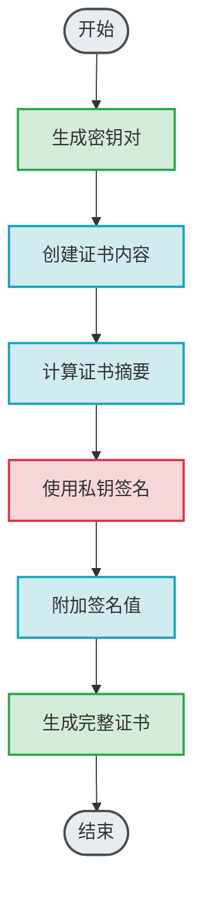
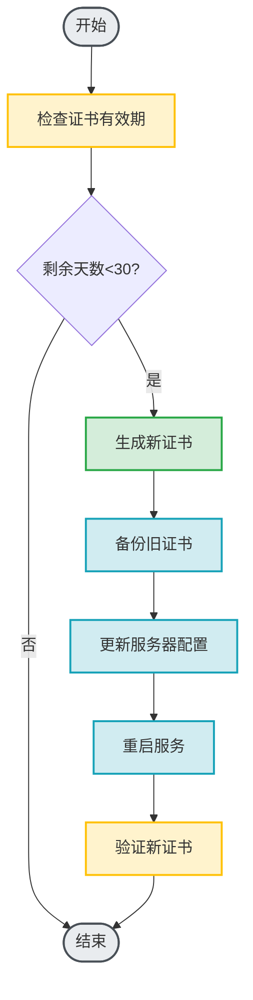

# 自签名证书技术文档

---

## 文档信息

| 项目 | 内容 |
|------|------|
| 文档标题 | 自签名证书技术文档 |
| 文档版本 | 1.0.0 |
| 创建日期 | 2026-01-18 |
| 最后更新 | 2026-01-18 |
| 维护者 | SMTP Tunnel Proxy Team |
| 文档状态 | 正式发布 |

---

## 目录

1. [概述](#1-概述)
   1.1 [文档目的](#11-文档目的)
   1.2 [适用范围](#12-适用范围)
   1.3 [术语定义](#13-术语定义)
2. [自签名证书概述](#2-自签名证书概述)
   2.1 [什么是自签名证书](#21-什么是自签名证书)
   2.2 [创建目的](#22-创建目的)
   2.3 [适用场景](#23-适用场景)
   2.4 [优缺点分析](#24-优缺点分析)
3. [技术原理](#3-技术原理)
   3.1 [X.509证书结构](#31-x509证书结构)
   3.2 [自签名机制](#32-自签名机制)
   3.3 [密钥对生成](#33-密钥对生成)
   3.4 [证书签名算法](#34-证书签名算法)
4. [证书生成步骤](#4-证书生成步骤)
   4.1 [准备工作](#41-准备工作)
   4.2 [生成私钥](#42-生成私钥)
   4.3 [生成证书签名请求CSR](#43-生成证书签名请求csr)
   4.4 [生成自签名证书](#44-生成自签名证书)
   4.5 [验证证书](#45-验证证书)
5. [工具详解](#5-工具详解)
   5.1 [OpenSSL](#51-openssl)
   5.2 [keytool](#52-keytool)
   5.3 [其他工具](#53-其他工具)
6. [命令参数说明](#6-命令参数说明)
   6.1 [OpenSSL参数](#61-openssl参数)
   6.2 [keytool参数](#62-keytool参数)
7. [证书使用示例](#7-证书使用示例)
   7.1 [Web服务器配置](#71-web服务器配置)
   7.2 [邮件服务器配置](#72-邮件服务器配置)
   7.3 [数据库服务器配置](#73-数据库服务器配置)
   7.4 [应用程序配置](#74-应用程序配置)
8. [安全注意事项](#8-安全注意事项)
   8.1 [密钥安全](#81-密钥安全)
   8.2 [证书安全](#82-证书安全)
   8.3 [传输安全](#83-传输安全)
   8.4 [存储安全](#84-存储安全)
9. [有效期管理](#9-有效期管理)
   9.1 [有效期设置](#91-有效期设置)
   9.2 [续期策略](#92-续期策略)
   9.3 [过期监控](#93-过期监控)
   9.4 [证书轮换](#94-证书轮换)
10. [常见问题排查](#10-常见问题排查)
    10.1 [生成问题](#101-生成问题)
    10.2 [验证问题](#102-验证问题)
    10.3 [使用问题](#103-使用问题)
    10.4 [性能问题](#104-性能问题)
11. [最佳实践](#11-最佳实践)
    11.1 [生成最佳实践](#111-生成最佳实践)
    11.2 [使用最佳实践](#112-使用最佳实践)
    11.3 [维护最佳实践](#113-维护最佳实践)
12. [附录](#12-附录)
    12.1 [配置文件示例](#121-配置文件示例)
    12.2 [脚本示例](#122-脚本示例)
    12.3 [检查清单](#123-检查清单)
13. [参考文献](#13-参考文献)

---

## 1. 概述

### 1.1 文档目的

本文档旨在为技术人员提供关于自签名证书的全面技术指南,包括自签名证书的创建、配置、使用和维护等方面的详细说明。通过本文档,读者将能够:

- 理解自签名证书的技术原理和应用场景
- 掌握自签名证书的生成方法和步骤
- 了解自签名证书的安全注意事项
- 掌握自签名证书的有效期管理策略
- 掌握常见问题的排查方法

### 1.2 适用范围

本文档适用于以下场景:

- 开发测试环境的SSL/TLS配置
- 内部网络服务的安全通信
- 实验室环境的证书管理
- 学习和教学目的
- 临时或短期使用的证书需求

### 1.3 术语定义

| 术语 | 定义 |
|------|------|
| 自签名证书 | 由证书主体自己签名的证书,不依赖第三方证书颁发机构(CA) |
| CA (Certificate Authority) | 证书颁发机构,负责签发和管理数字证书的可信第三方 |
| CSR (Certificate Signing Request) | 证书签名请求,包含公钥和身份信息的文件 |
| PEM (Privacy-Enhanced Mail) | 一种常用的证书和密钥存储格式 |
| DER (Distinguished Encoding Rules) | 二进制编码的证书格式 |
| X.509 | 公钥证书的国际化标准格式 |
| TLS (Transport Layer Security) | 传输层安全协议,用于保护网络通信 |
| SSL (Secure Sockets Layer) | 安全套接字层协议,TLS的前身 |

---

## 2. 自签名证书概述

### 2.1 什么是自签名证书

自签名证书是指由证书主体自己签名的数字证书,而不是由受信任的第三方证书颁发机构(CA)签发。在自签名证书中,证书的颁发者和主体是同一个实体。

自签名证书具有以下特点:

- **自我签发**: 证书的签名由证书主体自己生成
- **无需CA**: 不需要向第三方CA申请或支付费用
- **即时生成**: 可以快速生成,无需等待审核
- **完全控制**: 对证书的所有参数拥有完全控制权

### 2.2 创建目的

创建自签名证书的主要目的包括:

1. **开发测试**: 在开发环境中快速配置SSL/TLS,无需购买商业证书
2. **内部使用**: 在内部网络或私有云环境中保护服务通信
3. **成本节约**: 避免为测试或内部环境购买商业证书
4. **学习研究**: 用于学习和理解证书的工作原理
5. **快速部署**: 在紧急情况下快速启用加密通信

### 2.3 适用场景

#### 2.3.1 推荐使用场景

- **开发环境**: 应用程序开发、测试、调试
- **内部网络**: 企业内部服务、私有云、局域网
- **实验环境**: 技术验证、功能测试、性能测试
- **教学演示**: 培训、教学、技术分享
- **临时使用**: 短期项目、原型验证、概念验证

#### 2.3.2 不推荐使用场景

- **生产环境**: 面向公众的生产服务
- **电子商务**: 涉及在线支付、用户隐私的场景
- **医疗健康**: 涉及敏感个人健康信息的场景
- **金融服务**: 涉及资金交易、账户安全的场景
- **公共服务**: 政府机构、公共事业单位的服务

### 2.4 优缺点分析

#### 2.4.1 优点

| 优点 | 说明 |
|------|------|
| **免费** | 无需支付证书费用 |
| **快速** | 即时生成,无需等待审核 |
| **灵活** | 完全控制证书参数 |
| **简单** | 生成过程简单,无需复杂配置 |
| **私密** | 不需要向第三方提供任何信息 |

#### 2.4.2 缺点

| 缺点 | 说明 |
|------|------|
| **不受信任** | 浏览器和操作系统默认不信任 |
| **安全警告** | 用户会看到安全警告提示 |
| **不适用** | 不适合面向公众的生产环境 |
| **维护负担** | 需要手动管理证书有效期 |
| **兼容性** | 某些应用程序可能拒绝连接 |

---

## 3. 技术原理

### 3.1 X.509证书结构

X.509证书是公钥证书的标准格式,自签名证书遵循X.509标准。证书包含以下主要部分:

#### 3.1.1 证书基本信息

```
证书版本 (Version)
序列号 (Serial Number)
签名算法 (Signature Algorithm)
颁发者 (Issuer)
有效期 (Validity)
  - 开始时间 (Not Before)
  - 结束时间 (Not After)
主体 (Subject)
主体公钥信息 (Subject Public Key Info)
  - 公钥算法
  - 公钥值
```

#### 3.1.2 证书扩展字段

```
基本约束 (Basic Constraints)
密钥用途 (Key Usage)
扩展密钥用途 (Extended Key Usage)
主题备用名称 (Subject Alternative Name)
密钥标识符 (Subject Key Identifier)
颁发者密钥标识符 (Authority Key Identifier)
CRL分发点 (CRL Distribution Points)
```

### 3.2 自签名机制

自签名证书的签名机制如下:



#### 3.2.1 签名过程

1. **生成密钥对**: 创建公钥和私钥
2. **创建证书内容**: 填写证书的主题信息、有效期等
3. **计算证书摘要**: 使用哈希算法计算证书内容的摘要值
4. **使用私钥签名**: 使用私钥对摘要值进行签名
5. **附加签名值**: 将签名值附加到证书中
6. **生成完整证书**: 生成完整的X.509证书文件

### 3.3 密钥对生成

#### 3.3.1 RSA密钥对

RSA是最常用的非对称加密算法,密钥长度通常为2048位或4096位。

**生成RSA密钥对**:

```bash
# 生成2048位RSA私钥
openssl genrsa -out private.key 2048

# 生成4096位RSA私钥(更安全)
openssl genrsa -out private.key 4096
```

#### 3.3.2 ECDSA密钥对

ECDSA是椭圆曲线数字签名算法,提供相同安全级别下更短的密钥长度。

**生成ECDSA密钥对**:

```bash
# 生成P-256曲线的ECDSA私钥
openssl ecparam -genkey -name prime256v1 -out private.key

# 生成P-384曲线的ECDSA私钥(更安全)
openssl ecparam -genkey -name secp384r1 -out private.key
```

### 3.4 证书签名算法

#### 3.4.1 常用签名算法

| 算法 | 描述 | 安全级别 | 推荐场景 |
|------|------|---------|---------|
| SHA256withRSA | RSA + SHA256 | 高 | 通用场景 |
| SHA384withRSA | RSA + SHA384 | 很高 | 高安全要求 |
| SHA512withRSA | RSA + SHA512 | 很高 | 最高安全要求 |
| ECDSAwithSHA256 | ECDSA + SHA256 | 高 | 性能敏感场景 |
| ECDSAwithSHA384 | ECDSA + SHA384 | 很高 | 高安全要求 |

#### 3.4.2 签名算法选择

选择签名算法时应考虑以下因素:

- **安全级别**: 根据安全需求选择合适的算法
- **性能要求**: 考虑签名和验证的性能
- **兼容性**: 确保目标系统支持所选算法
- **合规要求**: 满足行业或法规的合规要求

---

## 4. 证书生成步骤

### 4.1 准备工作

#### 4.1.1 环境准备

在生成自签名证书之前,需要准备以下环境:

```bash
# 检查OpenSSL版本
openssl version

# 检查Java环境(如果使用keytool)
java -version

# 创建证书存储目录
mkdir -p /etc/ssl/self-signed
cd /etc/ssl/self-signed
```

#### 4.1.2 工具安装

确保系统已安装必要的工具:

```bash
# Ubuntu/Debian
sudo apt-get update
sudo apt-get install -y openssl

# CentOS/RHEL
sudo yum install -y openssl

# macOS
brew install openssl
```

#### 4.1.3 信息准备

准备证书所需的信息:

| 字段 | 说明 | 示例 |
|------|------|------|
| 国家代码 | 两字母国家代码 | CN |
| 州/省 | 州或省份名称 | Beijing |
| 城市 | 城市名称 | Beijing |
| 组织 | 组织名称 | My Company |
| 组织单位 | 部门或单位名称 | IT Department |
| 通用名称 | 域名或服务器名称 | localhost |
| 电子邮件 | 联系邮箱 | admin@example.com |

### 4.2 生成私钥

#### 4.2.1 生成RSA私钥

```bash
# 生成2048位RSA私钥
openssl genrsa -out server.key 2048

# 查看私钥信息
openssl rsa -in server.key -text -noout

# 设置私钥权限
chmod 600 server.key
```

#### 4.2.2 生成ECDSA私钥

```bash
# 生成P-256曲线的ECDSA私钥
openssl ecparam -genkey -name prime256v1 -out server.key

# 查看私钥信息
openssl ec -in server.key -text -noout

# 设置私钥权限
chmod 600 server.key
```

#### 4.2.3 加密私钥

为了提高安全性,可以对私钥进行加密:

```bash
# 生成加密的RSA私钥(AES256加密)
openssl genrsa -aes256 -out server.key 2048

# 或者加密已有的私钥
openssl rsa -in server.key -aes256 -out server-encrypted.key
```

### 4.3 生成证书签名请求CSR

#### 4.3.1 交互式生成CSR

```bash
# 交互式生成CSR
openssl req -new -key server.key -out server.csr

# 系统会提示输入以下信息:
# Country Name (2 letter code) [AU]:CN
# State or Province Name (full name) [Some-State]:Beijing
# Locality Name (eg, city) []:Beijing
# Organization Name (eg, company) [Internet Widgits Pty Ltd]:My Company
# Organizational Unit Name (eg, section) []:IT Department
# Common Name (e.g. server FQDN or YOUR name) []:localhost
# Email Address []:admin@example.com
```

#### 4.3.2 非交互式生成CSR

```bash
# 使用配置文件生成CSR
cat > cert.conf << EOF
[req]
default_bits = 2048
distinguished_name = req_distinguished_name
req_extensions = v3_req
prompt = no

[req_distinguished_name]
C = CN
ST = Beijing
L = Beijing
O = My Company
OU = IT Department
CN = localhost
emailAddress = admin@example.com

[v3_req]
keyUsage = keyEncipherment, dataEncipherment
extendedKeyUsage = serverAuth
subjectAltName = @alt_names

[alt_names]
DNS.1 = localhost
DNS.2 = *.localhost
IP.1 = 127.0.0.1
EOF

# 生成CSR
openssl req -new -key server.key -out server.csr -config cert.conf
```

#### 4.3.3 查看CSR信息

```bash
# 查看CSR详细信息
openssl req -in server.csr -text -noout

# 验证CSR
openssl req -in server.csr -verify -noout
```

### 4.4 生成自签名证书

#### 4.4.1 基本自签名证书

```bash
# 生成有效期365天的自签名证书
openssl x509 -req -days 365 -in server.csr -signkey server.key -out server.crt

# 查看证书信息
openssl x509 -in server.crt -text -noout
```

#### 4.4.2 带扩展字段的自签名证书

```bash
# 使用配置文件生成带扩展字段的证书
openssl x509 -req -days 365 -in server.csr -signkey server.key -out server.crt \
    -extensions v3_req -extfile cert.conf
```

#### 4.4.3 指定签名算法

```bash
# 使用SHA256withRSA签名
openssl x509 -req -days 365 -in server.csr -signkey server.key -out server.crt \
    -sha256

# 使用SHA384withRSA签名
openssl x509 -req -days 365 -in server.csr -signkey server.key -out server.crt \
    -sha384
```

#### 4.4.4 一步生成证书和私钥

```bash
# 一步生成私钥和自签名证书
openssl req -x509 -newkey rsa:2048 -keyout server.key -out server.crt \
    -days 365 -nodes \
    -subj "/C=CN/ST=Beijing/L=Beijing/O=My Company/OU=IT Department/CN=localhost/emailAddress=admin@example.com"
```

### 4.5 验证证书

#### 4.5.1 验证证书有效性

```bash
# 验证证书
openssl x509 -in server.crt -noout -text

# 检查证书有效期
openssl x509 -in server.crt -noout -dates

# 检查证书主题
openssl x509 -in server.crt -noout -subject

# 检查证书颁发者
openssl x509 -in server.crt -noout -issuer
```

#### 4.5.2 验证证书和私钥匹配

```bash
# 检查证书和私钥是否匹配
CERT_MOD=$(openssl x509 -noout -modulus -in server.crt | openssl md5)
KEY_MOD=$(openssl rsa -noout -modulus -in server.key | openssl md5)

if [ "$CERT_MOD" = "$KEY_MOD" ]; then
    echo "证书和私钥匹配"
else
    echo "证书和私钥不匹配"
fi
```

#### 4.5.3 验证证书链

```bash
# 验证证书(自签名证书会显示自签名警告)
openssl verify -CAfile server.crt server.crt

# 输出示例:
# server.crt: OK
```

---

## 5. 工具详解

### 5.1 OpenSSL

#### 5.1.1 OpenSSL简介

OpenSSL是一个强大的安全套接字层密码库,包含主要的密码算法、常用的密钥和证书封装管理功能以及SSL协议,并提供丰富的应用程序供测试或其他目的使用。

#### 5.1.2 OpenSSL常用命令

| 命令 | 功能 | 示例 |
|------|------|------|
| `openssl genrsa` | 生成RSA私钥 | `openssl genrsa -out key.pem 2048` |
| `openssl ecparam` | 生成ECDSA参数和密钥 | `openssl ecparam -genkey -name prime256v1 -out key.pem` |
| `openssl req` | 生成证书签名请求 | `openssl req -new -key key.pem -out csr.pem` |
| `openssl x509` | 处理X.509证书 | `openssl x509 -req -days 365 -in csr.pem -signkey key.pem -out cert.pem` |
| `openssl rsa` | 处理RSA私钥 | `openssl rsa -in key.pem -text -noout` |
| `openssl ec` | 处理ECDSA私钥 | `openssl ec -in key.pem -text -noout` |
| `openssl verify` | 验证证书 | `openssl verify -CAfile ca.pem cert.pem` |

#### 5.1.3 OpenSSL配置文件

OpenSSL使用配置文件来管理默认设置和扩展字段:

```bash
# 查看OpenSSL配置文件位置
openssl version -d

# 常见位置:
# - Linux: /etc/ssl/openssl.cnf
# - macOS: /usr/local/etc/openssl/openssl.cnf
# - Windows: C:\Program Files\OpenSSL-Win64\bin\openssl.cfg
```

### 5.2 keytool

#### 5.2.1 keytool简介

keytool是Java开发工具包(JDK)中的一个密钥和证书管理工具,用于管理密钥库(keystore)和证书。

#### 5.2.2 keytool常用命令

| 命令 | 功能 | 示例 |
|------|------|------|
| `-genkeypair` | 生成密钥对 | `keytool -genkeypair -alias mykey -keyalg RSA -keysize 2048` |
| `-certreq` | 生成证书签名请求 | `keytool -certreq -alias mykey -file csr.csr` |
| `-importcert` | 导入证书 | `keytool -importcert -alias mycert -file cert.cer` |
| `-exportcert` | 导出证书 | `keytool -exportcert -alias mycert -file cert.cer` |
| `-list` | 列出密钥库条目 | `keytool -list -v` |
| `-delete` | 删除条目 | `keytool -delete -alias mykey` |

#### 5.2.3 使用keytool生成自签名证书

```bash
# 生成密钥对和自签名证书
keytool -genkeypair -alias mykey -keyalg RSA -keysize 2048 \
    -validity 365 -keystore keystore.jks \
    -dname "CN=localhost, OU=IT, O=My Company, L=Beijing, ST=Beijing, C=CN" \
    -storepass changeit -keypass changeit

# 导出证书
keytool -exportcert -alias mykey -file server.crt -keystore keystore.jks \
    -storepass changeit

# 查看证书信息
keytool -printcert -file server.crt
```

### 5.3 其他工具

#### 5.3.1 Certbot

Certbot是Let's Encrypt的官方客户端,用于自动化获取和更新免费SSL证书。

```bash
# 安装Certbot
sudo apt-get install certbot

# 获取证书(需要域名和DNS配置)
sudo certbot certonly --standalone -d example.com
```

#### 5.3.2 mkcert

mkcert是一个用于生成本地开发用可信证书的工具。

```bash
# 安装mkcert
# macOS
brew install mkcert nss

# Linux
sudo apt-get install mkcert

# 安装CA证书
mkcert -install

# 生成本地证书
mkcert localhost 127.0.0.1 ::1
```

---

## 6. 命令参数说明

### 6.1 OpenSSL参数

#### 6.1.1 genrsa参数

| 参数 | 说明 | 示例 |
|------|------|------|
| `-out` | 输出文件 | `-out private.key` |
| `-aes256` | 使用AES256加密私钥 | `-aes256` |
| `-f4` | 使用F4作为公钥指数 | `-f4` |
| `-rand` | 指定随机数种子文件 | `-rand /dev/urandom` |

#### 6.1.2 req参数

| 参数 | 说明 | 示例 |
|------|------|------|
| `-new` | 生成新的证书签名请求 | `-new` |
| `-key` | 指定私钥文件 | `-key server.key` |
| `-out` | 输出CSR文件 | `-out server.csr` |
| `-config` | 指定配置文件 | `-config cert.conf` |
| `-nodes` | 不加密私钥 | `-nodes` |
| `-subj` | 指定主题信息 | `-subj "/C=CN/CN=localhost"` |
| `-x509` | 直接生成自签名证书 | `-x509` |
| `-days` | 证书有效期(天) | `-days 365` |
| `-sha256` | 使用SHA256哈希算法 | `-sha256` |

#### 6.1.3 x509参数

| 参数 | 说明 | 示例 |
|------|------|------|
| `-req` | 输入是CSR文件 | `-req` |
| `-in` | 输入文件 | `-in server.csr` |
| `-signkey` | 指定签名私钥 | `-signkey server.key` |
| `-out` | 输出证书文件 | `-out server.crt` |
| `-days` | 证书有效期(天) | `-days 365` |
| `-sha256` | 使用SHA256哈希算法 | `-sha256` |
| `-extensions` | 指定扩展字段 | `-extensions v3_req` |
| `-extfile` | 指定扩展文件 | `-extfile cert.conf` |
| `-text` | 以文本格式输出 | `-text` |
| `-noout` | 不输出编码数据 | `-noout` |

### 6.2 keytool参数

| 参数 | 说明 | 示例 |
|------|------|------|
| `-genkeypair` | 生成密钥对 | `-genkeypair` |
| `-alias` | 指定别名 | `-alias mykey` |
| `-keyalg` | 密钥算法 | `-keyalg RSA` |
| `-keysize` | 密钥长度 | `-keysize 2048` |
| `-validity` | 有效期(天) | `-validity 365` |
| `-keystore` | 密钥库文件 | `-keystore keystore.jks` |
| `-storepass` | 密钥库密码 | `-storepass changeit` |
| `-keypass` | 私钥密码 | `-keypass changeit` |
| `-dname` | 专有名称 | `-dname "CN=localhost"` |

---

## 7. 证书使用示例

### 7.1 Web服务器配置

#### 7.1.1 Nginx配置

```nginx
server {
    listen 443 ssl;
    server_name localhost;

    # 证书文件路径
    ssl_certificate /etc/ssl/self-signed/server.crt;
    ssl_certificate_key /etc/ssl/self-signed/server.key;

    # SSL配置
    ssl_protocols TLSv1.2 TLSv1.3;
    ssl_ciphers HIGH:!aNULL:!MD5;
    ssl_prefer_server_ciphers on;

    # 网站根目录
    root /var/www/html;
    index index.html;

    location / {
        try_files $uri $uri/ =404;
    }
}
```

#### 7.1.2 Apache配置

```apache
<VirtualHost *:443>
    ServerName localhost
    DocumentRoot /var/www/html

    # SSL配置
    SSLEngine on
    SSLCertificateFile /etc/ssl/self-signed/server.crt
    SSLCertificateKeyFile /etc/ssl/self-signed/server.key

    # SSL协议和加密套件
    SSLProtocol all -SSLv2 -SSLv3 -TLSv1 -TLSv1.1
    SSLCipherSuite HIGH:!aNULL:!MD5

    <Directory /var/www/html>
        Options Indexes FollowSymLinks
        AllowOverride All
        Require all granted
    </Directory>
</VirtualHost>
```

### 7.2 邮件服务器配置

#### 7.2.1 Postfix配置

```bash
# /etc/postfix/main.cf

# 启用TLS
smtpd_tls_security_level = may
smtpd_tls_cert_file = /etc/ssl/self-signed/server.crt
smtpd_tls_key_file = /etc/ssl/self-signed/server.key
smtpd_tls_protocols = !SSLv2, !SSLv3, !TLSv1, !TLSv1.1

# 客户端TLS
smtp_tls_security_level = may
smtp_tls_cert_file = /etc/ssl/self-signed/server.crt
smtp_tls_key_file = /etc/ssl/self-signed/server.key
```

#### 7.2.2 Dovecot配置

```bash
# /etc/dovecot/conf.d/10-ssl.conf

ssl = yes
ssl_cert = </etc/ssl/self-signed/server.crt
ssl_key = </etc/ssl/self-signed/server.key

# SSL协议
ssl_protocols = !SSLv2 !SSLv3 !TLSv1 !TLSv1.1

# 加密套件
ssl_cipher_list = HIGH:!aNULL:!MD5
```

### 7.3 数据库服务器配置

#### 7.3.1 MySQL配置

```bash
# /etc/mysql/my.cnf

[mysqld]
# 启用SSL
require_secure_transport = ON

# SSL证书配置
ssl-ca = /etc/ssl/self-signed/server.crt
ssl-cert = /etc/ssl/self-signed/server.crt
ssl-key = /etc/ssl/self-signed/server.key
```

#### 7.3.2 PostgreSQL配置

```bash
# /etc/postgresql/12/main/postgresql.conf

# 启用SSL
ssl = on
ssl_cert_file = '/etc/ssl/self-signed/server.crt'
ssl_key_file = '/etc/ssl/self-signed/server.key'

# SSL协议
ssl_protocols = 'TLSv1.2,TLSv1.3'

# 客户端SSL认证
ssl_ca_file = '/etc/ssl/self-signed/server.crt'
```

### 7.4 应用程序配置

#### 7.4.1 Node.js配置

```javascript
const https = require('https');
const fs = require('fs');

const options = {
    key: fs.readFileSync('/etc/ssl/self-signed/server.key'),
    cert: fs.readFileSync('/etc/ssl/self-signed/server.crt')
};

const server = https.createServer(options, (req, res) => {
    res.writeHead(200);
    res.end('Hello, HTTPS!');
});

server.listen(443, () => {
    console.log('HTTPS server running on port 443');
});
```

#### 7.4.2 Python Flask配置

```python
from flask import Flask
from OpenSSL import SSL

app = Flask(__name__)

context = SSL.Context(SSL.SSLv23_METHOD)
context.use_privatekey_file('/etc/ssl/self-signed/server.key')
context.use_certificate_file('/etc/ssl/self-signed/server.crt')

if __name__ == '__main__':
    app.run(host='0.0.0.0', port=443, ssl_context=context)
```

#### 7.4.3 Java Spring Boot配置

```yaml
# application.yml

server:
  port: 443
  ssl:
    enabled: true
    key-store: classpath:keystore.jks
    key-store-password: changeit
    key-store-type: JKS
    key-alias: mykey
```

---

## 8. 安全注意事项

### 8.1 密钥安全

#### 8.1.1 私钥保护

- **权限控制**: 设置严格的文件权限(600或400)
- **加密存储**: 使用密码保护私钥文件
- **安全传输**: 使用安全通道传输私钥
- **定期更换**: 定期更换私钥和证书
- **备份策略**: 安全备份私钥和证书

```bash
# 设置私钥权限
chmod 600 server.key

# 加密私钥
openssl rsa -in server.key -aes256 -out server-encrypted.key

# 安全删除旧私钥
shred -u server.key
```

#### 8.1.2 密钥生成

- **使用安全随机数**: 使用操作系统提供的加密安全随机数生成器
- **足够的密钥长度**: RSA至少2048位,推荐4096位
- **安全的密钥算法**: 使用经过验证的加密算法
- **避免弱密钥**: 不要使用已知弱密钥或默认密钥

```bash
# 使用系统随机数生成器
openssl genrsa -rand /dev/urandom -out server.key 4096
```

### 8.2 证书安全

#### 8.2.1 证书信息

- **准确信息**: 确保证书信息准确无误
- **适当有效期**: 根据使用场景设置合理的有效期
- **扩展字段**: 正确配置证书扩展字段
- **SAN配置**: 配置主题备用名称(SAN)

```bash
# 配置SAN扩展
cat > cert.conf << EOF
[alt_names]
DNS.1 = localhost
DNS.2 = *.localhost
IP.1 = 127.0.0.1
EOF
```

#### 8.2.2 证书验证

- **验证证书**: 生成后验证证书的正确性
- **检查有效期**: 定期检查证书有效期
- **监控过期**: 设置证书过期监控和提醒
- **及时更新**: 证书过期前及时更新

```bash
# 检查证书有效期
openssl x509 -in server.crt -noout -dates

# 计算剩余天数
EXPIRY=$(openssl x509 -in server.crt -noout -enddate | cut -d= -f2)
EXPIRY_DATE=$(date -d "$EXPIRY" +%s)
CURRENT_DATE=$(date +%s)
REMAINING_DAYS=$(( ($EXPIRY_DATE - $CURRENT_DATE) / 86400 ))

echo "证书剩余天数: $REMAINING_DAYS"
```

### 8.3 传输安全

#### 8.3.1 安全传输

- **使用加密通道**: 使用SSH、SCP或SFTP传输证书
- **避免明文传输**: 不要通过HTTP或FTP传输证书
- **验证传输**: 传输后验证文件的完整性
- **清理临时文件**: 传输后清理临时文件

```bash
# 使用SCP传输证书
scp server.key user@server:/etc/ssl/self-signed/
scp server.crt user@server:/etc/ssl/self-signed/

# 验证传输的文件
openssl x509 -in server.crt -noout -text
```

#### 8.3.2 访问控制

- **限制访问**: 限制证书文件的访问权限
- **最小权限**: 只给必要的用户和服务访问权限
- **审计日志**: 记录证书访问和修改日志
- **定期审计**: 定期审计证书访问日志

### 8.4 存储安全

#### 8.4.1 安全存储

- **加密存储**: 使用加密存储证书和私钥
- **安全备份**: 安全备份证书和私钥
- **离线存储**: 将备份存储在离线安全位置
- **多重备份**: 保留多个备份副本

```bash
# 创建加密备份
tar czf - certs.tar.gz server.key server.crt
gpg --encrypt --recipient admin@example.com certs.tar.gz

# 安全删除原文件
shred -u server.key server.crt
```

#### 8.4.2 备份策略

- **定期备份**: 定期备份证书和私钥
- **版本控制**: 保留多个版本的备份
- **异地备份**: 将备份存储在异地
- **恢复测试**: 定期测试备份恢复

---

## 9. 有效期管理

### 9.1 有效期设置

#### 9.1.1 有效期选择

根据使用场景选择合适的有效期:

| 场景 | 推荐有效期 | 说明 |
|------|-----------|------|
| 开发测试 | 90-365天 | 频繁更改,短期有效 |
| 内部服务 | 365-730天 | 相对稳定,中期有效 |
| 实验环境 | 180-365天 | 临时使用,中期有效 |
| 学习演示 | 365天 | 一次性使用,长期有效 |

#### 9.1.2 设置有效期

```bash
# 生成90天有效期的证书
openssl x509 -req -days 90 -in server.csr -signkey server.key -out server.crt

# 生成365天有效期的证书
openssl x509 -req -days 365 -in server.csr -signkey server.key -out server.crt

# 生成730天有效期的证书
openssl x509 -req -days 730 -in server.csr -signkey server.key -out server.crt
```

### 9.2 续期策略

#### 9.2.1 续期流程



#### 9.2.2 自动续期脚本

```bash
#!/bin/bash

# 证书续期脚本
CERT_FILE="/etc/ssl/self-signed/server.crt"
KEY_FILE="/etc/ssl/self-signed/server.key"
CSR_FILE="/etc/ssl/self-signed/server.csr"
ALERT_DAYS=30

# 检查证书有效期
EXPIRY=$(openssl x509 -in $CERT_FILE -noout -enddate | cut -d= -f2)
EXPIRY_DATE=$(date -d "$EXPIRY" +%s)
CURRENT_DATE=$(date +%s)
REMAINING_DAYS=$(( ($EXPIRY_DATE - $CURRENT_DATE) / 86400 ))

echo "证书剩余天数: $REMAINING_DAYS"

# 如果剩余天数小于阈值,则续期
if [ $REMAINING_DAYS -lt $ALERT_DAYS ]; then
    echo "证书即将过期,开始续期..."

    # 备份旧证书
    cp $CERT_FILE ${CERT_FILE}.bak
    cp $KEY_FILE ${KEY_FILE}.bak

    # 生成新证书
    openssl x509 -req -days 365 -in $CSR_FILE -signkey $KEY_FILE -out $CERT_FILE

    # 重启服务
    systemctl restart nginx

    echo "证书续期完成"
else
    echo "证书有效期充足"
fi
```

### 9.3 过期监控

#### 9.3.1 监控脚本

```bash
#!/bin/bash

# 证书过期监控脚本
CERT_DIR="/etc/ssl/self-signed"
ALERT_DAYS=30
ALERT_EMAIL="admin@example.com"

# 遍历证书目录
for cert_file in $CERT_DIR/*.crt; do
    # 检查证书有效期
    EXPIRY=$(openssl x509 -in $cert_file -noout -enddate | cut -d= -f2)
    EXPIRY_DATE=$(date -d "$EXPIRY" +%s)
    CURRENT_DATE=$(date +%s)
    REMAINING_DAYS=$(( ($EXPIRY_DATE - $CURRENT_DATE) / 86400 ))

    # 如果即将过期,发送邮件提醒
    if [ $REMAINING_DAYS -lt $ALERT_DAYS ]; then
        echo "证书 $cert_file 将在 $REMAINING_DAYS 天后过期" | \
            mail -s "证书过期提醒" $ALERT_EMAIL
    fi
done
```

#### 9.3.2 定时任务

```bash
# 添加到crontab,每天检查一次
0 0 * * * /path/to/cert-monitor.sh >> /var/log/cert-monitor.log 2>&1
```

### 9.4 证书轮换

#### 9.4.1 轮换策略

- **定期轮换**: 定期更换证书和私钥
- **平滑过渡**: 确保证书轮换不影响服务
- **旧证书保留**: 保留旧证书一段时间以备回滚
- **清理策略**: 清理过期的旧证书

#### 9.4.2 轮换脚本

```bash
#!/bin/bash

# 证书轮换脚本
CERT_DIR="/etc/ssl/self-signed"
BACKUP_DIR="/etc/ssl/self-signed/backup"
MAX_BACKUPS=5

# 创建备份目录
mkdir -p $BACKUP_DIR

# 备份当前证书
cp $CERT_DIR/server.crt $BACKUP_DIR/server.crt.$(date +%Y%m%d%H%M%S)
cp $CERT_DIR/server.key $BACKUP_DIR/server.key.$(date +%Y%m%d%H%M%S)

# 清理旧备份
ls -t $BACKUP_DIR/server.crt.* | tail -n +$((MAX_BACKUPS+1)) | xargs -r rm
ls -t $BACKUP_DIR/server.key.* | tail -n +$((MAX_BACKUPS+1)) | xargs -r rm

# 生成新证书
cd $CERT_DIR
openssl req -x509 -newkey rsa:2048 -keyout server.key -out server.crt \
    -days 365 -nodes \
    -subj "/C=CN/ST=Beijing/L=Beijing/O=My Company/OU=IT Department/CN=localhost"

# 重启服务
systemctl restart nginx

echo "证书轮换完成"
```

---

## 10. 常见问题排查

### 10.1 生成问题

#### 10.1.1 问题: 私钥生成失败

**症状**: 执行`openssl genrsa`命令时失败

**可能原因**:
- OpenSSL版本过旧
- 系统资源不足
- 随机数生成器问题

**解决方案**:

```bash
# 检查OpenSSL版本
openssl version

# 更新OpenSSL
sudo apt-get update
sudo apt-get install openssl

# 指定随机数生成器
openssl genrsa -rand /dev/urandom -out server.key 2048

# 使用更小的密钥长度
openssl genrsa -out server.key 1024
```

#### 10.1.2 问题: CSR生成失败

**症状**: 执行`openssl req`命令时失败

**可能原因**:
- 私钥文件不存在或不可读
- 配置文件格式错误
- 主题信息格式错误

**解决方案**:

```bash
# 检查私钥文件
ls -l server.key

# 检查私钥权限
chmod 600 server.key

# 验证配置文件
openssl req -new -key server.key -out server.csr -config cert.conf -dryrun

# 使用交互式生成
openssl req -new -key server.key -out server.csr
```

#### 10.1.3 问题: 证书签名失败

**症状**: 执行`openssl x509`命令时失败

**可能原因**:
- CSR文件格式错误
- 私钥与CSR不匹配
- 签名算法不支持

**解决方案**:

```bash
# 验证CSR文件
openssl req -in server.csr -verify -noout

# 检查CSR和私钥是否匹配
CERT_MOD=$(openssl req -in server.csr -modulus -noout | openssl md5)
KEY_MOD=$(openssl rsa -in server.key -modulus -noout | openssl md5)

if [ "$CERT_MOD" = "$KEY_MOD" ]; then
    echo "CSR和私钥匹配"
else
    echo "CSR和私钥不匹配"
fi

# 使用支持的签名算法
openssl x509 -req -days 365 -in server.csr -signkey server.key -out server.crt -sha256
```

### 10.2 验证问题

#### 10.2.1 问题: 证书验证失败

**症状**: 执行`openssl verify`命令时失败

**可能原因**:
- 证书格式错误
- 证书链不完整
- 签名算法不匹配

**解决方案**:

```bash
# 检查证书格式
openssl x509 -in server.crt -text -noout

# 验证证书(自签名证书会显示自签名警告)
openssl verify -CAfile server.crt server.crt

# 检查证书有效期
openssl x509 -in server.crt -noout -dates

# 检查证书签名
openssl x509 -in server.crt -noout -text | grep -A 10 "Signature Algorithm"
```

#### 10.2.2 问题: 证书和私钥不匹配

**症状**: 服务器启动失败,提示证书和私钥不匹配

**可能原因**:
- 使用了错误的私钥文件
- 证书或私钥文件损坏
- 证书重新生成但私钥未更新

**解决方案**:

```bash
# 检查证书和私钥是否匹配
CERT_MOD=$(openssl x509 -noout -modulus -in server.crt | openssl md5)
KEY_MOD=$(openssl rsa -noout -modulus -in server.key | openssl md5)

if [ "$CERT_MOD" = "$KEY_MOD" ]; then
    echo "证书和私钥匹配"
else
    echo "证书和私钥不匹配,需要重新生成"
    # 重新生成证书
    openssl req -x509 -newkey rsa:2048 -keyout server.key -out server.crt \
        -days 365 -nodes
fi
```

### 10.3 使用问题

#### 10.3.1 问题: 浏览器显示安全警告

**症状**: 访问HTTPS网站时浏览器显示安全警告

**原因**: 自签名证书不受浏览器信任

**解决方案**:

1. **接受警告**: 在开发环境中接受安全警告
2. **导入证书**: 将自签名证书导入浏览器的受信任根证书颁发机构
3. **使用受信任证书**: 在生产环境中使用商业CA签发的证书

**导入证书到浏览器**:

```bash
# Firefox
# 选项 -> 隐私与安全 -> 证书 -> 查看证书 -> 导入

# Chrome
# 设置 -> 隐私和安全 -> 安全 -> 管理证书 -> 受信任的根证书颁发机构 -> 导入

# Safari (macOS)
# 钥匙串访问 -> 系统 -> 证书 -> 导入 -> 信任 -> 始终信任
```

#### 10.3.2 问题: 客户端拒绝连接

**症状**: 客户端应用程序拒绝连接到使用自签名证书的服务器

**可能原因**:
- 客户端配置为只信任特定CA
- 客户端验证证书链
- 客户端检查证书吊销状态

**解决方案**:

1. **配置客户端信任**: 配置客户端信任自签名证书
2. **禁用证书验证**: 在开发环境中禁用证书验证(不推荐)
3. **使用受信任证书**: 在生产环境中使用商业CA签发的证书

**配置客户端信任**:

```python
# Python requests库
import requests
from requests.adapters import HTTPAdapter
from urllib3.util.ssl_ import create_urllib3_context

class SSLAdapter(HTTPAdapter):
    def init_poolmanager(self, *args, **kwargs):
        context = create_urllib3_context()
        context.load_verify_locations('/path/to/server.crt')
        kwargs['ssl_context'] = context
        return super().init_poolmanager(*args, **kwargs)

session = requests.Session()
session.mount('https://', SSLAdapter())
response = session.get('https://localhost')
```

### 10.4 性能问题

#### 10.4.1 问题: SSL握手慢

**症状**: SSL/TLS握手过程耗时较长

**可能原因**:
- 使用了弱加密算法
- 服务器配置不当
- 网络延迟

**解决方案**:

```bash
# 优化Nginx SSL配置
ssl_session_cache shared:SSL:10m;
ssl_session_timeout 10m;
ssl_prefer_server_ciphers on;

# 优化Apache SSL配置
SSLSessionCache shmcb:1000000

# 使用更快的加密算法
ssl_ciphers HIGH:!aNULL:!MD5;
```

#### 10.4.2 问题: 证书验证慢

**症状**: 证书验证过程耗时较长

**可能原因**:
- 证书链过长
- CRL检查慢
- OCSP响应慢

**解决方案**:

```bash
# 禁用CRL检查
ssl_crl_check off;

# 使用OCSP装订
ssl_stapling on;
ssl_stapling_verify on;

# 缓存OCSP响应
ssl_stapling_file /var/cache/ocsp.cache;
```

---

## 11. 最佳实践

### 11.1 生成最佳实践

#### 11.1.1 密钥生成

- **使用足够的密钥长度**: RSA至少2048位,推荐4096位
- **使用安全的随机数**: 使用操作系统提供的加密安全随机数生成器
- **加密私钥**: 使用密码保护私钥文件
- **设置严格的权限**: 私钥文件权限设置为600或400

#### 11.1.2 证书生成

- **使用SHA256或更高**: 避免使用SHA1或MD5
- **设置合理的有效期**: 根据使用场景设置合理的有效期
- **配置扩展字段**: 正确配置证书扩展字段
- **包含SAN**: 配置主题备用名称(SAN)

#### 11.1.3 证书验证

- **生成后验证**: 生成后立即验证证书的正确性
- **检查有效期**: 定期检查证书有效期
- **监控过期**: 设置证书过期监控和提醒
- **测试使用**: 在实际环境中测试证书的使用

### 11.2 使用最佳实践

#### 11.2.1 服务器配置

- **使用TLS 1.2或更高**: 禁用SSLv2、SSLv3、TLSv1.0、TLSv1.1
- **配置强加密套件**: 使用高强度的加密套件
- **启用HSTS**: 启用HTTP严格传输安全
- **配置OCSP装订**: 启用OCSP装订以提高性能

#### 11.2.2 客户端配置

- **验证证书链**: 验证完整的证书链
- **检查吊销状态**: 检查证书吊销状态
- **使用受信任证书**: 在生产环境中使用受信任的CA证书
- **处理自签名证书**: 在开发环境中正确处理自签名证书

### 11.3 维护最佳实践

#### 11.3.1 证书管理

- **定期更新**: 定期更新证书和私钥
- **安全备份**: 安全备份证书和私钥
- **监控过期**: 监控证书过期状态
- **文档记录**: 记录证书的生成、更新和使用情况

#### 11.3.2 安全管理

- **最小权限原则**: 只给必要的用户和服务访问权限
- **审计日志**: 记录证书访问和修改日志
- **定期审计**: 定期审计证书访问日志
- **安全删除**: 安全删除不再使用的证书和私钥

---

## 12. 附录

### 12.1 配置文件示例

#### 12.1.1 OpenSSL配置文件

```bash
# cert.conf - OpenSSL证书配置文件

[req]
default_bits = 2048
distinguished_name = req_distinguished_name
req_extensions = v3_req
prompt = no

[req_distinguished_name]
C = CN
ST = Beijing
L = Beijing
O = My Company
OU = IT Department
CN = localhost
emailAddress = admin@example.com

[v3_req]
basicConstraints = CA:FALSE
keyUsage = nonRepudiation, digitalSignature, keyEncipherment
extendedKeyUsage = serverAuth, clientAuth
subjectAltName = @alt_names

[alt_names]
DNS.1 = localhost
DNS.2 = *.localhost
IP.1 = 127.0.0.1
IP.2 = ::1
```

#### 12.1.2 Nginx配置文件

```nginx
# /etc/nginx/conf.d/ssl.conf

# SSL会话缓存
ssl_session_cache shared:SSL:10m;
ssl_session_timeout 10m;

# SSL协议
ssl_protocols TLSv1.2 TLSv1.3;

# 加密套件
ssl_ciphers HIGH:!aNULL:!MD5;
ssl_prefer_server_ciphers on;

# OCSP装订
ssl_stapling on;
ssl_stapling_verify on;
ssl_stapling_file /var/cache/ocsp.cache;

# 证书文件
ssl_certificate /etc/ssl/self-signed/server.crt;
ssl_certificate_key /etc/ssl/self-signed/server.key;

# HSTS
add_header Strict-Transport-Security "max-age=31536000; includeSubDomains" always;
```

### 12.2 脚本示例

#### 12.2.1 一键生成证书脚本

```bash
#!/bin/bash

# 生成自签名证书脚本
# 用法: ./generate-cert.sh [域名] [有效期天数]

DOMAIN=${1:-localhost}
DAYS=${2:-365}
CERT_DIR="/etc/ssl/self-signed"

# 创建证书目录
mkdir -p $CERT_DIR
cd $CERT_DIR

# 生成私钥
openssl genrsa -out $DOMAIN.key 2048

# 生成CSR
cat > $DOMAIN.conf << EOF
[req]
default_bits = 2048
distinguished_name = req_distinguished_name
req_extensions = v3_req
prompt = no

[req_distinguished_name]
C = CN
ST = Beijing
L = Beijing
O = My Company
OU = IT Department
CN = $DOMAIN
emailAddress = admin@example.com

[v3_req]
basicConstraints = CA:FALSE
keyUsage = nonRepudiation, digitalSignature, keyEncipherment
extendedKeyUsage = serverAuth, clientAuth
subjectAltName = @alt_names

[alt_names]
DNS.1 = $DOMAIN
DNS.2 = *.$DOMAIN
IP.1 = 127.0.0.1
EOF

openssl req -new -key $DOMAIN.key -out $DOMAIN.csr -config $DOMAIN.conf

# 生成自签名证书
openssl x509 -req -days $DAYS -in $DOMAIN.csr -signkey $DOMAIN.key -out $DOMAIN.crt \
    -extensions v3_req -extfile $DOMAIN.conf

# 设置权限
chmod 600 $DOMAIN.key
chmod 644 $DOMAIN.crt

# 验证证书
openssl x509 -in $DOMAIN.crt -noout -text

echo "证书生成完成:"
echo "私钥: $CERT_DIR/$DOMAIN.key"
echo "证书: $CERT_DIR/$DOMAIN.crt"
echo "有效期: $DAYS 天"
```

#### 12.2.2 证书检查脚本

```bash
#!/bin/bash

# 证书检查脚本
# 用法: ./check-cert.sh [证书文件]

CERT_FILE=${1:-server.crt}

if [ ! -f "$CERT_FILE" ]; then
    echo "错误: 证书文件不存在: $CERT_FILE"
    exit 1
fi

echo "=== 证书信息 ==="
echo ""

# 证书主题
echo "主题:"
openssl x509 -in $CERT_FILE -noout -subject | sed 's/subject=//'
echo ""

# 颁发者
echo "颁发者:"
openssl x509 -in $CERT_FILE -noout -issuer | sed 's/issuer=//'
echo ""

# 有效期
echo "有效期:"
openssl x509 -in $CERT_FILE -noout -dates
echo ""

# 序列号
echo "序列号:"
openssl x509 -in $CERT_FILE -noout -serial
echo ""

# 签名算法
echo "签名算法:"
openssl x509 -in $CERT_FILE -noout -text | grep "Signature Algorithm" | head -1
echo ""

# 扩展字段
echo "扩展字段:"
openssl x509 -in $CERT_FILE -noout -text | grep -A 20 "X509v3 Extensions"
echo ""

# 计算剩余天数
EXPIRY=$(openssl x509 -in $CERT_FILE -noout -enddate | cut -d= -f2)
EXPIRY_DATE=$(date -d "$EXPIRY" +%s)
CURRENT_DATE=$(date +%s)
REMAINING_DAYS=$(( ($EXPIRY_DATE - $CURRENT_DATE) / 86400 ))

echo "剩余天数: $REMAINING_DAYS"
echo ""

# 检查是否即将过期
if [ $REMAINING_DAYS -lt 30 ]; then
    echo "警告: 证书将在30天内过期!"
else
    echo "状态: 正常"
fi
```

### 12.3 检查清单

#### 12.3.1 证书生成检查清单

- [ ] 准备证书所需信息
- [ ] 安装必要的工具(OpenSSL)
- [ ] 创建证书存储目录
- [ ] 生成足够强度的私钥
- [ ] 配置证书扩展字段
- [ ] 设置合理的有效期
- [ ] 生成自签名证书
- [ ] 验证证书正确性
- [ ] 设置正确的文件权限
- [ ] 备份证书和私钥

#### 12.3.2 证书使用检查清单

- [ ] 配置服务器使用证书
- [ ] 配置SSL/TLS协议
- [ ] 配置加密套件
- [ ] 测试SSL/TLS连接
- [ ] 验证证书链
- [ ] 检查证书有效期
- [ ] 配置客户端信任证书
- [ ] 启用HSTS(如适用)
- [ ] 配置OCSP装订(如适用)
- [ ] 监控证书过期状态

#### 12.3.3 证书维护检查清单

- [ ] 定期检查证书有效期
- [ ] 设置证书过期监控
- [ ] 定期备份证书和私钥
- [ ] 定期更新证书和私钥
- [ ] 审计证书访问日志
- [ ] 清理过期的旧证书
- [ ] 安全删除不再使用的证书
- [ ] 更新证书文档
- [ ] 测试证书恢复流程
- [ ] 审查证书使用情况

---

## 13. 参考文献

### 13.1 国家标准

- GB/T 20518-2006 信息安全技术 公钥基础设施 数字证书格式
- GB/T 25056-2010 信息安全技术 证书认证系统密码及其相关安全技术规范

### 13.2 国际标准

- RFC 5280 - Internet X.509 Public Key Infrastructure Certificate and CRL Profile
- RFC 5246 - TLS 1.2 Protocol
- RFC 8446 - The Transport Layer Security (TLS) Protocol Version 1.3

### 13.3 技术文档

- OpenSSL官方文档: https://www.openssl.org/docs/
- Mozilla SSL Configuration Generator: https://ssl-config.mozilla.org/
- OWASP TLS Cheat Sheet: https://cheatsheetseries.owasp.org/cheatsheets/Transport_Layer_Protection_Cheat_Sheet.html

### 13.4 参考书籍

- "Network Security with OpenSSL" by Pravir Chandra
- "SSL and TLS: Designing and Building Secure Systems" by Eric Rescorla
- "Understanding Public-Key Infrastructure" by Carlisle Adams

---

**文档版本**: 1.0.0
**最后更新**: 2026-01-18
**维护者**: SMTP Tunnel Proxy Team
