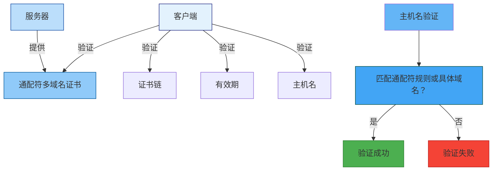
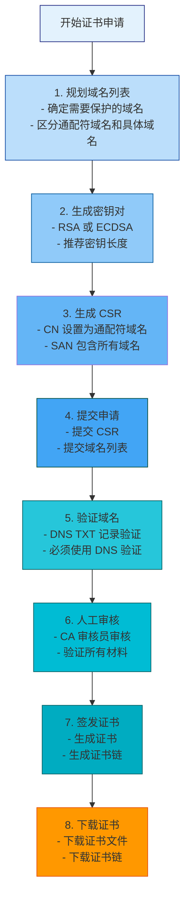
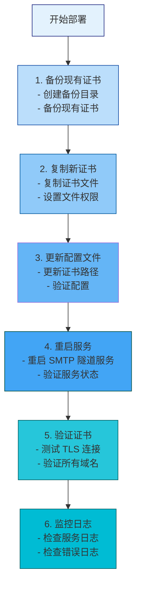

# 通配符多域名证书技术文档

## 目录

1. [引言](#1-引言)
2. [通配符多域名证书概述](#2-通配符多域名证书概述)
3. [证书基本概念](#3-证书基本概念)
4. [证书生成流程](#4-证书生成流程)
5. [证书配置方法](#5-证书配置方法)
6. [部署步骤](#6-部署步骤)
7. [安全最佳实践](#7-安全最佳实践)
8. [常见问题解决方案](#8-常见问题解决方案)
9. [附录：配置文件模板](#9-附录配置文件模板)

---

## 1. 引言

### 1.1 文档目的

本文档旨在为技术人员提供通配符多域名证书（Wildcard Multi-Domain Certificate）的完整技术指南。通配符多域名证书结合了通配符证书和多域名证书的优势，允许在单个证书中保护多个域名及其所有子域名，为 SMTP 隧道代理系统提供最大化的灵活性和成本效益。通过本文档，技术人员能够理解通配符多域名证书的技术原理、申请流程、配置方法和维护策略。

### 1.2 适用范围

本文档适用于以下场景：
- SMTP 隧道代理服务器的通配符多域名 TLS 证书配置
- 需要保护多个域名及其所有子域名的单证书部署
- 通配符多域名证书的申请、安装、配置和维护
- 证书相关的故障排除和安全审计

### 1.3 目标读者

- 系统管理员
- 网络工程师
- 安全工程师
- DevOps 工程师
- 证书管理员

### 1.4 前置知识

阅读本文档需要具备以下基础知识：
- SSL/TLS 协议基础
- X.509 证书标准
- DNS 基础知识
- Linux 命令行操作
- SMTP 协议基础

### 1.5 相关标准

本文档遵循以下行业标准和规范：

| 标准编号 | 标准名称 | 发布机构 | 说明 |
|----------|----------|----------|------|
| **RFC 5280** | Internet X.509 Public Key Infrastructure Certificate and CRL Profile | IETF | X.509 证书和 CRL 配置文件 |
| **RFC 6125** | Representation and Verification of Domain-Based Application Service Identity | IETF | 域名身份表示和验证 |
| **CA/Browser Forum BR** | Baseline Requirements for Issuance and Management of Publicly-Trusted TLS Certificates | CA/Browser Forum | TLS 证书基线要求 |
| **RFC 2595** | Using TLS with IMAP, POP3 and ACAP | IETF | IMAP/POP3 使用 TLS |

---

## 2. 通配符多域名证书概述

### 2.1 什么是通配符多域名证书

通配符多域名证书（Wildcard Multi-Domain Certificate）是一种结合了通配符证书和多域名证书特性的 SSL/TLS 证书。它允许在单个证书中包含多个域名，其中一些域名可以是通配符域名，另一些可以是具体的域名。

**通配符多域名证书的核心特性**：
- **多域名支持**：单个证书可保护多个不同的域名
- **通配符支持**：某些域名可以是通配符域名，保护该域名的所有子域名
- **灵活配置**：支持通配符域名和具体域名的混合配置
- **简化管理**：减少证书数量，降低管理复杂度
- **成本效益**：相比多个单域名证书更经济

### 2.2 通配符多域名证书的结构

通配符多域名证书在 SAN（Subject Alternative Name）扩展中包含多个域名，其中一些是通配符域名，另一些是具体域名。

**SAN 扩展示例**：

```
X509v3 Subject Alternative Name:
    DNS:*.example.com           # 通配符域名
    DNS:*.mail.example.com     # 通配符域名
    DNS:example.com             # 具体域名（根域名）
    DNS:mail.example.com        # 具体域名
    DNS:smtp.example.com        # 具体域名
    DNS:pop3.example.com        # 具体域名
    DNS:imap.example.com        # 具体域名
    DNS:*.api.example.com       # 通配符域名
```

### 2.3 通配符多域名证书的优势

| 优势 | 说明 | 应用场景 |
|------|------|----------|
| **多域名保护** | 单个证书保护多个不同的域名 | 多服务部署 |
| **通配符保护** | 某些域名保护所有子域名 | 动态子域名 |
| **灵活配置** | 支持通配符域名和具体域名的混合 | 复杂域名结构 |
| **简化管理** | 减少证书数量 | 降低运维成本 |
| **成本效益** | 相比多个单域名证书更经济 | 预算有限场景 |
| **快速部署** | 一次部署覆盖多个域名 | 快速上线 |

### 2.4 通配符多域名证书的局限性

| 局限性 | 说明 | 解决方案 |
|--------|------|----------|
| **域名数量限制** | CA 通常限制 SAN 中的域名数量 | 使用多个证书 |
| **更新复杂** | 更新一个域名需要重新签发整个证书 | 规划好域名变更 |
| **兼容性问题** | 旧版浏览器可能不支持 SAN | 使用兼容性好的证书 |
| **安全风险** | 泄露一个域名的私钥会影响所有域名 | 严格保护私钥 |
| **成本较高** | 相比单域名证书成本更高 | 权衡成本和管理复杂度 |

### 2.5 通配符多域名证书与其他证书类型对比

| 证书类型 | 域名数量 | 通配符支持 | SAN 支持 | 适用场景 | 成本 | 管理复杂度 |
|----------|----------|------------|----------|----------|------|------------|
| **单域名证书** | 1 个 | ❌ | 可选 | 单一域名 | 低 | 低 |
| **通配符证书** | 无限（同一域名） | ✅ | 可选 | 多个子域名 | 中 | 低 |
| **多域名证书（SAN）** | 多个 | ❌ | 必需 | 多个特定域名 | 中 | 中 |
| **通配符多域名证书** | 多个 + 通配符 | ✅ | 必需 | 复杂域名结构 | 高 | 中 |

### 2.6 通配符多域名证书在 SMTP 隧道代理中的应用

在 SMTP 隧道代理系统中，通配符多域名证书可用于：

| 应用场景 | 说明 | 示例域名 |
|----------|------|----------|
| **多服务部署** | 保护多个邮件服务的域名 | `*.example.com`, `example.com` |
| **多环境部署** | 保护不同环境的域名 | `*.example.com`, `*.staging.example.com` |
| **多区域部署** | 保护不同区域的域名 | `*.example.com`, `*.asia.example.com` |
| **负载均衡** | 保护负载均衡器的多个域名 | `*.example.com`, `mail1.example.com`, `mail2.example.com` |
| **API 服务** | 保护 API 服务的域名 | `*.api.example.com`, `api.example.com` |

---

## 3. 证书基本概念

### 3.1 通配符域名格式

通配符域名使用星号（*）作为通配符，必须放在域名的最左侧。

**通配符域名格式**：
```
*.example.com
```

**通配符规则**：

| 规则 | 说明 | 示例 |
|------|------|------|
| **通配符位置** | 通配符必须在最左侧 | `*.example.com` ✅, `mail.*.example.com` ❌ |
| **通配符数量** | 只能有一个通配符 | `*.example.com` ✅, `*.*.example.com` ❌ |
| **通配符级别** | 只能匹配一级子域名 | `mail.example.com` ✅, `sub.mail.example.com` ❌ |
| **根域名** | 不匹配根域名 | `example.com` ❌ |

**通配符匹配示例**：

```
通配符域名: *.example.com

匹配的域名:
✅ mail.example.com
✅ smtp.example.com
✅ pop3.example.com
✅ imap.example.com
✅ www.example.com
✅ api.example.com
✅ test.example.com

不匹配的域名:
❌ example.com (根域名)
❌ sub.mail.example.com (多级子域名)
❌ example.org (不同域名)
```

### 3.2 通配符多域名证书结构

通配符多域名证书的结构与普通 X.509 证书相同，但在 SAN 扩展中包含多个域名，其中一些是通配符域名。

**通配符多域名证书结构**：

```
┌─────────────────────────────────────────────────────────────┐
│              通配符多域名证书结构                          │
├─────────────────────────────────────────────────────────────┤
│ 1. 版本 (Version)                                         │
│    - 版本号：v3                                          │
│ 2. 序列号 (Serial Number)                                 │
│    - 证书唯一标识符                                       │
│ 3. 签名算法 (Signature Algorithm)                          │
│    - 证书签名使用的算法                                   │
│ 4. 颁发者 (Issuer)                                       │
│    - 签发证书的 CA                                       │
│ 5. 有效期 (Validity)                                      │
│    - Not Before: 生效时间                                 │
│    - Not After: 过期时间                                  │
│ 6. 主题 (Subject)                                         │
│    - CN: *.example.com (通配符域名）                       │
│ 7. 主题公钥信息 (Subject Public Key Info)                 │
│    - 公钥算法和公钥值                                    │
│ 8. 扩展 (Extensions)                                     │
│    - SAN: 多个域名（通配符域名 + 具体域名）               │
│ 9. 签名 (Signature)                                      │
│    - CA 对证书的签名                                     │
└─────────────────────────────────────────────────────────────┘
```

### 3.3 SAN 扩展字段

通配符多域名证书必须在 SAN 扩展中包含多个域名。

**SAN 扩展示例**：

```
X509v3 Subject Alternative Name:
    DNS:*.example.com           # 通配符域名
    DNS:*.mail.example.com     # 通配符域名
    DNS:example.com             # 具体域名（根域名）
    DNS:mail.example.com        # 具体域名
    DNS:smtp.example.com        # 具体域名
    DNS:pop3.example.com        # 具体域名
    DNS:imap.example.com        # 具体域名
    DNS:*.api.example.com       # 通配符域名
    DNS:localhost             # 本地主机
```

**注意**：根据 RFC 6125，如果 SAN 扩展存在，CN 必须被忽略，客户端应使用 SAN 进行主机名验证。

### 3.4 证书验证流程

通配符多域名证书的验证过程与普通证书相同，但主机名验证时需要匹配通配符规则或具体域名。

**通配符多域名证书验证流程**：



---

## 4. 证书生成流程

### 4.1 证书申请流程

**通配符多域名证书申请流程**：



### 4.2 使用项目脚本生成通配符多域名证书

SMTP 隧道代理项目提供了 `generate_certs.py` 脚本，支持生成通配符多域名证书。

**基本使用**：

```bash
# 使用默认参数生成通配符多域名证书
python3 generate_certs.py --hostname *.example.com

# 指定输出目录
python3 generate_certs.py --hostname *.example.com --output-dir ./cert

# 指定密钥大小和有效期
python3 generate_certs.py --hostname *.example.com --key-size 2048 --days 1095
```

**修改脚本支持通配符多域名证书**：

编辑 `generate_certs.py`，修改 `generate_server_certificate` 函数中的 SAN 配置：

```python
# 主题备用名称（Subject Alternative Name, SAN）
# SAN 对 TLS 验证非常重要，允许证书用于多个主机名
san = x509.SubjectAlternativeName([
    x509.DNSName(hostname),     # 通配符域名（如 *.example.com）
    x509.DNSName(hostname.replace('*.', '')),  # 根域名（如 example.com）
    x509.DNSName("mail.example.com"),  # 具体域名
    x509.DNSName("smtp.example.com"),  # 具体域名
    x509.DNSName("pop3.example.com"),  # 具体域名
    x509.DNSName("imap.example.com"),  # 具体域名
    x509.DNSName("*.mail.example.com"),  # 通配符域名
    x509.DNSName("localhost"),  # 本地主机（用于测试）
])
```

### 4.3 使用 OpenSSL 生成通配符多域名证书

#### 4.3.1 生成 CA 证书

```bash
# 1. 生成 CA 私钥
openssl genrsa -out ca.key 4096

# 2. 生成 CA 证书
openssl req -new -x509 -days 3650 -key ca.key -out ca.crt \
    -subj "/C=CN/ST=Beijing/L=Beijing/O=SMTP Tunnel/OU=Security/CN=SMTP Tunnel CA"

# 3. 查看 CA 证书信息
openssl x509 -in ca.crt -noout -text
```

#### 4.3.2 生成通配符多域名服务器证书

```bash
# 1. 生成服务器私钥
openssl genrsa -out server.key 2048

# 2. 创建配置文件
cat > server.conf <<EOF
[req]
distinguished_name = req_distinguished_name
req_extensions = v3_req
prompt = no

[req_distinguished_name]
C = CN
ST = Beijing
L = Beijing
O = Example Mail Services
OU = IT Department
CN = *.example.com

[v3_req]
keyUsage = keyEncipherment, dataEncipherment
extendedKeyUsage = serverAuth, clientAuth, emailProtection
subjectAltName = @alt_names

[alt_names]
DNS.1 = *.example.com
DNS.2 = *.mail.example.com
DNS.3 = example.com
DNS.4 = mail.example.com
DNS.5 = smtp.example.com
DNS.6 = pop3.example.com
DNS.7 = imap.example.com
DNS.8 = *.api.example.com
DNS.9 = localhost
EOF

# 3. 生成 CSR
openssl req -new -key server.key -out server.csr -config server.conf

# 4. 使用 CA 签发通配符多域名服务器证书
openssl x509 -req -days 1095 -in server.csr \
    -CA ca.crt -CAkey ca.key -CAcreateserial \
    -out server.crt -extensions v3_req -extfile server.conf

# 5. 验证证书
openssl verify -CAfile ca.crt server.crt

# 6. 查看证书信息
openssl x509 -in server.crt -noout -text
```

#### 4.3.3 查看通配符多域名证书信息

```bash
# 查看证书详细信息
openssl x509 -in server.crt -noout -text

# 查看证书有效期
openssl x509 -in server.crt -noout -dates

# 查看证书主题
openssl x509 -in server.crt -noout -subject

# 查看 SAN 扩展
openssl x509 -in server.crt -noout -text | grep -A 20 "Subject Alternative Name"
```

### 4.4 证书验证

**验证通配符多域名证书**：

```bash
# 1. 验证证书链
openssl verify -CAfile ca.crt server.crt

# 2. 验证通配符域名匹配
# 测试 mail.example.com
openssl s_client -connect mail.example.com:587 -servername mail.example.com -showcerts

# 测试 smtp.example.com
openssl s_client -connect smtp.example.com:587 -servername smtp.example.com -showcerts

# 测试 api.example.com
openssl s_client -connect api.example.com:587 -servername api.example.com -showcerts

# 测试根域名
openssl s_client -connect example.com:587 -servername example.com -showcerts
```

### 4.5 证书生成最佳实践

| 实践 | 说明 | 推荐做法 |
|------|------|----------|
| **密钥长度** | 使用足够长的密钥 | RSA-2048 或 RSA-4096 |
| **签名算法** | 使用安全的签名算法 | SHA-256 with RSA |
| **有效期** | 设置合理的有效期 | 1-3 年 |
| **SAN 扩展** | 必须包含所有域名 | 通配符域名 + 具体域名 |
| **根域名** | 可选包含根域名 | DNS:example.com |

---

## 5. 证书配置方法

### 5.1 证书文件准备

**证书文件清单**：

| 文件 | 说明 | 格式 | 用途 |
|------|------|------|------|
| `server.crt` | 通配符多域名服务器证书 | PEM | TLS 握手 |
| `server.key` | 服务器私钥 | PEM | TLS 握手 |
| `intermediate.crt` | 中间证书 | PEM | 证书链验证 |
| `root.crt` | 根证书 | PEM | 证书链验证 |
| `fullchain.crt` | 完整证书链 | PEM | 服务器证书 + 中间证书 |
| `ca-bundle.crt` | CA 证书包 | PEM | 中间证书 + 根证书 |

**证书文件权限**：

```bash
# 设置证书文件权限
chmod 644 server.crt       # 证书文件：所有者读写，其他人只读
chmod 600 server.key       # 私钥文件：仅所有者读写
chmod 644 intermediate.crt # 中间证书：所有者读写，其他人只读
chmod 644 root.crt        # 根证书：所有者读写，其他人只读
chmod 644 fullchain.crt   # 完整证书链：所有者读写，其他人只读
chmod 644 ca-bundle.crt   # CA 证书包：所有者读写，其他人只读

# 验证文件权限
ls -la
```

### 5.2 服务器端配置

#### 5.2.1 SMTP 隧道代理配置

**配置文件设置**（`config.yaml`）：

```yaml
server:
  # 监听地址
  host: "0.0.0.0"
  
  # SMTP 提交端口
  port: 587
  
  # 服务器主机名（必须是通配符多域名证书保护的域名）
  hostname: "mail.example.com"
  
  # TLS 证书和密钥文件
  cert_file: "cert/fullchain.crt"
  key_file: "cert/server.key"
  
  # 用户配置文件
  users_file: "users.yaml"
```

**配置说明**：
- `hostname`：必须是通配符多域名证书保护的域名
- `cert_file`：使用 `fullchain.crt` 包含完整证书链
- `key_file`：服务器私钥文件路径

#### 5.2.2 Nginx 配置

**基本配置**：

```nginx
server {
    listen 443 ssl http2;
    server_name mail.example.com smtp.example.com pop3.example.com imap.example.com api.example.com;

    # 证书配置
    ssl_certificate /etc/ssl/certs/fullchain.crt;
    ssl_certificate_key /etc/ssl/private/server.key;
    ssl_trusted_certificate /etc/ssl/certs/ca-bundle.crt;

    # SSL 协议和加密套件
    ssl_protocols TLSv1.2 TLSv1.3;
    ssl_ciphers 'ECDHE-ECDSA-AES128-GCM-SHA256:ECDHE-RSA-AES128-GCM-SHA256:ECDHE-ECDSA-AES256-GCM-SHA384:ECDHE-RSA-AES256-GCM-SHA384:ECDHE-ECDSA-CHACHA20-POLY1305:ECDHE-RSA-CHACHA20-POLY1305';
    ssl_prefer_server_ciphers off;

    # SSL 会话配置
    ssl_session_cache shared:SSL:10m;
    ssl_session_timeout 10m;
    ssl_session_tickets off;

    # OCSP Stapling
    ssl_stapling on;
    ssl_stapling_verify on;
    resolver 8.8.8.8 8.8.4.4 valid=300s;
    resolver_timeout 5s;

    # 安全头
    add_header Strict-Transport-Security "max-age=31536000; includeSubDomains" always;
    add_header X-Frame-Options "SAMEORIGIN" always;
    add_header X-Content-Type-Options "nosniff" always;
    add_header X-XSS-Protection "1; mode=block" always;

    # 日志配置
    access_log /var/log/nginx/access.log;
    error_log /var/log/nginx/error.log;

    # 网站根目录
    root /var/www/html;
    index index.html;
}

# HTTP 服务器配置（重定向到 HTTPS）
server {
    listen 80;
    server_name mail.example.com smtp.example.com pop3.example.com imap.example.com api.example.com;

    location / {
        return 301 https://$host$request_uri;
    }
}
```

#### 5.2.3 Apache 配置

**基本配置**：

```apache
<VirtualHost *:443>
    ServerName mail.example.com
    ServerAlias smtp.example.com pop3.example.com imap.example.com api.example.com

    # 启用 SSL
    SSLEngine on

    # 证书配置
    SSLCertificateFile /etc/ssl/certs/server.crt
    SSLCertificateKeyFile /etc/ssl/private/server.key
    SSLCertificateChainFile /etc/ssl/certs/intermediate.crt

    # SSL 协议和加密套件
    SSLProtocol all -SSLv2 -SSLv3 -TLSv1 -TLSv1.1
    SSLCipherSuite ECDHE-ECDSA-AES128-GCM-SHA256:ECDHE-RSA-AES128-GCM-SHA256:ECDHE-ECDSA-AES256-GCM-SHA384:ECDHE-RSA-AES256-GCM-SHA384:ECDHE-ECDSA-CHACHA20-POLY1305:ECDHE-RSA-CHACHA20-POLY1305
    SSLHonorCipherOrder off

    # SSL 会话配置
    SSLSessionCache shmcb:/var/run/apache2/ssl_scache(512000)
    SSLSessionCacheTimeout 300
    SSLSessionTickets off

    # OCSP Stapling
    SSLUseStapling on
    SSLStaplingCache shmcb:/var/run/apache2/ocsp(128000)
    SSLStaplingResponderTimeout 5
    SSLStaplingReturnResponderErrors off

    # 安全头
    Header always set Strict-Transport-Security "max-age=31536000; includeSubDomains"
    Header always set X-Frame-Options "SAMEORIGIN"
    Header always set X-Content-Type-Options "nosniff"
    Header always set X-XSS-Protection "1; mode=block"

    # 日志配置
    ErrorLog ${APACHE_LOG_DIR}/error.log
    CustomLog ${APACHE_LOG_DIR}/access.log combined

    # 网站根目录
    DocumentRoot /var/www/html
    DirectoryIndex index.html
</VirtualHost>

# HTTP 服务器配置（重定向到 HTTPS）
<VirtualHost *:80>
    ServerName mail.example.com
    ServerAlias smtp.example.com pop3.example.com imap.example.com api.example.com

    RewriteEngine on
    RewriteCond %{HTTPS} off
    RewriteRule ^(.*)$ https://%{HTTP_HOST}%{REQUEST_URI} [L,R=301]
</VirtualHost>
```

### 5.3 客户端配置

#### 5.3.1 配置文件设置

**客户端配置**（`client_config.yaml`）：

```yaml
client:
  # 隧道服务器域名（必须是通配符多域名证书保护的域名）
  server_host: "mail.example.com"
  
  # 隧道服务器端口
  server_port: 587
  
  # 本地 SOCKS5 代理端口
  socks_port: 1080
  
  # 本地 SOCKS5 绑定地址
  socks_host: "127.0.0.1"
  
  # 用户凭证
  username: "your_username"
  secret: "your_secret"
  
  # 用于服务器验证的 CA 证书
  ca_cert: "cert/ca.crt"
```

**配置说明**：
- `server_host`：必须是通配符多域名证书保护的域名
- `ca_cert`：CA 证书文件路径（用于验证服务器证书）

#### 5.3.2 证书验证模式

**客户端支持两种证书验证模式**：

| 模式 | 说明 | 安全性 | 配置 |
|------|------|--------|------|
| **严格验证** | 验证服务器证书 | 高 | 提供 `ca_cert` |
| **跳过验证** | 不验证服务器证书 | 低 | 不提供 `ca_cert` 或设置 `verify: false` |

**推荐**：生产环境始终使用严格验证模式。

### 5.4 验证配置

**验证通配符多域名证书配置**：

```bash
# 1. 验证证书文件
openssl x509 -in cert/server.crt -noout -text

# 2. 验证证书链
openssl verify -CAfile cert/ca.crt cert/server.crt

# 3. 测试 TLS 连接（mail.example.com）
openssl s_client -connect mail.example.com:587 -servername mail.example.com -showcerts

# 4. 测试 TLS 连接（smtp.example.com）
openssl s_client -connect smtp.example.com:587 -servername smtp.example.com -showcerts

# 5. 测试 TLS 连接（api.example.com）
openssl s_client -connect api.example.com:587 -servername api.example.com -showcerts

# 6. 验证 SAN 扩展
openssl x509 -in cert/server.crt -noout -text | grep -A 20 "Subject Alternative Name"

# 7. 验证服务器配置
python3 server.py --config config.yaml
```

---

## 6. 部署步骤

### 6.1 部署前准备

#### 6.1.1 准备检查清单

| 检查项 | 说明 | 状态 |
|--------|------|------|
| 证书文件 | 确认所有证书文件已生成 | ☐ |
| 证书权限 | 确认证书文件权限正确 | ☐ |
| 证书链 | 确认证书链完整 | ☐ |
| 配置文件 | 确认配置文件已更新 | ☐ |
| 域名解析 | 确认域名 DNS 解析正常 | ☐ |
| 端口开放 | 确认端口 587 已开放 | ☐ |

#### 6.1.2 备份现有证书

```bash
# 创建备份目录
mkdir -p cert/backup/$(date +%Y%m%d_%H%M%S)

# 备份现有证书
cp cert/server.crt cert/backup/$(date +%Y%m%d_%H%M%S)/
cp cert/server.key cert/backup/$(date +%Y%m%d_%H%M%S)/
cp cert/fullchain.crt cert/backup/$(date +%Y%m%d_%H%M%S)/

# 验证备份
ls -la cert/backup/$(date +%Y%m%d_%H%M%S)/
```

### 6.2 部署步骤

#### 6.2.1 部署流程

**通配符多域名证书部署流程**：



#### 6.2.2 部署命令

```bash
# 1. 备份现有证书
mkdir -p cert/backup/$(date +%Y%m%d_%H%M%S)
cp cert/server.crt cert/backup/$(date +%Y%m%d_%H%M%S)/
cp cert/server.key cert/backup/$(date +%Y%m%d_%H%M%S)/
cp cert/fullchain.crt cert/backup/$(date +%Y%m%d_%H%M%S)/

# 2. 复制新证书
cp new/server.crt cert/server.crt
cp new/server.key cert/server.key
cp new/fullchain.crt cert/fullchain.crt

# 3. 设置文件权限
chmod 644 cert/server.crt
chmod 600 cert/server.key
chmod 644 cert/fullchain.crt

# 4. 验证证书
openssl verify -CAfile cert/ca.crt cert/server.crt

# 5. 重启服务
sudo systemctl restart smtp-tunnel-server

# 6. 验证服务状态
sudo systemctl status smtp-tunnel-server

# 7. 测试 TLS 连接
openssl s_client -connect mail.example.com:587 -servername mail.example.com -showcerts
```

### 6.3 部署后验证

#### 6.3.1 验证清单

| 验证项 | 说明 | 状态 |
|--------|------|------|
| 服务状态 | 确认服务正常运行 | ☐ |
| 证书链 | 确认证书链完整 | ☐ |
| TLS 连接 | 确认 TLS 连接成功 | ☐ |
| 域名验证 | 确认所有域名验证通过 | ☐ |
| 日志检查 | 确认无错误日志 | ☐ |

#### 6.3.2 验证命令

```bash
# 1. 验证服务状态
sudo systemctl status smtp-tunnel-server

# 2. 验证证书链
openssl verify -CAfile cert/ca.crt cert/server.crt

# 3. 测试 TLS 连接（mail.example.com）
openssl s_client -connect mail.example.com:587 -servername mail.example.com -showcerts

# 4. 测试 TLS 连接（smtp.example.com）
openssl s_client -connect smtp.example.com:587 -servername smtp.example.com -showcerts

# 5. 测试 TLS 连接（api.example.com）
openssl s_client -connect api.example.com:587 -servername api.example.com -showcerts

# 6. 检查服务日志
sudo journalctl -u smtp-tunnel-server -n 50
```

### 6.4 回滚方案

如果部署后出现问题，可以使用以下回滚方案：

```bash
# 1. 停止服务
sudo systemctl stop smtp-tunnel-server

# 2. 恢复备份证书
cp cert/backup/$(date +%Y%m%d_%H%M%S)/server.crt cert/server.crt
cp cert/backup/$(date +%Y%m%d_%H%M%S)/server.key cert/server.key
cp cert/backup/$(date +%Y%m%d_%H%M%S)/fullchain.crt cert/fullchain.crt

# 3. 重启服务
sudo systemctl start smtp-tunnel-server

# 4. 验证服务状态
sudo systemctl status smtp-tunnel-server
```

---

## 7. 安全最佳实践

### 7.1 密钥管理

#### 7.1.1 密钥生成

| 实践 | 说明 | 推荐值 |
|------|------|--------|
| **密钥长度** | 使用足够长的密钥 | RSA-2048 或 RSA-4096 |
| **密钥类型** | 选择合适的密钥类型 | RSA 或 ECDSA |
| **随机数生成** | 使用安全的随机数生成器 | 操作系统提供的 CSPRNG |
| **密钥格式** | 使用标准格式 | PEM 或 PKCS#12 |

#### 7.1.2 密钥存储

| 实践 | 说明 | 推荐做法 |
|------|------|----------|
| **文件权限** | 限制私钥文件访问 | 600 (仅所有者读写) |
| **文件所有权** | 设置正确的所有者 | root:root |
| **加密存储** | 使用密码加密私钥 | 可选但推荐 |
| **备份策略** | 安全备份私钥 | 加密存储到离线位置 |

```bash
# 设置正确的文件权限
chmod 600 cert/server.key
chmod 644 cert/server.crt
chmod 644 cert/fullchain.crt

# 设置文件所有权
chown root:root cert/server.key
chown root:root cert/server.crt
chown root:root cert/fullchain.crt

# 验证文件权限
ls -la cert/
```

#### 7.1.3 密钥轮换

| 实践 | 说明 | 推荐频率 |
|------|------|----------|
| **定期轮换** | 定期更换密钥 | 每 1-2 年 |
| **事件触发** | 在安全事件后立即轮换 | 立即 |
| **渐进式轮换** | 逐步替换密钥 | 推荐方式 |
| **密钥销毁** | 安全销毁旧密钥 | 使用安全删除工具 |

### 7.2 通配符多域名证书安全风险

**通配符多域名证书的安全风险**：

| 风险 | 说明 | 缓解措施 |
|------|------|----------|
| **单点故障** | 泄露一个域名的私钥会影响所有域名 | 严格保护私钥，限制访问 |
| **广泛攻击面** | 通配符多域名证书保护多个域名，攻击面更大 | 定期审计证书使用情况 |
| **误用风险** | 通配符多域名证书可能被误用于未授权的域名 | 实施严格的域名管理策略 |
| **撤销困难** | 撤销通配符多域名证书会影响所有域名 | 谨慎使用，考虑多域名证书 |

### 7.3 通配符多域名证书安全加固

**安全加固措施**：

| 措施 | 说明 | 实施方法 |
|------|------|----------|
| **限制私钥访问** | 限制私钥文件访问权限 | 设置文件权限为 600 |
| **使用硬件安全模块（HSM）** | 使用 HSM 存储私钥 | 部署 HSM 设备 |
| **实施证书策略** | 制定证书使用策略 | 制定并执行证书策略 |
| **定期审计** | 定期审计证书使用情况 | 定期检查证书使用情况 |
| **监控证书使用** | 监控证书使用情况 | 实施证书监控 |

### 7.4 访问控制

#### 7.4.1 文件系统权限

```bash
# 证书目录权限
chmod 755 cert/

# 私钥文件权限
chmod 600 cert/server.key

# 证书文件权限
chmod 644 cert/server.crt
chmod 644 cert/fullchain.crt
chmod 644 cert/ca.crt

# 验证权限
ls -la cert/
```

#### 7.4.2 SELinux 配置

```bash
# 检查 SELinux 状态
sestatus

# 设置 SELinux 上下文
chcon -u system_u -r object_r -t cert_t cert/server.key
chcon -u system_u -r object_r -t cert_t cert/server.crt
chcon -u system_u -r object_r -t cert_t cert/fullchain.crt

# 验证 SELinux 上下文
ls -Z cert/
```

#### 7.4.3 AppArmor 配置

```bash
# 创建 AppArmor 配置文件
sudo cat > /etc/apparmor.d/usr.local.bin.smtp-tunnel-server <<EOF
#include <tunables/global>

/usr/local/bin/smtp-tunnel-server {
  #include <abstractions/base>
  
  # 证书文件访问
  /etc/ssl/certs/** r,
  /etc/ssl/private/** r,
  /path/to/cert/** r,
  
  # 网络访问
  network inet stream,
  
  # 其他权限
  deny /proc/sys/kernel/** w,
}
EOF

# 加载 AppArmor 配置
sudo apparmor_parser -r /etc/apparmor.d/usr.local.bin.smtp-tunnel-server
```

### 7.5 审计与监控

#### 7.5.1 日志记录

```bash
# 配置日志记录
# 在 config.yaml 中设置日志级别
logging:
  level: "INFO"
  log_dir: "/var/log/smtp-tunnel"
  log_file: "smtp-tunnel.log"
  enable_file: true
  enable_console: true
  enable_journal: true
```

#### 7.5.2 审计日志

```bash
# 启用审计日志
sudo auditctl -w /path/to/cert/ -p wa -k cert_access

# 查看审计日志
sudo ausearch -k cert_access
```

#### 7.5.3 监控告警

```bash
# 配置监控告警
# 使用 cert-monitor.sh 定期检查证书
# 配置邮件告警或短信告警
```

---

## 8. 常见问题解决方案

### 8.1 证书生成问题

#### 8.1.1 通配符域名格式错误

**问题现象**：
```
Error: Invalid wildcard domain format
```

**可能原因**：
1. 通配符不在最左侧
2. 通配符数量错误
3. 通配符格式错误

**解决方案**：
```bash
# 1. 检查通配符域名格式
# 正确格式: *.example.com
# 错误格式: mail.*.example.com, *.*.example.com

# 2. 修改配置文件
cat server.conf | grep "CN = "

# 3. 重新生成证书
openssl x509 -req -days 1095 -in server.csr \
    -CA ca.crt -CAkey ca.key -CAcreateserial \
    -out server.crt -extensions v3_req -extfile server.conf
```

#### 8.1.2 SAN 扩展未包含所有域名

**问题现象**：
```
Error: SAN extension does not contain all domains
```

**可能原因**：
1. SAN 扩展中未包含所有域名
2. SAN 扩展格式错误

**解决方案**：
```bash
# 1. 检查 SAN 扩展
openssl x509 -in server.crt -noout -text | grep -A 20 "Subject Alternative Name"

# 2. 修改配置文件
cat server.conf | grep -A 10 "alt_names"

# 确保包含所有域名：
# DNS.1 = *.example.com
# DNS.2 = *.mail.example.com
# DNS.3 = example.com
# DNS.4 = mail.example.com
# ...

# 3. 重新生成证书
openssl x509 -req -days 1095 -in server.csr \
    -CA ca.crt -CAkey ca.key -CAcreateserial \
    -out server.crt -extensions v3_req -extfile server.conf
```

### 8.2 证书配置问题

#### 8.2.1 域名不匹配

**问题现象**：
```
Error: Certificate hostname does not match server hostname
```

**可能原因**：
1. 服务器主机名不是通配符多域名证书保护的域名
2. 服务器主机名是多级子域名

**解决方案**：
```bash
# 1. 检查通配符多域名证书保护的域名
openssl x509 -in server.crt -noout -text | grep -A 20 "Subject Alternative Name"

# 2. 检查服务器主机名配置
cat config.yaml | grep hostname

# 3. 确保服务器主机名是通配符多域名证书保护的域名
# 正确: mail.example.com, smtp.example.com, api.example.com
# 错误: sub.mail.example.com (多级子域名), example.org (不同域名)

# 4. 修改服务器主机名配置
# 使其与通配符多域名证书保护的域名匹配
```

#### 8.2.2 证书链不完整

**问题现象**：
```
Error: Unable to get local issuer certificate
```

**可能原因**：
1. 中间证书缺失
2. 证书链顺序错误
3. CA 证书未配置

**解决方案**：
```bash
# 1. 检查证书链
openssl s_client -connect mail.example.com:587 -showcerts

# 2. 创建完整证书链
cat server.crt intermediate.crt > fullchain.crt

# 3. 配置完整证书链
# Nginx: ssl_certificate /etc/ssl/certs/fullchain.crt
# Apache: SSLCertificateChainFile /etc/ssl/certs/intermediate.crt

# 4. 验证证书链
openssl verify -CAfile ca.crt fullchain.crt
```

### 8.3 证书验证问题

#### 8.3.1 证书验证失败

**问题现象**：
```
Error: Certificate verification failed
```

**可能原因**：
1. CA 证书未配置
2. 证书链不完整
3. 证书已过期

**解决方案**：
```bash
# 1. 检查 CA 证书
ls -la cert/ca.crt

# 2. 验证证书链
openssl verify -CAfile cert/ca.crt cert/server.crt

# 3. 检查证书有效期
openssl x509 -in cert/server.crt -noout -dates

# 4. 如果证书已过期，重新生成证书
python3 generate_certs.py --hostname *.example.com
```

### 8.4 性能问题

#### 8.4.1 TLS 握手慢

**问题现象**：
- TLS 握手时间超过 1 秒
- 客户端连接延迟高

**可能原因**：
1. 证书链过长
2. OCSP 查询慢
3. 服务器性能问题
4. 网络延迟高

**解决方案**：
```nginx
# 1. 优化证书链
# 使用更短的证书链

# 2. 启用 OCSP Stapling
ssl_stapling on;
ssl_stapling_verify on;
ssl_trusted_certificate /etc/ssl/certs/ca-bundle.crt;
resolver 8.8.8.8 8.8.4.4 valid=300s;
resolver_timeout 5s;

# 3. 优化 SSL 会话
ssl_session_cache shared:SSL:10m;
ssl_session_timeout 10m;

# 4. 使用 TLS 1.3
ssl_protocols TLSv1.2 TLSv1.3;

# 5. 优化加密套件
ssl_ciphers 'ECDHE-ECDSA-AES128-GCM-SHA256:ECDHE-RSA-AES128-GCM-SHA256';
ssl_prefer_server_ciphers off;
```

---

## 9. 附录：配置文件模板

### 9.1 OpenSSL 配置文件模板

**通配符多域名证书配置文件模板**：

```bash
# server.conf - 通配符多域名证书配置文件模板

[req]
distinguished_name = req_distinguished_name
req_extensions = v3_req
prompt = no

[req_distinguished_name]
C = CN
ST = Beijing
L = Beijing
O = Example Mail Services
OU = IT Department
CN = *.example.com

[v3_req]
keyUsage = keyEncipherment, dataEncipherment
extendedKeyUsage = serverAuth, clientAuth, emailProtection
subjectAltName = @alt_names

[alt_names]
# 通配符域名
DNS.1 = *.example.com
DNS.2 = *.mail.example.com
DNS.3 = *.api.example.com

# 具体域名
DNS.4 = example.com
DNS.5 = mail.example.com
DNS.6 = smtp.example.com
DNS.7 = pop3.example.com
DNS.8 = imap.example.com
DNS.9 = api.example.com

# 本地主机
DNS.10 = localhost
```

### 9.2 Nginx 配置文件模板

**通配符多域名证书 Nginx 配置模板**：

```nginx
# /etc/nginx/conf.d/smtp-tunnel.conf

server {
    listen 443 ssl http2;
    server_name mail.example.com smtp.example.com pop3.example.com imap.example.com api.example.com;

    # 证书配置
    ssl_certificate /etc/ssl/certs/fullchain.crt;
    ssl_certificate_key /etc/ssl/private/server.key;
    ssl_trusted_certificate /etc/ssl/certs/ca-bundle.crt;

    # SSL 协议和加密套件
    ssl_protocols TLSv1.2 TLSv1.3;
    ssl_ciphers 'ECDHE-ECDSA-AES128-GCM-SHA256:ECDHE-RSA-AES128-GCM-SHA256:ECDHE-ECDSA-AES256-GCM-SHA384:ECDHE-RSA-AES256-GCM-SHA384:ECDHE-ECDSA-CHACHA20-POLY1305:ECDHE-RSA-CHACHA20-POLY1305';
    ssl_prefer_server_ciphers off;

    # SSL 会话配置
    ssl_session_cache shared:SSL:10m;
    ssl_session_timeout 10m;
    ssl_session_tickets off;

    # OCSP Stapling
    ssl_stapling on;
    ssl_stapling_verify on;
    resolver 8.8.8.8 8.8.4.4 valid=300s;
    resolver_timeout 5s;

    # 安全头
    add_header Strict-Transport-Security "max-age=31536000; includeSubDomains" always;
    add_header X-Frame-Options "SAMEORIGIN" always;
    add_header X-Content-Type-Options "nosniff" always;
    add_header X-XSS-Protection "1; mode=block" always;

    # 日志配置
    access_log /var/log/nginx/access.log;
    error_log /var/log/nginx/error.log;

    # 网站根目录
    root /var/www/html;
    index index.html;
}

# HTTP 服务器配置（重定向到 HTTPS）
server {
    listen 80;
    server_name mail.example.com smtp.example.com pop3.example.com imap.example.com api.example.com;

    location / {
        return 301 https://$host$request_uri;
    }
}
```

### 9.3 Apache 配置文件模板

**通配符多域名证书 Apache 配置模板**：

```apache
# /etc/apache2/sites-available/smtp-tunnel.conf

<VirtualHost *:443>
    ServerName mail.example.com
    ServerAlias smtp.example.com pop3.example.com imap.example.com api.example.com

    # 启用 SSL
    SSLEngine on

    # 证书配置
    SSLCertificateFile /etc/ssl/certs/server.crt
    SSLCertificateKeyFile /etc/ssl/private/server.key
    SSLCertificateChainFile /etc/ssl/certs/intermediate.crt

    # SSL 协议和加密套件
    SSLProtocol all -SSLv2 -SSLv3 -TLSv1 -TLSv1.1
    SSLCipherSuite ECDHE-ECDSA-AES128-GCM-SHA256:ECDHE-RSA-AES128-GCM-SHA256:ECDHE-ECDSA-AES256-GCM-SHA384:ECDHE-RSA-AES256-GCM-SHA384:ECDHE-ECDSA-CHACHA20-POLY1305:ECDHE-RSA-CHACHA20-POLY1305
    SSLHonorCipherOrder off

    # SSL 会话配置
    SSLSessionCache shmcb:/var/run/apache2/ssl_scache(512000)
    SSLSessionCacheTimeout 300
    SSLSessionTickets off

    # OCSP Stapling
    SSLUseStapling on
    SSLStaplingCache shmcb:/var/run/apache2/ocsp(128000)
    SSLStaplingResponderTimeout 5
    SSLStaplingReturnResponderErrors off

    # 安全头
    Header always set Strict-Transport-Security "max-age=31536000; includeSubDomains"
    Header always set X-Frame-Options "SAMEORIGIN"
    Header always set X-Content-Type-Options "nosniff"
    Header always set X-XSS-Protection "1; mode=block"

    # 日志配置
    ErrorLog ${APACHE_LOG_DIR}/error.log
    CustomLog ${APACHE_LOG_DIR}/access.log combined

    # 网站根目录
    DocumentRoot /var/www/html
    DirectoryIndex index.html
</VirtualHost>

# HTTP 服务器配置（重定向到 HTTPS）
<VirtualHost *:80>
    ServerName mail.example.com
    ServerAlias smtp.example.com pop3.example.com imap.example.com api.example.com

    RewriteEngine on
    RewriteCond %{HTTPS} off
    RewriteRule ^(.*)$ https://%{HTTP_HOST}%{REQUEST_URI} [L,R=301]
</VirtualHost>
```

### 9.4 SMTP 隧道代理配置文件模板

**通配符多域名证书 SMTP 隧道代理配置模板**：

```yaml
# config.yaml - SMTP 隧道代理配置文件模板

server:
  # 监听地址
  host: "0.0.0.0"
  
  # SMTP 提交端口
  port: 587
  
  # 服务器主机名（必须是通配符多域名证书保护的域名）
  hostname: "mail.example.com"
  
  # TLS 证书和密钥文件
  cert_file: "cert/fullchain.crt"
  key_file: "cert/server.key"
  
  # 用户配置文件
  users_file: "users.yaml"
  
  # 全局日志设置（可以按用户覆盖）
  log_users: true
  
  # 流量整形配置（可选，用于增强 DPI 规避效果）
  traffic:
    # 是否启用流量整形（默认: false）
    enabled: false
    
    # 消息之间的随机延迟范围（毫秒）
    # 模拟人类行为（阅读、思考、输入）
    min_delay: 50
    max_delay: 500
    
    # 发送虚拟消息的概率（0.0-1.0）
    # 偶尔发送虚拟数据以增加流量随机性
    dummy_probability: 0.1

# ============================================================================
# 日志配置
# ============================================================================
logging:
  # 日志级别: DEBUG, INFO, WARNING, ERROR, CRITICAL
  level: "INFO"
  
  # 日志存储目录
  log_dir: "/var/log/smtp-tunnel"
  
  # 日志文件名（支持日期占位符，如 smtp-tunnel-%Y-%m-%d.log）
  log_file: "smtp-tunnel.log"
  
  # 单个日志文件最大大小（字节）- 默认 10MB
  max_bytes: 10485760
  
  # 保留的备份文件数量
  backup_count: 10
  
  # 日志轮转类型: size（按大小）, date（按日期）, both（同时按大小和日期）
  rotation_type: "both"
  
  # 日期格式（用于文件名）
  date_format: "%Y-%m-%d"
  
  # 日志格式字符串
  format_string: "%(asctime)s - %(name)s - %(levelname)s - [%(context)s] - %(message)s"
  
  # 是否输出到控制台
  enable_console: true
  
  # 是否输出到文件
  enable_file: true
  
  # 是否输出到系统日志（systemd journal）
  enable_journal: true
  
  # 上下文字段列表（用于追踪请求、用户、会话等）
  context_fields:
    - "username"
    - "ip"
    - "session_id"
    - "connection_id"

# ============================================================================
# 客户端配置（用于 client.py）
# 此部分在生成客户端包时使用
# ============================================================================
client:
  # 隧道服务器域名（证书验证需要 FQDN）
  # 使用域名而不是 IP 地址 - 阅读 README 了解免费 DNS 选项
  server_host: "mail.example.com"
  
  # 隧道服务器端口
  server_port: 587
  
  # 本地 SOCKS5 代理端口
  socks_port: 1080
  
  # 本地 SOCKS5 绑定地址（127.0.0.1 = 仅本地主机）
  socks_host: "127.0.0.1"
  
  # 用户名和密钥在生成的客户端配置中按用户设置
  # username: "由 adduser 设置"
  # secret: "由 adduser 设置"
  
  # 用于服务器验证的 CA 证书（出于安全考虑推荐使用）
  ca_cert: "cert/ca.crt"
  
  # 流量整形配置（可选，用于增强 DPI 规避效果）
  traffic:
    # 是否启用流量整形（默认: false）
    enabled: false
    
    # 消息之间的随机延迟范围（毫秒）
    # 模拟人类行为（阅读、思考、输入）
    min_delay: 50
    max_delay: 500
    
    # 发送虚拟消息的概率（0.0-1.0）
    # 偶尔发送虚拟数据以增加流量随机性
    dummy_probability: 0.1

# ============================================================================
# 隐蔽配置（DPI 规避）- 可选
# ============================================================================
stealth:
  # 消息之间的随机延迟范围（毫秒）
  min_delay_ms: 50
  max_delay_ms: 500
  
  # 将消息填充到这些大小（字节）
  pad_to_sizes:
    - 4096
    - 8192
    - 16384
  
  # 发送虚拟（空）消息的概率
  dummy_message_probability: 0.1
```

### 9.5 证书生成脚本模板

**通配符多域名证书生成脚本模板**：

```bash
#!/bin/bash
# generate-wildcard-multi-domain-cert.sh - 通配符多域名证书生成脚本

set -euo pipefail

# 配置
DOMAINS="*.example.com,*.mail.example.com,example.com,mail.example.com,smtp.example.com"
OUTPUT_DIR="cert"
KEY_SIZE=2048
CERT_DAYS=1095

# 颜色定义
RED='\033[0;31m'
GREEN='\033[0;32m'
YELLOW='\033[1;33m'
NC='\033[0m'

# 日志函数
log_info() {
    echo -e "${GREEN}[INFO]${NC} $1"
}

log_warn() {
    echo -e "${YELLOW}[WARN]${NC} $1"
}

log_error() {
    echo -e "${RED}[ERROR]${NC} $1"
}

# 生成 CA 证书
generate_ca() {
    log_info "生成 CA 证书"
    
    # 生成 CA 私钥
    openssl genrsa -out "${OUTPUT_DIR}/ca.key" 4096
    
    # 生成 CA 证书
    openssl req -new -x509 -days 3650 -key "${OUTPUT_DIR}/ca.key" -out "${OUTPUT_DIR}/ca.crt" \
        -subj "/C=CN/ST=Beijing/L=Beijing/O=SMTP Tunnel/OU=Security/CN=SMTP Tunnel CA"
    
    log_info "CA 证书生成完成"
}

# 生成服务器证书
generate_server_cert() {
    log_info "生成通配符多域名服务器证书"
    
    # 生成服务器私钥
    openssl genrsa -out "${OUTPUT_DIR}/server.key" ${KEY_SIZE}
    
    # 创建配置文件
    cat > server.conf <<EOF
[req]
distinguished_name = req_distinguished_name
req_extensions = v3_req
prompt = no

[req_distinguished_name]
C = CN
ST = Beijing
L = Beijing
O = Example Mail Services
OU = IT Department
CN = *.example.com

[v3_req]
keyUsage = keyEncipherment, dataEncipherment
extendedKeyUsage = serverAuth, clientAuth, emailProtection
subjectAltName = @alt_names

[alt_names]
EOF
    
    # 添加域名
    IFS=',' read -ra ADDR <<< "$DOMAINS"
    for i in "${!ADDR[@]}"; do
        echo "DNS.$((i+1)) = ${ADDR[$i]}" >> server.conf
    done
    
    # 添加 localhost
    echo "DNS.$((${#ADDR[@]}+1)) = localhost" >> server.conf
    
    # 生成 CSR
    openssl req -new -key "${OUTPUT_DIR}/server.key" -out "${OUTPUT_DIR}/server.csr" -config server.conf
    
    # 使用 CA 签发服务器证书
    openssl x509 -req -days ${CERT_DAYS} -in "${OUTPUT_DIR}/server.csr" \
        -CA "${OUTPUT_DIR}/ca.crt" -CAkey "${OUTPUT_DIR}/ca.key" -CAcreateserial \
        -out "${OUTPUT_DIR}/server.crt" -extensions v3_req -extfile server.conf
    
    # 创建完整证书链
    cat "${OUTPUT_DIR}/server.crt" "${OUTPUT_DIR}/ca.crt" > "${OUTPUT_DIR}/fullchain.crt"
    
    # 设置文件权限
    chmod 644 "${OUTPUT_DIR}/server.crt"
    chmod 600 "${OUTPUT_DIR}/server.key"
    chmod 644 "${OUTPUT_DIR}/fullchain.crt"
    chmod 644 "${OUTPUT_DIR}/ca.crt"
    
    log_info "通配符多域名服务器证书生成完成"
}

# 验证证书
verify_cert() {
    log_info "验证证书"
    
    # 验证证书链
    openssl verify -CAfile "${OUTPUT_DIR}/ca.crt" "${OUTPUT_DIR}/server.crt"
    
    if [ $? -eq 0 ]; then
        log_info "证书验证成功"
    else
        log_error "证书验证失败"
        exit 1
    fi
    
    # 显示证书信息
    log_info "证书信息:"
    openssl x509 -in "${OUTPUT_DIR}/server.crt" -noout -dates
    openssl x509 -in "${OUTPUT_DIR}/server.crt" -noout -subject
    openssl x509 -in "${OUTPUT_DIR}/server.crt" -noout -text | grep -A 20 "Subject Alternative Name"
}

# 主函数
main() {
    log_info "开始生成通配符多域名证书"
    
    # 创建输出目录
    mkdir -p "${OUTPUT_DIR}"
    
    # 生成 CA 证书
    generate_ca
    
    # 生成服务器证书
    generate_server_cert
    
    # 验证证书
    verify_cert
    
    log_info "通配符多域名证书生成完成"
    log_info "生成的文件:"
    log_info "  ${OUTPUT_DIR}/ca.key"
    log_info "  ${OUTPUT_DIR}/ca.crt"
    log_info "  ${OUTPUT_DIR}/server.key"
    log_info "  ${OUTPUT_DIR}/server.crt"
    log_info "  ${OUTPUT_DIR}/fullchain.crt"
}

# 执行主函数
main
```

---

**文档版本**: 1.0.0  
**最后更新**: 2026-01-18  
**维护者**: SMTP Tunnel Proxy Team
