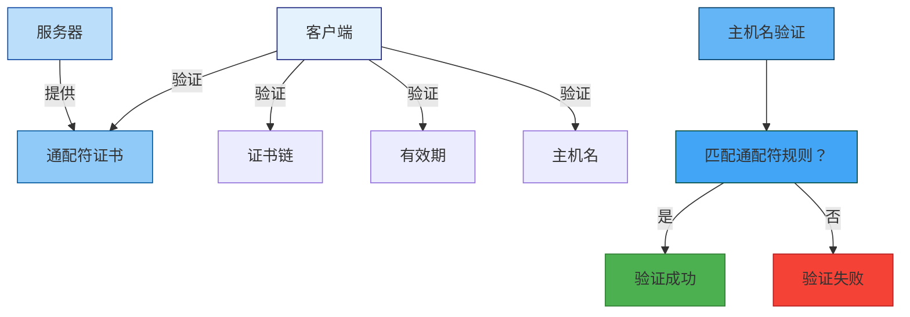
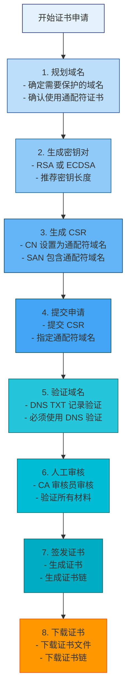
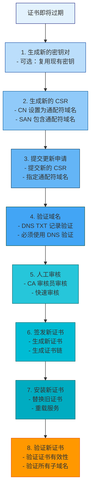

# 通配符证书技术文档

## 目录

1. [引言](#1-引言)
2. [通配符证书概述](#2-通配符证书概述)
3. [通配符证书基本概念](#3-通配符证书基本概念)
4. [适用场景分析](#4-适用场景分析)
5. [通配符证书生成流程](#5-通配符证书生成流程)
6. [通配符证书配置方法](#6-通配符证书配置方法)
7. [安全最佳实践](#7-安全最佳实践)
8. [常见问题排查](#8-常见问题排查)
9. [更新维护策略](#9-更新维护策略)
10. [性能优化指南](#10-性能优化指南)
11. [监控与告警](#11-监控与告警)
12. [附录：工具与资源](#12-附录工具与资源)

---

## 1. 引言

### 1.1 文档目的

本文档旨在为技术人员提供通配符证书（Wildcard Certificate）的完整技术指南。通配符证书允许使用单个证书保护一个域名及其所有子域名，为 SMTP 隧道代理系统提供灵活的域名管理能力。通过本文档，技术人员能够理解通配符证书的技术原理、申请流程、配置方法和维护策略。

### 1.2 适用范围

本文档适用于以下场景：
- SMTP 隧道代理服务器的通配符 TLS 证书配置
- 需要保护多个子域名的单证书部署
- 通配符证书的申请、安装、配置和维护
- 证书相关的故障排除和安全审计

### 1.3 目标读者

- 系统管理员
- 网络工程师
- 安全工程师
- DevOps 工程师
- 证书管理员

### 1.4 前置知识

阅读本文档需要具备以下基础知识：
- SSL/TLS 协议基础
- X.509 证书标准
- DNS 基础知识
- Linux 命令行操作
- SMTP 协议基础

### 1.5 相关标准

本文档遵循以下行业标准和规范：

| 标准编号 | 标准名称 | 发布机构 | 说明 |
|----------|----------|----------|------|
| **RFC 5280** | Internet X.509 Public Key Infrastructure Certificate and CRL Profile | IETF | X.509 证书和 CRL 配置文件 |
| **RFC 6125** | Representation and Verification of Domain-Based Application Service Identity | IETF | 域名身份表示和验证 |
| **CA/Browser Forum BR** | Baseline Requirements for Issuance and Management of Publicly-Trusted TLS Certificates | CA/Browser Forum | TLS 证书基线要求 |
| **RFC 2595** | Using TLS with IMAP, POP3 and ACAP | IETF | IMAP/POP3 使用 TLS |

---

## 2. 通配符证书概述

### 2.1 什么是通配符证书

通配符证书（Wildcard Certificate）是一种包含通配符域名（Wildcard Domain Name）的 SSL/TLS 证书。通配符域名使用星号（*）作为通配符，可以匹配该域名下的所有子域名。

**通配符域名格式**：
```
*.example.com
```

**匹配的域名示例**：
- `mail.example.com` ✅
- `smtp.example.com` ✅
- `pop3.example.com` ✅
- `imap.example.com` ✅
- `www.example.com` ✅
- `api.example.com` ✅

**不匹配的域名示例**：
- `example.com` ❌（根域名）
- `sub.mail.example.com` ❌（多级子域名）
- `example.org` ❌（不同域名）

### 2.2 通配符证书的特点

| 特点 | 说明 | 优势 |
|------|------|------|
| **多子域名保护** | 单个证书保护所有子域名 | 简化管理 |
| **成本效益** | 相比多个单域名证书更经济 | 降低成本 |
| **灵活部署** | 新增子域名无需重新申请证书 | 快速部署 |
| **简化配置** | 只需配置一个证书 | 降低配置复杂度 |

### 2.3 通配符证书的局限性

| 局限性 | 说明 | 解决方案 |
|--------|------|----------|
| **不保护根域名** | 通配符证书不保护根域名 | 额外申请根域名证书 |
| **不支持多级子域名** | 不支持多级子域名（如 `*.sub.example.com`） | 使用多域名证书 |
| **安全风险** | 泄露一个子域名的私钥会影响所有子域名 | 严格保护私钥 |
| **兼容性问题** | 某些旧版浏览器可能不支持 | 使用兼容性好的证书 |

### 2.4 通配符证书与其他证书类型对比

| 证书类型 | 域名数量 | 通配符支持 | SAN 支持 | 适用场景 | 成本 | 管理复杂度 |
|----------|----------|------------|----------|----------|------|------------|
| **单域名证书** | 1 个 | ❌ | 可选 | 单一域名 | 低 | 低 |
| **多域名证书（SAN）** | 多个 | 可选 | 必需 | 多个特定域名 | 中 | 中 |
| **通配符证书** | 无限（同一域名） | 必需 | 可选 | 多个子域名 | 中 | 低 |
| **多域名通配符证书** | 多个 + 通配符 | 必需 | 必需 | 复杂域名结构 | 高 | 中 |

### 2.5 通配符证书在 SMTP 隧道代理中的应用

在 SMTP 隧道代理系统中，通配符证书可用于：

| 应用场景 | 说明 | 示例域名 |
|----------|------|----------|
| **多服务部署** | 保护多个邮件服务的子域名 | `mail.example.com`, `smtp.example.com`, `pop3.example.com`, `imap.example.com` |
| **多环境部署** | 保护不同环境的子域名 | `mail.example.com`, `mail-staging.example.com`, `mail-dev.example.com` |
| **多区域部署** | 保护不同区域的子域名 | `mail.example.com`, `mail-asia.example.com`, `mail-eu.example.com` |
| **负载均衡** | 保护负载均衡器的多个子域名 | `mail1.example.com`, `mail2.example.com`, `mail3.example.com` |

---

## 3. 通配符证书基本概念

### 3.1 通配符域名格式

通配符域名使用星号（*）作为通配符，必须放在域名的最左侧。

**通配符域名格式**：
```
*.example.com
```

**通配符规则**：

| 规则 | 说明 | 示例 |
|------|------|------|
| **通配符位置** | 通配符必须在最左侧 | `*.example.com` ✅, `mail.*.example.com` ❌ |
| **通配符数量** | 只能有一个通配符 | `*.example.com` ✅, `*.*.example.com` ❌ |
| **通配符级别** | 只能匹配一级子域名 | `mail.example.com` ✅, `sub.mail.example.com` ❌ |
| **根域名** | 不匹配根域名 | `example.com` ❌ |

**通配符匹配示例**：

```
通配符域名: *.example.com

匹配的域名:
✅ mail.example.com
✅ smtp.example.com
✅ pop3.example.com
✅ imap.example.com
✅ www.example.com
✅ api.example.com
✅ test.example.com

不匹配的域名:
❌ example.com (根域名)
❌ sub.mail.example.com (多级子域名)
❌ example.org (不同域名)
```

### 3.2 通配符证书结构

通配符证书的结构与普通 X.509 证书相同，但在主题（Subject）和主题备用名称（SAN）中包含通配符域名。

**通配符证书结构**：

```
┌─────────────────────────────────────────────────────────────┐
│                  通配符证书结构                            │
├─────────────────────────────────────────────────────────────┤
│ 1. 版本 (Version)                                         │
│    - 版本号：v3                                          │
│ 2. 序列号 (Serial Number)                                 │
│    - 证书唯一标识符                                       │
│ 3. 签名算法 (Signature Algorithm)                          │
│    - 证书签名使用的算法                                   │
│ 4. 颁发者 (Issuer)                                       │
│    - 签发证书的 CA                                       │
│ 5. 有效期 (Validity)                                      │
│    - Not Before: 生效时间                                 │
│    - Not After: 过期时间                                  │
│ 6. 主题 (Subject)                                         │
│    - CN: *.example.com (通配符域名）                       │
│ 7. 主题公钥信息 (Subject Public Key Info)                 │
│    - 公钥算法和公钥值                                    │
│ 8. 扩展 (Extensions)                                     │
│    - SAN: DNS:*.example.com (通配符域名）                 │
│ 9. 签名 (Signature)                                      │
│    - CA 对证书的签名                                     │
└─────────────────────────────────────────────────────────────┘
```

### 3.3 通配符证书的 SAN 扩展

通配符证书必须在 SAN 扩展中包含通配符域名。

**SAN 扩展示例**：

```
X509v3 Subject Alternative Name:
    DNS:*.example.com
    DNS:example.com (可选，用于保护根域名）
```

**注意**：根据 RFC 6125，如果 SAN 扩展存在，CN 必须被忽略，客户端应使用 SAN 进行主机名验证。

### 3.4 通配符证书的验证

通配符证书的验证过程与普通证书相同，但主机名验证时需要匹配通配符规则。

**通配符证书验证流程**：



**通配符匹配规则**：

1. 通配符只能匹配一级子域名
2. 通配符不能匹配根域名
3. 通配符不能匹配多级子域名
4. 通配符匹配不区分大小写

---

## 4. 适用场景分析

### 4.1 通配符证书适用场景

| 场景 | 适用性 | 说明 | 示例 |
|------|--------|------|------|
| **多服务部署** | ✅ 适用 | 保护多个邮件服务的子域名 | `mail.example.com`, `smtp.example.com` |
| **多环境部署** | ✅ 适用 | 保护不同环境的子域名 | `mail.example.com`, `mail-staging.example.com` |
| **多区域部署** | ✅ 适用 | 保护不同区域的子域名 | `mail.example.com`, `mail-asia.example.com` |
| **负载均衡** | ✅ 适用 | 保护负载均衡器的多个子域名 | `mail1.example.com`, `mail2.example.com` |
| **动态子域名** | ✅ 适用 | 保护动态生成的子域名 | `user123.example.com` |
| **内部系统** | ✅ 适用 | 保护内部系统的子域名 | `internal.example.com` |

### 4.2 通配符证书不适用场景

| 场景 | 不适用性 | 说明 | 替代方案 |
|------|----------|------|----------|
| **根域名保护** | ❌ 不适用 | 通配符证书不保护根域名 | 额外申请根域名证书 |
| **多级子域名** | ❌ 不适用 | 不支持多级子域名 | 使用多域名证书 |
| **跨域名保护** | ❌ 不适用 | 不能保护不同域名 | 使用多域名证书 |
| **高安全要求** | ❌ 不适用 | 泄露一个子域名的私钥会影响所有子域名 | 使用单域名证书 |

### 4.3 场景决策树

```
需要保护多个域名？
├─ 是 → 域名是否相同？
│   ├─ 是 → 是否需要保护根域名？
│   │   ├─ 是 → 使用多域名证书（包含通配符和根域名）
│   │   └─ 否 → 是否有多级子域名？
│   │       ├─ 是 → 使用多域名证书
│   │       └─ 否 → 使用通配符证书
│   └─ 否 → 使用多域名证书
└─ 否 → 使用单域名证书
```

### 4.4 成本效益分析

**通配符证书 vs 单域名证书成本对比**：

| 场景 | 单域名证书成本 | 通配符证书成本 | 节省成本 |
|------|----------------|----------------|----------|
| **5 个子域名** | $49 × 5 = $245 | $99 | $146 (59.6%) |
| **10 个子域名** | $49 × 10 = $490 | $99 | $391 (79.8%) |
| **20 个子域名** | $49 × 20 = $980 | $99 | $881 (89.9%) |

**注意**：以上成本为示例，实际成本取决于 CA 和证书类型。

### 4.5 SMTP 隧道代理中的应用场景

| 场景 | 说明 | 通配符域名 | 匹配的子域名 |
|------|------|------------|--------------|
| **多服务部署** | 保护多个邮件服务 | `*.example.com` | `mail.example.com`, `smtp.example.com`, `pop3.example.com`, `imap.example.com` |
| **多环境部署** | 保护不同环境 | `*.example.com` | `mail.example.com`, `mail-staging.example.com`, `mail-dev.example.com` |
| **多区域部署** | 保护不同区域 | `*.example.com` | `mail.example.com`, `mail-asia.example.com`, `mail-eu.example.com` |
| **负载均衡** | 保护负载均衡器 | `*.example.com` | `mail1.example.com`, `mail2.example.com`, `mail3.example.com` |

---

## 5. 通配符证书生成流程

### 5.1 证书申请流程

**通配符证书申请流程**：



### 5.2 使用项目脚本生成通配符证书

SMTP 隧道代理项目提供了 `generate_certs.py` 脚本，支持生成通配符证书。

**基本使用**：

```bash
# 使用默认参数生成通配符证书
python3 generate_certs.py --hostname *.example.com

# 指定输出目录
python3 generate_certs.py --hostname *.example.com --output-dir ./cert

# 指定密钥大小和有效期
python3 generate_certs.py --hostname *.example.com --key-size 2048 --days 1095
```

**修改脚本支持通配符证书**：

编辑 `generate_certs.py`，修改 `generate_server_certificate` 函数中的 SAN 配置：

```python
# 主题备用名称（Subject Alternative Name, SAN）
# SAN 对 TLS 验证非常重要，允许证书用于多个主机名
san = x509.SubjectAlternativeName([
    x509.DNSName(hostname),     # 通配符域名（如 *.example.com）
    x509.DNSName(hostname.replace('*.', '')),  # 根域名（如 example.com）
    x509.DNSName("localhost"),  # 本地主机（用于测试）
])
```

### 5.3 使用 OpenSSL 生成通配符证书

#### 5.3.1 生成 CA 证书

```bash
# 1. 生成 CA 私钥
openssl genrsa -out ca.key 4096

# 2. 生成 CA 证书
openssl req -new -x509 -days 3650 -key ca.key -out ca.crt \
    -subj "/C=CN/ST=Beijing/L=Beijing/O=SMTP Tunnel/OU=Security/CN=SMTP Tunnel CA"

# 3. 查看 CA 证书信息
openssl x509 -in ca.crt -noout -text
```

#### 5.3.2 生成通配符服务器证书

```bash
# 1. 生成服务器私钥
openssl genrsa -out server.key 2048

# 2. 创建配置文件
cat > server.conf <<EOF
[req]
distinguished_name = req_distinguished_name
req_extensions = v3_req
prompt = no

[req_distinguished_name]
C = CN
ST = Beijing
L = Beijing
O = Example Mail Services
OU = IT
CN = *.example.com

[v3_req]
keyUsage = keyEncipherment, dataEncipherment
extendedKeyUsage = serverAuth, clientAuth, emailProtection
subjectAltName = @alt_names

[alt_names]
DNS.1 = *.example.com
DNS.2 = example.com
DNS.3 = localhost
EOF

# 3. 生成 CSR
openssl req -new -key server.key -out server.csr -config server.conf

# 4. 使用 CA 签发通配符服务器证书
openssl x509 -req -days 1095 -in server.csr \
    -CA ca.crt -CAkey ca.key -CAcreateserial \
    -out server.crt -extensions v3_req -extfile server.conf

# 5. 验证证书
openssl verify -CAfile ca.crt server.crt

# 6. 查看证书信息
openssl x509 -in server.crt -noout -text
```

#### 5.3.3 查看通配符证书信息

```bash
# 查看证书详细信息
openssl x509 -in server.crt -noout -text

# 查看证书有效期
openssl x509 -in server.crt -noout -dates

# 查看证书主题
openssl x509 -in server.crt -noout -subject

# 查看 SAN 扩展
openssl x509 -in server.crt -noout -text | grep -A 20 "Subject Alternative Name"
```

### 5.4 通配符证书验证

**验证通配符证书**：

```bash
# 1. 验证证书链
openssl verify -CAfile ca.crt server.crt

# 2. 验证通配符域名匹配
# 测试 mail.example.com
openssl s_client -connect mail.example.com:587 -servername mail.example.com -showcerts

# 测试 smtp.example.com
openssl s_client -connect smtp.example.com:587 -servername smtp.example.com -showcerts

# 测试根域名（应该失败）
openssl s_client -connect example.com:587 -servername example.com -showcerts
```

### 5.5 通配符证书生成最佳实践

| 实践 | 说明 | 推荐做法 |
|------|------|----------|
| **密钥长度** | 使用足够长的密钥 | RSA-2048 或 RSA-4096 |
| **签名算法** | 使用安全的签名算法 | SHA-256 with RSA |
| **有效期** | 设置合理的有效期 | 1-3 年 |
| **SAN 扩展** | 必须包含通配符域名 | DNS:*.example.com |
| **根域名** | 可选包含根域名 | DNS:example.com |

---

## 6. 通配符证书配置方法

### 6.1 证书文件准备

**证书文件清单**：

| 文件 | 说明 | 格式 | 用途 |
|------|------|------|------|
| `server.crt` | 通配符服务器证书 | PEM | TLS 握手 |
| `server.key` | 服务器私钥 | PEM | TLS 握手 |
| `intermediate.crt` | 中间证书 | PEM | 证书链验证 |
| `root.crt` | 根证书 | PEM | 证书链验证 |
| `fullchain.crt` | 完整证书链 | PEM | 服务器证书 + 中间证书 |
| `ca-bundle.crt` | CA 证书包 | PEM | 中间证书 + 根证书 |

**证书文件权限**：

```bash
# 设置证书文件权限
chmod 644 server.crt       # 证书文件：所有者读写，其他人只读
chmod 600 server.key       # 私钥文件：仅所有者读写
chmod 644 intermediate.crt # 中间证书：所有者读写，其他人只读
chmod 644 root.crt        # 根证书：所有者读写，其他人只读
chmod 644 fullchain.crt   # 完整证书链：所有者读写，其他人只读
chmod 644 ca-bundle.crt   # CA 证书包：所有者读写，其他人只读

# 验证文件权限
ls -la
```

### 6.2 服务器端配置

#### 6.2.1 SMTP 隧道代理配置

**配置文件设置**（`config.yaml`）：

```yaml
server:
  # 监听地址
  host: "0.0.0.0"
  
  # SMTP 提交端口
  port: 587
  
  # 服务器主机名（必须与通配符证书匹配）
  hostname: "mail.example.com"
  
  # TLS 证书和密钥文件
  cert_file: "cert/fullchain.crt"
  key_file: "cert/server.key"
  
  # 用户配置文件
  users_file: "users.yaml"
```

**配置说明**：
- `hostname`：可以是通配符证书保护的任意子域名
- `cert_file`：使用 `fullchain.crt` 包含完整证书链
- `key_file`：服务器私钥文件路径

#### 6.2.2 Nginx 配置

**基本配置**：

```nginx
server {
    listen 443 ssl http2;
    server_name mail.example.com smtp.example.com pop3.example.com imap.example.com;

    # 证书配置
    ssl_certificate /etc/ssl/certs/fullchain.crt;
    ssl_certificate_key /etc/ssl/private/server.key;
    ssl_trusted_certificate /etc/ssl/certs/ca-bundle.crt;

    # SSL 协议和加密套件
    ssl_protocols TLSv1.2 TLSv1.3;
    ssl_ciphers 'ECDHE-ECDSA-AES128-GCM-SHA256:ECDHE-RSA-AES128-GCM-SHA256:ECDHE-ECDSA-AES256-GCM-SHA384:ECDHE-RSA-AES256-GCM-SHA384:ECDHE-ECDSA-CHACHA20-POLY1305:ECDHE-RSA-CHACHA20-POLY1305';
    ssl_prefer_server_ciphers off;

    # SSL 会话配置
    ssl_session_cache shared:SSL:10m;
    ssl_session_timeout 10m;
    ssl_session_tickets off;

    # OCSP Stapling
    ssl_stapling on;
    ssl_stapling_verify on;
    resolver 8.8.8.8 8.8.4.4 valid=300s;
    resolver_timeout 5s;

    # 安全头
    add_header Strict-Transport-Security "max-age=31536000; includeSubDomains" always;
    add_header X-Frame-Options "SAMEORIGIN" always;
    add_header X-Content-Type-Options "nosniff" always;
    add_header X-XSS-Protection "1; mode=block" always;

    # 日志配置
    access_log /var/log/nginx/access.log;
    error_log /var/log/nginx/error.log;

    # 网站根目录
    root /var/www/html;
    index index.html;
}

# HTTP 服务器配置（重定向到 HTTPS）
server {
    listen 80;
    server_name mail.example.com smtp.example.com pop3.example.com imap.example.com;

    location / {
        return 301 https://$host$request_uri;
    }
}
```

#### 6.2.3 Apache 配置

**基本配置**：

```apache
<VirtualHost *:443>
    ServerName mail.example.com
    ServerAlias smtp.example.com pop3.example.com imap.example.com

    # 启用 SSL
    SSLEngine on

    # 证书配置
    SSLCertificateFile /etc/ssl/certs/server.crt
    SSLCertificateKeyFile /etc/ssl/private/server.key
    SSLCertificateChainFile /etc/ssl/certs/intermediate.crt

    # SSL 协议和加密套件
    SSLProtocol all -SSLv2 -SSLv3 -TLSv1 -TLSv1.1
    SSLCipherSuite ECDHE-ECDSA-AES128-GCM-SHA256:ECDHE-RSA-AES128-GCM-SHA256:ECDHE-ECDSA-AES256-GCM-SHA384:ECDHE-RSA-AES256-GCM-SHA384:ECDHE-ECDSA-CHACHA20-POLY1305:ECDHE-RSA-CHACHA20-POLY1305
    SSLHonorCipherOrder off

    # SSL 会话配置
    SSLSessionCache shmcb:/var/run/apache2/ssl_scache(512000)
    SSLSessionCacheTimeout 300
    SSLSessionTickets off

    # OCSP Stapling
    SSLUseStapling on
    SSLStaplingCache shmcb:/var/run/apache2/ocsp(128000)
    SSLStaplingResponderTimeout 5
    SSLStaplingReturnResponderErrors off

    # 安全头
    Header always set Strict-Transport-Security "max-age=31536000; includeSubDomains"
    Header always set X-Frame-Options "SAMEORIGIN"
    Header always set X-Content-Type-Options "nosniff"
    Header always set X-XSS-Protection "1; mode=block"

    # 日志配置
    ErrorLog ${APACHE_LOG_DIR}/error.log
    CustomLog ${APACHE_LOG_DIR}/access.log combined

    # 网站根目录
    DocumentRoot /var/www/html
    DirectoryIndex index.html
</VirtualHost>

# HTTP 服务器配置（重定向到 HTTPS）
<VirtualHost *:80>
    ServerName mail.example.com
    ServerAlias smtp.example.com pop3.example.com imap.example.com

    RewriteEngine on
    RewriteCond %{HTTPS} off
    RewriteRule ^(.*)$ https://%{HTTP_HOST}%{REQUEST_URI} [L,R=301]
</VirtualHost>
```

### 6.3 客户端配置

#### 6.3.1 配置文件设置

**客户端配置**（`client_config.yaml`）：

```yaml
client:
  # 隧道服务器域名（必须是通配符证书保护的子域名）
  server_host: "mail.example.com"
  
  # 隧道服务器端口
  server_port: 587
  
  # 本地 SOCKS5 代理端口
  socks_port: 1080
  
  # 本地 SOCKS5 绑定地址
  socks_host: "127.0.0.1"
  
  # 用户凭证
  username: "your_username"
  secret: "your_secret"
  
  # 用于服务器验证的 CA 证书
  ca_cert: "cert/ca.crt"
```

**配置说明**：
- `server_host`：必须是通配符证书保护的子域名
- `ca_cert`：CA 证书文件路径（用于验证服务器证书）

#### 6.3.2 证书验证模式

**客户端支持两种证书验证模式**：

| 模式 | 说明 | 安全性 | 配置 |
|------|------|--------|------|
| **严格验证** | 验证服务器证书 | 高 | 提供 `ca_cert` |
| **跳过验证** | 不验证服务器证书 | 低 | 不提供 `ca_cert` 或设置 `verify: false` |

**推荐**：生产环境始终使用严格验证模式。

### 6.4 验证配置

**验证通配符证书配置**：

```bash
# 1. 验证证书文件
openssl x509 -in cert/server.crt -noout -text

# 2. 验证证书链
openssl verify -CAfile cert/ca.crt cert/server.crt

# 3. 测试 TLS 连接（mail.example.com）
openssl s_client -connect mail.example.com:587 -servername mail.example.com -showcerts

# 4. 测试 TLS 连接（smtp.example.com）
openssl s_client -connect smtp.example.com:587 -servername smtp.example.com -showcerts

# 5. 验证 SAN 扩展
openssl x509 -in cert/server.crt -noout -text | grep -A 20 "Subject Alternative Name"

# 6. 验证服务器配置
python3 server.py --config config.yaml
```

---

## 7. 安全最佳实践

### 7.1 密钥管理

#### 7.1.1 密钥生成

| 实践 | 说明 | 推荐值 |
|------|------|--------|
| **密钥长度** | 使用足够长的密钥 | RSA-2048 或 RSA-4096 |
| **密钥类型** | 选择合适的密钥类型 | RSA 或 ECDSA |
| **随机数生成** | 使用安全的随机数生成器 | 操作系统提供的 CSPRNG |
| **密钥格式** | 使用标准格式 | PEM 或 PKCS#12 |

#### 7.1.2 密钥存储

| 实践 | 说明 | 推荐做法 |
|------|------|----------|
| **文件权限** | 限制私钥文件访问 | 600 (仅所有者读写) |
| **文件所有权** | 设置正确的所有者 | root:root |
| **加密存储** | 使用密码加密私钥 | 可选但推荐 |
| **备份策略** | 安全备份私钥 | 加密存储到离线位置 |

```bash
# 设置正确的文件权限
chmod 600 cert/server.key
chmod 644 cert/server.crt
chmod 644 cert/fullchain.crt

# 设置文件所有权
chown root:root cert/server.key
chown root:root cert/server.crt
chown root:root cert/fullchain.crt

# 验证文件权限
ls -la cert/
```

#### 7.1.3 密钥轮换

| 实践 | 说明 | 推荐频率 |
|------|------|----------|
| **定期轮换** | 定期更换密钥 | 每 1-2 年 |
| **事件触发** | 在安全事件后立即轮换 | 立即 |
| **渐进式轮换** | 逐步替换密钥 | 推荐方式 |
| **密钥销毁** | 安全销毁旧密钥 | 使用安全删除工具 |

### 7.2 通配符证书安全风险

**通配符证书的安全风险**：

| 风险 | 说明 | 缓解措施 |
|------|------|----------|
| **单点故障** | 泄露一个子域名的私钥会影响所有子域名 | 严格保护私钥，限制访问 |
| **广泛攻击面** | 通配符证书保护多个子域名，攻击面更大 | 定期审计证书使用情况 |
| **误用风险** | 通配符证书可能被误用于未授权的子域名 | 实施严格的域名管理策略 |
| **撤销困难** | 撤销通配符证书会影响所有子域名 | 谨慎使用，考虑多域名证书 |

### 7.3 通配符证书安全加固

**安全加固措施**：

| 措施 | 说明 | 实施方法 |
|------|------|----------|
| **限制私钥访问** | 限制私钥文件访问权限 | 设置文件权限为 600 |
| **使用硬件安全模块（HSM）** | 使用 HSM 存储私钥 | 部署 HSM 设备 |
| **实施证书策略** | 制定证书使用策略 | 制定并执行证书策略 |
| **定期审计** | 定期审计证书使用情况 | 定期检查证书使用情况 |
| **监控证书使用** | 监控证书使用情况 | 实施证书监控 |

### 7.4 访问控制

#### 7.4.1 文件系统权限

```bash
# 证书目录权限
chmod 755 cert/

# 私钥文件权限
chmod 600 cert/server.key

# 证书文件权限
chmod 644 cert/server.crt
chmod 644 cert/fullchain.crt
chmod 644 cert/ca.crt

# 验证权限
ls -la cert/
```

#### 7.4.2 SELinux 配置

```bash
# 检查 SELinux 状态
sestatus

# 设置 SELinux 上下文
chcon -u system_u -r object_r -t cert_t cert/server.key
chcon -u system_u -r object_r -t cert_t cert/server.crt
chcon -u system_u -r object_r -t cert_t cert/fullchain.crt

# 验证 SELinux 上下文
ls -Z cert/
```

#### 7.4.3 AppArmor 配置

```bash
# 创建 AppArmor 配置文件
sudo cat > /etc/apparmor.d/usr.local.bin.smtp-tunnel-server <<EOF
#include <tunables/global>

/usr/local/bin/smtp-tunnel-server {
  #include <abstractions/base>
  
  # 证书文件访问
  /etc/ssl/certs/** r,
  /etc/ssl/private/** r,
  /path/to/cert/** r,
  
  # 网络访问
  network inet stream,
  
  # 其他权限
  deny /proc/sys/kernel/** w,
}
EOF

# 加载 AppArmor 配置
sudo apparmor_parser -r /etc/apparmor.d/usr.local.bin.smtp-tunnel-server
```

### 7.5 审计与监控

#### 7.5.1 日志记录

```bash
# 配置日志记录
# 在 config.yaml 中设置日志级别
logging:
  level: "INFO"
  log_dir: "/var/log/smtp-tunnel"
  log_file: "smtp-tunnel.log"
  enable_file: true
  enable_console: true
  enable_journal: true
```

#### 7.5.2 审计日志

```bash
# 启用审计日志
sudo auditctl -w /path/to/cert/ -p wa -k cert_access

# 查看审计日志
sudo ausearch -k cert_access
```

#### 7.5.3 监控告警

```bash
# 配置监控告警
# 使用 cert-monitor.sh 定期检查证书
# 配置邮件告警或短信告警
```

---

## 8. 常见问题排查

### 8.1 通配符证书生成问题

#### 8.1.1 通配符域名格式错误

**问题现象**：
```
Error: Invalid wildcard domain format
```

**可能原因**：
1. 通配符不在最左侧
2. 通配符数量错误
3. 通配符格式错误

**解决方案**：
```bash
# 1. 检查通配符域名格式
# 正确格式: *.example.com
# 错误格式: mail.*.example.com, *.*.example.com

# 2. 修改配置文件
cat server.conf | grep "CN = "

# 3. 重新生成证书
openssl x509 -req -days 1095 -in server.csr \
    -CA ca.crt -CAkey ca.key -CAcreateserial \
    -out server.crt -extensions v3_req -extfile server.conf
```

#### 8.1.2 SAN 扩展未包含通配符域名

**问题现象**：
```
Error: SAN extension does not contain wildcard domain
```

**可能原因**：
1. SAN 扩展中未包含通配符域名
2. SAN 扩展格式错误

**解决方案**：
```bash
# 1. 检查 SAN 扩展
openssl x509 -in server.crt -noout -text | grep -A 20 "Subject Alternative Name"

# 2. 修改配置文件
cat server.conf | grep -A 10 "alt_names"

# 确保包含通配符域名：
# DNS.1 = *.example.com

# 3. 重新生成证书
openssl x509 -req -days 1095 -in server.csr \
    -CA ca.crt -CAkey ca.key -CAcreateserial \
    -out server.crt -extensions v3_req -extfile server.conf
```

### 8.2 通配符证书配置问题

#### 8.2.1 子域名不匹配

**问题现象**：
```
Error: Certificate hostname does not match server hostname
```

**可能原因**：
1. 服务器主机名不是通配符证书保护的子域名
2. 服务器主机名是多级子域名

**解决方案**：
```bash
# 1. 检查通配符证书保护的域名
openssl x509 -in server.crt -noout -text | grep -A 20 "Subject Alternative Name"

# 2. 检查服务器主机名配置
cat config.yaml | grep hostname

# 3. 确保服务器主机名是通配符证书保护的子域名
# 正确: mail.example.com, smtp.example.com
# 错误: example.com (根域名), sub.mail.example.com (多级子域名)

# 4. 修改服务器主机名配置
# 使其与通配符证书保护的子域名匹配
```

#### 8.2.2 根域名无法访问

**问题现象**：
```
Error: Root domain not protected by wildcard certificate
```

**可能原因**：
1. 通配符证书不保护根域名
2. 未额外申请根域名证书

**解决方案**：
```bash
# 1. 检查通配符证书保护的域名
openssl x509 -in server.crt -noout -text | grep -A 20 "Subject Alternative Name"

# 2. 选项 1：在 SAN 扩展中添加根域名
# 修改配置文件，添加根域名：
# DNS.2 = example.com

# 3. 选项 2：额外申请根域名证书
# 为根域名申请单独的证书

# 4. 选项 3：使用多域名证书
# 申请包含通配符域名和根域名的多域名证书
```

### 8.3 通配符证书验证问题

#### 8.3.1 证书验证失败

**问题现象**：
```
Error: Certificate verification failed
```

**可能原因**：
1. CA 证书未配置
2. 证书链不完整
3. 证书已过期

**解决方案**：
```bash
# 1. 检查 CA 证书
ls -la cert/ca.crt

# 2. 验证证书链
openssl verify -CAfile cert/ca.crt cert/server.crt

# 3. 检查证书有效期
openssl x509 -in cert/server.crt -noout -dates

# 4. 如果证书已过期，重新生成证书
python3 generate_certs.py --hostname *.example.com
```

### 8.4 性能问题

#### 8.4.1 TLS 握手慢

**问题现象**：
- TLS 握手时间超过 1 秒
- 客户端连接延迟高

**可能原因**：
1. 证书链过长
2. OCSP 查询慢
3. 服务器性能问题
4. 网络延迟高

**解决方案**：
```nginx
# 1. 优化证书链
# 使用更短的证书链

# 2. 启用 OCSP Stapling
ssl_stapling on;
ssl_stapling_verify on;
ssl_trusted_certificate /etc/ssl/certs/ca-bundle.crt;
resolver 8.8.8.8 8.8.4.4 valid=300s;
resolver_timeout 5s;

# 3. 优化 SSL 会话
ssl_session_cache shared:SSL:10m;
ssl_session_timeout 10m;

# 4. 使用 TLS 1.3
ssl_protocols TLSv1.2 TLSv1.3;

# 5. 优化加密套件
ssl_ciphers 'ECDHE-ECDSA-AES128-GCM-SHA256:ECDHE-RSA-AES128-GCM-SHA256';
ssl_prefer_server_ciphers off;
```

---

## 9. 更新维护策略

### 9.1 证书更新流程

**通配符证书更新流程**：



### 9.2 证书更新脚本

**Bash 更新脚本**：

```bash
#!/bin/bash
# wildcard-cert-renew.sh - 通配符证书自动更新脚本

set -euo pipefail

# 配置
CERT_DIR="cert"
BACKUP_DIR="cert/backup"
WILDCARD_DOMAIN="*.example.com"
WARNING_DAYS=30
KEY_SIZE=2048
CERT_DAYS=1095

# 颜色定义
RED='\033[0;31m'
GREEN='\033[0;32m'
YELLOW='\033[1;33m'
NC='\033[0m'

# 日志函数
log_info() {
    echo -e "${GREEN}[INFO]${NC} $1"
}

log_warn() {
    echo -e "${YELLOW}[WARN]${NC} $1"
}

log_error() {
    echo -e "${RED}[ERROR]${NC} $1"
}

# 检查证书有效期
check_cert_expiry() {
    local cert_file="$1"
    
    if [ ! -f "$cert_file" ]; then
        log_error "证书文件不存在: $cert_file"
        return 1
    fi
    
    # 获取过期时间
    local expiry_date=$(openssl x509 -in "$cert_file" -noout -enddate | cut -d= -f2)
    local expiry_timestamp=$(date -d "$expiry_date" +%s)
    local current_timestamp=$(date +%s)
    local days_left=$(( (expiry_timestamp - current_timestamp) / 86400 ))
    
    log_info "证书过期时间: $expiry_date"
    log_info "剩余天数: $days_left"
    
    if [ $days_left -lt $WARNING_DAYS ]; then
        log_warn "证书需要更新"
        return 1
    fi
    
    log_info "证书有效期充足，无需更新"
    return 0
}

# 备份证书
backup_cert() {
    local timestamp=$(date +%Y%m%d_%H%M%S)
    local backup_dir="$BACKUP_DIR/$timestamp"
    
    mkdir -p "$backup_dir"
    
    log_info "备份证书到: $backup_dir"
    cp "$CERT_DIR/server.crt" "$backup_dir/"
    cp "$CERT_DIR/server.key" "$backup_dir/"
    cp "$CERT_DIR/fullchain.crt" "$backup_dir/"
    
    log_info "备份完成"
}

# 更新证书
renew_cert() {
    log_info "开始更新通配符证书"
    
    # 备份现有证书
    backup_cert
    
    # 创建配置文件
    log_info "创建配置文件"
    cat > server.conf <<EOF
[req]
distinguished_name = req_distinguished_name
req_extensions = v3_req
prompt = no

[req_distinguished_name]
C = CN
ST = Beijing
L = Beijing
O = Example Mail Services
OU = IT
CN = $WILDCARD_DOMAIN

[v3_req]
keyUsage = keyEncipherment, dataEncipherment
extendedKeyUsage = serverAuth, clientAuth, emailProtection
subjectAltName = @alt_names

[alt_names]
DNS.1 = $WILDCARD_DOMAIN
DNS.2 = ${WILDCARD_DOMAIN/\*./}
DNS.3 = localhost
EOF
    
    # 生成新的 CSR
    log_info "生成新的 CSR"
    openssl req -new -key "$CERT_DIR/server.key" -out "$CERT_DIR/server.csr" -config server.conf
    
    # 使用 CA 签发新证书
    log_info "签发新证书"
    openssl x509 -req -days "$CERT_DAYS" -in "$CERT_DIR/server.csr" \
        -CA "$CERT_DIR/ca.crt" -CAkey "$CERT_DIR/ca.key" -CAcreateserial \
        -out "$CERT_DIR/server.crt" -extensions v3_req -extfile server.conf
    
    # 创建完整证书链
    log_info "创建完整证书链"
    cat "$CERT_DIR/server.crt" "$CERT_DIR/ca.crt" > "$CERT_DIR/fullchain.crt"
    
    # 验证新证书
    log_info "验证新证书"
    openssl verify -CAfile "$CERT_DIR/ca.crt" "$CERT_DIR/server.crt"
    
    if [ $? -eq 0 ]; then
        log_info "证书验证成功"
    else
        log_error "证书验证失败"
        exit 1
    fi
    
    # 显示新证书信息
    log_info "新证书信息:"
    openssl x509 -in "$CERT_DIR/server.crt" -noout -dates
    openssl x509 -in "$CERT_DIR/server.crt" -noout -subject
    openssl x509 -in "$CERT_DIR/server.crt" -noout -text | grep -A 20 "Subject Alternative Name"
    
    # 测试所有子域名
    log_info "测试所有子域名"
    for subdomain in mail smtp pop3 imap; do
        domain="${subdomain}.${WILDCARD_DOMAIN/\*./}"
        log_info "测试域名: $domain"
        openssl s_client -connect "$domain:587" -servername "$domain" -showcerts </dev/null 2>&1 | grep -q "Verify return code: 0"
        if [ $? -eq 0 ]; then
            log_info "  $domain: 验证成功"
        else
            log_error "  $domain: 验证失败"
        fi
    done
    
    # 重启服务
    log_info "重启 SMTP 隧道服务"
    sudo systemctl restart smtp-tunnel-server
    
    if [ $? -eq 0 ]; then
        log_info "服务重启成功"
    else
        log_error "服务重启失败"
        exit 1
    fi
    
    log_info "证书更新完成"
}

# 主函数
main() {
    log_info "开始证书检查"
    
    if ! check_cert_expiry "$CERT_DIR/server.crt"; then
        renew_cert
    fi
    
    log_info "证书检查完成"
}

# 执行主函数
main
```

### 9.3 证书维护策略

**证书维护策略**：

| 策略 | 说明 | 推荐做法 |
|------|------|----------|
| **定期检查** | 定期检查证书有效期 | 每周检查一次 |
| **自动更新** | 自动更新即将过期的证书 | 设置自动更新任务 |
| **备份策略** | 定期备份证书 | 每次更新前备份 |
| **审计日志** | 定期审计证书使用日志 | 每月审计一次 |
| **性能监控** | 监控证书性能指标 | 实时监控 |

### 9.4 证书监控

**证书监控脚本**：

```bash
#!/bin/bash
# wildcard-cert-monitor.sh - 通配符证书监控脚本

set -euo pipefail

# 配置
CERT_FILE="cert/server.crt"
WARNING_DAYS=30
ALERT_EMAIL="admin@example.com"

# 颜色定义
RED='\033[0;31m'
GREEN='\033[0;32m'
YELLOW='\033[1;33m'
NC='\033[0m'

# 日志函数
log_info() {
    echo -e "${GREEN}[INFO]${NC} $1"
}

log_warn() {
    echo -e "${YELLOW}[WARN]${NC} $1"
}

log_error() {
    echo -e "${RED}[ERROR]${NC} $1"
}

# 检查证书有效期
check_cert_expiry() {
    local cert_file="$1"
    
    if [ ! -f "$cert_file" ]; then
        log_error "证书文件不存在: $cert_file"
        return 1
    fi
    
    # 获取过期时间
    local expiry_date=$(openssl x509 -in "$cert_file" -noout -enddate | cut -d= -f2)
    local expiry_timestamp=$(date -d "$expiry_date" +%s)
    local current_timestamp=$(date +%s)
    local days_left=$(( (expiry_timestamp - current_timestamp) / 86400 ))
    
    log_info "证书过期时间: $expiry_date"
    log_info "剩余天数: $days_left"
    
    if [ $days_left -lt 0 ]; then
        log_error "证书已过期!"
        return 1
    elif [ $days_left -lt $WARNING_DAYS ]; then
        log_warn "警告: 证书将在 $days_left 天内过期!"
        
        # 发送告警邮件
        if [ -n "$ALERT_EMAIL" ]; then
            echo "通配符证书将在 $days_left 天后过期。" | \
                mail -s "通配符证书即将过期告警" "$ALERT_EMAIL"
        fi
        return 1
    else
        log_info "证书状态: 正常"
        return 0
    fi
}

# 主函数
main() {
    check_cert_expiry "$CERT_FILE"
}

# 执行主函数
main
```

---

## 10. 性能优化指南

### 10.1 TLS 性能优化

**TLS 性能优化措施**：

| 措施 | 说明 | 实施方法 |
|------|------|----------|
| **启用 TLS 1.3** | TLS 1.3 性能更好 | 配置 `ssl_protocols TLSv1.2 TLSv1.3` |
| **优化加密套件** | 使用高性能加密套件 | 优先使用 ECDHE 和 AES-GCM |
| **启用会话恢复** | 减少 TLS 握手次数 | 配置 `ssl_session_cache` |
| **启用 OCSP Stapling** | 减少 OCSP 查询延迟 | 配置 `ssl_stapling` |
| **使用 HTTP/2** | 提高并发性能 | 配置 `http2` |

### 10.2 证书性能优化

**证书性能优化措施**：

| 措施 | 说明 | 实施方法 |
|------|------|----------|
| **使用 ECDSA 密钥** | ECDSA 性能更好 | 使用 ECDSA-P-256 密钥 |
| **优化证书链** | 使用更短的证书链 | 减少中间证书数量 |
| **启用会话票据** | 减少会话恢复延迟 | 配置 `ssl_session_tickets` |
| **使用硬件加速** | 使用硬件加速 TLS | 部署硬件加速设备 |

### 10.3 服务器性能优化

**服务器性能优化措施**：

| 措施 | 说明 | 实施方法 |
|------|------|----------|
| **增加工作进程** | 提高并发处理能力 | 配置 `worker_processes auto` |
| **优化连接数** | 调整最大连接数 | 配置 `worker_connections` |
| **启用缓存** | 缓存静态内容 | 配置 `proxy_cache` |
| **使用负载均衡** | 分发请求到多台服务器 | 部署负载均衡器 |

### 10.4 网络性能优化

**网络性能优化措施**：

| 措施 | 说明 | 实施方法 |
|------|------|----------|
| **优化 TCP 参数** | 调整 TCP 参数 | 配置内核参数 |
| **启用 TCP Fast Open** | 减少 TCP 握手延迟 | 配置 `net.ipv4.tcp_fastopen` |
| **使用 CDN** | 加速内容分发 | 部署 CDN |
| **优化 DNS 解析** | 使用快速 DNS 服务器 | 配置 `resolver` |

---

## 11. 监控与告警

### 11.1 证书监控

**证书监控指标**：

| 指标 | 说明 | 告警阈值 |
|------|------|----------|
| **证书有效期** | 证书剩余天数 | < 30 天 |
| **证书状态** | 证书是否有效 | 无效 |
| **证书链** | 证书链是否完整 | 不完整 |
| **TLS 握手时间** | TLS 握手耗时 | > 1 秒 |
| **证书错误率** | 证书验证失败率 | > 1% |

### 11.2 监控脚本

**Python 监控脚本**：

```python
#!/usr/bin/env python3
"""
通配符证书监控脚本
"""

import ssl
import socket
from datetime import datetime, timedelta
from cryptography import x509
from cryptography.hazmat.backends import default_backend

class WildcardCertificateMonitor:
    """通配符证书监控类"""
    
    def __init__(self, config):
        """
        初始化证书监控器
        
        Args:
            config: 配置字典
        """
        self.cert_file = config.get('cert_file', 'cert/server.crt')
        self.warning_days = config.get('warning_days', 30)
        self.alert_email = config.get('alert_email', 'admin@example.com')
        self.subdomains = config.get('subdomains', ['mail', 'smtp', 'pop3', 'imap'])
        self.domain = config.get('domain', 'example.com')
    
    def check_cert_expiry(self):
        """检查证书有效期"""
        try:
            with open(self.cert_file, 'rb') as f:
                cert = x509.load_pem_x509_certificate(f.read(), default_backend())
            
            # 计算剩余天数
            now = datetime.utcnow()
            days_left = (cert.not_valid_after - now).days
            
            print(f"证书过期时间: {cert.not_valid_after}")
            print(f"剩余天数: {days_left}")
            
            if days_left < 0:
                print("警告: 证书已过期!")
                return False
            elif days_left < self.warning_days:
                print(f"警告: 证书将在 {days_left} 天内过期")
                return False
            else:
                print("证书状态: 正常")
                return True
        except Exception as e:
            print(f"检查证书失败: {e}")
            return False
    
    def check_subdomains(self):
        """检查所有子域名"""
        results = {}
        
        for subdomain in self.subdomains:
            hostname = f"{subdomain}.{self.domain}"
            
            try:
                context = ssl.create_default_context()
                with socket.create_connection((hostname, 587), timeout=10) as sock:
                    with context.wrap_socket(sock, server_hostname=hostname) as ssock:
                        cert = ssock.getpeercert()
                        results[hostname] = {
                            'status': 'valid',
                            'subject': cert['subject'],
                            'issuer': cert['issuer'],
                            'not_before': cert['notBefore'],
                            'not_after': cert['notAfter']
                        }
                        print(f"{hostname}: 验证成功")
            except Exception as e:
                results[hostname] = {
                    'status': 'invalid',
                    'error': str(e)
                }
                print(f"{hostname}: 验证失败 - {e}")
        
        return results
    
    def monitor(self):
        """执行监控"""
        print("开始通配符证书监控")
        print("=" * 50)
        
        # 检查证书有效期
        print("\n检查证书有效期:")
        cert_valid = self.check_cert_expiry()
        
        # 检查所有子域名
        print("\n检查所有子域名:")
        subdomain_results = self.check_subdomains()
        
        # 统计结果
        valid_count = sum(1 for r in subdomain_results.values() if r['status'] == 'valid')
        invalid_count = len(subdomain_results) - valid_count
        
        print(f"\n监控结果:")
        print(f"  有效子域名: {valid_count}")
        print(f"  无效子域名: {invalid_count}")
        
        # 返回结果
        return {
            'cert_valid': cert_valid,
            'subdomain_results': subdomain_results,
            'valid_count': valid_count,
            'invalid_count': invalid_count
        }

if __name__ == '__main__':
    # 配置
    config = {
        'cert_file': 'cert/server.crt',
        'warning_days': 30,
        'alert_email': 'admin@example.com',
        'subdomains': ['mail', 'smtp', 'pop3', 'imap'],
        'domain': 'example.com'
    }
    
    # 创建监控器
    monitor = WildcardCertificateMonitor(config)
    
    # 执行监控
    results = monitor.monitor()
```

### 11.3 告警配置

**告警配置**：

| 告警类型 | 告警条件 | 告警方式 |
|----------|----------|----------|
| **证书即将过期** | 剩余天数 < 30 | 邮件、短信 |
| **证书已过期** | 剩余天数 < 0 | 邮件、短信、电话 |
| **子域名验证失败** | 验证失败率 > 1% | 邮件 |
| **TLS 握手慢** | 握手时间 > 1 秒 | 邮件 |

---

## 12. 附录：工具与资源

### 12.1 常用工具

#### 12.1.1 OpenSSL

| 命令 | 说明 | 示例 |
|------|------|------|
| `openssl genrsa` | 生成 RSA 私钥 | `openssl genrsa -out key.pem 2048` |
| `openssl ecparam` | 生成 ECDSA 私钥 | `openssl ecparam -genkey -name prime256v1 -out key.pem` |
| `openssl req` | 生成 CSR | `openssl req -new -key key.pem -out csr.pem` |
| `openssl x509` | 处理 X.509 证书 | `openssl x509 -in cert.pem -noout -text` |
| `openssl verify` | 验证证书 | `openssl verify -CAfile ca.pem cert.pem` |
| `openssl s_client` | 测试 SSL/TLS 连接 | `openssl s_client -connect host:port` |

#### 12.1.2 Python cryptography

```python
# 安装 cryptography 库
pip install cryptography

# 基本使用示例
from cryptography import x509
from cryptography.hazmat.backends import default_backend

# 加载证书
with open('cert/server.crt', 'rb') as f:
    cert = x509.load_pem_x509_certificate(f.read(), default_backend())

# 获取证书信息
print(f"Subject: {cert.subject}")
print(f"Issuer: {cert.issuer}")
print(f"Not Before: {cert.not_valid_before}")
print(f"Not After: {cert.not_valid_after}")

# 获取 SAN 扩展
san_extension = cert.extensions.get_extension_for_oid(
    x509.oid.ExtensionOID.SUBJECT_ALTERNATIVE_NAME
)
dns_names = san_extension.value.get_values_for_type(x509.DNSName)
print(f"DNS Names: {dns_names}")
```

### 12.2 在线工具

| 工具 | URL | 用途 |
|------|-----|------|
| **SSL Labs SSL Test** | https://www.ssllabs.com/ssltest/ | SSL 配置评估 |
| **Mozilla SSL Config Generator** | https://ssl-config.mozilla.org/ | SSL 配置生成 |
| **SSL Decoder** | https://www.sslshopper.com/ssl-decoder.html | 证书解码 |
| **Certificate Checker** | https://www.digicert.com/help/ | 证书检查 |
| **CryptoReport** | https://cryptoreport.websecurity.symantec.com/ | 证书报告 |

### 12.3 参考文档

#### 12.3.1 官方文档

- [RFC 5280 - Internet X.509 PKI Certificate and CRL Profile](https://tools.ietf.org/html/rfc5280)
- [RFC 6125 - Representation and Verification of Domain-Based Application Service Identity](https://tools.ietf.org/html/rfc6125)
- [RFC 2595 - Using TLS with IMAP, POP3 and ACAP](https://tools.ietf.org/html/rfc2595)
- [OpenSSL Documentation](https://www.openssl.org/docs/)
- [Python cryptography Documentation](https://cryptography.io/en/latest/)

#### 12.3.2 安全标准

- [NIST Special Publication 800-57 Part 1 Rev. 5](https://nvlpubs.nist.gov/nistpubs/SpecialPublications/NIST.SP.800-57r1.pdf)
- [CA/Browser Forum Baseline Requirements](https://cabforum.org/baseline-requirements-documents/)
- [OWASP TLS Cheat Sheet](https://cheatsheetseries.owasp.org/cheatsheets/Transport_Layer_Protection_Cheat_Sheet)

### 12.4 术语表

| 术语 | 英文全称 | 中文解释 |
|------|----------|----------|
| **通配符证书** | Wildcard Certificate | 包含通配符域名的证书 |
| **通配符域名** | Wildcard Domain Name | 使用通配符的域名（如 *.example.com） |
| **SSL** | Secure Sockets Layer | 安全套接字层 |
| **TLS** | Transport Layer Security | 传输层安全协议 |
| **CA** | Certificate Authority | 证书颁发机构 |
| **CSR** | Certificate Signing Request | 证书签名请求 |
| **SAN** | Subject Alternative Name | 主题备用名称 |
| **OCSP** | Online Certificate Status Protocol | 在线证书状态协议 |
| **CRL** | Certificate Revocation List | 证书吊销列表 |
| **PKI** | Public Key Infrastructure | 公钥基础设施 |
| **RSA** | Rivest-Shamir-Adleman | RSA 加密算法 |
| **ECDSA** | Elliptic Curve Digital Signature Algorithm | 椭圆曲线数字签名算法 |
| **AES** | Advanced Encryption Standard | 高级加密标准 |
| **GCM** | Galois/Counter Mode | GCM 模式 |
| **SHA** | Secure Hash Algorithm | 安全哈希算法 |
| **PEM** | Privacy-Enhanced Mail | PEM 编码格式 |
| **DER** | Distinguished Encoding Rules | DER 编码格式 |
| **FQDN** | Fully Qualified Domain Name | 完全限定域名 |

---

**文档版本**: 1.0.0  
**最后更新**: 2026-01-18  
**维护者**: SMTP Tunnel Proxy Team
